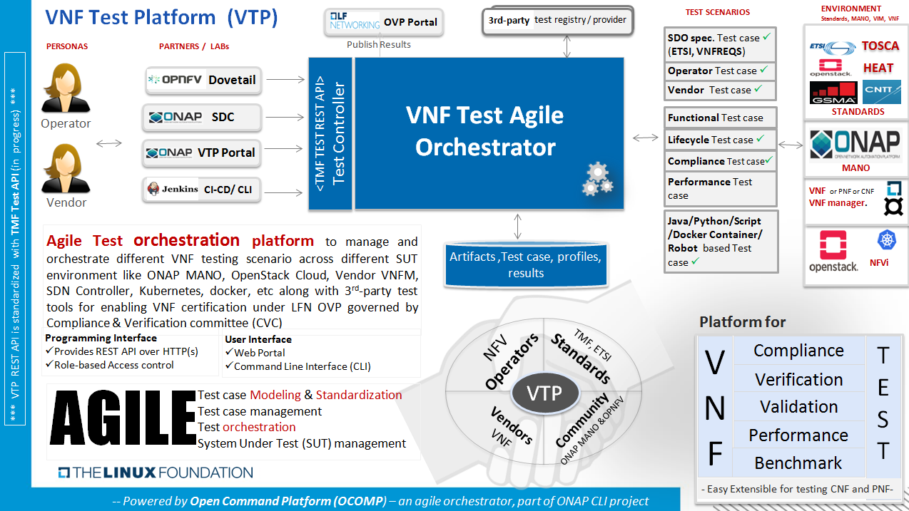

[<< Back](../)

# 8. E2E Framework Integration

## Table of Contents
* [8.1 Introduction](#8.1)
* [8.2 Relevant Community Projects and Initiatives](#8.2)
   * [8.2.1 Functest](#8.2.1)
   * [8.2.2 Yardstick](#8.2.2)
   * [8.2.3 Bottlenecks](#8.2.3)
   * [8.2.4 Test Tools](#8.2.4)
   * [8.2.5 Scenario Descriptor File (SDF)](#8.2.5)
* [8.3 Integrated E2E Framework](#8.3)
  * [8.3.1 NFVI Integrated E2E Framework (Playbook)](#8.3.1)
  * [8.3.2 VNF Integrated E2E Framework (Playbook)](#8.3.2)

## 8.1 Introduction

Define the purpose of the chapter which is to:
-	Identify Framework Needs, Goals, and Dependencies
- Define Opensource Integration (OPNFV, OVP, Functest, CVC, others)
- Provide Automation Toolchain (list, topology, flow)

## 8.2 Relevant Community Projects and Initiatives

### 8.2.1 Functest

[Functest](https://functest.readthedocs.io/en/stable-iruya/) was initially
created to verify OPNFV Installers and Scenarios and then to publish fair,
trustable and public results regarding the status of the different opensource
technologies, especially for Neutron backends (e.g. Neutron agents,
OpenDaylight, OVN, etc.). It has been continuously updated to offer the best
testing coverage for any kind of OpenStack and Kubernetes deployments
including production environments. It also ensures that the platforms meet
Network Functions Virtualization requirements by running and testing VNFs
amongst all tests available.

Functest is driven by a true verification of the platform under test as opposed
to the interoperability programs such as
[RefStack](https://refstack.openstack.org/) or
[OPNFV Verification Program](https://www.opnfv.org/verification) which select
a small subset of Functional tests passing in many different
opensource software combinations:
- tests are skipped if an optional support is missing (e.g.
  [Barbican](https://docs.openstack.org/barbican/latest/) or networking
  features such as
  [BGPVPN interconnection](https://docs.openstack.org/networking-bgpvpn/latest/)
  or
  [Service Function Chaining](https://docs.openstack.org/networking-sfc/latest/))
- tests are parameterized (e.g. shared vs non-shared live migration)
- blacklist mechanisms are available if needed

It should be noted that
[the RefStack lists](https://refstack.openstack.org/#/guidelines) are included
as they are in Functest in the next 3 dedicated testcases:
- refstack_compute (OpenStack Powered Compute)
- refstack_object (OpenStack Powered Object Storage)
- refstack_platform (OpenStack Powered Platform)

Functest also integrates
[Kubernetes End-to-end tests](https://kubernetes.io/blog/2019/03/22/kubernetes-end-to-end-testing-for-everyone/) and allows verifying Kubernetes Conformance (see
[k8s-conformance](https://build.opnfv.org/ci/job/functest-kubernetes-opnfv-functest-kubernetes-smoke-iruya-k8s_conformance-run/206/console)).

Dovetail (OVP) mostly leverages on Functest but only runs a small part of
Functest (~15% of all functional tests, no benchmarking tests, no VNF
deployment and testing). It's worth mentioning that Functest is patched to
[disable API verification](https://github.com/opnfv/dovetail/tree/master/etc/patches/functest/disable-api-validation) which has differed from OpenStack rules for
years.

Then Functest conforms with the upstream rules (versions, code quality, etc.)
and especially their
[gates](https://docs.openstack.org/infra/system-config/devstack-gate.html)
(a.k.a. the automatic verification prior to any code review)
to preserve the quality between code and deployment.
In that case, Functest can be considered as a smooth and lightweight
integration of tests developed upstream (and the Functest team directly
contributes in these projects:
[Rally](https://github.com/openstack/rally-openstack),
[Tempest](https://github.com/openstack/tempest), etc.).
It's worth mentioning that, as opposed to the OpenStack Gates leveraging on
[DevStack](https://docs.openstack.org/devstack/latest/), it can check the same
already deployed SUT over and over even from a
[Raspberry PI](https://www.raspberrypi.org/). Here the testcases can be
executed in parallel vs the same deployment instead of being executed vs
different pools of virtual machines.

Here are the functional tests (>2000) running in OpenStack gates integrated in
Functest Smoke (see
[Functest daily jobs](https://build.opnfv.org/ci/view/functest/job/functest-iruya-daily/190/) for more details):

| Testcases                  | Gates              |
| :------------------------- | :----------------- |
| tempest_full               | General            |
| tempest_slow               | General            |
| tempest_scenario           | General            |
| neutron-tempest-plugin-api | Neutron            |
| patrole                    | Patrole            |
| barbican                   | Barbican           |
| networking-bgpvpn          | Networking BGP VPN |
| networking-sfc             | Networking SFC     |

To complete functional testing, Functest also integrates a few
[performance tools](https://docs.openstack.org/developer/performance-docs/methodologies/tools.html)
(2-3 hours) as proposed by OpenStack:

| Testcases  | Benchmarking                |
| :--------- | :-------------------------- |
| rally_full | Control Plane (API) testing |
| rally_jobs | Control Plane (API) testing |
| vmtp       | Data Plane testing          |
| shaker     | Data Plane testing          |

And VNFs automatically deployed and tested :

| Testcases    | Benchmarking                        |
| :----------- | :---------------------------------- |
| cloudify     | Cloudify deployment                 |
| cloudify_ims | Clearwater IMS deployed via Coudify |
| heat_ims     | Clearwater IMS deployed via Heat    |
| vyos_vrouter | VyOS deployed via Cloudify          |
| juju_epc     | OAI deployed via Juju               |

Functest should be considered as a whole as it meets multiple objectives about
the reference implementation:
- verify all APIs (services, advances, features, etc.) exposed by the reference
  implementation
- compare the reference implementation and local deployments from a functional
  standpoint and from OpenStack control plane and dataplane capabilities

It's worth mentioning that Functest already takes into account the first CNTT
[profiles](https://git.opnfv.org/functest/tree/functest/ci/config_patch.yaml#n2).
CNTT should simply add the next Functest inputs according the reference
implementation:
- [Functest inputs](https://github.com/opnfv/functest/blob/stable/iruya/functest/utils/env.py#L17)
- [tempest specific configuration](https://github.com/opnfv/functest/blob/stable/iruya/functest/opnfv_tests/openstack/tempest/custom_tests/tempest_conf.yaml)

Additional links:
- [Homepage](https://functest.readthedocs.io/en/stable-iruya/)
- [Run Alpine Functest containers (Iruya)](https://wiki.opnfv.org/pages/viewpage.action?pageId=35291769)
- [Deploy your own Functest CI/CD toolchains](https://wiki.opnfv.org/pages/viewpage.action?pageId=32015004)
- [Functest gates](https://build.opnfv.org/ci/view/functest/)

### 8.2.2 Yardstick

### 8.2.3 Bottlenecks

### 8.2.4 Test Tools
1. Shaker:  https://pyshaker.readthedocs.io/en/latest/ (The distributed data-plane testing tool built for OpenStack)
2. Sonubuoy: https://sonobuoy.io/ It is a diagnostic tool that makes it easier to understand the state of a Kubernetes cluster by running a set of plugins (including Kubernetes conformance tests) in an accessible and non-destructive manner.

### 8.2.5 Scenario Descriptor File (SDF)
As defined by OPNFV, Scenarnio Descriptor File's (SDF) will be utilized to relay information from the Scenario Designer (or Test Manager), to Release Managers, CI Pipeline Owners, and Installer Agents, to define test scenario content, and specifications.

SDF's will contain, but not limited to, the following Metadata, Components, Deployment Options, Deployment Tools, and Hardware prerequistes:

- **Metadata**
  - Name
  - History
  - Purpose
  - Owner
- **Components**
  - e.g. SDN controllers
  - Versions
  - Optional features, e.g. NFV features
- **Deployment Options**
  - Hardware types
  - Virtual deploy
  - HA, NUMA
- **Deployment Tools**
  - Supporting installers.
  - Valid options per installer.

## 8.3 Integrated E2E Framework

> Proposed integraed E2E Framework.

### 8.3.1 NFVI Integrated E2E Framework.

> using existing testing framework, proposal of an E2E integrated one to be used fir NFVI testing.

### 8.3.2 VNF Integrated E2E Framework.

As detailed in the CNTT RC chapter 05 on E2E VNF test platform requirements,
ONAP VNF Test Platform (VTP) helps to perform the VNF certification process by
addressing those requirements. And following sections provides required
guidelines and details for platform and test cases.

#### 8.3.2.1 Platform Architecture

Provides details on the architecture, components and it's responsibilities.

-   **Test Controller**: For every feature supported in VTP, Test controller
    provides required REST API along with user authentication and authorization
    based on given tenant?.

-   **Agile Test Orchestrator**: Dynamically allows to on-board and execute the
    test cases and test flows across different run-time environment on given
    System under test (SUT) along with required supported system in place.

-   **Portal & CLI**: To operate and manage the VTP features, Portal? provides
    web 2.0 based graphical user interface along with Command line interface.

-   **Test case plug-ins**: Test cases are on-boarded into the system as
    independent plug-ins (developed using different programming/scripting
    language) and/or plain text yaml file for those supported as profile in VTP
    (such as HTTP, SNMP, etc)

-   **Repository**: Provides version controlled repository for persisting
    various aspects of the VTP such as artifacts, results, reports, etc.

*? - Feature in-progress*

#### ### 8.3.2.2 Platform administrator guide

Provides detail on installation, configuration, un-installation operations.

VTP is provided a script for performing installation and mange the installed VTP
services as below:

[vpt_install.sh](https://github.com/onap/vnfsdk-refrepo/blob/master/vnfmarket-be/deployment/install/vtp_install.sh)

**--download** : It will download all required artifacts into /opt/vtp_stage

**--install** : It will install VTP (/opt/controller) and CLI (/opt/oclip)

**--start** : It will start VTP controller as tomcat service and CLI as oclip
service

**--verify** : It will verify the setup is done properly by running some test
cases

**--uninstall** : It will stop and uninstall the VTP

**--clean** : It will remove the downloaded artifacts

Customize the download URL as below from latest snapshot or release onap
repository

export OCLIP_DOWNLOAD_URL="https://nexus.onap.org/content/repositories/snapshots/org/onap/cli/cli-zip/4.0.0-SNAPSHOT/cli-zip-4.0.0-20190904.095516-170.zip"

export VTP_DOWNLOAD_URL="https://nexus.onap.org/content/repositories/snapshots/org/onap/vnfsdk/refrepo/vnf-sdk-marketplace/1.3.3-SNAPSHOT/vnf-sdk-marketplace-1.3.3-20190903.092849-18.war"

export CSAR_VALIDATE_DOWNLOAD_URL="https://nexus.onap.org/content/repositories/snapshots/org/onap/vnfsdk/validation/csarvalidation-deployment/1.2.2-SNAPSHOT/csarvalidation-deployment-1.2.2-20190904.082836-6.zip"

export CSAR_VALIDATE_JAR_DOWNLOAD_URL="https://nexus.onap.org/content/repositories/snapshots/org/onap/vnfsdk/validation/validation-csar/1.2.2-SNAPSHOT/validation-csar-1.2.2-20190904.082829-6.jar"

#### 8.3.2.3 Test case development guide

Provides details on how to develop new test cases and packages them for
deploying.

[More details](https://wiki.onap.org/pages/viewpage.action?pageId=43386304)

#### 8.3.2.4 Test case model guide

Model the required test cases for various scenario, which could help in
standardizing the test cases for various NF, different compliance and multiple
MANO/NFVi based LCM operations.

[More details](https://wiki.onap.org/pages/viewpage.action?pageId=43386304)

#### 8.3.2.5 Test case administrator guide

Provides detail on installation, configuration, un-installation operations

[More details](https://wiki.onap.org/pages/viewpage.action?pageId=43386304)
