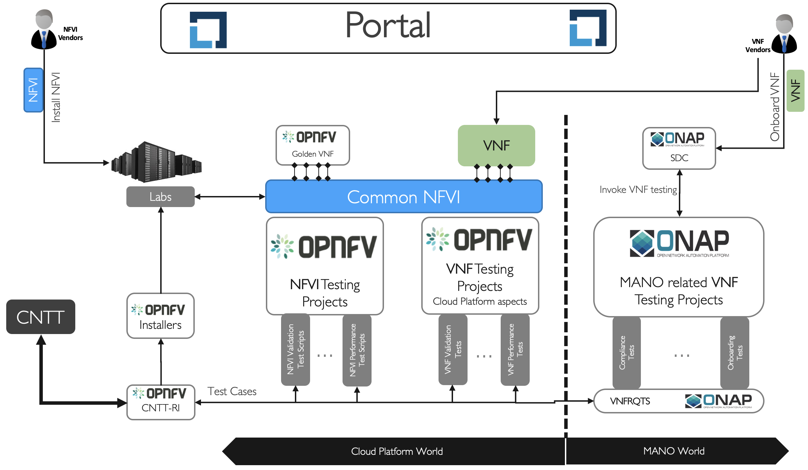
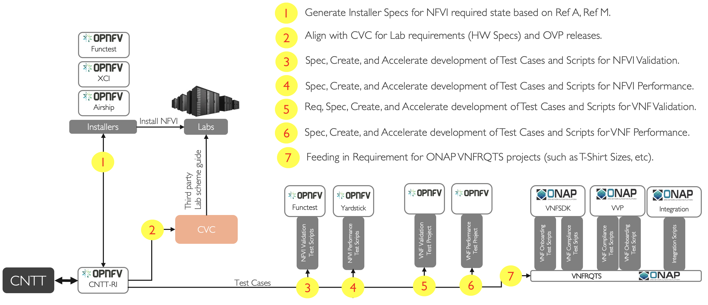

[<< Back](../)

# 1. Overview

## Table of Contents
* [1.1 Introduction.](#1.1)
  * [1.1.1 About CNTT-RI.](#1.1.1)
  * [1.1.2 Relationship with other communities.](#1.1.2)
* [1.2 Terminology.](#1.2)
* [1.3 Scope.](#1.3)
* [1.4 Roadmap.](#1.4)

## 1.1 Introduction

### 1.1.1 About CNTT-RI

### 1.1.2 Relationship with other communities

<b>Figure 1-1:</b> CNTT-RI Relationship with other communities.

## 1.2 Terminology

## 1.3 Scope

<b>Figure 1-2:</b> CNTT-RI Scope.

## 1.4 Roadmap
