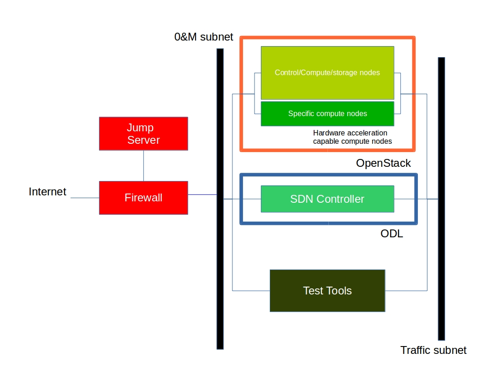
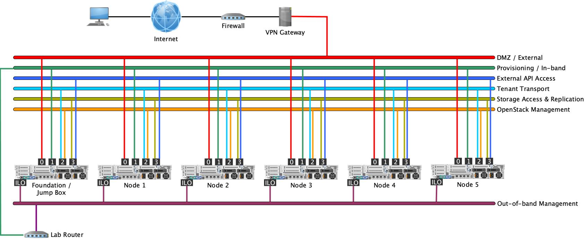

[<< Back](../)

# 4. Lab Requirements

## Table of Contents
* [4.1 Introduction](#4.1)
* [4.2 Lab Requirement](#4.2)
* [4.3 Lab Topology](#4.3)
* [4.4 Lab Use Guidelines](#4.4)
* [4.5 OPNFV Pharos Project](#4.5)

## 4.1 Introduction
This chapter provides the laboratory hardware requirements needed to deploy the reference implementation.  These requirements represent a minimum set of requirements, where different labs may have hardware or capabilities exceeding these minimum specifications.

The lab provides a set of physical servers, supported by a dedicated network infrastructure.  Users should be provided access to the servers, their operating systems, and out-of-band management (i.e. IPMI, IDRAC, ILO, etc.).

## 4.2 Lab Requirements

Labs are organized into one or more *Pods*, where the *Pod* provides the complete set of resources [servers and network(s)] necessary to support the reference implementation installation and operation.

A CNTT compliant *Pod* shall meet the following requirements.

1. One (1) physical server dedicated as a Jump / Test Host
2. Six (6) physical servers, serving as either compute or controllers
3. A configured network topology allowing for: Out-of-Band Management, Admin, Public, Private, and Storage Networks

The Jump Host / Test Host system will be utilized to install and manage the operation of the *Pod*.  For example, the system can be used to host the installer software used to deploy and configure OpenStack on the other physical servers.  Once installed, the system may be used to run test automations or it may be used to generate test traffic intended to measure the performance of a VNF operating within the *Pod*.  To support these operations, the physical server provided for the Jump / Test Host shall meet the same hardware requirements as compute / controller, as outline below.  In this context, the system may be considered as a miscellaneous use  or general purpose system.

### 4.2.1 Physical Server Requirements
Each server shall meet the following minimum specifications:

- **CPU**
  - 2x x86_64 CPU sockets (both populated), providing 24 cores each, 48 simultaneous multi-threads (SMT), at 2.2 GHz
- **Memory**
  - 512 GB RAM
- **Storage**
  - 3.2 TB SSD via SATA 6 Gbps
  - Storage should present as at least 3 or more disks to the OS, allowing for usage as CEPH storage nodes, or similar.
- **Network Interfaces** (note 1)
  - 4x 25 Gbps Ethernet Ports, implemented as two separate dual port NICs
  - Out-of-band Management Port

Note 1: At least 1 network interface must be capable of performing PXE boot and that network must be available to both the Jump / Test Host and each physical server.

## 4.2.2 Lab Network Hardware & Topology

Labs that are hosting multiple *Pods* should utilize a leaf / spine topology when interconnecting *Pods* or physical servers. This is especially important in the cases where the physical servers constituting a *Pod* are not located in the same physical rack or are not connected to the same leaf switch. At least one leaf switch will be provided for each *Pod*, with interface speeds matching the above server specifications.  In this context, the reference to the single leaf refers to the logical appearance of switch, compared to topologies providing 2 or more leaf switches to provide high availability.

Leaf switches must provide interfaces matching the physical server specifications above and northbound (spine connections) of 100 Gbps connections. Spine switches must provide the corresponding 100 Gbps interfaces to each leaf switch.  The minimum requirement is one spine switch.

The minimum networking configuration must provide at least VLANs to partition the various networks required for the reference implementation deployment and separation of each *Pod*, if multiple *Pods* are hosted within the labs.

The *Pod* network topology should provide at least 2 networks with preallocated IP addressing schemes for the *out-of-band management* network and the *Public* network.  The *Public* network must be able to reach / access the public Internet.  At least IPv4 addresses must be available, ideally IPv6 address space should also be supported.

Remote users shall access the lab via a VPN gateway, that shall also provide basic security and separation from the public Internet.  Both the *Public* and *out-of-band management* networks shall be accessible through the VPN connection.

***EDITORS NOTE: Provide a figure showing the basic lab topology, include the VPN, Pod / Servers, Switch, and management / public networks.***

## 4.4 Lab Use Guidelines

**SETUP & Maintenance**

OPNFV will facilitate the need for lab procurement, as required, for projects which come into their front door for verification and validation.

Individual companies that donated a lab would be responsible for setup and maintenance of a community lab. Labs, once setup, will be shared and posted in a wiki https://wiki.opnfv.org/display/pharos/Community+Labs.

The wiki will contain information such as:
- Lab Location
- Number of physical and virtual PODS which are available
- Contact person
- Policy info for use
- Access instructions, include VPN
- Lab Topology
- Resource Availability

**N+1 Labs Use Strategy**

The "lab" concept could mean one physical POD or multiple PODs in a community lab.  In practice, a person requesting a lab can apply for multiple PODs, where POD 1 can be "Lab 1", POD 2+3 can be "Lab 2", etc, all subject to the availability of PODs. Each "Lab" can be used for different purpose such as "Reference Implementation (RI) Lab 1" (POD 1), "RI Lab 2" (POD 2+3), etc.

The requester for labs needs to know only the number of PODs that are needed.  Then, apply for use of PODs according to the requirement.

Talk to the Lab Owners if special hardware or topology requirements are needed, such as special NIC or hardware accelerators or if 8 servers in one POD is a different default setting from the lab settings.  The Lab Owner will check to see if lab config changes can be made to accommodate the test need.

**Lab Quantities and Duration of Lab Use**

There is no limit to the number of labs which can be secured, or the duration.  The limiting factor is resource available.  Lab Owners reserve the right to reclaim underutilized labs and reassign to other teams where there is demand for labs.  It is important that the Lab User have a schedule and plan in place to utilize the labs to retain the lab for testing.

## 4.5 OPNFV Pharos Project

For this RI, the OPNFV Pharos specification has been chosen as labs with pods of servers already exist under OPNFV's
Lab as a Service (LaaS).

The Pharos Project deals with developing an OPNFV lab infrastructure that is geographically and technically diverse. This
will greatly assist in developing a highly robust and stable OPNFV platform. Community labs are hosted by individual
companies and there is also an OPNFV lab hosted by the Linux Foundation that has controlled access for key development
and production activities. The Pharos Specification defines a “compliant” deployment and test environment. Pharos is
responsible for defining lab capabilities, developing management/usage policies and process; and a support plan for
reliable access to project and release resources. Community labs are provided as a service by companies and are not
controlled by Pharos however our goal is to provide easy visibility of all lab capabilities and their usage at all-times.

A requirement of Pharos labs is to provide bare-metal for development, deployment and testing. This is resource intensive
from a hardware and support perspective while providing remote access can also be very challenging due to corporate IT
policies. Achieving a consistent look and feel of a federated lab infrastructure continues to be an objective. Virtual
environments are also useful and provided by some labs. Jira is currently used for tracking lab operational issues as
well as for Pharos project activities.

### 4.5.1 Pharos Specification

The Pharos Specification defines a hardware environment for deployment and testing of the OPNFV platform release.

Pharos lab infrastructure has the following objectives:

* Provides secure, scalable, standard and HA environments for feature development
* Supports the full Euphrates deployment lifecycle (this requires a bare-metal environment)
* Supports functional and performance testing of the Euphrates release
* Provides mechanisms and procedures for secure remote access to Pharos compliant environments for OPNFV community
* Deploying OpenStack in a Virtualized environment is possible and will be useful, however it does not provide a fully
  featured deployment and realistic test environment for the Euphrates release of OPNFV.

The high level architecture is outlined in the following diagram:

A pharos compliant OPNFV test-bed provides:

* One CentOS/Ubuntu jump server (Foundation Node) which can be used to perform the OpenStack RI installation, or host any
  additional software needed.  This server may also participate in the OpenStack cluster if desired instead of acting as
  a dedicated services node.
* 5 target nodes which can be used in any combination, such as:
  * 3 controller nodes + 2 compute/storage nodes
  * 1 controller node + 4 compute/storage nodes
  * 1 controller node + 1 compute node + 3 storage nodes
* A configured network with the ability to provide the following networks:
  * Out-of-band Management: Used for access to the lights out (ILO/IMPI/Redfish) network for the purpose of managing the
    bare metal aspects of the servers, such as power control, BIOS configuration, etc.
  * External (DMZ): Used to provide VMs with Internet access.  Directly accessible from the VPN.
  * Provisioning / In-band Management (Admin): to perform management operations on the hypervisor software for each
    node.  Can also be used for bootstrapping images using PXE or other installation technologies.
  * API Access (Public): Exposes all OpenStack APIs, including the OpenStack Networking API, to tenants.
  * Tenant Transport (Private): Used for VM data communication within the cloud deployment. The IP addressing requirements
    of this network depend on the OpenStack Networking plug-in in use and the network configuration choices of the virtual
    networks made by the tenant.
  * Storage Access (Storage): Exposes SDS services to client read/write requests. This is the data path for access to
    the content of the storage nodes, and also doubles as the storage replication network to provide data replication
    between storage nodes.
  * OpenStack Management (Management): Used for internal communication between OpenStack Components.

For the purpose of this RI, the following diagram illustrates the networks and node connectivity.

## 4.5.2 Hardware Specification

CPU:

* Intel Xeon E5-2600v2 Series or newer
* AArch64 (64bit ARM architecture) compatible (ARMv8 or newer)

Firmware:

* BIOS/EFI compatible for x86-family blades
* EFI compatible for AArch64 blades

Local Storage:

Below describes the minimum for the Pharos spec, which is designed to provide enough capacity for a reasonably functional
environment. Additional and/or faster disks are nice to have and mayproduce a better result.

* Disks: 2 x 1TB HDD + 1 x 100GB SSD (or greater capacity)
* The first HDD should be used for OS & additional software/tool installation
* The second HDD is configured for CEPH OSD
* The SSD should be used as the CEPH journal
* Virtual ISO boot capabilities or a separate PXE boot server (DHCP/tftp or Cobbler)

Memory:

* 32G RAM Minimum

## 4.5.3 Network Specification

Network Hardware

* 24 or 48 Port TOR Switch
* NICs - Combination of 1GE and 10GE based on network topology options (per server can be on-board or use PCI-e)
* Connectivity for each data/control network is through a separate NIC. This simplifies Switch Management however requires
  more NICs on the server and also more switch ports
* BMC (Baseboard Management Controller) for lights-out mangement network using IPMI (Intelligent Platform Management Interface)

Network Options

* Option I: 4x1G Control, 2x10G Data, 48 Port Switch
  * 1 x 1G for lights-out Management
  * 1 x 1G for Admin/PXE boot
  * 1 x 1G for control-plane connectivity
  * 1 x 1G for storage
  * 2 x 10G for data network (redundancy, NIC bonding, High bandwidth testing)
* Option II: 1x1G Control, 2x 10G Data, 24 Port Switch
  * Connectivity to networks is through VLANs on the Control NIC
  * Data NIC used for VNF traffic and storage traffic segmented through VLANs
* Option III: 2x1G Control, 2x10G Data and Storage, 24 Port Switch
  * Data NIC used for VNF traffic
  * Storage NIC used for control plane and Storage segmented through VLANs (separate host traffic from VNF)
  * 1 x 1G for lights-out mangement
  * 1 x 1G for Admin/PXE boot
  * 2 x 10G for control-plane connectivity/storage
  * 2 x 10G for data network

For this RI, Option III has been chosen.
