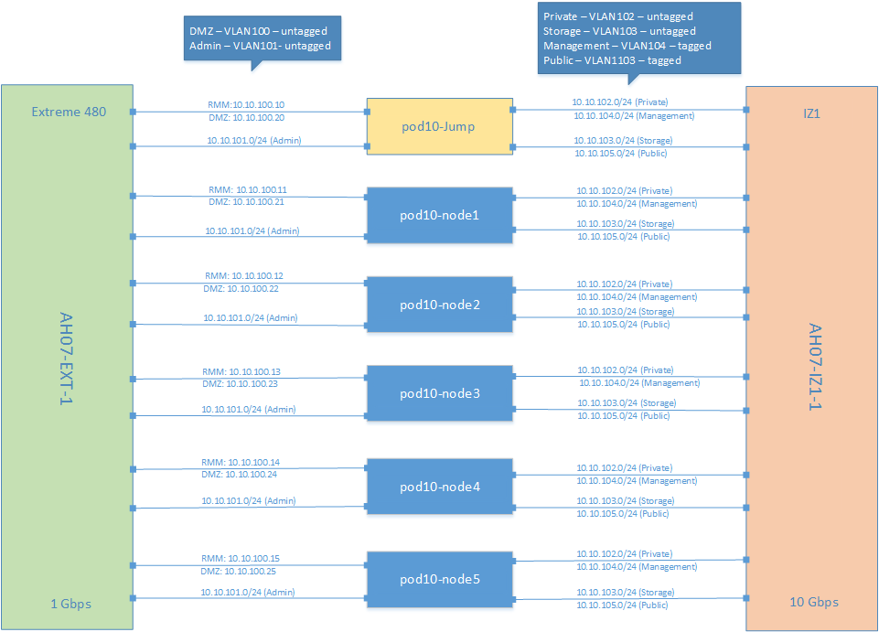

[<< Back](../)

# 7. Integration

## Table of Contents
* [7.1 Introduction](#7.1)
* [7.2 Pre-requisites](#7.2)
* [7.3 Requirements Gathering](#7.3)
* [7.4 Access and Connectivity](#7.4)
* [7.5 Available Installers](#7.5)
* [7.6 Deployment Installer & Install Steps](#7.6)
* [7.7 Deployment Validations](#7.7)
* [7.8 CICD Tool Chain (use of, process, and scripts)](#7.8)
* [7.9 Jenkins Setup & Job Creation](#7.9)
* [7.10 Compliance Validation (steps, process)](#7.10)

## 7.1 Introduction

The purpose of this chapter is to establish an operational run-book containing sequences and steps explaining, with enough detail, how to install a Reference Implementation (RI).

The term Run-Book is synonymous with "Cookbook", and either term will be used interchangeably to indicate that if a user follows the steps or procedures in the "book", the expected result will be an RI identical to the lab utilized by CNTT for the instantiation and certification of RI-1.

It is assumed that the reader of this chapter has the skill set to install Common NFVI on their own labs.

*   Covers installers, automation, etc.
*   Integration of installers and components.

## 7.2 Prerequisites

The following hardware was cabled and set up according to the OPNFV Pharos Specification:

| Node  | CPU Model | Memory | HDD           | SSD         | 1 GbE NIC | 10 GbE NIC |
|-------|-----------|--------|---------------|-------------|-----------|------------|
| Jump  | 2xE5-2699 | 64 GB  | 1 x 3 TB Sata | 1 x 180 SSD | 2         | 2          |
| 1     | 2xE5-2699 | 64 GB  | 1 x 3 TB Sata | 1 x 180 SSD | 2         | 2          |
| 2     | 2xE5-2699 | 64 GB  | 1 x 3 TB Sata | 1 x 180 SSD | 2         | 2          |
| 3     | 2xE5-2699 | 64 GB  | 1 x 3 TB Sata | 1 x 180 SSD | 2         | 2          |
| 4     | 2xE5-2699 | 64 GB  | 1 x 3 TB Sata | 1 x 180 SSD | 2         | 2          |
| 5     | 2xE5-2699 | 64 GB  | 1 x 3 TB Sata | 1 x 180 SSD | 2         | 2          |

Each server has all of 1GbE NICs connected to the same Extreme 480 1GbE switch, and all 10GbE NICs conneted to the
same IZ1 switch as follows:

## 7.3 Requirements Gathering

Requirements gathering processes and steps:

1.  RA Requirements Gathering process
2.  Infra Requirements and Selection Process

## 7.4 Access & Connectivity

This RI leverages OPNFV Pharos pod 10, which is hosted by Intel and requires VPN access.  Requests for VPN access must
go through the OPNFV Infra Project by submitting a JIRA request for VPN access here: https://jira.opnfv.org/projects/INFRA

Upon completion, the VPN credentials and certificate will be sent via email.

Once VPN connectivity is established, the only available subnet is the "DMZ" network, which gives access directly to
the Foundation (jump) node.  All interaction with the RI must be done through this node.  It is possible to use
software such as sshuttle (https://sshuttle.readthedocs.io/en/stable/ ) to assist with routing inside the lab.

As an example, the following command adds the External API subnet route via sshuttle, allowing direct access from the client
side of the VPN into that subnet:

`sshuttle -r root@10.10.100.20 10.10.105.0/24`

This will allow the VPN client host to directly access the Horizon dashboard, as an example.

## 7.5 Available Installers

### 7.5.1 Airship

#### 7.5.1.1 Descriptor File Preparations

Reference steps describing the use, creation, and implementation of descriptor files.  This is where the Airship Manifest
files need to be documented:

- Profiles
- Hardware
  - Server
  - Device Aliases
  - Disk Aliases
- Nodes
- Networks
- Software
- PKI-Catalog
- Secrets
- Actions

#### 7.5.1.2 Deployment Installer & Install Steps

### 7.5.2 Future Installers

At this point, the RI is based on Airship, but can be extended to employ any other OpenStack distribution.

## 7.6 Deployment Installer & Install Steps

Steps and procedures for installing and setting up the RI.
Start pulling in content from: https://wiki.opnfv.org/display/AIR/Airship+Installer+Deployment+Guide

## 7.7 Deployment Validations

Details explaining:
- Validation Tests Run
- Expected outputs
- Explanation of Pass/Fail
- Disposition, or next steps, based on test results (e.g. handling of failures, handoff to next tier with passing results)

Description of the Functest suite and what is selected for validation testing.  Need to document the line between "validation of install" and "reference certification."  It has been stated that these might be one and the same, however deployment validation could be a simple smoke test prior to starting a full run.

## 7.8 CICD Tool Chain (use of, process, and scripts)]

Placeholder to describe the CICD tool chain used in RI validations.

Include flow diagram.

## 7.9 Jenkins Setup & Job Creation

Placeholder to describe the process, access, steps, instance, etc, information for the setup of Jenkins, the jobs required for validation, and the results dashboard.

## 7.10 Compliance Validation (steps, process)

Placholder to describe the purpose, steps, and process, using the Jenkins Jobs, Tool Chain, and Test Case requirements mapping to perform validations.
