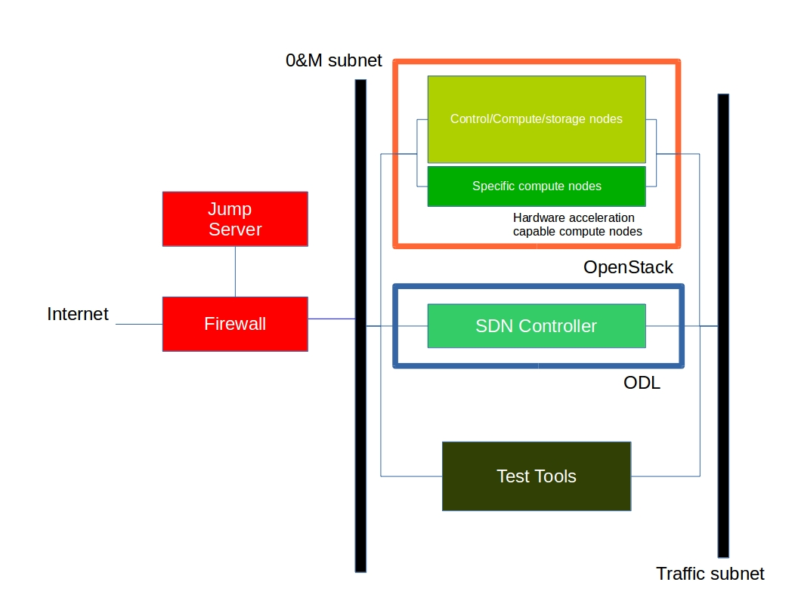
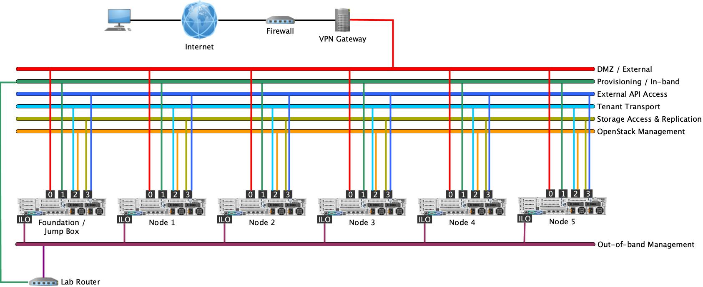

[<< Back](../)

# 9. Gaps analysis & Innovation

## Table of Contents
* [9.1 Introduction](#9.1)
* [9.2 OPNFV Pharos Project](#9.2)
* [9.3 Heading](#9.3)

## 9.1 Introduction

## 9.2 OPNFV Pharos Project
For this RI, the OPNFV Pharos specification has been chosen as labs with pods of servers already exist under OPNFV's
Lab as a Service (LaaS).

The Pharos Project deals with developing an OPNFV lab infrastructure that is geographically and technically diverse. This
will greatly assist in developing a highly robust and stable OPNFV platform. Community labs are hosted by individual
companies and there is also an OPNFV lab hosted by the Linux Foundation that has controlled access for key development
and production activities. The Pharos Specification defines a “compliant” deployment and test environment. Pharos is
responsible for defining lab capabilities, developing management/usage policies and process; and a support plan for
reliable access to project and release resources. Community labs are provided as a service by companies and are not
controlled by Pharos however our goal is to provide easy visibility of all lab capabilities and their usage at all-times.

A requirement of Pharos labs is to provide bare-metal for development, deployment and testing. This is resource intensive
from a hardware and support perspective while providing remote access can also be very challenging due to corporate IT
policies. Achieving a consistent look and feel of a federated lab infrastructure continues to be an objective. Virtual
environments are also useful and provided by some labs. Jira is currently used for tracking lab operational issues as
well as for Pharos project activities.

### 9.2.1 Pharos Specification

The Pharos Specification defines a hardware environment for deployment and testing of the OPNFV platform release.

Pharos lab infrastructure has the following objectives:

* Provides secure, scalable, standard and HA environments for feature development
* Supports the full Euphrates deployment lifecycle (this requires a bare-metal environment)
* Supports functional and performance testing of the Euphrates release
* Provides mechanisms and procedures for secure remote access to Pharos compliant environments for OPNFV community
* Deploying OpenStack in a Virtualized environment is possible and will be useful, however it does not provide a fully
  featured deployment and realistic test environment for the Euphrates release of OPNFV.

The high level architecture is outlined in the following diagram:

A pharos compliant OPNFV test-bed provides:

* One CentOS/Ubuntu jump server (Foundation Node) which can be used to perform the OpenStack RI installation, or host any
  additional software needed.  This server may also participate in the OpenStack cluster if desired instead of acting as
  a dedicated services node.
* 5 target nodes which can be used in any combination, such as:
  * 3 controller nodes + 2 compute/storage nodes
  * 1 controller node + 4 compute/storage nodes
  * 1 controller node + 1 compute node + 3 storage nodes
* A configured network with the ability to provide the following networks:
  * Out-of-band Management: Used for access to the lights out (ILO/IMPI/Redfish) network for the purpose of managing the
    bare metal aspects of the servers, such as power control, BIOS configuration, etc.
  * External (DMZ): Used to provide VMs with Internet access.  Directly accessible from the VPN.
  * Provisioning / In-band Management (Admin): to perform management operations on the hypervisor software for each
    node.  Can also be used for bootstrapping images using PXE or other installation technologies.
  * API Access (Public): Exposes all OpenStack APIs, including the OpenStack Networking API, to tenants.
  * Tenant Transport (Private): Used for VM data communication within the cloud deployment. The IP addressing requirements
    of this network depend on the OpenStack Networking plug-in in use and the network configuration choices of the virtual
    networks made by the tenant.
  * Storage Access (Storage): Exposes SDS services to client read/write requests. This is the data path for access to
    the content of the storage nodes, and also doubles as the storage replication network to provide data replication
    between storage nodes.
  * OpenStack Management (Management): Used for internal communication between OpenStack Components.

For the purpose of this RI, the following diagram illustrates the networks and node connectivity.

## 9.2.2 Hardware Specification

CPU:

* Intel Xeon E5-2600v2 Series or newer
* AArch64 (64bit ARM architecture) compatible (ARMv8 or newer)

Firmware:

* BIOS/EFI compatible for x86-family blades
* EFI compatible for AArch64 blades

Local Storage:

Below describes the minimum for the Pharos spec, which is designed to provide enough capacity for a reasonably functional
environment. Additional and/or faster disks are nice to have and mayproduce a better result.

* Disks: 2 x 1TB HDD + 1 x 100GB SSD (or greater capacity)
* The first HDD should be used for OS & additional software/tool installation
* The second HDD is configured for CEPH OSD
* The SSD should be used as the CEPH journal
* Virtual ISO boot capabilities or a separate PXE boot server (DHCP/tftp or Cobbler)

Memory:

* 32G RAM Minimum

## 9.2.3 Network Specification

Network Hardware

* 24 or 48 Port TOR Switch
* NICs - Combination of 1GE and 10GE based on network topology options (per server can be on-board or use PCI-e)
* Connectivity for each data/control network is through a separate NIC. This simplifies Switch Management however requires
  more NICs on the server and also more switch ports
* BMC (Baseboard Management Controller) for lights-out mangement network using IPMI (Intelligent Platform Management Interface)

Network Options

* Option I: 4x1G Control, 2x10G Data, 48 Port Switch
  * 1 x 1G for lights-out Management
  * 1 x 1G for Admin/PXE boot
  * 1 x 1G for control-plane connectivity
  * 1 x 1G for storage
  * 2 x 10G for data network (redundancy, NIC bonding, High bandwidth testing)
* Option II: 1x1G Control, 2x 10G Data, 24 Port Switch
  * Connectivity to networks is through VLANs on the Control NIC
  * Data NIC used for VNF traffic and storage traffic segmented through VLANs
* Option III: 2x1G Control, 2x10G Data and Storage, 24 Port Switch
  * Data NIC used for VNF traffic
  * Storage NIC used for control plane and Storage segmented through VLANs (separate host traffic from VNF)
  * 1 x 1G for lights-out mangement
  * 1 x 1G for Admin/PXE boot
  * 2 x 10G for control-plane connectivity/storage
  * 2 x 10G for data network

For this RI, Option III has been chosen.

## 9.3 Heading
