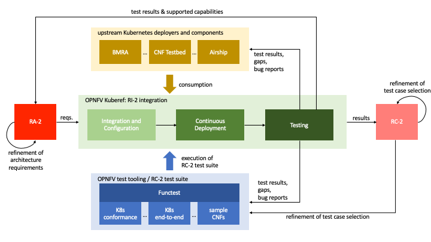

[<< Back](../)

# 1. Overview
<p align="right"></p>

## Table of Contents
* [1.1 Introduction](#1.1)
    * [1.1.1 About the Kubernetes Reference Implementation](#1.1.1)
    * [1.1.2 Structure of the document](#1.1.2)
    * [1.1.3 Terminology](#1.1.3)
* [1.2 Scope](#1.2)
* [1.3 Relationship to other communities](#1.4)
* [1.4 Reference Implementation Approach](#1.3)
    * [1.4.1 Host Provisioning](#1.3.1)
    * [1.4.2 Kubernetes Provisioning](#1.3.2)

<a name="1.1"></a>
## 1.1 Introduction

<a name="1.1.1"></a>
### 1.1.1 About the Kubernetes Reference Implementation

This document includes the requirements and deployment details of the Kubernetes-based Reference Implementation (RI2). This RI will conform to the architecture specification as defined in the [Kubernetes Based Reference Architecture (RA2)](../../../ref_arch/kubernetes/README.md), including alignment with the principles and requirements of the [Reference Model](../../../ref_model/README.md).

The RI will be used as follows:
* To develop the Reference Conformance (RC) document, which will document the tests that can be run against the RI or any Vendor Implementation (VI) to check conformance with the Kubernetes RA.
* By software vendors to be able to install Kubernetes platforms in their own environments in order to develop against the RI

In order to promote the quick deployment of the RI and avoid duplicating effort across communities, the RI community works closely with CNCF TUG, OVP, ONAP and TIP communities.

<a name="1.1.2"></a>
### 1.1.2 Structure of the document

The document first consolidates the requirements that need to be addressed by this RI in [Chapter 2](./chapter02.md). [Chapter 3](./chapter03.md) then details the requirements that need to be met in order for anyone to be able to install the RI, whether that be into a community lab, their own corporate or personal lab or some other environment such as CNF Testbed or a public cloud provider. An operational runbook is documented in [Chapter 4](./chapter04.md) to aid the deployment of the RI into a chosen environment and includes step-by-step instructions for a selection of installers as well as steps on how to validate the deployment. Finally, [Chapter 5](./chapter05.md) is a placeholder to allow the documentation of any gaps found during the development of this document and the associated artefacts.

<a name="1.1.3"></a>
### 1.1.3 Terminology

Terminology in this document will follow [CNTT Terminology](../../../common/glossary.md).

<a name="1.2"></a>
## 1.2 Scope

The scope of this document is as follows:
1. To generate eco-system requirements for the establishment of the RI, including labs, tooling, installers, releases and automation requirements
1. Provide a detailed description file for use by installers.
1. Provide detailed lab criteria and operations that are generic enough to allow any environment to be used as the "lab".
1. Provide an operational runbook for the RI, which includes detailed steps for the deployment and configuration of the RI into a chosen lab environment
1. Provide detailed design for automation of deployment and testing, provide continuous integration and delivery pipeline for the RI
1. Gap analysis with required actions for existing eco-system within adjacent community projects


<a name="1.3"></a>
## 1.3 Relationship to other communities and workstreams

The main communities involved in driving requirements and development of this RI are:

- **CNTT RC2 workstream**
  - The **RC2 workstream** within CNTT takes requirements from the RM and RA2 and identifies test cases and a test integration suite that will be used to verify and validate conformance of an implementation. RI2 will be a deployable reference for operators, vendors, and others to develop against.

- **OPNFV**
  - The **Kuberef** project in OPNFV acts as the main integration point for RI2: Its purpose it to provide all necessary glue code and mechanisms for i) integrating and configuring selected upstream Kubernetes deployers and components into a deployable platform, ii) continuously deploy the integrated platform in OPNFV labs and iii) run the latest RC2 test suite against the deployed platform. The test results are meant to be fed back to RA2 and RC2 to support the refinement of architecture requirements and the selection of test cases for the RC2 test suite.

  - The **Functest** project integrates available test tools and test cases from across the open source ecosystem into a single framework. In particular, it allows to run the test cases selected by the RC2 workstream and outputs a test result package for submission to the OVP program.

- **Compliance and Verification Committee & Cloud Native OVP aka OVP 2.0**
  - The Compliance and Verification Committee governs the Cloud Native OVP program which owns the definition of the end-to-end framework (tooling, process, tests, review, badging) used to verify conformance of a cloud native infrastructure implementation with the RA2 specifications.

- **CNCF - CNF Conformance, Kubernetes, etc.**
  - CNCF hosts a wide variety of projects providing software components for RI2, such as Kuberntes itself, deployment tooling (e.g. kubeadm and kubespray) as well as test suites (e.g., Kubernetes conformance).
  - The Telco User Group (TUG) is a forum within CNCF to identify and discuss telco requirements on the Kubernetes ecosystem.
  - The CNF Conformance project in CNCF has a stated aim to provide "visibility into how well Cloud native Network Functions (CNFs) and the underlying Telecom platform follows cloud native principles".
  - The CNF Testbed is an initiative providing a framework for building and deploying technology show cases with a strong focus on telco platform requirements.

The following figure gives an overview of the relationship of the communities involved.

<p align="center"></p>
<p align="center"><b>Figure 1-1:</b>Relationship of Communities.</p>


<a name="1.4"></a>
## 1.4 Reference Implementation Approach

The approach this RI will take is to separate out the deployment in to two layers:
1. Automation of the infrastructure on which the RI will be installed (i.e. networks, storage, servers, etc.)
1. Automation of the RI installation itself

Meaning, initially, the RI is not looking to have a single installer that can both build out virtual or physical machines **and** build out the Kubernetes and other components. The primary reason for this was to ensure the loose coupling between the two layers, to drive the concept that RI2 is a standalone platform that can (in theory at least) be deployable to any infrastructure, whether that be some physical machines in a lab, or virtual machines in a private or public cloud environment, for example. To combine the deployment of machines and Kubernetes platform with a single installer would potentially limit the locations on which the RI can be installed.

The following subsections provide an overview of the provisioning stages as they are currently planned. However, that's not to say full end-to-end installers aren't welcome, but if used we must be clear on the limitations and compromises made when we document them in [Chapter 4](./chapter04.md).

<a name="1.4.1"></a>
### 1.4.1 Host Provisioning
> Add high level description of host provisioning stage

<a name="1.4.2"></a>
### 1.4.2 Kubernetes Provisioning

For provisioning Kubernetes in the Reference Implementation, existing open source tools should be used to set up the cluster. The goal is to cover the requirements listed in the Kubernetes Based Reference Architecture (RA2), but due to the scope this will be done through multiple iterations, starting with a subset of requirements and expanding the deployment over time.

Initial efforts have been looking at the features of different installers, which has been used to select a few open source Kubernetes provisioning tools for proof of concept deployments. Common for these tools is the use of Ansible and Helm to assist with deploying Kubernetes, configuring the host, and adding additional features and functionality to the cluster.

Depending on the tool used for provisioning, there are likely configuration parameters that will need to be modified before running the installer:
- Host information (IPs for SSH)
- Cluster information (Master/worker node distribution and datastore)
- CPU isolation (Kernel)
- Memory allocation (Hugepages)
- Network interfaces (PFs/VFs and drivers)
- Additional Kubernetes features (device plugins, CNIs)

Once completed, the cluster must be accessible through the `kubectl` CLI from the master nodes. It is possible to interact with the
cluster from a jumphost outside of the cluster by using the kubeconfig file, usually found in `$HOME/.kube/config` on the master nodes. This file can be copied to the jumphost and referenced through the `KUBECONFIG` environment variable, after which the cluster can be managed through `kubectl` from the jumphost.

While the presentation of resources can depend on the specific features and functionality, a good way to start is to check the node
status for allocatable resources as follows:
```
kubectl get nodes
kubectl get node <NAME> -o json | jq ".status.allocatable"
```

Resources related to networks are usually handled differently, with the exception of hardware resources which are usually listed under each node. There are two common CNI multiplexers that are both considered for the RI2, [Multus](https://github.com/intel/multus-cni) and [DANM](https://github.com/nokia/danm). They both provide similar functionality, but with some differences in how resources are defined, configured, and consumed.

For the ongoing proof of concept work related to both RA2 and RI2, some of the features specifically aimed at production ready deployments are initially omitted. These features are mostly part of the below topics:
- High availability
- Network infrastructure
- Storage
- Security

As work progresses with the proof of concept it is expected that additional features will be added.
