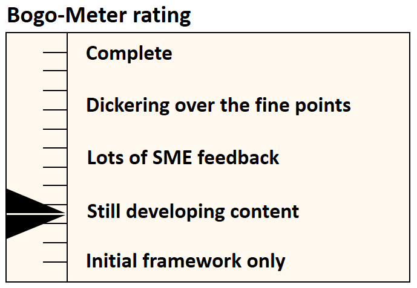

[<< Back](../)

# 4. Operational Runbook
<p align="right"></p>

## Table of Contents
* [4.1 Introduction](#4.1)
* [4.2 Prerequisites](#4.2)
* [4.3 Installation of the Reference Implementation](#4.3)
  * [4.3.1 Host Provisioning](#4.3.1)
  * [4.3.2 Kubernetes Provisioning](#4.3.2)
* [4.4 Validation of the Reference Implementation](#4.4)
* [4.5 Automation Tooling](#4.5)

<a name="4.1"></a>
## 4.1 Introduction

This chapter documents the steps to deploy Kubernetes based Reference Implementation (RI-2) according to RA-2. The entire deployment has been tested in OPNFV Labs as a part of the [OPNFV Kuberef project](https://wiki.opnfv.org/display/KUB/Kuberef). The Kuberef project stores all the code needed to deploy RI-2 and hence serves as a reference platform for CNF vendors to develop and test against. Currently, Kuberef only focuses on bare-metal RI2 deployments, but support for other uses cases (running on Packet, other infrastructure providers, etc.) will be added as the development progresses.

The entire installation is divided into two stages - Host provisioning and Kubernetes provisioning. Host provisioning is the operation of preparing a host before the software stack can be installed on them. This includes (and not limited to) installing an operating system, configuring network so that the hosts are reachable via SSH, configuring storage, etc. This stage can be skipped when using pre-provisioned hardware, infrastructure providers, etc. The Kubernetes provisioning stage is agnostic to the host provisioning stage, in that there is no dependency between the installer used for the Kubernetes provisioning stage and any tools used in the host provisioning stage.

<a name="4.2"></a>
## 4.2 Prerequisites

You need one physical server acting as a jump server along with minimum of two additional servers on which RI-2 will be deployed. Please refer to [Chapter 3](./chapter03.md) for detailed information on the server and network specifications.

<a name="4.3"></a>
## 4.3 Installation of the Reference Implementation

<a name="4.3.1"></a>
### 4.3.1 Installation on Bare Metal Infratructure

This section describes how to get started with RI-2 deployment on bare metal servers.

For the host provisioning stage, a former OPNFV bare-metal provisioner XCI, now referred to as [Cloud Infra Automation Framework](https://docs.nordix.org/submodules/infra/engine/docs/user-guide.html#framework-user-guide) and hosted by Nordix Labs has been used in the host provisioning stage is used. This framework uses [Bifrost](https://docs.openstack.org/bifrost/latest/) for provisioning virtual and bare-metal hosts. It performs this automated deployment by using Ansible playbooks and [Ironic](https://docs.openstack.org/ironic/latest/). For Kubernetes provisioning, [Bare Metal Reference Architecture (BMRA)](https://builders.intel.com/docs/networkbuilders/container-bare-metal-for-2nd-generation-intel-xeon-scalable-processor.pdf) has been used. This framework uses scripts available on [Github](https://github.com/intel/container-experience-kits) (version v1.4.1).

Before initiating a deployment, two configuration templates, referred to as POD Descriptor File (PDF) and Installer Descriptor File (IDF) in OPNFV terminology need to be defined under `hw_config/<vendor>`. Both PDF and IDF files are modeled as YAML schema.

A PDF is a hardware configuration template that includes hardware characteristics of the jumphost host and the set of compute/controller hosts. For each host, the following characteristics should be defined:
- CPU, disk and memory information
- Remote management parameters
- Network interfaces list including name, MAC address, IP address, link speed

IDF includes information about network information required by the installer. All the networks along with possible VLAN, DNS, and gateway information should be defined here.

More details regarding these descriptor files as well as their schema are very well documented in [RI-1 Chapter 8](../../cntt-ri/chapters/chapter08.md#opnfv-descriptor-files-1).

For the high availability requirement at least 3 nodes should be running as master with etcd enabled, but only a single master (and worker) is required to deploy the cluster. Node roles are configured through the vendor specific IDF file.

The following configuration options in `sw_config/bmra/all.yml` are set to specific values according to RA-2 requirements. Its recommended not to change them (except for debugging and development purposes).

[CPU Manager for Kubernetes](https://github.com/intel/CPU-Manager-for-Kubernetes)
```
cmk_enabled: false
  # Provides core affinity and isolation of workloads
  # Can be enabled if the native CPU Manager is insufficient for workloads
cmk_hosts_list: <csv of hosts where CMK should be deployed>
  # Update the list if CMK is enabled
cmk_shared_num_cores: <#>
cmk_exclusive_num_cores: <#>
  # Number of cores that will be added to the shared and exclusive pools of CMK if enabled
```
[SR-IOV Network device plugin for Kubernetes](https://github.com/intel/sriov-network-device-plugin):
```
sriov_net_dp_enabled: true
  # Install SR-IOV Network device plugin
sriovdp_config_data: <json configuration of resources>
  # Update configuration according to PCI devices and planned network resources
  # Additional configuration is done through host_vars (see below)
```
[Intel Device Plugins for Kubernetes](https://github.com/intel/intel-device-plugins-for-kubernetes):
```
qat_dp_enabled: false
  # Can be enabled if supported by HW
gpu_dp_enabled: false
  # Can be enabled if supported by HW
```
[Telemtry Aware Scheduling](https://github.com/intel/telemetry-aware-scheduling):
```
tas_enabled: false
  # Can be enabled if needed
tas_create_policy: false
  # Can be enabled if 'tas_enabled' is true
```
Miscellaneous configuration:
```
example_net_attach_defs:
  userspace_ovs_dpdk: <true/false>
  userspace_vpp: <true/false>
    # Can be enabled if userspace CNI and OVS or VPP is enabled (see host_vars configuration below)
  sriov_net_dp: <true/false>
    # Can be enabled if 'sriov_net_dp_enabled' is true
cluster_name: cluster.local
  # Can be updated if needed
```
Similarly, it is not recommended to change the following configuration options in `sw_config/bmra/kube-node.yml`, unless for debugging and development purposes.

```
sriov_enabled: true
  # Change to true as the SR-IOV Network device plugin for Kubernetes is used
sriov_nics:
  - name: <PF Interface Name>
      # Get the interface names by checking on each node prior to provisioning Kubernetes
    sriov_numvfs: <#>
      # Number of VFs to create for the PF
    vf_driver: <Driver>
      # e.g. vfio-pci for use with DPDK, or iavf for use with host-based networking
  - name: <PF Interface Name>
    (...)

sriov_cni_enabled: true
  # Install the SR-IOV CNI plugin for use with host-based VFs
install_dpdk: true
  # Required if 'sriov_enabled' is true
userspace_cni_enabled: false
  # Can be enabled if needed
bond_cni_enabled: false
  # Can be enabled if needed
vpp_enabled: false
ovs_dpdk_enabled: false
  # One of the above can be enabled if needed. In that case, 'userspace_cni_enabled' should be set to true as well
ovs_dpdk_lcore_mask: <Core mask>
  # e.g. 0x1, but can be changed depending on setup and requirements
  # Only relevant if 'ovs_dpdk_enabled' is set to true
ovs_dpdk_socket_mem: <csv of memory (MB) per socket>
  # e.g. "256,0" to allocate 256MB on socket 0, and nothing on socket 1
  # Only relevant if 'ovs_dpdk_enabled' is set to true
force_nic_drivers_update: <true/false>
  # Can be used to force an update of NIC drivers during provisioning
  # Use with caution, as this can break the connectivity to the server, causing provisioning to fail
  # If in doubt, set to 'false'
install_ddp_packages: false
  # Dynamic Device Personalization (DDP) is not currently considered
hugepages_enabled: true
  # Enable to configure hugepages in the host
default_hugepage_size: <2M/1G>
  # Consider using 2M due to support and better utilization of memory
hugepages_1G: <#>
hugepages_2M: <#>
  # Set the number of hugepages for a given size. If only one size is used the other can be set to 0
isolcpus_enabled: true
  # Core/thread isolation to the host kernel configuration.
  # This should be true if CMK is configured (see above), or isolation is needed for workloads
isolcpus: <String of cores to isolate>
  # String of cores/threads to isolate, e.g. "4-8,12"
sst_bf_configuration_enabled: false
  # Speed Select Technology - Base Frequency (SST-BF). Can be enabled if processor is supported.
```
Lastly, modify the environmental variables defined in `deploy.env` to match your setup.

Once ready, issue the following command to initiate the deployment

`./deploy.sh`

Once the deployment is successful, you will have a fully functional RI-2 setup!

The cluster is accessible through the `kubectl` CLI from the master nodes. It is possible to interact with the cluster from a jumphost outside of the cluster by using the kubeconfig file found in `$HOME/.kube/config`. The environment path for using the kubeconfig file on the jumphost can be set with `export KUBECONFIG=/path/to/config`. Steps for installing `kubectl` can be found [here](https://kubernetes.io/docs/tasks/tools/install-kubectl/)

Verify that everything is running using the following commands:
```
$ kubectl get all --all-namespaces
$ kubectl get nodes
$ kubectl get node <node> -o json | jq '.status.allocatable'
  # Install jq if needed: yum install -y jq
```

The list of allocatable resources will vary depending on the configuration, but an example output could look as follows:
```
{
  "cpu": "63900m",
  "ephemeral-storage": "210725550141",
  "hugepages-1Gi": "0",
  "hugepages-2Mi": "20Gi",
    # The amount of memory allocated as hugepages, i.e. 10240 2Mi pages
  "intel.com/intel_sriov_dpdk": "4",
  "intel.com/intel_sriov_netdevice": "4",
    # The two resources above are created by SR-IOV Network device plugin
    # Configured through `sriovdp_config_data` in group_vars
  "memory": "373411876Ki",
  "pods": "110"
}
```

### 4.3.2 [Placeholder for other Deployment Scenarios]

<a name="4.4"></a>
## 4.4 Validation of the Reference Implementation

In order to ensure that a given RI-2 meets the requirements specified in the RA-2, a set of testcases specified in RC-2 should be executed. A selection of these testcases is documented in [RC-2 Chapter 2](../../../ref_cert/RC2/chapters/chapter02.md).

For deploying your own CNTT RC2 toolchain, please refer to the steps mentioned in [RC-2 Kubernetes Testing Cookbook](../../../ref_cert/RC2/chapters/chapter03.md).

<a name="4.5"></a>
## 4.5 Automation Tooling

> Describe the automation tooling used and any specific configurations needed.
