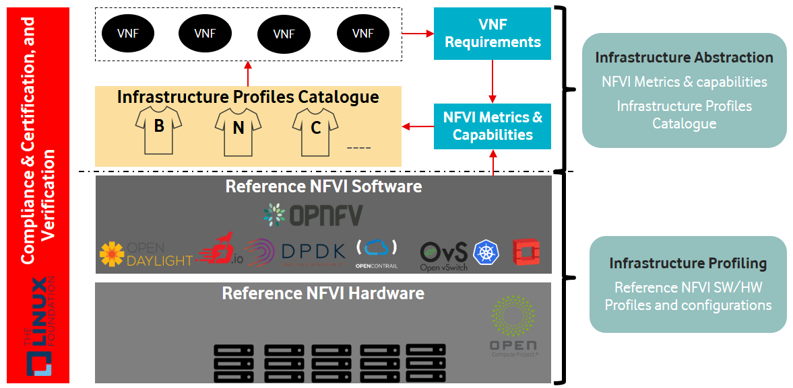
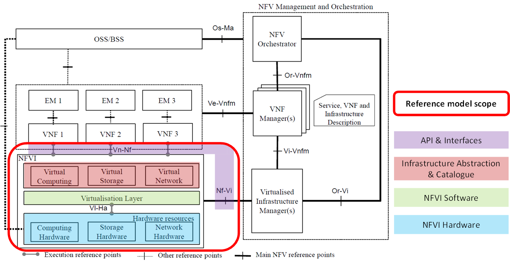

[<< Back](../../ref_model)
# 1. Introduction

## Table of Contents
* [1.1 Overview.](#overview)
* [1.2 Problem Statement.](#problemstatement)
* [1.3 Terminology.](#1.3)
  * [1.3.1 Software layers terminology.](#1.3.1)
  * [1.3.2 Hardware layers terminology.](#1.3.2)
  * [1.3.3 Operational and administrative terminology.](#1.3.3)
  * [1.3.4 Other terminology.](#1.3.4)
* [1.4 Principles.](#1.4)
* [1.5 Scope.](#scope)
* [1.6 Relations to other industry projects.](#relation)
* [1.7 How this document works.](#docu)
* [1.8 What this document is not covering.](#notcovering)
* [1.9 Bogo-Meter.](#bogometer)
* [1.10 Roadmap.](#roadmap)

## 1.1 Overview
The main concept of NFV (Network Function Virtualization) is the ability to use general purpose computer hardware and platforms that run multiple VNFs (Virtualised Network Functions) and hence achieving the desired CapEx and OpEx savings. However, one of big challenges NFV is facing with VNF vendors is that vendors, while building or designing their virtualized services (whether it's VoLTE, EPC, or enterprise services like SD-WAN (Software Defined Wide Area Network)), must bring their own set of infrastructure requirements and custom design parameters. This attitude from vendors triggered the creation of various vendor/function specific silos which are incompatible with each other and have different operating models. In addition, this makes the onboarding and certification processes of VNFs (coming from different vendors) hard to automate and standardise.
 
Therefore, for a true cloud type deployment, a model, which relies on engagement with specific vendors and unique infrastructure, needs to be reversed in a way that there is a lot more consistency on infrastructure. Vendors need to bring their software to run into pre-defined environment with common capabilities. That common infrastructure, whether it is optimized for IT (Information Technology) workloads, NFV workloads, or even for AI (Artificial Intelligence) workloads, needs to be fully abstracted to VNFs so that it can be a standard offer.
 
Additionally, to bring the most value to telco operators as well as vendors, agreeing on a standard set of infrastructure profiles for vendors to use for their VNFs is needed within the industry.

The benefits of this approach are:

- Configuration over customisation
  - By abstracting the infrastructure capabilities, operators are able to have common infrastructure platforms across all VNF vendors.
  - Maintaining a consistent infrastructure allows for higher levels of automation as there is less customisation.
  - Overall, this will reduce the total cost of ownership for operators.

- Onboarding and certification
  - By defining abstracted infrastructure capabilities, and the metrics by which they are measured, the onboarding and certification process for both NFVI and VNFs can be standardised.
  - Supply chain, procurement and assurance teams can also then use these metrics to more accurately assess the most efficient / best value vendor for each scenario.
- Better utilization
  - Mapping VNFs to flavours which are properly mapped to IaaS will bring better utilization, than current VNFs expressing variety of instance types as their needs on IaaS.

## 1.2	Problem Statement
Analysis of On-Boarding and On-Going Support of ‘i’ in relation to the VNF Challenges - Identified Long-Poles

## 1.3	Terminology

This section defines the main terms used in this document; these deinitions are primarily based on the ETSI GS NFV 003 V1.4.1 (2018-08) but have beern cleaned to avoid deployment technology dependencies if necessary.

### 1.3.1 Software layers terminology

- **Network Function Virtualisation (NFV)**: principle of separating network functions from the hardware they run on by using virtual hardware abstraction.
- **Network Function (NF)**:  functional block or application within a network infrastructure that has well-defined external interfaces and well-defined functional behaviour.
  - Within **NFV**, A **Network Function** is implemented in a form of **Virtualised NF** or a **Containerised NF**.
- **Network Service (NS)**: composition of **Network Function**(s) and/or **Network Service**(s), defined by its functional and behavioural specification, including the service lifecycle.
- **Virtual Network Function (VNF)**: a software implementation of a **Network Function**, capable of running on the **NFVi**.
  - **VNF**s are built from one or more VNF Components (**VNFC**) and, in most cases,  the VNFC is hosted on a single VM or Container.
- **Cloud-native (containerised) Network Function (CNF)**: **VNF** with a full adherence to cloud native principles, or a **VNF** that is transitioning to cloud native. 
  >_*Note:*_ It is a containerised **VNF** that is microservices-oriented, to increase agility and maintainability, and that can be dynamically orchestrated and managed to optimize resource utilization; the containers can be Linux, Docker or other similar container technology.
- **Virtual Application (VA)**: is more of a general term for software which can be loaded into a Virtual Machine. 
  >_*Note:*_ a **VNF** is one type of VA.
- **Workload**: Workload refers to software running on top of compute resources such as **VMs** or **Container**s. Most relevant workload categories in context of NFVI are:
  - **Data Plane Workloads**: are related to packet handling in an end-to-end communication between applications. These tasks are expected to be very intensive in I/O operations and memory read/write operations.
  - **Control Plane Workloads**: are the task related to any other communication between NFs that is not directly related to the end-to-end data communication between applications. This category includes session management,routing or authentication.
  - **Storage Workloads**: are all tasks related to disk storage, from the non-intensive logging of a router, to more intensive read/write operations.
- **Virtual Machine (VM)**: virtualised computation environment that behaves like a physical computer/server. 
  >_*Note:*_ a **VM** consists of all of the components (processor (CPU), memory, storage, interfaces/ports, etc.) of a physical computer/server. It is created using Instance Type together with sizing information or Compute Flavour. 
- **Instance type**: specifies a set of virtualized hardware resources and capabilities used for the creation of a virtual compute on which a workload runs on; includes capability specifications such as CPU, storage, and memory.
- **Instance**: is a virtual compute resource, in a known state such as running or suspended, that can be used like a physical server. NOTE: can be used to specify VM Instance or Container Instance.
- **Compute flavour**: defines the compute, memory, and storage capacity, and the capabilities of the physical compute server that the virtual compute resource can run on. 
     >_*Note:*_ used to define the configuration/capacity limit of a virtualised container.
- **VM instances Catalogue**: Pre-defined instance types and compute flavours.
- **Container**: a container provides operating-system-level virtualization by abstracting the “user space”. One big difference between **Container**s and **VM**s is that containers "share" the host system’s kernel with other containers.
- **Network Function Virtualisation Infrastructure (NFVI)**: totality of all hardware and software components that build up the environment in which vApps are deployed. 
  >_*Note:*_ The NFV-Infrastructure can span across several locations, e.g. places where data centres are operated. The network providing connectivity between these locations is regarded to be part of the NFVI. NFVI and VNF are the top-level conceptual entities in the scope of Network Function Virtualisation. All other components are sub-entities of these two main entities.
- **Virtual resources**:
  -	**Virtual Compute resource (a.k.a. virtualised container)**: partition of a compute node that provides an isolated virtualised computation environment.
  -	**Virtual Storage resource**: virtualised non-volatile storage allocated to a virtualised computation environment hosting a **VNFC**
  -	**Virtual Networking resource**: routes information among the network interfaces of a virtual compute resource and physical network interfaces, providing the necessary connectivity
-	**Hypervisor**: software that partitions the underlying physical resources and allocates them to Virtual Machines.
- **Container Engine**: Software components used to create, destroy, and manage containers on top of an operating system.
- **NFVI Software Profile (NFVI SW Profile)**: defines the behaviour, capabilities and metrics provided by an NFVI Software Layer
- **NFVI Software Configuration (NFVI SW Configuration)**: a set of settings (Key:Value) that are applied/mapped to **NFVI** SW deployment.

### 1.3.2 Hardware layers terminology

- **Physical Network Function (PNF)**: Implementation of a network function via tightly coupled dedicated hardware and software system. NOTE: it is a physical NFVi resource with the NF software.
-	**Hardware resources**: Compute/Storage/Network hardware resources on which the NFVI platform software, virtual machines and containers run on.
- **NFVI Hardware Profile**: defines the behaviour, capabilities and metrics provided by an NFVI Hardware Layer.
  - **Host Profile**: is another term for a **NFVI hardware profile**.
- **NFVI Hardware Configuration**: a set of settings (Key:Value) that are applied/mapped to **NFVI** HW deployment.

### 1.3.3 Operational and administrative terminology

-	**Tenant**: one or more service users, in an administrative realm, sharing access to a set of physical, virtual or service resources.
-	**Tenant (Internal) Networks**: virtual networks that are internal to tenant instances.
-	**External Network**: External networks provide network connectivity for an NFVI tenant to resources outside of the tenant space.
-	**Quota**: upper limit on specific types of resources, usually used to prevent excessive resource consumption in the **VIM** by a given consumer (tenant).
-	**Resource pool**: logical grouping of NFVI hardware and software resources. A resource pool can be based on a certain resource type (for example, compute, storage, network) or a combination of resource types. An **NFVI** resource can be part of none, one or more resource pools.
-	**Compute Node**: abstract definition of a server.
-	**Service Assurance (SA)**: collects alarm and monitoring data. Applications within SA or interfacing with SA can then use this data for fault correlation, root cause analysis, service impact analysis, SLA management, security, monitoring and analytics, etc.

### 1.3.4 Other terminology
-	**Virtualised Infrastructure Manager (VIM)**: responsible for controlling and managing the NFVI compute, storage and network resources.
-	**NFV Orchestrator (NFVO)**: manages the VNF lifecycle and **NFVI** resources (supported by the VIM) to ensure an optimised allocation of the necessary resources and connectivity.

## 1.4	Principles

This section specifies the principles of infrastructure abstraction and profiling work presented by this document.

1. NFVI provides abstract and physical resources corresponding to:
   - Compute resources.
   - Storage resources.
   - Networking resources. (Limited to connectivity services).
   - Acceleration resources.
1.	NFVI exposed resources should be supplier independent.
1. All NFVi APIs must be standard and open to ensure components substitution.
   - NFVI resources are consumed by VNFs through standard and open APIs.
   - NFVI resources are configured on behalf of VNFs through standard and open APIs.
   - NFVI resources are discovered/monitored by management entities (such as orchestration) through standard and open APIs.
1.	VNFs should be modular and utilise minimum resources. 
1. NFVI shall support pre-defined and parameterised T-Shirt sizes.
   - T-Shirt sizes will evolve with time.
1.	NFVI provides certain resources, capabilities and features and vApps should only consume these resources, capabilities and features.
1. VNFs that are designed to take advantage of NFVI accelerations should still be able to run without these accelerations with potential performance impacts.
1. An objective of CNTT is to have a single, overarching Reference Model and the smallest number of Reference Architectures as is practical. Two principles are introduced in support of these objectives:

  - **Principle #1 – Minimize Architecture proliferation by stipulating compatible features be contained within a single Architecture as much as possible:**
    - Features which are compatible, meaning they are not mutually exclusive and can coexist in the same NFVI instance, shall be incorporated into the same Reference Architecture. For example, IPv4 and IPv6 should be captured in the same Architecture, because they don’t interfere with each other
    - Focus on the commonalities of the features over the perceived differences.  Seek an approach that allows small differences to be handled at either the low level design or implementation stage. For example, assume the use of existing common APIs over new ones.
 
  - **Principle #2 – Create an additional Architecture only when incompatible elements are unavoidable:** 
    - Creating additional Architectures is limited to when incompatible elements are desired by Taskforce members. For example, if one member desires KVM be used as the hypervisor, and another desires ESXi be used as the hypervisor, and no compromise or mitigation* can be negotiated, the Architecture could be forked, subject to review and vote to approve by the CNTT technical Working Group, such that one Architecture would be KVM-based and the other would be ESXi-based.
     
   *Depending on the relationships and substitutability of the component(s) in question, it may be possible to mitigate component incompatibility by creating annexes to a single Architecture, rather than creating an additional Architecture. With this approach, designers at a Telco would implement the Architecture as described in the reference document and when it came to the particular component in question, they would select from one of the relevant annexes, their preferred option. For example, if one member wanted to use Ceph, and another member wanted to use Swift, assuming the components are equally compatible with the rest of the Architecture, there could be one annex for the Ceph implementation and one annex for the Swift implementation. 

## 1.5	Scope
The scope of this document is illustrated in **Figure 1** below

<b>Figure 1-3:</b> Scope of Wrok

This document specifies:
- NFVI Infrastructure abstraction
  - **NFVI metrics & capabilities**: A set of carrier grade metrics and capabilities of NFVI which VNFs require to perform telco grade network functions.
  - **Infrastructure profiles catalogue**: A catalogue of standard profiles needed in order to completely abstract the infrastructure from VNFs. With a limited and well defined profiles and well understood characteristics, VNF compatibility and performance predictability can be achieved. The current focus is for VMs but the intention is to expand the definition to include Container profiles too.
- Reference software and hardware Infrastructure profiling
  - **Reference NFVI software profiles and configurations**: These reference software profiles and configurations should map efficiently to the infrastructure exposed profiles catalogue. The expectation is for Open Source communities (such as OPNFV) to maintain those reference profiles as the software technology evolves.
  - **Reference NFVI hardware profiles and configurations**: These reference hardware profiles and configurations should be suitable for the defined NFVI software profiles & configurations. The expectation is for Open Source communities (such as OPNFV) to maintain those reference profiles as the hardware technology evolves.
- Compliance and verification
  - **Certification programs**: Define the requirement for certification programs for both VNFs and NFVI.
  - **Test framework**:  Provide test suites to allow compliance, certification, and verification of VNFs and NFVI against the defined set of profiles. Part of the framework is also developing a reference implementation of the defined profiles (with the defined configurations0 to be used as a reference for compliance, certification, and verification of NFVI and VNFs.

## 1.6	Relations to other industry projects 
(clarify ETSI discussion re: what part of ETSI NFVi arch)
Software Stack Model (Abstracted)

Regarding the ETSI NFV architecture specified by ETSI GS NFV002 [link to ref: NFV Architectural framework v1.2.1], the scope of this document is only, but all, the NFVI part, including its external reference points.
A mapping of the functional blocks considered in that document to that NFV architecture is illustrated in **Figure 2** below

<b>Figure 1-4:</b> Mapping to ETSI NFV architecture

Following ETSI model, **Figure 2**, the VIM, Virtualised Infrastructure Manager, which controls and manages the NFVI, is not included into NFVI. Nevertheless, the interactions between NFVI and VIM will be part of this document as infrastructure resources management and orchestration have a strong impact on NFVI. These interactions will be detailed in Chapter 7 "API & Interfaces".

## 1.7	How this document works
How to engage with it 
How the model links to reference

## 1.8	What this document is not covering 
Separate document w/labels/artifacts
Not part of model but will be applicable to architecture 

## 1.9	Bogo-Meter
A carefully chosen “Bogo-Meter” rating at the beginning of each chapter indicates the completeness and maturity each chapter’s content, at a glance.

## 1.10	Roadmap
What’s next in further releases/what’s the backlog and priority roadmap

