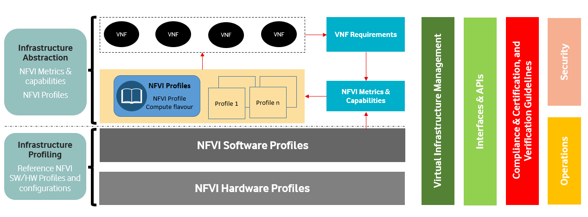
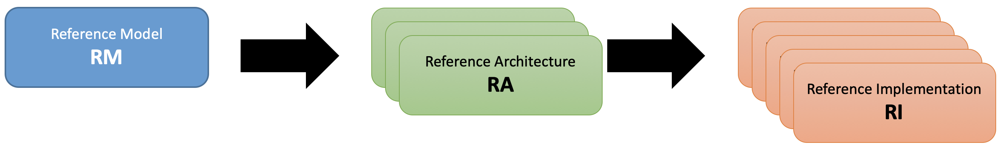
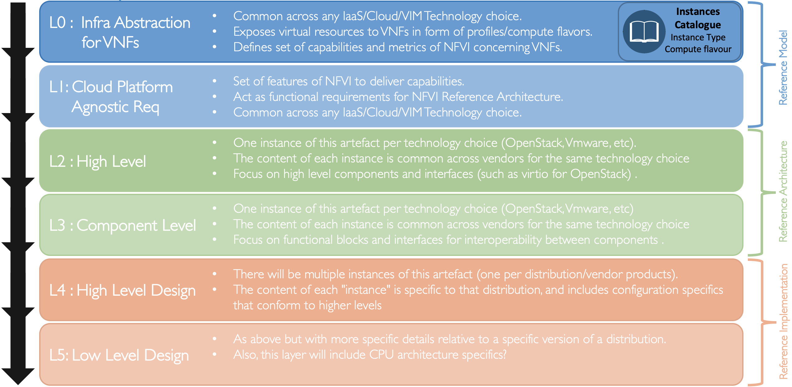
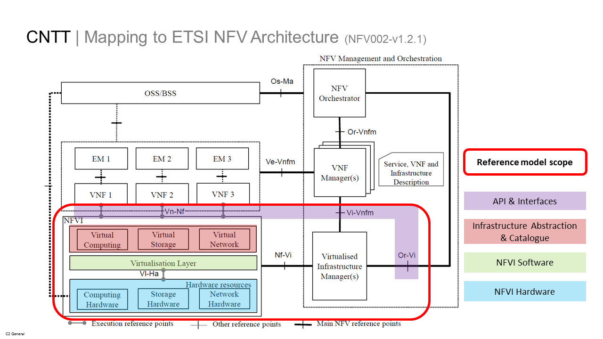

[<< Back](../../ref_model)
# 1. Introduction

## Table of Contents
* [1.1 Overview & Problem Statement.](#1.1)
  * [1.1.1 Problem Statement.](#1.1.1)
  * [1.1.2 Project Goals and Purpose.](#1.1.2)
  * [1.1.3 Common NFVI Benefits.](#1.1.3)
* [1.2 Terminology.](#1.2)
* [1.3 Principles.](#1.3)
* [1.4 Scope.](#1.4)
  * [1.4.1 Use Cases.](#1.4.1)
* [1.5 How this document works.](#1.5)
  * [1.5.1 Document Organization.](#1.5.1)
  * [1.5.2 Audience.](#1.5.2)
* [1.6 Relationship to other industry projects.](#1.6)
* [1.7 Out of Scope Components.](#1.7)
* [1.8 Bogo-Meter.](#1.8)
* [1.9 Roadmap.](#1.9)

## 1.1 Overview
Initially organized early in 2019, the Common Network Function Virtualisation Infrastructure Telecom Taskforce (CNTT) was initially created in response to rapid changes in how networking applications are being designed, built and managed, plus a growing recognition of a perceived functional gap between the previous standard infrastructure models and the architectures needed to support Network Function Virtualization (NFV) applications.  Organizationally the Common Telco Network Function Virtualisation Infrastructure (NFVI)  project, jointly hosted by GSMA and the Linux Foundation, operates as an open committee responsible for creating and documenting an industry aligned Common NFVI Framework.  The CNTT group was created with the intent that it would create the NFVI framework, and eventually morph into an on-going project under the auspices of the GSMA and the Linux Foundation umbrellas.  The final on-going operational form of the group will be determined as the project evolves. 

## 1.1.1 Problem Statement
Based on informal conversations with many operators and developers, there is a realization that there are significant technical, operational and business challenges to the development and deployment of VNF applications related to the lack of a common virtualized infrastructure platform.  These include but are not limited to the following:

 - Higher development costs due to the need to develop Virtual Network Functions (VNF) on multiple custom platforms for each operator
 - Increased complexities due to the need to maintain multiple versions of applications to support each custom environemnt
 - Lack of Testing and validation commonalities, leading to inefficiencies and increased time to market. While the operators will still do internal testing, but using an industry driven verification program based on a common NFVI would provide a head start. 
 - Slower adoption of cloud-native NFV applications and architectures.  A Common Telco NFVI may provide an easier path to methodologies that will drive faster cloud-native NFV application development.
 - Increased operational overhead due to the need for operators to integrate diverse and sometime conflicting VNF platform requirements.

One of major challenges holding back the more rapid and widespread adoption of VNF is that the traditional telecom ecosystem vendors, while building or designing their virtualized services (whether it be Voice over LTE (VoLTE), Evolved Packet Core (EPC), or popular customer facing enterprise services such as SD WAN (Software Defined Wide Area Network), are making their own infrastructure assumptions and requirements, often with custom design parameters. This leaves the operators being forced to build complex integrations of various vendor/function specific silos which are incompatible with each other and might possibly have different and conflicting operating models. In addition, this makes the onboarding and certification processes of VNFs (coming from different vendors) hard to automate and standardise.  

To put this effort in perspective, over the past few years, the telecom industry has been going through a massive technology revolution by embracing software defined networking and cloud architecture principles, in pursuit of the goal of achieving more flexibility, agility and operational efficiency. At a high level, the main objective of NFV (Network Function Virtualization) is the ability to use general purpose standard COTS (Commercial off the Shelf) compute, memory and storage hardware platforms to run multiple Virtualised Network Functions.  VNFs is the general term that covers any type of virtualized application wiether it be in the form of a Virtual Machine (VM) or a containerized application.  Earlier common infrastructure models built on the previous assumption that networking applications are typically built on discrete hardware, do not offer the level of flexibility and agility needed for the support of newer networking technologies such as 5G, intelligent networks and Edge computing.  By running network applications as software rather than on purpose-built hardware, as it has been done since the early 1990’s, the operators aspire to realize operational efficiencies, and capital expense savings.  These Software Defined Network (SDN) applications are increasingly being used by telecom operators to support their internal and customer facing network infrastructures.  The need for a common model across the industry to facilitate more rapid adoption is clear.

<!--Add diagram from Mark Contrell showing the Gap in the Open Source projects here.

-->

## 1.1.2 Project Goals and Purpose
The goal of the task force is to develop a robust infrastructure model and a limited discrete set of architectures built on that model that can be tested and validated for use across the  entire member community. The community, which is made up of a cross section of global operators and supporting vendors alike, was created to support the development, deployment and management of NFV applications faster and more easily.  

All of this had led to a growing awareness of the need to develop more open models and validation mechanisms to bring the most value to telco operators as well as vendors, by agreeing on a standard set of infrastructure profiles to use for the underlying infrastructure to support VNF applications across the industry and telecom community at large. To achieve this goal, the NFVI environment needs to be fully abstracted via APIs and other mechanisms to the VNFs so that both developers of the VNF applications and the operators managing the environments can benefit from the flexibility that the disaggregation of the underlying infrastructure offers.

The next step after the NFVI Reference Model has been identified and developed is to take the general model, which is purposely designed to be able to be applied to a number of technologies, and apply it to a discrete number of concrete and ultimately deployable Reference Architecture platforms. The intention is to chose the reference architectures carefully so that there will only be a small set of architectures that meets the specific requirements for supporting NFV and Telecom specific applications. Per the principles laid out in the Reference Model documentation, the Reference Architectures need to meet the following criteria as much as is practical:

  - Initially should be based on widely established technology and systems used in the Telecom Industry.  This will help ensure a faster adoption rate because the operators are already familiar with the technology and might even have systems in production. Another advantage to this approach is a project faster development cycle. 
  - Subsequent architectures should be based on either additional established or promising emerging technologies that are chosen by the community members.  

## 1.1.3 Common NFVI Benefits
By providing a pre-defined environment with common capabilities, applications are able to be developed and deployed more rapidly.  In addition, the common infrastructure can be optimized for various workloads, such as IT (Information Technology), VNF, AI (Artificial Intelligence), and other future workload types as new technologies emerge. The benefits of this approach are:

- Configuration automation over customization
  - By abstracting the infrastructure capabilities as much as possible, operators are able to use common infrastructure platforms across all VNF vendors.
  - Maintaining a consistent infrastructure allows for higher levels of automation due to a reduced need for customization of the various components.
  - Overall, the intention is to reduce the total cost of ownership for operators and development costs for vendors

- Onboarding and certification
  - By defining abstracted infrastructure capabilities, and the metrics by which they are measured, the onboarding and certification process for both NFVI and VNFs can be standardized, reducing development time for the VNF developers and deployment and operational management costs for the operators standing up the NFVI environments.
  - Supply chain, procurement and assurance teams can then use these metrics to more accurately assess the most efficient / best value vendor for a given environment and network services requirement.
  
- Better utilization
  - Properly mapping VNFs to flavours to the underlying infrastructure, brings the potential for more efficient utilization, than needing to create specific configurations for each type of application in the infrastructure.  
  
In conclusion, to serve the stated objective building a common NFVI infrastructure that is able to take advantage of true cloud models for the more rapid development and deployment of SDN NFV applications, the Common Telco NFVI is documentation of a reference model, a select set of architectures and a set of validation and testing suites, so that there is a more consistent model infrastructure for developers and vendors of SDN software and applications to build to.

## 1.2 Terminology
To help guide the reader, a glossary [Reference Model Terminology](../../../ref_model/chapters/glossary.md#1.1) provides an introduction to the main terms used within this document and throughout the project in general. These definitions are, with a few exceptions, based on the ETSI GS NFV 003 V1.4.1 (2018-08) definitions.  In a few cases, they have been modified to avoid deployment technology dependencies only when it seems necessary to avoid confusion.

## 1.3 Principles
This section introduces the high-level principles of infrastructure abstraction and profiling that will be used in context of this document.

1. A top-level objective of the Common Telco NFVI is to build a single, overarching Reference Model with the smallest number of Reference Architectures tied to it as is practical. Two principles are introduced in support of these objectives:
    - **Minimize Architecture proliferation by stipulating compatible features be contained within a single Architecture as much as possible:**
      - Features which are compatible, meaning they are not mutually exclusive and can coexist in the same NFVI instance, shall be incorporated into the same Reference Architecture. For example, IPv4 and IPv6 should be captured in the same Architecture, because they don't interfere with each other
      - Focus on the commonalities of the features over the perceived differences. Seek an approach that allows small differences to be handled at either the low-level design or implementation stage. For example, assume the use of existing common APIs over new ones.

    - **Create an additional Architecture only when incompatible elements are unavoidable:**
      - Creating additional Architectures is limited to when incompatible elements are desired by Taskforce members. For example, if one member desires KVM be used as the hypervisor, and another desires ESXi be used as the hypervisor, and no compromise or mitigation* can be negotiated, the Architecture could be forked, subject to review and vote to approve by the CNTT technical Working Group, such that one Architecture would be KVM-based and the other would be ESXi-based.

        >*Depending on the relationships and substitutability of the component(s) in question, it may be possible to mitigate component incompatibility by creating annexes to a single Architecture, rather than creating an additional Architecture. With this approach, the infrastructure architecture designers might implement the Architecture as described in the reference document, however when there is a potential for incompatibility for  particular component, they would select their preferred option from one of the relevant annexes. For example, if one member wanted to use Ceph, and another member wanted to use Swift, assuming the components are equally compatible with the rest of the Architecture, there could be one annex for the Ceph implementation and one annex for the Swift implementation.

1. NFVI provides abstract and physical resources corresponding to:
   - Compute resources.
   - Storage resources.
   - Memory resources.
   - Networking resources. (Limited to connectivity services only).
   - Acceleration resources.
1. NFVI exposed resources should be supplier independent.
1. All NFVI Application Programming Interfaces (API) must ensure Interoperability (multi-vendor, components substitution), drive Simplification, and open source implementations that have an open governance model (e.g. come from Open Communities or Standards Development Organizations). Through such APIs will NFVI resources be discovered/monitored by management entities, configured on behalf of VNFs and consumed by VNFs.
1. VNFs should be modular and be designed to utilise the minimum resources required for the service.
1. NFVI shall support pre-defined and parameterized sizes.
   - These pre-defined sizes will evolve over time.
1. NFVI provides certain resources, capabilities and features and virtual applications (VA) should only consume these resources, capabilities and features.
1. VNFs that are designed to take advantage of NFVI accelerations shall still be able to run without these accelerations, however with the understanding that there will be potential performance impacts.

## 1.4 Scope
This document focuses on the documenting the higher level concepts that are needed to identify **Reference Model**. **Figure 1-6** below highlights its scope in more details.

<b>Figure 1-6:</b> Scope of Reference Model

This document specifies:
- **NFVI Infrastructure abstraction**: in context with how it interacts with the other components required to build a complete system that supports **VNF**s.
  - **NFVI metrics & capabilities**: A set of metrics and capabilities for the NFVI which VNFs require to perform telco scale network functions.
  - **Infrastructure profiles catalogue**: A catalogue of standard profiles needed in order to completely abstract the infrastructure from VNFs. With a limited and well-defined set of profiles with well understood characteristics, VNF compatibility and performance predictability can be achieved.

    >_Note_: The current focus is on VMs, due to the state of the industry at the point of developing this document, but the intention is to expand the definition to include Container profiles as both the need and the technology to support containers mature.

- NFVI Software and Hardware profiling
  - **NFVI software profiles and configurations**: These are software profiles and configurations that map directly to the infrastructure profiles within the infrastructure profiles catalogue.
  - **NFVI hardware profiles and configurations**: These are hardware profiles and configurations which are suitable for the defined NFVI software profiles & configurations.

- Compliance and verification
  - **Certification programs**: This defines the requirements for certification and validation programs for both VNFs and NFVI.
  - **Test framework**: Provide test suites to allow compliance, certification, and verification of VNFs and NFVI against the defined set of profiles.

<!-- 

## 1.4.1 Use Cases
Since the CNTT membership is primarily from the telecom and telecom supporting vendors communities, most of the use cases represent the interests of that community.  The following high-level use cases are used to inform and guide both the reference model and subsequent architectures and implementations.  Note that many of these use cases were taken from the work done by the OpenStack Foundation Edge Working Group.

- **Mobile service provider 5G/4G virtual Radio Access Network (RAN) deployment and Edge Cloud B2B2X**: There are at least three use cases related to this (e.g. vRAN, VNF, Multi-access Edge Computing (MEC). While the use cases are different, the expectation is that they will run on the same infrastructure. So it makes sense to treat them together. 
  1. vRAN: Here the focus on virtual Baseband Unit (BBU) which has stringent requirements on processing for timing controls with 'remote radio heads' 
  1. NFV: Here the focus is on running the Core applications as virtual machines at the edge. This includes, vEPC elements, vRouters, Virtual Firewall (vFW), Virtual Load Balancer (vLB)
  1. MEC: Here the focus is on running 3rd party or operator applications at the edge. The MEC resource pools could be supporting a variety of other MEC applications (smart city, v2x, consumer AR).
- **Edge cloud service user**: For vRAN and NFV the user is the wireless network operator. For MEC it could be the operator, a 3rd party application provider or the wireless end-user.
- **Edge cloud infrastructure user**: The Edge Cloud infrastructure user would be the network operator.
- **Edge site(s)**: An operator's network could include thousands of sites. Each site could range from a handful of servers to dozens of racks.
- **Connectviity reliability**: Front Haul reliability is driven by Radio requirements and is high. Backhaul reliability is driven by operator service requirements (5 9s)
- **Edge Size**: medium to large
- **Deployment infrastructure considerations / scaling**: 

   - Case 2: By splitting CU-DU (from BBU), vCU can run on the same NFVI edge computing platform that runs UPF(5G) ( or S/P-GW-U in 4G) and other VNFs including vFW and vLB. End users/devices traffic can be released at the clear demarcation point placing UPF in Edge DC. We can install Kubernetes based cloud on top of NFVI and put UPF(and other VNFs) in front of Kubernetes to carry the user's traffic to cloud native apps in the Kubernetes.
   - Case 1: 1- The vBBU deployment is driven by need for : easy life cycle management, vendor independence, automatic scaling (and energy savings). 2- The NFV deployments is driven by need for automatic scaling and vendor independence. 3- The MEC deployment is driven by opportunities for new revenue streams possibly from new sources.
   - Case 2: 1) Edge Cloud B2B2X model In the traditional Telco service provider model, the Telco provided services(the first B of B2B2X) directly to either individual or corporate consumers to increase revenue. In the Edge Cloud B2B2X model, Telco collaborates with diverse partners in other industries(the second B of B2B2X)to deliver added value to consumers/devices(X of B2B2X) through a wide range of the biz service providers. Here, the value that Telco Edge Cloud can provide biz service providers can take various forms, such as IoT & Edge Intelligence, Containerized micro service, AI framework, and other advanced ICT technologies, user interface technologies, and security tools.
    
More use cases to pull in:  https://docs.openstack.org/arch-design/use-cases.html

>_**Comment**: This section is still under development._

-->  

## 1.5 How this document works
Within the framework of the Common Telecom NFVI vision, there are three levels of documents needed to document the components and allow the practical application of the systems. They are, as highlighted in **Figure 1-4**:  **Reference Model**, **Reference Architecture**, and **Reference Implementation**.

<b>Figure 1-4:</b> Scope of CNTT

## 1.5.1 Document Organization

- **Reference Model**: (_This document_) focuses on the __**NFVI Abstraction**__ and how NFVI services and resources are exposed to VNFs. It written at a high enough level that as new **Reference Architectures** and **Reference Implementations** are added, the model document should require few or no changes. Additionally, the Reference Model is intended to be neutral towards VMs or Containers.
- **Reference Architecture**: High level NFVI system components and their interactions that takes the Reference Model goals and maps them to something that has components in the real world.  It is expected that at least one, but not more than a few, Reference Architecture will conform to the Reference Model.  The intention whenever possible to use existing elements, rather than specify entirely new architectures in support of the high-level goals specified in the **Reference Model**.
- **Reference Implementation**: Builds on the requirements and specifications developed in the other two documents and adds details so that it can be implemented.  Each Reference Architecture is expected to be implemented by at least one Reference Implementation.

Below is a diagram of the different artifacts that will need to be created to support the implementation of the abstract concepts presented in the **Reference Model**, which are then applied to create the **Reference Architecture**, that will be deployed using the requirements spelled out in the **Reference Implementation**.

<b>Figure 1-5:</b> Description of the possible different levels of CNTT artefacts

## 1.5.2 Audience
The document starts from the abstract and as it progresses it increasingly gets into more details.  It follows the traditional design process where you start from core principles, progress to abstract concepts and models, then finish with operational considerations, such as security and lifecycle management.

- **Chapter 01 - Introduction**: Overall scope of the Reference Model document including the goals and objectives of the project.  
  >	**Audience**: This chapter is written for a general technical audience with interest in this topic.
- **Chapter 02 - VNF requirements & Analysis**: High level requirements and core principles needed to understand how the model was developed.  Addresses the thinking behind the decisions that were made. 
  >	**Audience**: This chapter is written for architects and others with an interest in how the decisions were made.
- **Chapter 03 - Modelling**:  The high-level NFVI model itself.  
  >	**Audience**: This chapter is written for architects and others who wants to gain a quick high-level understanding of the model.
- **Chapter 04 - Infrastructure Capabilities, Metrics, and Catalogue**:  Details about the capabilities needed to support the various types of VNFs and how the capabilities are applied to the model. The details regarding T-shirt sizes and other considerations are found in this section.
  >	**Audience**: This chapter is written for architects, developers and others who need to develop infrastructure or write VNF applications.
- **Chapter 05 - Featureset and Requirements from Infrastructure**: This chapter goes into more details on what needs to be part of the NFVI.  It describes the software and hardware capabilities and configurations recommended for the different types of NFVI profiles. 
  > **Audience**: This chapter is written for architects, developers and others who need to develop infrastructure or write VNF applications.
- **Chapter 06 - External Interfaces**:  This chapter covers APIs and any actual interfaces needed to communication with the NFVs themselves and any other external components.
  >	**Audience**: This chapter is written for architects, developers and others who need to develop APIs or write VNF applications that use the APIs.
- **Chapter 07 - Security Guidelines**:  This chapter identifies the security components that need to be taken into consideration when designing and implementing an NFVI environment.  It does not cover details related to company specific requirements to meet regulatory requirements.
  > **Audience**: This chapter is written for security professional, architects, developers and others who need to understand the role of security in the NFVI environment.
- **Chapter 08 - Compliance, Verification, and Certification**: This chapter details the requirements for developing test suites for a verification and validation program for developers and vendors to validate that their software and applications meet the requirements for the NFVI architectures.
  >	**Audience**: This chapter is written for QA testers, developers and others who need to develop infrastructure or write VNF applications.
- **Chapter 09 - Life Cycle Management**: This chapter focuses on the operational aspects of the NFVI.  Discussions include deployment considerations, on-going management, upgrades and other lifecycle concerns and requirements.  It does not cover details related to company specific operational requirements, nor does it go into how the NFVI will interface with existing BSS/OSS systems.
  > **Audience**: This chapter is written for lifecycle managers, operational support teams and others who need to support the infrastructure or the VNF applications.
- **Chapter 10 - Challenges and Gaps**: Opportunities for future developments as technology changes over time.
  > **Audience**: This chapter is written for a general technical audience with interest in this topic.
- **Appendix A - VNF Design Guidelines**: More details related to how the VNF applications will interface with the NFVI through APIs and the VIM.
  > **Audience**: This chapter is written for architects, developers and others who need to develop infrastructure or write VNF applications.

## 1.6 Relationship to other industry projects
The Common Telco NFVI work is not done in a vacuum.  The intention from the beginning was to utilize the work from other Open Source and standards bodies within the industry. Some of the projects, but by no means all, that are related in some way to the CNTT efforts include:

 -	ETSI NFV ISG
 -	OpenStack
 -	OPNFV
 -	ONAP
 -	CNCF
 -	MEF
 -	TM Forum
 - OSM (ETSi Open Source MANO project)
 - VMWare (While not an Open Source project, VMWare is a commonly used platform used for VNF deployments in the telecom industry)

The ETSI NFV ISG is very closely related to the Common Telco NFVI, in that it is a group that is working on supporting technologies for NFV applications. To facilitate more collaboration as the project matures, the Common Telco NFVI Reference Model's scope has been purposely aligned to the ETSI NFV ISG Infrastructure plus the VIM (Virtualised Infrastructure Manager), inclusive of their external reference points, as specified by ETSI GS NFV002. <!--[link to ref: NFV Architectural framework v1.2.1]-->. **Figure 1-7** illustrates which functional blocks of the ETSI NFV Architecture are in scope for Common Telco NFVI.

<b>Figure 1-7:</b> Mapping to ETSI NFV architecture

Following the ETSI model, **Figure 1-7** also depicts the VIM, which controls and manages the NFVI, and while technically not part of the NFVI, the VIM is included in the Common Telco NFVI scope, due to its role as a manager serving as a bridge between the underlying NVFI and the VNF applications. The interactions between NFVI and VIM will be part of this document as infrastructure resources management and orchestration have a strong impact on the NFVI.  These interactions and interfaces will be detailed in  **Chapter 7 "API & Interfaces"**.

The Common Telco NFVI is also closely aligned with OVP, an open source, community-led compliance and verification program that demonstrates the readiness and availability of commercial NFV products and services, including NFVI and VNFs, using OPNFV. OVP combines open source-based automated compliance and verification testing for multiple parts of the NFV stack specifications established by ONAP, multiple SDOs such as ETSI and GSMA, and the LF Networking End User Advisory Group (EUAG). 

Once the Common Telco NFVI Reference Models and Architectures are implemented and tested via OPNFV (Reference Implementations), commercial products adhering to these specifications can undergo an enhanced OVP’s VNF and NFVI compliance testing for establishing baseline conformance and offering interoperability.  More details about the testing and verification requirements are found in **Chapter 08 - Compliance, Verification, and Certification**.

<!--
There will be dedicated OVP hacking tracks to facilitate VNF vendor onboarding and testing. More information on the work and how to get involved can be found at the following links.  
- https://www.lfnetworking.org/ovp. 
- Information on the existing 11 OPNFV Verified products to date is available here: https://nfvi-verified.lfnetworking.org/#/ 
-->

The Common Telco NFVI will collaborate with the respective API workgroups of SDOs (ETSI, MEF, TM Forum) as much as possible.  However, to collate on the relevant APIs from these SDOs in some cases requires special permission since information might not be available to the public.  For example. MEF LSO APIs & TM Forum OpenAPIs are accessible by members only.

## 1.7 Out of Scope Components.
While the nature of the NFVI reference model might seem quite broad, the following areas are not at this time part of the scope of this effort.  
- Hardware specifications: beyond the abstracted high-level CPU, memory, network interface and storage elements.  The intention is to write the document so that it is general enough that any vendor hardware can be used in the implementation without making significant changes to the model. 
- VNF and application specifications: Other than the API interfaces when they directly need to touch the VNFs themselves, the intention is to assume the VNF application is a blackbox that the NFVI is providing resources to.  The majority of interactions for lifecycle management of the VNFs will be through the VIM whenever possible.
- Company specific requirements: This document is designed to be general enough that most operators and others in the Open Source communities will be able 

<!--Separate document w/labels/artifacts
Not part of model but will be applicable to architecture -->

## 1.8 Bogo-Meter
At the beginning of each chapter there is a graphic that indicates the completeness and maturity each chapter's content at a glance.  

The ratings are as follows:
 - **Initial framework only**: Indicates that there is little or no useful content, just the bare outline.
 -	**Still developing content**:  Generally, indicates that while there is some content that might have some use, it is actively being worked on and needs considerable contributions from the community.
 -	**Lots of SME feedback**: Indicates that most of the content has been developed, but that there is still opportunity for contributors to shape the content.
 - **Dickering over the fine points**: The content is mostly completed, but the community needs to refine its shared thinking and build final consensus.
 - **Complete**: Content has been finalized for this release.  Few changes are anticipated in the future beyond fixing errors or slight refinements.

## 1.9 Roadmap
The NFVI Reference Model and Reference Architecture will continue to be refined as technology and industry needs change over time.  Release 1 of this document will focus on the network function virtualisation infrastructure and virtualised network functions which are based on virtual machines. In Release 2 there will be partial support for cloud native functions which make use of container technology.  
The first reference architecture is based on Openstack, but the intention is to expand the portfolio of Reference Architectures with an upcoming focus in release 2 to areas such as Containerization, Kubernetes-based Cloud Native stacks and Container based network functions’ validation requirement.  Other planned additions to the project in future releases include support for:

 - GPU/FPGA
 - Cyborg project
 - More Container infrastructure and cloud-native VNFs
 
In addition to adding a container-based reference architecture in the next iteration, the CNTT will continue to grow capabilities for supporting compliance and verification testing, providing a lifecycle approach for NFVI. The CNTT under the auspices of the LFN, GSMA and OPNFV look forward to continuing the open source definition and implementation work that powers the community and ecosystem, so that these new technologies can be more quickly and easily integrated into global service provider networks. 
