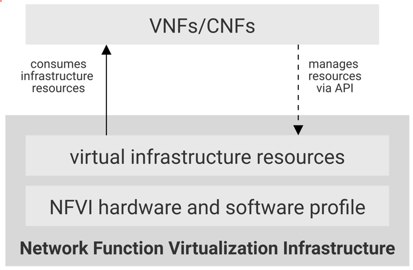

[<< Back](../../ref_model)
# 2	VNF requirements & Analysis

## Table of Contents
* [2.1 VNFs collateral (Sample).](#collateral)
* [2.2 Analysis of requirements.](#analysis)
* [2.3 NFVI Profiles.](#profiles)

The NFV Infrastructure (NFVI) is the totality of all hardware and software components which build up the environment in which VNFs are deployed, managed and executed.

It is inevitable that different VNFs require different capabilities from the underlying infrastructure and therefore metrics that define those capabilities are needed.

## 2.1	VNFs collateral (Sample)
The following is a list of VNFs that have been taken as samples and used to understand requirements and to drive the NFVI metrics definition.
- **Management and Control Plane**: EPC (MME, P/S-GW, S/G-GSN), IMS, SBC, PCRF, SDM, mVAS, DRA
- **User Plane and network**: RAN, BBU, MRF, BNG, CDN, PE, Switch, Router, RR, CPE
- **Security & testing**: FW, LB, DNS, AES, DPI, NAT/CGN, SecGW, Probe
- **Data Core**:
  - Packet Core: GGSN, SGW, PGW, SGSN, MME, CSGN.
  - Subscriber Management: HSS.
  - Policy & Traffic Management: PCRF, TMF
  - Optimizer: MSP.
- **Voice Core**:
  - IP Multimedia: CSCF, ENUM, TAS, SBC.
  - Database: CSDB
  - Circuit Switched: MSC-S(MSS), MGW.
  - Signalling: DRA, SGW, STP.
  - Messaging
  - Security
- **IP Core**: SEC-GW
- **SDO**:
  - Convergent Charging: CCS
  - Smart Pricing: SPO.
  - NGIN, Gi-LAN
  - SecureNet: Clean Pipe.
  - Network Security: SS7FW, CMS, SIG.
  - Others: Web RTC GW, Service integration GW
- **Fixed Access**:
  - BNG, CPE
- **Radio (Cloud RAN)**.

## 2.2	Analysis of requirements 
(Key Assumptions and Rationale)
Capturing performance characteristics.

## 2.3	NFVI Profiles
By examining the list of VNFs provided in Section 2.1(VNFs collateral (Sample)) and understand their various requirements of NFVI capabilities and metrics, they can be categorised into the following categories.
- **Basic**: VNFs with VNF-Cs that perform basic compute operations. 
- **Network intensive**: VNFs with VNF-Cs that perform network intensive operations with high throughput and low latency requirements.
- **Compute Intensive**: VNFs with VNF-Cs that perform compute intensive operations with low latency requirements.

**Figure 2-1** shows proposed list of NFVI profiles to match those VNF categories.

>_**Note**: 	This is an initial set of proposed profiles and it is expected that more profiles will be added as more requirements are gathered and as technology enhances and matures._

<b>Figure 2-1:</b> Infrastructure profiles proposed based on VNFs categorisation.

