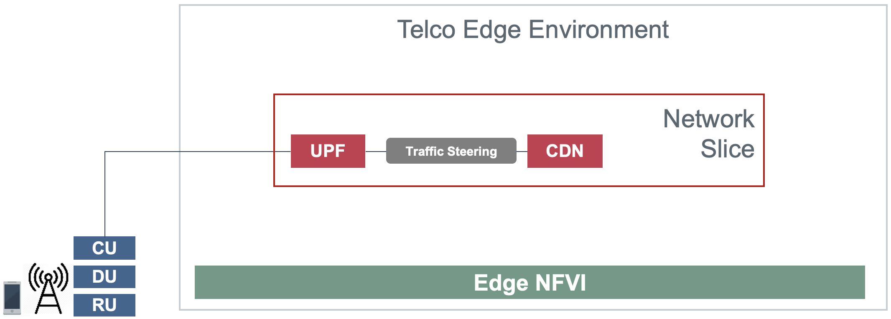
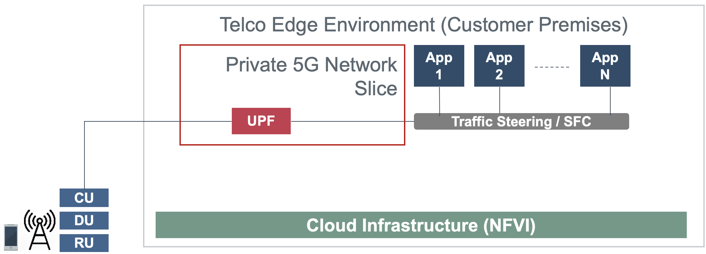
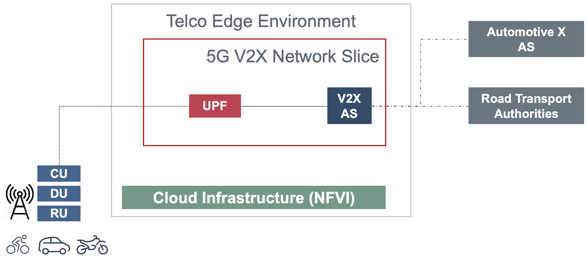
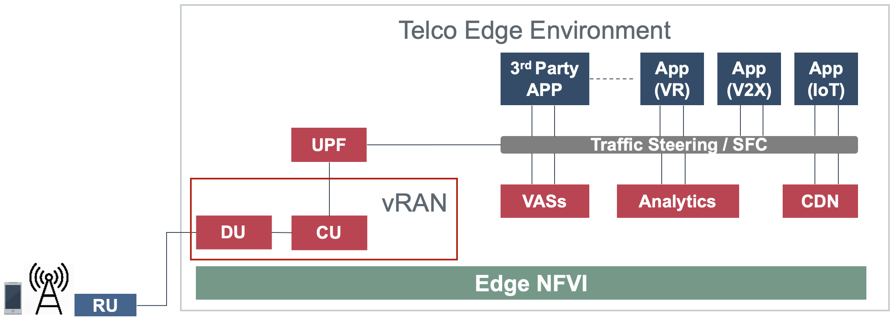
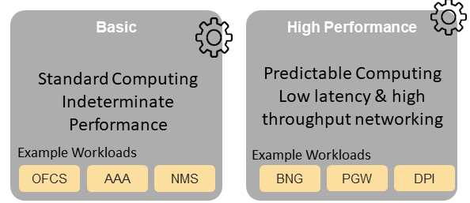

.. _workload-requirements--analysis:

Workload Requirements & Analysis
================================

The Cloud Infrastructure is the totality of all hardware and software components which build up the environment in which
VNFs/CNFs (workloads) are deployed, managed and executed. It is, therefore, inevitable that different workloads would
require different capabilities and have different expectations from it.

One of the main targets of the Reference Model is to define an agnostic cloud infrastructure, to remove any dependencies
between workloads and the deployed cloud infrastructure, and offer infrastructure resources to workloads in an
abstracted way with defined capabilities and metrics.

This means, operators will be able to host their Telco workloads (VNFs/CNFs) with different traffic types, behaviour and
from any vendor on a unified consistent cloud infrastructure.

Additionally, a well-defined cloud infrastructure is also needed for other type of workloads such as IT, Machine
Learning, and Artificial Intelligence.

This chapter analyses various Telco workloads and their requirements, and recommends certain cloud infrastructure
parameters needed to specify the desired performance expected by these workloads.

Workloads Collateral
--------------------

There are different ways that workloads can be classified, for example:

-  **By function type:**

   -  Data Plane (a.k.a., User Plane, Media Plane, Forwarding Plane)
   -  Control Plane (a.k.a., Signalling Plane)
   -  Management Plane

   ..

      **Note**\ *: Data plane workloads also include control and management plane functions; control plane workloads
      also include management plane functions.*

- **By service offered:**

  - Mobile broadband service
  - Fixed broadband Service
  - Voice Service
  - Value-Added-Services

-  **By technology:** 2G, 3G, 4G, 5G, IMS, FTTx, Wi-Fi...

The list of, most likely to be virtualised, Network Functions below, covering almost **95%** of the Telco workloads, is
organised by network segment and function type.

- **Radio Access Network (RAN)**

  - Data Plane

    - BBU: BaseBand Unit
    - CU: Centralised Unit
    - DU: Distributed Unit

- **2G/3G/4G mobile core network**

  - Control Plane

    - MME: Mobility Management Entity
    - 3GPP AAA: Authentication, Authorisation, and Accounting
    - PCRF: Policy and Charging Rules Function
    - OCS: Online Charging system
    - OFCS: Offline Charging System
    - HSS: Home Subscriber Server
    - DRA: Diameter Routing Agent
    - HLR: Home Location Register
    - SGW-C: Serving GateWay Control plane
    - PGW-C: Packet data network GateWay Control plane

  - Data Plane

    - SGW: Serving GateWay
    - SGW-U: Serving GateWay User plane
    - PGW: Packet data network GateWay
    - PGW-U: Packet data network GateWay User plane
    - ePDG: Evolved Packet Data GateWay
    - MSC: Mobile Switching Center
    - SGSN: Serving GPRS Support Node
    - GGSN: Gateway GPRS Support Node
    - SMSC : SMS Center

- **5G core network**

  5G core nodes are virtualisable by design and strong candidate to be onboarded onto Telco Cloud as "cloud native
  application"

  - Data Plane

    - UPF: User Plane Function

  - Control Plane

    - AMF: Access and Mobility management Function
    - SMF: Session Management Function
    - PCF: Policy Control Function
    - AUSF: Authentication Server Function
    - NSSF: Network Slice Selection Function
    - UDM: Unified Data Management
    - UDR: Unified Data Repository
    - NRF: Network Repository Function
    - NEF: Network Exposure Function
    - CHF: Charging Function part of the Converged Charging System (CCS)

      ..

         **Note:**\ *for Service-based Architecture (SBA) all Network Functions are stateless (store all sessions/ state
         on unified data repository UDR)*

- **IP Multimedia Subsystem (IMS)**

  - Data Plane

    - MGW: Media GateWay
    - SBC: Session Border Controller
    - MRF: Media Resource Function

  - Control Plane

    - CSCF: Call Session Control Function
    - MTAS: Mobile Telephony Application Server
    - BGCF: Border Gateway Control Function
    - MGCF: Media Gateway Control Function

- **Fixed network**

  - Data Plane

    - MSAN: MultiService Access Node
    - OLT: Optical Line Termination
    - WLC: WLAN Controller
    - BNG: Broadband Network Gateway
    - BRAS: Broadband Remote Access Server
    - RGW: Residential GateWay
    - CPE: Customer Premises Equipment

  - Control Plane

    - AAA: Authentication, Authorisation, and Accounting

- **Other network functions**

  - Data Plane

    - LSR: Label Switching Router
    - DPI: Deep Packet Inspection
    - CG-NAT: Carrier-Grade Network Address Translation
    - ADC: Application Delivery Controller
    - FW: FireWall
    - Sec-GW: Security GateWay
    - CDN: Content Delivery Network

  - Control plane

    - RR: Route Reflector
    - DNS: Domain Name System

  - Management Plane

    - NMS: Network Management System

Use cases
---------

The intent of this section is to describe some important use cases that are pertinent to this Reference Model. We start
with some typical Edge related use cases. The list of use cases will be extendd in the future releases.

Telco Edge is commonly coupled with 5G use cases, seen as one of the ingredients of the Ultra-Reliable Low-latency
Communication (URLLC) and Enhanced Mobile Broadband (eMBB) Network Slicing. The requirements for user plane Local
Breakout / Termination are common mandating that Value Added Services (VASs) & Any Gi-LAN applications are locally
hosted at the Edge. The Telco Edge is a perfect fit for centralized vRAN deployment and vDU/vCU hosting that satisfy the
latency requirements.

It is expected that with the technology evolution (e.g. 6G) the use cases will be more demanding. For instance, 
either to meet less than 1 ms latency, or ultra ultra fast data rate, it will be required to evolve the architecture. 
These use cases, once available, can be used for life saving decisions, for instance for the remote automation in 
environments not supporting life (e.g., in deep space communication), to ensure that the car autonomous 
driving can be done in real time, and even for holographic communications. Such use cases can be seen as the 
evolution of 5G use cases, where such requirements could not be met due to the technology constrains.

- **Use Case #1 - Edge CDN with eMBB Core Network Slicing**

  - **Business Objectives**

    Monetizing 5G by provisioning eMBB network slice with distributed Content Delivery Network (CDN) as a service, that
    enables Ultra-HD (UHD) streaming, Video Optimization, caching for large files, and other capabilities that can
    either bundled by the Network Slice offering or implicitly enabled by the operator.

  - **Targeted Segments**

    - B2C (Targeting high Tier Packages & Bundles)
    - Content Owners (Potential revenue sharing model)
    - Mobile Virtual Network Operators (MVNOs - Wholesale)
    - Stadiums and Venues.

  - **Architecture**

   Edge CDN with eMBB Core Network Slicing

- **Use Case #2 - Edge Private 5G with Core Network Slicing**

  - **Business Objectives**

    Private 5G is considered one of the most anticipated Business use cases in the coming few years enabling Mobile
    Operators to provide a standalone private Mobile Network to enterprises that may include all the ingredients of PLMN
    such as Radio, Core, Infrastructure & Services covering the business requirements in terms of security, performance,
    reliability, & availability.

  - **Targeted Segments**

    - Governmental Sectors & Public Safety (Mission critical applications)
    - Factories and Industry sector.
    - Enterprises with Business-critical applications.
    - Enterprises with strict security requirements with respect to assets reachability.
    - Enterprises with strict KPIs requirements that mandate the on-premise deployment.

  - **Architecture**

    - There are multiple flavours for Private 5G deployments or NPN, Non-Public Network as defined by 3GPP.
    - The use case addresses the technical realization of NPN as a Network Slice of a PLMN as per Annex D –
      3GPP TS 23.501 R16 and not covering the other scenarios of deployment.
    - The use case assumes a network slice that is constructed from a single UPF deployed on Customer premises while
      sharing the 5G Control Plane (AMF, SMF, & other CP Network Functions) with the PLMN.
    - The use case doesn’t cover the requirements of the private Application Servers (ASs) as they may vary with each
      customer setup.
    - Hosting the CU/DU on-Customer Infrastructure depends on the enterprise offering by the Mobile Operator and the
      selected Private 5G setup.
    - The Edge Cloud Infrastructure can be governed by the client or handled by the Service Provider (Mobile Operator)
      as part of Managed-services model.

   Edge Private 5G with Core Network Slicing.

- **Use Case #3 - Edge Automotive (V2X) with uRLLC Core Network Slicing**

  - **Business Objectives**

     The V2X (Vehicle-to-everything) set of use cases provides a 5G monetization framework for Mobile Operators
     developing 5G URLLC business use cases targeting the Automotive Industry, Smart City Regulators, & Public Safety.

  - **Targeted Segments**

    - Automotive Industry.
    - Governmental Departments (Smart Cities, Transport, Police, Emergency Services, etc.).
    - Private residencies (Compounds, Hotels and Resorts).
    - Enterprise and Industrial Campuses.

  - **Architecture**

    - 5G NR-V2X is a work item in 3GPP Release 16 that is not completed yet by the time of writing this document.

      - C-V2X, Cellular V2X has two modes of communications

        - Direct Mode (Commonly described by SL, Sidelink by 3GPP): This includes the V2V, V2I, & V2P using a direct
          Interface (PC5) operating in ITS, Intelligent Transport Bands (e.g. 5.9 GHZ).
        - Network Mode (UL/DL): This covers the V2N while operating in the common telecom licensed spectrum. This use
          case is capitalizing on this mode.

      - The potential use cases that may consume services from Edge is the Network Model (V2N) and potentially the V2I
        (According on how the Infrastructure will be mapped to an Edge level)

   Edge Automotive (V2X) with uRLLC Core Network Slicing

- **Use Case #4 – Edge vRAN Deployments**

  - **Business Objectives**
    vRAN is one of the trending technologies of RAN deployment that fits for all Radio Access Technologies. vRAN helps
    to provide coverage for rural & uncovered areas with a compelling CAPEX reduction compared to Traditional and legacy
    RAN deployments. This coverage can be extended to all area types with 5G greenfield deployment as a typical example.

  - **Targeted Segments**

    - Private 5G Customers (vRAN Can be part of the Non-Public Network, NPN)
    - B2B Customers & MVNOs (vRAN Can be part of an E2E Network Slicing)
    - B2C (Mobile Consumers Segment).

  - **Architecture**

    - There are multiple deployment models for Centralized Unit (CU) & Distributed Unit (DU). This use case covers the
      placement case of having the DU & CU collocated & deployed on Telco Edge, see NGMN Overview on 5GRAN Functional
      Decomposition ver 1.0 :cite:p:`ngmn5granfnldecomp`.
    - The use case covers the 5G vRAN deployment. However, this can be extended to cover 4G vRAN as well.
    - Following Split Option 7.2, the average market latency for RU-DU (Fronthaul) is 100 microsec – 200 microsec while
      the latency for DU-CU (MIdhaul) is tens of milliseconds, see ORAN-WG4.IOT.0-v01.00 :cite:p:`oranwg4iot0`.

   Edge vRAN Deployments

- **Use Case #5 - Telepresence Experience**

  - **Business Objectives**

    This service would allow the communication between one or more persons with the feeling to be present in a location without being phisically in a virtual environment. This service will make use of eMBB, and URLLC network slices and a distributed deployment which would offload processing.

  - **Targeted Segments**

    - B2B Customers & MVNOs
    - B2C (Mobile Consumers Segment)
    - Enterpises which make use of Communication platforms
   
  - **Architecture**

    - Distibuted deployment model across the ecosystem. It should be possbile to deploy workload at the extreme edge, which would allow realtime processing for video, and offload processing for network load prediction, which would support the Quality of Experience tat is defined for such a use case
    - The use case covers should allow the placement at the management plane and control plane (e.g. Core, Edge domain) 
    - There are high-leve requirements requirement for such a use case (e.g. latency of 1ms, available bandwidth 8 Gps 
      
- **Use Case #6 - Digital Twins for Manufacturing**

  - **Business Objectives**

    Providing the capability to design and create a product/service as a Digital Twin which can be tested before moving in to Production environment. Therefore, only once acceptance is achieved in the digital world, the service would be available. This leads to extreme reduction of Total Cost of Ownership (TCO), and minimize the risks that are comonly associated to a design and testing of a service for industrial enviroment.

  - **Targeted Segments**

    - Private Networks
    - Enterprise
    - Factory (make use of high level of automation).
    
   - **Architecture**

    - Demands very low latency (<<1ms) and high reliability. 
    - Trustworthiness needs to be guaranteed, which are usually associated to performance, security and resource efficiency/cost and subsequently productivity
    - Processing cabaility of massive volumes of data.
    
Analysis
--------

Studying various requirements of workloads helps understanding what expectation they will have from the underlying cloud
infrastructure. Following are *some* of the requirement types on which various workloads might have different
expectation levels:

- **Computing**

  - Speed (e.g., CPU clock and physical cores number)
  - Predictability (e.g., CPU and RAM sharing level)
  - Specific processing (e.g., cryptography, transcoding)

- **Networking**

  - Throughput (i.e., bit rate and/or packet rate)
  - Latency
  - Connection points / interfaces number (i.e., vNIC and VLAN)
  - Specific traffic control (e.g., firewalling, NAT, cyphering)
  - Specific external network connectivity (e.g., MPLS, VXLAN)

- **Storage**

  - IOPS (i.e., input/output rate and/or byte rate)
  - Volume
  - Ephemeral or Persistent
  - Specific features (e.g., object storage, local storage)

By trying to sort workloads into different categories based on the requirements observed, below are the different
profiles concluded, which are mainly driven by expected performance levels:

- **Profile One**

  - Workload types

    - Control plane functions without specific need, and management plane functions
    - *Examples: OFCS, AAA, NMS*

  - No specific requirement

- **Profile Two**

  - Workload types

    - Data plane functions (i.e., functions with specific networking and computing needs)
    - *Examples: BNG, S/PGW, UPF, Sec-GW, DPI, CDN, SBC, MME, AMF, IMS-CSCF, UDR*

  - Requirements

    - Predictable computing
    - High network throughput
    - Low network latency

.. _profiles-profile-extensions--flavours:

Profiles, Profile Extensions & Flavours
---------------------------------------

**Profiles** are used to tag infrastructure (such as hypervisor hosts, or Kubernetes worker nodes) and associate it with
a set of capabilities that are exploitable by the workloads.

Two profile *layers* are proposed:

- The top level **profiles** represent macro-characteristics that partition infrastructure into separate pools, i.e.: an
  infrastructure object can belong to one and only one profile, and workloads can only be created using a single
  profile. Workloads requesting a given profile **must** be instantiated on infrastructure of that same profile.
- For a given profile, **profile extensions** represent small deviations from (or further qualification, such as
  infrastructure sizing differences (e.g. memory size)) the profile that do not require partitioning the infrastructure
  into separate pools, but that have specifications with a finer granularity of the profile. Profile Extensions can be
  *optionally* requested by workloads that want a more granular control over what infrastructure they run on, i.e.: an
  infrastructure resource can have **more than one profile extension label** attached to it, and workloads can request
  resources to be instantiated on infrastructure with a certain profile extension. Workloads requesting a given profile
  extension **must** be instantiated on infrastructure with that same profile extension. It is allowed to instantiate
  workloads on infrastructure tagged with more profile extensions than requested, as long as the minimum requirements
  are satisfied.

Workloads specify infrastructure capability requirements as workload metadata, indicating what kind of infrastructure
they must run on to achieve functionality and/or the intended level of performance. Workloads request resources
specifying the Profiles and Profile Extensions, and a set of sizing metadata that maybe expressed as flavours that are
required for the workload to run as intended.
A resource request by a workload can be met by any infrastructure node that has the same or a more specialised profile
and the necessary capacity to support the requested flavour or resource size.

Profiles, Profile Extensions and Flavours will be considered in greater detail in
:ref:`chapters/chapter04:profile extensions`.

Profiles (top-level partitions)
~~~~~~~~~~~~~~~~~~~~~~~~~~~~~~~

Based on the above analysis, the following cloud infrastructure profiles are proposed (also shown in
:numref:`Infrastructure profiles proposed based on VNFs categorisation` below)

- **Basic**: for Workloads that can tolerate resource over-subscription and variable latency.
- **High Performance**: for Workloads that require predictable computing performance, high network throughput and low
  network latency.

   Infrastructure profiles proposed based on VNFs categorisation

In :ref:`chapters/chapter04:infrastructure capabilities, measurements and catalogue`
these **B (Basic)** and **H (High) Performance** infrastructure profiles will be
defined in greater detail for use by workloads.

Profiles partition the infrastructure: an infrastructure object (host/node) **must** have one and only one profile
associated to it.

Profile Extensions (specialisations)
~~~~~~~~~~~~~~~~~~~~~~~~~~~~~~~~~~~~

Profile Extensions are meant to be used as labels for infrastructure, identifying the nodes that implement special
capabilities that go beyond the profile baseline. Certain profile extensions may be relevant only for some profiles.
The following **profile extensions** are proposed:

+-------------------+-------------------------+---------------+---------------+------------------------+---------------+
| Profile Extension | Mnemonic                | Applicable to | Applicable to | Description            | Notes         |
| Name              |                         | Basic Profile | High          |                        |               |
|                   |                         |               | Performance   |                        |               |
|                   |                         |               | Profile       |                        |               |
+-------------------+-------------------------+---------------+---------------+------------------------+---------------+
| Compute Intensive | compute-high-perf-cpu   | ❌            | ✅            | Nodes that have        | May use       |
| High-performance  |                         |               |               | predictable computing  | vanilla       |
| CPU               |                         |               |               | performance and higher | VIM/K8S       |
|                   |                         |               |               | clock speeds.          | scheduling    |
|                   |                         |               |               |                        | instead.      |
+-------------------+-------------------------+---------------+---------------+------------------------+---------------+
| Storage Intensive | storage-high-perf       | ❌            | ✅            | Nodes that have low    |               |
| High-performance  |                         |               |               | storage latency and/or |               |
| storage           |                         |               |               | high storage IOPS      |               |
+-------------------+-------------------------+---------------+---------------+------------------------+---------------+
| Compute Intensive | compute-high-memory     | ❌            | ✅            | Nodes that have high   | May use       |
| High memory       |                         |               |               | amounts of RAM.        | vanilla       |
|                   |                         |               |               |                        | VIM/K8S       |
|                   |                         |               |               |                        | scheduling    |
|                   |                         |               |               |                        | instead.      |
+-------------------+-------------------------+---------------+---------------+------------------------+---------------+
| Compute Intensive | compute-gpu             | ❌            | ✅            | for compute intensive  | May use Node  |
| GPU               |                         |               |               | Workloads that         | Feature       |
|                   |                         |               |               | requires GPU compute   | Discovery.    |
|                   |                         |               |               | resource on the node   |               |
+-------------------+-------------------------+---------------+---------------+------------------------+---------------+
| Network Intensive | high-speed-network      | ❌            | ✅            | Denotes the presence   |               |
| High speed        |                         |               |               | of network links (to   |               |
| network (25G)     |                         |               |               | the DC network) of     |               |
|                   |                         |               |               | speed of 25 Gbps or    |               |
|                   |                         |               |               | greater on the node.   |               |
+-------------------+-------------------------+---------------+---------------+------------------------+---------------+
| Network Intensive | very-high-speed-network | ❌            | ✅            | Denotes the presence   |               |
| Very High speed   |                         |               |               | of network links (to   |               |
| network (100G)    |                         |               |               | the DC network) of     |               |
|                   |                         |               |               | speed of 100 Gbps or   |               |
|                   |                         |               |               | greater on the node.   |               |
+-------------------+-------------------------+---------------+---------------+------------------------+---------------+
| Low Latency -     | low-latency-edge        | ✅            | ✅            | Labels a host/node as  |               |
| Edge Sites        |                         |               |               | located in an edge     |               |
|                   |                         |               |               | site, for workloads    |               |
|                   |                         |               |               | requiring low latency  |               |
|                   |                         |               |               | (specify value) to     |               |
|                   |                         |               |               | final users or         |               |
|                   |                         |               |               | geographical           |               |
|                   |                         |               |               | distribution.          |               |
+-------------------+-------------------------+---------------+---------------+------------------------+---------------+
| Very Low Latency  | very-low-latency-edge   | ✅            | ✅            | Labels a host/node as  |               |
| - Edge Sites      |                         |               |               | located in an edge     |               |
|                   |                         |               |               | site, for workloads    |               |
|                   |                         |               |               | requiring low latency  |               |
|                   |                         |               |               | (specify value) to     |               |
|                   |                         |               |               | final users or         |               |
|                   |                         |               |               | geographical           |               |
|                   |                         |               |               | distribution.          |               |
+-------------------+-------------------------+---------------+---------------+------------------------+---------------+
| Ultra Low Latency | ultra-low-latency-edge  | ✅            | ✅            | Labels a host/node as  |               |
| - Edge Sites      |                         |               |               | located in an edge     |               |
|                   |                         |               |               | site, for workloads    |               |
|                   |                         |               |               | requiring low latency  |               |
|                   |                         |               |               | (specify value) to     |               |
|                   |                         |               |               | final users or         |               |
|                   |                         |               |               | geographical           |               |
|                   |                         |               |               | distribution.          |               |
+-------------------+-------------------------+---------------+---------------+------------------------+---------------+
| Fixed function    | compute-ffa             | ❌            | ✅            | Labels a host/node     |               |
| accelerator       |                         |               |               | that includes a        |               |
|                   |                         |               |               | consumable fixed       |               |
|                   |                         |               |               | function accelerator   |               |
|                   |                         |               |               | (non-programmable,     |               |
|                   |                         |               |               | e.g. Crypto,           |               |
|                   |                         |               |               | vRAN-specific          |               |
|                   |                         |               |               | adapter).              |               |
+-------------------+-------------------------+---------------+---------------+------------------------+---------------+
| Firmware-         | compute-fpga            | ❌            | ✅            | Labels a host/node     |               |
| programmable      |                         |               |               | that includes a        |               |
| adapter           |                         |               |               | consumable             |               |
|                   |                         |               |               | Firmware-programmable  |               |
|                   |                         |               |               | adapter (programmable, |               |
|                   |                         |               |               | e.g. Network/storage   |               |
|                   |                         |               |               | FPGA with programmable |               |
|                   |                         |               |               | part of firmware       |               |
|                   |                         |               |               | image).                |               |
+-------------------+-------------------------+---------------+---------------+------------------------+---------------+
| SmartNIC enabled  | network-smartnic        | ❌            | ✅            | Labels a host/node     |               |
|                   |                         |               |               | that includes a        |               |
|                   |                         |               |               | Programmable           |               |
|                   |                         |               |               | accelerator for        |               |
|                   |                         |               |               | vSwitch/vRouter,       |               |
|                   |                         |               |               | Network Function       |               |
|                   |                         |               |               | and/or Hardware        |               |
|                   |                         |               |               | Infrastructure.        |               |
+-------------------+-------------------------+---------------+---------------+------------------------+---------------+
| SmartSwitch       | network-smartswitch     | ❌            | ✅            | Labels a host/node     |               |
| enabled           |                         |               |               | that is connected to a |               |
|                   |                         |               |               | Programmable Switch    |               |
|                   |                         |               |               | Fabric or TOR switch   |               |
+-------------------+-------------------------+---------------+---------------+------------------------+---------------+

**Table 2-1:** Profile extensions

   \*\ **Note:** This is an initial set of proposed profiles and profile extensions and it is expected that more 
   profiles and/or profile extensions will be added as more requirements are gathered and as technology enhances and 
   matures.
