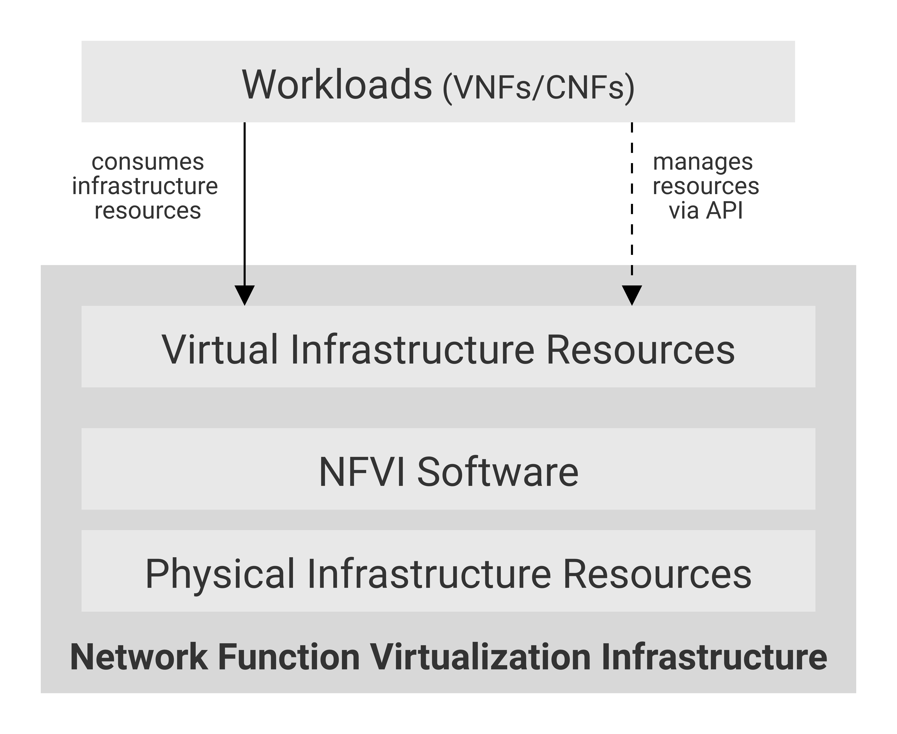
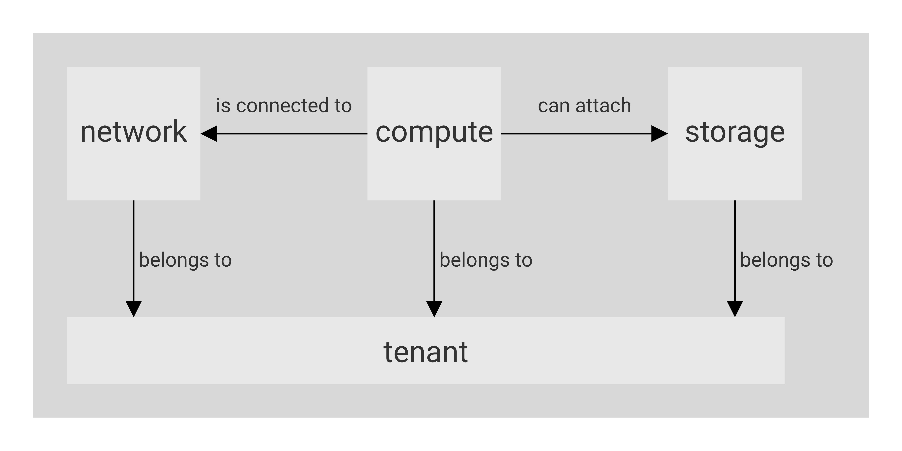

[<< Back](../../ref_model)
# 3	Infrastructure Abstraction

## Table of Contents
* [3.1 Model.](#model)
* [3.2 Exposed vs Internal.](#expint)
* [3.3 Exposed NFVI capabilities, metrics, and constraints.](#expcap)

There is the necessity to clearly define which kind of infrastructure resources a shared network function virtualisation infrastructure (NFVI) will provide for hosting workloads including virtual network functions (VNFs) and/or cloud-native network functions (CNF), so that the requirements of the workloads match the capabilities of the NFVI.

The lack of a common understanding of which resources and corresponding capabilities a suitable NFVI should provide may lead to several issues which could negatively impact the time and cost for onboarding and maintaining these solutions on top of a virtualised infrastructure e.g.:
- supporting any kind of workload specific requirements (e.g. regarding network acceleration or API access) might result in having to establish different silo NFVIs for each workload type.
- synchronising the release cycles of a large set of different technologies will sooner or later lead to situations in which required upgrades cannot be applied easily due to incompatibilities.

The abstraction model presented in this chapter specifies a common set of virtual infrastructure resources which a NFVI will need to provide to be able to host most of the typical VNF workloads required by the operator community.
Although a couple of explicit and implicit abstraction models (e.g. in the context of ETSI/NFV) are already available they fall short when address following design principles:
-	**Scope**: the model should describe the most relevant virtualised infrastructure resources (incl. acceleration technologies) an NFVI needs to provide for hosting Telco VNF workloads
-	**Separation of Concern**: the model should support a clear distinction between the responsibilities related to maintaining the network function virtualisation infrastructure and the responsibilities related to managing the various VNF workloads
-	**Simplicity**: the amount of different types of resources (including their attributes and relationships amongst one another) should be kept to a minimum to reduce the configuration spectrum which needs to be considered
-	**Declarative**: the model should allow for a declarative description of the required NFVI capabilities for onboarding and maintaining workloads
-	**Explicit**: the model needs to be rich enough to allow for a direct mapping towards the APIs of NFVIs for the instantiation of virtual infrastructure elements without requiring any additional parameters
-	**Lifecycle**: the model must distinguish between resources which have independent lifecycles but should group together those resources which share a common lifecycle
-	**Aligned**: the model should clearly highlight the dependencies between the elements to allow for a well-defined and simplified synchronisation of independent automation tasks.

To summarise: the abstraction model presented in this paper will build upon existing modelling concepts and simplify and streamline them to the needs of telco operators who intend to distinguish between infrastructure related and VNF related responsibilities.

## 3.1	Model
The abstraction model for the NFVI makes use of following layers (only the virtual infrastructure layer will be directly exposed to the workloads such as VNFs/CNFs):

<b>Figure 3.1:</b> NFVI Model Layers.

  
The functionalities of each layer are as follows:
- Physical Infrastructure Resources: This layer consists of physical hardware components such as servers, (including random access memory, local storage, network ports, and hardware acceleration devices), storage devices, network devices, etc. and their corresponding basic operating systems (BIOS).
- NFVI Software: This layer consists of both the host Operating System (OS) responsible for managing the physical infrastructure resources as well as the virtualization/containerization technology which, on request, dynamically allocates hardware components and turns them into virtual resources. 
- Virtual Infrastructure Resources: This layer represents all the infrastructure resources (compute, storage and networks) which the NFVI provides to the workloads such as VNFs/CNFs. These virtual resources can be managed by the tenants and tenant workloads directly or indirectly via an application programming interface (API).
- Workloads (VNFs/CNFs): This layer consists of workloads such as virtualized and/or containerized network functions that run on top of a VM or as a Container. 
The virtual infrastructure resources provided by the NFVI can be grouped into four categories as shown in Figure 3.2.

<b>Figure 3.2:</b> Virtual Infrastructure Resources provides virtual compute, storage and networks in a tenant context.

- tenants: represent an independently manageable logical pool of compute, storage and network resources
- compute resources: represent virtualised computes for workloads and Operating and other Systems as necessary  
- storage resources: represent virtualised resources for persisting data
- network resources: represent virtual resources providing layer 2 and layer 3 connectivity

The virtualised infrastructure resources related to these categories are listed below:

### Tenant

A network function virtualisation infrastructure needs to be capable of supporting multiple tenants and has to isolate sets of infrastructure resources dedicated to specific workloads (VNF/CNF) from one another. Tenants represent an independently manageable logical pool of compute, storage and network resources abstracted from physical hardware. **Example**: a tenant within an OpenStack environment or a Kubernetes cluster.

| Attribute | Description                                                                                             |
|-----------|---------------------------------------------------------------------------------------------------------|
| `name`      | name of the logical resource pool                                                                       |
| `type`      | type of tenant (e.g. OpenStack tenant, Kubernetes cluster, …)                                           |
| `vcpus`     | max. number of virtual CPUs                                                                             |
| `ram`       | max. size of random access memory in GB                                                                 |
| `disc`      | max. size of ephemeral disc in GB                                                                       |
| `networks`  | description of external networks required for inter-domain connectivity                                 |
| `metadata`  | key/value pairs for selection of the appropriate physical context (e.g. location, availability zone, …) |

<b>Table 3.1:</b> Attributes of a tenant.

### Compute
A virtual machine or a container/pod belonging to a tenant capable of hosting the application components of workloads (VNFs). A virtual compute therefore requires a tenant context and since it will need to communicate with other communication partners it is assumed that the networks have been provisioned in advance. **Example**: a virtual compute descriptor as defined in TOSCA Simple Profile for NFV.

| Attribute | Description |
| --- | --- |
| `name` | name of the virtual host |
| `vcpus` | number of virtual cpus |
| `ram` | size of random access memory in GB |
| `disc` | size of root disc in GB |
| `nics` | sorted list of network interfaces connecting the host to the virtual networks |
| `acceleration` | key/value pairs for selection of the appropriate acceleration technology |
| `metadata` | key/value pairs for selection of the appropriate redundancy domain |

<b>Table 3.2:</b> Attributes of compute resources.

### Storage
A block device of a certain size for persisting information which can be created and dynamically attached to/detached from a virtual compute. A storage device resides in a tenant context and exists independently from any compute host. **Example**: an OpenStack cinder volume.

| Attribute | Description |
| --- | --- |
| `name` | name of storage resources |
| `size` | size of disc in GB |
| `attachments` | list of compute hosts to which the device is currently attached |
| `acceleration` | key/value pairs for selection of the appropriate acceleration technology |
| `metadata` | key/value pairs for selection of the appropriate redundancy domain |

<b>Table 3.3:</b> Attributes of storage resources.

_**Comments**: we need to be more specific regarding acceleration and metadata._

### Network
A layer 2 / layer 3 communication domain within a tenant. A network requires a tenant context. **Example**: a virtual compute descriptor as defined in TOSCA Simple Profile for NFV.

| Attribute | Description |
| --- | --- |
| `name` | name of the network resource |
| `subnet` | classless inter-domain routing of the subnet |
| `acceleration` | key/value pairs for selection of the appropriate acceleration technology |

<b>Table 3.4:</b> Attributes of network resources.

## 3.2	Exposed vs Internal
Mark S./Tom investigating.
1.	(Explanation)
2.	E.g. this is how I expose my NFVi storage to the VNF = External

## 3.3	Exposed NFVI capabilities, metrics, and constraints

### 3.3.1	Exposed NFVI capabilities
This section covers a list of explicit NFVI capabilities and metrics that defines an NFVI. These capabilities and metrics are well known to VNFs as they provide capabilities which VNFs rely on.

> _**Note**: 	It is expected that NFVI capabilities and metrics will evolve with time as more capabilities are added as technology enhances and matures._

#### 3.3.1.1	Exposed resource capabilities
**Table 3-5** below shows resource capabilities of NFVI. Those indicate resources offered to VNFs by NFVI.

| Ref | NFVI capability | Unit | Definition/Notes |
|--------------------|----------------------------------------------------|--------|-------------------------------------------------------------------------------|
| e.nfvi.res.cap.001 | #vCPU cores | number | Min, Max number of vCPU cores that can be assigned to a single VNF-C |
| e.nfvi.res.cap.002 | Amount of RAM (MB) | MB | Min, Max memory in MB  that can be assigned to a single VNF-C by NFVI. |
| e.nfvi.res.cap.003 | Total amount of instance (ephemeral) storage (GB) | GB | Min, Max storage in GB  that can be assigned to a single VNF-C by NFVI |
| e.nfvi.res.cap.004 | # vNICs | number | Max number of vNIC interfaces that can be assigned to a single VNF-C by NFVI. |
| e.nfvi.res.cap.005 | Total amount of external (persistent) storage (GB) | GB | Min, Max storage in GB that can be attached / mounted to VNF-C by NFVI. |

<b>Table 3-5:</b> Exposed resource capabilities of NFVI.

**Table 3-6** is how they map to different NFVI instances:

| Ref | B Instance | N Instance | C Instance |
|--------------------|----------------------------|----------------------------|----------------------------|
| `e.nfvi.res.cap.001` | As per selected  <flavour> | As per selected  <flavour> | As per selected  <flavour> |
| `e.nfvi.res.cap.002` | As per selected  <flavour> | As per selected  <flavour> | As per selected  <flavour> |
| `e.nfvi.res.cap.003` | As per selected  <flavour> | As per selected  <flavour> | As per selected  <flavour> |
| `e.nfvi.res.cap.004` | As per selected  <I Opt> | As per selected  <I Opt> | As per selected  <I Opt> |
| `e.nfvi.res.cap.005` | As per selected  <S Ext> | As per selected  <S Ext> | As per selected  <S Ext> |

<b>Table 3-6:</b> Mapping of exposed resource capabilities to different NFVI instances.

#### 3.3.1.2 Exposed performance optimisation capabilities
**Table 3-7** shows possible performance optimisation capabilities that can be provided by NFVI. These indicate capabilities exposed to VNFs. Those capabilities need to be consumed by VNFs in a standard way.

| Ref | NFVI capability | Unit | Definition/Notes |
|--------------------|---------------------------|--------|--------------------------------------------|
| e.nfvi.per.cap.001 | CPU pinning support | Yes/No | Determining if NFVI support CPU pinning |
| e.nfvi.per.cap.002 | NUMA support | Yes/No | Determining if NFVI support NUMA awareness |
| e.nfvi.per.cap.003 | IPSec Acceleration | Yes/No | IPSec Acceleration |
| e.nfvi.per.cap.004 | Crypto Acceleration | Yes/No | Crypto Acceleration |
| e.nfvi.per.cap.005 | Transcoding Acceleration | Yes/No | Transcoding Acceleration |
| e.nfvi.per.cap.006 | Programmable Acceleration | Yes/No | Programmable Acceleration |

<b>Table 3-7:</b> Exposed performance optimisation capabilities of NFVI.

| Ref | B Instance | N Instance | C Instance |
|--------------------|------------|------------------|------------------|
| `e.nfvi.per.cap.001` | No | Yes | Yes |
| `e.nfvi.per.cap.002` | No | Yes | No |
| `e.nfvi.per.cap.003` | No | Yes (if offered) | No |
| `e.nfvi.per.cap.004` | No | Yes (if offered) | No |
| `e.nfvi.per.cap.005` | No | No | Yes (if offered) |
| `e.nfvi.per.cap.006` | No | No | Yes (if offered) |

<b>Table 3-8:</b> Mapping of Exposed performance optimisation capabilities with different NFVI instance types.

#### 3.3.1.3	Exposed monitoring capabilities
**Table 3-9** shows possible monitoring capabilities available by NFVI for VNFs.

| Ref | NFVI capability | Unit | Definition/Notes |
|--------------------|---------------------------|--------|----------------------------------------------------|
| e.nfvi.mon.cap.001 | Monitoring of L2-7 data | Yes/No | Ability for VNF-C to monitor their own L2-L7 data. |

<b>Table 3-9:</b> Exposed monitoring capabilities of NFVI.

| Ref | B Instance | N Instance | C Instance |
|--------------------|------------|------------------|------------------|
| `e.nfvi.mon.cap.001` | No | Yes | No |

<b>Table 3-10:</b> Mapping of Exposed monitoring capabilities with different NFVI instance types.

### 3.3.2	Exposed NFVI metrics
#### 3.3.2.1	Exposed performance metrics 
**Table 3-11** below shows performance metrics of NFVI. The intent of those metrics is to be well known to VNFs. These metrics are aligned with ETSI GS NFV TST-009 [2].

| Ref | NFVI metric | Unit | Definition/Notes |
|--------------------|------------------------------------------|--------|-----------------------------------------------------------------------|
| e.nfvi.per.met.001 | Network Throughput | bps | Max thougput per vNIC assigned to VNF-C @256 Bytes |
| e.nfvi.per.met.002 | Network Latency | ms | Range (min, max) on each vNIC assigned to VNF-C. ETSI NFV-TST 009[2]. |
| e.nfvi.per.met.003 | External (persistent) storage IO | iops | Range (min, max) per VNF-C |
| e.nfvi.per.met.004 | External (persistent) storage throughput | MB/s | Range (min, max) per VNF-C |

<b>Table 3-11:</b> Exposed performance metrics of NFVI.

| Ref | B Instance | N Instance | C Instance |
|--------------------|--------------------------|---------------------------|---------------------------|
| `e.nfvi.per.met.001` | Up to speed of   <I Opt> | Up to speed of    <I Opt> | Up to speed of    <I Opt> |
| `e.nfvi.per.met.002` | <30ms | <0.5ms | <5ms |
| `e.nfvi.per.met.003` | As per selected  <S Ext> | As per selected  <S Ext> | As per selected  <S Ext> |
| `e.nfvi.per.met.004` | As per selected  <S Ext> | As per selected  <S Ext> | As per selected  <S Ext> |

<b>Table 3-12:</b> Mapping of Exposed performance metrics to NFVI instance types.

## 3.4	Internal NFVI capabilities metrics, and constraints
This section covers a list of implicit NFVI capabilities and metrics that defines the interior of   NFVI. These capabilities and metrics determines how NFVI behaves internally. They are hidden from VNFs (i.e. VNFs may not know about them) but they will have a big impact on the overall performance and capabilities of a given NFVI solution.

>_**Note**: 	It is expected that implicit NFVI capabilities and metrics will evolve with time as more capabilities are added as technology enhances and matures._

### 3.4.1	Internal NFVI capabilities
#### 3.4.1.1	Internal resource capabilities
**Table 3-13** shows resource capabilities of NFVI. These include capabilities offered to VNFs and resources consumed internally by NFVI.

| Ref | NFVI capability | Unit | Definition/Notes |
|--------------------|---------------------------------------------------------------------------|------------------------|---------------------------------------------------------------------------------------------------------------------|
| i.nfvi.res.cap.001 | Number of vCPU cores consumed by NFVI software in a single compute nodes. | % (of total available) | This indicates the number of vCPU cores consumed (wasted) by NFVI components (including host OS) in a compute node. |
| i.nfvi.res.cap.002 | Amount of memory consumed by NFVI software in a single compute nodes. | % (of total available) | This indicates the amount of memory consumed (wasted) by NFVI components (including host OS) in a compute node. |

<b>Table 3-13:</b> Internal resource capabilities of NFVI.

| Ref | B Instance | N Instance | C Instance |
|--------------------|--------------------------|--------------------------|--------------------------|
| `i.nfvi.res.cap.001` | 5-10% | 10-20% | 15-25% |
| `i.nfvi.res.cap.002` | 5-10% | 10-20% | 15-25% |

<b>Table 3-14:</b> Mapping of Internal resource capabilities to NFVI instance types.

#### 3.4.1.2	Internal SLA capabilities
Table 13 below shows SLA (Service Level Agreement) capabilities available by NFVI. These include capabilities required by VNFs as well as internal capabilities to NFVI. These capabilities will be determined by the standard instance type used by VNF-C.

| Ref | NFVI capability | Unit | Definition/Notes |
|--------------------|------------------------------------------|--------|---------------------------------------------------------------------------------------------------------------------|
| i.nfvi.sla.cap.001 | CPU overbooking | 1:N | This indicates the number of vCPU cores consumed (wasted) by NFVI components (including host OS) in a compute node. |
| i.nfvi.sla.cap.002 | vNIC QoS | Yes/No | QoS enablement |

<b>Table 3-15:</b> Internal SLA capabilities to NFVI.

| Ref | B Instance | N Instance | C Instance |
|--------------------|--------------------------|--------------------------|--------------------------|
| `i.nfvi.sla.cap.001` | 1:4 | 1:1 | 1:1 |
| `i.nfvi.sla.cap.002` | No | Yes | Yes |

<b>Table 3-16:</b> Mapping of Internal SLA capabilities to NFVI instance type.

#### 3.4.1.3	Internal performance optimisation capabilities
**Table 3-17** below shows possible performance optimisation capabilities that can be provided by NFVI. These include capabilities exposed to VNFs as well as internal capabilities to NFVI. These capabilities will be determined by the standard instance type used by VNF-C (VNF Component)

| Ref | NFVI capability | Unit | Definition/Notes |
|--------------------|------------------------------------------|--------|----------------------------------------|
| i.nfvi.per.cap.001 | Huge page support | Yes/No | Determining if NFVI support huge pages |

<b>Table 3-17:</b> Internal performance optimisation capabilities of NFVI.

| Ref | B Instance | N Instance | C Instance |
|--------------------|--------------------------|--------------------------|--------------------------|
| `i.nfvi.per.cap.001` | No | Yes | No |

<b>Table 3-18:</b> Mapping of Internal performance optimisation capabilities to NFVI instance types.

#### 3.4.1.4	Internal monitoring capabilities
**Table 3-19** shows possible monitoring capabilities available by NFVI. The availability of these capabilities will be determined by the instance type used by VNFs.

| Ref | NFVI capability | Unit | Definition/Notes |
|--------------------|-------------------------------------------|--------|----------------------------------------------------------------------------------------------------------------------------------------------------------------------------------------------------------------|
| i.nfvi.mon.cap.001 | Host CPU usage |  | Per Compute node. It needs to Maps to ETSI NFV-TST 008[1] clause 6, processor usage metric (NFVI exposed to VIM) and ETSI NFV-IFA 027 Mean Virtual CPU usage and Peak Virtual CPU usage (VIM exposed to VNFM). |
| i.nfvi.mon.cap.002 | Virtual compute resource CPU usage |  | QoS enablement |
| i.nfvi.mon.cap.003 | Host CPU utilization |  | Per Compute node. It needs to map to ETSI NFV-IFA 027 Mean Virtual CPU usage and Peak Virtual CPU usage (VIM, exposed to VNFM). |
| i.nfvi.mon.cap.004 | Virtual compute resource CPU utilization |  | Range (min, max) per VNF-C |
| i.nfvi.mon.cap.005 | Monitoring of external storage IOPS | Yes/No | Transcoding Acceleration |
| i.nfvi.mon.cap.006 | Monitoring of external storage throughput | Yes/No | Programmable Acceleration |
| i.nfvi.mon.cap.007 | Monitoring of external storage capacity | Yes/No |  |

<b>Table 3-19:</b> Internal monitoring capabilities of NFVI.

| Ref | B Instance | N Instance | C Instance |
|--------------------|------------|------------|------------|
| `i.nfvi.mon.cap.001` | Yes | Yes | Yes |
| `i.nfvi.mon.cap.002` | Yes | Yes | Yes |
| `i.nfvi.mon.cap.003` | Yes | Yes | Yes |
| `i.nfvi.mon.cap.004` | Yes | Yes | Yes |
| `i.nfvi.mon.cap.005` | Yes | No | Yes |
| `i.nfvi.mon.cap.006` | Yes | No | Yes |
| `i.nfvi.mon.cap.007` | Yes | No | Yes |

<b>Table 3-20:</b> Mapping of Internal monitoring capabilities to NFVI instance types.

#### 3.4.1.5	Internal security capabilities

| Ref | NFVI capability | Unit | Definition/Notes |
|--------------------|-------------------------------------|--------|------------------------------------------------------------------|
| i.nfvi.sec.cap.001 | VNF-C<->VNF-C  memory isolation | Yes/No | Are VNF-C memories isolated from each other by hardware support? |
| i.nfvi.sec.cap.002 | VNF-C -> Host | Yes/No | Can VNF-C access host memory? |
| i.nfvi.sec.cap.003 | Host -> VNF-C | Yes/No | Can Host access VNF-C memory? |
| i.nfvi.sec.cap.004 | External storage at-rest encryption | Yes/No | Is external storage encrypted at-rest? |

<b>Table 3-21:</b> Internal security capabilities of NFVI.

| Ref | B Instance | N Instance | C Instance |
|--------------------|------------|------------|------------|
| `i.nfvi.sec.cap.001` | Yes | Yes | Yes |
| `i.nfvi.sec.cap.002` | No | No | No |
| `i.nfvi.sec.cap.003` | Yes | No | No |
| `i.nfvi.sec.cap.004` | Yes | Yes | Yes |

<b>Table 3-22:</b> Mapping of Internal security capabilities to NFVI instance types.

### 3.4.2	Internal NFVI metrics
#### 3.4.2.1	 Internal resources management metrics 
**Table 3-23** shows resource management metrics of NFVI as aligned with ETSI GS NFV TST-012 [3]. Some of these metrics are related to what VNFs sees from the infrastructure and some of them are internal to NFVI.

| Ref | NFVI metrics | Unit | Definition/Notes |
|--------------------|------------------------------------------------------|--------|------------------------------------------------------------------|
| i.nfvi.rmt.met.001 | Time to create VNF-C for a given VNF | Max ms |  |
| i.nfvi.rmt.met.002 | Time to delete  VNF-C of a given VNF | Max ms |  |
| i.nfvi.rmt.met.003 | Time to start VNF-C of a given VNF | Max ms |  |
| i.nfvi.rmt.met.004 | Time to stop VNF-C of a given VNF | Max ms |  |
| i.nfvi.rmt.met.005 | Time to pause VNF-C of a given VNF | Max ms |  |
| i.nfvi.rmt.met.006 | Time to create internal virtual network | Max ms |  |
| i.nfvi.rmt.met.007 | Time to delete internal virtual network | Max ms |  |
| i.nfvi.rmt.met.008 | Time to update internal virtual network | Max ms |  |
| i.nfvi.rmt.met.009 | Time to create external virtual network | Max ms |  |
| i.nfvi.rmt.met.010 | Time to delete external virtual network | Max ms |  |
| i.nfvi.rmt.met.011 | Time to update external virtual   network | Max ms |  |
| i.nfvi.rmt.met.012 | Time to create vSwitch | Max ms |  |
| i.nfvi.rmt.met.013 | Time to create vRouter | Max ms |  |
| i.nfvi.rmt.met.014 | Time to create external storage ready for use by VNF | Max ms |  |

<b>Table 3-23:</b> Internal resource management metrics of NFVI.

| Ref | B Instance | N Instance | C Instance |
|--------------------|------------------------------------------------------|--------|------------------------------------------------------------------|
| `i.nfvi.rmt.met.001` |  |  |  |
| `i.nfvi.rmt.met.002` |  |  |  |
| `i.nfvi.rmt.met.003` |  |  |  |
| `i.nfvi.rmt.met.004` |  |  |  |
| `i.nfvi.rmt.met.005` |  |  |  |
| `i.nfvi.rmt.met.006` |  |  |  |
| `i.nfvi.rmt.met.007` |  |  |  |
| `i.nfvi.rmt.met.008` |  |  |  |
| `i.nfvi.rmt.met.009` |  |  |  |
| `i.nfvi.rmt.met.010` |  |  |  |
| `i.nfvi.rmt.met.011` |  |  |  |
| `i.nfvi.rmt.met.012` |  |  |  |
| `i.nfvi.rmt.met.013` |  |  |  |
| `i.nfvi.rmt.met.014` |  |  |  |

<b>Table 3-24:</b> Mapping of Internal resource management metrics to NFVI instance types.

#### 3.4.2.2	Internal performance Metrics 
**Table 3-26** shows performance metrics of NFVI. Some of these metrics are related to what VNFs sees from the infrastructure and some of them are internal to NFVI. These metrics are aligned with ETSI GS NFV TST-009 [2].

| Ref | NFVI metrics | Unit | Definition/Notes |
|--------------------|------------------------------------------------------|----------------|----------------------------------------------------------------------|
| i.nfvi.per.met.001 | Network I/O East/West | Mpps @256Bytes | VNF-C to VNF-C within same platform. Do we need to expose it to VNF? |
| i.nfvi.per.met.002 | Simultaneous active flows | max # |  |
| i.nfvi.per.met.003 | New flows per second | flows/s |  |
| i.nfvi.per.met.004 | Network Latency | ms | ETSI NFV-TST 009[2]. |
| i.nfvi.per.met.005 | ephemeral storage IO | iops | Range (min, max) |
| i.nfvi.per.met.006 | ephemeral storage throughput | MB/s | Range (min, max) per VNF-C |

<b>Table 3-25:</b> Internal performance metrics exposed to VNFs by NFVI.

| Ref | B Instance | N Instance | C Instance |
|--------------------|-------------|-------------|-------------|
| i.nfvi.per.met.001 | 3-5 | 15 - 30 | 3-5 |
| i.nfvi.per.met.002 | Up to 200K | Up to 1M | Up to 200K |
| i.nfvi.per.met.003 |  |  |  |
| i.nfvi.per.met.004 | <10ms | <0.5ms | <5ms |
| i.nfvi.per.met.005 | 280K-680K | 280K-680K | 280K-680K |
| i.nfvi.per.met.006 | 1000 – 2650 | 1000 – 2650 | 1000 – 2650 |

<b>Table 3-26:</b> Mapping of Internal performance metrics to NFVI instance types.

#### 3.4.2.3	Internal SLA metrics
**Table 3-28** shows SLA metrics of NFVI. Expected values of these metrics are determined by the standard instance type used by VNF-C.

| Ref | NFVI metrics | Unit | Definition/Notes |
|--------------------|------------------------------|------|-------------------------------------|
| i.nfvi.sla.met.001 | vNIC CIR | bbs | Committed Information Rate per vNIC |
| i.nfvi.sla.met.002 | vNIC PIR | bbs | Peak Information Rate per vNIC |

<b>Table 3-27:</b> Internal SLA metrics of NFVI.

| Ref | B Instance | N Instance | C Instance |
|--------------------|-------------|--------------------|-------------|
| i.nfvi.sla.met.001 | NA | As per vNIC option | NA |
| i.nfvi.sla.met.002 | NA | As per vNIC option | NA |

<b>Table 3-28:</b> Mapping of Internal SLA metrics to NFVI instance types.

#### 3.4.2.4	Internal scalability metrics 
**Table 3-30** below shows scalability of NFVI. These metrics are aligned with ETSI GS NFV TST-012 [3]

| Ref | NFVI metrics | Unit | Definition/Notes |
|--------------------|-----------------------|------|----------------------------------|
| i.nfvi.scl.met.001 | Time to scale out VNF | bbs | Excluding initial VNF deployment |
| i.nfvi.scl.met.002 | Time to scale in VNF | bbs |  |

<b>Table 3-29:</b> Internal scalability metrics of NFVI.

| Ref | B Instance | N Instance | C Instance |
|--------------------|------------|------------|------------|
| i.nfvi.scl.met.001 |  |  |  |
| i.nfvi.scl.met.002 |  |  |  |

<b>Table 3-30:</b> Mapping of Internal scalability metrics to NFVI instance types.

#### 3.4.2.5	Internal availability/reliability metrics

| Ref | NFVI metric | Unit | Definition/Notes |
|--------------------|------------------|---------|-------------------------------------------|
| i.nfvi.arl.met.001 | Availability | % |  |
| i.nfvi.arl.met.002 | MTBF single node | days | Mean Time between Failure for single node |
| i.nfvi.arl.met.003 | MTBF AZ | days | Mean Time between Failure for an   AZ |
| i.nfvi.arl.met.004 | Recovery time | seconds |  |

<b>Table 3-31:</b> Internal availability/reliability metrics of NFVI.

| Ref | B Instance | N Instance | C Instance |
|--------------------|------------|------------|------------|
| i.nfvi.arl.met.001 |  |  |  |
| i.nfvi.arl.met.002 |  |  |  |
| i.nfvi.arl.met.003 |  |  |  |
| i.nfvi.arl.met.004 |  |  |  |

<b>Table 3-32:</b> Mapping of Internal availability/reliability metrics to NFVI instance types.

