Modelling
=========

It is necessary to clearly define the infrastructure resources and their capabilities that a shared cloud infrastructure
(network function virtualisation infrastructure, NFVI) provides for hosting workloads including virtual network
functions (VNFs) and/or cloud-native network functions (CNFs). A common understanding of which resources and their
corresponding capabilities a cloud infrastructure provides or shall provide will help improve workload onboarding
efficiency and avoid issues that could negatively impact the time and the cost of onboarding and maintaining target
workloads and solutions on top of a virtualised infrastructure.

The abstraction model presented in this Reference Model (RM) specifies a common set of virtual infrastructure resources
that a cloud infrastructure will need to provide to be able to host most of the typical VNF/CNF telco workloads. The
intention of this Reference Model is to follow the following principles:

- **Scope:** the model should describe the most relevant virtualised infrastructure resources (incl. acceleration
  technologies) a cloud infrastructure needs to host Telco workloads
- **Separation of Concern:** the model should support a clear distinction between the responsibilities related to
  maintaining the network function virtualisation infrastructure and the responsibilities related to managing the
  various VNF workloads
- **Simplicity:** the amount of different types of resources (including their attributes and relationships amongst one
  another) should be kept to a minimum to reduce the configuration spectrum which needs to be considered
- **Declarative**: the model should allow for the description of the intended state and configuration of the cloud
  infrastructure resources for automated life cycle management
- **Explicit:** the model needs to be rich enough to cover the instantiation and the on-going operation of the cloud
  infrastructure
- **Lifecycle:** the model must distinguish between resources which have independent lifecycles but should group
  together those resources which share a common lifecycle
- **Aligned:** the model should clearly highlight the dependencies between its components to allow for a well-defined
  and simplified synchronisation of independent automation tasks.

**To summarise:**\ *the abstraction model presented in this document will build upon existing modelling concepts and
simplify and streamline them to the needs of telco operators who intend to distinguish between infrastructure related
and workload related responsibilities.*

Model
-----

The abstraction model for the cloud infrastructure is divided into two logical layers: the virtual infrastructure layer
and the hardware infrastructure layer, with the intention that only the virtual infrastructure layer will be directly
exposed to workloads (VNFs/CNFs):

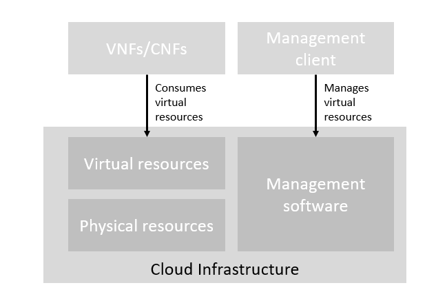

   Cloud Infrastructure Model Overview

The functionalities of each layer are as follows:

**Virtual Infrastructure Layer**

- **Virtual infrastructure resources:** These are all the infrastructure resources (compute, storage and networks)
  which the cloud infrastructure provides to the VNF/CNF and other workloads. These virtual resources can be managed
  by the tenants and tenant workloads directly or indirectly via an application programming interface (API).
- **Virtual infrastructure manager:** This consists of the software components that manage the virtual resources and
  make those management capabilities accessible via one or more APIs. The responsibilities of this functionality include
  the management of logical constructs such as tenants, tenant workloads, resource catalogues, identities, access
  controls, security policies, etc.

**Hardware Infrastructure Layer**

- **Hardware infrastructure manager:** This is a logical block of functionality responsible for the management of the
  abstracted hardware resources (compute, network and storage) and as such it is shielded from the direct involvement
  with server host software.
- **Hardware resources:** These consist of physical hardware components such as servers, (including random access
  memory, local storage, network ports, and hardware acceleration devices), storage devices, network devices, and the
  basic input output system (BIOS).

**Workload Layer**

- **Workloads (VNFs/CNFs):** These consist of workloads such as virtualized and/or containerized network functions that
  run within a virtual machine (VM) or as a set of containers.

Virtual Infrastructure Layer
----------------------------

Virtual Resources
~~~~~~~~~~~~~~~~~

The virtual infrastructure resources provided by the Cloud Infrastructure can be grouped into four categories as shown
in the diagram below:

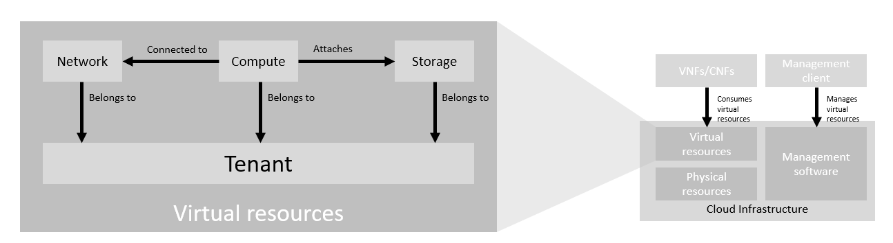

   Virtual Infrastructure Resources provide virtual compute, storage and networks in a tenant context

- **Tenants:** represent an isolated and independently manageable elastic pool of compute, storage and network resources
- **Compute resources:** represent virtualised computes for workloads and other systems as necessary
- **Storage resources:** represent virtualised resources for persisting data
- **Network resources:** represent virtual resources providing layer 2 and layer 3 connectivity

The virtualised infrastructure resources related to these categories are listed below.

Tenant
^^^^^^

A cloud infrastructure needs to be capable of supporting multiple tenants and has to isolate sets of infrastructure
resources dedicated to specific workloads (VNF/CNF) from one another. Tenants represent an independently manageable
logical pool of compute, storage and network resources abstracted from physical hardware.

**Example**\ *: a tenant within an OpenStack environment or a Kubernetes cluster.*

============ =======================================================================================================
Attribute    Description
============ =======================================================================================================
``name``     name of the logical resource pool
``type``     type of tenant (e.g. OpenStack tenant, Kubernetes cluster, …)
``vcpus``    max. number of virtual CPUs
``ram``      max. size of random access memory in GB
``disk``     max. size of ephemeral disk in GB
``networks`` description of external networks required for inter-domain connectivity
``metadata`` key/value pairs for selection of the appropriate physical context (e.g. location, availability zone, …)
============ =======================================================================================================

**Table 3-1:** Attributes of a tenant

Virtual Compute
^^^^^^^^^^^^^^^

A virtual machine or a container/pod capable of hosting the application components of workloads (VNFs/CNFs) of the
tenant. A virtual compute therefore requires a tenant context and, since it will need to communicate with other
communication partners, it is assumed that the networks have been provisioned in advance.

**Example**\ *: a virtual compute descriptor as defined in TOSCA Simple Profile for NFV.*

================ =============================================================================
Attribute        Description
================ =============================================================================
``name``         name of the virtual host
``vcpus``        number of virtual CPUs
``ram``          size of random access memory in GB
``disk``         size of root disc in GB
``nics``         sorted list of network interfaces connecting the host to the virtual networks
``acceleration`` key/value pairs for selection of the appropriate acceleration technology
``metadata``     key/value pairs for selection of the appropriate redundancy domain
================ =============================================================================

**Table 3-2:** Attributes of compute resources

Virtual Storage
^^^^^^^^^^^^^^^

A virtual machine and container can consume storage through a number of means. These include storage that is:

- managed via the hypervisor and container runtime (Hypervisor Attached for virtual machine and Container Persistent for
  containers) and is connected via cloud infrastructure underlay network and
- Shared File Storage and the Object storage which is connected via the tenant / user overlay network.
  The details of the tenant storage consumption model are covered in section
  `Storage for Tenant Consumption`_.

In managing the provision of virtual storage the tenant should be able to request alternate performance levels, capacity
and behaviours. The set of selectable attributes includes:

- Storage class: Block, File, Object.
- Retention Policy - persistent (storage volume / data) is persistent across stop/start of workload; ephemeral storage -
  there is no data retention across stop/start events for the workload.
- Underlying physical device type (HDD, SSD, etc.).
- Performance characteristic - defined as: Latency, IOPS (Input/Output Operations per second), and throughput.
- Enhanced features - set of selectable features such as: auto-replicate, encryption, snapshot support.

Note that approximate numeric ranges for the qualitative values used above are given in the
:ref:`chapters/chapter04:storage extensions` section.

Storage resources have the following attributes, with metric definitions that support verification through passive
measurements (telemetry) where appropriate:

========================= ==============================================================================================
Attribute                 Description
========================= ==============================================================================================
``name``                  name of storage resources
``data retention policy`` persistent or ephemeral
``performance``           Read and Write Latency, The average amount of time to perform a R/W operation, in milliseconds
\                         Read and Write IOPS, The average rate of performing R/W in IO operations per second
\                         Read and Write Throughput, The average rate of performing R/W operations in Bytes per second
``enhanced features``     replication, encryption
``type``                  block, object or file
``size``                  size in GB, telemetry includes the amount of free, used, and reserved disk space, in bytes
========================= ==============================================================================================

**Table 3-3:** Attributes of storage resources

Virtual Network
^^^^^^^^^^^^^^^

This topic is covered in `Network <#network>`__ section.

Availability Zone
^^^^^^^^^^^^^^^^^

An availability zone is a logical pool of physical resources (e.g. compute, block storage, and network). These logical
pools segment the physical resources of a cloud based on factors chosen by the cloud operator. The cloud operator may
create availability zones based on location (rack, datacenter), or indirect failure domain dependencies like power
sources. Workloads can leverage availability zones to utilise multiple locations or avoid sharing failure domains for a
workload, and thus increase the workloads' fault-tolerance.

As a logical group with operator-specified criteria, the only mandatory attribute for an Availability Zone is the name.

========= =============================
Attribute Description
========= =============================
``name``  name of the availability zone
========= =============================

**Table 3-4:** Attributes of availability zones

Virtual Infrastructure Manager
~~~~~~~~~~~~~~~~~~~~~~~~~~~~~~

The virtual infrastructure manager allows:

- setup, manage and delete tenants,
- setup, manage and delete user- and service-accounts,
- manage access privileges and
- provision, manage, monitor and delete virtual resources.

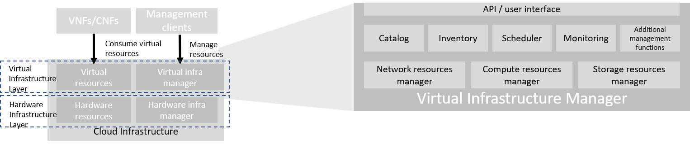

   Virtual Infrastructure Manager

The virtual infrastructure manager needs to support the following functional aspects:

- **API/UI**: an application programming interface / user interface providing access to the virtual resource management
  function
- **Catalogue**: manages the collection of available templates for virtual resource the cloud infrastructure can provide
- **Inventory**: manages the information related to virtual resources of a cloud infrastructure
- **Scheduler**: receives requests via API/UI, provisions and manages virtual resources by coordinating the activities
  of the compute-, storage- and network resources managers
- **Monitoring**: monitors and collects information on all events and the current state of all virtual resources
- **Additional Management Functions**: include identity management, access management, policy management (e.g. to
  enforce security policies), etc.
- **Compute Resources Manager**: provides a mechanism to provision virtual resources with the help of hardware compute
  resources
- **Storage Resources Manager**: provides a mechanism to provision virtual resources with the help of hardware storage
  resources
- **Network Resources Manager**: provides a mechanism to provision virtual resources with the help of hardware network
  resources

Hardware Infrastructure Layer
-----------------------------

Hardware Infrastructure Resources
~~~~~~~~~~~~~~~~~~~~~~~~~~~~~~~~~

Compute, Storage and Network resources serve as the foundation of the cloud infrastructure. They are exposed to and used
by a set of networked Host Operating Systems in a cluster that normally handles the Virtual Infrastructure Layer
offering Virtual Machines or Containers where the application workloads (VNFs/CNFs) runs.

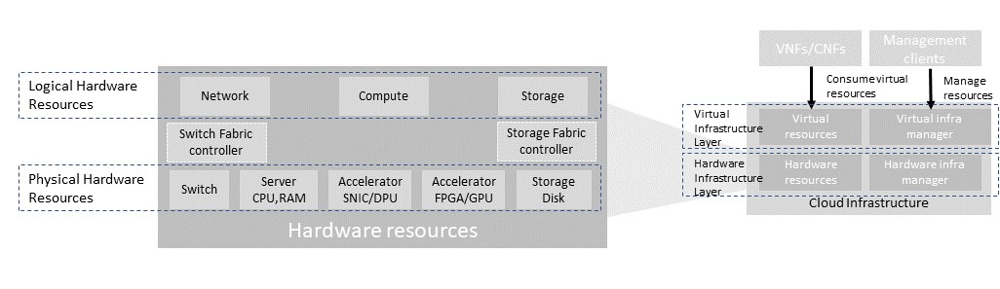

   Cloud Infrastructure Hardware Resources

In managed Hardware Infrastructure systems, these consumable Compute, Storage and Network resources can be provisioned
through operator commands or through software APIs. There is a need to distinguish between these consumable resources,
that are treated as leased resources, from the actual physical hardware resources that are installed in the data centre.
For this purpose, the hardware resource layer is conceptually split into a Logical Resource Layer that surfaces the
consumable resources to the software layer above, and the Physical Resource Layer that is operated and managed by the
Cloud Infrastructure Providers Operations team from the Hardware Infrastructure Management functions perspective.

Some installations might use a cluster of managed switches or storage components controlled by a Switch Fabric
controller and/or a Storage Fabric controller acting as an appliance system. These systems should be federated with the
HW Infrastructure Management system over some API to facilitate exchange of configuration intent, status and telemetry
information allowing the Hardware Infrastructure Management and Management stack to automate Cloud Infrastructure
operations. These appliance systems normally also have their own Equipment Management APIs and procedures for the
hardware installation and maintenance staff.

An example could be a Cloud Infrastructure stack federated with a commercial Switch Fabric where the Cloud
Infrastructure shall be able to "send" networking configuration intent to the Switch Fabric and the Switch Fabric shall
be able to "send" (see note below) status and telemetry information to the Cloud Infrastructure e.g. Port/Link Status
and packet counters of many sorts.
This allows Hardware Infrastructure Management and Cloud Infrastructure management stack to have network automation that
includes the switches that are controlled by the federated Switch Fabric. This would be a rather normal case for
Operators that have a separate Networking Department that owns and runs the Switch Fabric separately from the Data
Centre.

NOTE: The word "send" is a very lose definition of getting a message across to the other side, and could be implemented
in many different ways.

Hardware Acceleration Resources
^^^^^^^^^^^^^^^^^^^^^^^^^^^^^^^

For a given software network function and software infrastructure, Hardware Acceleration resources can be used to
achieve requirements or improve cost/performance. Following table gives reasons and examples for using Hardware
Acceleration.

+--------------------------------+-------------------------------------------+-----------------------------------------+
| Reason for using Hardware      | Example                                   | Comment                                 |
| Acceleration                   |                                           |                                         |
+================================+===========================================+=========================================+
| Achieve technical requirements | Strict latency or timing accuracy         | Must be done by optimizing compute      |
|                                |                                           | node; cannot be solved by adding more   |
|                                |                                           | compute nodes                           |
+--------------------------------+-------------------------------------------+-----------------------------------------+
| Achieve technical requirements | Fit within power or space envelope        | Done by optimizing cluster of compute   |
|                                |                                           | nodes                                   |
+--------------------------------+-------------------------------------------+-----------------------------------------+
| Improve cost/performance       | Better cost and less power/cooling by     | Used when functionality can be achieved |
|                                | improving performance per node            | through usage of accelerator or by      |
|                                |                                           | adding more compute nodes               |
+--------------------------------+-------------------------------------------+-----------------------------------------+

**Table 3-5:** Reasons and examples for using Hardware Acceleration

Hardware Accelerators can be used to offload software execution for purpose of accelerating tasks to achieve faster
performance, or offloading the tasks to another execution entity to get more predictable execution times, efficient
handling of the tasks or separation of authority regarding who can control the tasks execution.

More details about Hardware Acceleration are in `hardware acceleration abstraction`_.

Hardware Infrastructure Manager
~~~~~~~~~~~~~~~~~~~~~~~~~~~~~~~

The Hardware Infrastructure Manager shall at least support equipment management for all managed physical hardware resources of
the Cloud Infrastructure.

In most deployments the Hardware Infrastructure Manager should also be the HW Infrastructure Layer provisioning manager
of the Compute, Storage and Network resources that can be used by the Virtualization Infrastructure Layer instances. It
shall provide an API enabling vital resource recovery and control functions of the provisioned functions e.g. Reset and
Power control of the Computes.

For deployments with more than one Virtualization Infrastructure Layer instance that will be using a common pool of
hardware resources there is a need for a HW Infrastructure Layer provisioning manager of the Compute, Storage and
Network resources to handle the resource assignment and arbitration.

The resource allocation could be a simple book-keeping of which Virtualization Infrastructure Layer instance that have
been allocated a physical hardware resource or a more advanced resource Composition function that assemble the consumed
Compute, Storage and Network resources on demand from the pools of physical hardware resources.

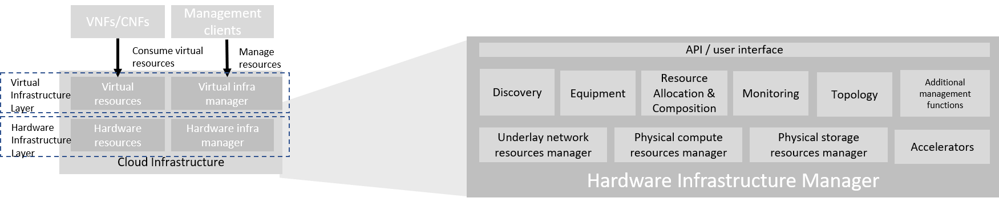

   Hardware Infrastructure Manager

The hardware infrastructure manager allows to:

- provision, manage, monitor and delete hardware resources
- manage physical hardware resource discovery, monitoring and topology
- manage hardware infrastructure telemetry and log collection services

The hardware infrastructure manager needs to support the following functional aspects:

- **API/UI**: an application programming interface / user interface providing access to the hardware resource
  management functions
- **Discovery**: discover physical hardware resources and collect relevant information about them
- **Topology**: discover and monitor physical interconnection (e.g. cables) in between the physical hardware resources
- **Equipment**: manages the physical hardware resources in terms of configuration, firmware status, health/fault status
  and autonomous environmental control functions such as fan and power conversion regulations
- **Resource Allocation and Composition**: creates, modifies and deletes logical Compute, Network and Storage Resources
  through Composition of allocated physical hardware resources
- **Underlay Network Resources Manager**: provides a mechanism to provision hardware resources and provide separation in
  between multiple Virtualization Infrastructure instances for the use of the underlay network (e.g. switch fabric,
  switches, SmartNICs)
- **Monitoring**: monitors and collects information on events, current state and telemetry data of physical hardware
  resources, autonomous equipment control functions as well as Switch and Storage Fabric systems
- **Additional Management Functions**: include software and configuration life cycle management, identity management,
  access management, policy management (e.g. to enforce security policies), etc.

Left for future use
-------------------

This section is left blank for future use

Network
-------

Networking, alongside Compute and Storage, is an integral part of the Cloud Infrastructure (Network Function
Virtualisation Infrastructure). The general function of networking in this context is to provide the connectivity
between various virtual and physical resources required for the delivery of a network service. Such connectivity may
manifest itself as a virtualised network between VMs and/or containers (e.g. overlay networks managed by SDN
controllers, and/or programmable network fabrics) or as an integration into the infrastructure hardware level for
offloading some of the network service functionality.

Normalization of the integration reference points between different layers of the Cloud Infrastructure architecture is
one of the main concerns. In the networking context the primary focus is directed on the packet flow and control flow
interfaces between the virtual resources (referred to as Software (SW) Virtualisation Layer) and physical resources
(referred to as Hardware (HW) Infrastructure Layer), as well as on related integration into the various MANO reference
points (hardware/network infrastructure management, orchestration). The identification of these two different layers
(SW Virtualisation Layer and HW Infrastructure Layer) remains in alignment with the separation of resources into virtual
and physical resources, generally used in this document, see e.g., :numref:`Cloud Infrastructure Model Overview`. The
importance of understanding the separation of concerns between SW Virtualisation Layer and HW Infrastructure Layer is
important because without it, the cardinality of having multiple CaaS and IaaS instances executing on their own private
virtual resources from the single shared HW Infrastructure Layer cannot be expressed into separate administrative
domains.

Network Principles
~~~~~~~~~~~~~~~~~~

Principles that should be followed during the development and definition of the networking scope for the Reference
Model, Reference Architectures, Reference Implementations and Reference Conformance test suites:

- Abstraction: A standardized network abstraction layer between the Virtualisation Layers and the Network Physical
  Resources Layer that hides (or abstracts) the details of the Network Physical resources from the Virtualisation
  Layers.

..

   **Note:** In deployment phases this principle may be applied in many different ways e.g. depending on target use case
   requirements, workload characteristics, different algorithm implementations of pipeline stages and available
   platforms. The network abstraction layer supports, for example, physical resources with or without programmable
   hardware acceleration, or programmable network switches

- Agnosticism: Define Network Fabric concepts and models that can carry any type of traffic in terms of:

  - Control, User and Management traffic types
  - Acceleration technologies that can support multiple types of infrastructure deployments and network function
    workloads

- Automation: Enable end-to-end automation, from Physical Fabric installation and provisioning to automation of
  workloads (VNF/CNF) onboarding.
- Openness: All networking is based on open source or standardized APIs (North Bound Interfaces (NBI) and South Bound
  Interfaces (SBI)) and should enable integration of open source networking components such as SDN controllers.
- Programmability: Network model enables a programmable forwarding plane controlled from a separately deployed control
  plane.
- Scalability: Network model enables scalability to handle all traffic traverse North-South and East-West enabling small
  up to large deployments in a non-blocking manner.
- Workload agnostic: Network model is capable of providing connectivity to any type of workloads, including VNF, CNF and
  BareMetal workloads.
- Carrier Grade: Network model is capable of supporting deployments of the carrier grade workloads.
- Future proof: Network model is extendible to support known and emerging technology trends including SmartNICs, FPGAs
  and Programmable Switches, integrated for multi-clouds, and Edge related technologies.

Network Layering and Concepts
~~~~~~~~~~~~~~~~~~~~~~~~~~~~~

The Cloud Infrastructure Networking Reference Model is an essential foundation that governs all Reference Architectures
and Cloud Infrastructure implementations to enable multiple cloud infrastructure virtualisation technology choices and
their evolution. These include:

- Single Infrastructure as a Service (IaaS) based virtualisation instances with Virtual Machines (VM)
- Multi IaaS based virtualisation instances
- Cloud Native Container as a Service (CaaS) based virtualisation instances, and
- Hybrid multi IaaS and CaaS based virtualisation instances

To retain the cloud paradigms of automation, scalability and usage of shared hardware resources when introducing CaaS
instances it is necessary to enable an ability to co-deploy multiple simultaneous IaaS and CaaS instances on a shared
pool of hardware resources.

Compute and Storage resources are rarely shared in between IaaS or CaaS instances, but the underpinning networking, most
commonly implemented with Ethernet and IP, must be shared and managed as a shared pool of underlay network resources to
enable the pooled usage of Compute and Storage from a managed shared pool.

Throughout this chapter and its figures a number of references to ETSI NFV are made and they explicitly are made towards
the ETSI NFV models in the Architectural Framework:

- ETSI GS NFV 002 V1.2.1 cite:p:`etsigsnfv002`
- ETSI GR NFV-IFA 029 V3.3.1 :cite:p:`etsigrnfvifa029`

Cloud and Telco networking are layered, and it is very important to keep the dependencies between the layers low to
enable security, separation and portability in between multiple implementations and generations.

Before we start developing a deep model we need to agree on some foundational concepts and layering that allow
decoupling of implementations in between the layers. We will emphasize four concepts in this section:

- Underlay and Overlay Networking concepts
- Hardware and Virtual Infrastructure Layer concepts
- Software Defined Underlay and Overlay Networking concepts
- Programmable Networking Fabric concept

Underlay and Overlay Networking Concepts
^^^^^^^^^^^^^^^^^^^^^^^^^^^^^^^^^^^^^^^^

The ETSI Network Functions Virtualisation Architectural Framework (as referred above) describes how a Virtual
Infrastructure Layer instance abstracts the hardware resources and separates Virtualisation Tenants (Workload) from each
other. It does also specifically state that the control and implementation of the hardware layer is out of scope for
that specification.

When having multiple Virtual Infrastructure Layer instances on a shared hardware infrastructure, the networking can be
layered in an Underlay and an Overlay Network layer. The purpose with this layering is to ensure separation of the
Virtualisation Tenants (Workload) Overlay Networks from each other, whilst allowing the traffic to flow on the shared
Underlay Network in between all Ethernet connected hardware (HW) devices.

The Overlay Networking separation is often done through encapsulation of Tenants traffic using overlay protocols e.g.
through VxLAN or EVPN on the Underlay Networks e.g. based on L2 (VLAN) or L3 (IP) networks.

The Overlay Network for each Cloud Infrastructure deployment must support a basic primary Tenant Network between the
Instances within each Tenant. Due to the nature of Telecom applications handling of Networks and their related Network
Functions they often need access to external non-translated traffic flows and have multiple separated or secondary
traffic channels with abilities for different traffic treatments.

In some instances, the Virtualisation Tenants can bypass the Overlay Networking encapsulation to achieve better
performance or network visibility/control. A common method to bypass the Overlay Networking encapsulation normally done
by the Virtualisation Layer, is the VNF/CNF usage of SR-IOV that effectively take over the Physical and Virtual
Functions of the NIC directly into the VNF/CNF Tenant. In these cases, the Underlay Networking must handle the
separation e.g. through a Virtual Termination End Point (VTEP) that encapsulate the Overlay Network traffic.

   **Note:** Bypassing the Overlay Networking layer is a violation of the basic decoupling principles, but is in some
   cases unavoidable with existing technologies and available standards. Until suitable technologies and standards are
   developed, a set of agreed exemptions has been agreed that forces the Underlay Networking to handle the bypassed
   Overlay Networking separation.

VTEP could be manually provisioned in the Underlay Networking or be automated and controlled through a Software Defined
Networking controller interfaces into the underlying networking in the HW Infrastructure Layer.

Hardware and Virtual Infrastructure Layer Concepts
^^^^^^^^^^^^^^^^^^^^^^^^^^^^^^^^^^^^^^^^^^^^^^^^^^

The Cloud Infrastructure (based on ETSI NFV Infrastructure with hardware extensions) can be considered to be composed of
two distinct layers, here referred to as HW Infrastructure Layer and Virtual Infrastructure Layer. When there are
multiple separated simultaneously deployed Virtual Infrastructure domains, the architecture and deployed implementations
must enable each of them to be in individual non-dependent administrative domains. The HW Infrastructure must then also
be enabled to be a fully separated administrative domain from all of the Virtualisation domains.

For Cloud Infrastructure implementations of multiple well separated simultaneous Virtual Infrastructure Layer instances
on a shared HW Infrastructure there must be a separation of the hardware resources i.e. servers, storage and the
Underlay Networking resources that interconnect the hardware resources e.g. through a switching fabric.

To allow multiple separated simultaneous Virtual Infrastructure Layer instances onto a shared switching fabric there is
a need to split up the Underlay Networking resources into non overlapping addressing domains on suitable protocols e.g.
VxLAN with their VNI Ranges. This separation must be done through an administrative domain that could not be compromised
by any of the individual Virtualisation Infrastructure Layer domains either by malicious or unintentional Underlay
Network mapping or configuration.

These concepts are very similar to how the Hyperscaler Cloud Providers (HCP) offer Virtual Private Clouds for users of
Bare Metal deployment on the HCP shared pool of servers, storage and networking resources.

The separation of Hardware and Virtual Infrastructure Layers administrative domains makes it important that the
Reference Architectures do not include direct management or dependencies of the pooled physical hardware resources in
the HW Infrastructure Layer e.g. servers, switches and underlay networks from within the Virtual Infrastructure Layer.
All automated interaction from the Virtual Infrastructure Layer implementations towards the HW Infrastructure with its
shared networking resources in the HW Infrastructure Layer must go through a common abstracted Reference Model
interface.

Software Defined Underlay and Overlay Networking Concepts
^^^^^^^^^^^^^^^^^^^^^^^^^^^^^^^^^^^^^^^^^^^^^^^^^^^^^^^^^

A major point with a Cloud Infrastructures is to automate as much as possible. An important tool for Networking
automation is Software Defined Networking (SDN) that comes in many different shapes and can act on multiple layers of
the networking. In this section we will deal with the internal networking of a datacentre and not how datacentres
interconnect with each other or get access to the world outside of a datacentre.

When there are multiple simultaneously deployed instances of the Virtual Infrastructure Layers on the same HW
Infrastructure, there is a need to ensure Underlay networking separation in the HW Infrastructure Layer. This separation
can be done manually through provisioning of a statically configured separation of the Underlay Networking in the HW
Infrastructure Layer. A better and more agile usage of the HW Infrastructure is to offer each instance of the Virtual
Infrastructure Layer a unique instance of a SDN interface into the shared HW Infrastructure. Since these SDN instances
only deal with a well separated portion (or slice) of the Underlay Networking we call this interface SDN-Underlay
(SDNu).

The HW Infrastructure Layer is responsible for keeping the different Virtual Infrastructure Layer instances separated in
the Underlay Networking. This can be done through manual provisioning methods or be automated through a HW
Infrastructure Layer orchestration interface. The separation responsibility is also valid between all instances of the
SDNu interface since each Virtual Infrastructure Layer instance shall not know about, be disturbed by or have any
capability to reach the other Virtual Infrastructure instances.

An SDN-Overlay control interface (here denoted SDNo) is responsible for managing the Virtual Infrastructure Layer
virtual switching and/or routing as well as its encapsulation and its mapping onto the Underlay Networks.

In cases where the VNF/CNF bypasses the Virtual Infrastructure Layer virtual switching and its encapsulation, as
described above, the HW Infrastructure Layer must perform the encapsulation and mapping onto the Underlay Networking to
ensure the Underlay Networking separation. This should be a prioritized capability in the SDNu control interface since
Anuket currently allow exemptions for bypassing the virtual switching (e.g. through SR-IOV).

SDNo controllers can request Underlay Networking encapsulation and mapping to be done by signalling to an SDNu
controller. There are however today no standardized way for this signalling and because of that there is a missing
reference point and API description in this architecture.

Multiple instances of Container as a Service (CaaS) Virtual Infrastructure Layers running on an Infrastructure as a
Service (IaaS) Virtual Infrastructure Layer could make use of the IaaS layer to handle the required Underlay Networking
separation. In these cases, the IaaS Virtualisation Infrastructure Manager (VIM) could include an SDNu control interface
enabling automation.

   **Note:** The Reference Model describes a logical separation of SDNu and SDNo interfaces to clarify the separation of
   administrative domains where applicable. In real deployment cases an Operator can select to deploy a single SDN
   controller instance that implements all needed administrative domain separations or have separate SDN controllers for
   each administrative domain. A common deployment scenario today is to use a single SDN controller handling both
   Underlay and Overlay Networking which works well in the implementations where there is only one administrative domain
   that owns both the HW Infrastructure and the single Virtual Infrastructure instance. However a shared Underlay
   Network that shall ensure separation must be under the control of the shared HW Infrastructure Layer.
   One consequence of this is that the Reference Architectures must not model collapsed SDNo and SDNu controllers since
   each SDNo must stay unaware of other deployed implementations in the Virtual Infrastructure Layer running on the same
   HW Infrastructure.

Programmable Networking Fabric Concept
^^^^^^^^^^^^^^^^^^^^^^^^^^^^^^^^^^^^^^

The concept of a Programmable Networking Fabric pertains to the ability to have an effective forwarding pipeline (a.k.a.
forwarding plane) that can be programmed and/or configured without any risk of disruption to the shared Underlay
Networking that is involved with the reprogramming for the specific efficiency increase.

The forwarding plane is distributed by nature and must be possible to implement both in switch elements and on SmartNICs
(managed outside the reach of host software), that both can be managed from a logically centralised control plane,
residing in the HW Infrastructure Layer.

The logically centralised control plane is the foundation for the authoritative separation between different
Virtualisation instances or Bare Metal Network Function applications that are regarded as untrusted both from the shared
layers and each other.

Although the control plane is logically centralized, scaling and control latency concerns must allow the actual
implementation of the control plane to be distributed when required.

All VNF, CNF and Virtualisation instance acceleration as well as all specific support functionality that is programmable
in the forwarding plane must be confined to the well separated sections or stages of any shared Underlay Networking. A
practical example could be a Virtualisation instance or VNF/CNF that controls a NIC/SmartNIC where the Underlay
Networking (Switch Fabric) ensures the separation in the same way as it is done for SR-IOV cases today.

The nature of a shared Underlay Network that shall ensure separation and be robust is that all code in the forwarding
plane and in the control plane must be under the scrutiny and life cycle management of the HW Infrastructure Layer.

This also implies that programmable forwarding functions in a Programmable Networking Fabric are shared resources and by
that will have to get standardised interfaces over time to be useful for multiple VNF/CNF and multi-vendor architectures
such as ETSI NFV. Example of such future extensions of shared functionality implemented by a Programmable Networking
Fabric could be L3 as a Service, Firewall as a Service and Load Balancing as a Service.

   **Note:** Appliance-like applications that fully own its infrastructure layers (share nothing) could manage and
   utilize a Programmable Networking Fabric in many ways, but that is not a Cloud Infrastructure implementation and
   falls outside the use cases for these specifications.

Networking Reference Model
~~~~~~~~~~~~~~~~~~~~~~~~~~

The Cloud Infrastructure Networking Reference Model depicted in
:numref:`Networking Reference Model based on the ETSI NFV` is based on the ETSI NFV model
enhanced with Container Virtualisation support and a strict separation of the HW Infrastructure and Virtualization
Infrastructure Layers in NFVI. It includes all above concepts and enables multiple well separated simultaneous
Virtualisation instances and domains allowing a mix of IaaS, CaaS on IaaS and CaaS on Bare Metal on top of a shared HW
Infrastructure.

It is up to any deployment of the Cloud Infrastructure to decide what Networking related objects to use, but all
Reference Architectures have to be able to map into this model.

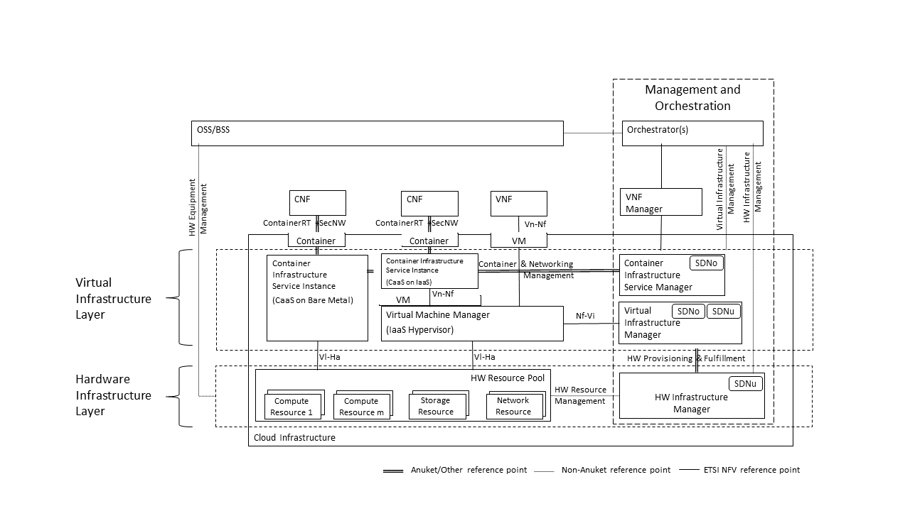

   Networking Reference Model based on the ETSI NFV

Deployment Examples Based on the Networking Reference Model
~~~~~~~~~~~~~~~~~~~~~~~~~~~~~~~~~~~~~~~~~~~~~~~~~~~~~~~~~~~

Switch Fabric and SmartNIC Examples For Underlay Networking Separation
^^^^^^^^^^^^^^^^^^^^^^^^^^^^^^^^^^^^^^^^^^^^^^^^^^^^^^^^^^^^^^^^^^^^^^

The Hardware Infrastructure Layer can implement the Underlay Networking separation in any type of packet handling component.
This may be deployed in many different ways depending on target use case requirements, workload characteristics and
available platforms. Two of the most common ways are: (1) within the physical Switch Fabric and (2) in a SmartNIC
connected to the Server CPU being controlled over a management channel that is not reachable from the Server CPU and its
host software. In either way the Underlay Networking separation is controlled by the HW Infrastructure Manager.

In both cases the Underlay Networking can be externally controlled over the SDNu interface that must be instantiated
with appropriate Underlay Networking separation for each of the Virtualization administrative domains.

   **Note:** The use of SmartNIC in this section is only pertaining to Underlay Networking separation of Virtual
   instances in separate Overlay domains in much the same way as AWS do with their Nitro SmartNIC. This is the important
   consideration for the Reference Model that enables multiple implementation instances from one or several Reference
   Architectures to be used on a shared Underlay Network. The use of SmartNIC components from any specific Virtual
   instance e.g. for internal virtual switching control and acceleration must be regulated by each Reference
   Architecture without interfering with the authoritative Underlay separation laid out in the Reference Model.

Two exemplifications of different common HW realisations of Underlay Network separation in the HW Infrastructure Layer
can be seen in :numref:`Underlay Networking separation examples` below.

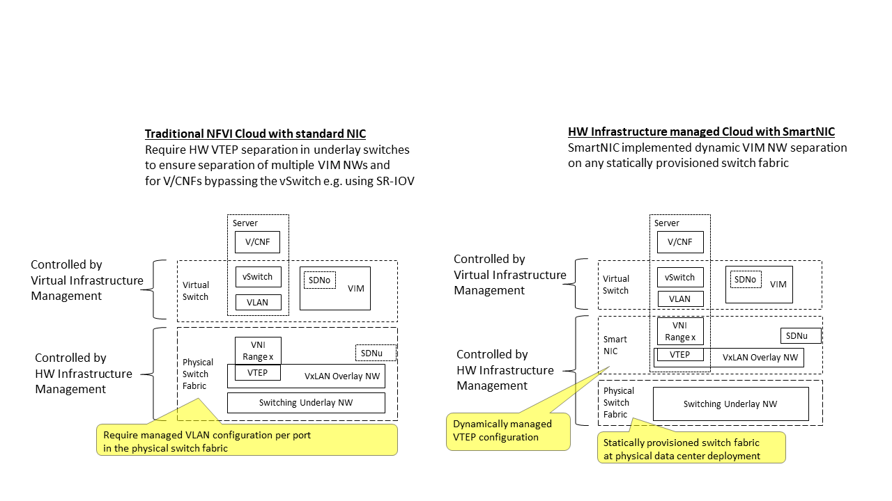

   Underlay Networking separation examples

SDN Overlay and SDN Underlay layering and relationship example
^^^^^^^^^^^^^^^^^^^^^^^^^^^^^^^^^^^^^^^^^^^^^^^^^^^^^^^^^^^^^^

Two use case examples with both SDNo and SDNu control functions depicting a software based virtual switch instance in
the Virtual Infrastructure Layer and another high performance oriented Virtual Infrastructure instance (e.g. enabling
SR-IOV) are described in :numref:`SDN Controller relationship examples` (below). The examples are showing how the
encapsulation and mapping could be done in the virtual switch or in a SmartNIC on top of a statically provisioned
underlay switching fabric, but another example could also have been depicted with the SDNu controlling the underlay
switching fabric without usage of SmartNICs.

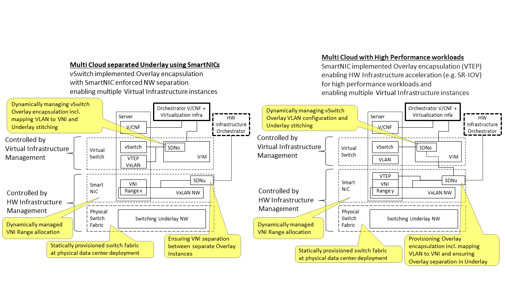

   SDN Controller relationship examples

Example of IaaS and CaaS Virtualization Infrastructure Instances on a Shared HW Infrastructure With SDN
^^^^^^^^^^^^^^^^^^^^^^^^^^^^^^^^^^^^^^^^^^^^^^^^^^^^^^^^^^^^^^^^^^^^^^^^^^^^^^^^^^^^^^^^^^^^^^^^^^^^^^^

A Networking Reference Model deployment example is depicted in :numref:`Networking Reference Model deployment example`
(below) to demonstrate the mapping to ETSI NFV reference points with additions of packet flows through the
infrastructure layers and some other needed reference points. The example illustrates individual responsibilities of a
complex organization with multiple separated administrative domains represented with separate colours.

The example is or will be a common scenario for operators that modernise their network functions during a rather long
period of migration from VNFs to Cloud Native CNFs. Today the network functions are predominantly VNFs on IaaS
environments and the operators are gradually moving a selection of these into CNFs on CaaS that either sit on top of the
existing IaaS or directly on Bare Metal. It is expected that there will be multiple CaaS instances in most networks,
since it is not foreseen any generic standard of a CaaS implementation that will be capable to support all types of CNFs
from any vendor. It is also expected that many CNFs will have dependencies to a particular CaaS version or instances
which then will prohibit a separation of Life Cycle Management in between individual CNFs and CaaS instances.

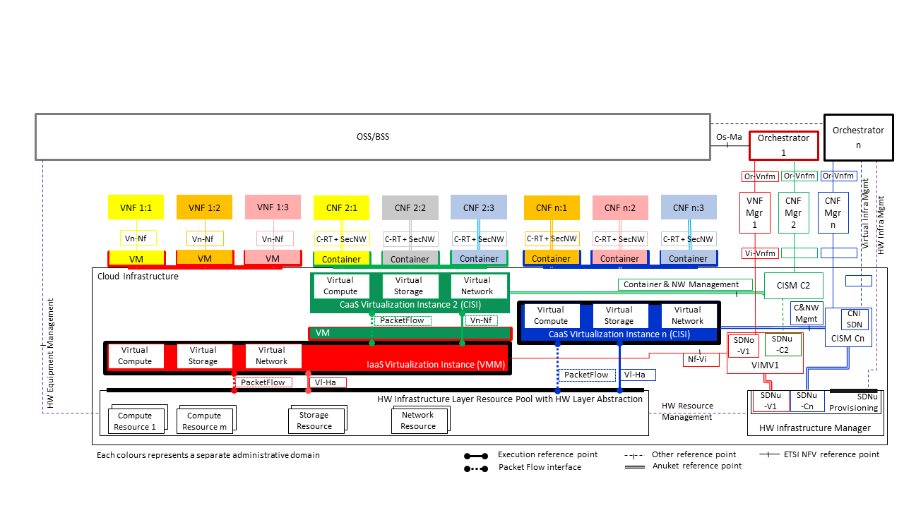

   Networking Reference Model deployment example

Service Function Chaining
~~~~~~~~~~~~~~~~~~~~~~~~~

Over the past few years there has been a significant move towards decomposing network functions into smaller
sub-functions that can be independently scaled and potentially reused across multiple network functions. A service chain
allows composition of network functions by passing selected packets through multiple smaller services.

In order to support this capability in a sustainable manner, there is a need to have the capability to model service
chains as a high level abstraction. This is essential to ensure that the underlying connection setup, and (re-)direction
of traffic flows can be performed in an automated manner. At a very high level a service chain can be considered a
directed acyclic graph with the composing network functions being the vertices. Building on top of this, a service chain
can be modelled by defining two parameters:

-  An acyclic graph defining the service functions that need to be traversed for the service chain. This allows for
   multiple paths for a packet to traverse the service chain.
-  A set of packet/flow classifiers that determine what packets will enter and exit a given service chain

These capabilities need to be provided for both virtualised and containerised (cloud-native) network functions as there
will be a need to support both of them for the foreseeable future. Since virtualised network functions have existed for
a while there is existing, albeit partial, support for service chaining in virtualised environments in orchestration
platforms like OpenStack. Container orchestration platforms such as Kubernetes don't support service chaining and may
require development of new primitives in order to support advanced networking functions.

It is expected that reference architectures will provide a service chain workflow manager that would accept the service
function acyclic graph and be able to identify/create the necessary service functions and the networking between them in
order to instantiate such a chain.

There is also a need to provide specialised tools to aid troubleshooting of individual services and the communication
between them in order to investigate issues in the performance of composed network functions. Minimally, there is a need
to provide packet level and byte level counters and statistics as the packets pass through the service chain in order to
ascertain any issues with forwarding and performance. Additionally, there is a need for mechanisms to trace the paths of
selected subsets of traffic as they flow through the service chain.

Service Function Chaining Model Introduction
^^^^^^^^^^^^^^^^^^^^^^^^^^^^^^^^^^^^^^^^^^^^

Service Function Chaining (SFC) can be visualized as a layered structure where the Service Function plane (SFC data
plane, consists of service function forwarder, classifier, service function, service function proxy) resides over a
Service Function overlay network.
SFC utilizes a service-specific overlay that creates the service topology. The service overlay provides service function
connectivity built "on top" of the existing network topology. It leverages various overlay network technologies (e.g.,
Virtual eXtensible Local Area Network (VXLAN)) for interconnecting SFC data-plane elements and allows establishing
Service Function Paths (SFPs).

In a typical overlay network, packets are routed based on networking principles and use a suitable path for the packet
to be routed from a source to its destination.

However, in a service-specific overlay network, packets are routed based on policies. This requires specific support at
network level such as at CNI in CNF environment to provide such specific routing mechanism.

SFC Architecture
^^^^^^^^^^^^^^^^

The SFC Architecture is composed of functional management, control and data components as categorised in the Table 3-6
below.

The table below highlights areas under which common SFC functional components can be categorized.

+------------+------------------------+--------------------------------------------------------------------------------+
| Components | Example                | Responsibilities                                                               |
+============+========================+================================================================================+
| Management | ``SFC orchestrator``   | High Level of orchestrator Orchestrate the SFC based on SFC Models/Policies    |
|            |                        | with help of control components.                                               |
|            +------------------------+--------------------------------------------------------------------------------+
|            | ``SFC OAM Components`` | Responsible for SFC OAM functions                                              |
|            +------------------------+--------------------------------------------------------------------------------+
|            | ``VNF MANO``           | NFVO, VNFM, and VIM Responsible for SFC Data components lifecycle              |
|            +------------------------+--------------------------------------------------------------------------------+
|            | ``CNF MANO``           | CNF DevOps Components Responsible for SFC data components lifecycle            |
+------------+------------------------+--------------------------------------------------------------------------------+
| Control    | ``SFC SDN Controller`` | SDNC responsible to create the service specific overlay network. Deploy        |
|            |                        | different techniques to stitch the wiring but provide the same functionality,  |
|            |                        | for example l2xconn, SRv6 , Segment routing etc.                               |
|            +------------------------+--------------------------------------------------------------------------------+
|            | ``SFC Renderer``       | Creates and wires ports/interfaces for SF data path                            |
+------------+------------------------+--------------------------------------------------------------------------------+
| Data       | ``Core Components``\   | Responsible for steering the traffic for intended service functionalities      |
|            | SF, SFF, SF Proxy      | based on Policies                                                              |
+------------+------------------------+--------------------------------------------------------------------------------+

**Table 3-6:** SFC Architecture Components

   **Note:** These are logical components and listed for their functionalities only.

The SFC Architecture components can be viewed as:-

:numref:`SFC Architecture for VNF based SFs` shows a simple architecture of an SFC with multiple VNFs, as SF data
plane components, along with SFC management and NFV MANO components.

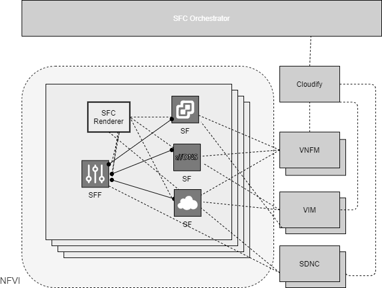

   SFC Architecture for VNF based SFs

:numref:`SFC Architecture for CNF based SFs` shows a simple architecture of an SFC with multiple CNFs, as SF data
plane components, along with SFC management and CNF MANO components.

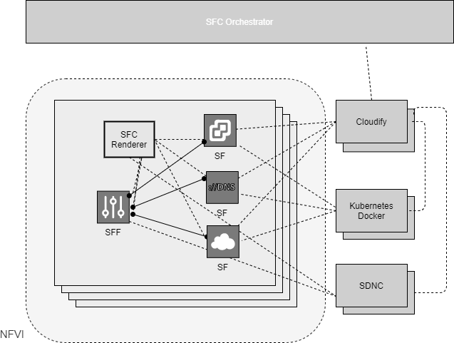

   SFC Architecture for CNF based SFs

The SFC management components together with the control components are responsible for rendering SFC requests to Service
Function paths. For this they convert requisite SFC policies into network topology dependent paths and forwarding
steering policies. Relevant SFC data components - classifiers, service function forwarders - are responsible for
managing the steering policies.

Information Flows in Service Function Chaining
^^^^^^^^^^^^^^^^^^^^^^^^^^^^^^^^^^^^^^^^^^^^^^

Creation of Service Function Chain
''''''''''''''''''''''''''''''''''

The creation of the SFC might include design/preparation phase as:

- The service functions that are included in the SFC.
- The routing order in the service function, if the SFC is composed of more than one service function.

:numref:`Creation of Service Function Chain` shows SFC creation call flow, separated logically in two steps.

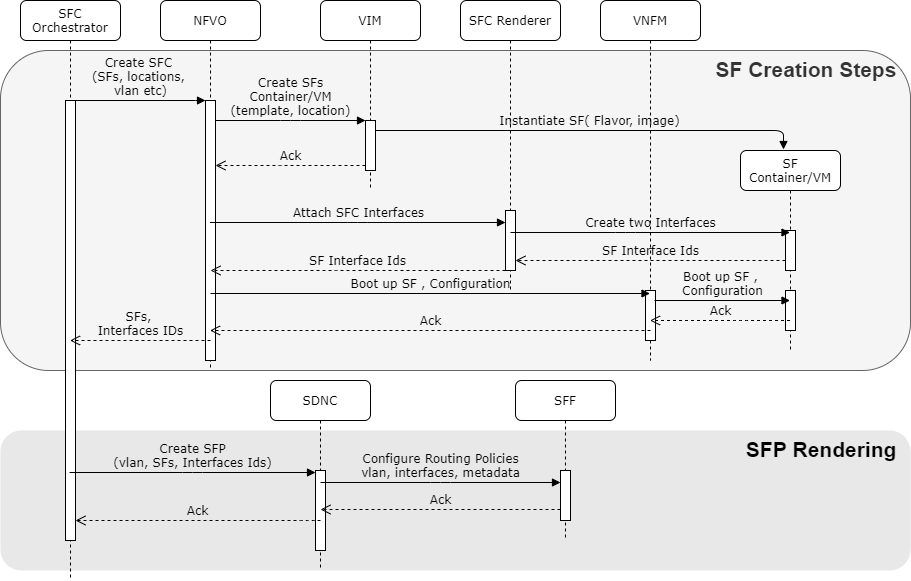

   Creation of Service Function Chain

1. Creation of service functions of SFC.

- The flow of steps to enable the SFC creation can be as follows:

  a. SFC orchestrator creates the SFs with help of VNF MANO or CNF MANO.
  b. SFC Renderer attaches the SFC aware interfaces at SFs to enable Service plane
  c. NFVO boots up the relevant SF configurations at SF.

     **Note:** These steps are optional, if SFC orchestrator discovers that SFs are already created and existing.

2. Creation of Service Function Path (SFP) using the created SFs and associated interfaces.

- A Service Function Path consists of:

   - A set of ports( in VNF environment) or interfaces ( in CNF environment) , that define the sequence of service
     functions
   - A set of flow classifiers that specify the classified traffic flows entering the chain.

- This step creates a new chain policy with chain rules. Chain rules can include the identifier of a traffic flow,
  service characteristics, the SFC identifier and related information to route the packets along the chain. Service
  characteristics can be application layer matching information (e.g., URL). Traffic flow identifier can be kind of
  traffic (e.g., Video, TCP, HTTP) flow need to be serviced. It can be specific Subscriber to apply service (e.g.,
  parental control). The SFC identifier to steer the matched traffic along the SFP with SFC encapsulation.

  a. SFC orchestrator creates SFP with help of SDNC.
  b. SDNC pushes the SFC traffic steering policies to SFF(s).
  c. SFC classifier Policy provided for SFP to SFC classifier by SFC Controller. **Note:** not shown in call flow.

Updating Service Function Chain
'''''''''''''''''''''''''''''''

SFP or SFC can be updated for various reasons and some of them are:

- SFC controller monitors the SFP status and alerts SFC controller in case of not meeting SLA or some anomaly.
- SFC design changes to update SF order, inclusion/removal of SFs
- SFC Policy Rules changes

Data Steering in Service Function Chain
'''''''''''''''''''''''''''''''''''''''

:numref:`Data steering in Service Function Chain` shows traffic steering along SFP.

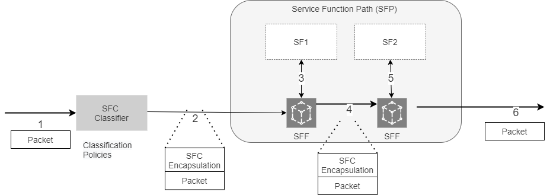

   Data steering in Service Function Chain

- SFC classifier detects the traffic flow based on classification policies. For example, to enable SGi-Lan feature as
  SFC, 5G User plane function (UPF) acts as SFC classifier. UPF receives the classification policies from 5G Policy
  control function (PCF) as traffic steering policies.
- SFC classifier applies the SFC encapsulation (e.g., SCH, NSH) and routes traffic towards SFF, acts as entry point to
  SFP. The SFC Encapsulation provides, at a minimum, SFP identification, and is used by the SFC-aware functions, such as
  the SFF and SFC-aware SFs.
- SFF based on SFC encapsulation routes the traffic to SF for service functionalities.
- SF updates the SFC encapsulation based on its policies for further services.
- At end of SFP, SFC encapsulation is removed and packet is routed out of SFP.

Time Sensitive Networking
~~~~~~~~~~~~~~~~~~~~~~~~~

Many network functions have time sensitivity for processing and require high precision synchronized clock for the Cloud
Infrastructure. Subset of these workloads, like RAN, in addition require support for Synchronous Ethernet as well.

+--------------------------------+-----------------------------------+-------------------------------------------------+
| Reason for using Synchronous   | Example                           | Comment                                         |
| Precision Clock                |                                   |                                                 |
+================================+===================================+=================================================+
| Achieve technical requirements | Strict latency or timing accuracy | Must be done for precise low latency            |
|                                |                                   | communication between data source and receiver  |
+--------------------------------+-----------------------------------+-------------------------------------------------+
| Achieve technical requirements | Separation of processing pipeline | Ability to separate RAN into RU, DU, CU on      |
|                                |                                   | different or stretch clusters                   |
+--------------------------------+-----------------------------------+-------------------------------------------------+

**Table 3-7:** Reasons and examples for Precise Clock and Synchronization

Precise Synchronization require specialized card that can be on server or network device motherboard or be part of NIC
or both.

OpenStack and Kubernetes clusters use Network Time Protocol (NTP)
(Protocol and Algorithms Specification :cite:p:`rfc5905`,
Autokey Specification :cite:p:`rfc5906`,
Managed Objects :cite:p:`rfc5907`,
Server Option for DHCPv6 :cite:p:`rfc5908`)
as the default time synchronization for the cluster. That level of synchronization is not sufficient for some
network functions. Just like real-time operating systems instead of base OS, so is precision timing for clock
synchronization. Precision Time Protocol version 2 `PTP <https://standards.ieee.org/standard/1588-2019.html>`__ cite:p:`ieee1588dash2019`
is commonly used for Time-Sensitive Networking. This allow synchronization in microsecond range rather than
millisecond range that NTP provides.

Some Network functions, like vDU, of vRAN, also require `SyncE <http://www.itu.int/rec/T-REC-G.8262>`__ :cite:p:`itutg8262`. Control,
User and Synchronization (CUS) Plane specification defines different topology options that provides Lower Layer Split
Control plane 1-4 (LLS-C1 - LLS-C4) with different synchronization requirements
(`ITU-T G.8275.2 <https://www.itu.int/rec/T-REC-G.8275.2/en>`__ :cite:p:`itutg82752`).

SyncE was standardized by the ITU-T, in cooperation with IEEE, as three recommendations:

- ITU-T Rec. G.8261 that defines aspects about the architecture and the wander performance of SyncE networks
- ITU-T Rec. G.8262 that specifies Synchronous Ethernet clocks for SyncE
- ITU-T Rec. G.8264 that describes the specification of Ethernet Synchronization Messaging Channel (ESMC)
  SyncE architecture minimally requires replacement of the internal clock of the Ethernet card by a phase locked loop
  in order to feed the Ethernet PHY.

Kubernetes Networking Semantics
~~~~~~~~~~~~~~~~~~~~~~~~~~~~~~~

The support for traditional network orchestration is non-existent in Kubernetes as it is foremost a Platform as a
Service (PaaS) environment and not an Infrastructure as a Service (Iaas) component. There is no network orchestration
API, like Neutron in OpenStack, and there is no way to create L2 networks, instantiate network services such as L3aaS
and LBaaS and then connect them all together as can be done using Neutron.

Kubernetes networking can be divided into two parts, built in network functionality available through the pod's
mandatory primary interface and network functionality available through the pod's optional secondary interfaces.

Built in Kubernetes Network Functionality
^^^^^^^^^^^^^^^^^^^^^^^^^^^^^^^^^^^^^^^^^

Kubernetes currently only allows for one network, the *cluster* network, and one network attachment for each pod. All
pods and containers have an *eth0* interface, this interface is created by Kubernetes at pod creation and attached to
the cluster network. All communication to and from the pod is done through this interface. Allowing only for one
interface in a pod removes the need for traditional networking tools such as *VRFs* and additional routes and routing
tables inside the pod network namespace.

Multiple Networks and Advanced Configurations
^^^^^^^^^^^^^^^^^^^^^^^^^^^^^^^^^^^^^^^^^^^^^

Currently Kubernetes does not in itself support multi networks, pod multi network attachments or network orchestration.
This is supported by using a `Container Network Interface <https://github.com/containernetworking/cni>`__ multiplexer
such as `Multus <https://github.com/k8snetworkplumbingwg/multus-cni>`__.
The `Network Plumbing Working Group <https://github.com/k8snetworkplumbingwg/community>`__ has produced
the `Kubernetes Network Custom Resource Definition De-facto Standard
<https://docs.google.com/document/d/1Ny03h6IDVy_e_vmElOqR7UdTPAG_RNydhVE1Kx54kFQ/edit>`__.
This document describes how secondary networks can be defined and attached to
pods.

Storage
-------

Introduction to Storage
~~~~~~~~~~~~~~~~~~~~~~~

The general function of storage subsystem is to provide the persistent data store required for the delivery of a network
service. In the context of Cloud Infrastructure the storage sub-system needs to accommodate needs of: the tenanted
applications and the platform management.
Each of:

- underlying compute host boot and virtual machine hosting,
- control plane configuration and management plane storage for fault and performance management and automation,
  capacity management and reporting and
- tenant application and VNF storage needs

have common and specific needs for storage in terms of performance, capacity and consumption models.

The combination of common but diverse needs in conjunction with the differences in the hosting environments (from large
data-centres to small edge deployments) has resulted in the proliferation of storage technologies and their deployment
architectures. To address this the "Reference Model" outlines a "General Cloud Storage Model"
(see :numref:`General Cloud Storage Model` - "General Cloud Storage Model"). The model will outline the different
types of storage technologies and how they can be used to meet the need for:

- providing storage via dedicated storage systems,
- multi-tenant cloud storage,
- Control and Management Plane storage needs,

across both large data-centres and small edge deployments; the model can then be used for implementing Reference
Architectures.

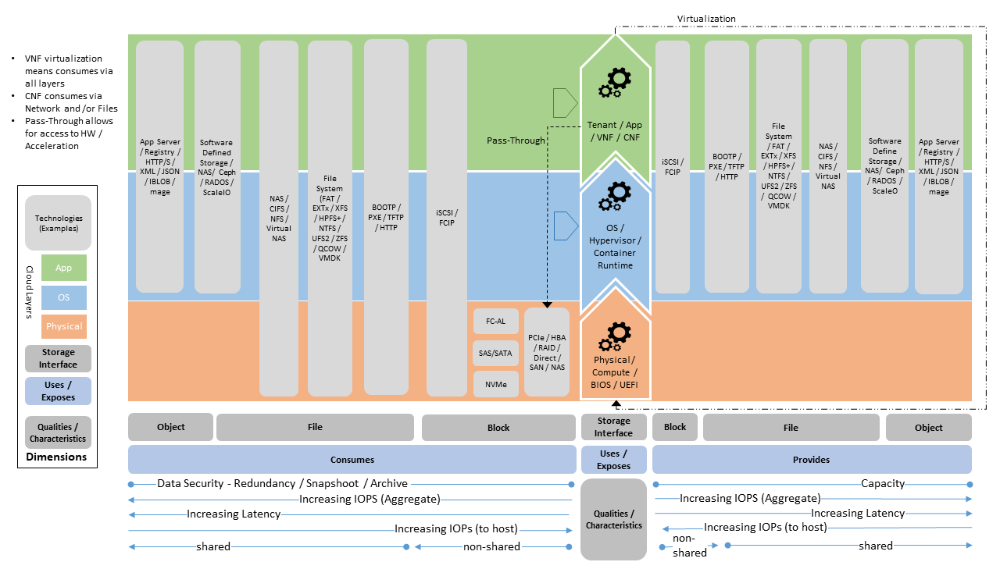

   General Cloud Storage Model

Storage is multi-faceted and so can be classified based on its: cost, performance (IOPS, throughput, latency), capacity
and consumption model (platform native, network shared, object or archival) and the underlying implementation model (in
chassis, software defined, appliance). The objective of the model and set of stereotypes and perspectives is to provide
guidance to architects and immplementers in establishing storage solutions for Cloud Infrastructure.

The following principles apply to Storage scope for the Reference Model, Reference Architectures, Reference
Implementations and Reference Conformance test suites:

- Abstraction: A standardized storage abstraction layer between the Virtualisation Layers and the Storage Physical
  Resources Layer that hides (or abstracts) the details of the Storage Physical resources from the Virtualisation
  Layers.
- Agnosticism: Define Storage subsystem concepts and models that can provide various storage types and performance
  requirements (more in section `Virtual Storage`_).
- Automation: Enable end-to-end automation, from Physical Storage installation and provisioning to automation of
  workloads (VNF/CNF) onboarding.
- Openness: All storage is based on open source or standardized APIs (North Bound Interfaces (NBI) and South Bound
  Interfaces (SBI)) and should enable integration of storage components such as Software Defined Storage controllers.
- Scalability: Storage model enables scalability to enable small up to large deployments.
- Workload agnostic: Storage model can provide storage functionality to any type of workloads, including: tenant VNF,
  CNF and Infrastructure Management whether this is via BareMetal or Virtualised Deployments.
- Operationally Amenable: The storage must be amenable to consistent set of operational processes for: Non-Disruptive
  Capacity Expansion and Contraction, Backup/Restoration and Archive and Performance Management. Where applicable
  (examples are: Backup/Restoration/Archive) these processes should also be able to be provided to tenants for their own
  delegated management.
- Security Policy Amenable: The storage sub-systems must be amenable to policy based security controls covering areas
  such as: Encryption for Data at Rest / In Flight, Delegated Tenant Security Policy Management, Platform Management
  Security Policy Override, Secure Erase on Device Removal and others
- Future proof: Storage model is extendible to support known and emerging technology trends covering spectrum of
  memory-storage technologies including Software Defined Storage with mix of SATA- and NVMe-based SSDs, DRAM and
  Persistent Memory, integrated for multi-clouds, and Edge related technologies.

The above principles should be understood as storage specific specialisations of the
:ref:`common/chapter00:anuket general principles`.

Storage Implementation Stereotypes
~~~~~~~~~~~~~~~~~~~~~~~~~~~~~~~~~~

The following set of storage implementations outline some of the most prevalent stereotypical storage implementations.

The first of these are for Data Centre Storage cases, with stereotypes of:

- Dedicated storage appliance (:numref:`Storage Appliance Stereotype`) - that provide network based storage via
  iSCSI (2), NFS/CIFS (3) with potentially virtual NAS (vNAS) (4) capability. Having virtual network software (4)
  allows the establishment of storage tenancies, where storage tenancy have their own virtual storage services which
  are exposed on their own network,
- Software defined storage (:numref:`Software Defined Storage Stereotype`) - which is able to provide similar
  capabilities as the dedicated storage appliance (see (3),(4) & (5) in diagram). In this case this is provided as a
  software solution on top of a hyper-converged infrastructure.

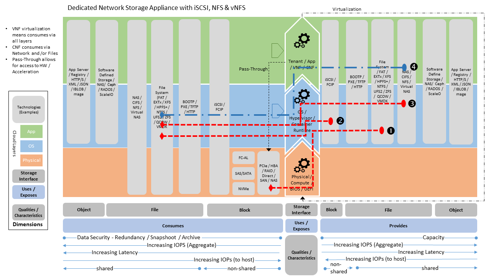

   Storage Appliance Stereotype

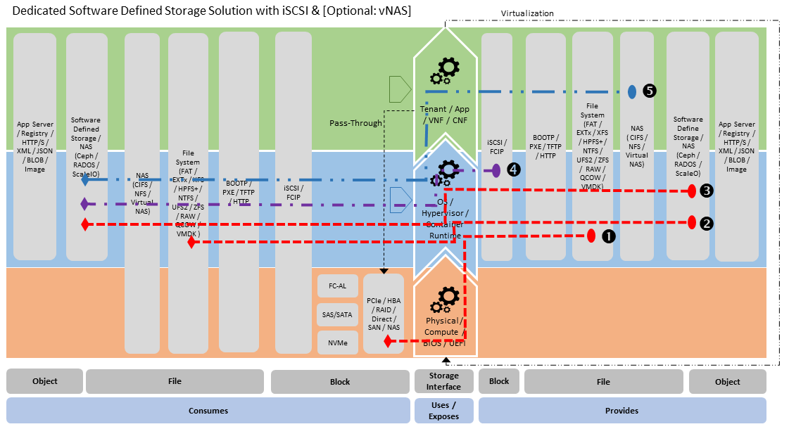

   Software Defined Storage Stereotype

Both of these stereotypes can be used to support very broad storage needs from: machine boot (via iSCSI), providing
storage to the Cloud Platform Control and Management Planes, Platform Native (viz., Hypervisor Attached and Container
Persistence storage, as defined in section :ref:`chapters/chapter03:storage for tenant consumption`") and
Application/VNF/CNF managed network storage. To provide this requires connectivity within the Cloud Infrastructure
Underlay and Tenant Overlay networks.

Successful management of Cloud Infrastructure requires high levels of automation, including the ability to stand
up rapidly new storage and hosting infrastructure. This Cloud Infrastructure boot-strapping process is managed through
Infrastructure Automation tooling. A typical part of the boot-strap process is to use PXE (Pre-boot Execution Environment) boot to manage the deployment
of initial images to physical hosts and a similar approach is used for "Bare Metal-as-a-Service" provisioning. The
storage stereotype that covers this use case is:

- Infrastructure Automation (:numref:`Infrastructure Automation - PXE Boot Server Stereotype`) - where PXE Boot Server
  provides a cache of boot images that are stored in local storage (2) which are then conditionally served up as PXE
  boot images (3). The PXE boot server can run within bootstrap management hosting in data-centre or within the
  routing / switch layer for an edge deployment case aimed to minimise physical footprint. The Infrastructure
  Automation PXE server is aware of the provisioning status of the physical infrastructure and will serve specific
  images or even not respond to PXE boot requests for hosts which have already been provisioned and are considered
  "in service".

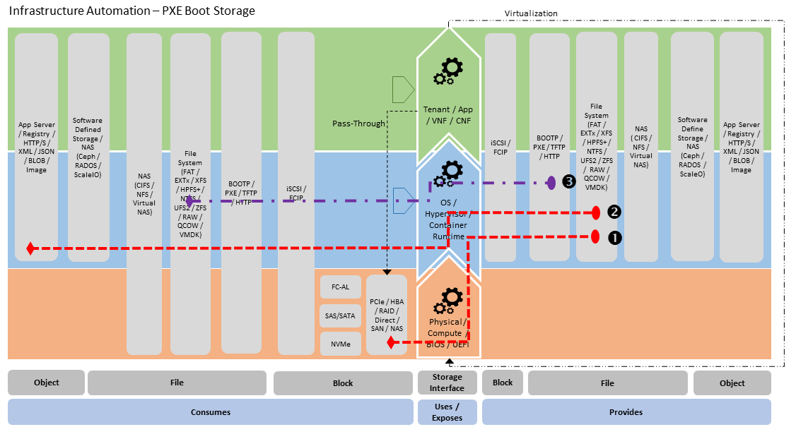

   Infrastructure Automation - PXE Boot Server Stereotype

To provide PXE boot service to the underlying resource hosts, the PXE server must be connected to the same network as
the NIC that is configured for PXE boot. The "Infrastructure Automation - PXE Server" stereotype is also applicable to
booting tenant Virtual Machines. In this case, the PXE server is on the same network as one of the machines vNICs. For
tenant use this is provided as part of tenant consumable boot infrastructure services.

For each of the defined stereotypes, the storage service uses physical Block storage for boot (Physical Layer - Block
Consumption -> OS File Systems Exposure (1) on stereotype diagrams). This is the primary use case for use of in chassis
physical storage, that is not being used for consumption and exposure as network-based storage. In general, it is
desirable to use network based storage solution for provision of Cloud Infrastructure storage. The "Infrastructure
Automation - PXE Server" is an exception to the preferential use of network-based storage, and as it is managing the
bootstrap process, it cannot be dependent on a separate storage system for maintaining its image cache.

Storage for Tenant Consumption
~~~~~~~~~~~~~~~~~~~~~~~~~~~~~~

Storage is made available for tenant consumption through a number of models. A simplified view of this is provided in the
following illustrative model.

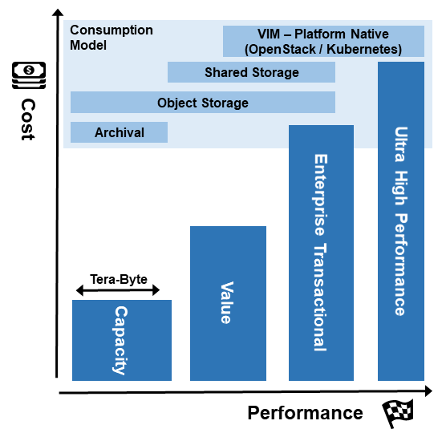

   Storage Model - Cost vs Performance with Consumption Model Overlay

Where:

- (Comparative) Cost - is monetary value / unit of end user storage capacity
- Performance - is defined by IOPS / Latency / Throughput as typically each of these increases with successive
  generations of storage
- Capacity - consumption needs are represented by width of the: Ultra High Performance, Enterprise Transactional, Value
  and Capacity storage options.
- Storage Types - is how the storage is accessed and used, where:

  - Platform Native - is managed by the hypervisor / platform (examples are a virtual disk volume from which a VNF
    boots and can write back to, the storage interface that is exposed by the container runtime), this storage is
    typically not shared across running VNF / CNF instances;
  - Shared File Storage - is storage that is accessed through a file systems interface (examples are network based
    storage such as CIFS or NFS) where the storage volumes can be accessed and shared by multiple VNF / CNF instances;
  - Object Storage - is storage that is accessed via API interfaces (the most common example being HTTP restful
    services API), which support get/put of structured objects; and
  - Archival - is storage that is targeted for provision of long term storage for purpose of disaster recovery, meeting
    legal requirements or other historical recording where the storage mechanism may go through multiple stages before
    landing at rest.

The storage model provides a relatively simple way for the storage consumer to specify / select their storage needs.
This is shown in the following table which highlights key attributes and features of the storage classes and
"epic use cases" for common usage patterns.

+-----------+-----------------------+-----------------------+---------+-----------------------+------------------------+
| Storage   | Consumption Model     | Performance &         | Cost    | Infrastructure        | Use Case               |
| Type      |                       | Capacity              |         | Strategy              |                        |
+===========+=======================+=======================+=========+=======================+========================+
| Platform  | Managed by the VIM /  | Ultra High            | High to | Always part of VIM    | Boot/Start VNF/CNF,    |
| Native    | Hypervisor and        | Performance & Very    | Very    | deployment, Storage   | Live Migrate Workload  |
|           | attached as part of   | High Performance,     | High    | is directly next to   | within and across VIMs |
|           | VNF/CNF start up via  | Capacity: 10GB - 5TB, |         | vCPU, Can support     |                        |
|           | VNF Descriptor,       | "Tier 1"              |         | highest performance   |                        |
|           | Volumes shareability  |                       |         | use cases, Always     |                        |
|           | across VNF/CNF        |                       |         | available to support  |                        |
|           | instances is          |                       |         | VNF/CNF boot/startup  |                        |
|           | determined by         |                       |         |                       |                        |
|           | platform and storage  |                       |         |                       |                        |
|           | capabilities          |                       |         |                       |                        |
+-----------+-----------------------+-----------------------+---------+-----------------------+------------------------+
| Shared    | Access via Network    | Enterprise            | High -  | Leverage existing     | VNF/CNF's able to      |
| File      | File System,          | Transactional         | Mid     | capabilities, Only    | share the same file    |
| Storage   | Concurrent            | Performance (real     |         | build if needed (this | content                |
|           | consumption across    | time transaction      |         | is not needed by many |                        |
|           | multiple VNF/CNFs,    | processing),          |         | data plane VNF/CNFs), |                        |
|           | Sharing can be        | Capacity: 5GB -       |         | If needed for Edge    |                        |
|           | constrained to        | 100TB, Selectable     |         | deployment then aim   |                        |
|           | tenancy, cross        | "Tier 1" to "Tier 3"  |         | to unify with         |                        |
|           | tenancy and           |                       |         | "Platform Native"     |                        |
|           | externally accessible |                       |         | deployment            |                        |
+-----------+-----------------------+-----------------------+---------+-----------------------+------------------------+
| Object    | Consumed via HTTP/S   | Highly distributable  | High to | Primarily tenant      | Cloud Native           |
| Storage   | restful services,     | and scalable Provided | Mid     | application           | Geo-Distributed        |
|           |                       | by serving            |         | responsibility        | VNF/CNFs               |
|           |                       | application which     |         |                       |                        |
|           |                       | manages storage       |         |                       |                        |
|           |                       | needs, Location       |         |                       |                        |
|           |                       | Independent           |         |                       |                        |
+-----------+-----------------------+-----------------------+---------+-----------------------+------------------------+
| Capacity  | Typically accessed as | Very low              | Low     | Use cheapest storage  | Archival storage for   |
|           | per "Shared Storage"  | transactional         |         | available that meets  | tenant/platform        |
|           | but will likely have  | performance, Need     |         | capacity & security   | backup/restore, DR     |
|           | additional storage    | throughput to         |         | needs                 |                        |
|           | stages, Not suitable  | accommodate large     |         |                       |                        |
|           | for real time         | data flow, "Tier 3"   |         |                       |                        |
|           | processing            |                       |         |                       |                        |
+-----------+-----------------------+-----------------------+---------+-----------------------+------------------------+

**Table 3-8:** Tenant Storage Types

In section "3.6.2 Storage Implementation Stereotypes" the General Cloud Storage Model is used to illustrate the
provision of storage. The model can also be used to illustrate the consumption of storage for use by Tenants (see below
for "Platform Native" stereotypes):

- Platform Native - Hypervisor Attached Consumption Stereotype
  (:numref:`Platform Native - Hypervisor Attached Consumption Stereotype`) - where hypervisor consumes Software
  Defined Storage via Network (RA-1 - Cinder backend (2)) and the Block Image is attached to Virtual Machine (RAW or
  QCOW file within File System), which is used for boot and exposure to virtual machine OS as Block Storage (3). The
  virtual machine OS in turn consumes this for use by Tenant Application via File System,
- Platform Native - Container Persistent Consumption Stereotype
  (:numref:`Platform Native - Container Persistent Consumption Stereotype`) - is simpler case with Container
  Runtime consuming Software Defined Storage (via Reliable Autonomic Distributed Object Store (RADOS) backend (2)) and exposes this to Container as a file system
  mount (3).

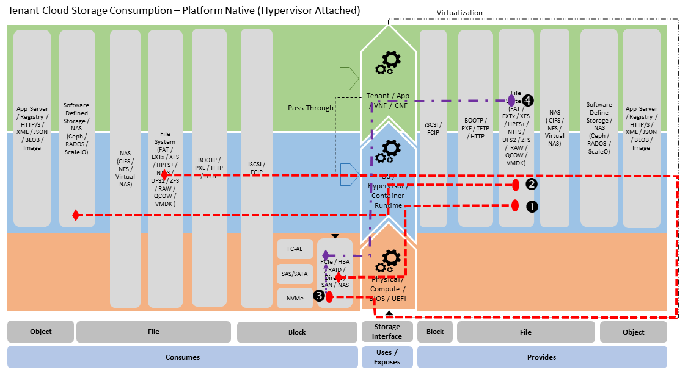

   Platform Native - Hypervisor Attached Consumption Stereotype

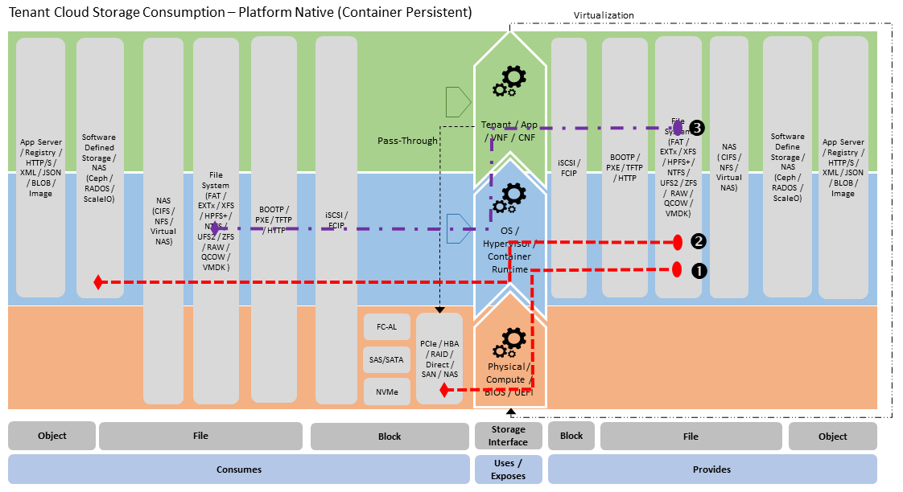

   Platform Native - Container Persistent Consumption Stereotype

Note that a stereotype for Network File Storage consumption is not illustrated as this is simply managed by the Tenant
Application by doing a file systems mount.

In cloud infrastructure, the storage types may manifest in various ways with substantive variations in the architecture
models being used. Examples of this are provided in section `Storage Implementation Stereotypes`_, with stereotypes
for "Dedicated Storage Appliance" and "Software Defined Storage". In the consumption case, again there is use of
in-chassis storage to support hypervisor and container host OS/Runtime boot, not for Tenant / User Plane storage
consumption.

Storage Scenarios and Architecture Fit
~~~~~~~~~~~~~~~~~~~~~~~~~~~~~~~~~~~~~~

The storage model and stereotypical usage scenarios illustrate the key storage uses cases and their applicability to
support storage needs from across a range of cloud deployments. This set of storage uses cases is summarised in the
following tables, including how the stereotypes can support the Anuket Reference Architectures, followed by the key
areas for consideration in such a deployment scenario. The structure of the table is:

- Use Case - what is the target storage use case being covered (large data-centre, small data-centre, standalone cloud,
  edge etc.)
- Stereotype - which of defined stereotypes is used
- Infra / Ctrl / Mgt - is the storage stereotype able to support the:

  - Infrastructure - for host computer boot (from either local host storage or PXE),
  - Control Plane - for cloud infrastructure control (such as OpenStack (RA1) or Kubernetes (RA2) control functions) and
  - Management Plane Needs - for Infrastructure Automation, Tenant VNF/CNF Orchestration and cloud infrastructure
    monitoring and assurance
- Tenant / User - is the storage stereotype able to support Tenant / User Plane needs including: Platform Native, Shared
  File Storage & Object Storage (as per section `Storage for Tenant Consumption`_)

Where:

- "Y" - Yes and almost always provided
- "O" - Optional and readily accommodated
- "N" - No, not available
- "NA" - Not Applicable for this Use Case / Stereotype

+-------------------------------+-------------------------------------+------+------+------+------------+------------+--------+-------+-----+------+--------+
|                                                                                          | Tenant / User                                                  |
+===============================+=====================================+======+======+======+============+============+========+=======+=====+======+========+
|                                                                     | Infra / Ctrl / Mgt | Platform Native         | Shared File                 | Object |
+-------------------------------+-------------------------------------+------+------+------+------------+------------+--------+-------+-----+------+--------+
| Use Case                      | Stereotype                          | Boot | Ctrl | Mgt  | Hypervisor | Container  | Within | Cross | Ext | vNAS | Object |
|                               |                                     |      |      |      | Attached   | Persistent |        |       |     |      |        |
+-------------------------------+-------------------------------------+------+------+------+------------+------------+--------+-------+-----+------+--------+
| Data-centre Storage           | Dedicated Network Storage Appliance | Y    | Y    | Y    | Y          | Y          | O      | O     | O   | O    | O      |
|                               +-------------------------------------+------+------+------+------------+------------+--------+-------+-----+------+--------+
|                               | Dedicated Software Defined Storage  | O    | O    | O    | Y          | Y          | O      | O     | O   | O    | O      |
|                               +-------------------------------------+------+------+------+------------+------------+--------+-------+-----+------+--------+
|                               | Traditional SAN                     | Y    | Y    | Y    | N          | N          | N      | N     | N   | N    | N      |
+-------------------------------+-------------------------------------+------+------+------+------------+------------+--------+-------+-----+------+--------+
| Satellite data-centre Storage | Small Software Defined Storage      | O    | O    | O    | Y          | Y          | O      | O     | O   | O    | O      |
+-------------------------------+-------------------------------------+------+------+------+------------+------------+--------+-------+-----+------+--------+
| Small data-centre Storage     | Converged Software Defined Storage  | O    | O    | O    | Y          | Y          | O      | O     | O   | O    | O      |
+-------------------------------+-------------------------------------+------+------+------+------------+------------+--------+-------+-----+------+--------+
| Edge Cloud                    | Edge Cloud for VNF/CNF Storage      | NA   | O    | NA   | Y          | Y          | O      | O     | O   | O    | O      |
|                               +-------------------------------------+------+------+------+------------+------------+--------+-------+-----+------+--------+
|                               | Edge Cloud for Apps Storage         | NA   | O    | NA   | Y          | Y          | O      | O     | O   | O    | Y      |
|                               +-------------------------------------+------+------+------+------------+------------+--------+-------+-----+------+--------+
|                               | Edge Cloud for Content Mgt Storage  | NA   | O    | NA   | Y          | Y          | O      | O     | O   | O    | Y      |
+-------------------------------+-------------------------------------+------+------+------+------------+------------+--------+-------+-----+------+--------+
| Split Control/User Plane      | Split Edge Ctrl Plane Storage       | NA   | N    | NA   | Y          | Y          | O      | O     | O   | O    | O      |
| Edge Cloud                    +-------------------------------------+------+------+------+------------+------------+--------+-------+-----+------+--------+
|                               + Split Edge User Plane Storage       + NA   | N    | NA   | N          | N          | N      | N     | N   | N    | N      |
+-------------------------------+-------------------------------------+------+------+------+------------+------------+--------+-------+-----+------+--------+

**Table 3-9:** Storage Use Cases and Stereotypes

The storage sub-system is a foundational part of any Cloud Infrastructure, as such it is important to identify the storage needs, based on target tenant use cases,
at inception. This will allow the right set of considerations to be addressed for the deployment. A set of typical considerations is provided:

- for various use cases to meet functional and performance needs and
- to avoid the need for significant rework of the storage solution and the likely ripple through impact on the broader Cloud Infrastructure.

The considerations will help to guide the build and deployment of the Storage solution for the various Use Cases and Stereotypes outlined in the summary table.

+----+----+----+----------+-----------------------------------------------------------+
| Use Case                | Description                                               |
+====+====+====+==========+===========================================================+
| **Data-centre**         | Provide a highly reliable and scalable storage capability |
| **Storage**             | that has flexibility to meet diverse needs                |
+----+----+----+----------+-----------------------------------------------------------+
|    | Meets Needs of     | Cloud Infrastructure Control Plane (tenant Virtual        |
|    |                    | Machine and Container life-cycle management and control)  |
|    |                    +-----------------------------------------------------------+
|    |                    | Cloud Infrastructure Management Plane (Cloud              |
|    |                    | Infrastructure fault and performance management and       |
|    |                    | platform automation)                                      |
|    |                    +-----------------------------------------------------------+
|    |                    | Cloud Infrastructure Tenant / User Plane                  |
+----+----+----+----------+-----------------------------------------------------------+
|    | General Considerations: What are the general considerations, irrespective of   |
|    | the deployment stereotype/technology used in the storage sub-system?           |
+----+----+----+----------+-----------------------------------------------------------+
|    | 1  | Can storage support Virtual Machine (RA-1) and Container (RA-2) Hosting   |
|    |    | cases from single instance? Noting that if you wish to have single        |
|    |    | storage instance providing storage across multiple clusters and/or        |
|    |    | availability zones within the same data-centre then this needs to be      |
|    |    | factored into the underlay network design.                                |
+----+----+----+----------+-----------------------------------------------------------+
|    | 2  | Can the storage system support Live Migration/Multi-Attach within and     |
|    |    | across Availability Zones (applicable to Virtual Machine hosting (RA-1))  |
|    |    | and how does the Cloud Infrastructure solution support migration of       |
|    |    | Virtual Machines between availability zones in general?                   |
+----+----+----+----------+-----------------------------------------------------------+
|    | 3  | Can the storage system support the full range of Shared File Storage use  |
|    |    | cases: including the ability to control how network exposed Share File    |
|    |    | Storage is visible: Within Tenancy, Across Tenancy (noting that a Tenancy |
|    |    | can operate across availability zones) and Externally?                    |
+----+----+----+----------+-----------------------------------------------------------+
|    | 4  | Can the storage system support alternate performance tiers to allow       |
|    |    | tenant selection of best Cost/Performance option? For very high           |
|    |    | performance storage provision, meeting throughput and IOP needs can be    |
|    |    | achieved by using: very high IOP flash storage, higher bandwidth          |
|    |    | networking,performance optimised replication design and storage pool host |
|    |    | distribution, while achieving very low latency targets require careful    |
|    |    | planning of underlay storage VLAN/switch networking.                      |
+----+----+----+----------+-----------------------------------------------------------+
|    | Specific Considerations: In selecting a particular stereotype/technology this  |
|    | can bring with it considerations that are specific to this choice              |
+----+----+----+----------+-----------------------------------------------------------+
|    | Dedicated Software Defined Storage                                             |
+----+----+----+----------+-----------------------------------------------------------+
|         | 1  | Need to establish the physical disk data layout / encoding scheme    |
|         |    | choice, options could be: replication / mirroring of data across     |
|         |    | multiple storage hosts or CRC-based redundancy management encoding   |
|         |    | (such as "erasure encoding"). This typically has performance/cost    |
|         |    | implications as replication has a lower performance impact, but      |
|         |    | consumes larger number of physical disks. If using replication then  |
|         |    | increasing the number of replicas provide greater data loss          |
|         |    | prevention, but consumes more disk system backend network bandwidth, |
|         |    | with bandwidth need proportional to number of replicas.              |
|         +----+----------+-----------------------------------------------------------+
|         | 2  | In general with Software Defined Storage solution it is not          |
|         |    | to use hardware RAID controllers, as this impacts the scope of       |
|         |    | recovery on failure as the failed device replacement can only be     |
|         |    | managed within the RAID volume that disk is part of. With Software   |
|         |    | Defined Storage failure recovering can be managed within the host    |
|         |    | that the disk failed in, but also across physical storage hosts.     |
|         +----+----------+-----------------------------------------------------------+
|         | 3  | Can storage be consumed optimally irrespective of whether this is at |
|         |    | Control, Management or Tenant / User Plane? Example is iSCSI/NFS,    |
|         |    | which while available and providing a common technical capability,   |
|         |    | does not provide best achievable performance. Best performance is    |
|         |    | achieved using provided OS layer driver that matches the particular  |
|         |    | software defined storage implementation (example is using RADOS      |
|         |    | driver in Ceph case vs. Ceph ability to expose iSCSI).               |
+----+----+----+----------+-----------------------------------------------------------+
|    | Dedicated Network Storage Appliance                                            |
+----+----+----+----------+-----------------------------------------------------------+
|         | 1  | Macro choice is made based on vendor / model selection and           |
|         |    | configuration choices available                                      |
+----+----+----+----------+-----------------------------------------------------------+
|    | Traditional SAN                                                                |
+----+----+----+----------+-----------------------------------------------------------+
|         | 1  | This is generally made available via Fiber Channel Arbitrated Loop   |
|         |    | (FC-AL)/SCSI connectivity and hence has a need for very specific     |
|         |    | connectivity. To provide the features required for Cloud             |
|         |    | Infrastructure (Shared File Storage, Object Storage and              |
|         |    | Multi-tenancy support), a SAN storage systems needs to be augmented  |
|         |    | with other gateway/s to provide an IP Network consumable capability. |
|         |    | This is often seen with current deployments where NFS/CIFS (NAS)     |
|         |    | Gateway is connected by FC-AL (for storage back-end) and IP Network  |
|         |    | for Cloud Infrastructure consumption (front-end). This model helps   |
|         |    | to extent use of SAN storage investment. NOTE: This applies to SANs  |
|         |    | which use SAS/SATA physical disk devices, as direct connect FC-AL    |
|         |    | disk devices are no longer manufactured.                             |
+----+----+----+----------+-----------------------------------------------------------+
| **Satellite**           | Satellite data-centre is a smaller regional  deployment   |
| **Data-centre Storage** | which has connectivity to and utilises resources          |
|                         | available from the main Data-centre, so only provides     |
|                         | support for subset of needs                               |
+----+----+----+----------+-----------------------------------------------------------+
|    | Meets Needs of     | Cloud Infrastructure Control Plane (tenant Virtual        |
|    |                    | Machine and Container life-cycle management and control)  |
|    |                    +-----------------------------------------------------------+
|    |                    | Cloud Infrastructure Tenant/User Plane                    |
|    +----+----+----------+-----------------------------------------------------------+
|    | General Considerations: What are the general considerations, irrespective      |
|    | of the deployment stereotype/technology used in storage sub-system?            |
|    +----+----+----------+-----------------------------------------------------------+
|    | 1  | Is there a need to support multiple clusters/availability zones at the    |
|    |    | same site? If so then use "Data-Centre Storage" use case, otherwise,      |
|    |    | consider how to put Virtual Machine & Container Hosting control plane     |
|    |    | and Storage control plane on the same set of hosts to reduce footprint.   |
|    +----+----+----------+-----------------------------------------------------------+
|    | 2  | Can Shared File Storage establishment be avoided by using capabilities    |
|    |    | provided by large Data-Centre Storage?                                    |
|    +----+----+----------+-----------------------------------------------------------+
|    | 3  | Can very large capacity storage needs be moved to larger Data-Centre      |
|    |    | Storage capabilities?                                                     |
|    +----+----+----------+-----------------------------------------------------------+
|    | Specific Considerations: In selecting a particular stereotype/technology this  |
|    | can bring with it considerations that are specific to this choice              |
+----+----+----+----------+-----------------------------------------------------------+
|    | Small Software Defined Storage                                                 |
+----+----+----+----------+-----------------------------------------------------------+
|         | 1  | Leverage same technology as "Dedicated Software Defined Storage"     |
|         |    | scenarios, but avoid/limit Infrastructure boot and Management plane  |
|         |    | support and Network Storage support                                  |
|         +----+----------+-----------------------------------------------------------+
|         | 2  | Avoid having dedicated storage instance per cluster/availability     |
|         |    | zone                                                                 |
|         +----+----------+-----------------------------------------------------------+
|         | 3  | Resilience through rapid rebuild (N + 1 failure scenario)            |
+----+----+----+----------+-----------------------------------------------------------+
| **Small Data-centre**   | Small data-centre storage deployment is used in cases     |
| **Storage**             | where software-defined storage and virtual machine /      |
|                         | container hosting are running on a converged              |
|                         | infrastructure footprint with the aim of reducing the     |
|                         | overall size of the platform. This solution behaves as a  |
|                         | standalone Infrastructure Cloud platform.                 |
+----+----+----+----------+-----------------------------------------------------------+
|    | Meets Needs of     | Cloud Infrastructure Control Plane (tenant Virtual        |
|    |                    | Machine and Container life-cycle management and control)  |
|    |                    +-----------------------------------------------------------+
|    |                    | Cloud Infrastructure Management Plane (Cloud              |
|    |                    | Infrastructure fault and performance management and       |
|    |                    | platform automation)                                      |
|    |                    +-----------------------------------------------------------+
|    |                    | Cloud Infrastructure Tenant / User Plane                  |
|    +----+----+----------+-----------------------------------------------------------+
|    | General Considerations: What are the general considerations, irrespective of   |
|    | the deployment stereotype/technology used in the storagesub-system?            |
|    +----+----+----------+-----------------------------------------------------------+
|    | 1  | Is there need to support multiple clusters / availability zones at same   |
|    |    | site? See guidance for "Satellite Data-centre Storage" use case(1).       |
|    +----+----+----------+-----------------------------------------------------------+
|    | 2  | Is Shared File Storage required? Check sharing scope carefully as fully   |
|    |    | virtualised NFs solution adds complexity and increases resources needs.   |
|    +----+----+----------+-----------------------------------------------------------+
|    | 3  | Is there need for large local capacity? With large capacity flash (15-30  |
|    |    | TB/device), the solution can hold significant storage capacity, but need  |
|    |    | to consider carefully data loss prevention need and impact on             |
|    |    | rebuilt/recovery times.                                                   |
|    +----+----+----------+-----------------------------------------------------------+
|    | Specific Considerations: In selecting a particular stereotype/technology this  |
|    | can bring with it considerations that are specific to this choice              |
+----+----+----+----------+-----------------------------------------------------------+
|    | Converged Software Defined Storage                                             |
+----+----+----+----------+-----------------------------------------------------------+
|         | 1  | Leverage same technology as "Dedicated Software-Defined Storage"     |
|         |    | scenarios, but on converged infrastructure. To meet capacity needs   |
|         |    | provision three hosts for storage and the rest for virtual           |
|         |    | infrastructure and storage control and management and tenant         |
|         |    | workload hosting.                                                    |
|         +----+----------+-----------------------------------------------------------+
|         | 2  | If the solution needs to host two clusters/availability zones then   |
|         |    | have sharable storage instances.                                     |
|         +----+----------+-----------------------------------------------------------+
|         | 3  | Resilience through rapid rebuild (N + 0 or N + 1)                    |
+----+----+----+----------+-----------------------------------------------------------+
| **Edge Cloud for App**  | Support the deployment of Applications at the edge, which |
| **Storage**             | tend to have greater storage needs than a network VNF/CNF |
+----+----+----+----------+-----------------------------------------------------------+
|    | Meets Needs of     | Cloud Infrastructure Control Plane (tenant Virtual        |
|    |                    | Machine and Container life-cycle management and control)  |
|    |                    +-----------------------------------------------------------+
|    |                    | Cloud Infrastructure Tenant / User Plane - very limited   |
|    |                    | configuration storage                                     |
+----+----+----+----------+-----------------------------------------------------------+
| **Edge Cloud for**      | Support the deployment of VNF / CNF at the edge.          |
| **VNF/CNF Storage**     |                                                           |
+----+----+----+----------+-----------------------------------------------------------+
|    | Meets Needs of     | Cloud Infrastructure Control Plane (tenant Virtual        |
|    |                    | Machine and Container life-cycle management and control)  |
|    |                    +-----------------------------------------------------------+
|    |                    | Cloud Infrastructure Tenant / User Plane - limited        |
|    |                    | configuration storage                                     |
+----+----+----+----------+-----------------------------------------------------------+
| **Edge Cloud for**      | Support the deployment of deployment of media content     |
| **Content Storage**     | cache at the edge. This is a very common Content          |
|                         | Distribution Network (CDN) use case                       |
+----+----+----+----------+-----------------------------------------------------------+
|    | Meets Needs of     | Cloud Infrastructure Control Plane (tenant Virtual        |
|    |                    | Machine and Container life-cycle management and control)  |
|    |                    +-----------------------------------------------------------+
|    |                    | Cloud Infrastructure Tenant / User Plane - Media Content  |
|    |                    | storage                                                   |
|    +----+----+----------+-----------------------------------------------------------+
|    | General Considerations: What are the general considerations, irrespective of   |
|    | the deployment stereotype/technology used in the storage sub-system?           |
|    +----+----+----------+-----------------------------------------------------------+
|    | 1  | Consuming and exposing Object storage through Tenant application          |
|    +----+----+----------+-----------------------------------------------------------+
|    | 2  | Use Embedded Shared File Storage for Control and Tenant Storage Needs     |
|    +----+----+----------+-----------------------------------------------------------+
|    | Specific Considerations: In selecting a particular stereotype/technology this  |
|    | can bring with it considerations that are specific to this choice              |
|    +----+----+----------+-----------------------------------------------------------+
|    | Embedded Shared File Storage                                                   |
+----+----+----+----------+-----------------------------------------------------------+
|         | 1  | What is the best way to achieve some level of data resilience, while |
|         |    | minimising required infrastructure? (i.e do not have luxury of       |
|         |    | having host (VMs) dedicated to supporting storage control and        |
|         |    | storage data needs)                                                  |
+----+----+----+----------+-----------------------------------------------------------+

The General Storage Model illustrates that at the bottom of any storage solution there is always the physical storage
layer and a storage operating system of some sort. In a Cloud Infrastructure environment what is generally consumed is
some form of network storage which can be provided by the:

- Infrastructure platform underlay network for Control Plan and Platform Native - Hypervisor Attached and Container
  Runtime Managed
- Tenant / User overlay network for Shared File Storage and Object Storage

In general for the provision of storage as shared resource it is not desirable to use "in chassis storage" for anything
other than in the storage devices for platform hypervisor/OS boot or for the hosts providing the storage sub-systems
deployment itself. This is due to difficulty in resulting operational management (see principles section
`Introduction to Storage`_ - "Operationally Amenable" above).

For cloud-based storage, "Ephemeral" storage (hypervisor attached or container images which are disposed when VNF/CNF is
stopped) is often distinguished from other persistent storage, however this is a behaviour variation that is managed
via the VNF descriptor rather than a specific Storage Type.
,
Storage also follows the alignment of separated virtual and physical resources of Virtual Infrastructure Layer and HW
Infrastructure Layer. Reasons for such alignment are described more in Section `Network`_.

While there are new storage technologies being made available and a trend towards the use of flash for all physical
storage needs, for the near future, the core storage architecture for Cloud Infrastructure is likely to remain
consistent with the network-based consumption model, as described through the stereotypes.

Sample reference model realization
----------------------------------

The following diagram presents an example of the realization of the reference model, where a virtual infrastructure
layer contains three coexisting but different types of implementation: a typical IaaS using VMs and a hypervisor for
virtualisation, a CaaS on VM/hypervisor, and a CaaS on bare metal. This diagram is presented for illustration purposes
only and it does not preclude validity of many other different combinations of implementation types. Note that the model
enables several potentially different controllers orchestrating different type of resources (virtual and/or hardware).
Management clients can manage virtual resources via Virtual Infrastructure Manager (Container Infrastructure Service
Manager for CaaS, or Virtual Infrastructure Manager for IaaS), or alternatively hardware infrastructure resources via
hardware infrastructure manager. The latter situation may occur for instance when an orchestrator (an example of a
management client) is involved in provisioning the physical network resources with the assistance of the controllers.
Also, this realization example would enable implementation of a programmable fabric.

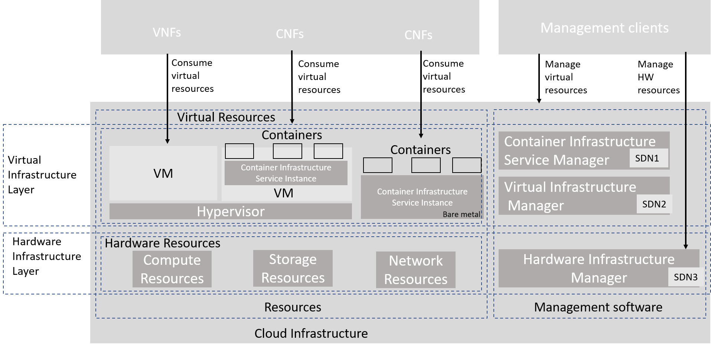

   Reference model realization example

The terms Container Infrastructure Service Instance and Container Infrastructure Service Manager should be understood as
defined in ETSI GR NFV-IFA 029 V3.3.1 :cite:p:`etsigrnfvifa029`. More detailed deployment examples can be found in
`network`_ of this Reference Model chapter.

Hardware Acceleration Abstraction
---------------------------------

The purpose of a Hardware Accelerator is either to Accelerate the execution of an application or to Offload functions
from the generic CPU to make the application and/or Cloud Infrastructure more efficient from one or more aspects.

Hardware Accelerators are often used in Telco Clouds for many reasons. Some applications require an Hardware Accelerator
to perform tasks that a generic CPU cannot perform fast enough, with enough timing accuracy, or handle the traffic that
must be kept in a single context. Other applications could be satisfied with a generic CPU performance in some
deployment cases, whilst being inefficient in other situations. The Cloud Infrastructure might also benefit from
specialised accelerated HW devices to perform its tasks with less power, space, or cost than a generic CPU.

The Accelerators are specialized resources and generally not expected to exist in large quantities, which makes it
important that these limited HW Accelerators are carefully assigned to where they can be best used most of the time. In
general, this requires that there be software-based alternative functions that can be used for the occasions when HW
Accelerators can not be assigned to accelerate or offload applications or Cloud Infrastructure tasks.

It is preferred that the accelerated or offloaded functions have abstracted interfaces since that would hide the
different implementations from a functional point of view and make orchestrator choices simpler and more transparent to
deploy. It will also allow support for multiple different HW Accelerators, and reducing the operator's integration and
test efforts of the accelerators and their applications and/or Cloud Infrastructure.

Types of Accelerators
~~~~~~~~~~~~~~~~~~~~~

Accelerator technologies can be categorized depending on where they are realized in the hardware product and how they
get activated, life cycle managed and supported in running infrastructure.

+-----------------------------+-----------------------------+----------------------------+-----------------------------+
| Acceleration                | Example implementation      | Activation/LCM/support     | Usage by application tenant |
| technology/hardware         |                             |                            |                             |
+=============================+=============================+============================+=============================+
| CPU instructions            | Within CPU cores            | None for hardware          | Application to load         |
|                             |                             |                            | software library that       |
|                             |                             |                            | recognizes and uses CPU     |
|                             |                             |                            | instructions                |
+-----------------------------+-----------------------------+----------------------------+-----------------------------+
| Fixed function accelerator  | Crypto, vRAN-specific       | Rare updates               | Application to load         |
|                             | adapter                     |                            | software library/driver     |
|                             |                             |                            | that recognizes and uses    |
|                             |                             |                            | the accelerator             |
+-----------------------------+-----------------------------+----------------------------+-----------------------------+
| Firmware-programmable       | Network/storage adapter     | Rare updates               | Application normally not    |
| adapter                     | with programmable part of   |                            | modified or aware           |
|                             | firmware image              |                            |                             |
+-----------------------------+-----------------------------+----------------------------+-----------------------------+
| SmartNIC                    | Programmable accelerator    | Programmable by            | 3 types/operational modes:  |
|                             | for vSwitch/vRouter, NF     | Infrastructure operator(s) | 1. Non-programmable         |
|                             | and/or Hardware             | and/or application         | normally with unaware       |
|                             | Infrastructure              | tenant(s)                  | applications; 2. Once       |
|                             |                             |                            | programmable to activate;   |
|                             |                             |                            | 3 Reprogrammable            |
+-----------------------------+-----------------------------+----------------------------+-----------------------------+
| SmartSwitch-based           | Programmable Switch Fabric  | Programmable by            | 3 operational modes:        |
|                             | or TOR switch               | Infrastructure operator(s) | 1. Non-programmable         |
|                             |                             | and/or application         | normally with unaware       |
|                             |                             | tenant(s)                  | applications; 2. Once       |
|                             |                             |                            | programmable to activate;   |
|                             |                             |                            | 3. Reprogrammable           |
+-----------------------------+-----------------------------+----------------------------+-----------------------------+

**Table 3-10:** Hardware acceleration categories, implementation, activation/LCM/support and usage

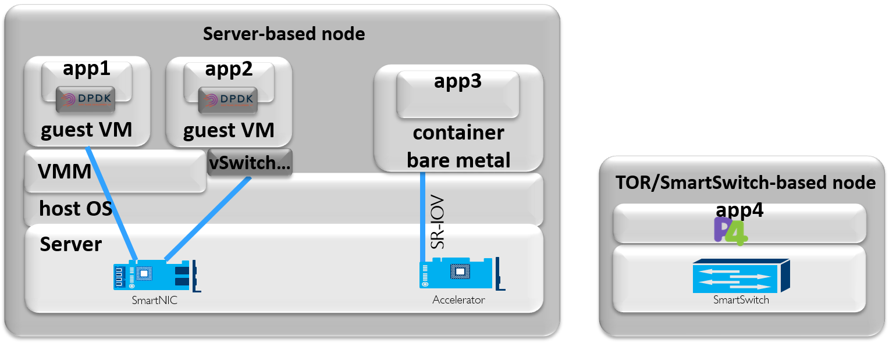

   Examples of server- and SmartSwitch-based nodes (for illustration only)

Infrastructure and Application Level Acceleration
~~~~~~~~~~~~~~~~~~~~~~~~~~~~~~~~~~~~~~~~~~~~~~~~~

:numref:`Hardware Acceleration in RM Realization Diagram` gives examples for the Hardware Accelerators shown in
:numref:`Reference model realization example`
(the :ref:`chapters/chapter03:sample reference model realization` diagram).

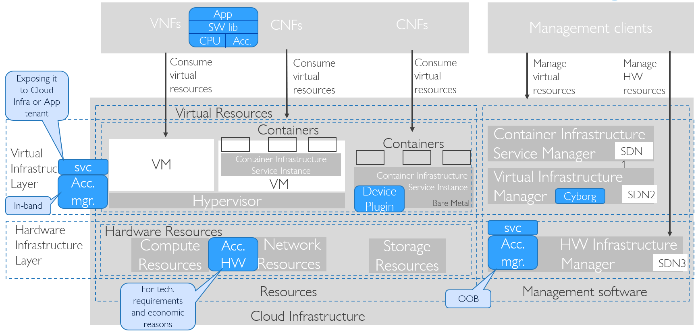

   Hardware Acceleration in RM Realization Diagram

Hardware Accelerators are part of the Hardware Infrastructure Layer. Those that need to be activated/programmed will
expose management interfaces and have Accelerator Management software managing them in-band (from host OS) or out of
band (OOB, over some network to the adapter without going through host OS). For more flexibility in management, such
Accelerator Management can be carried over appropriate service with authentication mechanism before being exposed to
Cloud Infrastructure operator and/or Application tenant.

Application uses software library supporting hardware acceleration and running on generic CPU instructions. Mapping
workload to acceleration hardware is done with Cyborg in OpenStack or Device Plugin framework in Kubernetes. Hardware
accelerator supports both in-band and/or out of band management, with service exposing it to Cloud Infrastructure
operator or Application tenant roles.

Hardware Accelerators can be used as:

-  Virtualization Infrastructure layer acceleration: Example can be vSwitch, which can be leveraged agnostically by VNFs
   if standard host interfaces (like VirtIO) are used.
-  Application layer acceleration: Example of software library/framework (like DPDK) in VM providing Application level
   acceleration with (where available) hardware-abstracted APIs to access platform Hardware Acceleration and providing
   software equivalent libraries when hardware assist not available.
-  Hardware Infrastructure layer offload: Example can be an OOB managed underlay network separation providing network
   separation secured from host OS reach on any provisioned transport switch infrastructure.

Two levels of consumption are for underlay separation or overlay acceleration. Underlay Separation ensures that multiple
different Virtualization Infrastructure instances are kept in separate underlay network access domains. Overlay
Acceleration offloads Virtualization Infrastructure instance vSwitch/vRouter or virtual termination endpoints (for
applications that bypass the Virtual Infrastructure Layer).

Preferably, Application or Infrastructure acceleration can take benefit from underlying hardware acceleration and still
be decoupled from it by using open multi-vendor API for Hardware Acceleration devices like for example:

- For Linux IO virtualization: VirtIO
- For Network Functions using DPDK libraries: Crypto Device, EthDev, Event Device and Base Band Device
- For O-RAN Network functions: O-RAN Acceleration Abstraction Layer Interface.

Example of O-RAN Acceleration Abstraction Layer Interface
~~~~~~~~~~~~~~~~~~~~~~~~~~~~~~~~~~~~~~~~~~~~~~~~~~~~~~~~~

O-RAN Alliance’s Cloudification and Orchestration Workgroup (WG6) defines the Acceleration Abstraction Layer (AAL), an
application-level interface, as the recommended way of decoupling software vendors’ network functions from the different
hardware accelerator implementations.

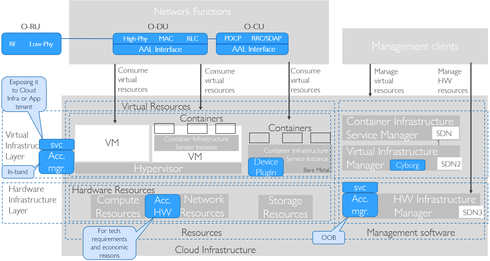

   AAL Interface in RM Realization Diagram

The document “O-RAN Acceleration Abstraction Layer General Aspects and Principles 1.0” :cite:p:`oranwg6aalganp`,
and in the latest O-RAN WG6 Cloudification and Orchestration Workgroup specfications :cite:p:`oranwg6cloudorchwg`:

- Describes the functions conveyed over the AAL interface, including configuration and management functions.
- Identifies the requirements as well as general procedures and operations.
- Introduces the initial set of the O-DU/O-CU AAL profiles.

Workload Placement
~~~~~~~~~~~~~~~~~~

Workload placement can be done by a combination of filters/selectors to find appropriate compute resources, subsystems
to manage assignment of scheduled workloads to Hardware Accelerator, and intelligence in the workload to detect the
presence of Hardware Accelerators.

For initial limited cloud deployments of network functions on private clouds it is possible to have a workload placement
orchestrator that handles optimizations of selected virtualisation clusters and available hardware resources. This will
however soon become too complex with the increasing number of acceleration devices, hardware composability and hybrid
multi-cloud deployments.

Growing lists of individual optimizations including hardware acceleration during scheduling makes it more complex to map
workloads to lists of individual optimizations, so such optimizations get grouped together into higher level categories.
An example is having category for real-time and data plane-optimized category instead of specifying individual
optimizations required to reach it.

With further growth in size of clusters and the variety of hardware acceleration, in a hybrid or multi-cloud deployment,
it will be necessary to enable separate optimization levels for the workload placement and each Cloud Infrastructure
provider. The workload placement orchestrator will operate on one or several Cloud Infrastructures resources to satisfy
the workloads according to Service Level Agreements (SLA) that do not specify all implementation and resource details.
Each Cloud Infrastructure provider will make internal Infrastructure optimisations towards their own internal
optimisation targets whilst fulfilling the SLAs.

CPU Instructions
~~~~~~~~~~~~~~~~

The CPU architecture often includes instructions and execution blocks for most common compute-heavy algorithms like
block cypher (example AES-NI), Random Number Generator or vector instructions. These functions are normally consumed in
infrastructure software or applications by using enabled software libraries that run faster when custom CPU instructions
for the execution of such functions are available in hardware and slower when these specific instructions are not
available in hardware as only the general CPU instructions are used. Custom CPU instructions do not need to be activated
or life-cycle-managed. When scheduling workloads, compute nodes with such custom CPU instructions can be found by
applications or an orchestrator using OpenStack Nova filters or Kubernetes Node Feature Discovery labels, or directly
from the Hardware Management layer.

Fixed Function Accelerators
~~~~~~~~~~~~~~~~~~~~~~~~~~~

Fixed function accelerators can come as adapters with in-line (typically PCIe adapter with Ethernet ports or storage
drives) or look-aside (typically PCIe adapters without any external ports) functionality, additional chip on
motherboard, included into server chipsets or packaged/embedded into main CPU. They can accelerate cryptographic
functions, highly parallelized or other specific algorithms. Initial activation and rare life cycle management events
(like updating firmware image) can typically be done from the Host OS (e.g. the OS driver or a Library), the Hardware
Infrastructure Manager (from a library) or the NF (mostly through a library).

Beyond finding such compute nodes during scheduling workloads, those workloads also need to be mapped to the
accelerator, both of which in Kubernetes can be done with Device Plugin framework. Once mapped to the application, the
application can use enabled software libraries and/or device drivers that will use hardware acceleration. If hardware
acceleration is used to improve cost/performance, then application can also run on generic compute node without hardware
accelerator when application will use the same software library to run on generic CPU instructions.

Firmware-programmable Adapters
~~~~~~~~~~~~~~~~~~~~~~~~~~~~~~

Firmware-programmable network adapters with programmable pipeline are types of network adapters where usual Ethernet
controller functionality (accelerates common network overlays, checksums or protocol termination) can be extended with
partially programmable modules so that additional protocols can be recognized, parsed and put into specific queues,
which helps increase performance and reduce load on main CPU.

Firmware-programmable storage adapters can offload some of the storage functionality and include storage drive emulation
to enable partial drive assignments up to the accessing host OS. These adapters can over time include more supported
storage offload functions or support more drive emulation functions.

Before being used, such adapters have to be activated by loading programmable module that typically accelerates the
Virtualization Infrastructure, so it is not often reprogrammed. Doing this in multivendor environments can lead to
complexities because the adapter hardware is typically specified, installed and supported by server vendor while the
programmable image on the adapter is managed by SDN, Storage Controller or Software Infrastructure vendor.

SmartNICs
~~~~~~~~~

Programmable SmartNIC accelerators can come as programmable in-line adapters (typically PCIe adapter with Ethernet
ports), or network connected pooled accelerators like farms of GPU or FPGA where the normal CPU PCIe connection is
extended with an Ethernet hop.

There are two main types of Smart NICs that can accelerate network functions in-line between CPU and Ethernet ports of
servers. The simpler types have a configurable or programmable packet pipeline that can implement offload for the
infrastructure virtual switching or part of an application functions data plane. The more advanced type, often called
Data Processing Unit (DPU), have a programmable pipeline and some strong CPU cores that simultaneously can implement
underlay networking separation and trusted forwarding functions, infrastructure virtual switching data and control plane
as well as part of an application functions control plane.

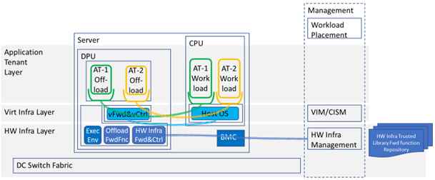

   Example SmartNIC Deployment Model That Accelerates Two Workloads and Has OOB Management

Simple SmartNIC
^^^^^^^^^^^^^^^

The preferred usage of a simple SmartNIC is for the Virtualization Infrastructure usage that typically implements the
data (forwarding) plane of the virtual switch or router. These deployments can offer a standardized higher-level
abstract interface towards the application tenants such as VirtIO that supports good portability and is by that the
preferred usage method.

Simple SmartNICs direct usage by the application tenant (VNF or CNF), where it acts as a dedicated accelerator
appliance, require the application tenant to manage loading and the function that is loaded in the SmartNIC as well as
any interface to the offloaded network functions. Such deployment is similar to the NIC PCI Pass-Through in that it
bypasses the Virtualization Infrastructure layer’s virtual switching, which require all network encapsulation, mapping
and separation to be done by the underlay network, often by manual provisioning and therefore is not a preferred usage
method.

DPU
^^^

The DPU can accelerate software infrastructure functions (vSwitch/vRouter) from the main CPU and simultaneously offer
networking services e.g. load balancers, firewalls and application tenant offload functions. Through Out of band
management it can also ensure underlay separation and map a selected part of the underlay network to the specific
Virtualization Infrastructure instance that the server it is mounted on requires allowing them to be used on any
statically provisioned underlay network.

The forwarding path (data plane) needs to be installed and controlled by the Hardware Infrastructure Manager through an
isolated Out of band management channel into the DPU control and operating system completely out of reach for the main
CPU Host SW. All content in the forwarding path must come from Hardware Infrastructure operator trusted code since any
fault or malicious content can seriously disturb the whole network for all connected devices.

The trusted forwarding functions must be handled through a Hardware Infrastructure Management repository and have APIs
for their respective control functions. These APIs must have an ability to handle some version differences since the
forwarding and control planes life cycle management will not be atomic. The offload functions that should be offered as
services must have published and preferably standardized open APIs, but the application specific forwarding functions do
not have to be open APIs since they will only communicate with the application tenant provided control functions.
`P4 <https://p4.org/>`__ and `OpenConfig <https://github.com/openconfig/>`__ are examples of suitable languages and models,
with different levels of flexibility, usable for these forwarding and control functions.

The separated management channel could either come in through the BMC, a direct management port on the DPU or through a
management VPN on the switch ports. This enable the Hardware Infrastructure Management to automate its networking
through the DPU without any need to dynamically manage the switch fabric, thereby enabling a free choice of switch
fabric vendor. These deployments allow the switch fabric to be statically provisioned by the operators networking
operation unit, as it is often required.

The DPU can offload control and data plane of the virtual switching to the DPU as well as trusted hardware offload for
virtualized Packet Core and Radio data plane networking and transport related functionality in a power efficient way. It
can also offload relevant application tenant control functions if the DPU offers an Execution Environment for VMs or
containers and there is space and performance headroom. In such cases the DPU must also setup a communication channel
into respective application tenant environment.

Smart Switches
~~~~~~~~~~~~~~

Smart Switches can be broadly categorized into Configurable Switches and Programmable Switches.

Configurable Smart Switches run generic “smart” configurable network operating system offering full range of network
functionality and are flexible enough to support most network solutions. The most common such network operating system
is Linux-based `SONiC <https://github.com/sonic-net/SONiC>`__ allowing hardware and software disaggregation by running
on switches from multiple switch vendors with different types of vendor fixed-function ASICs. Still, SONiC today cannot
implement new type of data plane functionality or patch/modify/correct an ASIC, which is the type of support offered by
programmable smart switches.

Programmable Smart Switches make it possible to quickly support new or correct/modify existing protocols and network
functions, allow end customers to implement network functions, and to only implement and load functionality that is
needed. Such switches contain one or more programmable switch ASICs of the same or different types. The two most used
programming languages are `P4 <https://p4.org/>`__ and `NPL <https://nplang.org/>`__, and both can be used with
vendor-specific toolchains to program their switch ASICs and/or FPGAs. Open Networking Foundation
`Stratum <https://opennetworking.org/stratum/>`__ is an example of network operating system that offers generic life
cycle management control services for the P4 components and a management API. The control API for the individual network
functions are not part of the Stratum APIs.

Based on Smart Switches, products exist for fully integrated edge and fabric solutions from vendors like Arista, Cisco
or Kaloom.

Decoupling Applications from Infrastructure and Platform with Hardware Acceleration
~~~~~~~~~~~~~~~~~~~~~~~~~~~~~~~~~~~~~~~~~~~~~~~~~~~~~~~~~~~~~~~~~~~~~~~~~~~~~~~~~~~

Decoupling :ref:`common/glossary:cloud platform abstraction related terminology:` applications from hardware accelerator
is normally accomplished using drivers that, if available, are preferred with standardised interfaces across vendors and
their products, or if not available then through drivers specific to the vendor hardware device. Decoupling
infrastructure software from hardware accelerators is also preferred using standard interfaces. If those are not
available for target hardware accelerator, coupling one or limited number of software infrastructures is less of an
issue compared to coupling multiple applications.

Taking advantage of RM and RA environments with common capabilities, applications can be developed and deployed more
rapidly, providing more service agility and easier operations. The extent to which this can be achieved will depend on
levels of decoupling between application and infrastructure or platform underneath the application:

Infrastructure:
^^^^^^^^^^^^^^^

- a) Application functionality or application control requires infrastructure components beyond RM profiles or
     infrastructure configuration changes beyond APIs specified by RA. Generally, such an application is tightly coupled
     with the infrastructure which results in an Appliance deployment model (see
     :ref:`common/glossary:cloud platform abstraction related terminology:`).
- b) Application control using APIs specified by RA finds nodes (already configured in support of the profiles) with
     the required infrastructure component(s), and in that node using APIs specified by RA configures infrastructure
     components that make application work. Example is an application that to achieve latency requirements needs
     certain hardware acceleration available in RM profile and is exposed through APIs specified by RA.
- c) Application control using APIs specified by RA finds nodes (already configured in support of the profiles) with
     optional infrastructure component(s), and in these nodes using APIs specified by RA configures infrastructure
     component(s) that make application work better (like more performant) than without that infrastructure component.
     Example is an application that would have better cost/performance with certain acceleration adapter but can also
     work without it.
- d) Application control using APIs specified by RA finds general profile nodes without any specific infrastructure
     components.

Platform Services:
^^^^^^^^^^^^^^^^^^

- a) Application functionality or application control can work only with its own components instead of using defined
     Platform Services. Example is an application that brings its own Load Balancer.
- b) With custom integration effort, application can be made to use defined Platform Services. Example is application
     that with custom integration effort can use defined Load Balancer which can be accelerated with hardware
     acceleration in way that is fully decoupled from application (i.e. application does not have awareness of Load
     Balancer being hardware-accelerated).
- c) Application is designed and can be configured for running with defined Platform Services. Example is application
     that can be configured to use defined Load Balancer which can be accelerated with hardware acceleration.

Address Family For XDP (AF_XDP)
-------------------------------

`Address Family For XDP (AF_XDP) <https://www.kernel.org/doc/html/latest/networking/af_xdp.html>`__ is optimized for
high performance packet processing and introduced in Linux kernel v4.18. This new socket type leverages the `eXpress
Data Path (XDP) <https://prototype-kernel.readthedocs.io/en/latest/networking/XDP/>`__ in-kernel fast-path to transfer
traffic frames from the NIC driver directly to userspace without the need for full network stack. XDP is an `Extended
Berkley Packet Filter <https://ebpf.io/>`__ (eBPF) software program.

By using the XDP_REDIRECT action from that XDP program, ingress frames can be redirected to other XDP-enabled network
devices. The fastest working mode of operation is Zero-Copy mode in enabled XDP drivers.

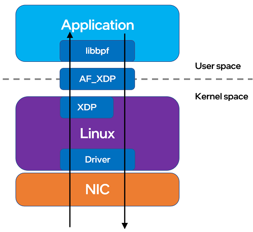

   AF_XDP Architecture

Linux-native applications can open an AF_XDP socket to receive raw packets directly from the NIC, by using `libbpf
<https://www.kernel.org/doc/html/latest/bpf/libbpf/index.html>`__ library functions to register a packet buffer area
where packets will be located, and to create and bind the socket to a networking interface. DPDK-based applications
can use `AF_XDP Poll Mode Driver <https://doc.dpdk.org/guides/nics/af_xdp.html>`__ . VPP-based applications can use
`AF_XDP Device Driver <https://s3-docs.fd.io/vpp/23.02/developer/devicedrivers/af_xdp.html>`__.

In virtualized environments AF_XDP could be used as interface between guest Kernel and user space application, but still need SR-IOV or virtio to get traffic to the VM.

Energy efficiency
-----------------

The energy efficiency should be an overall requirement for both the cloud infrastructure itself and the workloads
hosted by this infrastructure. It is defined as "the relation between the useful output and energy consumption" by
`ITU-T L.1330 <https://www.itu.int/rec/T-REC-L.1330>`__ :cite:p:`itutl1330` for telecommunication networks and
`ETSI EN 303 471 <https://portal.etsi.org/webapp/workprogram/Report_WorkItem.asp?WKI_ID=50095>`__ :cite:p:`etsien303sp471` for NFV,
the useful output being a metric which represents the capacity provided by the service whose energy efficiency is
assessed.

As an example, the useful output of a traffic forwarding function can be the data volume forwarded (e.g., measured
in Byte) and the assessment of its energy efficiency is then based on the ratio between this volume and the energy
consumed for processing it (e.g., measured in Watt.hour) :
Energy Efficicency (B/Wh) = Traffic Volume / Consumed Energy

The method for assessing energy efficiency depends on the service targeted and the objectives. For NFV, ETSI proposes
a method for production environment in `ETSI EN 303 471
<https://portal.etsi.org/webapp/workprogram/Report_WorkItem.asp?WKI_ID=50095>`__ :cite:p:`etsien303sp471` and another one for laboratory one
in `ETSI ES 203 539 <https://portal.etsi.org/webapp/workprogram/Report_WorkItem.asp?WKI_ID=47210>`__ :cite:p:`etsies203sp539` (which is
a common work with ITU-T which published as `ITU-T L.1361 <https://www.itu.int/rec/T-REC-L.1361>`__ :cite:p:`itutl1361`).

Whatever the method and the service, it requires the cloud infrastructure to provide some **energy consumption metrics**
for different parts of the infrastructure hardware (server, CPU etc.) as included in
:ref:`chapters/chapter04:internal performance measurement capabilities`.
These metrics can be an amount of consumed energy (measured in Joule or Watt.hour) or a real-time power utilisation
(measured in Watt or Joule/second) as proposed by `DMTF Redfish DSP0268 2022.2
<https://www.dmtf.org/sites/default/files/standards/documents/DSP0268_2022.2.pdf>`__ :cite:p:`dmtfredfish` which specifies metrics
EnergykWh and PowerWatts for this purpose.

Some relevant information regarding NFV energy efficiency can also be found in `Open RAN Technical Priority - Focus
on Energy Efficiency (March 2022) <https://www.o-ran.org/ecosystem-resources>`__ :cite:p:`oranenergyeff` and `QuEST Forum - NFV
Workload Efficiency Whitepaper (October 2016)
<https://tl9000.org/resources/documents/NFV%20Workload%20Efficiency%20Whitepaper.pdf>`__ :cite:p:`questnfvwlenergyeff`.
