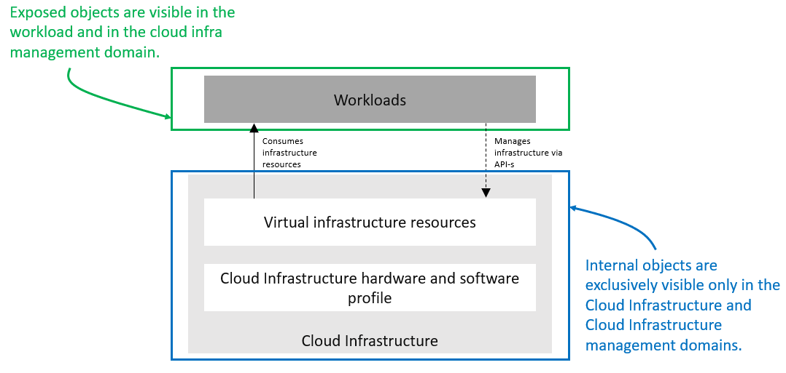
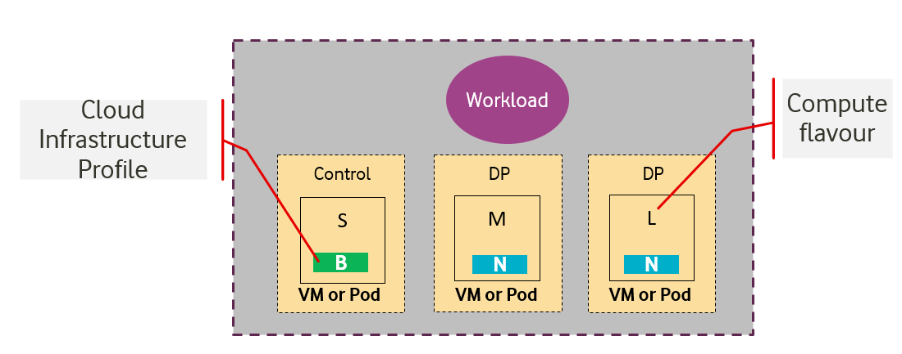
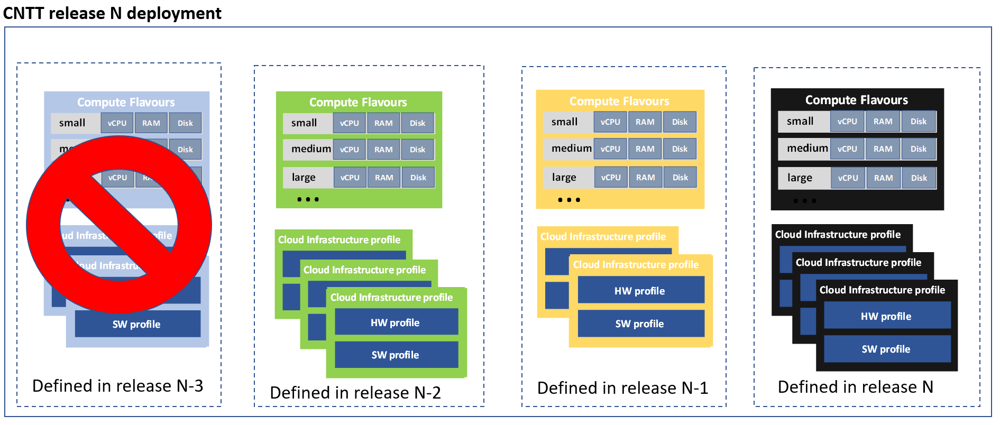
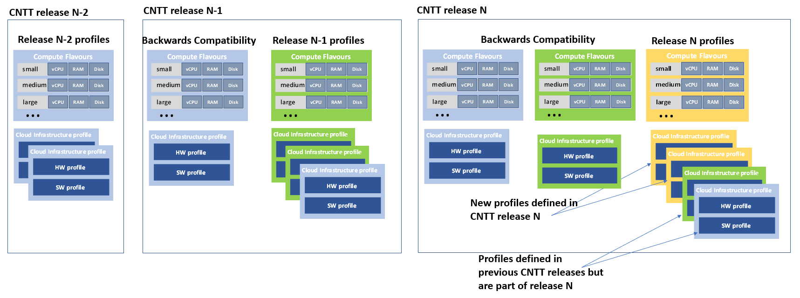
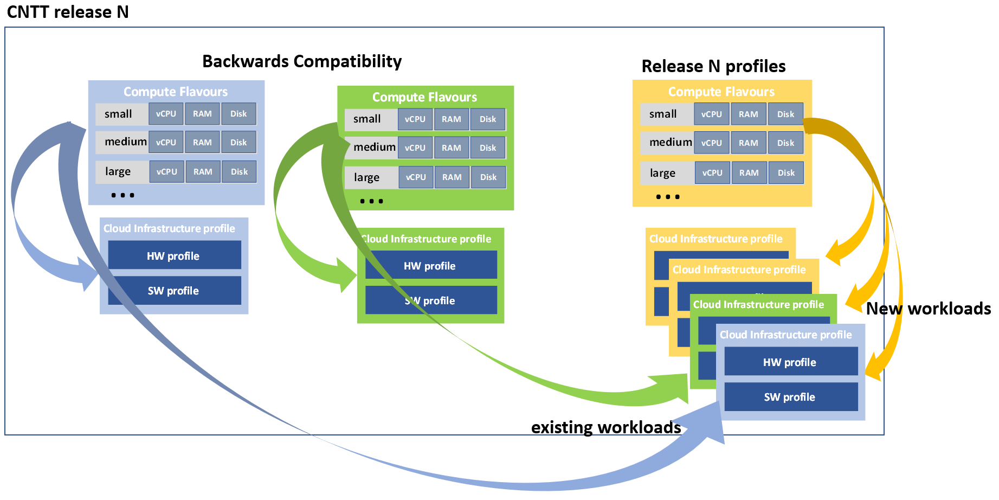

[<< Back](../../ref_model)
# 4 Infrastructure Capabilities, Measurements and Catalogue
<p align="right"></p>


 ______________________________________________________________
## Table of Contents

* [4.1 Capabilities and Performance Measurements](#4.1)
  * [4.1.1 Exposed vs Internal](#4.1.1)
  * [4.1.2 Exposed Infrastructure Capabilities](#4.1.2)
  * [4.1.3 Exposed Infrastructure Measurements](#4.1.3)
  * [4.1.4 Internal Infrastructure Capabilities](#4.1.4)
  * [4.1.5 Cloud infrastructure management Capabilities](#4.1.5)
  * [4.1.6 Cloud infrastructure management Measurements](#4.1.6)
* [4.2 Catalogue](#4.2)
  * [4.2.1 Compute Flavours](#4.2.1)
  * [4.2.2 Virtual Network Interface Specifications](#4.2.2)
  * [4.2.3 Storage Extensions](#4.2.3)
  * [4.2.4 Instance Types](#4.2.4)
  * [4.2.5 Instance Capabilities Mapping](#4.2.5)
  * [4.2.6 Instance Measurements Mapping](#4.2.6)
  * [4.2.7 One Stop Shop](#4.2.7)
* [4.3 Networking](#4.2)

<a name="4.1"></a>
## 4.1 Capabilities and Performance Measurements

This section describes and uniquely identifies the Capabilities provided directly by the Infrastructure, as well as Performance Measurements (PMs) generated directly by the Infrastructure (i.e. without the use of external instrumentation).

The Capability and PM identifiers conform to the following schema:

**a.b.c** (Ex. "e.pm.001")  
a = Scope <(e)xternal | (i)nternal | (t)hird_party_instrumentation>  
b = Type <(cap) capability | (man) management | (pm) performance | (man-pm)>  
c = Serial Number  

A spreadsheet in the artefact repository maintains the list of assigned identifiers, along with their respective descriptions and the next available identifier, globally across all chapters of the RM.
> To-Do: Create tracking ss and add link here

<a name="4.1.1"></a>
### 4.1.1 Exposed vs Internal

The following pertains to the context of Cloud Infrastructure Resources, Capabilities and Performance Measurements (PMs) as discussed within this chapter.

<b>Exposed:</b> Refers to any object (e.g., resource discovery/configuration/consumption, platform telemetry, Interface, etc.) that exists in or pertains to, the domain of the Cloud Infrastructure and is made visible (aka “Exposed”) to a workload. When an object is exposed to a given workload, the scope of visibility within a given workload is at the discretion of the specific workload’s designer. From an Infra perspective, the Infra-resident object is simply being exposed to one or more virtual environments (i.e. Workloads). It is then the responsibility of the kernel or supervisor/executive within the VM to control how, when and where the object is further exposed within the VM, with regard to permissions, security, etc. As the object(s) originate with the Infra, they are by definition visible within that domain.

<b>Internal:</b> Effectively the opposite of Exposed; objects Internal to the Cloud Infrastructure, which are exclusively available for use by the Cloud Infrastructure and components within the Cloud Infrastructure.

<p align="center"></p>
<p align="center"><b>Figure 4-1:</b> Exposed vs. Internal Scope</p>

As illustrated in the figure above, objects designated as "Internal" are only visible within the area inside the blue oval (the Cloud Infrastructure), and only when the entity accessing the object has the appropriate permissions. Whereas objects designated as "Exposed" are potentially visible from both the area within the green oval (the Workload), as well as from within the Cloud Infrastructure, again provided the entity accessing the object has appropriate permissions.

Note: The figure above indicates the areas from where the objects are <i>visible</i>. It is not intended to indicate where the objects are <i>instantiated</i>. For example, the virtual resources are instantiated within the Cloud Infrastructure (the blue area), but are Exposed, and therefore are <i>visible</i> to the Workload, within the green area.

<a name="4.1.2"></a>
### 4.1.2 Exposed Infrastructure Capabilities

This section describes a set of explicit Cloud Infrastructure capabilities and performance measurements that define a Cloud Infrastructure. These capabilities and PMs are well known to workloads as they provide capabilities which workloads rely on.

> _**Note**:  It is expected that Cloud Infrastructure capabilities and measurements will expand over time as more capabilities are added and technology enhances and matures._

<a name="4.1.2.1"></a>
#### 4.1.2.1 Exposed Resource Capabilities

**Table 4-1** below shows resource capabilities of Cloud Infrastructure. Those indicate resources offered to workloads by Cloud Infrastructure.

<a name="Table4-1"></a>

| Ref       | Cloud Infrastructure Capability        | Unit   | Definition/Notes                                                              |
|-----------|----------------------------------------|--------|-------------------------------------------------------------------------------|
| e.cap.001 | # vCPU                                 | number | Max number of vCPU that can be assigned to a single VM or Pod <sup>1)</sup>        |
| e.cap.002 | RAM Size                               | MB     | Max memory in MB that can be assigned to a single VM or Pod by the Cloud Infrastructure <sup>2)</sup>  |
| e.cap.003 | Total per-instance (ephemeral) storage | GB     | Max storage in GB that can be assigned to a single VM or Pod by the Cloud Infrastructure                |
| e.cap.004 | # Connection points                    | number | Max number of connection points that can be assigned to a single VM or Pod by the Cloud Infrastructure          |
| e.cap.005 | Total external (persistent) storage    | GB     | Max storage in GB that can be attached / mounted to VM or Pod by the Cloud Infrastructure                |

<p align="center"><b>Table 4-1:</b> Exposed Resource Capabilities of Cloud Infrastructure</p>

**1)** In a Kubernetes based environment this means the CPU limit of a pod. <br>
**2)** In a Kubernetes based environment this means the memory limit of a pod.

<a name="4.1.2.2"></a>
#### 4.1.2.2 Exposed Performance Optimisation Capabilities

**Table 4-2** shows possible performance optimisation capabilities that can be provided by Cloud Infrastructure. These indicate capabilities exposed to workloads. These capabilities are to be consumed by workloads in a standard way.

<a name="Table4-2"></a>

| Ref       | Cloud Infrastructure Capability           | Unit   | Definition/Notes                                            |
|-----------|-------------------------------------------|--------|-------------------------------------------------------------|
| e.cap.006 | CPU pinning                               | Yes/No | Indicates if Cloud Infrastructure supports CPU pinning      |
| e.cap.007 | NUMA alignment                            | Yes/No | Indicates if Cloud Infrastructure supports NUMA alignment |
| e.cap.008 | IPSec Acceleration                        | Yes/No | IPSec Acceleration                                          |
| e.cap.009 | Crypto Acceleration                       | Yes/No | Crypto Acceleration                                         |
| e.cap.010 | Transcoding Acceleration                  | Yes/No | Transcoding Acceleration                                    |
| e.cap.011 | Programmable Acceleration                 | Yes/No | Programmable Acceleration                                   |
| e.cap.012 | Enhanced Cache Management                 | Yes/No | If supported, L=Lean; E=Equal; X=eXpanded.  L and X cache policies require CPU pinning to be active. |
| e.cap.013 | SR-IOV over PCI-PT                        | Yes/No | Traditional SR-IOV. These Capabilities generally require hardware-dependent drivers be injected into workloads, which is prohibited by CNTT principles. As such, use of these features shall be governed by the applicable CNTT policy. Please consult the RM Appendix for the usage policy relevant to any needed hardware Capability of this type.  |
| e.cap.014 | GPU/NPU                                   | Yes/No | Hardware coprocessor. These Capabilities generally require hardware-dependent drivers be injected into workloads, which is prohibited by CNTT principles. As such, use of these features shall be governed by the applicable CNTT policy. Please consult the RM Appendix for the usage policy relevant to any needed hardware Capability of this type. |
| e.cap.015 | SmartNIC                                  | Yes/No | Network Acceleration. SmartNICs that do not utilise PCI-PT are not subject to the CNTT principles, nor any related policies or prohibitions. |
| e.cap.016 | FPGA/other Acceleration H/W               | Yes/No | Non-specific hardware. These Capabilities generally require hardware-dependent drivers be injected into workloads, which is prohibited by CNTT principles. As such, use of these features shall be governed by the applicable CNTT policy. Please consult the RM Appendix for the usage policy relevant to any needed hardware Capability of this type. |

<p align="center"><b>Table 4-2:</b> Exposed Performance Optimisation Capabilities of Cloud Infrastructure</p>

Enhanced Cache Management is a compute performance enhancer that applies a cache management policy to the socket hosting a given virtual compute instance, provided the associated physical CPU microarchitecture supports it. Cache management policy can be used to specify the static allocation of cache resources to cores within a socket. The "Equal" policy distributes the available cache resources equally across all of the physical cores in the socket. The "eXpanded" policy provides additional resources to the core pinned to a workload that has the "X" attribute applied. The "Lean" attribute can be applied to workloads which do not realize significant benefit from a marginal cache size increase and are hence willing to relinquish unneeded resources.

In addition to static allocation, an advanced Reference Architecture implementation can implement dynamic cache management control policies, operating with tight (~ms) or standard (10s of seconds) control loop response times, thereby achieving higher overall performance for the socket.

<a name="4.1.2.3"></a>
#### 4.1.2.3 Exposed Monitoring Capabilities

Monitoring capabilities are used for the passive observation of workload-specific traffic traversing the Cloud Infrastructure. As with all capabilities, Monitoring may be unavailable or intentionally disabled for security reasons in a given Cloud Infrastructure deployment. If this functionality is enabled, it must be subject to strict security policies. Refer to the Reference Model Security chapter for additional details.

**Table 4-3** shows possible monitoring capabilities available from the Cloud Infrastructure for workloads.

<a name="Table4-3"></a>

| Ref       | Cloud Infrastructure Capability | Unit   | Definition/Notes                            |
|-----------|---------------------------------|--------|---------------------------------------------|
| e.cap.017 | Monitoring of L2-7 data         | Yes/No | Ability to monitor L2-L7 data from workload |

<p align="center"><b>Table 4-3:</b> Exposed Monitoring Capabilities of Cloud Infrastructure</p>

<a name="4.1.3"></a>
### 4.1.3 Exposed Infrastructure Performance Measurements
The intent of the following PMs is to be available for and well known to wokloads.

<a name="4.1.3.1"></a>
#### 4.1.3.1 Exposed Performance Measurements

The following table of exposed Performance Measurements shows PMs per VM or Pod, vNIC or vCPU. Network test setups are aligned with ETSI GS NFV-TST 009 [2]. Specifically exposed PMs use a single workload (PVP) dataplane test setup in a single host.

<a name="Table4-4"></a>

| Ref      | Cloud Infrastructure Measurement | Unit  | Definition/Notes    |
|----------|----------------------------------|-------|---------------------|
| e.pm.xxx | Place Holder                     | Units | Concise description |

<p align="center"><b>Table 4-4:</b> Exposed Performance Measurements of Cloud Infrastructure</p>


<a name="4.1.4"></a>
### 4.1.4 Internal Infrastructure Capabilities

This section covers a list of implicit Cloud Infrastructure capabilities and measurements that define an Cloud Infrastructure. These capabilities and metrics determine how the Cloud Infrastructure behaves internally. They are hidden from workloads (i.e. workloads may not know about them) but they will impact the overall performance and capabilities of a given Cloud Infrastructure solution.

>_**Note**:  It is expected that implicit Cloud Infrastructure capabilities and metrics will evolve with time as more capabilities are added as technology enhances and matures._

<a name="4.1.4.1"></a>
#### 4.1.4.1 Internal Resource Capabilities
**Table 4-5** shows resource capabilities of Cloud Infrastructure. These include capabilities offered to workloads and resources consumed internally by Cloud Infrastructure.

<a name="Table4-5"></a>

| Ref       | Cloud Infrastructure Capability                       | Unit                   | Definition/Notes                                                   |
|-----------|-------------------------------------------------------|------------------------|--------------------------------------------------------|
| i.cap.014 | CPU cores consumed by the Cloud Infrastructure overhead on a worker (compute) node | % | The ratio of cores consumed by the Cloud Infrastructure components (including host OS) in a compute node to the total number of cores available espressed as a percentage |
| i.cap.015 | Memory consumed by the Cloud Infrastructure overhead on a worker (compute) node    | % | The ratio of memory consumed by the Cloud Infrastructure components (including host OS) in a worker (compute) node to the total available memory expressed as a percentage |

<p align="center"><b>Table 4-5:</b> Internal Resource Capabilities of Cloud Infrastructure</p>

<!--
/* MXS 13/7/2019 - Mapping table 3-14 is being commented out. If someone can provide supporting details,
   we can put it back. Details should include assumptions (e.g., is it SRIOV, OvS or what?),
   citable references, an explanation of what we're mapping and why (#s represent min? max? anticipated?, etc.),
   and a detailed basis for the values, including an explanation for how come the numbers are identical for both
   cores and ram. Thanks, -Mark */
//
| Ref             | B Instance | N Instance | C Instance |
|-----------------|--------------------------|--------------------------|--------------------------|
| `i.res.cap.001` | 5-10% | 10-20% | 15-25% |
| `i.res.cap.002` | 5-10% | 10-20% | 15-25% |
<p align="center"><b>Table 3-14:</b> Mapping of Internal resource capabilities to Cloud Infrastructure instance types.</p>
//
-->
<a name="4.1.4.2"></a>
#### 4.1.4.2 Internal SLA capabilities

**Table 4-6** below shows SLA (Service Level Agreement) capabilities of Cloud Infrastructure. These include Cloud Infrastructure capabilities required by workloads as well as required internal to Cloud Infrastructure. Application of these capabilities to a given workload is determined by its Cloud Infrastructure Profile.

<a name="Table4-6"></a>

| Ref       | Cloud Infrastructure capability      | Unit   | Definition/Notes                                                               |
|-----------|----------------------|--------|--------------------------------------------------------------------------------|
| i.cap.016 | CPU allocation ratio | N:1    | Number of virtual cores per physical core; also known as CPU overbooking ratio |
| i.cap.017 | Connection point QoS | Yes/No | QoS enablement of the connection point (vNIC or interface)                     |

<p align="center"><b>Table 4-6:</b> Internal SLA capabilities to Cloud Infrastructure</p>

<a name="4.1.4.3"></a>
#### 4.1.4.3 Internal Performance Optimisation Capabilities
**Table 4-7** below shows possible performance optimisation capabilities that can be provided by Cloud Infrastructure. These include capabilities exposed to workloads as well as internal capabilities to Cloud Infrastructure. These capabilities will be determined by the Cloud Infrastructure Profile used by the Cloud Infrastructure.

<a name="Table4-7"></a>

| Ref       | Cloud Infrastructure capability | Unit   | Definition/Notes                      |
|-----------|---------------------------------|--------|---------------------------------------|
| i.cap.018 | Huge pages                      | Yes/No | Indicates if the Cloud Infrastructure supports huge pages |

<p align="center"><b>Table 4-7:</b> Internal performance optimisation capabilities of Cloud Infrastructure</p>

<a name="4.1.4.4"></a>
#### 4.1.4.4 Internal Performance Measurement Capabilities

**Table 4-8** shows possible performance measurement capabilities available by Cloud Infrastructure. The availability of these capabilities will be determined by the Cloud Infrastructure Profile used by the workloads.

<a name="Table4-8"></a>

| Ref      | Cloud Infrastructure Measurement           | Unit        | Definition/Notes                                                                                                                                                                                                            |
|----------|--------------------------------------------|-------------|-----------------------------------------------------------------------------------------------------------------------------------------------------------------------------------------------------------------------------|
| i.pm.001 | Host CPU usage                             | nanoseconds | Per Compute node. It maps to [ETSI GS NFV-TST 008 V3.2.1](https://www.etsi.org/deliver/etsi_gs/NFV-TST/001_099/008/03.02.01_60/gs_NFV-TST008v030201p.pdf) clause 6, processor usage metric (Cloud Infrastructure internal).           |
| i.pm.002 | Virtual compute resource CPU usage         | nanoseconds | Per VM or Pod.  It maps to [ETSI GS NFV-IFA 027 v2.4.1](https://www.etsi.org/deliver/etsi_gs/NFV-IFA/001_099/027/02.04.01_60/gs_nfv-ifa027v020401p.pdf) Mean Virtual CPU usage and Peak Virtual CPU usage (Cloud Infrastructure external). |
| i.pm.003 | Host CPU utilization                       | %           | Per Compute node. It maps to [ETSI GS NFV-TST 008 V3.2.1](https://www.etsi.org/deliver/etsi_gs/NFV-TST/001_099/008/03.02.01_60/gs_NFV-TST008v030201p.pdf) clause 6, processor usage metric (Cloud Infrastructure internal).           |
| i.pm.004 | Virtual compute resource CPU utilization   | %           | Per VM or Pod. It maps to [ETSI GS NFV-IFA 027 v2.4.1](https://www.etsi.org/deliver/etsi_gs/NFV-IFA/001_099/027/02.04.01_60/gs_nfv-ifa027v020401p.pdf) Mean Virtual CPU usage and Peak Virtual CPU usage (Cloud Infrastructure external). |
| i.pm.005 | Measurement of external storage IOPS       | Yes/No      |                                                                                                                                                                                                                             |
| i.pm.006 | Measurement of external storage throughput | Yes/No      |                                                                                                                                                                                                                             |
| i.pm.007 | Available external storage capacity        | Yes/No      |                                                                                                                                                                                                                             |

<p align="center"><b>Table 4-8:</b> Internal Measurement Capabilities of Cloud Infrastructure</p>

<a name="4.1.5"></a>
### 4.1.5 Cloud Infrastructure Management Capabilities

The Cloud Infrastructure Manager (CIM) is responsible for controlling and managing the Cloud Infrastructure compute, storage, and network resources. Resources allocation is dynamically set up upon workloads requirements. This section covers the list of capabilities offered by the CIM to workloads or service orchestrator.

Table 4-9 shows capabilities related to resources allocation.

<a name="Table4-9"></a>

| Ref       | Cloud Infrastructure Management Capability | Unit            | Definition/Notes                                                 |
|-----------|--------------------------------------------|-----------------|------------------------------------------------------------------|
| e.man.001 | Virtual Compute allocation                 | Yes/No          | Capability to allocate virtual compute resources to a workload   |
| e.man.002 | Virtual Storage allocation                 | Yes/No          | Capability to allocate virtual storage resources to a workload    |
| e.man.003 | Virtual Networking resources allocation    | Yes/No          | Capability to allocate virtual networking resources to a workload |
| e.man.004 | Multi-tenant isolation                     | Yes/No          | Capability to isolate resources between tenants                  |
| e.man.005 | Images management                          | Yes/No          | Capability to manage workload software images                    |
| e.man.010 | Compute Availability Zones                 | list of strings | The names of each Compute Availability Zone that was defined to separate failure domains |
| e.man.011 | Storage Availability Zones                 | list of strings | The names of each Storage Availability Zone that was defined to separate failure domains |

<p align="center"><b>Table 4-9:</b> Cloud Infrastructure Management Resource Allocation Capabilities</p>

<a name="4.1.6"></a>
### 4.1.6 Cloud Infrastructure Management Performance Measurements

Table 4-10 shows performance measurement capabilities.

<a name="Table4-10"></a>

| Ref       | Cloud Infrastructure Management Capability | Unit   | Definition/Notes                                                                            |
|-----------|--------------------------------------------|--------|---------------------------------------------------------------------------------------------|
| e.man.006 | Virtual resources inventory per tenant     | Yes/No | Capability to provide information related to allocated virtualised resources per tenant     |
| e.man.007 | Resources Monitoring                       | Yes/No | Capability to notify state changes of allocated resources                          |
| e.man.008 | Virtual resources Performance              | Yes/No | Capability to collect and expose performance information on virtualised resources allocated |
| e.man.009 | Virtual resources Fault information        | Yes/No | Capability to collect and notify fault information on virtualised resources                 |

<p align="center"><b>Table 4-10:</b> Cloud Infrastructure Management Performance Measurement Capabilities</p>


<a name="4.1.6.1"></a>
#### 4.1.6.1 Resources Management Measurements
**Table 4-11** shows resource management measurements of CIM as aligned with ETSI GS NFV TST-012 [3].

<a name="Table4-11"></a>

| Ref          | Cloud Infrastructure Management Measurement                   | Unit   | Definition/Notes |
|--------------|---------------------------------------------------------------|--------|------------------|
| e.man-pm.001 | Time to create Virtual Compute resources (VM/container) for a given workload | Max ms |                  |
| e.man-pm.002 | Time to delete Virtual Compute resources (VM/container) of a given workload  | Max ms |                  |
| e.man-pm.003 | Time to start Virtual Compute resources (VM/container) of a given workload   | Max ms |                  |
| e.man-pm.004 | Time to stop Virtual Compute resources (VM/container) of a given workload    | Max ms |                  |
| e.man-pm.005 | Time to pause Virtual Compute resources (VM/container) of a given workload   | Max ms |                  |
| e.man-pm.006 | Time to create internal virtual network                                      | Max ms |                  |
| e.man-pm.007 | Time to delete internal virtual network                                      | Max ms |                  |
| e.man-pm.008 | Time to update internal virtual network                                      | Max ms |                  |
| e.man-pm.009 | Time to create external virtual network                                      | Max ms |                  |
| e.man-pm.010 | Time to delete external virtual network                                      | Max ms |                  |
| e.man-pm.011 | Time to update external virtual network                                      | Max ms |                  |
| e.man-pm.012 | Time to create external storage ready for use by workload                    | Max ms |                  |

<p align="center"><b>Table 4-11:</b> Cloud Infrastructure management Resource Management Measurements</p>


<a name="4.2"></a>
## 4.2 Infrastructure Profiles Catalogue

Infrastructure exposes compute Flavours with options, virtual interface options, storage extensions, and acceleration extensions to workloads. These Cloud Infrastructure Profiles are offered to workloads with their corresponding options and extensions.

The idea of the Cloud Infrastructure profiles is to have a predefined set of infrastructure capabilities with a predefined set of compute Flavours which workload vendors use to build their workloads. Each workload can use several Flavours from different Cloud Infrastructure Profiles to build its overall functionality as illustrated in **Figure 4-2**.

<p align="center"></p>
<p align="center"><b>Figure 4-2:</b> Workloads built against Cloud Infrastructure Profiles and compute Flavours.</p>

<a name="4.2.1"></a>
### 4.2.1 Compute Flavours

Compute Flavours represent the compute, memory, storage, and management network resource templates that are used by VMs on the compute hosts. Each VM is given a compute Flavour (resource template), which determines the VMs compute, memory and storage characteristics.

Compute Flavours can also specify secondary ephemeral storage, swap disk, etc. A compute Flavour geometry consists of the following elements:

<a name="Table4-12"></a>

| Element                               | Description                                                                                                                                                                                             |
|---------------------------------------|---------------------------------------------------------------------------------------------------------------------------------------------------------------------------------------------------------|
| Compute Flavour Name                  | A descriptive name                                                                                                                                                                                      |
| Virtual compute resources (aka vCPUs) | Number of virtual compute resources (vCPUs) presented to the VM instance.                                                                                                                               |
| Memory                                | Virtual compute instance memory in megabytes.                                                                                                                                                           |
| Ephemeral/Local Disk                  | Specifies the size of an ephemeral data disk that exists only for the life of the instance. Default value is 0.<br />The ephemeral disk may be partitioned into boot (base image) and swap space disks. |
| Management Interface                  | Specifies the bandwidth of management interface/s                                                                                                                                                       |

<p align="center"><b>Table 4-12:</b> Compute Flavour Geometry Specification.</p>

<a name="4.2.1.1"></a>
#### 4.2.1.1 Predefined Compute Flavours
The intent of the following Flavours list is to be comprehensive and yet effective to cover both IT and NFV workloads. The compute Flavours are specified relative to the “large” Flavour. The “large” Flavour configuration consists of 4 vCPUs, 8 GB of RAM and 80 GB of local disk, and the resulting virtual compute instance will have a management interface of 1 Gbps. The “medium” Flavour is half the size of a large and small is half the size of medium. The tiny Flavour is a special sized Flavour.

>_*Note:*_ Customised (Parameterized) Flavours can be used in concession by operators and, if needed, are created using TOSCA, HEAT templates, and/or VIM APIs.

<a name="Table4-13"></a>

| .conf                  | vCPU ("c") <sup>2)</sup> | RAM ("r") <sup>2)</sup> | Local Disk ("d") | Management Interface |
|------------------------|--------------------------|-------------------------|------------------|----------------------|
| .tiny                  | 1                        | 512 MB                  | 1 GB             | 1 Gbps               |
| .small                 | 1                        | 2 GB                    | 20 GB            | 1 Gbps               |
| .medium                | 2                        | 4 GB                    | 40 GB            | 1 Gbps               |
| .large                 | 4                        | 8 GB                    | 80 GB            | 1 Gbps               |
| .2xlarge <sup>1)</sup> | 8                        | 16 GB                   | 160 GB           | 1 Gbps               |
| .4xlarge <sup>1)</sup> | 16                       | 32 GB                   | 320 GB           | 1 Gbps               |
| .8xlarge <sup>1)</sup> | 32                       | 64 GB                   | 640 GB           | 1 Gbps               |

<p align="center"><b>Table 4-13:</b> Predefined Compute Flavours.</p>

**1)** These compute Flavours are intended to be used for transitional purposes and workload vendors are expected to consume smaller Flavours and adopt microservices-based designs for their workloads.<br>
**2)** In Kubernetes based environments these are the resource requests of the containers in the pods. To get guaranteed resources the resource requests should be set to the same values as the resource limits, to get burstable resources the resource limits should be higher than the resource requests while to get best effort resources none of resource requests of resource limits should be set.

<a name="4.2.2"></a>
### 4.2.2 Virtual Network Interface Specifications


The virtual network interface specifications extend a Flavour customization with network interface(s), with an associated bandwidth, and are identified by the literal, “n”, followed by the interface bandwidth (in Gbps). Multiple network interfaces can be specified by repeating the “n” option.

Virtual interfaces may be of an Access type, and thereby untagged, or may be of a Trunk type, with one or more 802.1Q tagged logical interfaces. Note, tagged interfaces are encapsulated by the Overlay, such that tenant isolation (i.e. security) is maintained, irrespective of the tag value(s) applied by the workload.  

Note, the number of virtual network interfaces, aka vNICs, associated with a virtual compute instance, is directly related to the number of vNIC extensions declared for the environment. The vNIC extension is not part of the base Flavour.
```
<network interface bandwidth option> :: <”n”><number (bandwidth in Gbps)>
```
<a name="Table4-14"></a>

| Virtual Network Interface Option   | Interface Bandwidth               |
|------------------------------------|-----------------------------------|
| n1, n2, n3, n4, n5, n6             | 1, 2, 3, 4, 5, 6 Gbps             |
| n10, n20, n30, n40, n50, n60       | 10, 20, 30, 40, 50, 60 Gbps       |
| n25, n50, n75, n100, n125, n150    | 25, 50, 75, 100, 125, 150 Gbps    |
| n50, n100, n150, n200, n250, n300  | 50, 100, 150, 200, 250, 300 Gbps  |
| n100, n200, n300, n400, n500, n600 | 100, 200, 300, 400, 500, 600 Gbps |

<p align="center"><b>Table 4-14:</b> Virtual Network Interface Specification Examples</p>

<a name="4.2.3"></a>
###  4.2.3 Storage Extensions

Persistent storage is associated with workloads via Storage Extensions. The size of an extension can be specified explicitly in increments of 100GB, ranging from a minimum of 100GB to a maximum of 16TB. Extensions are configured with the required performance category, as per Table 4-14. Multiple persistent Storage Extensions can be attached to virtual compute instances.

Note, CNTT documentation uses GB and GiB to refer to a Gibibyte (2<sup>30</sup> bytes), except where explicitly stated otherwise.

<a name="Table4-15"></a>

| .conf   | Read IO/s  | Write IO/s | Read Throughput (MB/s) | Write Throughput (MB/s) | Max Ext Size |
|---------|------------|------------|------------------------|-------------------------|--------------|
| .bronze | Up to 3K   | Up to 1.5K | Up to 180              | Up to 120               | 16TB         |
| .silver | Up to 60K  | Up to 30K  | Up to 1200             | Up to 400               | 1TB          |
| .gold   | Up to 680K | Up to 360K | Up to 2650             | Up to 1400              | 1TB          |

<p align="center"><b>Table 4-15:</b> Storage Performance Profiles</p>

Note, performance is based on a block size of 256KB or larger.

<!---
<a name="4.2.3.1"></a>
#### 4.2.3.1 Available Storage Extensions
The following table defines persistent storage extensions that can be provided to workloads for data storage. More than one storage extension can be provided to a single VM or Pod. The option selected determines both the size and the performance of the extension.
//
| .conf | capacity | Read IOPS | Write IOPS | Read Throughput (MB/s) | Write Throughput (MB/s) |
|----------|----------|------------|------------|------------------------|-------------------------|
| .bronze1 | 100GB | Up to 3K | Up to 15K | Up to 180 | Up to 120 |
| .bronze2 | 200GB | Up to 3K | Up to 15K | Up to 180 | Up to 120 |
| .bronze3 | 300GB | Up to 3K | Up to 15K | Up to 180 | Up to 120 |
| .silver1 | 100GB | Up to 60K | Up to 30K | Up to 1200 | Up to 400 |
| .silver2 | 200GB | Up to 60K | Up to 30K | Up to 1200 | Up to 400 |
| .silver3 | 300GB | Up to 60K | Up to 30K | Up to 1200 | Up to 400 |
| .gold1 | 100GB | Up to 680K | Up to 360K | Up to 2650 | Up to 1400 |
| .gold2 | 200GB | Up to 680K | Up to 360K | Up to 2650 | Up to 1400 |
| .gold3 | 300GB | Up to 680K | Up to 360K | Up to 2650 | Up to 1400 |
//
<p align="center"><b>Table 4-15:</b> Storage Extension Options</p>

Table 4-15: Reserved
--->

<a name="4.2.4"></a>
### 4.2.4 Cloud Infrastructure Profiles

<a name="4.2.4.1"></a>
#### 4.2.4.1 Basic Profile
This Cloud Infrastructure Profile is intended to be used for both IT workloads as well as NFV workloads. It has limited IO capabilities (up to 10Gbps Network interface).

<a name="4.2.4.2"></a>
#### 4.2.4.2 Network Intensive Profile
This Cloud Infrastructure Profile is intended to be used for those applications that has high network throughput requirements (up to 50Gbps).

##### 4.2.4.2.1 Network Acceleration Extensions
Network Intensive Profile can come with Network Acceleration extensions to assist workloads offloading some of their network intensive operations to hardware. The list below is preliminary and is expected to grow as more network acceleration resources are developed and standardized.
>_Interface types are aligned with [ETSI GS NFV-IFA 002](https://www.etsi.org/deliver/etsi_gs/NFV-IFA/001_099/002/02.01.01_60/gs_NFV-IFA002v020101p.pdf)._

<a name="Table4-16"></a>

| .conf      | Interface type | Description                              |
|------------|----------------|------------------------------------------|
| .il-ipsec  | virtio-ipsec*  | In-line IPSec acceleration.              |
| .la-crypto | virtio-crypto  | Look-Aside encryption/decryption engine. |

<p align="center"><b>Table 4-16:</b> Acceleration Extensions for Network Intensive Profile</p>

> _*Need to work with relevant open source communities to create missing interfaces._

<!--
<a name="4.2.4.3"></a>
#### 4.2.4.3 Compute Intensive Profile
This NFVI Profile is intended to be used for those applications that has high compute requirements and can take advantage of acceleration technologies such as GPU, FPGA, etc. This NFVI Profile is intended to be available in local data centers and more towards the Edge of the network.

##### 4.2.4.3.1 Compute Acceleration Extensions
Compute Intensive Profile can come with compute acceleration extensions to assist workloads/VAs offloading some of their compute intensive operations to hardware. The list below is preliminary and is expected to grow as more compute acceleration resources are developed and standardized.

<a name="Table4-17"></a>

| .conf | Interface type | Description |
|------------|----------------|-----------------------------------------|
| .la-trans | virtio-trans* | Look-Aside Transcoding acceleration. |
| .la-programmable | virtio-programmable | Look-Aside programmable acceleration. |

<p align="center"><b>Table 4-17:</b> Acceleration Extensions for Compute Intensive Profile</p>

> _*Need to work with relevant open source communities to create missing interfaces._

<a name="4.2.4.4"></a>
#### 4.2.4.4 Network Interface Options
**Table 4-18** below shows the various network interface extension bandwidth options (from **Table 4-18**) available for each profile type (Up to 6 extensions (i.e. interfaces) may be associated with a virtual compute instance).

<a name="Table4-18"></a>

| Virtual Interface Option* | Basic Type | Network Intensive Type | Compute Intensive Type
|---------------------------|-----|-----|-----
n1, n2, n3, n4, n5, n6 | Y | N |N
n10, n20, n30, n40, n50, n60 | Y | Y | Y
n25, n50, n75, n100, n125, n150 | N | Y | Y
n50, n100, n150, n200, n250, n300 | N | Y | Y
n100, n200, n300, n400, n500, n600 | N | Y | N

<p align="center"><b>Table 4-18:</b> Virtual NIC Interfaces Options</p>

> _*workloads are expected to use the minimum number of interfaces and adopt Microservice design principles._

-->
<a name="4.2.5"></a>
### 4.2.5 Cloud Infrastructure Profile Capabilities Mapping

<a name="Table4-17"></a>

| Ref                                                                  | Basic                    | Network Intensive        | Notes |
|----------------------------------------------------------------------|--------------------------|--------------------------|---------------------------------------------------------------------|
| `e.cap.001`<br />(#vCPU cores)                              | Per selected  \<Flavour> | Per selected  \<Flavour> | Exposed resource capabilities as per [**Table 4-1**](#Table4-1)     |
| `e.cap.002`<br />(RAM Size (MB))                            | Per selected  \<Flavour> | Per selected  \<Flavour> |                                                                     |
| `e.cap.003`<br />(Total instance (ephemeral) storage (GB))  | Per selected  \<Flavour> | Per selected  \<Flavour> |                                                                     |
| `e.cap.004`<br />(# Connection points)                      | Per selected  <I Opt>    | Per selected  <I Opt>    |                                                                     |
| `e.cap.005`<br />(Total external (persistent) storage (GB)) | Per selected  <S Ext>    | Per selected  <S Ext>    |                                                                     |
| `e.cap.006`<br />(CPU pinning)                              | No                       | Yes                      | Exposed performance capabilities as per [**Table 4-2**](#Table4-2)  |
| `e.cap.007`<br />(NUMA alignment)                           | No                       | Yes                      |                                                                     |
| `e.cap.008`<br />(IPSec Acceleration)                       | No                       | Yes (if offered)         |                                                                     |
| `e.cap.009`<br />(Crypto Acceleration)                      | No                       | Yes (if offered)         |                                                                     |
| `e.cap.010`<br />(Transcoding Acceleration)                 | No                       | No                       |                                                                     |
| `e.cap.011`<br />(Programmable Acceleration)                | No                       | No                       |                                                                     |
| `e.cap.012`<br />(Enhanced Cache Management)                | E                        | E                        |                                                                     |
| `e.cap.013`<br />(SR-IOV over PCI-PT)                                 | Yes                      | No                       | |
| `e.cap.014`<br />(GPU/NPU)                                            | No                       | No                       | |
| `e.cap.015`<br />(SmartNIC)                                           | Yes (if offered)         | No                       | |
| `e.cap.016`<br />(FPGA/other Acceleration H/W)                        | Yes (if offered)         | No                       | || | `e.cap.017`<br />(Monitoring of L2-7 data)                  | No                       | Yes                      | Exposed monitoring capabilities as per [**Table 4-3**](#Table4-3)   |
| `i.cap.014`<br />(CPU cores consumed by the Cloud Infrastructure overhead on a worker (compute) node) | any                      | any                      | |
| `i.cap.015`<br />(Memory consumed by Cloud Infrastructure on the worker (compute) nodes)        | any                      | any                      | |
| `i.cap.016`<br />(CPU allocation ratio)                     | 1:1                      | 1:1                      | Internal SLA capabilities as per [**Table 4-6**.](#Table4-6)<br/><br/>_**Note**: This is set to 1:1 for the Basic profile to enable predictable and consistent performance during benchmarking and certification.  Operators may choose to modify this for actual deployments if they are willing to accept the risk of performance impact to workloads using the basic profile._  |
| `i.cap.017`<br />(Connection point QoS)                    | No                       | Yes                      |                                                                     |
| `i.cap.018`<br />(Huge pages)                              | No                       | Yes                      | Internal performance capabilities as per [**Table 4-7**](#Table4-7) |
| `i.pm.001`<br />(Host CPU usage)                           | Yes                      | Yes                      | Internal monitoring capabilities as per [**Table 4-8**](#Table4-8)  |
| `i.pm.002`<br />(Virtual compute resource CPU usage)                | Yes                      | Yes                      |                                                                     |
| `i.pm.003`<br />(Host CPU utilization)                     | Yes                      | Yes                      |                                                                     |
| `i.pm.004`<br />(Virtual compute resource CPU utilization)          | Yes                      | Yes                      |                                                                     |
| `i.pm.005`<br />(Measurement of external storage IOPS)                | Yes                      | Yes                      | |
| `i.pm.006`<br />(Measurement of external storage throughput)          | Yes                      | Yes                      | |
| `i.pm.007`<br />(Available external storage capacity)                 | Yes                      | Yes                      | |
<!--
| Ref | Basic | Network Intensive | Compute Intensive | Notes |
|----------------------|----------------------------|----------------------------|----------------------------|-------|
| `e.cap.001`<br />(#vCPU cores) | Per selected  \<Flavour> | Per selected  \<Flavour> | Per selected  \<Flavour> | Exposed resource capabilities as per [**Table 4-1**](#Table4-1)|
| `e.cap.002`<br />(Amount of RAM (MB)) | Per selected  \<Flavour> | Per selected  \<Flavour> | Per selected  \<Flavour> |  |
| `e.cap.003`<br />(Total instance (ephemeral) storage (GB)) | Per selected  \<Flavour> | Per selected  \<Flavour> | Per selected  \<Flavour> |  |
| `e.cap.004`<br />(# vNICs) | Per selected  <I Opt> | Per selected  <I Opt> | Per selected  <I Opt> |  |
| `e.cap.005`<br />(Total instance (persistent) storage (GB)) | Per selected  <S Ext> | Per selected  <S Ext> | Per selected  <S Ext> |  |
| `e.per.cap.001`<br />(CPU pinning support) | No | Yes | Yes | Exposed performance capabilities as per [**Table 4-2**](#Table4-2) |
| `e.per.cap.002`<br />(NUMA support) | No | Yes | Yes | |
| `e.per.cap.003`<br />(IPSec Acceleration) | No | Yes (if offered) | No | |
| `e.per.cap.004`<br />(Crypto Acceleration) | No | Yes (if offered) | No | |
| `e.per.cap.005`<br />(Transcoding Acceleration) | No | No | Yes (if offered) | |
| `e.per.cap.006`<br />(Programmable Acceleration) | No | No | Yes (if offered) | |
| `e.per.cap.007`<br />(Enhanced Cache Management) | E | E | X (if offered) | |
| `e.mon.cap.001`<br />(Monitoring of L2-7 data) | No | Yes | No | Exposed monitoring capabilities as per [**Table 4-3**](#Table4-3)|
| `i.sla.cap.001`<br />(CPU allocation ratio) | 1:1 | 1:1 | 1:1 | Internal SLA capabilities as per [**Table 4-6**.](#Table4-6) |
| `i.sla.cap.002`<br />(vNIC QoS) | No | Yes | Yes | |
| `i.per.cap.001`<br />(Huge page support) | No | Yes | Yes | Internal performance capabilities as per [**Table 4-7**](#Table4-7) |
| `i.mon.cap.001`<br />(Host CPU usage) | Yes | Yes | Yes | Internal monitoring capabilities as per [**Table 4-8**](#Table4-8) |
| `i.mon.cap.002`<br />(Virtual compute CPU usage) | Yes | Yes | Yes | |
| `i.mon.cap.003`<br />(Host CPU utilization) | Yes | Yes | Yes | |
| `i.mon.cap.004`<br />(Virtual compute CPU utilization) | Yes | Yes | Yes | |
| `i.mon.cap.007`<br />(External storage capacity) | No | No | Yes | |
-->

<p align="center"><b>Table 4-17:</b> Mapping of Capabilities to Cloud Infrastructure Profiles</p>

<a name="4.2.6"></a>
### 4.2.6 Cloud Infrastructure Profile Performance Measurement Mapping

_**Comment:** For further study_

<a name="4.2.7"></a>
### 4.2.7 One stop shop

<a name="4.2.7.1"></a>
#### 4.2.7.1 Naming convention
An entry in the infrastructure profile catalogue can be referenced using the following naming convention.

`B/N <I opt> . <Flavour> . <S ext> . <A ext>`

Whereas:
- **B/N**: specifies the Cloud Infrastructure Profile (Basic or Network Intensive)
- **\<I opt>**: specifies the interface option.
- **\<Flavour>**: specifies the compute Flavour.
- **\<S ext>**: specifies an optional storage extension.
- **\<A ext>**: specifies an optional acceleration extension for the Network Intensive Cloud Infrastructure Profile.

<p align="center"></p>
<p align="center"><b>Figure 4-3:</b> Infrastructure Profiles Catalogue</p>

<a name="4.2.7.2"></a>
#### 4.2.7.2 Backwards Compatibility

The Reference Model (RM) specification describes an infrastructure abstraction including a set of cloud infrastructure hardware and software profiles and compute flavours offered to workloads. The set of defined profiles and flavours will evolve along the releases but at the same time the existing workloads need to be supported. This means that any CNTT deployed cloud should be backwards compatible and support profiles and flavours from the latest three CNTT releases (N-2, N-1, N) as presented in Figure 4-4.

<p align="center"></p>
<p align="center"><b>Figure 4-4:</b> Backwards Compatibility</p>

Cloud Infrastructure profiles that are available in CNTT release N deployment can be divided into two categories:

 1. Cloud infrastructure profiles that are part of CNTT release N. These can be either
    * new profiles defined in release N or
    * existing profiles from earlier releases that are incorporated for backward compatibility reasons in release N
 2. Cloud infrastructure profiles from releases N-1 and N-2 that are deployed only because of backwards compatibility, these profiles are not part of CNTT release N definition.

**Notice:** a profile defined in previous releases that is modified in release N is considered to be a new profile

Different profile categories described above are presented in Figure 4-5. In this example profiles that are part of CNTT release N consist of two new profiles (yellow), one profile that is originally defined in release N-1 (green) and one defined in release N-2 (blue). Profiles that were defined in earlier releases but are also supported in release N will be referred to by several names. Existing workloads continue using the profile names from previous releases. New workloads will use release N naming.

<p align="center"></p>
<p align="center"><b>Figure 4-5:</b> Cloud Infrastructure profiles in CNTT release N</p>

Like predefined cloud infrastructure profiles, predefined compute flavours are also specified per CNTT release. CNTT release N flavours are used when new workloads are deployed into profiles that are part of the CNTT N release. Existing workloads continue using the flavours from previous releases. The difference in flavours can be for example, that newer flavours defined in release N may not have extra-large flavours that are earlier defined for transitional purposes. Workloads that use backwards compatible profiles will use the flavours from the older release (Figure 4-6).

<p align="center"></p>
<p align="center"><b>Figure 4-6:</b> New workloads in Release N would use only Release N profiles</p>

As discussed above backwards compatibility is the reason why cloud infrastructure profiles and flavours from several CNTT releases are configured and used in one CNTT deployment. Therefore, CNTT release number need to be added to each profile: 

`B/N<”_Gen”><release #>. <Flavour>`

Flavours are unique only when combined with a profile. For example, CNTT release N small flavour in basic profile has the naming:

`B_GenN.small`

<a name="4.2.7.3"></a>
4.2.7.3 Forward compatibility

CNTT provides a framework for exceptions described in [9.2.3 Transition Framework](../../gov/chapters/chapter09.md#9.2). The exceptions of a given CNTT release are listed in [A.3 Exception List](appendix-a.md#a3-exception-list). The exceptions are not part of any Cloud Infrastructure profile defined in CNTT. If a flavour needs to be defined to support one or more exceptions its name should contain the identifyer of the exception. If needed several exceptions can be combined into the same flavour.

The naming scheme for flavours with exceptions should be `B_GenN.small.ExceptionIds` where the exception is is generated from the numerical part of the exception identifier prefixed with `ex`.

For example `B_Gen4.small.ex001` refers to `rm.exc.001` defined in the [Exception List](appendix-a.md#a3-exception-list).
These flavors, similarly to other flavours, should be supported for three CNTT releases after the exception was removed from the CNTT release.


<a name="4.3"></a>
## 4.3 Networking

The Cloud Infrastructure Networking Reference Model is an essential foundation that governance all Reference Architectures and Cloud Infrastructure implementations to enable a continuous evolution and migration from current single Infrastructure as a Service (IaaS) based virtualization instances with Virtual Machines (VM) into tomorrow’s multitude of Cloud Native Container as a Service (CaaS) based virtualization instances.  

To retain the Cloud paradigms of automation, scalability and usage of shared hardware resources when introducing CaaS instances it is necessary to enable an ability to co-deploy multiple simultaneous IaaS and CaaS instances on a shared pool of hardware resources.

Compute and Storage resources are rarely shared in between IaaS or CaaS instances, but the underpinning networking most commonly implemented with Ethernet and IP, must be shared and managed to have a shared pool of hardware resources.

Throughout this chapter and its figures a number of references to ETSI NFV are made and they explicitly are made towards the ETSI NFV models in the Architectural Framework: 
-	[ETSI GS NFV 002 V1.2.1](https://www.etsi.org/deliver/etsi_gs/NFV/001_099/002/01.02.01_60/gs_NFV002v010201p.pdf)
-	[ETSI GR NFV-IFA 029 V3.3.1](https://www.etsi.org/deliver/etsi_gr/NFV-IFA/001_099/029/03.03.01_60/gr_NFV-IFA029v030301p.pdf)


<a name="4.3.1"></a>
### 4.3.1 Network Layering and Concepts

Cloud and Telco networking are layered, and it is very important to keep the layering dependencies low to enable security, separation and portability in between multiple implementations and generations.

Before we start developing a deep model we need to agree on some foundational concepts and layering that allow decoupling of implementations in between the layers. We will emphasize four concepts in this section:

 - Underlay and Overlay Networking concepts
 - Hardware and Virtual Infrastructure Layer concepts
 - Software Defined Underlay and Overlay Networking concepts 
 - Programmable Networking Fabric concept


<!--
The following draft definition placeholders are in support of the new PM schema/description. They are currently commented out as alignment discussions are in progress. They are to be published when their language is finalized. -MXS
//
- Virtual Resources (aka “Resources”): Abstracted and isolated portions of physical resources, furnished to virtual environments such as VMs and containers. The most common examples of Virtual Resources include compute, storage and network.
//
- **Capabilities:** Potential ability of the infrastructure to furnish something, frequently a Resource, but potentially a feature or datum, to another entity. Capabilities in CNTT are divided into the following categories:
-	**(R)**esource: Compute (RAM/CPU), Storage, Network, etc.
-	**(F)**eature: NUMA, Acceleration, SMT, etc.
-	**(D)**ata: Describing attributes of the infrastructure, such as constraints, limits, etc.
//
- - **Resources and Features:** In the context of Capabilities, describes active aspects of infrastructure, which are directly applied to the task of operating a Workload. For example, some portion of the RAM Resource is applied to a given Workload, which in-turn will use it to store runtime data. Similarly, a Feature such as NUMA may be utilized by a Workload, to ensure the Workload’s access to the Workload’s RAM at runtime is as efficient as possible.
//
- - **Data:** Is passive and used to describe static aspects of the infrastructure, which may be determined at design time or otherwise in advance of runtime. For example, a Capability datum can represent the maximum number of virtual CPU cores a single VM can be allocated. The absolute maximum value for this Capability is determined by the physical CPU’s SKU, however, the value may be lowered arbitrarily by the infrastructure designer, to achieve various business or technical  objectives. In either case, the value is known before power is applied to the system, and does not change at run-time.
-->
