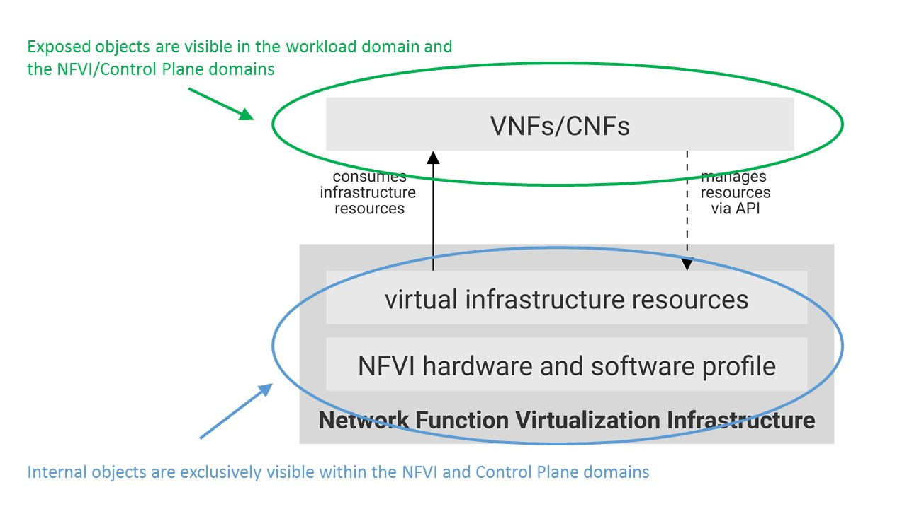
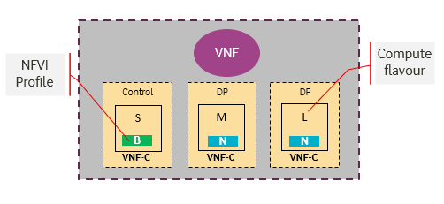
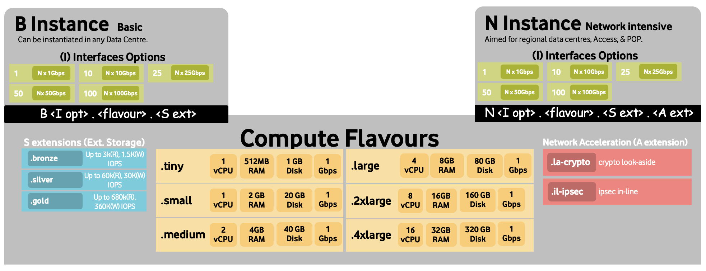

[<< Back](../../ref_model)
# 4 Infrastructure Capabilities, Measurements and Catalogue
<p align="right"></p>


 ______________________________________________________________
## Table of Contents

* [4.1 Capabilities and Performance Measurements](#4.1)
  * [4.1.1 Exposed vs Internal](#4.1.1)
  * [4.1.2 Exposed Infrastructure Capabilities](#4.1.2)
  * [4.1.3 Exposed Infrastructure Measurements](#4.1.3)
  * [4.1.4 Internal Infrastructure Capabilities](#4.1.4)
  * [4.1.5 Internal Infrastructure Measurements](#4.1.5)
  * [4.1.6 VIM Capabilities](#4.1.6)
  * [4.1.7 VIM Measurements](#4.1.7)
* [4.2 Catalogue](#4.2)
  * [4.2.1 Compute Flavours](#4.2.1)
  * [4.2.2 Virtual Network Interface Specifications](#4.2.2)
  * [4.2.3 Storage Extensions](#4.2.3)
  * [4.2.4 Instance Types](#4.2.4)
  * [4.2.5 Instance Capabilities Mapping](#4.2.5)
  * [4.2.6 Instance Measurements Mapping](#4.2.6)
  * [4.2.7 One Stop Shop](#4.2.7)
* [4.3 Networking](#4.2)

<a name="4.1"></a>
## 4.1 Capabilities and Performance Measurements

This section describes and uniquely identifies the Capabilities provided directly by the Infrastructure, as well as Performance Measurements (PMs) generated directly by the Infrastructure (i.e. without the use of external instrumentation).

The Capability and PM identifiers conform to the following schema:

**a.b.c.d** (Ex. "e.nfvi.pm.001")  
a = Scope <(e)xternal | (i)nternal | (t)hird_party_instrumentation>  
b = Functional Area<nfvi | vim>  
c = Type <(cap)ability | (pm)>  
d = Serial Number  

A spreadsheet in the artefact repository maintains the list of assigned identifiers, along with their respective descriptions and and the next available identifier, globally across all chapters of the RM.
> To-Do: Create tracking ss and add link here

<a name="4.1.1"></a>
### 4.1.1 Exposed vs Internal

The following pertains to the context of NFVI Resources, Capabilities and Performance Measurements (PMs) as discussed within this chapter.

<b>Exposed:</b> Refers to any object (e.g., resource discovery/configuration/consumption, platform telemetry, Interface, etc.) that exists in or pertains to, the domain of the NFVI and is made visible (aka “Exposed”) to a VNF. When an object is exposed to a given VNF, the scope of visibility within a given VNF is at the discretion of the specific VNF’s designer. From an Infra perspective, the Infra-resident object is simply being exposed to one or more virtual environments (i.e. Workloads). It is then the responsibility of the kernel or supervisor/executive within the VM to control how, when and where the object is further exposed within the VM, with regard to permissions, security, etc. As the object(s) originate with the Infra, they are by definition visible within that domain.

<b>Internal:</b> Effectively the opposite of Exposed; objects Internal to the NFVI, which are exclusively available for use by the NFVI and components within the NFVI.

<p align="center"></p>
<p align="center"><b>Figure 4-1:</b> Exposed vs. Internal Scope</p>

As illustrated in the figure above, objects designated as "Internal" are only visible within the area inside the blue oval (the NFVI), and only when the entity accessing the object has the appropriate permissions. Whereas objects designated as "Exposed" are potentially visible from both the area within the green oval (the Workload), as well as from within the NFVI, again provided the entity accessing the object has appropriate permissions.

Note: The figure above indicates the areas from where the objects are <i>visible</i>. It is not intended to indicate where the objects are <i>instantiated</i>. For example, the virtual resources are instantiated within the NFVI (the blue area), but are Exposed, and therefore are <i>visible</i> to the Workload, within the green area.

<a name="4.1.2"></a>
### 4.1.2 Exposed Infrastructure Capabilities

This section describes a set of explicit NFVI capabilities and performance measurements that define an NFVI. These capabilities and PMs are well known to VNFs as they provide capabilities which VNFs rely on.

> _**Note**:  It is expected that NFVI capabilities and measurements will expand over time as more capabilities are added and technology enhances and matures._

<a name="4.1.2.1"></a>
#### 4.1.2.1 Exposed Resource Capabilities

**Table 4-1** below shows resource capabilities of NFVI. Those indicate resources offered to VNFs by NFVI.

<a name="Table4-1"></a>

| Ref | NFVI Capability | Unit | Definition/Notes |
|--------------------|----------------------------------------------------|--------|-------------------------------------------------------------------------------|
| e.nfvi.cap.001 | # vCPU | number | Max number of vCPU that can be assigned to a single VNFC |
| e.nfvi.cap.002 | RAM Size | MB | Max memory in MB that can be assigned to a single VNFC by NFVI |
| e.nfvi.cap.003 | Total per-instance (ephemeral) storage | GB | Max storage in GB that can be assigned to a single VNFC by NFVI |
| e.nfvi.cap.004 | # vNICs | number | Max number of vNIC interfaces that can be assigned to a single VNFC by NFVI |
| e.nfvi.cap.005 | Total external (persistent) storage | GB | Max storage in GB that can be attached / mounted to VNFC by NFVI |
<p align="center"><b>Table 4-1:</b> Exposed Resource Capabilities of NFVI</p>

<a name="4.1.2.2"></a>
#### 4.1.2.2 Exposed Performance Optimisation Capabilities

**Table 4-2** shows possible performance optimisation capabilities that can be provided by NFVI. These indicate capabilities exposed to VNFs. These capabilities are to be consumed by VNFs in a standard way.

<a name="Table4-2"></a>

| Ref | NFVI Capability | Unit | Definition/Notes |
|--------------------|---------------------------|--------|--------------------------------------------|
| e.nfvi.cap.006 | CPU core pinning support | Yes/No | Indicates if NFVI supports CPU core pinning |
| e.nfvi.cap.007 | NUMA support | Yes/No | Indicates if NFVI supports NUMA |
| e.nfvi.cap.008 | IPSec Acceleration | Yes/No | IPSec Acceleration |
| e.nfvi.cap.009 | Crypto Acceleration | Yes/No | Crypto Acceleration |
| e.nfvi.cap.010 | Transcoding Acceleration | Yes/No | Transcoding Acceleration |
| e.nfvi.cap.011 | Programmable Acceleration | Yes/No | Programmable Acceleration |
| e.nfvi.cap.012 | Enhanced Cache Management* | Yes/No | If supported, L=Lean; E=Equal; X=eXpanded |

<p align="center"><b>Table 4-2:</b> Exposed Performance Optimisation Capabilities of NFVI</p>

\* L and X cache policies require CPU pinning to be active.

Enhanced Cache Management is a compute performance enhancer that applies a cache management policy to the socket hosting a given virtual compute instance, provided the associated physical CPU microarchitecture supports it. Cache management policy can be used to specify the static allocation of cache resources to cores within a socket. The "Equal" policy distributes the available cache resources equally across all of the physical cores in the socket. The "eXpanded" policy provides additional resources to the core pinned to a VNF that has the "X" attribute applied. The "Lean" attribute can be applied to VNFs which do not realize significant benefit from a marginal cache size increase and are hence willing to relinquish unneeded resources.

In addition to static allocation, an advanced Reference Architecture implementation can implement dynamic cache management control policies, operating with tight (~ms) or standard (10s of seconds) control loop response times, thereby achieving higher overall performance for the socket.

<a name="4.1.2.3"></a>
#### 4.1.2.3 Exposed Monitoring Capabilities

Monitoring capabilities are used for the passive observation of workload-specific traffic traversing the NFVI. As with all capabilities, Monitoring may be unavailable or intentionally disabled for security reasons in a given NFVI instance. If this functionallity is enabled, it must be subject to strict security policies. Refer to the Reference Model Security chapter for additional details.

**Table 4-3** shows possible monitoring capabilities available from the NFVI for VNFs.

<a name="Table4-3"></a>

| Ref | NFVI Capability | Unit | Definition/Notes |
|--------------------|---------------------------|--------|----------------------------------------------------|
| e.nfvi.cap.013 | Monitoring of L2-7 data | Yes/No | Ability to monitor L2-L7 data from workoad |

<p align="center"><b>Table 4-3:</b> Exposed Monitoring Capabilities of NFVI</p>

<a name="4.1.3"></a>
### 4.1.3 Exposed Infrastructure Performance Measurements
The intent of the following PMs is to be available for and well known to VNFs.

<a name="4.1.3.1"></a>
#### 4.1.3.1 Exposed Performance Measurements

The following table of exposed Performance Measurements shows PMs per VNFC, vNIC or vCPU. Network test setups are aligned with ETSI GS NFV-TST 009 [2]. Specifically exposed PMs use a single VNF (PVP) dataplane test setup in a single host.

<a name="Table4-4"></a>

| Ref                | NFVI Measurement               | Unit                | Definition/Notes                                             |
| ------------------ | ------------------------- | ------------------- | ------------------------------------------------------------ |
| e.nfvi.pm.xxx | Place Holder        | Units            | Concise description |

<p align="center"><b>Table 4-4:</b> Exposed Performance Measurements of NFVI</p>


<a name="4.1.4"></a>
### 4.1.4 Internal Infrastructure Capabilities

This section covers a list of implicit NFVI capabilities and measurements that define an NFVI. These capabilities and metrics determine how the NFVI behaves internally. They are hidden from VNFs (i.e. VNFs may not know about them) but they will impact the overall performance and capabilities of a given NFVI solution.

>_**Note**:  It is expected that implicit NFVI capabilities and metrics will evolve with time as more capabilities are added as technology enhances and matures._

<a name="4.1.4.1"></a>
#### 4.1.4.1 Internal Resource Capabilities
**Table 4-5** shows resource capabilities of NFVI. These include capabilities offered to VNFs and resources consumed internally by NFVI.

<a name="Table4-5"></a>

| Ref | NFVI Capability | Unit | Definition/Notes |
|--------------------|---------------------------------------------------------------------------|------------------------|---------------------------------------------------------------------------------------------------------------------|
| i.nfvi.cap.014 | CPU cores consumed by NFVI overhead in a compute node | % (of total available) | Indicates the percentage of cores consumed by NFVI components (including host OS) in a compute node |
| i.nfvi.cap.015 | Memory consumed by NFVI overhead in a compute node | % (of total available) | Indicates the percentage of memory consumed by NFVI components (including host OS) in a compute node |

<p align="center"><b>Table 4-5:</b> Internal Resource Capabilities of NFVI</p>

<!--
/* MXS 13/7/2019 - Mapping table 3-14 is being commented out. If someone can provide supporting details,
   we can put it back. Details should include assumptions (e.g., is it SRIOV, OvS or what?),
   citable references, an explanation of what we're mapping and why (#s represent min? max? anticipated?, etc.),
   and a detailed basis for the values, including an explanation for how come the numbers are identical for both
   cores and ram. Thanks, -Mark */
//
| Ref | B Instance | N Instance | C Instance |
|--------------------|--------------------------|--------------------------|--------------------------|
| `i.nfvi.res.cap.001` | 5-10% | 10-20% | 15-25% |
| `i.nfvi.res.cap.002` | 5-10% | 10-20% | 15-25% |
<p align="center"><b>Table 3-14:</b> Mapping of Internal resource capabilities to NFVI instance types.</p>
//
-->
<a name="4.1.4.2"></a>
#### 4.1.4.2 Internal SLA capabilities

**Table 4-6** below shows SLA (Service Level Agreement) capabilities of NFVI. These include NFVI capabilities required by VNFs as well as required internal to NFVI. Application of these capabilities to a given workload is determined by its instance type (e.g. T-Shirt size).

<a name="Table4-6"></a>

| Ref | NFVI capability | Unit | Definition/Notes |
|--------------------|------------------------------------------|--------|---------------------------------------------------------------------------------------------------------------------|
| i.nfvi.cap.016 | CPU overbooking | 1:N | <definition update scheduled> |
| i.nfvi.cap.017 | vNIC QoS | Yes/No | QoS enablement |

<p align="center"><b>Table 4-6:</b> Internal SLA capabilities to NFVI</p>

<a name="4.1.4.3"></a>
#### 4.1.4.3 Internal Performance Optimisation Capabilities
**Table 4-7** below shows possible performance optimisation capabilities that can be provided by NFVI. These include capabilities exposed to VNFs as well as internal capabilities to NFVI. These capabilities will be determined by the standard instance type used by VNFC

<a name="Table4-7"></a>

| Ref | NFVI capability | Unit | Definition/Notes |
|--------------------|------------------------------------------|--------|----------------------------------------|
| i.nfvi.cap.018 | Huge page support | Yes/No | Indicates if NFVI supports huge pages |

<p align="center"><b>Table 4-7:</b> Internal performance optimisation capabilities of NFVI</p>

<a name="4.1.4.4"></a>
#### 4.1.4.4 Internal Performance Measurement Capabilities

**Table 4-8** shows possible performance measurement capabilities available by NFVI. The availability of these capabilities will be determined by the instance type used by the workloads.

<a name="Table4-8"></a>

| Ref | NFVI Measurement | Unit | Definition/Notes |
|--------------------|-------------------------------------------|--------|----------------------------------------------------------------------------------------------------------------------------------------------------------------------------------------------------------------|
| i.nfvi.pm.001 | Host CPU usage |  | Per Compute node. It needs to Maps to ETSI NFV-TST 008[1] clause 6, processor usage metric (NFVI exposed to VIM) and ETSI NFV-IFA 027 Mean Virtual CPU usage and Peak Virtual CPU usage (VIM exposed to VNFM). |
| i.nfvi.pm.002 | Virtual compute resource CPU usage |  | QoS enablement |
| i.nfvi.pm.003 | Host CPU utilization |  | Per Compute node. It needs to map to ETSI NFV-IFA 027 Mean Virtual CPU usage and Peak Virtual CPU usage (VIM, exposed to VNFM). |
| i.nfvi.pm.004 | Virtual compute resource CPU utilization |  | Range (min, max) per VNFC |
| i.nfvi.pm.005 | Measurement of external storage IOPs | Yes/No |  |
| i.nfvi.pm.006 | Measurement of external storage throughput | Yes/No |  |
| i.nfvi.pm.007 | Available external storage capacity | Yes/No |  |

<p align="center"><b>Table 4-8:</b> Internal Measurement Capabilities of NFVI</p>

<a name="4.1.4.5"></a>
#### 4.1.4.5 Internal Security Capabilities

Security content has been relocated to the Security chapter (RM Chapter 7).

Table 4-9: Reserved

<!--
<a name="Table4-9"></a>
-->

<a name="4.1.5"></a>
### 4.1.5 Internal Infrastructure Performance Measurements
<!--
[COMMENT - Xavier Grall, Orange: section "3.4.2.3 Internal SLA metrics" is removed since it is redundant with network performance metrics]
//
[COMMENT - Xavier Grall, Orange: section "3.4.2.4 Internal scalability metrics" is removed since it is redundant with resource management metrics]
-->
<a name="4.1.5.1"></a>
#### 4.1.5.1 Internal Performance Measurements
<!--
[COMMENT - Xavier Grall, Orange: the mapping table is removed since those reference values will depend on architecture and implementation, and/or may be derived for different cases (eg w/ or w/o filtering rules for network throughput) ]
-->

The following table of internal Performance Measurements shows PMs per NFVI node. Network test setups are aligned with ETSI GS NFV-TST 009 [2]. Specifically internal performance metrics use a baseline (Phy2Phy) dataplane test setup in a single host.

<a name="Table4-10"></a>

| Ref | NFVI Measurement | Unit | Definition/Notes |
|--------------------|------------------------------------------------------|----------------|----------------------------------------------------------------------|
| i.nfvi.pm.xxx | Place Holder | Units | Concise Description |

<p align="center"><b>Table 4-10:</b> Internal Performance Measurements of NFVI</p>

<a name="4.1.5.2"></a>
#### 4.1.5.2 Internal Availability/Reliability Measurements

<!-- Xavier Grall, Orange -->
_**Editor Note:** the following table should be reviewed to only consider and probably detail the recovery-related PMs; indeed, availability and MTBF PMs do not seem consistent with expected testbed measurement duration]_

<!--
[COMMENT - Xavier Grall, Orange: the mapping table is removed since those reference values will depend on reference architecture and implementation]
-->

<!-- MXS - 13/7/2019 To-do -->
_**Editor Note:** This table needs to be reworked and clarified w/ clear explanations and assumptions stated._

<a name="Table4-11"></a>

| Ref | NFVI Measurement | Unit | Definition/Notes |
|--------------------|------------------|---------|-------------------------------------------|
| i.nfvi.pm.008 | Availability | % |  |
| i.nfvi.pm.009 | MTBF single node | days | Mean Time between Failure for single node |
| i.nfvi.pm.010 | MTBF AZ | days | Mean Time between Failure for an   AZ |
| i.nfvi.pm.011 | Recovery time | seconds |  |

<p align="center"><b>Table 4-11:</b> Internal availability/reliability metrics of NFVI</p>

<a name="4.1.6"></a>
### 4.1.6 VIM Capabilities.

VIM is responsible for controlling and managing the NFVI compute, storage and network resources. Resources allocation is dynamically set up upon VNFs requirements. This section covers the list of capabilities offered by the VIM to VNFs or service orchestrator.

Table 4-12 shows capabilities related to resources allocation

<a name="Table4-12"></a>

| Ref | VIM Capability | Unit | Definition/Notes |
|--------------------|------------------|---------|-------------------------------------------|
| e.vim.cap.001 | Virtual Compute allocation | Yes/No | Capability to allocate virtual compute resources  to VNFC |
| e.vim.cap.002 | Virtual Storage allocation | Yes/No | Capability to allocate virtual storage resources  to VNFC |
| e.vim.cap.003 | Virtual Networking resources allocation | Yes/No | Capability to allocate virtual networking resources  to VNFC |
| e.vim.cap.004 | Multi-tenant isolation | Yes/No | Capability to isolate resources between tenants |
| e.vim.cap.005 | Images management | Yes/No | Capability to manage VNFC software images |

<p align="center"><b>Table 4-12:</b> VIM Resource Allocation Capabilities</p>


Table 4-13 Shows performance measurement capabiltities

<a name="Table4-13"></a>

| Ref | VIM Capability | Unit | Definition/Notes |
|--------------------|------------------|---------|-------------------------------------------|
| e.vim.cap.006 | Virtual resources inventory per tenant | Yes/No | Capability to provide information related to allocated virtualised resources per tenant |
| e.vim.cap.007 | Resources Monitoring | Yes/No | Capability to notify state changes of allocated resources |
| e.vim.cap.008 | Virtual resources Performance  | Yes/No | Capability to collect and expose performance information on virtualised resources allocated |
| e.vim.cap.009 | Virtual resources Fault information | Yes/No | Capability to collect and notify fault information on virtualised resources |

<p align="center"><b>Table 4-13:</b> VIM Resource Performance Measurement Capabilities</p>

Table 4-14: Reserved

<!--
<a name="Table4-14"></a>
-->


<a name="4.1.7"></a>
### 4.1.7 VIM Performance Measurements

<a name="4.1.7.1"></a>
#### 4.1.7.1 Resources Management Measurements
**Table 4-15** shows resource management measurements of VIM as aligned with ETSI GS NFV TST-012 [3].

<a name="Table4-15"></a>

| Ref | VIM Measurement | Unit | Definition/Notes |
|--------------------|------------------------------------------------------|--------|------------------------------------------------------------------|
| e.vim.pm.001 | Time to create Virtual Compute for a given VNF | Max ms |  |
| e.vim.pm.002 | Time to delete Virtual Compute of a given VNF | Max ms |  |
| e.vim.pm.003 | Time to start Virtual Compute of a given VNF | Max ms |  |
| e.vim.pm.004 | Time to stop Virtual Compute of a given VNF | Max ms |  |
| e.vim.pm.005 | Time to pause Virtual Compute of a given VNF | Max ms |  |
| e.vim.pm.006 | Time to create internal virtual network | Max ms |  |
| e.vim.pm.007 | Time to delete internal virtual network | Max ms |  |
| e.vim.pm.008 | Time to update internal virtual network | Max ms |  |
| e.vim.pm.009 | Time to create external virtual network | Max ms |  |
| e.vim.pm.010 | Time to delete external virtual network | Max ms |  |
| e.vim.pm.011 | Time to update external virtual   network | Max ms |  |
| e.vim.pm.012 | Time to create external storage ready for use by VNF | Max ms |  |

<p align="center"><b>Table 4-15:</b> VIM Resource Management Measurements</p>

<a name="4.1"></a>
## 4.2 Infrastructure Profiles Catalogue

Infrastructure exposes compute Flavours with options, virtual interface options, storage extensions, and acceleration extensions to VNFs. These NFVI Profiles are offered to VNFs in the form of infrastructure instance types with their corresponding options and extensions.

The idea of the infrastructure profiles catalogue is to have a predefined set of instance types with a predefined set of compute Flavours (sometimes referred to as T-shirt sizes) which VNF vendors use to build their VNFs. Each VNF uses one or more compute Flavour (with one or more of offered instance types) to build its overall functionality as illustrated in **Figure 4-2**.

<p align="center"></p>
<p align="center"><b>Figure 4-2:</b> VNFs built against standard instance types and compute Flavours.</p>

<a name="4.2.1"></a>
### 4.2.1 Compute Flavours

Compute Flavours represent the compute, memory, storage, and management network resource templates that are used by VMs on the compute hosts. Each VM is given a compute Flavour (resource template), which determines the VMs compute, memory and storage characteristics.

Compute Flavours can also specify secondary ephemeral storage, swap disk, etc. A compute Flavour geometry consists of the following elements:

Element |Description
--------|----------
Compute Flavour Name |A descriptive name
Virtual compute resources (aka vCPUs) |Number of virtual compute resources (vCPUs) presented to the VM instance.
Memory |Virtual compute instance memory in megabytes.
Ephemeral/Local Disk |Specifies the size of an ephemeral data disk that exists only for the life of the instance. Default value is 0.<br />The ephemeral disk may be partitioned into boot (base image) and swap space disks.
Management Interface |Specifies the bandwidth of management interface/s

<p align="center"><b>Table 4-16:</b> Compute Flavour Geometry Specification.</p>

<a name="4.2.1.1"></a>
#### 4.2.1.1 Predefined Compute Flavours
The intent of the following Flavours list is to be comprehensive and yet effective to cover both IT and NFV workloads. The compute Flavours are specified relative to the “large” Flavour. The “large” Flavour configuration consists of 4 vCPUs, 8 GB of RAM and 80 GB of local disk, and the resulting instance will have a management interface of 1 Gbps. The “medium” Flavour is half the size of a large and small is half the size of medium. The tiny Flavour is a special sized Flavour.

>_*Note:*_ Customised (Parameterized) Flavours can be used in concession by operators and , if needed, are  created using TOSCA, HEAT templates and/or VIM APIs.

.conf |vCPU ("c") |RAM ("r") |Local Disk ("d") | Management Interface
-----|------------|----------|-----|-----
.tiny |1 |512 MB |1 GB |1 Gbps
.small |1 |2 GB |20 GB  |1 Gbps
.medium |2 |4 GB |40 GB |1 Gbps
.large |4 |8 GB |80 GB |1 Gbps
.2xlarge* |8 |16 GB |160 GB |1 Gbps
.4xlarge* |16 |32 GB |320 GB |1 Gbps

<p align="center"><b>Table 4-17:</b> Predefined Compute Flavours.</p>

> _*These compute Flavours are intended to be used for transitional purposes and VNF vendors are expected to consume smaller Flavours and adopt microservices-based designs for their VNFs_

<a name="4.2.2"></a>
### 4.2.2 Virtual Network Interface Specifications


The virtual network interface specifications extend a Flavour customization with network interface(s), with an associated bandwidth, and are identified by the literal, “n”, followed by the interface bandwidth (in Gbps). Multiple network interfaces can be specified by repeating the “n” option.

Virtual interfaces may be of an Access type, and thereby untagged, or may be of a Trunk type, with one or more 802.1Q tagged logical interfaces. Note, tagged interfaces are encapsulated by the Overlay, such that tenant isolation (i.e. security) is maintained, irrespective of the tag value(s) applied by the VNF.  

Note, the number of virtual network interfaces, aka vNICs, associated with an instance of a virtual environment, is directly related to the number of vNIC extensions declared for the environment. The vNIC extension is not part of the base Flavour.
```
<network interface bandwidth option> :: <”n”><number (bandwidth in Gbps)>
```

Virtual Network Interface Option |Interface Bandwidth
---|---
n1, n2, n3, n4, n5, n6 |1, 2, 3, 4, 5, 6 Gbps
n10, n20, n30, n40, n50, n60 |10, 20, 30, 40, 50, 60 Gbps
n25, n50, n75, n100, n125, n150 |25, 50, 75, 100, 125, 150 Gbps
n50, n100, n150, n200, n250, n300 |50, 100, 150, 200, 250, 300 Gbps
n100, n200, n300, n400, n500, n600 |100, 200, 300, 400, 500, 600 Gbps

<p align="center"><b>Table 4-18:</b> Virtual Network Interface Specification Examples</p>

<a name="4.2.3"></a>
###  4.2.3 Storage Extensions

Multiple persistent storage extensions can be attached to virtual compute instances for data storage. Each extension can be configured with the required performance category.

.conf |Read IO/s |Write IO/s Read |Throughput (MB/s) |Write Throughput (MB/s)
---|---|---|---|---
.bronze |Up to 3K |Up to 15K |Up to 180 |Up to 120
.silver |Up to 60K |Up to 30K |Up to 1200 |Up to 400
.gold |Up to 680K |Up to 360K |Up to 2650 |Up to 1400

<p align="center"><b>Table 4-19:</b> Storage Performance Profiles</p>

Note, performance is based on a block size of 256KB or larger.

<a name="4.2.3.1"></a>

#### 4.2.3.1 Available Storage Extensions
The following table defines persistent storage extensions that can be provided to VNFs for data storage. More than one storage extension can be provided to a single VNFC. The option selected determines both the size and the performance of the extension.

| .conf | capacity | Read IOPS | Write IOPS | Read Throughput (MB/s) | Write Throughput (MB/s) |
|----------|----------|------------|------------|------------------------|-------------------------|
| .bronze1 | 100GB | Up to 3K | Up to 15K | Up to 180 | Up to 120 |
| .bronze2 | 200GB | Up to 3K | Up to 15K | Up to 180 | Up to 120 |
| .bronze3 | 300GB | Up to 3K | Up to 15K | Up to 180 | Up to 120 |
| .silver1 | 100GB | Up to 60K | Up to 30K | Up to 1200 | Up to 400 |
| .silver2 | 200GB | Up to 60K | Up to 30K | Up to 1200 | Up to 400 |
| .silver3 | 300GB | Up to 60K | Up to 30K | Up to 1200 | Up to 400 |
| .gold1 | 100GB | Up to 680K | Up to 360K | Up to 2650 | Up to 1400 |
| .gold2 | 200GB | Up to 680K | Up to 360K | Up to 2650 | Up to 1400 |
| .gold3 | 300GB | Up to 680K | Up to 360K | Up to 2650 | Up to 1400 |

<p align="center"><b>Table 4-20:</b> Storage Extension Options</p>

<a name="4.2.4"></a>
### 4.2.4 Instance types

<a name="4.2.4.1"></a>
#### 4.2.4.1 B Instances (Basic)
This instance type is intended to be used for both IT workloads as well as NFV workloads. It has limited IO capabilities (up to 10Gbps Network interface) with a wide range of compute Flavours. This instance type is intended to be available in any data centre within any operator's network.

<a name="4.2.4.2"></a>
#### 4.2.4.2 N Instances (Network Intensive)
This instance type is intended to be used for those applications that has high network throughput requirements (up to 50Gbps). This instance type is more intended for VNFs and is expected to be available in regional (distributed) data centres and more towards the access networks.

##### 4.2.4.2.1 Network Acceleration Extensions
N instance types can come with Network Acceleration extensions to assist VNFs offloading some of their network intensive operations to hardware. The list below is preliminary and is expected to grow as more network acceleration resources are developed and standardized.
>_Interface types are aligned with ETSI NFV IFA 002 [4]._

| .conf | Interface type | Description |
|------------|----------------|-----------------------------------------|
| .il-ipsec | virtio-ipsec* | In-line IPSec acceleration |
| .la-crypto | virtio-crypto | Look-Aside encryption/decryption engine |

<p align="center"><b>Table 4-21:</b> Acceleration Extensions for N Instance Type</p>

> _*Need to work with relevant open source communities to create missing interfaces._

<a name="4.2.4.3"></a>
#### 4.2.4.3 C Instances (Compute Intensive)
This instance type is intended to be used for those applications that has high compute requirements and can take advantage of acceleration technologies such as GPU, FPGA, etc. This instance type is intended to be available in local data centers and more towards the Edge of the network.

##### 4.2.4.3.1 Compute Acceleration Extensions
C instance types can come with compute acceleration extensions to assist VNFs/VAs offloading some of their compute intensive operations to hardware. The list below is preliminary and is expected to grow as more compute acceleration resources are developed and standardized.

| .conf | Interface type | Description |
|------------|----------------|-----------------------------------------|
| .la-trans | virtio-trans* | Look-Aside Transcoding acceleration |
| .la-programmable | virtio-programmable | Look-Aside programmable acceleration |

<p align="center"><b>Table 4-22:</b> Acceleration Extensions for C Instance Type</p>

> _*Need to work with relevant open source communities to create missing interfaces._

<a name="4.2.4.4"></a>
#### 4.2.4.4 Network Interface Options
**Table 4-23** below shows the various network interface extension bandwidth options (from **Table 4-18**) available for each profile type (Up to 6 extensions (i.e. interfaces) may be associated with a virtual compute instance).

| Virtual Interface Option* | Basic Type | Network Intensive Type | Compute Intensive Type
|---------------------------|-----|-----|-----
n1, n2, n3, n4, n5, n6 | Y | N |N
n10, n20, n30, n40, n50, n60 | Y | Y | Y
n25, n50, n75, n100, n125, n150 | N | Y | Y
n50, n100, n150, n200, n250, n300 | N | Y | Y
n100, n200, n300, n400, n500, n600 | N | Y | N

<p align="center"><b>Table 4-23:</b> Virtual NIC Interfaces Options</p>

> _*VNFs are expected to use the minimum number of interfaces and adopt Microservice design principles._

<a name="4.2.5"></a>
### 4.2.5 Instance Capabilities Mapping

| Ref | B Instance | N Instance | C Instance | Notes |
|----------------------|----------------------------|----------------------------|----------------------------|-------|
| `e.nfvi.res.cap.001`<br />(#vCPU cores) | Per selected  \<Flavour> | Per selected  \<Flavour> | Per selected  \<Flavour> | Exposed resource capabilities as per [**Table 4-1**](#Table4-1)|
| `e.nfvi.res.cap.002`<br />(Amount of RAM (MB)) | Per selected  \<Flavour> | Per selected  \<Flavour> | Per selected  \<Flavour> |  |
| `e.nfvi.res.cap.003`<br />(Total instance (ephemeral) storage (GB)) | Per selected  \<Flavour> | Per selected  \<Flavour> | Per selected  \<Flavour> |  |
| `e.nfvi.res.cap.004`<br />(# vNICs) | Per selected  <I Opt> | Per selected  <I Opt> | Per selected  <I Opt> |  |
| `e.nfvi.res.cap.005`<br />(Total instance (persistent) storage (GB)) | Per selected  <S Ext> | Per selected  <S Ext> | Per selected  <S Ext> |  |
| `e.nfvi.per.cap.001`<br />(CPU pinning support) | No | Yes | Yes | Exposed performance capabilities as per [**Table 4-2**](#Table4-2) |
| `e.nfvi.per.cap.002`<br />(NUMA support) | No | Yes | Yes | |
| `e.nfvi.per.cap.003`<br />(IPSec Acceleration) | No | Yes (if offered) | No | |
| `e.nfvi.per.cap.004`<br />(Crypto Acceleration) | No | Yes (if offered) | No | |
| `e.nfvi.per.cap.005`<br />(Transcoding Acceleration) | No | No | Yes (if offered) | |
| `e.nfvi.per.cap.006`<br />(Programmable Acceleration) | No | No | Yes (if offered) | |
| `e.nfvi.per.cap.007`<br />(Enhanced Cache Management) | E | E | X (if offered) | |
| `e.nfvi.mon.cap.001`<br />(Monitoring of L2-7 data) | No | Yes | No | Exposed monitoring capabilities as per [**Table 4-3**](#Table4-3) |
| `i.nfvi.sla.cap.001`<br />(CPU overbooking) | 1:4 | 1:1 | 1:1 | Internal SLA capabilities as per [**Table 4-6**.](#Table4-6) |
| `i.nfvi.sla.cap.002`<br />(vNIC QoS) | No | Yes | Yes | |
| `i.nfvi.per.cap.001`<br />(Huge page support) | No | Yes | Yes | Internal performance capabilities as per [**Table 4-7**](#Table4-7) |
| `i.nfvi.mon.cap.001`<br />(Host CPU usage) | Yes | Yes | Yes | Internal monitoring capabilities as per [**Table 4-8**](#Table4-8) |
| `i.nfvi.mon.cap.002`<br />(Virtual compute CPU usage) | Yes | Yes | Yes | |
| `i.nfvi.mon.cap.003`<br />(Host CPU utilization) | Yes | Yes | Yes | |
| `i.nfvi.mon.cap.004`<br />(Virtual compute CPU utilization) | Yes | Yes | Yes | |
| `i.nfvi.mon.cap.007`<br />(External storage capacity) | No | No | Yes | |


<p align="center"><b>Table 4-24:</b> Mapping of NFVI Capabilities to Instance Types</p>

<a name="4.2.6"></a>
### 4.2.6 Instance Performance Measurement Mapping

_**Comment:** To be worked on._

<a name="4.2.7"></a>
### 4.2.7 One stop shop

<a name="4.2.7.1"></a>
#### 4.2.7.1 Naming convention
An entry in the infrastructure profile catalogue can be referenced using the following naming convention.

`B/N/C <I opt> . <Flavour> . <S ext> . <A ext>`

Whereas:
- **B/N/C**: specifies the instance type (Basic, Network Intensive, and Compute Intensive)
- **\<I opt>**: specifies the interface option of the instant.
- **\<Flavour>**: specifies the compute Flavour.
- **\<S ext>**: specifies an optional storage extension.
- **\<A ext>**: specifies an optional acceleration extension for either N or H instance types.

<p align="center"></p>
<p align="center"><b>Figure 4-3:</b> Infrastructure Instances Catalogue</p>

<a name="4.3"></a>
## 4.3 Networking

This is a placeholder for NFVI infrastructure networking information that is common to all Reference Architectures.


## 4.4 Key Terminology, Definitions and Glossary (temporary)

This section is temporary while the team defines and aligns on key terms used in this chapter. When finalized, these definitions will be moved to the RM glossary appendix.

- **PM / Performance Measurement / Measurement:** The procedure or set of operations having the object of determining a Measured Value or Measurement Result. In this context, PMs reflect data generated and collected within the NFVI, that reflects the performance of the infrastructure. For example, a count of frames or packets traversing an interface, memory usage information, other resource usage and availability, etc. These data may be instantaneous or accumulated, and made available (i.e. exposed) based on permissions and contexts (e.g., workload vs. infra)

- **Monitoring (Capability):** Monitoring capabilities are used for the passive observation of workload-specific traffic traversing the NFVI. Note, as with all capabilities, Monitoring may be unavailable or intentionally disabled for security reasons in a given NFVI instance. 

- PVP: Physical-Virtual-Physical; PVP represents a Workload test topology where a measurement is taken across two physical test points (e.g., physical NICs on a host), with traffic traversing a virtualized Workload that is logically connected between the physical points. PVP is an ETSI term, defined in ETSI NFV-TST009

<!--
The following draft definition placeholders are in support of the new PM schema/description. They are currently commented out as alignment discussions are in progress. They are to be published when their language is finalized. -MXS
//
- Virtual Resources (aka “Resources”): Abstracted and isolated portions of physical resources, furnished to virtual environments such as VMs and containers. The most common examples of Virtual Resources include compute, storage and network.
//
- **Capabilities:** Potential ability of the infrastructure to furnish something, frequently a Resource, but potentially a feature or datum, to another entity. Capabilities in CNTT are divided into the following categories:
-	**(R)**esource: Compute (RAM/CPU), Storage, Network, etc.
-	**(F)**eature: NUMA, Acceleration, SMT, etc.
-	**(D)**ata: Describing attributes of the infrastructure, such as constraints, limits, etc.
//
- - **Resources and Features:** In the context of Capabilities, describes active aspects of infrastructure, which are directly applied to the task of operating a Workload. For example, some portion of the RAM Resource is applied to a given Workload, which in-turn will use it to store runtime data. Similarly, a Feature such as NUMA may be utilized by a Workload, to ensure the Workload’s access to the Workload’s RAM at runtime is as efficient as possible.
//
- - **Data:** Is passive and used to describe static aspects of the infrastructure, which may be determined at design time or otherwise in advance of runtime. For example, a Capability datum can represent the maximum number of virtual CPU cores a single VM can be allocated. The absolute maximum value for this Capability is determined by the physical CPU’s SKU, however, the value may be lowered arbitrarily by the infrastructure designer, to achieve various business or technical  objectives. In either case, the value is known before power is applied to the system, and does not change at run-time.
-->
