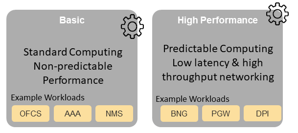
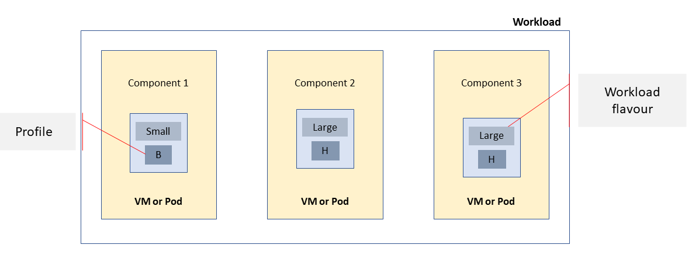

Infrastructure Capabilities, Measurements and Catalogue
=======================================================

Capabilities and Performance Measurements
-----------------------------------------

This section describes the Capabilities provided by the Cloud Infrastructure, and the Performance Measurements (PMs) generated by the Cloud Infrastructure (i.e., without the use of external instrumentation).

The Capability and PM identifiers conform to the following schema:

| **a.b.c** (E.g., "e.pm.001")
| a = Scope <(e)xternal \| (i)nternal \| (t)hird_party_instrumentation>
| b = Type <(cap) capability \| (man) management \| (pm) performance \| (man-pm)>
| c = Serial Number

Exposed vs Internal
~~~~~~~~~~~~~~~~~~~

The following definitions specify the context of the Cloud Infrastructure Resources, Capabilities and Performance Measurements (PMs).

**Exposed:** Refers to any object (e.g., resource discovery/configuration/consumption, platform telemetry, interface, etc.) that exists in or pertains to, the domain of the Cloud Infrastructure and is made visible (aka “Exposed”) to a workload. When an object is exposed to a given workload, the scope of visibility within a given workload is at the discretion of the workload’s designer. From an infrastructure perspective, the Infra-resident object is simply being exposed to one or more virtual environments (i.e., workloads). It is the responsibility of the kernel or supervisor/executive within the resource instance (VM or container) to control how, when and where the object is further exposed within the resource instance, with regard to permissions, security, etc. An object(s) is by definition visible within its domain of origin.

**Internal:** Effectively the opposite of Exposed; objects are exclusively available for use within the Cloud Infrastructure.

.. :name: Exposed vs. Internal Scope
.. figure:: ../figures/Exposed_vs_Internal_Diagram.png
   :alt: "Exposed vs. Internal Scope"

   Exposed vs. Internal Scope

As illustrated in the figure above, objects designated as "Internal" are only visible within the area inside the blue oval (the Cloud Infrastructure), and only when the entity accessing the object has the appropriate permissions. Whereas objects designated as "Exposed" are potentially visible from both the area within the green oval (the Workloads), as well as from within the Cloud Infrastructure, again provided the entity accessing the object has appropriate permissions.

Note: The figure above indicates the areas from where the objects are *visible*. It is not intended to indicate where the objects are *instantiated*. For example, the virtual resources are instantiated within the Cloud Infrastructure (the blue area), but are Exposed, and therefore are *visible* to the Workloads, within the green area.

Exposed Infrastructure Capabilities
~~~~~~~~~~~~~~~~~~~~~~~~~~~~~~~~~~~

This section describes a set of exposed Cloud Infrastructure capabilities and performance measurements. These capabilities and PMs are well known to workloads as they provide capabilities which workloads rely on.

   **Note**\ *: It is expected that Cloud Infrastructure capabilities and measurements will expand over time as more capabilities are added and technology enhances and matures.*

Exposed Resource Capabilities
^^^^^^^^^^^^^^^^^^^^^^^^^^^^^

**Table 4-1** below shows resource capabilities of the Cloud Infrastructure available to workloads.

========= ====================================== ====== ======================================================================================================
Ref       Cloud Infrastructure Capability        Unit   Definition/Notes
========= ====================================== ====== ======================================================================================================
e.cap.001 # vCPU                                 number Max number of vCPUs that can be assigned to a single VM or Pod (1)
e.cap.002 RAM Size                               MB     Max memory in MB that can be assigned to a single VM or Pod by the Cloud Infrastructure (2)
e.cap.003 Total per-instance (ephemeral) storage GB     Max storage in GB that can be assigned to a single VM or Pod by the Cloud Infrastructure
e.cap.004 # Connection points                    number Max number of connection points that can be assigned to a single VM or Pod by the Cloud Infrastructure
e.cap.005 Total external (persistent) storage    GB     Max storage in GB that can be attached/mounted to VM or Pod by the Cloud Infrastructure
========= ====================================== ====== ======================================================================================================

**Table 4-1:** Exposed Resource Capabilities of Cloud Infrastructure

1. In a Kubernetes based environment this means the CPU limit of a pod.
2. In a Kubernetes based environment this means the memory limit of a pod.

Exposed Performance Optimisation Capabilities
^^^^^^^^^^^^^^^^^^^^^^^^^^^^^^^^^^^^^^^^^^^^^

**Table 4-2** lists performance optimisation capabilities exposed to workloads by the Cloud Infrastructure.

========= =============================== ====== ================================================================================================================
Ref       Cloud Infrastructure Capability Unit   Definition/Notes
========= =============================== ====== ================================================================================================================
e.cap.006 CPU pinning                     Yes/No Indicates if Cloud Infrastructure supports CPU pinning
e.cap.007 NUMA alignment                  Yes/No Indicates if Cloud Infrastructure supports NUMA alignment
e.cap.008 IPSec Acceleration              Yes/No IPSec Acceleration
e.cap.009 Crypto Acceleration             Yes/No Crypto Acceleration
e.cap.010 Transcoding Acceleration        Yes/No Transcoding Acceleration
e.cap.011 Programmable Acceleration       Yes/No Programmable Acceleration
e.cap.012 Enhanced Cache Management       Yes/No If supported, L=Lean; E=Equal; X=eXpanded. L and X cache policies require CPU pinning to be active
e.cap.013 SR-IOV over PCI-PT              Yes/No Traditional SR-IOV. These Capabilities generally require hardware-dependent drivers be injected into workloads
e.cap.014 GPU/NPU                         Yes/No Hardware coprocessor. These Capabilities generally require hardware-dependent drivers be injected into workloads
e.cap.015 SmartNIC                        Yes/No Network Acceleration
e.cap.016 FPGA/other Acceleration HW      Yes/No These Capabilities generally require hardware-dependent drivers be injected into workloads
e.cap.023 Huge pages                      Yes/No Indicates if the Cloud Infrastructure supports huge pages
e.cap.024 CPU allocation ratio            Yes/No N:1: Number of virtual cores per physical core; also known as CPU overbooking ratio
========= =============================== ====== ================================================================================================================

**Table 4-2:** Exposed Performance Optimisation Capabilities of Cloud Infrastructure

Enhanced Cache Management is a compute performance enhancer that applies a cache management policy to the socket hosting a given virtual compute instance, provided the associated physical CPU microarchitecture supports it. Cache management policy can be used to specify the static allocation of cache resources to cores within a socket. The "Equal" policy distributes the available cache resources equally across all of the physical cores in the socket. The "eXpanded" policy provides additional resources to the core pinned to a workload that has the "X" attribute applied. The "Lean" attribute can be applied to workloads which do not realise significant benefit from a marginal cache size increase and are hence willing to relinquish unneeded resources.

In addition to static allocation, an advanced Reference Architecture implementation can implement dynamic cache management control policies, operating with tight (~ms) or standard (10s of seconds) control loop response times, thereby achieving higher overall performance for the socket.

Exposed Monitoring Capabilities
^^^^^^^^^^^^^^^^^^^^^^^^^^^^^^^

Monitoring capabilities are used for the passive observation of workload-specific traffic traversing the Cloud Infrastructure. As with all capabilities, Monitoring may be unavailable or intentionally disabled for security reasons in a given Cloud Infrastructure deployment. If this functionality is enabled, it must be subject to strict security policies. Refer to the Reference Model Security chapter for additional details.

**Table 4-3** shows possible monitoring capabilities available from the Cloud Infrastructure for workloads.

========= =============================== ====== ===========================================
Ref       Cloud Infrastructure Capability Unit   Definition/Notes
========= =============================== ====== ===========================================
e.cap.017 Monitoring of L2-7 data         Yes/No Ability to monitor L2-L7 data from workload
========= =============================== ====== ===========================================

**Table 4-3:** Exposed Monitoring Capabilities of Cloud Infrastructure

.. Exposed Infrastructure Performance Measurements
.. ~~~~~~~~~~~~~~~~~~~~~~~~~~~~~~~~~~~~~~~~~~~~~~~

.. The intent of the following PMs is to be available for and well known to workloads.

.. Exposed Performance Measurements
.. ^^^^^^^^^^^^^^^^^^^^^^^^^^^^^^^^

.. The following table of exposed Performance Measurements shows PMs per VM or Pod, vNIC or vCPU. Network test setups are aligned with ETSI GS NFV-TST 009 [14]. Specifically exposed PMs use a single workload (PVP) dataplane test setup in a single host.

.. ======== ================================ ===== ===================
.. Ref      Cloud Infrastructure Measurement Unit  Definition/Notes
.. ======== ================================ ===== ===================
.. e.pm.xxx Place Holder                     Units Concise description
.. ======== ================================ ===== ===================

.. **Table 4-4:** Exposed Performance Measurements of Cloud Infrastructure

**Table 4-4:** Place holder

Internal Infrastructure Capabilities
~~~~~~~~~~~~~~~~~~~~~~~~~~~~~~~~~~~~

This section covers a list of implicit Cloud Infrastructure capabilities and measurements. These capabilities and metrics are hidden from workloads (i.e., workloads may not know about them) but they will impact the overall performance and capabilities of a given Cloud Infrastructure solution.

   **Note**\ *: It is expected that implicit Cloud Infrastructure capabilities and metrics will evolve with time as more capabilities are added as technology enhances and matures.*

Internal Resource Capabilities
^^^^^^^^^^^^^^^^^^^^^^^^^^^^^^

**Table 4-5** shows resource capabilities of Cloud Infrastructure. These include capabilities offered to workloads and resources consumed internally by Cloud Infrastructure.

========= ================================================================================== ==== ==========================================================================================================================================================================
Ref       Cloud Infrastructure Capability                                                    Unit Definition/Notes
========= ================================================================================== ==== ==========================================================================================================================================================================
i.cap.014 CPU cores consumed by the Cloud Infrastructure overhead on a worker (compute) node %    The ratio of cores consumed by the Cloud Infrastructure components (including host OS) in a compute node to the total number of cores available expressed as a percentage
i.cap.015 Memory consumed by the Cloud Infrastructure overhead on a worker (compute) node    %    The ratio of memory consumed by the Cloud Infrastructure components (including host OS) in a worker (compute) node to the total available memory expressed as a percentage
========= ================================================================================== ==== ==========================================================================================================================================================================

**Table 4-5:** Internal Resource Capabilities of Cloud Infrastructure

Internal SLA capabilities
^^^^^^^^^^^^^^^^^^^^^^^^^

**Table 4-6** below shows SLA (Service Level Agreement) capabilities of Cloud Infrastructure. These include Cloud Infrastructure capabilities required by workloads as well as required internal to Cloud Infrastructure. Application of these capabilities to a given workload is determined by its Cloud Infrastructure Profile.

========= =============================== ====== ==============================================================================
Ref       Cloud Infrastructure capability Unit   Definition/Notes
========= =============================== ====== ==============================================================================
i.cap.017 Connection point QoS            Yes/No QoS enablement of the connection point (vNIC or interface)
========= =============================== ====== ==============================================================================

**Table 4-6:** Internal SLA capabilities to Cloud Infrastructure

.. Internal Performance Optimisation Capabilities
.. ^^^^^^^^^^^^^^^^^^^^^^^^^^^^^^^^^^^^^^^^^^^^^^

.. **Table 4-7** below shows possible performance optimisation capabilities that can be provided by the Cloud Infrastructure. These include capabilities exposed to workloads as well as internal capabilities to Cloud Infrastructure. These capabilities will be determined by the Cloud Infrastructure Profile used by the Cloud Infrastructure.

.. ========= =============================== ====== =========================================================
.. Ref       Cloud Infrastructure capability Unit   Definition/Notes
.. ========= =============================== ====== =========================================================
.. i.cap.018 Huge pages                      Yes/No Indicates if the Cloud Infrastructure supports huge pages
.. ========= =============================== ====== =========================================================

.. **Table 4-7:** Internal performance optimisation capabilities of Cloud Infrastructure

Internal Performance Measurement Capabilities
^^^^^^^^^^^^^^^^^^^^^^^^^^^^^^^^^^^^^^^^^^^^^

**Table 4-8** shows possible performance measurement capabilities for the Cloud Infrastructure. The availability of these capabilities will be determined by the Cloud Infrastructure Profile used by the workloads.

======== =========================================== =========== =============================================================================================================================
Ref      Cloud Infrastructure Measurement            Unit        Definition/Notes
======== =========================================== =========== =============================================================================================================================
i.pm.001 Host CPU usage                              nanoseconds Per Compute node. It maps to ETSI GS NFV-TST 008 V3.2.1 [5] clause 6, processor usage metric (Cloud Infrastructure internal).
i.pm.002 Virtual compute resource (vCPU) usage       nanoseconds Per VM or Pod. It maps to ETSI GS NFV-IFA 027 v2.4.1 [6] Mean vCPU usage and Peak vCPU usage (Cloud Infrastructure external).
i.pm.003 Host CPU utilisation                        %           Per Compute node. It maps to ETSI GS NFV-TST 008 V3.2.1 [5] clause 6, processor usage metric (Cloud Infrastructure internal).
i.pm.004 Virtual compute resource (vCPU) utilisation %           Per VM or Pod. It maps to ETSI GS NFV-IFA 027 v2.4.1 [6] Mean vCPU usage and Peak vCPU usage (Cloud Infrastructure external).
i.pm.005 Measurement of external storage IOPS        Yes/No
i.pm.006 Measurement of external storage throughput  Yes/No
i.pm.007 Available external storage capacity         Yes/No
======== =========================================== =========== =============================================================================================================================

**Table 4-8:** Internal Measurement Capabilities of Cloud Infrastructure

Cloud Infrastructure Management Capabilities
~~~~~~~~~~~~~~~~~~~~~~~~~~~~~~~~~~~~~~~~~~~~

The Cloud Infrastructure Manager (CIM) is responsible for controlling and managing the Cloud Infrastructure compute, storage, and network resources. Resources are dynamically allocated based on workload requirements. This section covers the list of capabilities offered by the CIM to workloads or service orchestrator.

**Table 4-9** shows capabilities related to resources allocation.

========= ========================================== =============== ========================================================================================
Ref       Cloud Infrastructure Management Capability Unit            Definition/Notes
========= ========================================== =============== ========================================================================================
e.man.001 Virtual Compute allocation                 Yes/No          Capability to allocate virtual compute resources to a workload
e.man.002 Virtual Storage allocation                 Yes/No          Capability to allocate virtual storage resources to a workload
e.man.003 Virtual Networking resources allocation    Yes/No          Capability to allocate virtual networking resources to a workload
e.man.004 Multi-tenant isolation                     Yes/No          Capability to isolate resources between tenants
e.man.005 Images management                          Yes/No          Capability to manage workload software images
e.man.010 Compute Availability Zones                 list of strings The names of each Compute Availability Zone that was defined to separate failure domains
e.man.011 Storage Availability Zones                 list of strings The names of each Storage Availability Zone that was defined to separate failure domains
========= ========================================== =============== ========================================================================================

**Table 4-9:** Cloud Infrastructure Management Resource Allocation Capabilities

Cloud Infrastructure Management Performance Measurements
~~~~~~~~~~~~~~~~~~~~~~~~~~~~~~~~~~~~~~~~~~~~~~~~~~~~~~~~

**Table 4-10** shows performance measurement capabilities.

========= ========================================== ====== ===========================================================================================
Ref       Cloud Infrastructure Management Capability Unit   Definition/Notes
========= ========================================== ====== ===========================================================================================
e.man.006 Virtual resources inventory per tenant     Yes/No Capability to provide information related to allocated virtualised resources per tenant
e.man.007 Resources Monitoring                       Yes/No Capability to notify state changes of allocated resources
e.man.008 Virtual resources Performance              Yes/No Capability to collect and expose performance information on virtualised resources allocated
e.man.009 Virtual resources Fault information        Yes/No Capability to collect and notify fault information on virtualised resources
========= ========================================== ====== ===========================================================================================

**Table 4-10:** Cloud Infrastructure Management Performance Measurement Capabilities

Resources Management Measurements
^^^^^^^^^^^^^^^^^^^^^^^^^^^^^^^^^

**Table 4-11** shows resource management measurements of CIM as aligned with ETSI GR NFV IFA-012 [15]. The intention of this table is to provide a list of measurements to be used in the Reference Architecture specifications, where the values allowed for these measurements in the context of a particular Reference Architecture will be defined.

============ ============================================================================ ====== ================
Ref          Cloud Infrastructure Management Measurement                                  Unit   Definition/Notes
============ ============================================================================ ====== ================
e.man-pm.001 Time to create Virtual Compute resources (VM/container) for a given workload Max ms
e.man-pm.002 Time to delete Virtual Compute resources (VM/container) of a given workload  Max ms
e.man-pm.003 Time to start Virtual Compute resources (VM/container) of a given workload   Max ms
e.man-pm.004 Time to stop Virtual Compute resources (VM/container) of a given workload    Max ms
e.man-pm.005 Time to pause Virtual Compute resources (VM/container) of a given workload   Max ms
e.man-pm.006 Time to create internal virtual network                                      Max ms
e.man-pm.007 Time to delete internal virtual network                                      Max ms
e.man-pm.008 Time to update internal virtual network                                      Max ms
e.man-pm.009 Time to create external virtual network                                      Max ms
e.man-pm.010 Time to delete external virtual network                                      Max ms
e.man-pm.011 Time to update external virtual network                                      Max ms
e.man-pm.012 Time to create external storage ready for use by workload                    Max ms
============ ============================================================================ ====== ================

**Table 4-11:** Cloud Infrastructure Resource Management Measurements

Acceleration/Offload API Requirements
~~~~~~~~~~~~~~~~~~~~~~~~~~~~~~~~~~~~~

HW Accelerators and Offload functions with abstracted interfaces are preferred and can functionally be interchanged, but their characteristics might vary. It is also likely that the CNFs/VNFs and the Cloud Infrastructure will have certification requirements for the implementations. A SW implementation of these functions is also often needed to have the same abstracted interfaces for the deployment situations when there are no more HW Accelerator or Offload resources available.

For Accelerators and Offload functions with externally exposed differences in their capabilities or management functionality these differences must be clear through the management API either explicit for the differing functions or implicit through the use of a unique APIs.

Regardless of the exposed or internal capabilities and characteristics, the operators generally require a choice of implementations for Accelerators and Offload function realisation, and, thus, the need for ease of portability between implementations and vendors.

The following table of requirements are derived from the VNF/CNF applications, Cloud Infrastructure and Telco Operators needs to have multiple realisations of HW Acceleration and Offload functions that can also be implemented through SW when no special hardware is available. These requirements should be adopted in Reference Architectures to ensure that the different implementations on the market are as aligned as possible in their interfaces and that HW Acceleration and Offload functions get an efficient ecosystem of accelerators that compete on their technical merits and not through obscure or proprietary interfaces.

**Table 4-12** shows Acceleration/Offload API Capabilities.

===================================================== =================================================================== ====== ====================================================================================================================================================================================================================================================
Ref                                                   Acceleration/Offload API Capability                                 Unit   Definition/Notes
===================================================== =================================================================== ====== ====================================================================================================================================================================================================================================================
e.api.001                                             VNF/CNF usage of Accelerator standard i/f                           Yes/No VNF/CNF shall use abstracted standardised interfaces to the Acceleration/Offload functions. This would enable use of HW and SW implementations of the accelerated/offloaded functions from multiple vendors in the Cloud Infrastructure.
e.api.002                                             Virtualisation Infrastructure SW usage of Accelerator standard i/f  Yes/No Virtualisation Infrastructure SW shall use abstracted standardised interfaces to the HW-Acceleration/Offload function enabling multiple HW and SW implementations in the HW Infrastructure Layer of the accelerated functions from multiple vendors.
e.api.003                                             Accelerators offering standard i/f to HW Infra Layer                Yes/No Acceleration/Offload functions shall offer abstracted standardised interfaces for the Virtualisation Infrastructure and VNF/CNF applications.
e.api.004                                             Accelerators offering virtualised functions                         Yes/No Acceleration/Offload functions for VNFs/CNFs should be virtualised to allow multiple VNFs/CNFs to use the same Acceleration/Offload instance.
e.api.005                                             VNF/CNF Accelerator management functions access rights              Yes/No VNF/CNF management functions shall be able to request Acceleration/Offload invocation without requiring elevated access rights.
e.api.006                                             Accelerators offering standard i/f to VNF/CNF management            Yes/No VNF/CNF management functions should be able to request Acceleration/Offload invocation through abstracted standardised Management interfaces.
e.api.007                                             VNFs/CNFs and Virtualisation Infrastructure Accelerator portability Yes/No VNFs/CNFs and Virtualisation Infrastructure SW should be designed to handle multiple types of Accelerator or Offload Function realisations even when their differences are exposed to the infrastructure or applications layers.
e.api.008                                             VNFs/CNFs and Virtualisation Infrastructure Accelerator flexibility Yes/No VNFs/CNFs and Virtualisation Infrastructure SW shall be able to use any assigned instance and type of Accelerator or Offload Function that they are certified for.
===================================================== =================================================================== ====== ====================================================================================================================================================================================================================================================

**Table 4-12:** Acceleration/Offload API Capabilities

Profiles and Workload Flavours
------------------------------

Section 4.1 enumerates the different capabilities exposed by the infrastructure resources. Not every workload is sensitive to all listed capabilities of the cloud infrastructure. In Chapter 2, the analysis of the use cases led to the definition of two :ref:`ref_model/chapters/chapter02:profiles (top-level partitions)` and the need for specialisation through :ref:`ref_model/chapters/chapter02:profile extensions (specialisations)`. Profiles and Profile Extensions are used to configure the cloud infrastructure nodes. They are also used by workloads to specify the infrastructure capabilities needed by them to run on. Workloads would specify the `flavours and additional capabilities <#workload-flavours-and-other-capabilities-specifications>`__ information.

In this section we will specify the capabilities and features associated with each of the defined profiles and extensions. Each Profile (for example, :numref"`Cloud infrastructure Profiles`), and each Extension associated with that profile, specifies a predefined standard set of infrastructure capabilities that workload vendors can use to build their workloads for deployment on conformant cloud infrastructure. A workload can use several profiles and associated Extensions to build its overall functionality as discussed below.

.. :name:  Cloud infrastructure Profiles

   Cloud infrastructure Profiles

The two :ref:`chapters/chapter02:profiles, profile extensions & flavours` are:

::

   Basic (B): for Workloads that can tolerate resource over-subscription and variable latency.
   High Performance (H): for Workloads that require predictable computing performance, high network throughput and low network latency.

The availability of these two (2) profiles will facilitate and accelerate workload deployment. The intent of the above profiles is to match the cloud infrastructure to the workloads most common needs, and allow for a more comprehensive configuration using profile-extensions when needed. These profiles are offered with `extensions <#profile-extensions>`__, that specify capability deviations, and allow for the specification of even more capabilities. The Cloud Infrastructure will have nodes configured as with options, such as virtual interface options, storage extensions, and acceleration extensions.

The justification for defining these two profiles and a set of extensible profile-extensions was provided in Section :ref:`ref_model/chapters/chapter02:profiles, profile extensions & flavours` and includes:

-  Workloads can be deployed by requesting compute hosts configured as per a specific profile (Basic or High Performance)
-  Profile extensions allow a more granular compute host configuration for the workload (e.g., GPU, high, speed network, Edge deployment)
-  Cloud infrastructure "scattering" is minimised
-  Workload development and testing optimisation by using pre-defined and commonly supported (telco operators) profiles and extensions
-  Better usage of Cloud Objects (Memory; Processor; Network; Storage)

Workload flavours specify the resource sizing information including network and storage (size, throughput, IOPS). :numref:`Workloads built against Cloud Infrastructure Profiles and Workload Flavours` shows three resources (VM or Pod) on nodes configured as per the specified profile ('B' and 'H'), and the resource sizes.

.. :name: Workloads built against Cloud Infrastructure Profiles and Workload Flavours

   Workloads built against Cloud Infrastructure Profiles and Workload Flavours

A node configuration can be specified using the syntax:

   <profile name>[.<profile_extension>][.<extra profile specs>]

where the specifications enclosed within "[" and "]" are optional, and the 'extra profile specs' are needed to capture special node configurations not accounted for by the profile and profile extensions.

Examples, node configurations specified as: B, B.low-latency, H, and H.very-high-speed-network.very-low-latency-edge.

A workload needs to specify the configuration and capabilities of the infrastructure that it can run on, the size of the resources it needs, and additional information (extra-specs) such as whether the workload can share core siblings (SMT thread) or not, whether it has affinity (viz., needs to be placed on the same infrastructure node) with other workloads, etc. The capabilities required by the workload can, thus, be specified as:

   <profile name>[.<profile_extension>][.<extra profile specs>].<workload flavour specs>[.<extra-specs>]

where the <workload flavour specs> are specified as defined in section `4.2.4.3 Workload Flavours and Other Capabilities Specifications Format <#workload-flavours-and-other-capabilities-specifications-format>`__ below.

Profiles
~~~~~~~~

Basic Profile
^^^^^^^^^^^^^

Hardware resources configured as per the Basic profile (B) such that they are only suited for workloads that tolerate variable performance, including latency, and resource over-subscription. Only Simultaneous Multi-Threading (SMT) is configured on nodes supporting the Basic profile. With no NUMA alignment, the vCPUs executing processes may not be on the same NUMA node as the memory used by these processes. When the vCPU and memory are on different NUMA nodes, memory accesses are not local to the vCPU node and thus add latency to memory accesses. The Basic profile supports over subscription (using CPU Allocation Ratio) which is specified as part of sizing information in the workload profiles.

High Performance Profile
^^^^^^^^^^^^^^^^^^^^^^^^

The high-performance profile (H) is intended to be used for workloads that require predictable performance, high network throughput requirements and/or low network latency. To satisfy predictable performance needs, NUMA alignment, CPU pinning, and huge pages are enabled. For obvious reasons, the high-performance profile doesn’t support over-subscription.

.. _profiles-specifications--capability-mapping:

Profiles Specifications & Capability Mapping
~~~~~~~~~~~~~~~~~~~~~~~~~~~~~~~~~~~~~~~~~~~~

========= ==================================== ======= ================ =========================================================================================
Ref       Capability                           Basic   High Performance Notes
========= ==================================== ======= ================ =========================================================================================
e.cap.006 CPU pinning                          No      Yes              Exposed performance capabilities as per Table 4-2.
e.cap.007 NUMA alignment                       No      Yes             
e.cap.013 SR-IOV over PCI-PT                   No      Yes             
e.cap.018 Simultaneous Multithreading (SMT)    Yes     Optional        
e.cap.019 vSwitch Optimisation (DPDK)          No      Yes              DPDK doesn't have to be used if some other network acceleration method is being utilised.
e.cap.020 CPU Architecture                     <value> <value>          Values such as x64, ARM, etc.
e.cap.021 Host Operating System (OS)           <value> <value>          Values such as a specific Linux version, Windows version, etc.
e.cap.022 Virtualisation Infrastructure Layer1 <value> <value>          Values such as KVM, Hyper-V, Kubernetes, etc. when relevant, depending on technology.
e.cap.023 Huge page support                    No      Yes              Internal performance capabilities as per Table 4-7.
i.cap.019 CPU Clock Speed                      <value> <value>          Specifies the Cloud Infrastructure CPU Clock Speed (in GHz).
i.cap.020 Storage encryption                   Yes     Yes              Specifies whether the Cloud Infrastructure supports storage encryption.
========= ==================================== ======= ================ =========================================================================================

..

   1 See Figure 5-1 :ref:`ref_model/chapters/chapter05:cloud infrastructure software profile description`.

Profile Extensions
~~~~~~~~~~~~~~~~~~

Profile Extensions represent small deviations from or further qualification of the profiles that do not require partitioning the infrastructure into separate pools, but that have specifications with a finer granularity of the profile. Profile Extensions provide workloads a more granular control over what infrastructure they can run on.

================================================ ============================= =========================== ====================================== ================================================================================================================================================= ===========================================
Profile Extension Name                           Mnemonic                      Applicable to Basic Profile Applicable to High Performance Profile Description                                                                                                                                       Notes
================================================ ============================= =========================== ====================================== ================================================================================================================================================= ===========================================
Compute Intensive High-performance CPU           compute-high-perf-cpu         ❌                           ✅                                      Nodes that have predictable computing performance and higher clock speeds.                                                                      May use vanilla VIM/K8S scheduling instead.
Storage Intensive High-performance storage       storage-high-perf             ❌                           ✅                                      Nodes that have low storage latency and/or high storage IOPS.
Compute Intensive High memory                    compute-high-memory           ❌                           ✅                                      Nodes that have high amounts of RAM.                                                                                                            May use vanilla VIM/K8S scheduling instead.
Compute Intensive GPU                            compute-gpu                   ❌                           ✅                                      For Compute Intensive workloads that requires GPU compute resource on the node                                                                  May use Node Feature Discovery.
Network Intensive                                high-speed-network            ❌                           ✅                                      Nodes configured to support SR-IOV.
Network Intensive High speed network (25G)       high-speed-network            ❌                           ✅                                      Denotes the presence of network links (to the DC network) of speed of 25 Gbps or greater on the node.
Network Intensive Very High speed network (100G) very-high-speed-network       ❌                           ✅                                      Denotes the presence of network links (to the DC network) of speed of 100 Gbps or greater on the node.
Low Latency - Edge Sites                         low-latency-edge              ✅                           ✅                                      Labels a host/node as located in an Edge site, for workloads requiring low latency (specify value) to final users or geographical distribution.
Very Low Latency - Edge Sites                    very-low-latency-edge         ✅                           ✅                                      Labels a host/node as located in an Edge site, for workloads requiring low latency (specify value) to final users or geographical distribution.
Ultra Low Latency - Edge Sites                   ultra-low-latency-edge        ✅                           ✅                                      Labels a host/node as located in an Edge site, for workloads requiring low latency (specify value) to final users or geographical distribution.
Fixed function accelerator                       compute-ffa                   ❌                           ✅                                      Labels a host/node that includes a consumable fixed function accelerator (non-programmable, e.g., Crypto, vRAN-specific adapter).
Firmware-programmable adapter                    compute-firmware programmable ❌                           ✅                                      Labels a host/node that includes a consumable Firmware-programmable adapter (e.g., Network/storage adapter).
SmartNIC enabled                                 network-smartnic              ❌                           ✅                                      Labels a host/node that includes a Programmable accelerator for vSwitch/vRouter, Network Function and/or Hardware Infrastructure.
SmartSwitch enabled                              network-smartswitch           ❌                           ✅                                      Labels a host/node that is connected to a Programmable Switch Fabric or TOR switch.
================================================ ============================= =========================== ====================================== ================================================================================================================================================= ===========================================

Workload Flavours and Other Capabilities Specifications
~~~~~~~~~~~~~~~~~~~~~~~~~~~~~~~~~~~~~~~~~~~~~~~~~~~~~~~

The workload requests a set of resource capabilities needed by it, including its components, to run successfully.
The GSMA document OPG.02 "Operator Platform Technical Requirements" [34] defines "Resource Flavour" as this set of capabilities. A Resource Flavour specifies the resource profile, any profile extensions, and the size of the resources needed (workload flavour), and extra specifications for workload placement; as defined in `Section 4.2 Profiles and Workload Flavours <#profiles-and-workload-flavours>`__ above.

This section provides details of the capabilities that need to be provided in a resource request. The `profiles <#profiles>`__, the `profile specifications <#profiles-specifications--capability-mapping>`__ and the `profile extensions <#profile-extensions>`__ specify the infrastructure (hardware and software) configuration. In a resource request they need to be augmented with workload specific capabilities and configurations, including the `sizing of requested resource <#workload-flavours-geometry-sizing>`__, extra specifications including those related to the placement of the workload `section 4.2.4.2 <#workloads-extra-capabilities-specifications>`__, virtual network `section 4.2.5 <#virtual-network-interface-specifications>`__ and storage extensions `section 4.2.6 <#storage-extensions>`__.

Workload Flavours Geometry (Sizing)
^^^^^^^^^^^^^^^^^^^^^^^^^^^^^^^^^^^

Workload Flavours (sometimes also referred to as “compute flavours”) are sizing specifications beyond the capabilities specified by node profiles. Workload flavours represent the compute, memory, storage, and network resource sizing templates used in requesting resources on a host that is conformant with the profiles and profile extensions. The workload flavour specifies the requested resource’s (VM, container) compute, memory and storage characteristics. Workload Flavours can also specify different storage resources such as ephemeral storage, swap disk, network speed, and storage IOPs.

Workload Flavour sizing consists of the following:

==================== ======== ========================================================================================================================================================================================================
Element              Mnemonic Description
==================== ======== ========================================================================================================================================================================================================
cpu                  c        Number of virtual compute resources (vCPUs).
memory               r        Virtual resource instance memory in megabytes.
storage - ephemeral  e        Specifies the size of an ephemeral/local data disk that exists only for the life of the instance. Default value is 0. The ephemeral disk may be partitioned into boot (base image) and swap space disks.
storage - persistent d        Specifies the disk size of persistent storage.
==================== ======== ========================================================================================================================================================================================================

**Table 4-12:** Workload Flavour Geometry Specification.

The flavours syntax consists of specifying using the <element, value> pairs separated by a colon (“:”). For example, the flavour specification: {cpu: 4; memory: 8 Gi; storage-permanent: 80Gi}.

Workloads Extra Capabilities Specifications
^^^^^^^^^^^^^^^^^^^^^^^^^^^^^^^^^^^^^^^^^^^

In addition to the sizing information, a workload may need to specify additional capabilities. These include capabilities for workload placement such as latency, workload affinity and non-affinity. It also includes capabilities such as workload placement on multiple NUMA nodes. The extra specifications also include the `Virtual Network Interface Specifications <#virtual-network-interface-specifications>`__ and `Storage Extensions <#storage-extensions>`__.

======================== ====================================================================================================================================================================================================================================
Attribute                Description
======================== ====================================================================================================================================================================================================================================
CPU Allocation Ratio     Specifies the maximum CPU allocation (a.k.a. oversubscription) ratio supported by a workload.
Compute Intensive        For very demanding workloads with stringent memory access requirements, where the single NUMA bandwidth maybe a limitation. The Compute Intensive workload profile is used so that the workload can be spread across all NUMA nodes.
Latency                  Specifies latency requirements used for locating workloads.
Affinity                 Specifies workloads that should be hosted on the same computer node.
Non-Affinity             Specifies workloads that should not be hosted on the same computer node.
Dedicated cores          Specifies whether or not the workload can share sibling threads with other workloads. Default is No such that it allows different workloads on different threads.
Network Interface Option See `Section 4.2.5 <#virtual-network-interface-specifications>`__.
Storage Extension        See `Section 4.2.6 <#storage-extensions>`__.
======================== ====================================================================================================================================================================================================================================

Workload Flavours and Other Capabilities Specifications Format
^^^^^^^^^^^^^^^^^^^^^^^^^^^^^^^^^^^^^^^^^^^^^^^^^^^^^^^^^^^^^^

The complete list of specifications needed to be specified by workloads is shown in the Table 4-13 below.

======================== ======== =========================== ====================================== ===================================================================================================================================================================================================================================== ==========================
Attribute                Mnemonic Applicable to Basic Profile Applicable to High Performance Profile Description                                                                                                                                                                                                                           Notes
======================== ======== =========================== ====================================== ===================================================================================================================================================================================================================================== ==========================
CPU                      c        ✅                           ✅                                      Number of virtual compute resources (vCPUs).                                                                                                                                                                                        Required
memory                   r        ✅                           ✅                                      Virtual resource instance memory in megabytes.                                                                                                                                                                                      Required
storage - ephemeral      e        ✅                           ✅                                      Specifies the size of an ephemeral/local data disk that exists only for the life of the instance. Default value is 0. The ephemeral disk may be partitioned into boot (base image) and swap space disks.                            Optional
storage - persistent     d        ✅                           ✅                                      Specifies the disk size of persistent storage.                                                                                                                                                                                      Required
storage - root disk      b        ✅                           ✅                                      Specifies the disk size of the root disk.                                                                                                                                                                                           Optional
CPU Allocation Ratio     o        ✅                           ❌                                      Specifies the CPU allocation (a.k.a. oversubscription) ratio. Can only be specified for Basic Profile. For workloads that utilise nodes configured as per High Performance Profile, the CPU Allocation Ratio is 1:1.                Required for Basic profile
Compute Intensive        ci       ❌                           ✅                                      For very demanding workloads with stringent memory access requirements, where the single NUMA bandwidth maybe a bandwidth. The Compute Intensive workload profile is used so that the workload can be spread across all NUMA nodes. Optional
Latency                  l        ✅                           ✅                                      Specifies latency requirements used for locating workloads.                                                                                                                                                                         Optional
Affinity                 af       ✅                           ✅                                      Specifies workloads that should be hosted on the same computer node.                                                                                                                                                                Optional
Non-Affinity             naf      ✅                           ✅                                      Specifies workloads that should not be hosted on the same computer node.                                                                                                                                                            Optional
Dedicate cores           dc       ❌                           ✅                                      Specifies whether or not the workload can share sibling threads with other workloads. Default is No such that it allows different workloads on different threads.                                                                   Optional
Network Interface Option n        ✅                           ✅                                      See `below <#virtual-network-interface-specifications>`__.                                                                                                                                                                          Optional
Storage Extension        s        ✅                           ✅                                      See `below <#storage-extensions>`__.                                                                                                                                                                                                Optional
Profile Name             pn       ✅                           ✅                                      Specifies the profile "B" or "H".                                                                                                                                                                                                   Required
Profile Extension        pe       ❌                           ✅                                      Specifies the `profile extensions <#profile-extensions>`__.                                                                                                                                                                         Optional
Profile Extra Specs      pes      ❌                           ✅                                      Specifies special node configurations not accounted for by the profile and profile extensions.                                                                                                                                      Optional
======================== ======== =========================== ====================================== ===================================================================================================================================================================================================================================== ==========================

**Table 4-13:** Resource Flavours (complete list of Workload Capabilities) Specifications

Virtual Network Interface Specifications
~~~~~~~~~~~~~~~~~~~~~~~~~~~~~~~~~~~~~~~~

The virtual network interface specifications extend a Flavour customisation with network interface(s), with an associated bandwidth, and are identified by the literal, “n”, followed by the interface bandwidth (in Gbps). Multiple network interfaces can be specified by repeating the “n” option.

Virtual interfaces may be of an Access type, and thereby untagged, or may be of a Trunk type, with one or more 802.1Q tagged logical interfaces. Note, tagged interfaces are encapsulated by the Overlay, such that tenant isolation (i.e., security) is maintained, irrespective of the tag value(s) applied by the workload.

Note, the number of virtual network interfaces, aka vNICs, associated with a virtual compute instance, is directly related to the number of vNIC extensions declared for the environment. The vNIC extension is not part of the base Flavour.

::

   <network interface bandwidth option> :: <”n”><number (bandwidth in Gbps)>

================================== =================================
Virtual Network Interface Option   Interface Bandwidth
================================== =================================
n1, n2, n3, n4, n5, n6             1, 2, 3, 4, 5, 6 Gbps
n10, n20, n30, n40, n50, n60       10, 20, 30, 40, 50, 60 Gbps
n25, n50, n75, n100, n125, n150    25, 50, 75, 100, 125, 150 Gbps
n50, n100, n150, n200, n250, n300  50, 100, 150, 200, 250, 300 Gbps
n100, n200, n300, n400, n500, n600 100, 200, 300, 400, 500, 600 Gbps
================================== =================================

**Table 4-14:** Virtual Network Interface Specification Examples

Storage Extensions
~~~~~~~~~~~~~~~~~~

Persistent storage is associated with workloads via Storage Extensions. The storage qualities specified by the Storage Extension pertain to "Platform Native - Hypervisor Attached" and "Platform Native - Container Persistent" storage types (as defined in section "3.6.3 Storage for Tenant Consumption"). The size of an extension can be specified explicitly in increments of 100GB (Table 4-15), ranging from a minimum of 100GB to a maximum of 16TB. Extensions are configured with the required performance category, as per Table 4-15. Multiple persistent Storage Extensions can be attached to virtual compute instances.

   *Note:* This specification uses GB and GiB to refer to a Gibibyte (2^30 bytes), except where explicitly stated otherwise.

======= ========== ========== ====================== ======================= ============
.conf   Read IO/s  Write IO/s Read Throughput (MB/s) Write Throughput (MB/s) Max Ext Size
======= ========== ========== ====================== ======================= ============
.bronze Up to 3K   Up to 1.5K Up to 180              Up to 120               16TB
.silver Up to 60K  Up to 30K  Up to 1200             Up to 400               1TB
.gold   Up to 680K Up to 360K Up to 2650             Up to 1400              1TB
======= ========== ========== ====================== ======================= ============

**Table 4-15:** Storage Extensions

   *Note:* Performance is based on a block size of 256KB or larger.
