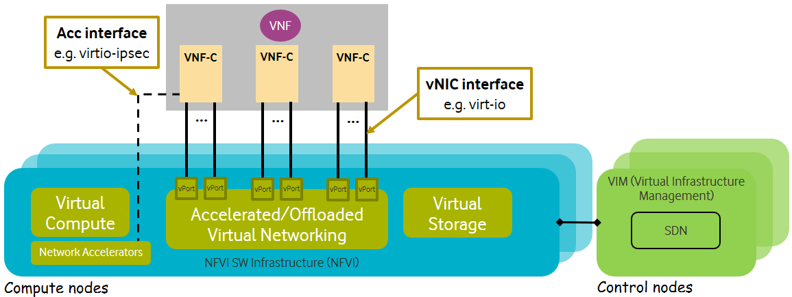

[<< Back](../../ref_model)
# 5	Reference NFVI SW profiles and configurations

## Table of Contents
* [5.1	Basic NFVI reference SW profile and configuration.](#5.1)
* [5.2 Network intensive NFVI reference SW profile and configuration.](#5.2)
* [5.3 Compute intensive NFVI reference SW profile and configuration.](#5.3)

Depending on the requirements of VNFs and the capabilities expected from the infrastructure, this area is defining the right infrastructure configuration that is needed for each profile.

<b>Figure 5-1:</b> Reference NFVI software profiles.

## 5.1	Basic NFVI reference SW profile and configuration
This NFVI SW Profile and configuration will be suitable for B instance type (Please see Section 3). **Figure 5-2** below shows the reference architecture of the NFVI solution.

<b>Figure 5-2:</b> Reference NFVI software profile and configuration for B instance.

### 5.1.1	Virtual Compute

**Table 5-1**

<b>Table 5-1:</b> Virtual Compute Configuration for B instance.

#### 5.1.1.1	Virtual compute Acceleration

### 5.1.2	Virtual Storage

**Table 5-2**

<b>Table 5-2:</b> Virtual Storage Configuration for B instance.

#### 5.1.2.1	Virtual storage Acceleration

### 5.1.3	Virtual Networking and SDN

**Table 5-3**

<b>Table 5-3:</b> Virtual Networking & SDN Configuration for B instance.

#### 5.1.3.1	Virtual Network Acceleration

### 5.1.4	Security

## 5.2	Network intensive NFVI reference SW profile and configuration
This NFVI SW Profile and configuration will be suitable for both B and N instance types.

<b>Figure 5-3:</b> Reference NFVI software profile and configuration for N instance.

### 5.2.1	Virtual Compute

**Table 5-4**

<b>Table 5-4:</b> Virtual Compute Configuration for N instance.

#### 5.2.1.1	Virtual compute Acceleration

### 5.2.2	Virtual Storage

**Table 5-5**

<b>Table 5-5:</b> Virtual Storage Configuration for N instance.

#### 5.2.2.1	Virtual storage Acceleration

### 5.2.3	Virtual Networking and SDN

**Table 5-6**

<b>Table 5-6:</b> Virtual Networking & SDN Configuration for N instance.

#### 5.2.3.1	Virtual Network Acceleration

### 5.2.4	Security

## 5.3	Compute intensive NFVI reference SW profile and configuration
This NFVI SW profile and configuration will be suitable for C instance type

<b>Figure 5-4:</b> Reference NFVI software profile and configuration for C instance.

### 5.3.1	Virtual Compute

**Table 5-7**

<b>Table 5-7:</b> Virtual Compute Configuration for C instance.

#### 5.3.1.1	Virtual compute Acceleration

### 5.3.2	Virtual Storage

**Table 5-8**

<b>Table 5-8:</b> Virtual Storage Configuration for C instance.

#### 5.3.2.1	Virtual storage Acceleration

### 5.3.3	Virtual Networking and SDN

**Table 5-9**

<b>Table 5-9:</b> Virtual Networking & SDN Configuration for C instance.

#### 5.3.3.1	Virtual Network Acceleration

### 5.3.4	Security

