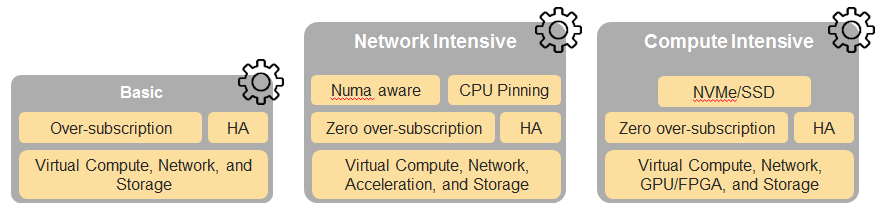

[<< Back](../../ref_model)
# 5	Reference NFVI SW profiles and configurations

## Table of Contents
* [5.1 NFVI SW profile description.](#5.1)
  * [5.1.1 Virtual Compute.](#5.1.1)
  * [5.1.2 Virtual Storage.](#5.1.2)
  * [5.1.3 Virtual Networking.](#5.1.3) 
  * [5.1.4 Security.](#5.1.4) 
 * [5.2 Basic NFVI reference SW profile and configuration.](#5.2)
  * [5.2.1 Virtual Compute.](#5.2.1)
  * [5.2.2 Virtual Storage.](#5.2.2)
  * [5.2.3 Virtual Networking.](#5.2.3)
  * [5.2.4 Security.](#5.2.4) 
* [5.3 Network intensive NFVI reference SW profile and configuration.](#5.3)
  * [5.3.1 Virtual Compute.](#5.3.1)
  * [5.3.2 Virtual Storage.](#5.3.2)
  * [5.3.3 Virtual Networking.](#5.3.3)
  * [5.3.4 Security.](#5.3.4)
* [5.4 Compute intensive NFVI reference SW profile and configuration.](#5.4)
  * [5.4.1 Virtual Compute.](#5.4.1)
  * [5.4.2 Virtual Storage.](#5.4.2)
  * [5.4.3 Virtual Networking and SDN.](#5.4.3)
  * [5.4.4 Security.](#5.4.4)

## 5.1 NFVI SW profile description

NFVI Software layer is composed of 2 layers, **Figure 5-1**:
- the virtualization Infrastructure layer, which is based on hypervisor virtualization technology or container-based virtualization technology. Container virtualization can be nested in hypervisor-based virtualization
- the host OS layer

<b>Figure 5-1:</b> NFVI software layers.

For a host (compute node or physical server), the virtualization layer is an abstraction layer between hardware components (compute, storage and network resources) and virtual resources allocated to VNF-C, each VNF-C maps 1:1 against a single VM or a single container/pod. **Figure 5-2** represents the virtual resources (virtual compute, virtual network and virtual storage) allocated to VNF-C and managed by the VIM.

<b>Figure 5-2:</b> NFVI- Virtual resources.

Depending on the requirements of VNFs, a VNFC will be deployed with a NFVI instance type and an appropriate compute flavour. A NFVI instance type is defined by a NFVI SW profile and a NFVI HW profile. A NFVI SW profile is a set of virtual resources with specific behaviour, capabilities and metrics. **Figure 5-3** depicts a high level view of software profiles for Basic, Network Intensive and Compute intensive instances types.

<b>Figure 5-3:</b> Reference NFVI software profiles.

The following sections detail the NFVI SW profile features per type of virtual resource. The list of these features will evolve over time.

### 5.1.1	Virtual Compute

**Table 5-1** depicts the features related to virtual compute.

| .conf | Feature | Type  | Description |
|------------------|----------------|----------------|------------------------------------------------------------------------------------------------|
| nfvi.com.cfg.001 | Support of flavours |  | Supported compute Flavours. |
| nfvi.com.cfg.002 | CPU partionning  | value | CPU dedicated to the host and CPU dedicated to VNFs  |
| nfvi.com.cfg.003 | CPU allocation ratio  | value |  |
| nfvi.com.cfg.004 | NUMA awareness | true/false  | Support of NUMA at the virtualization layer  |
| nfvi.com.cfg.005 | CPU pinning capability  | true/false |  |
| nfvi.com.cfg.006 | Huge Pages  | value |  |

<b>Table 5-1:</b> Virtual Compute features.

**Table 5-2**	depicts virtual compute Acceleration feature

| .conf | Feature | Type  | Description |
|------------------|----------------|----------------|------------------------------------------------------------------------------------------------|
| nfvi.com.acc.cfg.001 | |  | |

<b>Table 5-2:</b> Virtual Compute Acceleration features.

### 5.1.2	Virtual Storage

**Table 5-3** depicts the features related to virtual storage.

| .conf | Feature | Type  | Description |
|------------------|----------------|----------------|------------------------------------------------------------------------------------------------|
| nfvi.stg.cfg.001 | Storage Types |   | Supported Storage types. |
| nfvi.stg.cfg.002 | Storage Block |  |  |  
| nfvi.stg.cfg.003 | Storage Object |  |  |  
| nfvi.stg.cfg.004 | Storage with replication |  |  |  
| nfvi.stg.cfg.005 | Storage with encryption |  |  |  

<b>Table 5-3:</b> Virtual Storage features.

**Table 5-4** depicts the features related to Virtual storage Acceleration

| .conf | Feature | Type  | Description |
|------------------|----------------|----------------|------------------------------------------------------------------------------------------------|
| nfvi.stg.acc.cfg.001 | Storage IOPS oriented |   |   |
| nfvi.stg.acc.cfg.002 | Storage capacity oriented |   |   |

<b>Table 5-4:</b> Virtual Storage Acceleration features.

### 5.1.3 Virtual Networking

**Table 5-5** depicts the features related to virtual networking.

| .conf | Feature | Type  | Description |
|------------------|----------------|----------------|------------------------------------------------------------------------------------------------|
| nfvi.net.cfg.001 | vNIC interface | | e.g. virtio1.1, i40evf (Intel driver for VF SR-IOV). |
| nfvi.net.cfg.002 | Overlay protocol |  | The overlay network encapsulation protocol needs to enable ECMP in the underlay to take advantage of the scale-out features of the network fabric. |
| nfvi.net.cfg.003 | NAT |  |  |
| nfvi.net.cfg.004 | Security Group |  |  |
| nfvi.net.cfg.005 | SFC support |  |  |  
| nfvi.net.cfg.006 | Traffic patterns symmetry |  | Traffic patterns should be optimal, in terms of packet flow. North-south traffic shall not be concentrated in specific elements in the architecture, making those critical choke-points, unless strictly necessary (i.e. when NAT 1:many is required). |
| nfvi.net.cfg.007 | Horizontal scaling |  | The VNF cluster must be able to scale horizontally and to leverage technologies such as ECMP to enable scale-outs/scale-ins, privileging Active-Active HA models, even though this may require some level of application re-design to cope with the need of sharing state between VNF instances |

<b>Table 5-5:</b> Virtual Networking features.

**Table 5-6** depicts the features related to virtual networking acceleration features.

| .conf | Feature | Type  | Description |
|------------------|----------------|----------------|------------------------------------------------------------------------------------------------|
| nfvi.net.acc.cfg.001 | vSwitch optimization | | e.g. DPDK. |
| nfvi.net.acc.cfg.002 | Support of HW offload | | e.g. support of SR-IOV, SmartNic. |
| nfvi.net.acc.cfg.003 | Crypto acceleration | |  |
| nfvi.net.acc.cfg.004 | Crypto Acceleration Interface | | |

<b>Table 5-6:</b> Virtual Networking Acceleration features.

### 5.1.4	Security

## 5.2	Basic NFVI reference SW profile and configuration

This NFVI SW Profile and configuration described in this section will be the reference SW profile for B instance type, **Figure 5-4**.

<b>Figure 5-4:</b> Reference NFVI software profile and configuration fo
r B instance.

### 5.2.1	Virtual Compute features and configuration

**Table 5-7**

| .conf | Feature | Configuration | Description |
|------------------|----------------|----------------|------------------------------------------------------------------------------------------------|
| nfvi.com.cfg.001 | Support of flavours |  All compute Flavours listed in Chapter 4 | Support of compute Flavours defined in the Compute Flavour's catalogue. |

<b>Table 5-7:</b> Virtual Compute features for B instance.

### 5.2.2	Virtual Storage features and configuration

**Table 5-8**

| .conf | Feature | Configuration  | Description |
|------------------|----------------|----------------|------------------------------------------------------------------------------------------------|
| nfvi.stg.cfg.001 | Storage Types | All types listed in **Chapter 4** | Supported Storage types needs to be the same as those listed in the catalogue. |

<b>Table 5-8:</b> Virtual Storage Configuration for B instance.

### 5.2.3 Virtual Networking

**Table 5-5** depicts the features related to virtual networking.

| .conf | Feature | Configuration  | Description |
|------------------|----------------|----------------|------------------------------------------------------------------------------------------------|
| nfvi.net.cfg.001 | vNIC interface | virtio1.1 | |
| nfvi.net.cfg.002 | Overlay protocol | VXLAN, MPLSoUDP, GENEVE, other |  |

<b>Table 5-9:</b> Virtual Networking features and configuration for B instance.

## 5.3	Network intensive NFVI reference SW profile and configuration

This NFVI SW Profile and configuration described in this section will be the reference SW profile for N instance type, **Figure 5-5**.

<b>Figure 5-5:</b> Reference NFVI software profile and configuration for N instance.

### 5.3.1	Virtual Compute features and configuration

### 5.3.2	Virtual Storage features and configuration

<b>Table 5-6:</b> Virtual Storage Configuration for N instance.

### 5.3.3	Virtual Networking features and configuration

## 5.4	Compute intensive NFVI reference SW profile and configuration

<b>Figure 5-7:</b> Reference NFVI software profile and configuration for C instance.

### 5.4.1	Virtual Compute

### 5.4.2	Virtual Storage

### 5.4.3	Virtual Networking 

