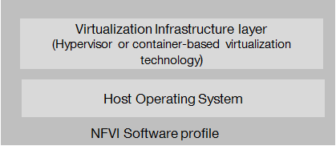
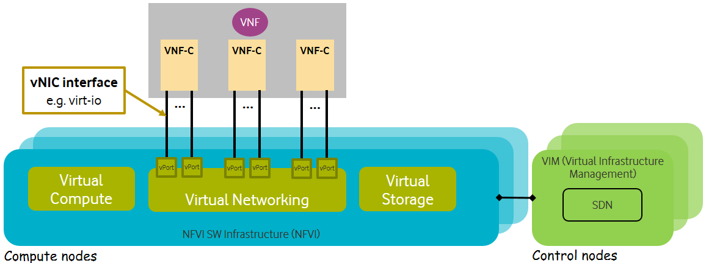
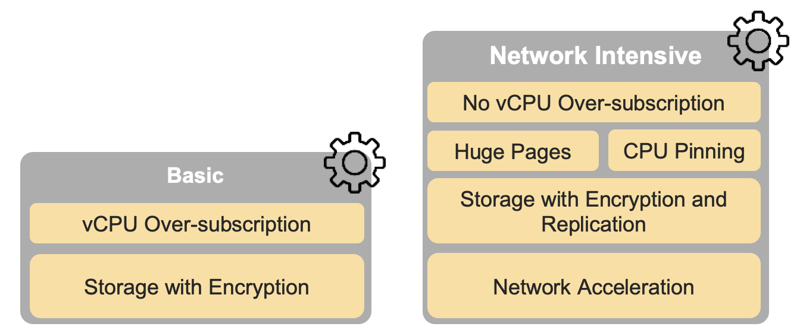
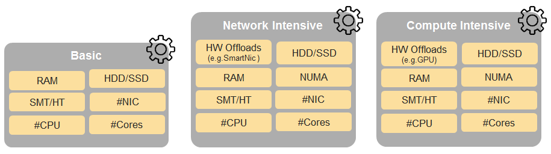
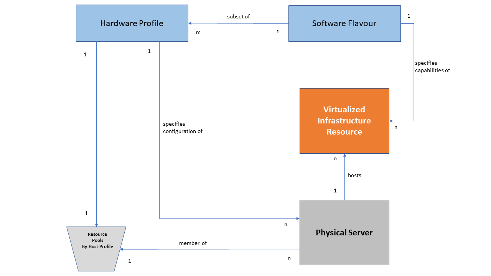
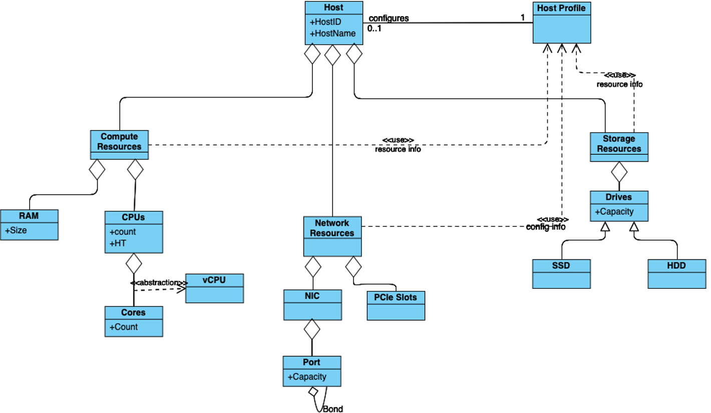

[<< Back](../../ref_model)
# 5 Feature set and Requirements from Infrastructure

## Table of Contents
* [5.1 NFVI SW profile description.](#5.1)
  * [5.1.1 Virtual Compute.](#5.1.1)
  * [5.1.2 Virtual Storage.](#5.1.2)
  * [5.1.3 Virtual Networking.](#5.1.3)
  * [5.1.4 Security.](#5.1.4)
* [5.2 NFVI SW profiles features and requirements.](#5.2)
  * [5.2.1 Virtual Compute.](#5.2.1)
  * [5.2.2 Virtual Storage.](#5.2.2)
  * [5.2.3 Virtual Networking.](#5.2.3)
* [5.3 NFVI HW profile description.](#5.3)
* [5.4 NFVI HW profiles features and requirements.](#5.4)
  * [5.4.1 Compute Resources.](#5.4.1)
  * [5.4.2 Storage Resources.](#5.4.2)
  * [5.4.3 Network Resources.](#5.4.3)

## 5.1 NFVI SW profile description

NFVI Software layer is composed of 2 layers, **Figure 5-1**:
- The virtualisation Infrastructure layer, which is based on hypervisor virtualisation technology or container-based virtualisation technology. Container virtualisation can be nested in hypervisor-based virtualisation
- The host OS layer

<b>Figure 5-1:</b> NFVI software layers.

For a host (compute node or physical server), the virtualisation layer is an abstraction layer between hardware components (compute, storage and network resources) and virtual resources allocated to VNFC, each VNFC generally maps 1:1 against a single VM or a single container/pod. **Figure 5-2** represents the virtual resources (virtual compute, virtual network and virtual storage) allocated to VNFC and managed by the VIM.

<b>Figure 5-2:</b> NFVI- Virtual resources.

Depending on the requirements of VNFs, a VNFC will be deployed with a NFVI instance type and an appropriate compute flavour. A NFVI instance type is defined by a NFVI SW profile and a NFVI HW profile. A NFVI SW profile is a set of features, capabilities and metrics offered by an NFVI SW layer. **Figure 5-3** depicts a high level view of software profiles for Basic, Network Intensive and Compute intensive instances types.

<b>Figure 5-3:</b> NFVI software profiles.

The following sections detail the NFVI SW profile features per type of virtual resource. The list of these features will evolve over time.

### 5.1.1 Virtual Compute

**Table 5-1** and **Table 5-2** depict the features related to virtual compute.

| .conf | Feature | Type  | Description |
|------------------|----------------|----------------|------------------------------------------------------------------------------------------------|
| nfvi.com.cfg.001 | CPU allocation ratio  | Value | Number of virtual cores per physical core  |
| nfvi.com.cfg.002 | NUMA awareness | Yes/No  | Support of NUMA at the virtualization layer  |
| nfvi.com.cfg.003 | CPU pinning capability  | Yes/No | Binding of a process to a dedicated CPU |
| nfvi.com.cfg.004 | Huge Pages  | Yes/No | Ability to manage huge pages of memory |

<b>Table 5-1:</b> Virtual Compute features.

| .conf | Feature | Type  | Description |
|------------------|----------------|----------------|------------------------------------------------------------------------------------------------|
| nfvi.com.acc.cfg.001 | _**Editor Note:** To be worked on_ |  | |

<b>Table 5-2:</b> Virtual Compute Acceleration features.

### 5.1.2 Virtual Storage

**Table 5-3** and **Table 5-4** depict the features related to virtual storage.

| .conf | Feature | Type  | Description |
|------------------|----------------|----------------|------------------------------------------------------------------------------------------------|
| nfvi.stg.cfg.001 | Storage Types | Yes/No   | Support of Storage types described in the catalogue |
| nfvi.stg.cfg.002 | Storage Block | Yes/No  |  |
| nfvi.stg.cfg.003 | Storage Object | Yes/No |  |
| nfvi.stg.cfg.004 | Storage with replication |  Yes/No |  |
| nfvi.stg.cfg.005 | Storage with encryption | Yes/No |  |

<b>Table 5-3:</b> Virtual Storage features.

| .conf | Feature | Type  | Description |
|------------------|----------------|----------------|------------------------------------------------------------------------------------------------|
| nfvi.stg.acc.cfg.001 | Storage IOPS oriented | Yes/No   |   |
| nfvi.stg.acc.cfg.002 | Storage capacity oriented | Yes/No   |   |

<b>Table 5-4:</b> Virtual Storage Acceleration features.

### 5.1.3 Virtual Networking

**Table 5-5** and **Table 5-6** depict the features related to virtual networking.

| .conf | Feature | Type  | Description |
|------------------|----------------|----------------|------------------------------------------------------------------------------------------------|
| nfvi.net.cfg.001 | vNIC interface | IO virtualisation | e.g. virtio1.1, i40evf (Intel driver for VF SR-IOV). |
| nfvi.net.cfg.002 | Overlay protocol | Protocols | The overlay network encapsulation protocol needs to enable ECMP in the underlay to take advantage of the scale-out features of the network fabric. |
| nfvi.net.cfg.003 | NAT |  Yes/No |  Support of Network Address Translation |
| nfvi.net.cfg.004 | Security Groups | Yes/No  | Set of rules managing incoming and outgoing network traffic |
| nfvi.net.cfg.005 | SFC  |Yes/No   |  Support of Service Function Chaining |
| nfvi.net.cfg.006 | Traffic patterns symmetry | Yes/No  | Traffic patterns should be optimal, in terms of packet flow. North-south traffic shall not be concentrated in specific elements in the architecture, making those critical choke-points, unless strictly necessary (i.e. when NAT 1:many is required). |

<b>Table 5-5:</b> Virtual Networking features.

| .conf | Feature | Type  | Description |
|------------------|----------------|----------------|------------------------------------------------------------------------------------------------|
| nfvi.net.acc.cfg.001 | vSwitch optimisation | Yes/No and SW Optimisation | e.g. DPDK. |
| nfvi.net.acc.cfg.002 | Support of HW offload | Yes/No | e.g. support of SR-IOV, SmartNic. |
| nfvi.net.acc.cfg.003 | Crypto acceleration | Yes/No |  |
| nfvi.net.acc.cfg.004 | Crypto Acceleration Interface |Yes/No | |

<b>Table 5-6:</b> Virtual Networking Acceleration features.

### 5.1.4 Security
_**Comment:** To be worked on._

## 5.2 NFVI SW profiles features and requirements

This section will detail NFVI SW profiles and associated configurations for the 3 types of NFVI instances: Basic, Network intensive and Compute intensive.

### 5.2.1 Virtual Compute

**Table 5-7** depicts the features and configurations related to virtual compute for the 3 types of reference NFVI instances.

| .conf | Feature | Type  | Basic | Network Intensive | Compute Intensive |
|------------------|----------------|----------------|----------------|----------------|----------------|
| nfvi.com.cfg.001 | CPU allocation ratio  | value | 4:1 | 1:1  | 1:1 |
| nfvi.com.cfg.002 | NUMA awareness | Yes/No  | N | Y | Y |
| nfvi.com.cfg.003 | CPU pinning capability | Yes/No  | N | Y | Y |
| nfvi.com.cfg.004 | Huge Pages  | Yes/No  | N | Y | Y |

<b>Table 5-7:</b> Virtual Compute features and configuration for the 3 types of SW profiles.

**Table 5-8** will gather virtual compute acceleration features. It will be filled over time.

| .conf | Feature | Type  | Basic | Network Intensive | Compute Intensive |
|------------------|----------------|----------------|----------------|----------------|----------------|
| nfvi.com.acc.cfg.001 | _**Editor Note:** To be worked on_ |  | | |

<b>Table 5-8:</b> Virtual Compute Acceleration features.

### 5.2.2 Virtual Storage

**Table 5-9** and **Table 5-10** depict the features and configurations related to virtual storage for the 3 types of reference NFVI instances.

| .conf | Feature | Type  | Basic | Network Intensive | Compute Intensive |
|------------------|----------------|----------------|----------------|----------------|----------------|
| nfvi.stg.cfg.001 | Catalogue storage Types | Yes/No | Y  | Y  | Y |
| nfvi.stg.cfg.002 | Storage Block | Yes/No | Y | Y |Y  |
| nfvi.stg.cfg.003 | Storage Object |Yes/No  | Y | Y | Y |
| nfvi.stg.cfg.004 | Storage with replication | Yes/No | N | Y | Y |
| nfvi.stg.cfg.005 | Storage with encryption |Yes/No | Y | Y | Y |

<b>Table 5-9:</b> Virtual Storage features and configuration for the 3 types of SW profiles.

**Table 5-10** depicts the features related to Virtual storage Acceleration

| .conf | Feature | Type  | Basic | Network Intensive | Compute Intensive |
|------------------|----------------|----------------|----------------|----------------|----------------|
| nfvi.stg.acc.cfg.001 | Storage IOPS oriented | Yes/No | N | Y | Y |
| nfvi.stg.acc.cfg.002 | Storage capacity oriented |  Yes/No| N | N | Y |

<b>Table 5-10:</b> Virtual Storage Acceleration features.

### 5.2.3 Virtual Networking

**Table 5-11** and **Table 5-12** depict the features and configurations related to virtual networking for the 3 types of reference NFVI instances.

| .conf | Feature | Type  | Basic | Network Intensive | Compute Intensive |
|------------------|----------------|----------------|----------------|----------------|----------------|
| nfvi.net.cfg.001 | vNIC interface | IO virtualisation | virtio1.1 |  virtio1.1, i40evf (Intel driver for VF SR-IOV) |  virtio1.1, i40evf (Intel driver for VF SR-IOV) |
| nfvi.net.cfg.002 | Overlay protocol | Protocols  | VXLAN, MPLSoUDP, GENEVE, other |  VXLAN, MPLSoUDP, GENEVE, other |VXLAN, MPLSoUDP, GENEVE, other |
| nfvi.net.cfg.003 | NAT | Yes/No  | Y | Y | Y |
| nfvi.net.cfg.004 | Security Group | Yes/No  | Y | Y | Y |
| nfvi.net.cfg.005 | SFC support | Yes/No  | N | Y | Y |
| nfvi.net.cfg.006 | Traffic patterns symmetry | Yes/No  | Y | Y | Y |

<b>Table 5-11:</b> Virtual Networking features and configuration for the 3 types of SW profiles.

| .conf | Feature | Type  | Basic | Network Intensive | Compute Intensive |
|------------------|----------------|----------------|----------------|----------------|----------------|
| nfvi.net.acc.cfg.001 | vSwitch optimisation | YeS/No and SW Optimisation | N | Y, DPDK | Y, DPDK |
| nfvi.net.acc.cfg.002 | Support of HW offload | YeS/No | N | Y, support of SR-IOV and  SmartNic |Y, support of SR-IOV and  SmartNic |
| nfvi.net.acc.cfg.003 | Crypto acceleration | Yes/No | N  | Y | Y |
| nfvi.net.acc.cfg.004 | Crypto Acceleration Interface | Yes/No | N  | Y | Y |

<b>Table 5-12:</b> Virtual Networking Acceleration features.

## 5.3 NFVI HW profile description

The support of a variety of different workload types, each with different (sometimes conflicting) compute, storage and network characteristics, including accelerations and optimizations, drives the need to aggregate these characteristics as a hardware (host) profile and capabilities. A host profile is essentially a “personality” assigned to a compute host (physical server, also known as compute host, host, node or pServer). The host profiles and related capabilities consist of the intrinsic compute host capabilities (such as #CPUs (sockets), # of cores/CPU, RAM, local disks and their capacity, etc.), and capabilities enabled in hardware/BIOS, <!--software (VIM, Hypervisor, Operating System),--> specialised hardware (such as accelerators), the underlay networking and storage.

This chapter defines a simplified host, host profile and related capabilities model associated with each of the different NFVI hardware profile and related capabilities; some of these profiles and capability parameters are shown in **Figure 5-4**.

<b>Figure 5-4:</b> NFVI hardware profiles and host associated capabilities.

The host profile model and configuration parameters (hereafter for simplicity simply "host profile") will be used in the **Reference Architecture** to define different hardware profiles. The host profiles can be considered to be the set of EPA-related (Enhanced Performance Awareness) configurations on NFVI resources.
>Please note that in this chapter we shall not list all of the EPA-related configuration parameters.

A software profile (see **Chapter 4**, **5.1 and 5.2**) defines the characteristics of NFVI SW of which Virtual Machines or Containers will be deployed on. A many to many relationship exists between software profiles and host profiles. A given host can only be assigned a single host profile; a host profile can be assigned to multiple hosts. Different Cloud Service Providers (CSP) may use different naming standards for their host profiles.

The following naming convention is used in this document:

`<host profile name>:: <”hp”><numeral host profile sequence #>`

When a software profile is associated with a host profile,  a qualified name can be used as specified below. _**For Example:** for software profile “n” (network intensive) the above host profile name would be “n-hp1”_.

`<qualified host profile>:: <software profile><”-“><”hp”><numeral host profile sequence #>`

<b>Figure 5-5:</b> Generic Hardware Profile, Software Flavour, Physical server relationship.

**Figure 5-5** shows a simplistic depiction of the relationship between Hardware profile, Software Profile, Physical server, and virtual compute. In the diagram the resource pool, a logical construct, depicts all physical hosts that have been configured as per a given host profile; there is one resource pool for each hardware profile.
>_Please note resource pools are not OpenStack host aggregates._

The host profile and capabilities include:
1. **# of CPUs (sockets)**: is the #of CPUs installed on the physical server.
1. **# of cores/CPU**: is the number of cores on each of the CPUs of the physical server.
1. **RAM (GB)**: is the amount of RAM installed on the pysical server.
1. **Local Disk Capacity**: is the # of local disks and teh capacity of the disks installed on the physical server.
1. **SMT/HT (SMT: Simultaneous Multithreading/ HT: Hyper Threading)**: Enabled on all physical servers. Gets multiple threads per physical core. Always ON. Configured in the host.
1. **NUMA (Non-Uniform Memory Access)**: Indicates that vCPU will be on a Socket that is aligned with the associated NIC card and memory. Important for performance optimized VNFs. Configured in the host.
1. **SR-IOV (Single-Root Input/Output Virtualisation)**: Configure PCIe ports to support SR-IOV.
1. **smartNIC (aka Intelligent Server Adaptors)**: Accelerated virtual switch using smartNIC
1. **Cryptography Accelerators**: such as AES-NI, SIMD/AVX, QAT.
1. **Security features**: such as TRusted Platform Module (TPM).

<!--1. **CPU Oversubscription Ratio**: is based on the number of threads available. For example, on a 2CPU, 24-core host with SMT/HT, there are 96 vCPUs with 1:1 CPU Ratio and 192 vCPUs with 2:1 CPU Ratio. NOTE: While the oversubscription ratio is specified in the Virtual Infrastructure MAnager (VIM), once assigned it becomes part of the host personality and hence will be treated as part of the host profile and capabilities. -->
<!--1. **DPDK (Data Plane Development Kit)**: Accelerated virtual switch using Data Plan Development Kit (DPDK) -->
<!--1. **CPU Pinning**: vCPU is pinned to a physical core and dedicated to the requesting VM. Configured in VIM and Hypervisor.-->
<!--1. **Huge Pages**: By default, CPUs allocate RAM in 4K chunks. Hugepages can be enabled to allocate in larger Chunks (such as 2MB, 1GB). This helps improve performance in some cases. Configured in the Operating System. -->

The following model, **Figure 5-6**, depicts the essential characteristics of a host that are of interest in specifying a host profile. The host (physical server) is composed of compute, network and storage resources. The compute resources are composed of physical CPUs (aka CPU sockets or sockets) and memory (RAM). The network resources and storage resources are similarly modelled.

<b>Figure 5-6:</b> Generic model of a compute host for use in Host Profile configurations.

The hardware (host) profile properties are specified in the following sub-sections. The following diagram (**Figure 5-7**) pictorially represents a high-level abstraction of a physical server (host).

<b>Figure 5-7:</b> Generic model of a compute host for use in Host Profile configurations.

## 5.4 NFVI HW profiles features and requirements.

The configurations specified in here will be used in specifying the actual hardware profile configurations for each of the NFVI hardware profile types depicted in **Figure 5-4**.

### 5.4.1 Compute Resources

| Reference | Feature | Description | Basic Type | Network Intensive | Compute Intensive |
|---------------------|-----------|---------------------------|--------|--------|--------|
| nfvi.hw.cpu.cfg.001 | Number of CPU (Sockets) | This determines the minimum number of CPU sockets within each host | 2| 2| 2 |
| nfvi.hw.cpu.cfg.002 | Number of Cores per CPU | This determines the number of cores needed per each CPU. | 20 | 20 | 20 |
| nfvi.hw.cpu.cfg.003 | NUMA | NUMA support and BIOS configured to enable NUMA | N | Y | Y |
| nfvi.hw.cpu.cfg.004 | Simultaneous Multithreading/Hyperthreading (SMT/HT) | This allows a CPU to work multiple streams of data simultaneously | Y | Y| Y |

<!--
| nfvi.hw.cpu.cfg.005 | CPU Pinning |  | N | Y | Y
| nfvi.hw.cpu.cfg.006 | CPU Oversubscription Ratio* |  | n:1 | 1:1 | 1:1
| nfvi.hw.cpu.cfg.007 | Hugepages* |  | N | Y | Y
-->

<b>Table 5-13:</b> Minimum Compute resources configuration parameters.

<!--
> _*These features are not set at the physical server BIOS_
-->

#### 5.4.1.1 Compute Acceleration Hardware Specifications

| Reference | Feature | Description | Basic Type | Network Intensive | Compute Intensive |
|---------------------|-----------|--------------|--------|--------|--------|
| nfvi.hw.cac.cfg.001 | GPU | GPU | N | N | Y |

<b>Table 5-14:</b> Compute acceleration configuration specifications.

### 5.4.2 Storage Configurations

| Reference | Feature | Description | Basic Type | Network Intensive | Compute Intensive |
|---------------------|-----------|---------------------------|--------|--------|--------|
| nfvi.hw.stg.hdd.cfg.001* | Local Storage HDD | Hard Disk Drive |  |  |  |
| nfvi.hw.stg.ssd.cfg.002* | Local Storage SSD | Solid Disk Drive | Recommended | Recommended |Recommended |

<b>Table 5-15:</b> Storage configuration specification.

> _*This specified local storage configurations including # and capacity of storage drives._

### 5.4.3 Network Resources

#### 5.4.3.1 NIC configurations

| Reference | Feature | Description | Basic Type | Network Intensive | Compute Intensive |
|---------------------|-----------|---------------------------|--------|--------|--------|
| nfvi.hw.nic.cfg.001 | NIC Ports | Total Number of NIC Ports available in the host | 4 | 4 | 4 |
| nfvi.hw.nic.cfg.002 | Port Speed | Port speed specified in Gbps (minimum values) | 10 | 25 | 25 |

<b>Table 5-16:</b> Minimum NIC configuration specification.

#### 5.4.3.2 PCIe Configurations

| Reference | Feature | Description | Basic Type | Network Intensive | Compute Intensive |
|---------------------|-----------|---------------------------|--------|--------|--------|
| nfvi.hw.pci.cfg.001 | PCIe slots | Number of PCIe slots available in the host | 8 | 8 | 8 |
| nfvi.hw.pci.cfg.002 | PCIe speed |  | Gen 3 | Gen 3 | Gen 3 |
| nfvi.hw.pci.cfg.003 | PCIe Lanes |  | 8 | 8 | 8 |

<b>Table 5-17:</b> PCIe configuration specification.

<!--

#### 5.4.3.3 Network Bond Configurations

| Reference* | Feature | Description | Basic Type | Network Intensive | Compute Intensive |
|---------------------|-----------|---------------------------|--------|--------|--------|
| nfvi.hw.bdc.cfg.001 | Bonded VLAN ports |  | Y | Y | Y |

<b>Table 6-5:</b> Network bond configuration specifications.

> _*Repeat Configuration for each Bond and specify use._
-->

#### 5.4.3.3 Network Acceleration Configurations

| Reference | Feature | Description | Basic Type | Network Intensive | Compute Intensive |
|---------------------|-----------|---------------------------|--------|--------|--------|
| nfvi.hw.nac.cfg.001 | Cryptographic Acceleration | IPSec, Crypto |  N | Optional | Optional |
| nfvi.hw.nac.cfg.002 | SmartNIC | A SmartNIC that is used to offload vSwitch functionality to hardware | N | Optional  | Optional |
| nfvi.hw.nac.cfg.003 | Compression |  |  |  |

<b>Table 5-18:</b> Network acceleration configuration specification.

