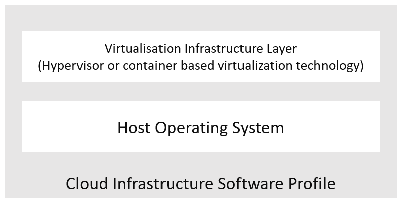
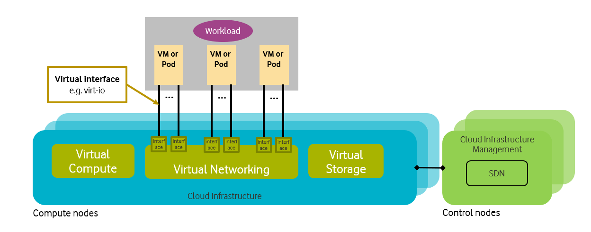
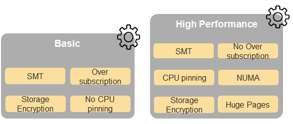
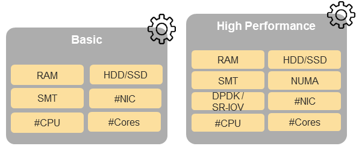

Feature set and Requirements from Infrastructure
================================================

A profile :ref:`ref_model/chapters/chapter02:profiles, profile extensions & flavours` specifies the configuration of a Cloud Infrastructure node (host or server); :ref:`ref_model/chapters/chapter02:profile extensions (specialisations)` may specify additional configuration. Workloads utilise profiles to describe the configuration of nodes on which they can be hosted to execute on. Workload Flavours provide a mechanism to specify the VM or Pod sizing information to host the workload. Depending on the requirements of the workloads, a VM or a Pod will be deployed as per the specified Flavour information on a node configured as per the specified Profile. Not only do the nodes (the hardware) have to be configured but some of the capabilities also need to be configured in the software layers (such as Operating System and Virtualisation Software). Thus, a Profile can be defined in terms of configuration needed in the software layers, the Cloud Infrastructure Software Profile, and the hardware, the Cloud Infrastructure Hardware Profile.

Cloud Infrastructure Software profile description
-------------------------------------------------

Cloud Infrastructure Software layer is composed of 2 layers, :numref:`Cloud Infrastructure software layers`:

-  The virtualisation Infrastructure layer, which is based on hypervisor virtualisation technology or container-based virtualisation technology. Container virtualisation can be nested in hypervisor-based virtualisation
-  The host OS layer

.. :name: Cloud Infrastructure software layers

   Cloud Infrastructure software layers

============ =================================== ======= ====================================================== ==========================
Ref          Cloud Infrastructure Software       Type    Definition/Notes                                       Capabilities Reference (1)
============ =================================== ======= ====================================================== ==========================
infra.sw.001 Host Operating System               <value> Values such as Ubuntu20.04, Windows 10 Release #, etc. ``e.cap.021``
infra.sw.002 Virtualisation Infrastructure Layer <value> Values such as KVM, Hyper-V, Kubernetes, etc.          ``e.cap.022``
============ =================================== ======= ====================================================== ==========================

..

   (1) Reference to the capabilities defined in :doc:`ref_model/chapters/chapter04`.

For a host (compute node or physical server), the virtualisation layer is an abstraction layer between hardware components (compute, storage, and network resources) and virtual resources allocated to a VM or a Pod. :numref:`Cloud Infrastructure Virtual resources` represents the virtual resources (virtual compute, virtual network, and virtual storage) allocated to a VM or a Pod and managed by the Cloud Infrastructure Manager.

.. :name: Cloud Infrastructure Virtual resources

   Cloud Infrastructure Virtual resources

A Cloud Infrastructure Software Profile is a set of features, capabilities, and metrics offered by a Cloud Infrastructure software layer and configured in the software layers (the Operating System (OS) and the virtualisation software (such as hypervisor)). :numref:`Cloud Infrastructure Software Profiles` depicts a high level view of the Basic and High Performance Cloud Infrastructure Profiles.

.. :name: Cloud Infrastructure Software Profiles

   Cloud Infrastructure Software Profiles

The following sections detail the Cloud Infrastructure Software Profile capabilities per type of virtual resource.

Virtual Compute Profiles
~~~~~~~~~~~~~~~~~~~~~~~~

**Table 5-1** and **Table 5-2** depict the features related to virtual compute.

================= ================================= =============== ============================================================================================================================== ======================
Reference         Feature                           Type            Description                                                                                                                    Capabilities Reference
================= ================================= =============== ============================================================================================================================== ======================
infra.com.cfg.001 CPU allocation ratio              <value>         Number of virtual cores per physical core.                                                                                     ``i.cap.016``
infra.com.cfg.002 NUMA alignment                    Yes/No          Support of NUMA at the Host OS and virtualisation layers, in addition to hardware.                                             ``e.cap.007``
infra.com.cfg.003 CPU pinning                       Yes/No          Binds a vCPU to a physical core or SMT thread. Configured in OS and virtualisation layers.                                     ``e.cap.006``
infra.com.cfg.004 Huge pages                        Yes/No          Ability to manage huge pages of memory. Configured in OS and virtualisation layers.                                            ``i.cap.018``
infra.com.cfg.005 Simultaneous Multithreading (SMT) Yes/No/Optional Allows multiple execution threads to be executed on a single physical CPU core. Configured in OS, in addition to the hardware. ``e.cap.018``
================= ================================= =============== ============================================================================================================================== ======================

**Table 5-1:** Virtual Compute features.

===================== =========================== =============== ================================================================================================================== ======================
Reference             Feature                     Type            Description                                                                                                        Capabilities Reference
===================== =========================== =============== ================================================================================================================== ======================
infra.com.acc.cfg.001 IPSec Acceleration          Yes/No/Optional IPSec Acceleration                                                                                                 ``e.cap.008``
infra.com.acc.cfg.002 Transcoding Acceleration    Yes/No/Optional Transcoding Acceleration                                                                                           ``e.cap.010``
infra.com.acc.cfg.003 Programmable Acceleration   Yes/No/Optional Programmable Acceleration                                                                                          ``e.cap.011``
infra.com.acc.cfg.004 GPU                         Yes/No/Optional Hardware coprocessor                                                                                               ``e.cap.014``
infra.com.acc.cfg.005 FPGA/other Acceleration H/W Yes/No/Optional Non-specific hardware. These Capabilities generally require hardware-dependent drivers be injected into workloads. ``e.cap.016``
===================== =========================== =============== ================================================================================================================== ======================

**Table 5-2:** Virtual Compute Acceleration features.

Virtual Storage Profiles
~~~~~~~~~~~~~~~~~~~~~~~~

**Table 5-3** and **Table 5-4** depict the features related to virtual storage.

================= ======================== ====== ===================================================
Reference         Feature                  Type   Description
================= ======================== ====== ===================================================
infra.stg.cfg.001 Catalogue Storage Types  Yes/No Support of Storage types described in the catalogue
infra.stg.cfg.002 Storage Block            Yes/No
infra.stg.cfg.003 Storage with replication Yes/No
infra.stg.cfg.004 Storage with encryption  Yes/No
================= ======================== ====== ===================================================

**Table 5-3:** Virtual Storage features.

===================== ========================= ====== ===========
Reference             Feature                   Type   Description
===================== ========================= ====== ===========
infra.stg.acc.cfg.001 Storage IOPS oriented     Yes/No
infra.stg.acc.cfg.002 Storage capacity oriented Yes/No
===================== ========================= ====== ===========

**Table 5-4:** Virtual Storage Acceleration features.

Virtual Networking Profiles
~~~~~~~~~~~~~~~~~~~~~~~~~~~

**Table 5-5** and **Table 5-6** depict the features related to virtual networking.

================= ========================== ================= ======================================================================================================================================================================================================================================================
Reference         Feature                    Type              Description
================= ========================== ================= ======================================================================================================================================================================================================================================================
infra.net.cfg.001 Connection Point interface IO virtualisation e.g. virtio1.1
infra.net.cfg.002 Overlay protocol           Protocols         The overlay network encapsulation protocol needs to enable ECMP in the underlay to take advantage of the scale-out features of the network fabric.
infra.net.cfg.003 NAT                        Yes/No            Support of Network Address Translation
infra.net.cfg.004 Security Groups            Yes/No            Set of rules managing incoming and outgoing network traffic
infra.net.cfg.005 Service Function Chaining  Yes/No            Support of Service Function Chaining (SFC)
infra.net.cfg.006 Traffic patterns symmetry  Yes/No            Traffic patterns should be optimal, in terms of packet flow. North-south traffic shall not be concentrated in specific elements in the architecture, making those critical choke-points, unless strictly necessary (i.e. when NAT 1:many is required).
================= ========================== ================= ======================================================================================================================================================================================================================================================

**Table 5-5:** Virtual Networking features.

===================== ============================= ========================== =========== ======================
Reference             Feature                       Type                       Description Capabilities Reference
===================== ============================= ========================== =========== ======================
infra.net.acc.cfg.001 vSwitch optimisation          Yes/No and SW Optimisation e.g. DPDK.  ``e.cap.019``
infra.net.acc.cfg.002 SmartNIC (for HW Offload)     Yes/No                     HW Offload  ``e.cap.015``
infra.net.acc.cfg.003 Crypto acceleration           Yes/No                                 ``e.cap.009``
infra.net.acc.cfg.004 Crypto Acceleration Interface Yes/No
===================== ============================= ========================== =========== ======================

**Table 5-6:** Virtual Networking Acceleration features.

Security
~~~~~~~~

See Chapter 7 Security.

Platform Services
~~~~~~~~~~~~~~~~~

This section details the services that may be made available to workloads by the Cloud Infrastructure.

================= ============== ====== ==========================================
Reference         Feature        Type   Description
================= ============== ====== ==========================================
infra.svc.stg.001 Object Storage Yes/No Object Storage Service (e.g S3-compatible)
================= ============== ====== ==========================================

**Table 5-7:** Cloud Infrastructure Platform services.

====================================== =================================================================================================
Platform Service Category              Platform Service Examples
====================================== =================================================================================================
Data Stores/Databases                  Ceph, etcd, MongoDB, Redis
Streaming and Messaging                Apache Kafka, Rabbit MQ
Load Balancer and Service Proxy        Envoy, Istio, NGINX
Service Mesh                           Envoy, Istio
Security & Compliance                  Calico, cert-manager
Monitoring                             Prometheus, Grafana (for Visualisation), Kiali (for Service Mesh)
Logging                                Fluentd, ElasticSearch (Elastic.io, Open Distro), ELK Stack (Elasticsearch, Logstash, and Kibana)
Application Definition and Image Build Helm
CI/CD                                  Argo, GitLab, Jenkins
Ingress/Egress Controllers             Envoy, Istio, NGINX
Network Service                        CoreDNS, Istio
Coordination and Service Discovery     CoreDNS, etcd, Zookeeper
Automation and Configuration           Ansible
Key Management                         Vault
Tracing                                Jaeger
====================================== =================================================================================================

**Table 5-7a:** Service examples.

Cloud Infrastructure Software Profiles features and requirements
----------------------------------------------------------------

This section will detail Cloud Infrastructure Software Profiles and associated configurations for the 2 types of Cloud Infrastructure Profiles: Basic and High Performance.

.. _virtual-compute-1:

Virtual Compute
~~~~~~~~~~~~~~~

**Table 5-8** depicts the features and configurations related to virtual compute for the two (2) Cloud Infrastructure Profiles.

================= ================================= =============== ===== ================
Reference         Feature                           Type            Basic High Performance
================= ================================= =============== ===== ================
infra.com.cfg.001 CPU allocation ratio              <value>         N:1   1:1
infra.com.cfg.002 NUMA alignment                    Yes/No          N     Y
infra.com.cfg.003 CPU pinning                       Yes/No          N     Y
infra.com.cfg.004 Huge pages                        Yes/No          N     Y
infra.com.cfg.005 Simultaneous Multithreading (SMT) Yes/No/Optional Y     Optional
================= ================================= =============== ===== ================

**Table 5-8:** Virtual Compute features and configuration for the 2 types of Cloud Infrastructure Profiles.

**Table 5-9** lists the features related to compute acceleration for the High Performance profile. The table also lists the applicable :ref:`ref_model/chapters/chapter04:profile extensions` and Extra Specs that may need to be specified.

===================== =========================== ============================= ===================
Reference             Feature                     Profile-Extensions            Profile Extra Specs
===================== =========================== ============================= ===================
infra.com.acc.cfg.001 IPSec Acceleration          Compute Intensive GPU
infra.com.acc.cfg.002 Transcoding Acceleration    Compute Intensive GPU         Video Transcoding
infra.com.acc.cfg.003 Programmable Acceleration   Firmware-programmable adapter Accelerator
infra.com.acc.cfg.004 GPU                         Compute Intensive GPU
infra.com.acc.cfg.005 FPGA/other Acceleration H/W Firmware-programmable adapter
===================== =========================== ============================= ===================

**Table 5-9:** Virtual Compute Acceleration features.

.. _virtual-storage-1:

Virtual Storage
~~~~~~~~~~~~~~~

**Table 5-10** and **Table 5-11** depict the features and configurations related to virtual storage for the two (2) Cloud Infrastructure Profiles.

================= ======================== ====== ===== ================
Reference         Feature                  Type   Basic High Performance
================= ======================== ====== ===== ================
infra.stg.cfg.001 Catalogue storage Types  Yes/No Y     Y
infra.stg.cfg.002 Storage Block            Yes/No Y     Y
infra.stg.cfg.003 Storage with replication Yes/No N     Y
infra.stg.cfg.004 Storage with encryption  Yes/No Y     Y
================= ======================== ====== ===== ================

**Table 5-10:** Virtual Storage features and configuration for the two (2) profiles.

**Table 5-11** depicts the features related to Virtual storage Acceleration

===================== ========================= ====== ===== ================
Reference             Feature                   Type   Basic High Performance
===================== ========================= ====== ===== ================
infra.stg.acc.cfg.001 Storage IOPS oriented     Yes/No N     Y
infra.stg.acc.cfg.002 Storage capacity oriented Yes/No N     N
===================== ========================= ====== ===== ================

**Table 5-11:** Virtual Storage Acceleration features.

.. _virtual-networking-1:

Virtual Networking
~~~~~~~~~~~~~~~~~~

**Table 5-12** and **Table 5-13** depict the features and configurations related to virtual networking for the 2 types of Cloud Infrastructure Profiles.

================= ========================== ================= ============================== ==============================
Reference         Feature                    Type              Basic                          High Performance
================= ========================== ================= ============================== ==============================
infra.net.cfg.001 Connection Point interface IO virtualisation virtio1.1                      virtio1.1\*
infra.net.cfg.002 Overlay protocol           Protocols         VXLAN, MPLSoUDP, GENEVE, other VXLAN, MPLSoUDP, GENEVE, other
infra.net.cfg.003 NAT                        Yes/No            Y                              Y
infra.net.cfg.004 Security Group             Yes/No            Y                              Y
infra.net.cfg.005 Service Function Chaining  Yes/No            N                              Y
infra.net.cfg.006 Traffic patterns symmetry  Yes/No            Y                              Y
================= ========================== ================= ============================== ==============================

**Table 5-12:** Virtual Networking features and configuration for the 2 types of SW profiles.

   **Note:** \* might have other interfaces (such as SR-IOV VFs to be directly passed to a VM or a Pod) or NIC-specific drivers on guest machines transiently allowed until mature enough solutions are available with a similar efficiency level (for example regarding CPU and energy consumption).

===================== ============================= ========================== ===== ================
Reference             Feature                       Type                       Basic High Performance
===================== ============================= ========================== ===== ================
infra.net.acc.cfg.001 vSwitch optimisation (DPDK)   Yes/No and SW Optimisation N     Y
infra.net.acc.cfg.002 SmartNIC (for HW Offload)     Yes/No/Optional            N     Optional
infra.net.acc.cfg.003 Crypto acceleration           Yes/No/Optional            N     Optional
infra.net.acc.cfg.004 Crypto Acceleration Interface Yes/No/Optional            N     Optional
===================== ============================= ========================== ===== ================

**Table 5-13:** Virtual Networking Acceleration features.

Cloud Infrastructure Hardware Profile description
-------------------------------------------------

The support of a variety of different workload types, each with different (sometimes conflicting) compute, storage, and network characteristics, including accelerations and optimizations, drives the need to aggregate these characteristics as a hardware (host) profile and capabilities. A host profile is essentially a “personality” assigned to a compute host (also known as physical server, compute host, host, node, or pServer). The host profiles and related capabilities consist of the intrinsic compute host capabilities (such as number of CPU sockets, number of cores per CPU, RAM, local disks and their capacity, etc.), and capabilities enabled in hardware/BIOS, specialised hardware (such as accelerators), the underlay networking, and storage.

This chapter defines a simplified host, profile and related capabilities model associated with each of the different Cloud Infrastructure Hardware Profile and related capabilities; the two :ref:`chapters/chapter02:profiles, profile extensions & flavours` (aka host profiles, node profiles, hardware profiles) and some of their associated capabilities are shown in :numref:`Cloud Infrastructure Hardware Profiles and host associated capabilities`.

.. :name: Cloud Infrastructure Hardware Profiles and host associated capabilities

   Cloud Infrastructure Hardware Profiles and host associated capabilities

The profiles can be considered to be the set of EPA-related (Enhanced Performance Awareness) configurations on Cloud Infrastructure resources.

   **Note:** In this chapter we shall not list all of the EPA-related configuration parameters.

A given host can only be assigned a single host profile; a host profile can be assigned to multiple hosts. In addition to the host profile, :ref:`ref_model/chapters/chapter04:profiles and workload flavours` and additional capability specifications for the configuration of the host can be specified. Different Cloud Service Providers (CSP) may use different naming standards for their host profiles. For the profiles to be configured, the architecture of the underlying resource needs to be known.

============ ============================= ======= ============================= ======================
Ref          Cloud Infrastructure Resource Type    Definition/Notes              Capabilities Reference
============ ============================= ======= ============================= ======================
infra.hw.001 CPU Architecture              <value> Values such as x64, ARM, etc. ``e.cap.020``
============ ============================= ======= ============================= ======================

The host profile properties are specified in the following sub-sections. The following diagram (:numref:`Generic model of a compute host for use in Host Profile configurations`) pictorially represents a high-level abstraction of a physical server (host).

.. :name: Generic model of a compute host for use in Host Profile configurations
.. figure:: ../figures/ch06_ref_hw_profile.PNG
   :alt: "Generic model of a compute host for use in Host Profile configurations"

   Generic model of a compute host for use in Host Profile configurations

.. _cloud-infrastructure-hardware-profiles-features-and-requirements:

Cloud Infrastructure Hardware Profiles features and requirements.
-----------------------------------------------------------------

The configurations specified in here will be used in specifying the actual hardware profile configurations for each of the Cloud Infrastructure Hardware Profiles depicted in **Figure 5-4**.

Compute Resources
~~~~~~~~~~~~~~~~~

==================== ================================= ================================================================================= ===== ================
Reference            Feature                           Description                                                                       Basic High Performance
==================== ================================= ================================================================================= ===== ================
infra.hw.cpu.cfg.001 Minimum number of CPU sockets     Specifies the minimum number of populated CPU sockets within each host (*)        2     2
infra.hw.cpu.cfg.002 Minimum number of cores per CPU   Specifies the number of cores needed per CPU (*)                                  20    20
infra.hw.cpu.cfg.003 NUMA alignment                    NUMA alignment enabled and BIOS configured to enable NUMA                         N     Y
infra.hw.cpu.cfg.004 Simultaneous Multithreading (SMT) SMT enabled that allows each core to work multiple streams of data simultaneously Y     Optional
==================== ================================= ================================================================================= ===== ================

..

   (*) Please note that these specifications are for general purpose servers normally located in large data centres. Servers for specialised use with the data centres or other locations, such as at edge sites, are likely to have different specifications.

**Table 5-14:** Minimum sizing and capability configurations for general purpose servers.

Compute Acceleration Hardware Specifications
^^^^^^^^^^^^^^^^^^^^^^^^^^^^^^^^^^^^^^^^^^^^

==================== =========================== =============== ===== ================ ======================
Reference            Feature                     Description     Basic High Performance Capabilities Reference
==================== =========================== =============== ===== ================ ======================
infra.hw.cac.cfg.001 GPU                         GPU             N     Optional         ``e.cap.014``
infra.hw.cac.cfg.002 FPGA/other Acceleration H/W HW Accelerators N     Optional         ``e.cap.016``
==================== =========================== =============== ===== ================ ======================

**Table 5-15:** Compute acceleration configuration specifications.

Storage Configurations
~~~~~~~~~~~~~~~~~~~~~~

========================== ================= ================= =========== ================
Reference                  Feature           Description       Basic       High Performance
========================== ================= ================= =========== ================
infra.hw.stg.hdd.cfg.001\* Local Storage HDD Hard Disk Drive
infra.hw.stg.ssd.cfg.002\* Local Storage SSD Solid State Drive Recommended Recommended
========================== ================= ================= =========== ================

**Table 5-16:** Storage configuration specification.

   **Note:** \*This specified local storage configurations including # and capacity of storage drives.

Network Resources
~~~~~~~~~~~~~~~~~

NIC configurations
^^^^^^^^^^^^^^^^^^

==================== ========== =============================================== ===== ================
Reference            Feature    Description                                     Basic High Performance
==================== ========== =============================================== ===== ================
infra.hw.nic.cfg.001 NIC Ports  Total number of NIC Ports available in the host 4     4
infra.hw.nic.cfg.002 Port Speed Port speed specified in Gbps (minimum values)   10    25
==================== ========== =============================================== ===== ================

**Table 5-17:** Minimum NIC configuration specification.

PCIe Configurations
^^^^^^^^^^^^^^^^^^^

==================== ========== ========================================== ===== ================
Reference            Feature    Description                                Basic High Performance
==================== ========== ========================================== ===== ================
infra.hw.pci.cfg.001 PCIe slots Number of PCIe slots available in the host 8     8
infra.hw.pci.cfg.002 PCIe speed                                            Gen 3 Gen 3
infra.hw.pci.cfg.003 PCIe Lanes                                            8     8
==================== ========== ========================================== ===== ================

**Table 5-18:** PCIe configuration specification.

Network Acceleration Configurations
^^^^^^^^^^^^^^^^^^^^^^^^^^^^^^^^^^^

==================== =================== ============================= ======== ================ ======================
Reference            Feature             Description                   Basic    High Performance Capabilities Reference
==================== =================== ============================= ======== ================ ======================
infra.hw.nac.cfg.001 Crypto Acceleration IPSec, Crypto                 N        Optional         ``e.cap.009``
infra.hw.nac.cfg.002 SmartNIC            offload network functionality N        Optional         ``e.cap.015``
infra.hw.nac.cfg.003 Compression                                       Optional Optional
infra.hw.nac.cfg.004 SR-IOV over PCI-PT  SR-IOV                        N        Optional         ``e.cap.013``
==================== =================== ============================= ======== ================ ======================

**Table 5-19:** Network acceleration configuration specification.
