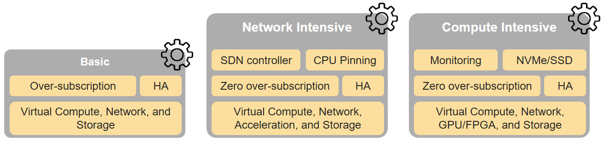

[<< Back](../../ref_model)
# 6	Reference NFVI HW profiles and configurations

## Table of Contents
* [6.1	Basic NFVI reference SW profile and configuration.](#6.1)
* [6.2 Network intensive NFVI reference SW profile and configuration.](#6.2)
* [6.3 Compute intensive NFVI reference SW profile and configuration.](#6.3)

The support of a variety of different workload types, each with different (sometimes conflicting) compute, storage and network characteristics, including accelerations and optimizations, drives the need to aggregate these characteristics as a hardware host profile. A host profile is essentially a “personality” assigned to a compute host (physical server, also known as (aka) compute host, host, node or pServer). The host profile contains a specification (yaml file) on how the host should be configured including the underlay networking and storage.

This chapter defines a simplified host and host profile model and the host profile configuration parameters associated with the different hardware profile types shown in **Figure 6-1**.

<b>Figure 6-1:</b> Reference NFVI hardware profiles.

## 6.1	Hardware Profile Model
The host profile model and configuration parameters will be utilized in the reference architecture to define different hardware profiles.

A software flavour series (see Chapters 4 and 5) defines the characteristics of Virtual Machines (VMs or vServers) that will be deployed on hosts assigned a host-profile. A many to many relationship exists between software flavour series and host profiles. A given host can only be assigned a single host profile; a host profile can be assigned to multiple hosts. Different Cloud Service Providers (CSP) may utilize different naming standards for their host profiles. 

The following naming convention is utilized in this document:

`<host profile name>:: <”hp”><numeral host profile sequence #>`

When a software flavour series is associated with a host profile then a qualified name can be used as specified below. For example, for software flavor series “ns” (network intensive with SR-IOV) the above host profile name would be “ns-hp1”.

`<qualified host profile>:: <software flavor series><”-“><”hp”><numeral host profile sequence #>`

The following model depicts the essential characteristics of a host that are of interest in specifying a host profile. The host (physical server) is composed of compute, network and storage resources. The compute resources are composed of physical CPUs (aka CPU sockets or sockets) and memory (RAM). The network resources and storage resources are similarly modelled. 

<b>Figure 6-2:</b> Generic model of a computer host for use in Host Profile configurations.

The host profile properties are specified in the following sub-sections. The following diagram (**Figure 6-2**) pictorially represents a high-level abstraction of a host.

<b>Figure 6-3:</b> Generic model of a computer host for use in Host Profile configurations.

The configurations specified in this model section will be utilized in specifying the actual hardware profile configurations for each of the NFVI hardware profile types depicted in **Figure 6-1**.

### 6.1.1	Compute Resource Configurations

| Reference | Feature | Description |
|---------------------|---------------------------------------------------------------|----------------------------------------------------------------------|
| nfvi.hw.cpu.cfg.001 | Number of CPU (Sockets) | This determines the number of CPU sockets exist within each platform |
| nfvi.hw.cpu.cfg.002 | Number of Cores per CPU | This determines the number of cores needed per each CPU. |
| nfvi.hw.cpu.cfg.003 | NUMA Alignment |  |
| nfvi.hw.cpu.cfg.004 | Hyperthreading (HT) |  |
| nfvi.hw.cpu.cfg.005 | CPU Pinning |  |
| nfvi.hw.cpu.cfg.006 | CPU Allocation Ratio |  |
| nfvi.hw.cpu.cfg.007 | Cores dedicated to Host Resources | Hypervisor, VIM components, base containers, etc. |
| nfvi.hw.cpu.cfg.008 | Cores dedicated for Data Plane Development Kit ( DPDK) Router |  |
| nfvi.hw.cpu.cfg.009 | Cores available for Guest vServers |  |
| nfvi.hw.cpu.cfg.010 | Hugepages |  |
| nfvi.hw.cpu.cfg.011 | Max vCPUs available for tenants/NUMA |  |
| nfvi.hw.cpu.cfg.012 | Max vCPUs available for tenants/host | Across al NUMA (or CPUs) |

<b>Table 1-5:</b> Compute resources configuration parameters.

