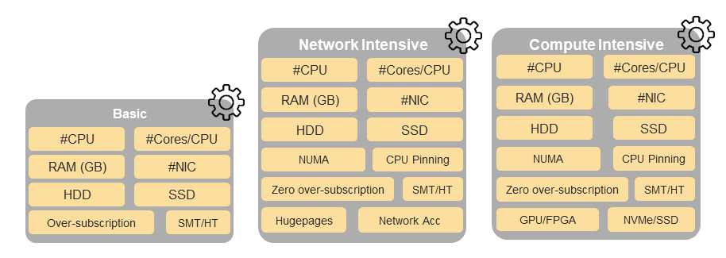

[<< Back](../../ref_model)
# 6	Reference NFVI HW profiles and configurations

## Table of Contents
* [6.1 Hardware Profile and Capabilities Model.](#6.1)
* [6.2 Compute Resource Configurations.](#6.2)
  * [6.2.1	Compute Acceleration Hardware Specifications](#6.2.1)
* [6.3 Network Resources Configurations.](#6.3)
  * [6.3.1	NIC configurations](#6.3.1)
  * [6.3.2	PCIe configurations](#6.3.2)
  * [6.3.3	Network Bond Configurations](#6.3.3)
  * [6.3.4	Network Acceleration Configurations](#6.3.4)
* [6.4 Storage Configurations.](#6.4)
* [6.5 Security Configuration.](#6.5)

The support of a variety of different workload types, each with different (sometimes conflicting) compute, storage and network characteristics, including accelerations and optimizations, drives the need to aggregate these characteristics as a hardware (host) profile and capbilities. A host profile is essentially a “personality” assigned to a compute host (physical server, also known as (aka) compute host, host, node or pServer). The host profiles and related capabilities consist of the intrinsic compute host capabilities (such as #CPUs (sockets), # of cores/CPU, RAM, local disks and their capacity, etc.), and capabilities enabled in hardware/BIOS, software (VIM, Hypervisor, Operating System), specialised hoardware (such as accelerators), the underlay networking and storage. 

This chapter defines a simplified host, host profile and related capabilities model associated with each of the different NFVI hardware profile and related capabilities; some of these profile and capability parameters are shown in **Figure 6-1**.

<b>Figure 6-1:</b> Reference NFVI hardware profiles and host associated capabilities.

## 6.1	Hardware Profile and Capabilities Model
The host profile model and configuration parameters (hereafter for simplicity simply "host profile") will be utilized in the reference architecture to define different hardware profiles.

A software flavour series (see Chapters 4 and 5) defines the characteristics of Virtual Machines (VMs or vServers) that will be deployed on hosts assigned a host-profile. A many to many relationship exists between software flavour series and host profiles. A given host can only be assigned a single host profile; a host profile can be assigned to multiple hosts. Different Cloud Service Providers (CSP) may utilize different naming standards for their host profiles. 

The following naming convention is utilized in this document:

`<host profile name>:: <”hp”><numeral host profile sequence #>`

When a software flavour series is associated with a host profile then a qualified name can be used as specified below. For example, for software flavor series “ns” (network intensive with SR-IOV) the above host profile name would be “ns-hp1”.

`<qualified host profile>:: <software flavor series><”-“><”hp”><numeral host profile sequence #>`

<b>Figure 6-2:</b> Generic Hardware Profile, Software Flavour, Physical server relationship.

**Figure 6-2** shows a simplistic depiction of the relationship between Hardware profile, Software Flavour, Physical server, virtual and compute. In the diagram the resource pool, a logical construct, depicts all physical hosts that have been configured as per a given host profile; there is one resource pool for each hardware profile. Please note resource pools are not OpenStack host aggregates.

The host profile and capabilities include:
1. **# of CPUs (sockets)**: is the #of CPUs installed on the physical server.
1. **# of cores/CPU**: is the number of cores on each of the CPUs of the physical server.
1. **RAM (GB)**: is the amount of RAM installed on the pysical server.
1. **Local Disk Capacity**: is the # of local disks and teh capacity of the disks installed on the physical server.
1. **CPU Oversubscription Ratio**: is based on the number of threads available. For example, on a 2CPU, 24-core host with SMT/HT, there are 96 vCPUs with 1:1 CPU Ratio and 192 vCPUs with 2:1 CPU Ratio. NOTE: While the oversubscription ratio is specified in the Virtual Infrastructure MAnager (VIM), once assigned it becomes part of the host personality and hence will be treated as part of the host profile and capabilities.  
1. **HT (Hyper Threading; technically, SMT: Simultaneous Multithreading)**: Enabled on all physical servers. Gets 2 hyper threads per physical core. Always ON. Configured in the host (BIOS).
1.**NUMA (Non-Uniform Memory Access)**: Indicates that vCPU will be on a Socket that is aligned with the associated NIC card and memory. Important for performance optimized VNFs. Configured in the host (BIOS).
1. **CPU Pinning**: vCPU is pinned to a physical core and dedicated to the requesting VM. Configured in VIM and Hypervisor.
1. **Huge Pages**: By default, CPUs allocate RAM in 4K chunks. Hugepages can be enabled to allocate in larger Chunks (such as 2MB, 1GB). This helps improve performance in some cases. Configured in the Operating System.
1. **SR-IOV (Single-Root Input/Output Virtualisation)**: Configure PCIe ports to support SR-IOV. 

The following model, **Figure 6-3**, depicts the essential characteristics of a host that are of interest in specifying a host profile. The host (physical server) is composed of compute, network and storage resources. The compute resources are composed of physical CPUs (aka CPU sockets or sockets) and memory (RAM). The network resources and storage resources are similarly modelled. 

<b>Figure 6-3:</b> Generic model of a computer host for use in Host Profile configurations.

The hardware (host) profile properties are specified in the following sub-sections. The following diagram (**Figure 6-4**) pictorially represents a high-level abstraction of a physical server (host).

<b>Figure 6-4:</b> Generic model of a computer host for use in Host Profile configurations.

The configurations specified in this model section will be utilized in specifying the actual hardware profile configurations for each of the NFVI hardware profile types depicted in **Figure 6-1**.

## 6.2	Compute Resource Configurations

| Reference | Feature | Description | Basic Type | Network Intensive | Compute Intensive
|---------------------|-----------|---------------------------|--------|--------|--------
| nfvi.hw.cpu.cfg.001 | Number of CPU (Sockets) | This determines the number of CPU sockets exist within each platform | 2| 2| 2
| nfvi.hw.cpu.cfg.002 | Number of Cores per CPU | This determines the number of cores needed per each CPU. | 20 | 20 | 20 
| nfvi.hw.cpu.cfg.003 | NUMA |  | N | Y | Y
| nfvi.hw.cpu.cfg.004 | Hyperthreading (HT) |  | Y | Y| Y 
| nfvi.hw.cpu.cfg.005 | CPU Pinning |  | N | Y | Y
| nfvi.hw.cpu.cfg.006 | CPU Oversubscription Ratio* |  | n:1 | 1:1 | 1:1 
| nfvi.hw.cpu.cfg.007 | Hugepages* |  | N | Y | Y

<b>Table 6-1:</b> Minimum Compute resources configuration parameters.

> _*These features are not set at the physical server BIOS _

### 6.2.1	Compute Acceleration Hardware Specifications

| Reference | Feature | Description | Basic Type | Network Intensive | Compute Intensive
|---------------------|-----------|--------------|--------|--------|--------
| nfvi.hw.cac.cfg.001 | GPU | GPU | N | N | Y 

<b>Table 6-2:</b> Compute acceleration configuration specifications.

## 6.3.	Network Resources Configurations

### 6.3.1	NIC configurations

| Reference | Feature | Description | Basic Type | Network Intensive | Compute Intensive
|---------------------|-----------|---------------------------|--------|--------|--------
| nfvi.hw.nic.cfg.001 | NIC Ports | Total Number of NIC Ports available in the platform | 4 | 4 | 4
| nfvi.hw.nic.cfg.002 | Port Speed | Port speed specified in Gbps | 10 | 25 | 25

<b>Table 6-3:</b> Minimum NIC configuration specifications.

### 6.3.2.	PCIe Configurations

| Reference | Feature | Description | Basic Type | Network Intensive | Compute Intensive
|---------------------|-----------|---------------------------|--------|--------|--------
| nfvi.hw.pci.cfg.001 | PCIe slots | Number of PCIe slots available in the platform | 8 | 8 | 8
| nfvi.hw.pci.cfg.002 | PCIe speed |  | Gen 3 | Gen 3 | Gen 3 |
| nfvi.hw.pci.cfg.003 | PCIe Lanes |  | 8 | 8 | 8

<b>Table 6-4:</b> PCIe configuration specification.

#### 6.3.3	Network Bond Configurations

| Reference* | Feature | Description | Basic Type | Network Intensive | Compute Intensive
|---------------------|-----------|---------------------------|--------|--------|--------
| nfvi.hw.bdc.cfg.001 | Bonded VLAN ports |  | Y | Y | Y

<b>Table 6-5:</b> Network bond configuration specifications.

> _*Repeat Configuration for each Bond and specify use._

### 6.3.4	Network Acceleration Configurations

| Reference | Feature | Description | Basic Type | Network Intensive | Compute Intensive
|---------------------|-----------|---------------------------|--------|--------|--------
| nfvi.hw.nac.cfg.001 | Cryptographic Acceleration | IPSec, Crypto | 
| nfvi.hw.nac.cfg.002 | SmartNIC | A SmartNIC that is used to offload vSwitch functionality to hardware | | Maybe | Maybe
| nfvi.hw.nac.cfg.003 | Compression |  |

<b>Table 6-6:</b> Network acceleration configuration specifications.

## 6.4.	Storage Configurations

| Reference | Feature | Description | Basic Type | Network Intensive | Compute Intensive
|---------------------|-----------|---------------------------|--------|--------|--------
| nfvi.hw.stg.hdd.cfg.001* | Local Storage HDD |  |
| nfvi.hw.stg.ssd.cfg.002* | Local Storage SSD |  | Recommended | Recommended |Recommended |

<b>Table 6-7:</b> Storage configuration specifications.

> _*This specified local storage configurations including # and capacity of storage drives._

### 6.5.	Security Configuration

| Reference* | Feature | Description | Basic Type | Network Intensive | Compute Intensive
|---------------------|-----------|---------------------------|--------|--------|--------
| nfvi.hw.sec.cfg.001 | TPM | Platform must have Trusted Platform Module. | Y | Y | Y |

<b>Table 6-8:</b> Security configuration specifications.

