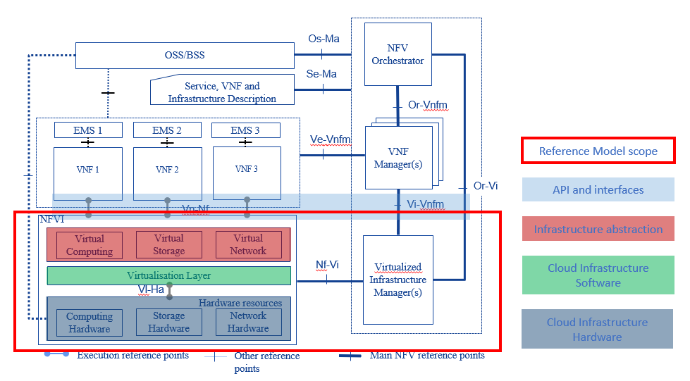

[<< Back](../../ref_model)
# 7 Security

## Table of Contents
* [7.1 Introduction](#7.1)
* [7.2 Principles and Guidelines](#7.2)
  * [7.2.1 Overarching Objectives and Goals](#7.2.1)
  * [7.2.2 Verification Methodologies](#7.2.2)
  * [7.2.3 Governance](#7.2.3)
* [7.3 Common standards](#7.3)
  * [7.3.1 Potential attack vectors](#7.3.1)
  * [7.3.2 Testing demarcation points](#7.3.2)
* [7.4 Security Scope](#7.4)
  * [7.4.1 In-scope and Out-of-Scope definition](#7.4.1)
  * [7.4.2 Security requirements](#7.4.2)
  * [7.4.3 Platform security requirements](#7.4.3)
  * [7.4.4 Workload security requirements](#7.4.4)
  * [7.4.5 Certification/validation requirements](#7.4.5)
* [7.5 Platform Security](#7.5)
  * [7.5.1 General Platform Security](#7.5.1)
  * [7.5.2 Platform ‘back-end’ access security](#7.5.2)
  * [7.5.3 Platform ‘front-end’ access security](#7.5.3)
* [7.6 Workload Security - Vendor Responsibility](#7.6)
  * [7.6.1 Software Hardening](#7.6.1)
  * [7.6.2 Port Protection](#7.6.2)
  * [7.6.3 Software Code Quality](#7.6.3)
  * [7.6.4 Alerting and Monitoring](#7.6.4)
  * [7.6.5 Logging](#7.6.5)
  * [7.6.6 VNF images](#7.6.6)
  * [7.6.7 Identity and Access Management](#7.6.7)
  * [7.6.8 CVEs and Vulnerability Management](#7.6.8)
  * [7.6.9 Encryption suite supports](#7.6.9)
  * [7.6.10 Password complexity support](#7.6.10)
  * [7.6.11 Customized Banner](#7.6.11)
 * [7.7 Workload Security- Operator Responsibility](#7.7)
  * [7.7.1 Remote Attestation/openCIT](#7.7.1)
  * [7.7.2 VNF Image Scanning / Signing](#7.7.2)
* [7.8 VNF Vendors responsibility](#7.8)
* [7.9 Cloud Infrastructure Vendors responsibility](#7.9)
  * [7.9.1 Networking Security Zoning](#7.9.1)
  * [7.9.2 Encryption](#7.9.2)
  * [7.9.3 Platform Patching](#7.9.3)
  * [7.9.4 Boot Integrity Measurement (TPM)](#7.9.4)
  * [7.9.5 Runtime Integrity Measurement (TPM)](#7.9.5)
  * [7.9.6 Cloud Infrastructure & Cloud Infrastructure Manager](#7.9.6)
* [7.10 Certification requirements](#7.10)
* [7.11 Consolidated Security requirements](#7.11)
  * [7.11.1 System Hardening](#7.11.1)
  * [7.11.2 Platform Access](#7.11.2)
  * [7.11.3 Confidentiality and Integrity](#7.11.3)
  * [7.11.4 Workload Security](#7.11.4)
  * [7.11.5 Image Security](#7.11.5)
  * [7.11.6 Security LCM](#7.11.6)
  * [7.11.7 Monitoring and Security Audit](#7.11.7)
  * [7.11.8 Compliance with Standards](#7.11.8)
  * [7.11.9 References](#7.11.9)

## 7.1 Introduction

This document includes process flow, logistics, and requirements which must be satisfied to ensure workloads meet the design, feature, and capability expectations of workload consumers to deliver cloud promoting the use and scalability of SDN capabilities. This chapter captures the core fundamentals and steps needed to conformance test workloads on target Cloud Infrastructure frameworks and architectures which drives more work into the community, resulting in pre-certified workloads on core capabilities ultimately reducing the amount of time and cost it takes each operator to on-board and maintain vendor provided workloads.

<b>Figure 7-1:</b> CNTT relation to LFN OVP

## 7.2 Principles and Guidelines

The objectives of the Security verification program are to deliver certified reference architectures which match application-developer specifications, leveraging the OVP ecosystem as the vehicle for deliverying security validated Cloud Infrastructure.

These core principles will guide Cloud Infrastructure verification deliverables

## 7.3 Common standards

Security vulnerabilities and attack vectors are everywhere.  The telecom industry and its cloud infrastructures are even more vulnerable to potential attacks due to the ubiquitous nature of the infrastructures and services combined with the vital role Telecommunications play in the modern world.   The attack vectors are many and varied, ranging from the potential for exposure of sensitive data, both personal and corporate, to weaponized disruption to the global Telecommunications networks.  The threats can take the form of a physical attack on the locations the infrastructure hardware is housed, to network attacks such as denial of service and targeted corruption of the network service applications themselves.  Whatever the source, any Cloud Infrastructure built needs to be able to withstand attacks in whatever form they take.

With that in mind, the Cloud Infrastructure reference model and the supporting architectures are not only required to optimally support networking functions, but they must be designed with common security principles and standards from inception.  These best practices must be applied at all layers of the infrastructure stack and across all points of interconnections with outside networks, APIs and contact points with the NFV network functions overlaying or interacting with that infrastructure.
Standards organizations with recommendations and best practices, and certifications that need to be taken into consideration include the following examples. However this is by no means an exhaustive list, just some of the more important standards in current use.

* Center for Internet Security - https://www.cisecurity.org/
* Cloud Security Alliance - https://cloudsecurityalliance.org/
* Open Web Application Security Project https://www.owasp.org
* The National Institute of Standards and Technology (NIST) (US Only)
* FedRAMP Certification https://www.fedramp.gov/ (US Only)
* ETSI Cyber Security Technical Committee (TC CYBER) - https://www.etsi.org/committee/cyber
* ETSI Industry Specification Group Network Functions Virtualisation (ISG NFV) - https://www.etsi.org/technologies/nfv
  * ETSI NFV ISG [SEC WG specifications](https://www.etsi.org/standards-search#page=1&search=NFV-SEC&title=0&etsiNumber=1&content=0&version=1&onApproval=0&published=1&historical=0&startDate=1988-01-15&endDate=2020-02-27&harmonized=0&keyword=&TB=&stdType=&frequency=&mandate=&collection=&sort=1)
* ISO (the International Organization for Standardization) and IEC (the International Electrotechnical Commission) - www.iso.org.  The following ISO standards are of particular interest for NFVI
  * ISO/IEC 27002:2013 - ISO/IEC 27001 is the international Standard for best-practice information security management systems (ISMSs).
  * ISO/IEC 27032 - ISO/IEC 27032is the international Standard focusing explicitly on cybersecurity.
  * ISO/IEC 27035 - ISO/IEC 27035 is the international Standard for incident management. Incident management
  * ISO/IEC 27031 - ISO/IEC 27031 is the international Standard for ICT readiness for business continuity.

A good place to start to understand the requirements is to use the widely accepted definitions developed by the OWASP – Open Web Application Security Project.  These include the following core principles:

* Confidentiality – Only allow access to data for which the user is permitted
* Integrity – Ensure data is not tampered with or altered by unauthorized users
* Availability – ensure systems and data are available to authorized users when they need it

Additional Cloud Infrastructure security principles that need to be incorporated:
* Authenticity – The ability to confirm the users are in fact valid users with the correct rights to access the systems or data.

## 7.3.1 Potential attack vectors
Previously attacks designed to place and migrate workload outside the legal boundaries were not possible using traditional infrastructure, due to the closed nature of these systems. However, using Cloud Infrastructure, violation of regulatory policies and laws becomes possible by actors diverting or moving an application from an authenticated and legal location to another potentially illegal location. The consequences of violating regulatory policies may take the form of a complete banning of service and/or an exertion of a financial penalty by a governmental agency or through SLA enforcement.  Such vectors of attack may well be the original intention of the attacker in an effort to harm the service provider. One possible attack scenario can be when an attacker exploits the insecure VNF API to dump the records of personal data from the database in an attempt to violate user privacy. Cloud Infrastructure operators should ensure that the applications APIs are secure, accessible over a secure network (TLS) under very strict set of security best practices, and RBAC policies to limit exposure of this vulnerability.

## 7.3.2 Testing demarcation points

It is not enough to just secure all potential points of entry and hope for the best, any Cloud Infrastructure architecture must be able to be tested and validated that it is in fact protected from attack as much as possible. The ability to test the infrastructure for vulnerabilities on a continuous basis is critical for maintaining the highest level of security possible.  Testing needs to be done both from the inside and outside of the systems and networks.  Below is a small sample of some of the testing methodologies and frameworks available.

• OWASP testing guide

• PCI Penetration testing guide

• Penetration Testing Execution Standard

• NIST 800-115

    o VULCAN: Vulnerability Assessment Framework for Cloud Computing (NIST)

• Penetration Testing Framework

• Information Systems Security Assessment Framework (ISSAF)

• Open Source Security Testing Methodology Manual (“OSSTMM”)

• FedRAMP Penetration Test Guidance (US Only)

• CREST Penetration Testing Guide

Insuring that the security standards and best practices are incorporated into the Cloud Infrastructure and architectures must be a shared responsibility, among the Telecommunications operators interested in building and maintaining the infrastructures in support of their services, the application vendors developing the network services that will be consumed by the operators, and the Cloud Infrastructure vendors creating the infrastructures for their Telecommunications customers.  All of the parties need to incorporate security and testing components, and maintain operational processes and procedures to address any security threats or incidents in an appropriate manner.  Each of the stakeholders need to contribute their part to create effective security for the Cloud Infrastructure.

## 7.4 Security Scope

## 7.4.1 In-scope and Out-of-Scope definition

The scope of the security controls requirements maps to the scope of the Reference Model architecture.

The Reference Model scope is shown below (as outlined in chapter 1 of the reference model):

<b>Figure 7-2:</b> ETSI NFV architecture mapping

This means that the security of the Reference Model requirements must cover the virtual resources (including the virtualisation layer), the hardware resources, and the VIM (Virtualised Infrastructure Manager).

There will be a different set of security requirements for each Cloud Infrastructure reference architecture. In this case, the first reference architecture is OpenStack.

## 7.4.2 Security Requirements

The following diagram shows the different security domains that impact the Reference Model:

<b>Figure 7-3:</b> Reference Model Security Domains

## 7.4.3 Platform security requirements

At a high level, the following areas/requirements cover platform security for a particular deployment:
* Platform certification
* Secure access controls for administrators
* Secure API interface for Tenants
* Encryption for all external and control comms
* Strong separation between tenants - ensuring network, data, and runtime process isolation between tenants
* Authenticated/secure APIs provided to overlay network administrators
* Platform change control on hardware
* Templated approved changes for automation where available
* Typically well defined security framework documentation including approved deployment use cases
* Infrastructure software update process
* Identity Domain = platform

## 7.4.4 Workload security requirements

At a high level, the following areas/requirements cover workload security for a particular deployment:
* Up to platform-level certification
* Each workload network will need to undertake it own security self-assessment and accreditation, and not inherit a security accreditation from the platform
* Potentially automated service activation
* Workload owner owns workload security certification process
* Workload owner owns workload design change process
* Workload owner owns workload software update process
* Identity Domain = workload

## 7.4.5 Certification/validation requirements

    *(An overview/introduction to workload certification requirements and
    incl types of workloads covered)*

## 7.5 Platform Security

### 7.5.1 General Platform Security

The security certification of the platform will typically need to be the same, or higher, than the workload or VNF requirements.

The platform supports the workload, and in effect controls access to the workload from and to external endpoints such as carriage networks used by workloads, or by Data Centre Operations staff supporting the workload, or by tenants accessing workloads. From an access security perspective, the following diagram shows where different access controls will operate within the platform to provide access controls throughout the platform:

<b>Figure 7-4:</b> Reference Model Access Controls

#### 7.5.1.1 The high-level functions of these different access controls

* **MGNT ACCESS CONTROLS** - Platform access to workloads for service management. Typically all management and control-plane traffic is encrypted.
* **DATA ACCESS CONTROLS** - Control of east-west traffic between workloads, and control of north-south traffic between the VNF and other platform services such as front-end carriage networks and platform services. Inherently strong separation between tenants is mandatory.
* **SERVICES ACCESS CONTROLS** - Protects platform services from any platform access
* **BACK-END ACCESS CONTROLS** - Data Centre Operations access to the platform, and subsequently, workloads. Typically stronger authentication requirements such as (Two-Factor Authentication) 2FA, and using technologies such as Role-Based Access Control (RBAC) and encryption. Application Programming Interface (API) gateways may be required for automated/script-driven processes.
* **FRONT-END ACCESS CONTROLS** - Protects the platform from malicious carriage network access, and provides connectivity for specific workloads to specific carriage networks. Carriage networks being those that are provided as public networks and operated by carriers, and in this case with interfaces that are usually sub, or virtual networks.
* **TENANT ACCESS CONTROLS** - Provides apropriate tenant access controls to specific platform services, and tenant workloads - including Role-Based Access Control (RBAC), authentication controls as approriate for the access arrangement, and Application Programming Interface (API) gateways for automated/script-driven processes.

#### 7.5.1.2 The following general security requirements apply to the platform

* Restrict traffic to (and from) the workload to only traffic that is necessary, and deny all other traffic.
* Provide protections between the Internet and any workloads including web and volumetrics attack preventions.
* Support zoning within a tenant workload - using application-level filtering.
* All host to host communications within the cloud provider network are to be cryptographically protected in transit.
* Not expose tenant IP address details to another tenant.
* Use cryptographically-protected protocols for administrative access to the platform.
* Data Centre Operations staff and systems must use management protocols that limit security risk such as SNMPv3, SSH v2, ICMP, NTP, syslog, and TLS.
* A platform change management process that is documented, well communicated to staff and tenants, and rigourously followed.
* A process to check change management adherence that is implemented, and rigourously followed.
* Processes for managing platform access control filters that are documented, followed, and monitored.
* No login to root on any platform systems (platform systems are those that are associated with the platform and include systems that directly or indirectly affect the viability of the platform).
* Role-Based Access Control (RBAC) must apply for all platform systems access.
* An approved system or process for last resort access must exist for the platform.
* All API access must use TLS protocol.
* All production workloads must be separated from all non-production workloads including separation between non-hosted non-production external networks.
* Where there are multiple hosting facilities used in provision of the service, network communications between facilities for the purpose of backup, management, and application communication are cryptographically protected in transit between data centre facilities.
* Continuous cloud security compliance is mandatory.
* All data persisted to primary, replica, or backup storage is to be encrypted.
* All platform security logs are to be time synchronised.
* Logs are to be regularly scanned for events of interest.
* An incident response plan must exist for the platform.
* The cloud services must be regularly vulnerability and penetration tested.

### 7.5.2 Platform ‘back-end’ access security

* Restrict traffic to only traffic that is necessary, and deny all other traffic.
* Use cryptographically-protected protocols for administrative access to the platform.
* Data Centre Operations staff and systems must use management protocols that limit security risk such as SNMPv3, SSH v2, ICMP, NTP, syslog, and TLS.
* A platform change management process that is documented, well communicated to staff and tenants, and rigourously followed.
* A process to check change management adherence that is implemented, and rigourously followed.
* Processes for managing platform access control filters that are documented, followed, and monitored.
* No login to root on any platform systems.
* Role-Based Access Control (RBAC) must apply for all systems access.
* An approved system or process for last resort access must exist for the platform.
* All back-end API access must use TLS.

### 7.5.3 Platform ‘front-end’ access security

* Front-end network security at the application level will be the responsibility of the workload, however the platform must ensure the isolation and integrity of tenant connectivity to front-end networks.
* The front-end network may provide (Distributed Denial Of Service) DDOS support.

## 7.6 Workload Security - Vendor Responsibility

### 7.6.1 Software Hardening

* No hard-coded credentials/ clear text passwords
* Software should be independent of the infrastructure platform (no OS point release dependencies to patch)
* Software is code signed and all individual sub-components are assessed and verified for EULA violations
* Software should have a process for discovery, classification, communication, and timely resolution of security vulnerabilities (i.e.; bug bounty, Penetration testing/scan findings, etc)

### 7.6.2 Port Protection

* Unused software and unused network ports should be disabled by default

### 7.6.3 Software Code Quality

* Vendors should use industry recognized software testing suites
  * Static and dynamic scanning
  * Automated static code review with remediation of Medium/High/Critical security issues. The tool used for static code analysis and analysis of code being released must be shared.
  * Dynamic security tests with remediation of Medium/High/Critical security issues. The tool used for Dynamic security analysis of code being released must be shared
  * Penetration tests (pen tests) with remediation of Medium/High/Critical security issues.
  * Methodology for ensuring security is included in the Agile/DevOps delivery lifecycle for ongoing feature enhancement/maintenance.

### 7.6.4 Alerting and monitoring

* Security event logging (All security events should be logged, including informational)
* Privilege escalation detection

  
### 7.6.5 Logging

* (Logging output should support customizable Log retention and Log rotation)

  
### 7.6.6 VNF images

* Image integrity – fingerprinting/validation
* Container Images
  * Container Management
  * Immutability

### 7.6.7 Identity and Access Management

### 7.6.8 CVEs and Vulnerability Management

* Security defect reporting
* Cadence with Cloud Infrastructure vendors (OSSA for OpenStack)

### 7.6.9 Encryption suite support
* Software should support recognized encryption standards and encryption should be decoupled from software

### 7.6.10 Password complexity support

* Software should support configurable, or industry standard, password complexity rules

 
### 7.6.11 Banner

* Software should have support for configurable banners to display authorized use criteria/policy

## 7.7 Workload Security  - Operator Responsibility.

The Operator’s responsibility is to not only make sure that security is included in all the vendor supplied infrastructure and NFV components, but it is also responsible for the maintenance of the security functions from an operational and management perspective.   This includes but is not limited to securing the following elements:

* Maintaining standard security operational management methods and processes
* Monitoring and reporting functions
* Processes to address regulatory compliance failure
* Support for appropriate incident response and reporting
* Methods to support appropriate remote attestation certification of the validity of the security components, architectures, and methodologies used

### 7.7.1 Remote Attestation/openCIT

Cloud Infrastructure operators must ensure that remote attestation methods are used to remotely verify the trust status of a given Cloud Infrastructure platform.  The basic concept is based on boot integrity measurements leveraging the TPM built into the underlying hardware. Remote attestation can be provided as a service, and may be used by either the platform owner or a consumer/customer to verify that the platform has booted in a trusted manner. Practical implementations of the remote attestation service include the open cloud integrity tool (Open CIT).   Open CIT provides ‘Trust’ visibility of the cloud infrastructure and enables compliance in cloud datacenters by establishing the root of trust and builds the chain of trust across hardware, operating system, hypervisor, VM, and container.  It includes asset tagging for location and boundary control. The platform trust and asset tag attestation information is used by Orchestrators and/or Policy Compliance management to ensure workloads are launched on trusted and location/boundary compliant platforms. They provide the needed visibility and auditability of infrastructure in both public and private cloud environments.

Insert diagram here:
https://01.org/sites/default/files/users/u26957/32_architecture.png

### 7.7.2 Workload Image Scanning / Signing

It is easy to tamper with workload images. It requires only a few seconds to insert some malware into a workload image file while it is being uploaded to an image database or being transferred from an image database to a compute node. To guard against this possibility, workload images can be cryptographically signed and verified during launch time. This can be achieved by setting up a signing authority and modifying the hypervisor configuration to verify an image’s signature before they are launched. To implement image security, the VNF operator must test the image and supplementary components verifying that everything conforms to security policies and best practices.

## 7.8 Application Vendors responsibility

The application vendors need to incorporate security elements to support the highest level of security of the networks they support.  This includes but is not limited to securing the following elements:

* Operating system or container
* Application
* Network interfaces
* Management and controller systems used to support the VNFs directly, examples include a SIEM system or a SD WAN policy manager
* Regulatory compliance failure as it relates to the application itself only

Image from https://www.networkworld.com/article/2840273/sdn-security-attack-vectors-and-sdn-hardening.html Will replace with a better image when I create it in the future.

## 7.9 Cloud Infrastructure and Cloud Infrastructure Manager Vendors responsibility

The Cloud Infrastructure vendors need to incorporate security elements to support the highest level of security of the infrastructure they support.  This includes but is not limited to securing the following elements:

* Hypervisor
* VM/container management system
* APIs
* Network interfaces
* Networking security zoning
* Platform patching mechanisms
* Regulatory compliance Failure

### 7.9.1 Networking Security Zoning

Network segmentation is important to ensure that VMs can only communicate with the VMs they are supposed to. To prevent a VM from impacting other VMs or hosts, it is a good practice to separate VM traffic and management traffic. This will prevent attacks by VMs breaking into the management infrastructure. It is also best to separate the VLAN traffic into appropriate groups and disable all other VLANs that are not in use. Likewise, VMs of similar functionalities can be grouped into specific zones and their traffic isolated. Each zone can be protected using access control policies and a dedicated firewall based on the needed security level.

Recommended practice to set network security policies following the principle of least privileged, only allowing approved protocol flows. For example, set 'default deny' inbound and add approved policies required for the functionality of the application running on the NFVI infrastructure.

### 7.9.2 Encryption

Virtual volume disks associated with workloads may contain sensitive data. Therefore, they need to be protected. Best practice is to secure the workload volumes by encrypting them and storing the cryptographic keys at safe locations. Be aware that the decision to encrypt the volumes might cause reduced performance, so the decision to encrypt needs to be dependent on the requirements of the given infrastructure.  The TPM module can also be used to securely store these keys. In addition, the hypervisor should be configured to securely erase the virtual volume disks in the event of application crashes or is intentionally destroyed to prevent it from unauthorized access.

* Composition analysis: New vulnerabilities are discovered in common open source libraries every week. As such, mechanisms to validate components of the VNF application stack by checking libraries and supporting code against the Common Vulnerabilities and Exposures (CVE) databases to determine whether the code contains any known vulnerabilities must be embedded into the NFVI architecture itself.  Some of the components required include:
* Tools for checking common libraries against CVE databases integrated into the deployment and orchestration pipelines.
* The use of Image scanners such as OpenSCAP to determine security vulnerabilities

### 7.9.3 Platform Patching

Cloud Infrastructure operators should ensure that the platform including the components (hypervisors, VMs, etc.) are kept up to date with the latest patch.

### 7.9.4 Boot Integrity Measurement (TPM)

Using a trusted platform module (TPM) as a hardware root of trust, the measurement of system sensitive components, such as platform firmware, bootloader, OS kernel, static filesystem, and other system components can be securely stored and verified.
NFVI Operators should ensure that the TPM support is enabled in the platform firmware, so that platform measurements are correctly recorded during boot time.

Additionally, NFVI Operators should ensure that OS kernel measurements can be recorded by using a TPM-aware bootloader (e.g. [tboot](https://sourceforge.net/projects/tboot/) or [shim](https://github.com/rhboot/shim)), which can extend the root of trust up to the kernel level.
The validation of the platform measurements can be performed by TPM’s launch control policy (LCP) or through the remote attestation server.

### 7.9.5 Runtime Integrity Measurement (TPM)
If a remote attestation server is used to monitor platform integrity, the operators should ensure that attestation is performed periodically or in a timely manner.
Additionally, platform measurements may be extended to monitor the integrity of the static filesystem at run-time by using a TPM aware kernel module, such as [Linux IMA (Integrity Measurement Architecture)](https://sourceforge.net/p/linux-ima/wiki/Home/) for linux platforms, or by using the [trust policies](https://github.com/opencit/opencit/wiki/Open-CIT-3.2-Product-Guide#88-trust-policies) functionality of OpenCIT.
The static filesystem includes a set of important files and folders which do not change between reboots during the lifecycle of the platform.
This allows the attestation server to detect any tampering with the static filesystem during the runtime of the platform.

### 7.9.6 Cloud Infrastructure & Cloud Infrastructure Manager

Resources management is essential. Requests coming from a higher orchestration layer to the Cloud Infrastructure manager must validated and the integrity of these requets must be verified.

<!-- The following tables have been relocated from Chapter 4, per Issue #245. -MXS 10/9/2019 -->
#### 7.9.6.1 Internal security capabilities

| Ref                | NFVI capability                     | Unit   | Definition/Notes                                                |
|--------------------|-------------------------------------|--------|-----------------------------------------------------------------|
| i.sec.cap.001 | VNF-C<->VNF-C  memory isolation     | Yes/No | Are VNF-C memories isolated from each other by hardware support |
| i.sec.cap.002 | VNF-C -> Host                       | Yes/No | Can VNF-C access host memory                                    |
| i.sec.cap.003 | Host -> VNF-C                       | Yes/No | Can Host access VNF-C memory                                    |
| i.sec.cap.004 | External storage at-rest encryption | Yes/No | Is external storage encrypted at-rest                           |

<b>Table 7-1:</b> Cloud Infrastructure internal security capabilities

Table 7-2 shows security capabilities

| Ref               | VIM capability                             | Unit   | Definition/Notes                                                                                            |
|-------------------|--------------------------------------------|--------|-------------------------------------------------------------------------------------------------------------|
| e.sec.cap.001 | Resources management requests verification | Yes/No | Capability to validate and verify the integrity of a resources management requests coming from NFVO or VNFM |

<b>Table 7-2:</b> Cloud Infrastructure Manager capabilities related to security

## 7.10 Certification requirements (Just ideas)

* Security test cases executed and test case results
* Industry standard compliance achieved (NIST, ISO, PCI, FedRAMP Moderate etc.)
* Output and analysis from automated static code review, dynamic tests, and penetration tests with remediation of Medium/High/Critical security issues. Tools used for security testing of software being released must be shared.
* Details on un-remediated low severity security issues must be shared.
* Threat models performed during design phase. Including remediation summary to mitigate threats identified.
* Details on un-remediated low severity security issues.
* Any additional Security and Privacy requirements implemented in the software deliverable beyond the default rules used security analysis tools
* Resiliency tests run (such as hardware failures or power failure tests)

## 7.11 Consolidated Security Requirements

### 7.11.1. System Hardening

|  Ref | Requirement  |  Unit  | Definition  |
|-------|------|------|-------|
| sec.gen.001 | The Platform **must** maintain the state to what it is specified to be and does not change unless through change management process. |   |  |
| sec.gen.002 | All systems part of Cloud Infrastructure **must** support password hardening (strength and rules for updates (process), storage and transmission, etc.) |  | Hardening: NIST SP 800-63B |
| sec.gen.003 | All servers part of Cloud Infrastructure **must** support a root of trust and secure boot |  |  |
| sec.gen.004 | The Operating Systems of all the servers part of Cloud Infrastructure **must** be hardened |  | NIST SP 800-123 |
| sec.gen.005 | The Platform **must** support Operating System level access control |  | Details on OS |
| sec.gen.006 | The Platform **must** support Secure logging |  | Details |
| sec.gen.007 | All servers part of Cloud Infrastructure **must** be Time synchronized with authenticated Time service |  | |
| sec.gen.008 | All servers part of Cloud Infrastructure **must** be regularly updated to address security vulnerabilities |  | |
| sec.gen.009 | The Platform **must** support Software integrity protection and verification |  | |
| sec.gen.010 | The Cloud Infrastructure **must** support Secure storage (all types) |  | Expand/Delete based on other requirements |
| sec.gen.011 | The Cloud Infrastructure **should** support Read and Write only storage partitions (write only permission to one or more authorized actors) |  | |
| sec.gen.012 | The Operator **must** ensure that only authorized actors have physical access to the underlying infrastructure. |  | |
| sec.gen.013 | The Platform **must** ensure that only authorized actors have logical access to the underlying infrastructure. |  | |
| sec.gen.014 | All servers part of Cloud Infrastructure **should** support measured boot and an attestation server that monitors the measurements of the servers. |  | |

###  7.11.2. Platform and Access

Ref | Requirement | Unit | Definition |
|-------|-------|-------|---------|
| sec.sys.001 | The Platform **must** support authenticated and secure APIs, API endpoints |  | |
| | The Platform **must** implement authenticated and secure access to GUI |  | |
| sec.sys.002 | The Platform **must** support Traffic Filtering for workloads (for example, Fire Wall) |  | |
| sec.sys.003 | The Platform **must** support Secure and encrypted communications, and confidentiality and integrity of network traffic |  | |
| sec.sys.004 | The Cloud Infrastructure **must** support Secure network channels |  | A secure channel enables transferring of data that is resistant to overhearing and tampering |
| sec.sys.005 | The Cloud Infrastructure **must** segregate the underlay and overlay networks |  | |
| sec.sys.006 | The Cloud Infrastructure must be able to utilize the Cloud Infrastructure Manager identity management capabilities |  | |
| sec.sys.007 | The Platform **must** implement controls enforcing separation of duties and privileges, least privilege use and least common mechanism (Role-Based Access Control) |  | |
| sec.sys.008 | The Platform **must** be able to assign the Entities that comprise the tenant networks to different trust domains. |  | Communication between different trust domains is not allowed, by default.  |
| sec.sys.009 | The Platform **must** support creation of Trust Relationships between trust domains |  | These maybe uni-directional relationships where the trusting domain trusts anther domain (the “trusted domain”) to authenticate users for them or to allow access to its resources from the trusted domain.  In a bidirectional relationship both domain are “trusting” and “trusted” |
| sec.sys.010 | For two or more domains without existing trust relationships, the Platform **must not** allow the effect of an attack on one domain to impact the other domains either directly or indirectly |  | |
| sec.sys.011 | The Platform **must not** reuse the same authentication key-pair (for example, on different hosts, for different services) |  | |
| sec.sys.012 | The Platform **must** only use secrets encrypted using strong encryption techniques, and stored externally from the component |  | e.g., Barbican (OpenStack) |
| sec.sys.013 | The Platform **must** provide secrets dynamically as and when needed |  | |

### 7.11.3. Confidentiality and Integrity

| Ref | Requirement | Unit | Definition |
|---|----|---|----|
| sec.ci.001 | The Platform **must** support Confidentiality and Integrity of data at rest and in-transit |  | |
| sec.ci.002 | The Platform **should** support self-encrypting storage devices |  | |
| sec.ci.003 | The Platform **must** support Confidentiality and Integrity of data related metadata |  | |
| sec.ci.004 | The Platform **must** support Confidentiality of processes and restrict information sharing with only the process owner (e.g., tenant). |  | |
| sec.ci.005 | The Platform **must** support Confidentiality and Integrity of process-related metadata and restrict information sharing with only the process owner (e.g., tenant). |  | |
| sec.ci.006 | The Platform **must** support Confidentiality and Integrity of workload resource utilization (RAM, CPU, Storage, Network I/O, cache, hardware offload) and restrict information sharing with only the workload owner (e.g., tenant). |  | |
| sec.ci.007 | The Platform **must not** allow Memory Inspection by any actor other than the authorized actors for the Entity to which Memory is assigned (e.g., tenants owning the workload), for Lawful Inspection, and by secure monitoring services |  | Admin access must be carefully regulated |
| sec.ci.008 | The Cloud Infrastructure **must** support tenant networks segregation |  | |

### 7.11.4. Workload Security

| Ref | Requirement | Unit | Definition |
|---|----|---|----|
| sec.wl.001 | The Platform **must** support Workload placement policy |  | |
| sec.wl.002 | The Platform **must** support operational security |  | |
| sec.wl.003 | The Platform **must** support secure provisioning of workloads  |  | |
| sec.wl.004 | The Platform **must** support Location assertion (for mandated in-country or location requirements) |  | |
| sec.wl.005 | Production workloads **must** be separated from non-production workloads |  | |
| sec.wl.006 | Workloads **must** be separable by their categorisation (for example, payment card information, healthcare, etc.) |  | |
| sec.wl.007 | The Operator **should** implement processes and tools to verify VNF authenticity and integrity. |  | |

### 7.11.5. Image Security

| Ref | Requirement | Unit | Definition |
|---|----|---|----|
| sec.img.001 | Images from untrusted sources **must not** be used |  | |
| sec.img.002 | Images **must** be maintained to be free from known vulnerabilities |  | |
| sec.img.003 | Images **must not** be configured to run with privileges higher than the privileges of the actor authorized to run them |  | |
| sec.img.004 | Images **must** only be accessible to authorized actors |  | |
| sec.img.005 | Image Registries **must** only be accessible to authorized actors |  | |
| sec.img.006 | Image Registries **must** only be accessible over secure networks |  | |
| sec.img.007 | Image registries **must** be clear of vulnerable and stale (out of date) versions |  | |

### 7.11.6. Security LCM

| Ref | Requirement | Unit | Definition |
|---|----|---|----|
| sec.lcm.001 | The Platform **must** support Secure Provisioning, Maintaining availability, Deprovisioning (secure Clean-Up) of workload resources |  | Secure clean-up: tear-down, defending against virus or other attacks, or observing of cryptographic or user service data |
| sec.lcm.002 | Operational **must** use management protocols limiting security risk such as SNMPv3, SSH v2, ICMP, NTP, syslog and TLS |  | |
| sec.lcm.003 | The Cloud Operator **must** implement change management for Cloud Infrastructure, Cloud Infrastructure Manager and other components of the cloud |  | Platform change control on hardware |
| sec.lcm.004 | The Cloud Operator **should** support automated templated approved changes |  | Templated approved changes for automation where available |
| sec.lcm.005 | Platform **must** provide logs and these logs must be regularly scanned |  | |
| sec.lcm.006 | The Platform **must** verify the integrity of all Resource management requests | Yes/No | |
| sec.lcm.007 | The Platform **must** be able to update newly instantiated, suspended, hibernated, migrated and restarted images with current time information |  | |
| sec.lcm.008 | The Platform **must** be able to update newly instantiated, suspended, hibernated, migrated and restarted images with relevant DNS information. |  | |
| sec.lcm.009 |  The Platform **must** be able to update the tag of newly instantiated, suspended, hibernated, migrated and restarted images with relevant geolocation (geographical) information |  | |
| sec.lcm.010 | The Platform **must** log all changes to geolocation along with the mechanisms and sources of location information (i.e. GPS, IP block, and timing). |  | |
| sec.lcm.011 | The Platform **must** implement Security life cycle management processes including proactively update and patch all deployed Cloud Infrastructure    software. | | |

### 7.11.7. Monitoring and Security Audit

The Platform is assumed to provide configurable alerting and notification capability and the operator is assumed to have automated systems, policies and procedures to act on alerts and notifications in a timely fashion. In the following the monitoring and logging capabilities can trigger alerts and notifications for appropriate action.

| Ref | Requirement | Unit | Definition |
|---|----|---|----|
| sec.mon.001 | Platform must provide logs and these logs must be regularly scanned for events of interest |  | |
| sec.mon.002 | Security logs must be time synchronised |  | |
| sec.mon.003 | The Platform must log all changes to time server source, time, date and time zones |  | |
| sec.mon.004 | The Platform must secure and protect Audit logs (contain sensitive information) both in-transit and at rest |  | |
| sec.mon.005 | The Platform must Monitor and Audit various behaviours of connection and login attempts to detect access attacks and potential access attempts and take corrective actions accordingly |  | |
| sec.mon.006 | The Platform must Monitor and Audit operations by authorized account access after login to detect malicious operational activity and take corrective actions accordingly |  | |
| sec.mon.007 | The Platform must Monitor and Audit security parameter configurations for compliance with defined security policies |  | |
| sec.mon.008 | The Platform must Monitor and Audit externally exposed interfaces for illegal access (attacks) and take corrective security hardening measures |  | |
| sec.mon.009 | The Platform must Monitor and Audit service handling for various attacks (malformed messages, signalling flooding and replaying, etc.) and take corrective actions accordingly |  | |
| sec.mon.010 | The Platform must Monitor and Audit running processes to detect unexpected or unauthorized processes and take corrective actions accordingly |  | |
| sec.mon.011 | The Platform must Monitor and Audit logs from infrastructure elements and workloads to detected anomalies in the system components and take corrective actions accordingly |  | |
| sec.mon.012 | The Platform must Monitor and Audit Traffic patterns and volumes to prevent malware download attempts |  | |
| sec.mon.013 | The monitoring system must not affect the security (integrity and confidentiality) of the infrastructure, workloads, or the user data (through back door entries). |  | |
| sec.mon.014 | The Monitoring systems should not impact IAAS, PAAS, and SAAS SLAs including availability SLAs |  | |
| sec.mon.015 | The Platform must ensure that the Monitoring systems are never starved of resources |  | |
| sec.mon.016 | The Platform Monitoring components should follow security best practices for auditing, including secure logging and tracing |  | |
| sec.lcm.017 | The Platform must Audit systems for any missing security patches and take appropriate actions |  | |

### 7.11.8. Compliance with Standards

| Ref | Requirement | Unit | Definition |
|---------|---------------|----------------|------------|
| sec.std.001 | The Cloud Operator **should** comply with Center for Internet Security CIS Controls ([https://www.cisecurity.org/](https://www.cisecurity.org/)) | | Center for Internet Security - [https://www.cisecurity.org/](https://www.cisecurity.org/) |
| | [Q: Are we going to verify compliance w Controls? If not, then why a “must” – but making it a “should” implies only guidance and not a control.] |  |  |
| sec.std.002 | The Cloud Operator, Platform and Workloads **should** follow the guidance in the CSA Security Guidance for Critical Areas of Focus in Cloud Computing (latest version) [https://cloudsecurityalliance.org/](https://cloudsecurityalliance.org/) |  | Cloud Security Alliance - [https://cloudsecurityalliance.org/](https://cloudsecurityalliance.org/) |
| sec.std.003 | The Platform and Workloads **should** follow the guidance in the OWASP Cheat Sheet Series (OCSS) https://github.com/OWASP/CheatSheetSeries |  | Open Web Application Security Project [https://www.owasp.org](https://www.owasp.org) |
| sec.std.004 | The Cloud Operator, Platform and Workloads **should** ensure that their code is not vulnerable to the OWASP Top Ten Security Risks [https://owasp.org/www-project-top-ten/](https://owasp.org/www-project-top-ten/) |  |
| sec.std.005 | The Cloud Operator, Platform and Workloads **should** strive to improve their maturity on the OWASP Software Maturity Model (SAMM) https://owaspsamm.org/blog/2019/12/20/version2-community-release/ |  | |
| <Testing> | The Cloud Operator, Platform and Workloads **should** utilize the OWASP Web Security Testing Guide https://github.com/OWASP/wstg/tree/master/document |  | |
| sec.std.013 | The Cloud Operator, and Platform **should** satisfy the requirements for Information Management Systems specified in ISO/IEC 27001  https://www.iso.org/obp/ui/#iso:std:iso-iec:27001:ed-2:v1:en |  | ISO/IEC 27002:2013 - ISO/IEC 27001 is the international Standard for best-practice information security management systems (ISMSs) |
| sec.std.014 | The Cloud Operator, and Platform **should** implement the Code of practice for Security Controls specified ISO/IEC 27002:2013 (or latest)  https://www.iso.org/obp/ui/#iso:std:iso-iec:27002:ed-2:v1:en | | |
| sec.std.015 | The Cloud Operator, and Platform **should** implement the ISO/IEC 27032:2012 (or latest) Guidelines for Cybersecurity techniques  https://www.iso.org/obp/ui/#iso:std:iso-iec:27032:ed-1:v1:en |  | ISO/IEC 27032 - ISO/IEC 27032is the international Standard focusing explicitly on cybersecurity |
| sec.std.016 | The Cloud Operator **should** conform to the ISO/IEC 27035 standard for incidence management |  | ISO/IEC 27035 - ISO/IEC 27035 is the international Standard for incident management |
| sec.std.017 | The Cloud Operator **should** conform to the ISO/IEC 27031 standard for business continuity |  | ISO/IEC 27031 - ISO/IEC 27031 is the international Standard for ICT readiness for business continuity |
| sec.std.018 | The Public Cloud Operator **must**, and the Private Cloud Operator **may** be certified to be compliant with the International Standard on Awareness Engagements (ISAE) 3402 (in the US: SSAE 16) |  | International Standard on Awareness Engagements (ISAE) 3402. US Equivalent: SSAE16 |

### 7.11.9. References

Network Functions Virtualisation (NFV);NFV Security; Problem Statement, ETSI GS NFV-SEC 001 V1.1.1 (2014-10)

Network Functions Virtualisation (NFV);NFV Security; Security and Trust Guidance, ETSI GS NFV-SEC 003 V1.1.1 (2014-12)

Network Functions Virtualisation (NFV) Release 3; Security; Security Management and Monitoring specification, ETSI GS NFV-SEC 013 V3.1.1 (2017-02)

Network Functions Virtualisation (NFV) Release 3; NFV Security; Security Specification for MANO Components and Reference points, ETSI GS NFV-SEC 014 V3.1.1 (2018-04)

Network Functions Virtualisation (NFV) Release 2; Security; VNF Package Security Specification, ETSI GS NFV-SEC 021 V2.6.1 (2019-06)

ETSI Industry Specification Group Network Functions Virtualisation (ISG NFV) - [https://www.etsi.org/committee/1427-nfv](https://www.etsi.org/committee/1427-nfv)

ETSI Cyber Security Technical Committee (TC CYBER) - [https://www.etsi.org/committee/cyber](https://www.etsi.org/committee/cyber)

**NIST Documents**

NIST SP 800-53 Security and Privacy Controls for Federal Information Systems and Organizations https://nvlpubs.nist.gov/nistpubs/SpecialPublications/NIST.SP.800-53r4.pdf

NIST SP 800-53A Assessing Security and Privacy Controls in Federal Information Systems and Organizations: Building Effective Assessment Plans https://www.serdp-estcp.org/content/download/47513/453118/file/NIST%20SP%20800-53A%20Rev%204%202013.pdf

NIST SP 800-63B Digital Identity Guidelines https://nvlpubs.nist.gov/nistpubs/SpecialPublications/NIST.SP.800-63b.pdf

NIST SP 800-115 Technical Guide to Information Security Testing and Assessment https://nvlpubs.nist.gov/nistpubs/Legacy/SP/nistspecialpublication800-115.pdf

NIST SP 800-123 Guide to General Server Security https://nvlpubs.nist.gov/nistpubs/Legacy/SP/nistspecialpublication800-123.pdf

NIST SP 800-125 Guide to Security for Full Virtualization Technologies https://nvlpubs.nist.gov/nistpubs/Legacy/SP/nistspecialpublication800-125.pdf

NIST SP 800-125a Security Recommendations for Server-based Hypervisor Platforms https://nvlpubs.nist.gov/nistpubs/SpecialPublications/NIST.SP.800-125Ar1.pdf

NIST SP 800-125b Secure Virtual Network Configuration for Virtual Machine (VM) Protection https://nvlpubs.nist.gov/nistpubs/SpecialPublications/NIST.SP.800-125B.pdf

NIST SP 800-137 Information Security Continuous Monitoring for Federal Information Systems and Organizations https://nvlpubs.nist.gov/nistpubs/Legacy/SP/nistspecialpublication800-137.pdf

NIST SP 800-145 The NIST Definition of Cloud Computing https://nvlpubs.nist.gov/nistpubs/Legacy/SP/nistspecialpublication800-145.pdf

NIST SP 800-190 Application Container Security Guide [https://nvlpubs.nist.gov/nistpubs/SpecialPublications/NIST.SP.800-190.pdf](https://nvlpubs.nist.gov/nistpubs/SpecialPublications/NIST.SP.800-190.pdf)

