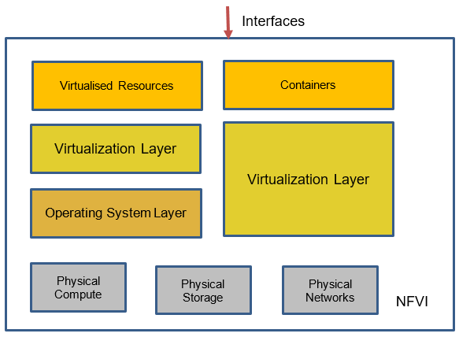
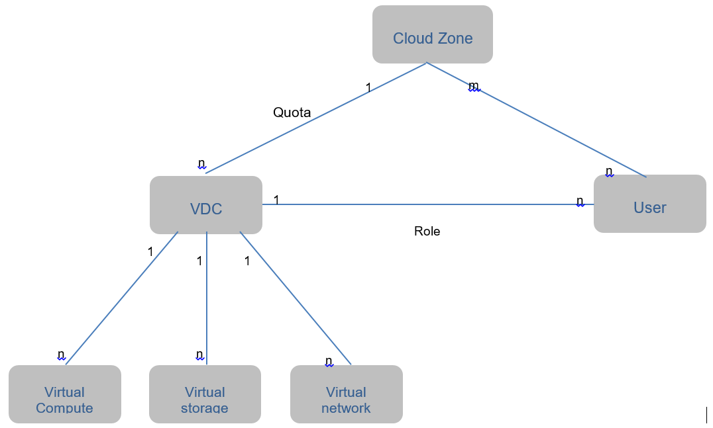

[<< Back](../../ref_model)
# 7	APIs & Interfaces

## Table of Contents
* [7.1 Infra related APIs.](#7.1)
* [7.2 NFVI APIs.](#7.2)
* [7.3 Supporting Enabler Service APIs (not-MVP).](#7.3)
  * [7.3.1 NTP, DNS, etc.](#7.3.1)
  * [7.3.2 Licensing and imaging connectivity.](#7.3.2)
* [7.4 Acceleration Interfaces and APIs (not-MVP).](#7.4)
* [7.5 Tool functionalities needed (not-MVP).](#7.5)
  * [7.5.1 Categorized (not specifically named).](#7.5.1)
  * [7.5.2 Policies and Security related primarily.](#7.5.2)
  * [7.5.3 If embedded in VM.](#7.5.3)
* [7.6 Cloud agnostic (not-MVP).](#7.6)
* [7.7 IPL (Reference Model component only) (not-MVP).](#7.7)
 
In this document’s earlier chapters, the various resources and capabilities of the NFVI have been catalogued and the workloads (VNFs) have been profiled with respect to those capabilities. The intent behind this chapter and an “API Layer” is to similarly provide a single place to catalogue and thereby codify, a common set of open APIs to access (i.e. request, consume, control, etc.) the aforementioned resources, be them directly exposed to the VNFs, or purely internal to the NFVI.

It is a further intent of this chapter and this document to ensure the APIs adopted for CNTT NFVI implementations are open and not proprietary, in support of compatibility, component substitution and ability to realize maximum value from existing and future test heads and harnesses.

While it is the intent of this chapter, when included in a Reference Architecture, to catalogue the APIs, it is not the intent of this chapter to reprint the APIs, as this would make maintenance of the chapter impractical and the length of the chapter disproportionate within the Reference Model document. Instead, the APIs selected for CNTT NFVI implementations and specified in this chapter, will be incorporated by reference and URLs for the latest, authoritative versions of the APIs, provided in the References section of this document.

Although the document does not attempt to reprint the APIs themselves, where appropriate and generally where the mapping of resources and capabilities within the NFVI to objects in APIs would be otherwise ambiguous, this chapter shall provide explicit identification and mapping.

In addition to the raw or base-level NFVI functionality to API and object mapping, it is further the intent to specify an explicit, normalized set of APIs and mappings to control the logical interconnections and relationships between these objects, notably, but not limited to, support of SFC (Service Function Chaining) and other networking and network management functionality.
It is initially proposed to divide the APIs into three primary categories, each reflecting a specific domain relative to the NFVI, as follows, and described in detail in the first three sections of this chapter:

1.	Intra-Infrastructure (NFVI) APIs
2.	NFVI APIs
3.	Enabler Services APIs

**Infra Related**: These APIs are provided and consumed directly by the infra. These APIs are purely internal to the NFVI, and not exposed to VNF workloads.

**NFVI APIs**: These APIs are provided to the VNF workloads (i.e. exposed), by the infra.

**Enabler Services**: These APIs are provided by functions which may be instantiated at higher layers (i.e. in user or workload space), and provide facilities that are required for a majority of VNFs. For example, DHCP, DNS, NTP, DBaaS, etc. Note, in some cases Enabler Services may mirror services provided within the Infra, such as DNS or DHCP. However, the purpose in this section is explicitly to describe instances of those services which are both hosted and consumed above the Infra water mark.

## 7.1	Infra-Related APIs
This is a place holder for Infra Related APIs.

## 7.2	NFVI APIs
The NFVI APIs consist of the externally and internally visible APIs. The externally visible APIs are made available for orchestration and management of workloads and the internally visible APIs for the internal management of the NFVI. Figure 14 is a pictorial representation of the NFVI with some of the interfaces shown.

<b>Figure 7-1:</b> NFVI APIs – external and internal (not all shown).

 
In the abstraction model of the NFVI (Chapter 3.1) a conceptual model of a Tenant (Figure 4) represents the slice of a cloud zone dedicated to a VNF. This slice, the Tenant, is composed of virtual resources being utilized by VNFs within that Tenant. A conceptual data model of a Tenant is shown in Figure 16. The Tenant has an assigned quota of virtual resources, a set of users can perform operations as per their assigned roles, and the Tenant exists within a Cloud Zone. The APIs will specify the allowed operations on the Tenant including its component virtual resources and the different APIs can only be executed by users with the appropriate roles. For example, a Tenant may only be allowed to be created and deleted by Cloud Zone administrators while virtual compute resources could be allowed to be created and deleted by Tenant administrators.

<b>Figure 7-2:</b> Conceptual Tenant data model.

 
For a VNF stack to be created in a Tenant also requires APIs for the management (creation, deletion and operation) of the Tenant, software flavours (Chapter 5), Operating System and VNF images (“Images”), Identity and Authorization (“Identity”), virtual resources, security and the VNF application (“stack”).

A virtual compute resource is created as per the flavour template (specifies the compute, memory and local storage capacity) and is launched using an image with access and security credentials; once launched, it is referred to as a virtual compute instance or just “Instance”). Instances can be launched by specifying the compute, memory and local storage capacity parameters instead of an existing flavour; reference to flavours coves the situation where the capacity parameters are specified. IP addresses and storage volumes can be attached to a running Instance. 

| Resource | Create | List | Attach | Detach | Delete | Notes |
|-----------------|--------|------|--------|--------|--------|-------------------------------------------------------------------------------------------------------------|
| Flavour | + | + |  |  | + |  |
| Image | + | + |  |  | + | Create/delete by appropriate administrators |
| Key pairs | + | + |  |  | + |  |
| Privileges |  |  |  |  |  | Created and managed by Cloud Service Provider(CSP)  administrators |
| Role | + | + |  |  | + | Create/delete by authorized administrators where roles are assigned privileges and mapped to users in scope |
| Security Groups | + | + |  |  | + | Create and delete only by VDC administrators |
| Stack | + | + |  |  | + | Create/delete by VDC users with appropriate role |
| Virtual Storage | + | + | + | + | + | Create/delete by VDC users with appropriate role |
| User | + | + |  | + | + | Create/delete only by VDC administrators |
| Tenant | + | + |  | + | + | Create/delete only by Cloud Zone administrators |
| Virtual compute | + | + |  | + | + | Create/delete by VDC users with appropriate role.  Additional operations would include suspend/unsuspend |
| Virtual network | + | + | + | + | + | Create/delete by VDC users with appropriate role |

<b>Table 7-1:</b> API types for a minimal set of resources.

 
**Table 7-1** specifies a minimal set of API types for a minimal set of resources that are needed to orchestrate VNF workloads. The actual APIs for the listed operations will be specified in the Reference Architectures; each listed operation could have a number of associated APIs with a different set of parameters. For example, create virtual resource using an image or a device.

## 7.3	Enabler Services APIs (not-MVP)

This is a place holder for Enabler Services APIs.
a.	NTP, DNS, etc. – where is the care and feeding of these? Who provides certain features/services within or outside the tenant?
b.	Licensing and imaging connectivity

 
 

