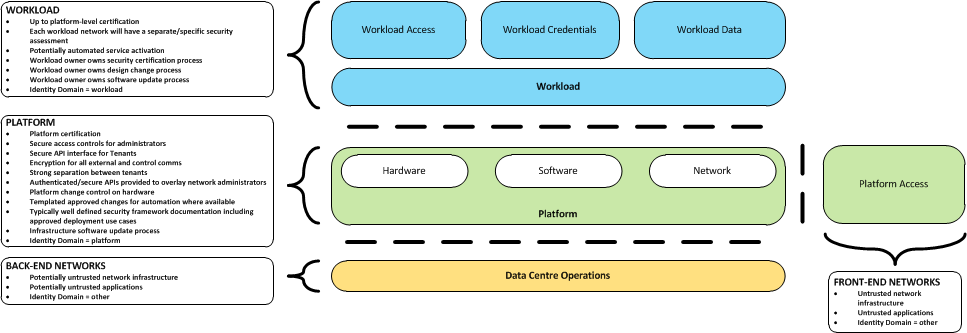
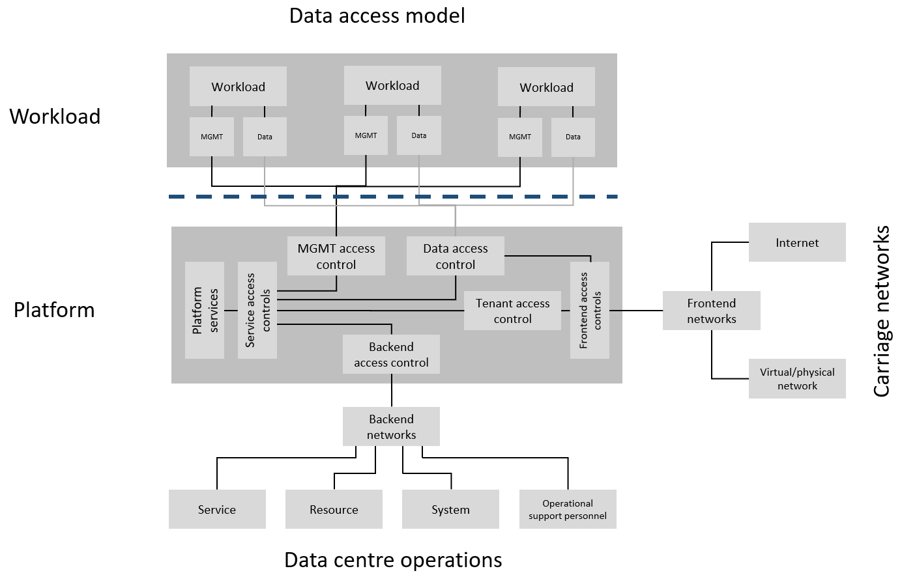

Security
========

Introduction
------------

Security vulnerabilities and attack vectors are everywhere. The Telecom industry and its cloud infrastructures are even
more vulnerable to potential attacks due to the ubiquitous nature of the infrastructures and services combined with the
vital role Telecommunications play in the modern world. The attack vectors are many and varied, ranging from the
potential for exposure of sensitive data, both personal and corporate, to weaponized disruption to the global
telecommunications networks. The threats can take the form of a physical attack on the locations the infrastructure
hardware is housed, to network attacks such as denial of service and targeted corruption of the network service
applications themselves. Whatever the source, any Cloud Infrastructure built needs to be able to withstand attacks in
whatever form they take.

This chapter examines multiple aspects of security as it relates to Cloud Infrastructure and security aspects for
workloads. After discussing security attack vectors, this chapter delves into security requirements. Regarding security
requirements and best practices, specifications and documents are published by standards organisations. A selection of
standards of interest for Cloud Infrastructure security is listed in a dedicated section. The chapter culminates with a
consolidated set of “must” requirements and desired (should) recommendations; it is suggested that operators carefully
evaluate the recommendations for possible implementation.

Potential attack vectors
------------------------

Previously attacks designed to place and migrate workload outside the legal boundaries were not possible using
traditional infrastructure, due to the closed nature of these systems. However, using Cloud Infrastructure, violation
of regulatory policies and laws becomes possible by actors diverting or moving an application from an authenticated and
legal location to another potentially illegal location. The consequences of violating regulatory policies may take the
form of a complete banning of service and/or an exertion of a financial penalty by a governmental agency or through SLA
enforcement. Such vectors of attack may well be the original intention of the attacker in an effort to harm the service
provider. One possible attack scenario can be when an attacker exploits the insecure NF API to dump the records of
personal data from the database in an attempt to violate user privacy. Cloud Infrastructure operators should ensure that
the applications APIs are secure, accessible over a secure network (TLS) under very strict set of security best
practices, and RBAC policies to limit exposure of this vulnerability.

Typical cloud associated attacker tactics have been identified in the widely accepted
`MITRE ATT&CK® Framework <https://www.mitre.org/sites/default/files/publications/mitre-getting-started-with-attack-octob
er-2019.pdf>`__. This framework provides a systematic approach to capture adversarial tactics targeting cloud
environments. Examples of such adversarial tactics are listed in the table below.

+------------------+---------------------------------------------------------------------------------------------------+
| Attacker tactics | Examples                                                                                          |
+==================+===================================================================================================+
| Initial Access   | Compromising user administration accounts that are not protected by multi-factor authentication   |
+------------------+---------------------------------------------------------------------------------------------------+
| Evasion          | Modifying cloud compute instances in the production environment by modifying virtual instances    |
|                  | for attack staging                                                                                |
+------------------+---------------------------------------------------------------------------------------------------+
| Discovery        | Discovering what cloud services are operating and then disabling them in a later stage            |
+------------------+---------------------------------------------------------------------------------------------------+
| Data             | Moving data from the compromised tenant’s production databases to the hacker’s cloud service      |
| Exfiltration     | account or transferring the data out of the Communication Service Provider (CSP) to the           |
|                  | attacker’s private network                                                                        |
+------------------+---------------------------------------------------------------------------------------------------+
| Service Impact   | Creating denial-of-service availability issues by modifying Web Application Firewall (WAF) rules  |
|                  | and compromising APIs and web-based GUIs                                                          |
+------------------+---------------------------------------------------------------------------------------------------+

**Table 7-1:** Cloud attacker tactics - Examples

Security Scope
--------------

In-scope and Out-of-Scope definition
~~~~~~~~~~~~~~~~~~~~~~~~~~~~~~~~~~~~

The scope of the security controls requirements maps to the scope of the Reference Model architecture.

Cloud Infrastructure requirements must cover the virtual infrastructure layer and the hardware infrastructure layer,
including virtual resources, hardware resources, virtual infrastructure manager and hardware infrastructure manager, as
described in Chapter 3.

High level security Requirements
~~~~~~~~~~~~~~~~~~~~~~~~~~~~~~~~

The following diagram shows the different security domains that impact the Reference Model:

.. :name: Reference Model Security Domains

   Reference Model Security Domains

Note: "Platform" refers to the Cloud Infrastructure with all its hardware and software components.

Platform security requirements
^^^^^^^^^^^^^^^^^^^^^^^^^^^^^^

At a high level, the following areas/requirements cover platform security for a particular deployment:

- Platform certification
- Secure access controls for administrators
- Secure API interface for tenants
- Encryption for all external and control communications
- Strong separation between tenants - ensuring network, data, memory and runtime process (CPU running core) isolation
  between tenants
- Authenticated/secure APIs provided to overlay network administrators
- Platform change control on hardware
- Templated approved changes for automation where available
- Typically well-defined security framework documentation including approved deployment use cases
- Infrastructure software update process

Workload security requirements
^^^^^^^^^^^^^^^^^^^^^^^^^^^^^^

At a high level, the following areas/requirements cover workload security for a particular deployment:

- Up to platform-level certification
- Each workload network will need to undertake it own security self-assessment and accreditation, and not inherit a
  security accreditation from the platform
- Potentially automated service activation
- Workload owner owns workload security certification process
- Workload owner owns workload design change process
- Workload owner owns workload software update process

Common Security Standards
~~~~~~~~~~~~~~~~~~~~~~~~~

The Cloud Infrastructure Reference Model and the supporting architectures are not only required to optimally support
networking functions, but they must be designed with common security principles and standards from inception. These best
practices must be applied at all layers of the infrastructure stack and across all points of interconnections (internal
or with outside networks), APIs and contact points with the NFV network functions overlaying or interacting with that
infrastructure.

A good place to start to understand the security requirements is to use the widely accepted definitions and core
principles developed by the OWASP, Open Web Application Security Project:

- Confidentiality – Only allow access to data for which the user is permitted.
- Integrity – Ensure data is not tampered with or altered by unauthorised users.
- Availability – ensure systems and data are available to authorised users when they need it.

These 3 principles are complemented for Cloud Infrastructure security by:

- Authenticity – The ability to confirm the users are in fact valid users with the correct rights to access the systems
  or data.

Standards organisations with recommendations and best practices, and certifications that need to be taken into
consideration include the following examples. However this is by no means an exhaustive list, just some of the more
important standards in current use.

- Center for Internet Security - `https://www.cisecurity.org/ <https://www.cisecurity.org/>`__

- Cloud Security Alliance - `https://cloudsecurityalliance.org/ <https://cloudsecurityalliance.org/>`__

- Open Web Application Security Project - `https://www.owasp.org <https://www.owasp.org>`__

- The National Institute of Standards and Technology (NIST) with the special publications:

  - NIST SP 800-123 `Guide to General Server Security <https://nvlpubs.nist.gov/nistpubs/Legacy
    /SP/nistspecialpublication800-123.pdf>`__

  - NIST SP 800-204A `Building Secure Microservices-based Applications Using Service-Mesh Architecture
    <https://nvlpubs.nist.gov/nistpubs/SpecialPublications/NIST.SP.800-204A.pdf>`__

  - NIST SP 800-204B `Attribute-based Access Control for Microservices-based Applications Using a Service Mesh
    <https://csrc.nist.gov/publications/detail/sp/800-204b/final>`__

  - NIST SP 800-207 `Zero Trust Architecture
    <https://nvlpubs.nist.gov/nistpubs/SpecialPublications/NIST.SP.800-207.pdf>`__

  - NIST SP 800-218 `Secure Software Development Framework (SSDF)
    <https://doi.org/10.6028/NIST.SP.800-218>`__

- FedRAMP Certification `https://www.fedramp.gov/ <https://www.fedramp.gov/>`__

- ETSI Cyber Security Technical Committee (TC CYBER) - `https://www.etsi.org/committee/cyber <https://www.etsi.org/commi
  ttee/cyber>`__

- `ETSI Industry Specification Group Network Functions Virtualisation (ISG NFV)
  <https://www.etsi.org/technologies/nfv>`__ and its Security Working Group NFV-SEC

- ISO (the International Organization for Standardization) and IEC (the International Electrotechnical Commission) -
  `www.iso.org <https://www.iso.org>`__. The following ISO standards are of particular interest for NFVI

  - ISO/IEC 27002:2013 - ISO/IEC 27001 are the international Standard for best-practice information security
    management systems (ISMSs)
  - ISO/IEC 27032 - ISO/IEC 27032 is the international Standard focusing explicitly on cybersecurity
  - ISO/IEC 27035 - ISO/IEC 27035 is the international Standard for incident management
  - ISO/IEC 27031 - ISO/IEC 27031 is the international Standard for ICT readiness for business continuity

In mobile network field, the GSM Association (`GSMA <https://www.gsma.com/>`__) and its Fraud and Security working group
of experts have developed a set of documents specifying how to secure the global mobile ecosystem.

- The document “Baseline Security controls”, `FS.31 v2.0 <https://www.gsma.com/security/resources/fs-31-gsma-baseline-se
  curity-controls/>`__ :cite:p:`gsmafs31`, published in February 2020, is a practical guide intended for operators and stakeholders
  to check mobile network’s internal security. It lists a set of security controls from business controls (including
  security roles, organizational policies, business continuity management…) to technological controls (for user
  equipment, networks, operations…) covering all areas of mobile network, including Cloud Infrastructure. A checklist of
  questions allows to improve the security of a deployed network.
- The document "Network Equipment Security Assurance Scheme – Development and Lifecycle Security Requirements" :cite:p:`gsmafs16`,
  is part of a set of documents aiming to build a security assurance scheme
  for network equipment. Focusing on critical controls, it defines a set of requirements
  to be met by vendors development and product lifecycle processes.

The GSMA security activities are currently focussed around 5G services and the new challenges posed by network functions
virtualisation and open source software. The 2 following documents are in the scope of Cloud Infrastructure security:

- The white paper `“Open Networking & the Security of Open Source Software deployment” <https://www.gsma.com/futurenetwo
  rks/resources/open-networking-the-security-of-open-source-software-deployment/>`__ :cite:p:`gsmaopensourcesecurity`,
  deals with open source software security, it highlights the importance of layered security defences and lists
  recommendations and security concepts able to secure deployments.
- The “5G Security Guide” :cite:p:`gsmafs40` (non-binding Permanent Reference Document), covers 5G security,
  in a holistic way, from user equipment to networks. The document describes the new security features in 5G.
  It includes a dedicated section on the impact of Cloud on 5G security with recommendations on virtualisation, cloud
  native applications and containerisation security.

Cloud Infrastructure Security
-----------------------------

General Platform Security
~~~~~~~~~~~~~~~~~~~~~~~~~

The security certification of the platform will typically need to be the same, or higher, than the workload
requirements.

The platform supports the workload, and in effect controls access to the workload from and to external endpoints such as
carriage networks used by workloads, or by Data Centre Operations staff supporting the workload, or by tenants accessing
workloads. From an access security perspective, the following diagram shows where different access controls will operate
within the platform to provide access controls throughout the platform:

.. :name: Reference Model Access Controls

   Reference Model Access Controls

High-level functions of access controls
^^^^^^^^^^^^^^^^^^^^^^^^^^^^^^^^^^^^^^^

- **MGMT ACCESS CONTROLS** - Platform access to workloads for service management. Typically all management and
  control-plane traffic is encrypted.
- **DATA ACCESS CONTROLS** - Control of east-west traffic between workloads, and control of north-south traffic between
  the NF and other platform services such as front-end carriage networks and platform services. Inherently strong
  separation between tenants is mandatory.
- **SERVICES ACCESS CONTROLS** - Protects platform services from any platform access
- **BACK-END ACCESS CONTROLS** - Data Centre Operations access to the platform, and subsequently, workloads. Typically
  stronger authentication requirements such as (Two-Factor Authentication) 2FA, and using technologies such as
  Role-Based Access Control (RBAC) and encryption. Application Programming Interface (API) gateways may be required for
  automated/script-driven processes.
- **FRONT-END ACCESS CONTROLS** - Protects the platform from malicious carriage network access, and provides
  connectivity for specific workloads to specific carriage networks. Carriage networks being those that are provided as
  public networks and operated by carriers, and in this case with interfaces that are usually sub, or virtual networks.
- **TENANT ACCESS CONTROLS** - Provides appropriate tenant access controls to specific platform services, and tenant
  workloads - including Role-Based Access Control (RBAC), authentication controls as appropriate for the access
  arrangement, and Application Programming Interface (API) gateways for automated/script-driven processes.

Cloud Infrastructure general security requirements
^^^^^^^^^^^^^^^^^^^^^^^^^^^^^^^^^^^^^^^^^^^^^^^^^^

**System Hardening**

- Adhering to the principle of least privilege, no login to root on any platform systems (platform systems are those
  that are associated with the platform and include systems that directly or indirectly affect the viability of the
  platform) when root privileges are not required.
- Ensure that all the platform's components (including hypervisors, VMs, etc.) are kept up to date with the latest
  patch.
- In order to tightly control access to resources and protect them from malicious access and introspection, Linux
  Security Modules such as SELinux should be used to enforce access rules.

**Vulnerability Management**

- Security defects must be reported.
- The Cloud Infrastructure components must be continuously analysed from deployment to runtime. The Cloud Infrastructure
  must offer tools to check the code libraries and all other code against the
  `Common Vulnerabilities and Exposures (CVE) databases <https://cve.mitre.org/>`__ to identify the presence of any
  known vulnerabilities. The CVE is a list of publicly disclosed vulnerabilities and exposures that is maintained by
  `MITRE <https://www.mitre.org/>`__. Each vulnerability is characterised by an identifier, a description, a date, and
  comments.
- When a vulnerability is discovered on a component (from Operating Systems to virtualisation layer components), the
  remediation action will depend on its severity. The `Common Vulnerability Scoring System (CVSS)
  <https://www.first.org/cvss/>`__ allows to calculate a vulnerability score. It is an open framework widely used in
  vulnerability management tools. CVSS is owned and managed by FIRST (Forum of Incident Response and Security Teams).
  The CVSS consists of three metric groups: Base, Temporal, and Environmental. The Base metrics produce a score ranging
  from 0 to 10, this score can then be refined using Temporal and Environmental metrics. The numerical score can be
  translated into a severity qualitative representation: low, medium, high, or critical. The severity score (or the
  associated qualitative representation) allows organisations to prioritise the remediation activities, high scores
  mandating a fast response time. The vulnerable components must then be patched, replaced, or their access must be
  restricted.
- Security patches must be obtained from an authorised source in order to ensure their integrity. Patches must be tested
  and validated in a pre-production environment before being deployed into production.

**Platform access**

- Restrict traffic to only traffic that is necessary, and deny all other traffic, including traffic from and to
  'Back-end'.
- Provide protections between the Internet and any workloads including web and volumetrics attack preventions.
- All host to host communications within the cloud provider network are to be cryptographically protected in transit.
- Use cryptographically-protected protocols for administrative access to the platform.
- Data Centre Operations staff and systems must use management protocols that limit security risk such as SNMPv3,
  SSH v2, ICMP, NTP, syslog, and TLS v1.2 or higher.
- Processes for managing platform access control filters must be documented, followed, and monitored.
- Role-Based Access Control (RBAC) must apply for all platform systems access.
- All APIs access must use TLS protocol, including back-end APIs.

**Security Hardware Assist for Data in Use**

- Server hardware architectures offer various technologies to assist protecting data in use. The following table
  categorizes such technologies.

+----------------------+----------------------+-------------------------+----------------------+-----------------------+
| HW technology        | Which security       | Where it must be        | How to operationally | How to assure benign  |
|                      | threat it mitigates  | enabled                 | activate             | workloads are run     |
+======================+======================+=========================+======================++======================+
| Memory encryption on | Protects data going  | Server HW and BIOS      | Configure BIOS. On   | Performed by          |
| the level of whole   | between CPU and      |                         | virtualised software | application           |
| physical server      | memory DIMMs         |                         | infrastructure label | scheduling using      |
|                      |                      |                         | nodes to influence   | node labels.          |
|                      |                      |                         | scheduling.          |                       |
+----------------------+----------------------+-------------------------+----------------------+-----------------------+
| Memory encryption on | HW-protects data     | Server HW, BIOS, and    | Configure BIOS and   | Remote attestation    |
| the level of VMs     | between VMs          | hypervisor and guests   | hypervisor. On       | of freshly spun up    |
|                      |                      | (paravirtualised        | virtualized software | VM, to provide        |
|                      |                      | generally only in guest | infrastructure label | measurements of the   |
|                      |                      | BIOS). Attestation if   | nodes to influence   | VM and of platform    |
|                      |                      | assurance of workload   | scheduling.          | patch level.          |
|                      |                      | required.               |                      |                       |
+----------------------+----------------------+-------------------------+----------------------+-----------------------+
| Secure enclaves      | HW-protects specific | Server HW and BIOS,     | Configure BIOS, and  | Remote attestation of |
| within application   | application code and | hypervisor if used,     | hypervisor if used.  | freshly spun up       |
|                      | data in memory, from | device plugin if        | If Kubernetes is     | enclave, to provide   |
|                      | processes running at | Kubernetes is used, and | used, then pod       | measurements of the   |
|                      | higher privilege     | in application.         | descriptor requests  | enclave and of        |
|                      | levels like OS or    | Attestation if          | for such resource.   | platform patch level. |
|                      | hypervisor           | assurance of workload   |                      |                       |
|                      |                      | required.               |                      |                       |
+----------------------+----------------------+-------------------------+----------------------+-----------------------+

- Using computing accelerators such as FPGA or GPU that are connected via an I/O link such as PCI Express breaks the
  confidentiality property unless HW-assisted encryption of the I/O transfers, runtime encryption of the accelerated
  workload, and attestation of the accelerated workload can be guaranteed.

**Workload security**

- Restrict traffic to (and from) the workload to only traffic that is necessary, and deny all other traffic.
- Support zoning within a tenant workload - using application-level filtering.
- Not expose tenant internal IP address details to another tenant.
- All production workloads must be separated from all non-production workloads including separation between non-hosted
  non-production external networks.

**Confidentiality and Integrity**

- All data persisted to primary, replica, or backup storage is to be encrypted.

**Monitoring and security audit**

- All platform security logs are to be time synchronised.
- Logs are to be regularly scanned for events of interest.
- The cloud services must be regularly vulnerability and penetration tested.

**Platform provisioning and LCM**

- A platform change management process that is documented, well communicated to staff and tenants, and rigorously
  followed.
- A process to check change management adherence that is implemented, and rigorously followed.
- An approved system or process for last resort access must exist for the platform.
- Where there are multiple hosting facilities used in the provisioning of a service, network communications between the
  facilities for the purpose of backup, management, and workload communications are cryptographically protected in
  transit between data centre facilities.
- Continuous Cloud security compliance is mandatory.
- An incident response plan must exist for the platform.

Platform ‘back-end’ access security
~~~~~~~~~~~~~~~~~~~~~~~~~~~~~~~~~~~

- Validate and verify the integrity of resources management requests coming from a higher orchestration layer to the
  Cloud Infrastructure manager.

Platform ‘front-end’ access security
~~~~~~~~~~~~~~~~~~~~~~~~~~~~~~~~~~~~

- Front-end network security at the application level will be the responsibility of the workload, however the platform
  must ensure the isolation and integrity of tenant connectivity to front-end networks.
- The front-end network may provide (Distributed Denial Of Service) DDoS support.

Infrastructure as a Code security
~~~~~~~~~~~~~~~~~~~~~~~~~~~~~~~~~

Infrastructure as a Code (IaaC) (or equivalently called Infrastructure as Code IaC) refers to the software used for the
declarative management of cloud infrastructure resources. In order to dynamically address user requirements, release
features incrementally, and deliver at a faster pace, DevSecOps teams utilise best practices including continuous
integration and continuous delivery and integrate information security controls and scanning tools into these processes,
with the aim of providing timely and meaningful feedback including identifying vulnerabilities and security policy
violations. With this automated security testing and analysis capabilities it will be of critical value to detecting
vulnerabilities early and maintaining a consistent security policy.

Because of the extremely high complexity of modern telco cloud infrastructures, even minor IaaC code changes may lead to
disproportionate and sometime disastrous downstream security and privacy impacts. Therefore, integration of security
testing into the IaaC software development pipeline requires security activities to be automated using security tools
and integrated with the native DevOps and DevSecOps tools and procedures.

The DevSecOps Automation best practice advocates implementing a framework for security automation and programmatic
execution and monitoring of security controls to identify, protect, detect, respond, and recover from cyber threats. The
framework used for the IaaC security is based on, the joint publication of Cloud Security Alliance (CSA) and SAFECode,
"`The Six Pillars of DevSecOps: Automation (2020) <https://safecode.org/resource-secure-development-practices/the-six-pillars-of-devsecops-automation>`__"
:cite:p:`safecodesixpillarsdevsecops`. The document utilises the base definitions and constructs from
`ISO 27000 <https://www.iso.org/standard/73906.html>`__ :cite:p:`isoiec270002018`, and CSA's
`Information Security Management through Reflexive Security <https://cloudsecurityalliance.org/artifacts/information-sec
urity-management-through-reflexive-security/>`__ :cite:p:`csaeflexivesec`.

The framework identifies the following five distinct stages:

1. Secure design and architecture
2. Secure coding (Developer IDE and Code Repository)
3. Continuous build, integration and test
4. Continuous delivery and deployment
5. Continuous monitoring and runtime defence

Triggers and checkpoints define transitions within stages. When designing DevSecOps security processes, one needs to
keep in mind, that when a trigger condition is met, one or more security activities are activated. The outcomes of those
security activities need to determine whether the requirements of the process checkpoint are satisfied. If the outcome
of the security activities meets the requirements, the next set of security activities are performed as the process
transitions to the next checkpoint, or, alternatively, to the next stage if the checkpoint is the last one in the
current stage. If, on the other hand, the outcome of the security activities does not meet the requirements, then the
process should not be allowed to advance to the next checkpoint. In the section
":ref:`chapters/chapter07:consolidated security requirements`", the IaaC
security activities are presented as security requirements mapped to particular stages and trigger points.

Security of Production and Non-production Environments
~~~~~~~~~~~~~~~~~~~~~~~~~~~~~~~~~~~~~~~~~~~~~~~~~~~~~~

Telecommunications operators often focus their security efforts on the production environments actively used by their
customers and/or their employees. This is of course critical because a breach of such systems can seriously damage the
company and its customers. In addition, production systems often contain the most valuable data, making them attractive
targets for intruders. However, an insecure non-production (development, testing) environment can also create real problems
because they may leave a company open to corporate espionage, sabotage by competitors, and theft of sensitive data.

Security is about mitigating risk. If operators do not have the same level of security regime in their non-production
environments compared to production, then an additional level of risk may be introduced. Especially if such
non-production environments accept outside connections (for example for suppliers or partners, which is quite normal in
complex telco ecosystems), there is a real need to monitor security of these non-production environments. The gold
standard then is to implement the same security policies in production and non-production infrastructure, which would
reduce risk and typically simplify operations by using the same control tools and processes. However, for many practical
reasons some of the security monitoring rules may differ. As an example, if a company maintains a separate, isolated
environment for infrastructure software development experimentation, the configuration monitoring rules may be relaxed
in comparison with the production environment, where such experimentation is not allowed. Therefore, in this document,
when dealing with such dilemma, the focus has been placed on those non-production security requirements that must be on
the same level as in the production environment (typically of **must** type), leaving relaxed requirements (typically of
**should** or **may**) in cases there is no such necessity.

In the context of the contemporary telecommunication technology, the cloud infrastructure typically is considered
Infrastructure as a Code (IaaC). This fact implies that many aspects of code related security automatically apply to
IaaC. Security aspects of IaaC in the telco context is discussed in the previous section
":ref:`chapters/chapter07:infrastructure as a code security`",
which introduces the relevant framework for security automation and programmatic execution and monitoring of
security controls. Organisations need to identify which of the stages or activities within these stages should be
performed within the non-production versus production environments. This mapping will then dictate which security
activities defined for particular stages and triggers (e.g, vulnerability tests, patch testing, penetration tests) are
mandatory, and which can be left as discretionary.

Workload Security - Vendor Responsibility
-----------------------------------------

Software Hardening
~~~~~~~~~~~~~~~~~~

- No hard-coded credentials or clear text passwords in code and images. Software must support configurable, or industry
  standard, password complexity rules.
- Software should be independent of the infrastructure platform (no OS point release dependencies to patch).
- Software must be code signed and all individual sub-components are assessed and verified for EULA (End-user License
  Agreement) violations.
- Software should have a process for discovery, classification, communication, and timely resolution of security
  vulnerabilities (i.e.; bug bounty, penetration testing/scan findings, etc.).
- Software should support recognised encryption standards and encryption should be decoupled from software.
- Software should have support for configurable banners to display authorised use criteria/policy.

Port Protection
~~~~~~~~~~~~~~~

- Unused software and unused network ports should be disabled by default.

Software Code Quality and Security
~~~~~~~~~~~~~~~~~~~~~~~~~~~~~~~~~~

- Vendors should use industry recognized software testing suites

  - Static and dynamic scanning.
  - Automated static code review with remediation of Medium/High/Critical security issues. The tool used for static
    code analysis and analysis of code being released must be shared.
  - Dynamic security tests with remediation of Medium/High/Critical security issues. The tool used for Dynamic security
    analysis of code being released must be shared.
  - Penetration tests (pen tests) with remediation of Medium/High/Critical security issues.
  - Methodology for ensuring security is included in the Agile/DevOps delivery lifecycle for ongoing feature
    enhancement/maintenance.

Alerting and monitoring
~~~~~~~~~~~~~~~~~~~~~~~

- Security event logging: all security events must be logged, including informational.
- Privilege escalation must be detected.

Logging
~~~~~~~

-  Logging output should support customizable Log retention and Log rotation.

Workload Security - Cloud Infrastructure Operator Responsibility
----------------------------------------------------------------

The Operator’s responsibility is to not only make sure that security is included in all the vendor supplied
infrastructure and NFV components, but it is also responsible for the maintenance of the security functions from an
operational and management perspective. This includes but is not limited to securing the following elements:

- Maintaining standard security operational management methods and processes.
- Monitoring and reporting functions.
- Processes to address regulatory compliance failure.
- Support for appropriate incident response and reporting.
- Methods to support appropriate remote attestation certification of the validity of the security components,
  architectures, and methodologies used.

Remote Attestation/openCIT
~~~~~~~~~~~~~~~~~~~~~~~~~~

Cloud Infrastructure operators must ensure that remote attestation methods are used to remotely verify the trust status
of a given Cloud Infrastructure platform. The basic concept is based on boot integrity measurements leveraging the
Trusted Platform Module (TPM) built into the underlying hardware. Remote attestation can be provided as a service, and
may be used by either the platform owner or a consumer/customer to verify that the platform has booted in a trusted
manner. Practical implementations of the remote attestation service include the Open Cloud Integrity Tool (Open CIT).
Open CIT provides ‘Trust’ visibility of the Cloud Infrastructure and enables compliance in Cloud Datacenters by
establishing the root of trust and builds the chain of trust across hardware, operating system, hypervisor, VM, and
container. It includes asset tagging for location and boundary control. The platform trust and asset tag attestation
information is used by Orchestrators and/or Policy Compliance management to ensure workloads are launched on trusted and
location/boundary compliant platforms. They provide the needed visibility and auditability of infrastructure in both
public and private cloud environments.

Workload Image
~~~~~~~~~~~~~~

Only workload images from trusted sources must be used. Secrets must be stored outside of the images.

It is easy to tamper with workload images. It requires only a few seconds to insert some malware into a workload image
file while it is being uploaded to an image database or being transferred from an image database to a compute node. To
guard against this possibility, workload images must be cryptographically signed and verified during launch time. This
can be achieved by setting up a signing authority and modifying the hypervisor configuration to verify an image’s
signature before they are launched.

To implement image security, the workload operator must test the image and supplementary components verifying that
everything conforms to security policies and best practices. Use of Image scanners such as OpenSCAP or Trivy to
determine security vulnerabilities is strongly recommended.

CIS Hardened Images should be used whenever possible. CIS provides, for example, virtual machine hardened images based
upon CIS benchmarks for various operating systems. Another best practice is to use minimalist base images whenever
possible.

Images are stored in registries. The images registry must contain only vetted images. The registry must remain a source
of trust for images over time; images therefore must be continuously scanned to identify vulnerabilities and out-of-date
versions as described previously. Access to the registry is an important security risk. It must be granted by a
dedicated authorisation and through secure networks enforcing authentication, integrity and confidentiality.

Networking Security Zoning
~~~~~~~~~~~~~~~~~~~~~~~~~~

Network segmentation is important to ensure that applications can only communicate with the applications they are
supposed to. To prevent a workload from impacting other workloads or hosts, it is a good practice to separate workload
traffic and management traffic. This will prevent attacks by VMs or containers breaking into the management
infrastructure. It is also best to separate the VLAN traffic into appropriate groups and disable all other VLANs that
are not in use. Likewise, workloads of similar functionalities can be grouped into specific zones and their traffic
isolated. Each zone can be protected using access control policies and a dedicated firewall based on the needed security
level.

Recommended practice to set network security policies following the principle of least privileged, only allowing
approved protocol flows. For example, set 'default deny' inbound and add approved policies required for the
functionality of the application running on the NFV Infrastructure.

Volume Encryption
~~~~~~~~~~~~~~~~~

Virtual volume disks associated with workloads may contain sensitive data. Therefore, they need to be protected. Best
practice is to secure the workload volumes by encrypting them and storing the cryptographic keys at safe locations.
Encryption functions rely on a Cloud Infrastructure internal key management service. Be aware that the decision to
encrypt the volumes might cause reduced performance, so the decision to encrypt needs to be dependent on the
requirements of the given infrastructure. The TPM (Trusted Platform Module) module can also be used to securely store
these keys. In addition, the hypervisor should be configured to securely erase the virtual volume disks in the event of
application crashes or is intentionally destroyed to prevent it from unauthorized access.

For sensitive data encryption, when data sovereignty is required, an external Hardware Security Module (HSM) should be
integrated in order to protect the cryptographic keys. A HSM is a physical device which manages and stores secrets.
Usage of a HSM strengthens the secrets security. For 5G services, GSMA FASG strongly recommends the implementation of a
HSM to secure the storage of UICC (Universal Integrated Circuit Card) credentials.

Root of Trust for Measurements
~~~~~~~~~~~~~~~~~~~~~~~~~~~~~~

The sections that follow define mechanisms to ensure the integrity of the infrastructure pre-boot and post-boot
(running). The following defines a set of terms used in those sections.

- The hardware root of trust helps with the pre-boot and post-boot security issues.
- Unified Extensible Firmware Interface (UEFI) adheres to standards defined by an industry consortium. Vendors
  (hardware, software) and solution providers collaborate to define common interfaces, protocols and structures for
  computing platforms.
- Platform Configuration Register (PCR) is a memory location in the TPM used to store TPM Measurements (hash values
  generated by the SHA-1 standard hashing algorithm). PCRs are cleared only on TPM reset. UEFI defines 24 PCRs of which
  the first 16, PCR 0 - PCR 15, are used to store measures created during the UEFI boot process.
- Root of Trust for Measurement (RTM) is a computing engine capable of making integrity measurements.
- Core Root of Trust for Measurements (CRTM) is a set of instructions executed when performing RTM.
- Platform Attestation provides proof of validity of the platform’s integrity measurements. Please see Section
  ":ref:`chapters/chapter07:remote attestation/opencit`".

Values stored in a PCR cannot be reset (or forged) as they can only be extended. Whenever a measurement is sent to a
TPM, the hash of the concatenation of the current value of the PCR and the new measurement is stored in the PCR. The PCR
values are used to encrypt data. If the proper environment is not loaded which will result in different PCR values, the
TPM will be unable to decrypt the data.

Static Root of Trust for Measurement
^^^^^^^^^^^^^^^^^^^^^^^^^^^^^^^^^^^^

Static Root of Trust for Measurement (SRTM) begins with measuring and verifying the integrity of the BIOS firmware.
It then measures additional
firmware modules, verifies their integrity, and adds each component’s measure to an SRTM value. The final value
represents the expected state of boot path loads. SRTM stores results as one or more values stored in PCR storage. In
SRTM, the CRTM resets PCRs 0 to 15 only at boot.

Using a Trusted Platform Module (TPM), as a hardware root of trust, measurements of platform components, such as
firmware, bootloader, OS kernel, can be securely stored and verified.
Cloud Infrastructure operators should ensure that the TPM support is enabled in the platform firmware, so that platform
measurements are correctly recorded during boot time.

A simple process would work as follows;

1. The BIOS CRTM (Bios Boot Block) is executed by the CPU and used to measure the BIOS firmware.
2. The SHA1 hash of the result of the measurement is sent to the TPM.
3. The TPM stores this new result hash by extending the currently stored value.
4. The hash comparisons can validate settings as well as the integrity of the modules.

Cloud Infrastructure operators should ensure that OS kernel measurements can be recorded by using a TPM-aware bootloader
(e.g. tboot, see `https://sourceforge.net/projects/tboot/ <https://sourceforge.net/projects/tboot/>`__ or shim, see
`https://github.com/rhboot/shim <https://github.com/rhboot/shim>`__), which can extend the root of trust up to the
kernel level.

The validation of the platform measurements can be performed by TPM’s launch control policy (LCP) or through the remote
attestation server.

Dynamic Root of Trust for Measurement
^^^^^^^^^^^^^^^^^^^^^^^^^^^^^^^^^^^^^

In Dynamic Root of Trust for Measurement (DRTM), the RTM for the running environment are stored in PCRs starting with
PCR 17.

If a remote attestation server is used to monitor platform integrity, the operators should ensure that attestation is
performed periodically or in a timely manner.
Additionally, platform monitoring can be extended to monitor the integrity of the static file system at run-time by
using a TPM aware kernel module, such as Linux IMA (Integrity Measurement Architecture), see
`https://sourceforge.net/p/linux-ima/wiki/Home <https://sourceforge.net/p/linux-ima/wiki/Home>`__, or by using the trust
policies (see `https://github.com/opencit/opencit/wiki/Open-CIT-3.2-Product-Guide <https://github.com/opencit/opencit/wi
ki/Open-CIT-3.2-Product-Guide>`__) functionality of OpenCIT.

The static file system includes a set of important files and folders which do not change between reboots during the
lifecycle of the platform.
This allows the attestation server to detect any tampering with the static file system during the runtime of the
platform.

Zero Trust Architecture
~~~~~~~~~~~~~~~~~~~~~~~

The sections ":ref:`chapters/chapter07:remote attestation/opencit`" and
":ref:`chapters/chapter07:root of trust for measurements`" provide
methods to ensure the integrity of the infrastructure. The Zero Trust concept moves a step forward enabling to build
secure by design cloud infrastructure, from hardware to applications. The adoption of Zero Trust principles mitigates
the threats and attacks within an enterprise, a network or an infrastructure, ensuring a fine grained segmentation
between each component of the system.

Zero Trust Architecture (ZTA), described in `NIST SP 800-207 publication <https://nvlpubs.nist.gov/nistpubs/SpecialPubli
cations/NIST.SP.800-207.pdf>`__ :cite:p:`nistsp800207`, assumes there is no implicit trust granted to assets or user accounts whatever
their location or ownership. Zero trust approach focuses on protecting all types of resources: data, services, devices,
infrastructure components, virtual and cloud components. Trust is never granted implicitly, and must be evaluated
continuously.

ZTA principles applied to Cloud infrastructure components are the following:

- Adopt least privilege configurations
- Authentication and authorization required for each entity, service, or session
- Fine grained segmentation
- Separation of control plane and data plane
- Secure internal and external communications
- Monitor, test, and analyse security continuously

Zero Trust principles should also be applied to cloud-native applications. With the increasing use of these applications
which are designed with microservices and deployed using containers as packaging and Kubernetes as an orchestrator, the
security of east-west communications between components must be carefully addressed. The use of secured communication
protocols brings a first level of security, but considering each component as non-trustworthy will minimize the risk for
applications to be compromised. A good practice is to implement the proxy-based service mesh which will provide a
framework to build a secured environment for microservices-based applications, offering services such as service
discovery, authentication and authorisation policies enforcement, network resilience, and security monitoring
capabilities. The two documents,
`NIST SP 800-204A <https://nvlpubs.nist.gov/nistpubs/SpecialPublications/NIST.SP.800-204A.pdf>`__\ (Building Secure
Microservices-based Applications Using Service-Mesh Architecture) and
`NIST SP 800-204B <https://csrc.nist.gov/publications/detail/sp/800-204b/final>`__\ (Attribute-based Access Control for
Microservices-based Applications Using a Service Mesh), describe service mesh, and provide guidance for service mesh
components deployment.

Software Supply Chain Security
------------------------------

Software supply chain attacks are increasing worldwide and can cause serious damages. Many enterprises and
organisations are experiencing these threats. Aqua security's experts estimated that `software supply chain attacks
have more than tripled in 2021
<https://www.aquasec.com/news/aqua-securitys-argon-experts-find-software-supply-chain-attacks-more-than-tripled-in-2021/>`__.
Reuters reported in August 2021 that the `ransomware affecting Kaseya Virtual System Administration product
<https://www.reuters.com/technology/kaseya-ransomware-attack-sets-off-race-hack-service-providers-researchers-2021-08-03/>`__
caused downtime for over 1500 companies. In the case of the `backdoor inserted in codecov software
<https://www.reuters.com/technology/codecov-hackers-breached-hundreds-restricted-customer-sites-sources-2021-04-19/>`__,
hundreds of customers were affected. The Solarwinds attack detailed in `Defending against SolarWinds attacks
<https://www.techtarget.com/searchsecurity/news/252494495/Defending-against-SolarWinds-attacks-What-can-be-done>`__
is another example of how software suppliers are targeted and, by rebound, their customers affected.
Open-source code weaknesses can also be utilised by attackers, the
`Log4J <https://www.cisa.gov/uscert/apache-log4j-vulnerability-guidance>`__ vulnerability, impacting many
applications, is a recent example in this field. When addressing cyber security, the vulnerabilities of
software supply chain are often not taken into account. Some governments are already alerting and requesting
actions to face these risks. The British government is hardening the law and standards of cyber security for
the supply chain. The US government requested actions to enhance the software supply chain security.
The security of the software supply chain is a challenge also pointed out by the European Network and
Information Security Agency, ENISA, in the report `NFV Security in 5G - Challenges and Best Practices
<https://www.enisa.europa.eu/publications/nfv-security-in-5g-challenges-and-best-practices>`__.

Software security
~~~~~~~~~~~~~~~~~

Software supply chain security is crucial and is made complex by the greater attack surface provided by the
many different supply chains in virtualised, containerised, and edge environments.
All software components must be trusted, from commercial software, open-source
code to proprietary software, as well as the integration of these components.
The SAFECode white paper `"Managing Security Risks Inherent in the Use of Third-party Components"
<https://safecode.org/wp-content/uploads/2017/05/SAFECode_TPC_Whitepaper.pdf>`__ provides
a detailed risk management approach.

To secure software code, the following methods must be applied:

-  Use best practices coding such as design pattern recommended in the `Twelve-Factor App <https://12factor.net/>`__
   or `OWASP "Secure Coding Practices - Quick Reference Guide" <https://owasp.org/>`__
-  Do threat modelling, as described in the document `"Tactical Threat Modeling"
   <https://safecode.org/wp-content/uploads/2017/05/SAFECode_TM_Whitepaper.pdf>`__ published by SAFECode
-  Use trusted, authenticated and identified software images that are provided by authenticated software
   distribution portals
-  Require suppliers to provide a Software Bill of Materials to identify all the components part of their product's
   software releases with their dependencies, and eventually identify the open source modules
-  Test the software in a pre-production environment to validate integration
-  Detect vulnerabilities using security tools scanning and CVE (Common Vulnerabilities and Exposures) and apply
   remediation actions according to their severity rating
-  Report and remove vulnerabilities by upgrading components using authenticated software update distribution portals
-  Actively monitor the open source software repositories to determine if new versions have been released that address
   identified vulnerabilities discovered in the community
-  Secure the integration process by securing the software production pipeline
-  Adopt a DevSecOps approach and rely on testing automation throughout the software build, integration, delivery,
   deployment, and runtime operation to perform automatic security check, as described in section ”Infrastructure
   as a Code Security”

Open-Source Software Security
~~~~~~~~~~~~~~~~~~~~~~~~~~~~~

Open-source code is present in Cloud Infrastructure software from BIOS, host Operating System to virtualisation layer
components, the most obvious being represented by Linux, KVM, QEMU, OpenStack, and Kubernetes. Workloads components
can also be composed of open source code. The proportion of open-source code to an application source code can vary.
It can be partial or total, visible or not. Open-source code can be upstream code coming directly from open-source
public repositories or code within a commercial application or network function.

The strength of open-source code is the availability of code source developed by a community which maintains and improves it.
Open-source code integration with application source code helps to develop and produce applications faster.
But, in return, it can introduce security risks if a risk management DevSecOps approach is not implemented.
The GSMA white paper  `"Open Networking & the Security of Open Source Software Deployment - Future Networks"
<https://www.gsma.com/futurenetworks/resources/open-networking-the-security-of-open-source-software-deployment/>`__
alerts on these risks and addresses the
challenges coming with open-source code usage. Amongst these risks for security, we can mention a poor code quality
containing security flaws, an obsolete code with known vulnerabilities, and the lack of knowledge of open source
communities’ branches activity. An active branch will come with bugs fixes, it will not be the case with an inactive
branch. The GSMA white paper develops means to mitigate these security issues.

Poor code quality is a factor of risk. Open-source code advantage is its transparency, code can be inspected by tools
with various capabilities such as open-source software discovery and static and dynamic code analysis.

Each actor in the whole chain of software production must use a dedicated internal isolated repository separated from
the production environment to store vetted open-source content, which can include images, but also installer and
utilities. These software packages must be signed and the signature verified prior to packages or images installation.
Access to the repository must be granted by a dedicated authorization. The code must be inspected and vulnerabilities
identified as described previously. After validating the software, it can be moved to the appropriate production
repository.

Software Bill of Materials
~~~~~~~~~~~~~~~~~~~~~~~~~~

In order to ensure software security, it is crucial to identify the software components and their origins. The
Software Bill of Materials (SBOM), described by `US NTIA <https://ntia.gov/page/software-bill-materials>`__ (National
Telecommunications and Information Administration), is an efficient and highly recommended tool to identify software
components. The SBOM is an inventory of software components and the relationships between them. NTIA describes how to
establish an SBOM and provides SBOM standard data formats. In case of vulnerability detected for a component, the
SBOM inventory is an effective means to identify the impacted component and enable remediation.

A transparent software supply chain offers benefits for vulnerabilities remediation, but also for licensing management
and it provides assurance of the source and integrity of components. To achieve and benefit from this transparency,
a shared model must be supported by industry. This is the goal of the work performed by the US Department of Commerce
and the National Telecommunications and Information administration (NTIA) and published, in July 2021, in the report
`"The Minimum Elements for a Software Bill of Materials (SBOM)"
<https://ntia.gov/files/ntia/publications/sbom_minimum_elements_report.pdf>`__ in July 2021. The document gives
guidance and specifies the minimum elements for the SBOM, as a starting point.

A piece of software can be modelled as a hierarchical tree with components and subcomponents, each
component should have its SBOM including,  as a baseline, the information described in the following table.

+------------------------------+---------------------------------------------------+
| **Data Field**               | Description                                       |
+==============================+===================================================+
| **Supplier Name**            | The name of an entity that creates, defines, and  |
|                              | identifies components.                            |
+------------------------------+---------------------------------------------------+
| **Component Name**           | Designation assigned to a unit of software        |
|                              | defined by the original supplier.                 |
+------------------------------+---------------------------------------------------+
| **Version of the Component** | Identifier used by the supplier to specify a      |
|                              | change in software from a previously identified   |
|                              | version.                                          |
+------------------------------+---------------------------------------------------+
| **Other Unique Identifiers** | Other identifiers that are used to identify a     |
|                              | component, or serve as a look-up key for relevant |
|                              | databases.                                        |
+------------------------------+---------------------------------------------------+
| **Dependency Relationship**  | Characterizing the relationship that an upstream  |
|                              | component X is included in software Y.            |
+------------------------------+---------------------------------------------------+
| **Author of SBOM Data**      | The name of the entity that creates the SBOM data |
|                              | for this component.                               |
+------------------------------+---------------------------------------------------+
| **Timestamp**                | Record of the date and time of the SBOM data      |
|                              | assembly.                                         |
+------------------------------+---------------------------------------------------+

**Table 7-2**: SBOM Data Fields components, source
`NTIA <https://ntia.gov/files/ntia/publications/sbom_minimum_elements_report.pdf>`__

Refer to the NTIA SBOM document for more details on each data field. Examples of commonly used identifiers are provided.

In order to use SBOMs efficiently and spread their adoption, information must be generated and shared in a standard
format. This format must be machine-readable to allow automation. Proprietary formats should not be used.
Multiple data formats exist covering baseline SBOM information. The three key formats, Software Package Data
eXchange (SPDX), CycloneDX, and Software Identification Tags (SWID tags) are interoperable for the core data fields
and use common data syntax representations.

- `SPDX <https://spdx.dev/>`__ is an open-source machine-readable format developed under the umbrella of the Linux
  Foundation. The `SPDX specification 2.2 <https://spdx.dev/specifications/>`__ has been published as the standard
  ISO/IEC 5962:2021. It provides a language for communicating the data, licenses, copyrights, and security information
  associated with software components. With the SPDX specification 2.2, multiple file formats are available: YAML,
  JSON, RDF/XML, tag\:value flat text, and xls spreadsheets.

- `CycloneDX <https://cyclonedx.org/>`__ was designed in 2017 for use with OWASP(Open Web Application Security Project)
  Dependency-Track tool, an open-source Component Analysis platform that identifies risk in the software supply chain.
  CycloneDX supports a wide range of software components, including: applications, containers, libraries, files,
  firmware,   frameworks, Operating Systems. The CycloneDX project provides standards in XML, JSON, and Protocol
  Buffers, as well as a large collection of official and community supported tools that create or interoperate with
  the standard.

- `SWID Tags <https://nvd.nist.gov/products/swid>`__ is an international XML-based standard used by commercial software
  publishers and has been published as the standard ISO/IEC 19770-2. The specification defines four types of SWID
  tags: primary, patch, corpus, and supplemental to describe a software component.

The SBOM should be integrated into the operations of the secure development life cycle, especially for vulnerabilities
management. It should also evolve in time. When a software component is updated, a new SBOM must be created. The
elements described in this section are part of an ongoing effort, improvements will be added in the future such as
SBOM integrity and authenticity.

Vulnerability identification
~~~~~~~~~~~~~~~~~~~~~~~~~~~~

Vulnerability management must be continuous: from development to runtime, not only on the development process, but
during all the life of the application or workload or service. When a public vulnerability on a component is released,
the update of the component must be triggered. When an SBOM recording the code composition is provided, the affected
components will be easier to identify. It is essential to remediate the affected components as soon as possible,
because the vulnerability can be exploited by attackers who can take the benefit of code weakness.

The CVE and the CVSS must be used to identify vulnerabilities and their severity rating. The CVE identifies, defines,
and catalogues publicly disclosed cybersecurity vulnerabilities while the CVSS is an open framework to calculate the
vulnerabilities' severity score.

Various images scanning tools, including open-source tools like Clair or Trivy, are useful to audit images from security
vulnerabilities. The results of vulnerabilities scan audit must be analysed carefully when it is applied to vendor
offering packaged solutions; as patches are not detected by scanning tools, some components can be detected as obsolete.

.. _testing--certification:

Testing & certification
-----------------------

Testing demarcation points
~~~~~~~~~~~~~~~~~~~~~~~~~~

It is not enough to just secure all potential points of entry and hope for the best, any Cloud Infrastructure
architecture must be able to be tested and validated that it is in fact protected from attack as much as possible. The
ability to test the infrastructure for vulnerabilities on a continuous basis is critical for maintaining the highest
level of security possible. Testing needs to be done both from the inside and outside of the systems and networks. Below
is a small sample of some of the testing methodologies and frameworks available.

- OWASP testing guide
- Penetration Testing Execution Standard, PTES
- Technical Guide to Information Security Testing and Assessment, `NIST 800-115
  <https://nvlpubs.nist.gov/nistpubs/Legacy/SP/nistspecialpublication800-115.pdf>`__
- VULCAN, Vulnerability Assessment Framework for Cloud Computing, IEEE 2013
- Penetration Testing Framework, VulnerabilityAssessment.co.uk
- Information Systems Security Assessment Framework (ISSAF)
- Open Source Security Testing Methodology Manual (OSSTMM)
- FedRAMP Penetration Test Guidance (US Only)
- CREST Penetration Testing Guide

Insuring that the security standards and best practices are incorporated into the Cloud Infrastructure and architectures
must be a shared responsibility, among the Telecommunications operators interested in building and maintaining the
infrastructures in support of their services, the application vendors developing the network services that will be
consumed by the operators, and the Cloud Infrastructure vendors creating the infrastructures for their
Telecommunications customers. All of the parties need to incorporate security and testing components, and maintain
operational processes and procedures to address any security threats or incidents in an appropriate manner. Each of the
stakeholders need to contribute their part to create effective security for the Cloud Infrastructure.

Certification requirements
~~~~~~~~~~~~~~~~~~~~~~~~~~

Security certification should encompass the following elements:

- Security test cases executed and test case results.
- Industry standard compliance achieved (NIST, ISO, PCI, FedRAMP Moderate etc.).
- Output and analysis from automated static code review, dynamic tests, and penetration tests with remediation of
  Medium/High/Critical security issues. Tools used for security testing of software being released must be shared.
- Details on un-remediated low severity security issues must be shared.
- Threat models performed during design phase. Including remediation summary to mitigate threats identified.
- Details on un-remediated low severity security issues.
- Any additional Security and Privacy requirements implemented in the software deliverable beyond the default rules used
  security analysis tools.
- Resiliency tests run (such as hardware failures or power failure tests)

Cloud Infrastructure Regulatory Compliance
------------------------------------------
Evolving cloud adoption in the telecom industry, now encroaching on its inner sanctum of network services,
undoubtedly brings many benefits for the network operators and their partners, and ultimately to the end consumers of
the telecommunication services. However, it also brings compliance challenges that can seem overwhelming.
The telecommunication industry players can reduce this overwhelm by arming themselves with information about which
laws they need to comply with, why, and how.

The costs of non-compliance can be very serious. Organisations may not only have to contend with hefty fines and
possible lawsuits, but they may also even end up  losing their reputation and eventually losing customers, with an
obvious adverse impact on revenues and profitability.

Compliance means that an operator’s systems, processes, and workflows align with the requirements mandated by the
regulatory regimes imposed by the relevant  governmental and industry regulatory bodies. The need for compliance
extends to the cloud, so operators must ensure that any data transferred to and out, and stored  in their cloud
infrastructure complies with all relevant data protection, including data residency, and privacy laws.

To comply with the laws that apply to an operator’s business, the proper security controls need to be applied. The
applicable laws have very specific rules and constraints about how companies can collect, store and process data in
the cloud. To satisfy these constraints and ensure compliance, the telecom operators should work with their cloud
providers and other partners to implement strong controls. To speed up this process, the operators may start from
augmenting their existing  cybersecurity/information security frameworks to guide their security programs to implement
controls to secure their cloud infrastructure and to achieve regulatory compliance. This process can also be assisted
by support from the cloud providers and third parties, who can offer their well-proven compliance offerings,
resources, audit reports, dashboards, and even some security controls as a service.

After implementing these controls, companies need to train their employees and partners to use the controls properly
to protect data and maintain the required compliance posture. This is a critical requirement to maintain compliance
via enforcing relevant security guiderails in all aspects of every-day operations, as well as for ensuring a process
of regular assessment of the compliance posture.

Because of the localised nature of the regulatory regimes, this document may not provide any specific compliance
requirements.  However, some examples provided below, can be of assistance for an operator’ compliance
considerations.

Commonly used (in many jurisdictions) compliance audit reports are based on SOC 2 report from the SOC (System and
Organization Controls) suite of services,  standardised by the American Institute of Certified Public Accountants
(AICPA) and meant for service organizations like cloud providers; see
`AICPA SOC <https://us.aicpa.org/content/aicpa/interestareas/frc/assuranceadvisoryservices/sorhome.html>`__.
A SOC 2 report shows whether the cloud provider has implemented the security controls required to comply with the
AICPA’s five “trust services criteria”: security, availability, confidentiality, processing integrity, and privacy.
Operators should request SOC 2 report from their cloud  providers (public or internal to their organisations).
There are two flavours of SOC 2:  type 1 report shows the status and suitability of the provider’s controls at a
particular moment, while type 2 report shows the operational effectiveness of these controls over a certain period.
In cases when a cloud provider is not willing to share SOC 2 report because it may contain sensitive information,
operators can ask for the SOC 3 report which is intended as a general-use report but can still help assess the
provider’s compliance posture.

Some cloud providers also provide attestations (or in case of private cloud, telecoms should seek such attestation)
to show which of their cloud services have achieved compliance with different frameworks such as mentioned above
SOC, but also commonly used frameworks like OWASP, ISAE, NIST, ETSI and ISO 27000 series, and more
geographically localised standard frameworks like NIST (as used in the U.S.A.), ENISA, GDPR, ISM.

The use of the ISO 2700s, OWASP, ISAE, NIST and ETSI security frameworks for cloud infrastructure is referenced in
"Common Security Standards" and "Compliance with  Standards" sections.

Examples of regulatory frameworks are briefly presented below. It is intended to expand this list of examples in the
future releases to cover more jurisdictions and  to accommodate changes in the rapidly evolving security and
regulatory landscape.

U.S.A.
~~~~~~

In the United States, the Federal Communications Commission  `(FCC) <https://www.fcc.gov/>`__ regulates interstate and
international communications by radio, television, wire, satellite and cable in all 50 states, the District of
Columbia and U.S. territories. The FCC is an independent U.S. government agency overseen by  Congress.
The Commission is the federal agency responsible for implementing and enforcing America’s communications
laws and regulations.

National Institute of Standards and Technology
`(NIST) Cybersecurity Framework <https://www.nist.gov/cyberframework/>`__,
compliance is mandatory for the supply chain for all U.S.A. federal government agencies.  Because this framework
references globally accepted standards, guidelines and practice, telecom organisations in the U.S.A. and
worldwide can use it to efficiently operate in a global environment and manage new and evolving cybersecurity risks
in the cloud adoption area.

European Union (EU)
~~~~~~~~~~~~~~~~~~~

The overall telecommunications regulatory framework in the European Union (EU) is provided in
`The European Electronic Communications Code
<https://digital-strategy.ec.europa.eu/en/policies/electronic-communications-laws/>`__.

The European Union Agency for Cybersecurity `(ENISA) <https://www.enisa.europa.eu/>`__ contributes to EU cyber policy,
enhances the trustworthiness of  Information and Communications Technology (ICT) products, services and processes
with cybersecurity certification schemes, cooperates with Member States and EU bodies, and helps Europe prepare for
the cyber challenges of tomorrow. In particular, ENISA is carrying out a risk assessment of cloud computing and works
on the European Cybersecurity Certification Scheme
`(EUCS) <https://www.enisa.europa.eu/publications/eucs-cloud-service-scheme/>`__ for Cloud Services scheme, which
looks into the certification of the cybersecurity of cloud services,

The General Data Protection Regulation `(GDPR) <https://gdpr-info.eu/>`__ is a set of EU regulations that governs
how data should be protected for EU citizens. It affects organisations that have EU-based customers, even if they are
not based in the EU themselves.

UK
~~

Office of Communications `(Ofcom) <https://www.ofcom.org.uk/>`__ is the regulator and competition authority for the UK
communications industries. It regulates the TV and radio sectors, fixed line telecoms, mobiles, postal services, plus
the airwaves over which wireless devices operate.

Security of Networks & Information Systems
`NIS Regulations in UK <https://www.gov.uk/government/collections/nis-directive-and-nis-regulations-2018/>`__, provide
legal measures to boost the level of security (both cyber & physical resilience) of network and information systems
for the provision of essential services and digital services.

The UK’s National Cyber Security Centre `(NCSC) <https://www.ncsc.gov.uk/>`__ acts as a bridge between industry and
government, providing a unified source of advice, guidance and support on cyber security, including the management of
cyber security incidents. From this perspective it is critical for the cloud related security in the UK
telecommunications industry. The NCSC is not a regulator. Within the general UK cyber security regulatory environment,
including both NIS and GDPR, the NCSC’s aim is to operate as a trusted, expert and impartial advisor to all
interested parties. The NCSC supports Security of Networks & Information Systems (NIS) Regulations.

The data protection in UK is controlled by
`Data Protection Act 2018 <https://www.legislation.gov.uk/ukpga/2018/12/contents/enacted/>`__, which is UK’s
implementation of the General Data Protection Regulation (GDPR).

Australia
~~~~~~~~~

In Australia, the telecommunication sector is regulated by the
`Australian Competition & Consumer Commission (ACCC) <https://www.accc.gov.au/regulated-infrastructure/communications/>`__.
The ACCC is responsible for the economic regulation of the communications sector, including telecommunications and the
National Broadband Network (NBN), broadcasting and content sectors.

From the cloud services security perspective, the Australian Cyber Security Centre (ACSC) produced
`Information Security Manual (ISM) <https://www.cyber.gov.au/acsc/view-all-content/ism/>`__,
is of particular importance. The purpose of the ISM is to outline a cyber security framework that organisations can
apply, using their risk management framework, to protect their information and systems from cyber threats. The ISM is
intended for Chief Information Security Officers, Chief Information Officers, cyber security professionals and
information technology managers. While in general ISM provides guidelines rather than mandates, several security
controls are by law mandatory for cloud-based services used by the Australian telecommunication operators, in
situation involving strategically important data and/or services.

Australia regulates data privacy and protection through a mix of federal, state and territory laws. The federal
`Privacy Act 1988 <https://www.oaic.gov.au/privacy/the-privacy-act/>`__ (currently under review by The Australian
Government) and the Australian Privacy Principles (APP) contained in the Privacy Act regulate the handling of
personal information by relevant entities and under the Privacy Act. The Privacy Commissioner has authority to conduct
investigations, including own motion investigations, to enforce the Privacy Act and seek civil penalties for serious
and egregious breaches or for repeated breaches of the APPs where an entity has failed to implement remedial efforts.

Consolidated Security Requirements
----------------------------------

System Hardening
~~~~~~~~~~~~~~~~

+-----------------+--------------------------------------------------+-------------------------------------------------+
| Ref             | Requirement                                      | Definition/Note                                 |
+=================+==================================================+=================================================+
| req.sec.gen.001 | The Platform **must** maintain the specified     |                                                 |
|                 | configuration.                                   |                                                 |
+-----------------+--------------------------------------------------+-------------------------------------------------+
| req.sec.gen.002 | All systems part of Cloud Infrastructure         | Hardening: CIS Password Policy Guide            |
|                 | **must** support password hardening as defined   |                                                 |
|                 | in CIS Password Policy Guide `https://www.cisecu |                                                 |
|                 | rity.org/white-papers/cis-password-policy-guide  |                                                 |
|                 | <https://www.cisecurity.org/white-papers/cis-pas |                                                 |
|                 | sword-policy-guide>`__.                          |                                                 |
+-----------------+--------------------------------------------------+-------------------------------------------------+
| req.sec.gen.003 | All servers part of Cloud Infrastructure         |                                                 |
|                 | **must** support a root of trust and secure      |                                                 |
|                 | boot.                                            |                                                 |
+-----------------+--------------------------------------------------+-------------------------------------------------+
| req.sec.gen.004 | The Operating Systems of all the servers part of | NIST SP 800-123                                 |
|                 | Cloud Infrastructure **must** be hardened by     |                                                 |
|                 | removing or disabling unnecessary services,      |                                                 |
|                 | applications and network protocols, configuring  |                                                 |
|                 | operating system user authentication,            |                                                 |
|                 | configuring resource controls, installing and    |                                                 |
|                 | configuring additional security controls where   |                                                 |
|                 | needed, and testing the security of the          |                                                 |
|                 | Operating System.                                |                                                 |
+-----------------+--------------------------------------------------+-------------------------------------------------+
| req.sec.gen.005 | The Platform **must** support Operating System   |                                                 |
|                 | level access control.                            |                                                 |
+-----------------+--------------------------------------------------+-------------------------------------------------+
| req.sec.gen.006 | The Platform **must** support Secure logging.    |                                                 |
|                 | Logging with root account must be prohibited     |                                                 |
|                 | when root privileges are not required.           |                                                 |
+-----------------+--------------------------------------------------+-------------------------------------------------+
| req.sec.gen.007 | All servers part of Cloud Infrastructure         |                                                 |
|                 | **must** be Time synchronized with authenticated |                                                 |
|                 | Time service.                                    |                                                 |
+-----------------+--------------------------------------------------+-------------------------------------------------+
| req.sec.gen.008 | All servers part of Cloud Infrastructure         |                                                 |
|                 | **must** be regularly updated to address         |                                                 |
|                 | security vulnerabilities.                        |                                                 |
+-----------------+--------------------------------------------------+-------------------------------------------------+
| req.sec.gen.009 | The Platform **must** support Software integrity |                                                 |
|                 | protection and verification and **must** scan    |                                                 |
|                 | source code and manifests.                       |                                                 |
+-----------------+--------------------------------------------------+-------------------------------------------------+
| req.sec.gen.010 | The Cloud Infrastructure **must** support        |                                                 |
|                 | encrypted storage, for example, block, object    |                                                 |
|                 | and file storage, with access to encryption keys |                                                 |
|                 | restricted based on a need to know. Controlled   |                                                 |
|                 | Access Based on the Need to Know `https://www.ci |                                                 |
|                 | security.org/controls/controlled-access-based-on |                                                 |
|                 | -the-need-to-know <https://www.cisecurity.org/co |                                                 |
|                 | ntrols/controlled-access-based-on-the-need-to-kn |                                                 |
|                 | ow>`__.                                          |                                                 |
+-----------------+--------------------------------------------------+-------------------------------------------------+
| req.sec.gen.011 | The Cloud Infrastructure **should** support Read |                                                 |
|                 | and Write only storage partitions (write only    |                                                 |
|                 | permission to one or more authorized actors).    |                                                 |
+-----------------+--------------------------------------------------+-------------------------------------------------+
| req.sec.gen.012 | The Operator **must** ensure that only           |                                                 |
|                 | authorized actors have physical access to the    |                                                 |
|                 | underlying infrastructure.                       |                                                 |
+-----------------+--------------------------------------------------+-------------------------------------------------+
| req.sec.gen.013 | The Platform **must** ensure that only           |                                                 |
|                 | authorized actors have logical access to the     |                                                 |
|                 | underlying infrastructure.                       |                                                 |
+-----------------+--------------------------------------------------+-------------------------------------------------+
| req.sec.gen.014 | All servers part of Cloud Infrastructure         |                                                 |
|                 | **should** support measured boot and an          |                                                 |
|                 | attestation server that monitors the             |                                                 |
|                 | measurements of the servers.                     |                                                 |
+-----------------+--------------------------------------------------+-------------------------------------------------+
| req.sec.gen.015 | Any change to the Platform **must** be logged as |                                                 |
|                 | a security event, and the logged event must      |                                                 |
|                 | include the identity of the entity making the    |                                                 |
|                 | change, the change, the date and the time of the |                                                 |
|                 | change.                                          |                                                 |
+-----------------+--------------------------------------------------+-------------------------------------------------+

**Table 7-3:** System hardening requirements

Platform and Access
~~~~~~~~~~~~~~~~~~~

+-----------------+--------------------------------------------------+-------------------------------------------------+
| Ref             | Requirement                                      | Definition/Note                                 |
+=================+==================================================+=================================================+
| req.sec.sys.001 | The Platform **must** support authenticated and  |                                                 |
|                 | secure access to API, GUI and command line       |                                                 |
|                 | interfaces.                                      |                                                 |
+-----------------+--------------------------------------------------+-------------------------------------------------+
| req.sec.sys.002 | The Platform **must** support Traffic Filtering  |                                                 |
|                 | for workloads (for example, Fire Wall).          |                                                 |
+-----------------+--------------------------------------------------+-------------------------------------------------+
| req.sec.sys.003 | The Platform **must** support Secure and         |                                                 |
|                 | encrypted communications, and confidentiality    |                                                 |
|                 | and integrity of network traffic.                |                                                 |
+-----------------+--------------------------------------------------+-------------------------------------------------+
| req.sec.sys.004 | The Cloud Infrastructure **must** support        | A secure channel enables transferring of data   |
|                 | authentication, integrity and confidentiality on | that is resistant to overhearing and tampering. |
|                 | all network channels.                            |                                                 |
+-----------------+--------------------------------------------------+-------------------------------------------------+
| req.sec.sys.005 | The Cloud Infrastructure **must** segregate the  |                                                 |
|                 | underlay and overlay networks.                   |                                                 |
+-----------------+--------------------------------------------------+-------------------------------------------------+
| req.sec.sys.006 | The Cloud Infrastructure must be able to utilize |                                                 |
|                 | the Cloud Infrastructure Manager identity        |                                                 |
|                 | lifecycle management capabilities.               |                                                 |
+-----------------+--------------------------------------------------+-------------------------------------------------+
| req.sec.sys.007 | The Platform **must** implement controls         |                                                 |
|                 | enforcing separation of duties and privileges,   |                                                 |
|                 | least privilege use and least common mechanism   |                                                 |
|                 | (Role-Based Access Control).                     |                                                 |
+-----------------+--------------------------------------------------+-------------------------------------------------+
| req.sec.sys.008 | The Platform **must** be able to assign the      | Communication between different trust domains   |
|                 | Entities that comprise the tenant networks to    | is not allowed, by default.                     |
|                 | different trust domains.                         |                                                 |
+-----------------+--------------------------------------------------+-------------------------------------------------+
| req.sec.sys.009 | The Platform **must** support creation of Trust  | These maybe uni-directional relationships where |
|                 | Relationships between trust domains.             | the trusting domain trusts anther domain (the   |
|                 |                                                  | “trusted domain”) to authenticate users for     |
|                 |                                                  | them or to allow access to its resources from   |
|                 |                                                  | the trusted domain. In a bidirectional          |
|                 |                                                  | relationship both domain are “trusting” and     |
|                 |                                                  | “trusted”.                                      |
+-----------------+--------------------------------------------------+-------------------------------------------------+
| req.sec.sys.010 | For two or more domains without existing trust   |                                                 |
|                 | relationships, the Platform **must not** allow   |                                                 |
|                 | the effect of an attack on one domain to impact  |                                                 |
|                 | the other domains either directly or indirectly. |                                                 |
+-----------------+--------------------------------------------------+-------------------------------------------------+
| req.sec.sys.011 | The Platform **must not** reuse the same         |                                                 |
|                 | authentication credential (e.g., key-pair) on    |                                                 |
|                 | different Platform components (e.g., on          |                                                 |
|                 | different hosts, or different services).         |                                                 |
+-----------------+--------------------------------------------------+-------------------------------------------------+
| req.sec.sys.012 | The Platform **must** protect all secrets by     | E.g., in OpenStack Barbican.                    |
|                 | using strong encryption techniques, and storing  |                                                 |
|                 | the protected secrets externally from the        |                                                 |
|                 | component.                                       |                                                 |
+-----------------+--------------------------------------------------+-------------------------------------------------+
| req.sec.sys.013 | The Platform **must** provide secrets            |                                                 |
|                 | dynamically as and when needed.                  |                                                 |
+-----------------+--------------------------------------------------+-------------------------------------------------+
| req.sec.sys.014 | The Platform **should** use Linux Security       |                                                 |
|                 | Modules such as SELinux to control access to     |                                                 |
|                 | resources.                                       |                                                 |
+-----------------+--------------------------------------------------+-------------------------------------------------+
| req.sec.sys.015 | The Platform **must not** contain back door      |                                                 |
|                 | entries (unpublished access points, APIs, etc.). |                                                 |
+-----------------+--------------------------------------------------+-------------------------------------------------+
| req.sec.sys.016 | Login access to the platform's components        | Hardened jump servers isolated from             |
|                 | **must** be through encrypted protocols such as  | external networks are recommended               |
|                 | SSH v2 or TLS v1.2 or higher.                    |                                                 |
+-----------------+--------------------------------------------------+-------------------------------------------------+
| req.sec.sys.017 | The Platform **must** provide the capability of  |                                                 |
|                 | using digital certificates that comply with      |                                                 |
|                 | X.509 standards issued by a trusted              |                                                 |
|                 | Certification Authority.                         |                                                 |
+-----------------+--------------------------------------------------+-------------------------------------------------+
| req.sec.sys.018 | The Platform **must** provide the capability of  |                                                 |
|                 | allowing certificate renewal and revocation.     |                                                 |
+-----------------+--------------------------------------------------+-------------------------------------------------+
| req.sec.sys.019 | The Platform **must** provide the capability of  |                                                 |
|                 | testing the validity of a digital certificate    |                                                 |
|                 | (CA signature, validity period, non-revocation,  |                                                 |
|                 | identity).                                       |                                                 |
+-----------------+--------------------------------------------------+-------------------------------------------------+
| req.sec.sys.020 | The Cloud Infrastructure architecture **should** | Zero Trust Architecture (ZTA) described in NIST |
|                 | rely on Zero Trust principles to build a secure  | SP 800-207                                      |
|                 | by design environment.                           |                                                 |
+-----------------+--------------------------------------------------+-------------------------------------------------+

**Table 7-4:** Platform and access requirements

Confidentiality and Integrity
~~~~~~~~~~~~~~~~~~~~~~~~~~~~~

+----------------+----------------------------------------------------------------------------+------------------------+
| Ref            | Requirement                                                                | Definition/Note        |
+================+============================================================================+========================+
| req.sec.ci.001 | The Platform **must** support Confidentiality and Integrity of data at     |                        |
|                | rest and in transit.                                                       |                        |
+----------------+----------------------------------------------------------------------------+------------------------+
| req.sec.ci.002 | The Platform **should** support self-encrypting storage devices.           |                        |
+----------------+----------------------------------------------------------------------------+------------------------+
| req.sec.ci.003 | The Platform **must** support Confidentiality and Integrity of data        |                        |
|                | related metadata.                                                          |                        |
+----------------+----------------------------------------------------------------------------+------------------------+
| req.sec.ci.004 | The Platform **must** support Confidentiality of processes and restrict    |                        |
|                | information sharing with only the process owner (e.g., tenant).            |                        |
+----------------+----------------------------------------------------------------------------+------------------------+
| req.sec.ci.005 | The Platform **must** support Confidentiality and Integrity of             |                        |
|                | process-related metadata and restrict information sharing with only the    |                        |
|                | process owner (e.g., tenant).                                              |                        |
+----------------+----------------------------------------------------------------------------+------------------------+
| req.sec.ci.006 | The Platform **must** support Confidentiality and Integrity of workload    |                        |
|                | resource utilization (RAM, CPU, Storage, Network I/O, cache, hardware      |                        |
|                | offload) and restrict information sharing with only the workload owner     |                        |
|                | (e.g., tenant).                                                            |                        |
+----------------+----------------------------------------------------------------------------+------------------------+
| req.sec.ci.007 | The Platform **must not** allow Memory Inspection by any actor other than  | Admin access must be   |
|                | the authorized actors for the Entity to which Memory is assigned (e.g.,    | carefully regulated.   |
|                | tenants owning the workload), for Lawful Inspection, and by secure         |                        |
|                | monitoring services.                                                       |                        |
+----------------+----------------------------------------------------------------------------+------------------------+
| req.sec.ci.008 | The Cloud Infrastructure **must** support tenant networks segregation.     |                        |
+----------------+----------------------------------------------------------------------------+------------------------+
| req.sec.ci.009 | For sensitive data encryption, the key management service **should**       |                        |
|                | leverage a Hardware Security Module to manage and protect cryptographic    |                        |
|                | keys.                                                                      |                        |
+----------------+----------------------------------------------------------------------------+------------------------+

**Table 7-5:** Confidentiality and integrity requirements

Workload Security
~~~~~~~~~~~~~~~~~

+----------------+----------------------------------------------------------------------------+------------------------+
| Ref            | Requirement                                                                | Definition/Note        |
+================+============================================================================+========================+
| req.sec.wl.001 | The Platform **must** support Workload placement policy.                   |                        |
+----------------+----------------------------------------------------------------------------+------------------------+
| req.sec.wl.002 | The Cloud Infrastructure **must** provide methods to ensure the            |                        |
|                | platform’s trust status and integrity (e.g. remote attestation, Trusted    |                        |
|                | Platform Module).                                                          |                        |
+----------------+----------------------------------------------------------------------------+------------------------+
| req.sec.wl.003 | The Platform **must** support secure provisioning of workloads.            |                        |
+----------------+----------------------------------------------------------------------------+------------------------+
| req.sec.wl.004 | The Platform **must** support Location assertion (for mandated in-country  |                        |
|                | or location requirements).                                                 |                        |
+----------------+----------------------------------------------------------------------------+------------------------+
| req.sec.wl.005 | The Platform **must** support the separation of production and             |                        |
|                | non-production Workloads.                                                  |                        |
+----------------+----------------------------------------------------------------------------+------------------------+
| req.sec.wl.006 | The Platform **must** support the separation of Workloads based on their   |                        |
|                | categorisation (for example, payment card information, healthcare, etc.).  |                        |
+----------------+----------------------------------------------------------------------------+------------------------+
| req.sec.wl.007 | The Operator **should** implement processes and tools to verify NF         |                        |
|                | authenticity and integrity.                                                |                        |
+----------------+----------------------------------------------------------------------------+------------------------+

**Table 7-6:** Workload security requirements

Image Security
~~~~~~~~~~~~~~

+-----------------+----------------------------------------------------------------------------------+-----------------+
| Ref             | Requirement                                                                      | Definition/Note |
+=================+==================================================================================+=================+
| req.sec.img.001 | Images from untrusted sources **must not** be used.                              |                 |
+-----------------+----------------------------------------------------------------------------------+-----------------+
| req.sec.img.002 | Images **must** be scanned to be maintained free from known vulnerabilities.     |                 |
+-----------------+----------------------------------------------------------------------------------+-----------------+
| req.sec.img.003 | Images **must not** be configured to run with privileges higher than the         |                 |
|                 | privileges of the actor authorized to run them.                                  |                 |
+-----------------+----------------------------------------------------------------------------------+-----------------+
| req.sec.img.004 | Images **must** only be accessible to authorized actors.                         |                 |
+-----------------+----------------------------------------------------------------------------------+-----------------+
| req.sec.img.005 | Image Registries **must** only be accessible to authorized actors.               |                 |
+-----------------+----------------------------------------------------------------------------------+-----------------+
| req.sec.img.006 | Image Registries **must** only be accessible over secure networks that enforce   |                 |
|                 | authentication, integrity and confidentiality.                                   |                 |
+-----------------+----------------------------------------------------------------------------------+-----------------+
| req.sec.img.007 | Image registries **must** be clear of vulnerable and out of date versions.       |                 |
+-----------------+----------------------------------------------------------------------------------+-----------------+
| req.sec.img.008 | Images **must not** include any secrets. Secrets include passwords, cloud        |                 |
|                 | provider credentials, SSH keys, TLS certificate keys, etc.                       |                 |
+-----------------+----------------------------------------------------------------------------------+-----------------+
| req.sec.img.009 | CIS Hardened Images **should** be used whenever possible.                        |                 |
+-----------------+----------------------------------------------------------------------------------+-----------------+
| req.sec.img.010 | Minimalist base images **should** be used whenever possible.                     |                 |
+-----------------+----------------------------------------------------------------------------------+-----------------+

**Table 7-7:** Image security requirements

Security LCM
~~~~~~~~~~~~

+-----------------+---------------------------------------------------------------------------+------------------------+
| Ref             | Requirement                                                               | Definition/Note        |
+=================+===========================================================================+========================+
| req.sec.lcm.001 | The Platform **must** support Secure Provisioning, Availability, and      | Secure clean-up:       |
|                 | Deprovisioning (Secure Clean-Up) of workload resources where Secure       | tear-down, defending   |
|                 | Clean-Up includes tear-down, defence against virus or other attacks.      | against virus or other |
|                 |                                                                           | attacks, or observing  |
|                 |                                                                           | of cryptographic or    |
|                 |                                                                           | user service data.     |
+-----------------+---------------------------------------------------------------------------+------------------------+
| req.sec.lcm.002 | Cloud operations staff and systems **must** use management protocols      |                        |
|                 | limiting security risk such as SNMPv3, SSH v2, ICMP, NTP, syslog and      |                        |
|                 | TLS v1.2 or higher.                                                       |                        |
+-----------------+---------------------------------------------------------------------------+------------------------+
| req.sec.lcm.003 | The Cloud Operator **must** implement and strictly follow change          |                        |
|                 | management processes for Cloud Infrastructure, Cloud Infrastructure       |                        |
|                 | Manager and other components of the cloud, and Platform change control on |                        |
|                 | hardware.                                                                 |                        |
+-----------------+---------------------------------------------------------------------------+------------------------+
| req.sec.lcm.004 | The Cloud Operator **should** support automated templated approved        | Templated approved     |
|                 | changes.                                                                  | changes for automation |
|                 |                                                                           | where available.       |
+-----------------+---------------------------------------------------------------------------+------------------------+
| req.sec.lcm.005 | Platform **must** provide logs and these logs must be regularly monitored |                        |
|                 | for anomalous behaviour.                                                  |                        |
+-----------------+---------------------------------------------------------------------------+------------------------+
| req.sec.lcm.006 | The Platform **must** verify the integrity of all Resource management     |                        |
|                 | requests.                                                                 |                        |
+-----------------+---------------------------------------------------------------------------+------------------------+
| req.sec.lcm.007 | The Platform **must** be able to update newly instantiated, suspended,    |                        |
|                 | hibernated, migrated and restarted images with current time information.  |                        |
+-----------------+---------------------------------------------------------------------------+------------------------+
| req.sec.lcm.008 | The Platform **must** be able to update newly instantiated, suspended,    |                        |
|                 | hibernated, migrated and restarted images with relevant DNS information.  |                        |
+-----------------+---------------------------------------------------------------------------+------------------------+
| req.sec.lcm.009 | The Platform **must** be able to update the tag of newly instantiated,    |                        |
|                 | suspended, hibernated, migrated and restarted images with relevant        |                        |
|                 | geolocation (geographical) information.                                   |                        |
+-----------------+---------------------------------------------------------------------------+------------------------+
| req.sec.lcm.010 | The Platform **must** log all changes to geolocation along with the       |                        |
|                 | mechanisms and sources of location information (i.e. GPS, IP block, and   |                        |
|                 | timing).                                                                  |                        |
+-----------------+---------------------------------------------------------------------------+------------------------+
| req.sec.lcm.011 | The Platform **must** implement Security life cycle management processes  |                        |
|                 | including the proactive update and patching of all deployed Cloud         |                        |
|                 | Infrastructure software.                                                  |                        |
+-----------------+---------------------------------------------------------------------------+------------------------+
| req.sec.lcm.012 | The Platform **must** log any access privilege escalation.                |                        |
+-----------------+---------------------------------------------------------------------------+------------------------+

**Table 7-8:** Security LCM requirements

Monitoring and Security Audit
~~~~~~~~~~~~~~~~~~~~~~~~~~~~~

The Platform is assumed to provide configurable alerting and notification capability and the operator is assumed to have
systems, policies and procedures to act on alerts and notifications in a timely fashion. In the following the monitoring
and logging capabilities can trigger alerts and notifications for appropriate action. In general, it is a good practice
to have the same security monitoring and auditing capabilities in both production and non-production environments.
However, we distinguish between requirements for Production Platform (Prod-Platform) and Non-production Platform
(NonProd-Platform) as some of the requirements may in practice need to differ, see section
:ref:`chapters/chapter07:security of production and non-production environments` for the general discussion
of this topic. In the table below, when a requirement mentions only Prod-Platform, it is assumed that this requirement
is optional for NonProd-Platform. If a requirement does not mention any environment, it is assumed that it is valid for
both Prod-Platform and NonProd-Platform.

+-----------------+----------------------------------------------------------------------------------+-----------------+
| Ref             | Requirement                                                                      | Definition/Note |
+=================+==================================================================================+=================+
| req.sec.mon.001 | The Prod-Platform and NonProd-Platform **must** provide logs. The logs **must**  |                 |
|                 | contain the following fields: event type, date/time, protocol, service or        |                 |
|                 | program used for access, success/failure, login ID or process ID, IP address,    |                 |
|                 | and ports (source and destination) involved.                                     |                 |
+-----------------+----------------------------------------------------------------------------------+-----------------+
| req.sec.mon.002 | The logs **must** be regularly monitored for events of interest.                 |                 |
+-----------------+----------------------------------------------------------------------------------+-----------------+
| req.sec.mon.003 | Logs **must** be time synchronised for the Prod-Platform as well as for the      |                 |
|                 | NonProd-Platform.                                                                |                 |
+-----------------+----------------------------------------------------------------------------------+-----------------+
| req.sec.mon.004 | The Prod-Platform and NonProd-Platform **must** log all changes to time server   |                 |
|                 | source, time, date and time zones.                                               |                 |
+-----------------+----------------------------------------------------------------------------------+-----------------+
| req.sec.mon.005 | The Prod-Platform and NonProd-Platform **must** secure and protect all logs      |                 |
|                 | (containing sensitive information) both in-transit and at rest.                  |                 |
+-----------------+----------------------------------------------------------------------------------+-----------------+
| req.sec.mon.006 | The Prod-Platform and NonProd-Platform **must** Monitor and Audit various        |                 |
|                 | behaviours of connection and login attempts to detect access attacks and         |                 |
|                 | potential access attempts and take corrective actions accordingly.               |                 |
+-----------------+----------------------------------------------------------------------------------+-----------------+
| req.sec.mon.007 | The Prod-Platform and NonProd-Platform **must** Monitor and Audit operations by  |                 |
|                 | authorized account access after login to detect malicious operational activity   |                 |
|                 | and take corrective actions.                                                     |                 |
+-----------------+----------------------------------------------------------------------------------+-----------------+
| req.sec.mon.008 | The Prod-Platform **must** Monitor and Audit security parameter configurations   |                 |
|                 | for compliance with defined security policies.                                   |                 |
+-----------------+----------------------------------------------------------------------------------+-----------------+
| req.sec.mon.009 | The Prod-Platform and NonProd-Platform **must** Monitor and Audit externally     |                 |
|                 | exposed interfaces for illegal access (attacks) and take corrective security     |                 |
|                 | hardening measures.                                                              |                 |
+-----------------+----------------------------------------------------------------------------------+-----------------+
| req.sec.mon.010 | The Prod-Platform **must** Monitor and Audit service for various attacks         |                 |
|                 | (malformed messages, signalling flooding and replaying, etc.) and take           |                 |
|                 | corrective actions accordingly.                                                  |                 |
+-----------------+----------------------------------------------------------------------------------+-----------------+
| req.sec.mon.011 | The Prod-Platform **must** Monitor and Audit running processes to detect         |                 |
|                 | unexpected or unauthorized processes and take corrective actions accordingly.    |                 |
+-----------------+----------------------------------------------------------------------------------+-----------------+
| req.sec.mon.012 | The Prod-Platform and NonProd-Platform **must** Monitor and Audit logs from      |                 |
|                 | infrastructure elements and workloads to detected anomalies in the system        |                 |
|                 | components and take corrective actions accordingly.                              |                 |
+-----------------+----------------------------------------------------------------------------------+-----------------+
| req.sec.mon.013 | The Prod-Platform and NonProd-Platform **must** Monitor and Audit Traffic        |                 |
|                 | patterns and volumes to prevent malware download attempts.                       |                 |
+-----------------+----------------------------------------------------------------------------------+-----------------+
| req.sec.mon.014 | The monitoring system **must not** affect the security (integrity and            |                 |
|                 | confidentiality) of the infrastructure, workloads, or the user data (through     |                 |
|                 | back door entries).                                                              |                 |
+-----------------+----------------------------------------------------------------------------------+-----------------+
| req.sec.mon.015 | The Monitoring systems **should not** impact IaaS, PaaS, and SaaS SLAs including |                 |
|                 | availability SLAs.                                                               |                 |
+-----------------+----------------------------------------------------------------------------------+-----------------+
| req.sec.mon.016 | The Prod-Platform and NonProd-Platform **must** ensure that the Monitoring       |                 |
|                 | systems are never starved of resources and **must** activate alarms when         |                 |
|                 | resource utilisation exceeds a configurable threshold.                           |                 |
+-----------------+----------------------------------------------------------------------------------+-----------------+
| req.sec.mon.017 | The Prod-Platform and NonProd-Platform Monitoring components **should** follow   |                 |
|                 | security best practices for auditing, including secure logging and tracing.      |                 |
+-----------------+----------------------------------------------------------------------------------+-----------------+
| req.sec.mon.018 | The Prod-Platform and NonProd-Platform **must** audit systems for any missing    |                 |
|                 | security patches and take appropriate actions.                                   |                 |
+-----------------+----------------------------------------------------------------------------------+-----------------+
| req.sec.mon.019 | The Prod-Platform, starting from initialization, **must** collect and analyse    |                 |
|                 | logs to identify security events, and store these events in an external system.  |                 |
+-----------------+----------------------------------------------------------------------------------+-----------------+
| req.sec.mon.020 | The Prod-Platform’s and NonProd-Platform’s components **must not** include any   |                 |
|                 | authentication credentials, e.g., password, in any logs, even if encrypted.      |                 |
+-----------------+----------------------------------------------------------------------------------+-----------------+
| req.sec.mon.021 | The Prod-Platform’s and NonProd-Platform’s logging system **must** support the   |                 |
|                 | storage of security audit logs for a configurable period of time.                |                 |
+-----------------+----------------------------------------------------------------------------------+-----------------+
| req.sec.mon.022 | The Prod-Platform **must** store security events locally if the external logging |                 |
|                 | system is unavailable and shall periodically attempt to send these to the        |                 |
|                 | external logging system until successful.                                        |                 |
+-----------------+----------------------------------------------------------------------------------+-----------------+

**Table 7-9:** Monitoring and security audit requirements

Open Source Software
~~~~~~~~~~~~~~~~~~~~

+-----------------+---------------------------------------------------------------------------+------------------------+
| Ref             | Requirement                                                               | Definition/Note        |
+=================+===========================================================================+========================+
| req.sec.oss.001 | Open source code **must** be inspected by tools with various capabilities |                        |
|                 | for static and dynamic code analysis.                                     |                        |
+-----------------+---------------------------------------------------------------------------+------------------------+
| req.sec.oss.002 | The CVE(Common Vulnerabilities and Exposures) **must** be used to         | `https://cve.mitre.org |
|                 | identify vulnerabilities and their severity rating for open source code   | / <https://cve.mitre.o |
|                 | part of Cloud Infrastructure and workloads software.                      | rg/>`__                |
+-----------------+---------------------------------------------------------------------------+------------------------+
| req.sec.oss.003 | Critical and high severity rated vulnerabilities **must** be fixed in a   | `https://www.first.org |
|                 | timely manner. Refer to the CVSS (Common Vulnerability Scoring System) to | /cvss/ <https://www.fi |
|                 | know a vulnerability score and its associated rate (low, medium, high, or | rst.org/cvss/>`__      |
|                 | critical).                                                                |                        |
+-----------------+---------------------------------------------------------------------------+------------------------+
| req.sec.oss.004 | A dedicated internal isolated repository separated from the production    |                        |
|                 | environment **must** be used to store vetted open source content.         |                        |
+-----------------+---------------------------------------------------------------------------+------------------------+
| req.sec.oss.005 | A Software Bill of Materials (SBOM) **should** be provided or build, and  | Inventory of software  |
|                 | maintained to identify the software components and their origins.         | components, `https://  |
|                 |                                                                           | ntia.gov/SBOM <http    |
|                 |                                                                           | s://ntia.gov/SBO       |
|                 |                                                                           | M>`__                  |
+-----------------+---------------------------------------------------------------------------+------------------------+

**Table 7-10:** Open Source Software requirements

IaaC - Secure Design and Architecture Stage Requirements
~~~~~~~~~~~~~~~~~~~~~~~~~~~~~~~~~~~~~~~~~~~~~~~~~~~~~~~~

+------------------+---------------------------------------------+-----------------------------------------------------+
| Ref              | Requirement                                 | Definition/Note                                     |
+==================+=============================================+=====================================================+
| req.sec.arch.001 | Threat Modelling methodologies and tools    | Methodology to identify and understand threats      |
|                  | **should** be used during the               | impacting a resource or set of resources. It may be |
|                  | Secure Design and Architecture stage        | done manually or using tools like open source OWASP |
|                  | triggered by Software Feature Design        | Threat Dragon.                                      |
|                  | trigger.                                    |                                                     |
+------------------+---------------------------------------------+-----------------------------------------------------+
| req.sec.arch.002 | Security Control Baseline Assessment        | Typically done manually by internal or independent  |
|                  | **should** be performed during the Secure   | assessors.                                          |
|                  | Design and Architecture stage triggered by  |                                                     |
|                  | Software Feature Design trigger.            |                                                     |
+------------------+---------------------------------------------+-----------------------------------------------------+

**Table 7-11:** IaaC - Secure Design and Architecture Stage Requirements

IaaC - Secure Code Stage Requirements
~~~~~~~~~~~~~~~~~~~~~~~~~~~~~~~~~~~~~

+------------------+---------------------------------------------+-----------------------------------------------------+
| Ref              | Requirement                                 | Definition/Note                                     |
+==================+=============================================+=====================================================+
| req.sec.code.001 | SAST -Static Application Security Testing   | Security testing that analyses application source   |
|                  | **must** be applied during Secure Coding    | code for software vulnerabilities and gaps against  |
|                  | stage triggered by Pull, Clone or Comment   | best practices. Example: open source OWASP range of |
|                  | trigger.                                    | tools.                                              |
+------------------+---------------------------------------------+-----------------------------------------------------+
| req.sec.code.002 | SCA – Software Composition Analysis         | Security testing that analyses application source   |
|                  | **should** be applied during Secure Coding  | code or compiled code for software components with  |
|                  | stage triggered by Pull, Clone or Comment   | known vulnerabilities. Example: open source OWASP   |
|                  | trigger.                                    | range of tools.                                     |
+------------------+---------------------------------------------+-----------------------------------------------------+
| req.sec.code.003 | Source Code Review **should** be performed  | Typically done manually.                            |
|                  | continuously during Secure Coding stage.    |                                                     |
+------------------+---------------------------------------------+-----------------------------------------------------+
| req.sec.code.004 | Integrated SAST via IDE Plugins **should**  | On the local machine: through the IDE or integrated |
|                  | be used during Secure Coding stage          | test suites; triggered on completion of coding be   |
|                  | triggered by Developer Code trigger.        | developer.                                          |
+------------------+---------------------------------------------+-----------------------------------------------------+
| req.sec.code.005 | SAST of Source Code Repo **should** be      | Continuous delivery pre-deployment: scanning prior  |
|                  | performed during Secure Coding stage        | to deployment.                                      |
|                  | triggered by Developer Code trigger.        |                                                     |
+------------------+---------------------------------------------+-----------------------------------------------------+

**Table 7-12:** IaaC - Secure Code Stage Requirements

IaaC - Continuous Build, Integration and Testing Stage Requirements
~~~~~~~~~~~~~~~~~~~~~~~~~~~~~~~~~~~~~~~~~~~~~~~~~~~~~~~~~~~~~~~~~~~

+-----------------+----------------------------------------------+-----------------------------------------------------+
| Ref             | Requirement                                  | Definition/Note                                     |
+=================+==============================================+=====================================================+
| req.sec.bld.001 | SAST -Static Application Security Testing    | Example: open source OWASP range of tools.          |
|                 | **should** be applied during the Continuous  |                                                     |
|                 | Build, Integration and Testing stage         |                                                     |
|                 | triggered by Build and Integrate trigger.    |                                                     |
+-----------------+----------------------------------------------+-----------------------------------------------------+
| req.sec.bld.002 | SCA – Software Composition Analysis          | Example: open source OWASP range of tools.          |
|                 | **should** be applied during the Continuous  |                                                     |
|                 | Build, Integration and Testing stage         |                                                     |
|                 | triggered by Build and Integrate trigger.    |                                                     |
+-----------------+----------------------------------------------+-----------------------------------------------------+
| req.sec.bld.003 | Image Scan **must** be applied during the    | Example: A push of a container image to a container |
|                 | Continuous Build, Integration and Testing    | registry may trigger a vulnerability scan before    |
|                 | stage triggered by Package trigger.          | the image becomes available in the registry.        |
+-----------------+----------------------------------------------+-----------------------------------------------------+
| req.sec.bld.004 | DAST – Dynamic Application Security Testing  | Security testing that analyses a running            |
|                 | **should** be applied during the Continuous  | application by exercising application functionality |
|                 | Build, Integration and Testing stage         | and detecting vulnerabilities based on application  |
|                 | triggered by Stage & Test trigger.           | behaviour and response. Example: OWASP ZAP.         |
+-----------------+----------------------------------------------+-----------------------------------------------------+
| req.sec.bld.005 | Fuzzing **should** be applied during the     | Fuzzing or fuzz testing is an automated software    |
|                 | Continuous Build, Integration and testing    | testing technique that involves providing invalid,  |
|                 | stage triggered by Stage & Test trigger.     | unexpected, or random data as inputs to a computer  |
|                 |                                              | program. Example: GitLab Open Sources Protocol      |
|                 |                                              | Fuzzer Community Edition.                           |
+-----------------+----------------------------------------------+-----------------------------------------------------+
| req.sec.bld.006 | IAST – Interactive Application Security      | Software component deployed with an application     |
|                 | Testing **should** be applied during the     | that assesses application behaviour and detects     |
|                 | Continuous Build, Integration and Testing    | presence of vulnerabilities on an application being |
|                 | stage triggered by Stage & Test trigger.     | exercised in realistic testing scenarios. Example:  |
|                 |                                              | Contrast Community Edition.                         |
+-----------------+----------------------------------------------+-----------------------------------------------------+

**Table 7-13:** IaaC - Continuous Build, Integration and Testing Stage Requirements

IaaC - Continuous Delivery and Deployment Stage Requirements
~~~~~~~~~~~~~~~~~~~~~~~~~~~~~~~~~~~~~~~~~~~~~~~~~~~~~~~~~~~~

+-----------------+----------------------------------------------+-----------------------------------------------------+
| Ref             | Requirement                                  | Definition/Note                                     |
+=================+==============================================+=====================================================+
| req.sec.del.001 | Image Scan **must** be applied during the    | Example: GitLab uses the open-source Clair engine   |
|                 | Continuous Delivery and Deployment stage     | for container image scanning.                       |
|                 | triggered by Publish to Artifact and Image   |                                                     |
|                 | Repository trigger.                          |                                                     |
+-----------------+----------------------------------------------+-----------------------------------------------------+
| req.sec.del.002 | Code Signing **must** be applied during the  | Code Signing provides authentication to assure that |
|                 | Continuous Delivery and Deployment stage     | downloaded files are form the publisher named on    |
|                 | triggered by Publish to Artifact and Image   | the certificate.                                    |
|                 | Repository trigger.                          |                                                     |
+-----------------+----------------------------------------------+-----------------------------------------------------+
| req.sec.del.003 | Artifact and Image Repository Scan           | Example: GitLab uses the open source Clair engine   |
|                 | **should** be continuously applied during    | for container scanning.                             |
|                 | the Continuous Delivery and Deployment       |                                                     |
|                 | stage.                                       |                                                     |
+-----------------+----------------------------------------------+-----------------------------------------------------+
| req.sec.del.004 | Component Vulnerability Scan **must** be     | The vulnerability scanning system is deployed on    |
|                 | applied during the Continuous Delivery and   | the cloud platform to detect security               |
|                 | Deployment stage triggered by Instantiate    | vulnerabilities of specified components through     |
|                 | Infrastructure trigger.                      | scanning and to provide timely security protection. |
|                 |                                              | Example: OWASP Zed Attack Proxy (ZAP).              |
+-----------------+----------------------------------------------+-----------------------------------------------------+

**Table 7-14:** IaaC - Continuous Delivery and Deployment Stage Requirements

IaaC - Runtime Defence and Monitoring Requirements
~~~~~~~~~~~~~~~~~~~~~~~~~~~~~~~~~~~~~~~~~~~~~~~~~~

+-----------------+----------------------------------------------+-----------------------------------------------------+
| Ref             | Requirement                                  | Definition/Note                                     |
+=================+==============================================+=====================================================+
| req.sec.run.001 | Component Vulnerability Monitoring **must**  | Security technology that monitors components like   |
|                 | be continuously applied during the Runtime   | virtual servers and assesses data, applications,    |
|                 | Defence and Monitoring stage and remediation | and infrastructure for security risks.              |
|                 | actions **must** be applied for high         |                                                     |
|                 | severity rated vulnerabilities.              |                                                     |
+-----------------+----------------------------------------------+-----------------------------------------------------+
| req.sec.run.002 | RASP – Runtime Application Self-Protection   | Security technology deployed within the target      |
|                 | **should** be continuously applied during    | application in production for detecting, alerting,  |
|                 | the Runtime Defence and Monitoring stage.    | and blocking attacks.                               |
+-----------------+----------------------------------------------+-----------------------------------------------------+
| req.sec.run.003 | Application testing and Fuzzing **should**   | Fuzzing or fuzz testing is an automated software    |
|                 | be continuously applied during the Runtime   | testing technique that involves providing invalid,  |
|                 | Defence and Monitoring stage.                | unexpected, or random data as inputs to a computer  |
|                 |                                              | program. Example: GitLab Open Sources Protocol      |
|                 |                                              | Fuzzer Community Edition.                           |
+-----------------+----------------------------------------------+-----------------------------------------------------+
| req.sec.run.004 | Penetration Testing **should** be            | Typically done manually.                            |
|                 | continuously applied during the Runtime      |                                                     |
|                 | Defence and Monitoring stage.                |                                                     |
+-----------------+----------------------------------------------+-----------------------------------------------------+

**Table 7-15:** IaaC - Runtime Defence and Monitoring Requirements

Compliance with Standards
~~~~~~~~~~~~~~~~~~~~~~~~~

+-----------------+----------------------------------------------+-----------------------------------------------------+
| Ref             | Requirement                                  | Definition/Note                                     |
+=================+==============================================+=====================================================+
| req.sec.std.001 | The Cloud Operator **should** comply with    | Center for Internet Security - `https://www.cisecur |
|                 | Center for Internet Security CIS Controls.   | ity.org/ <https://www.cisecurity.org/>`__           |
+-----------------+----------------------------------------------+-----------------------------------------------------+
| req.sec.std.002 | The Cloud Operator, Platform and Workloads   | Cloud Security Alliance - `https://cloudsecurityall |
|                 | **should** follow the guidance in the CSA    | iance.org/ <https://cloudsecurityalliance.org/>`__  |
|                 | Security Guidance for Critical Areas of      |                                                     |
|                 | Focus in Cloud Computing (latest version).   |                                                     |
+-----------------+----------------------------------------------+-----------------------------------------------------+
| req.sec.std.003 | The Platform and Workloads **should** follow | Open Web Application Security Project `https://www. |
|                 | the guidance in the OWASP Cheat Sheet Series | owasp.org <https://www.owasp.org>`__                |
|                 | (OCSS) `https://github.com/OWASP/CheatSheetS |                                                     |
|                 | eries <https://github.com/OWASP/CheatSheetSe |                                                     |
|                 | ries>`__.                                    |                                                     |
+-----------------+----------------------------------------------+-----------------------------------------------------+
| req.sec.std.004 | The Cloud Operator, Platform and Workloads   |                                                     |
|                 | **should** ensure that their code is not     |                                                     |
|                 | vulnerable to the OWASP Top Ten Security     |                                                     |
|                 | Risks `https://owasp.org/www-project-top-ten |                                                     |
|                 | / <https://owasp.org/www-project-top-ten     |                                                     |
|                 | />`__.                                       |                                                     |
+-----------------+----------------------------------------------+-----------------------------------------------------+
| req.sec.std.005 | The Cloud Operator, Platform and Workloads   |                                                     |
|                 | **should** strive to improve their maturity  |                                                     |
|                 | on the OWASP Software Maturity Model (SAMM)  |                                                     |
|                 | `https://owaspsamm.org/blog/2019/12/20/versi |                                                     |
|                 | on2-community-release/ <https://owaspsamm.or |                                                     |
|                 | g/blog/2019/12/20/version2-community-release |                                                     |
|                 | />`__.                                       |                                                     |
+-----------------+----------------------------------------------+-----------------------------------------------------+
| req.sec.std.006 | The Cloud Operator, Platform and Workloads   |                                                     |
|                 | **should** utilize the OWASP Web Security    |                                                     |
|                 | Testing Guide `https://github.com/OWASP/wstg |                                                     |
|                 | /tree/master/document <https://github.com/OW |                                                     |
|                 | ASP/wstg/tree/master/document>`__.           |                                                     |
+-----------------+----------------------------------------------+-----------------------------------------------------+
| req.sec.std.007 | The Cloud Operator, and Platform **should**  | ISO/IEC 27002:2013 - ISO/IEC 27001 is the           |
|                 | satisfy the requirements for Information     | international Standard for best-practice            |
|                 | Management Systems specified in ISO/IEC      | information security management systems (ISMSs).    |
|                 | 27001 `https://www.iso.org/obp/ui/#iso:std:i |                                                     |
|                 | so-iec:27001:ed-2:v1:en <https://www.iso.org |                                                     |
|                 | /obp/ui/#iso:std:iso-iec:27001:ed-2:v1:e     |                                                     |
|                 | n>`__ .                                      |                                                     |
+-----------------+----------------------------------------------+-----------------------------------------------------+
| req.sec.std.008 | The Cloud Operator, and Platform **should**  |                                                     |
|                 | implement the Code of practice for Security  |                                                     |
|                 | Controls specified ISO/IEC 27002:2013 (or    |                                                     |
|                 | latest) `https://www.iso.org/obp/ui/#iso:std |                                                     |
|                 | :iso-iec:27002:ed-2:v1:en <https://www.iso.o |                                                     |
|                 | rg/obp/ui/#iso:std:iso-iec:27002:ed-2:v1:e   |                                                     |
|                 | n>`__ .                                      |                                                     |
+-----------------+----------------------------------------------+-----------------------------------------------------+
| req.sec.std.009 | The Cloud Operator, and Platform **should**  | ISO/IEC 27032 - ISO/IEC 27032is the international   |
|                 | implement the ISO/IEC 27032:2012 (or latest) | Standard focusing explicitly on cybersecurity.      |
|                 | Guidelines for Cybersecurity techniques `htt |                                                     |
|                 | ps://www.iso.org/obp/ui/#iso:std:iso-iec:270 |                                                     |
|                 | 32:ed-1:v1:en <https://www.iso.org/obp/ui/#i |                                                     |
|                 | so:std:iso-iec:27032:ed-1:v1:en>`__ .        |                                                     |
+-----------------+----------------------------------------------+-----------------------------------------------------+
| req.sec.std.010 | The Cloud Operator **should** conform to the | ISO/IEC 27035 - ISO/IEC 27035 is the international  |
|                 | ISO/IEC 27035 standard for incidence         | Standard for incident management.                   |
|                 | management.                                  |                                                     |
+-----------------+----------------------------------------------+-----------------------------------------------------+
| req.sec.std.011 | The Cloud Operator **should** conform to the |                                                     |
|                 | ISO/IEC 27031 standard for business          |                                                     |
|                 | continuity ISO/IEC 27031 - ISO/IEC 27031 is  |                                                     |
|                 | the international Standard for ICT readiness |                                                     |
|                 | for business continuity.                     |                                                     |
+-----------------+----------------------------------------------+-----------------------------------------------------+
| req.sec.std.012 | The Public Cloud Operator **must**, and the  | International Standard on Awareness Engagements     |
|                 | Private Cloud Operator **may** be certified  | (ISAE) 3402. US Equivalent: SSAE16.                 |
|                 | to be compliant with the International       |                                                     |
|                 | Standard on Awareness Engagements (ISAE)     |                                                     |
|                 | 3402 (in the US: SSAE 16).                   |                                                     |
+-----------------+----------------------------------------------+-----------------------------------------------------+

**Table 7-16:** Compliance with standards requirements

Additional Security References
------------------------------

In addition to the security standards used throughout this specification,
the following lists gather additional standards of interest for Cloud Infrastructure security.

**ETSI Documents**

- Network Functions Virtualisation (NFV);NFV Security; Problem Statement, ETSI GS NFV-SEC 001 V1.1.1 (2014-10)

- Network Functions Virtualisation (NFV);NFV Security; Security and Trust Guidance, ETSI GS NFV-SEC 003 V1.1.1
  (2014-12)

- Network Functions Virtualisation (NFV) Release 3; Security; Security Management and Monitoring specification,
  ETSI GS NFV-SEC 013 V3.1.1 (2017-02)

- Network Functions Virtualisation (NFV) Release 3; NFV Security; Security Specification for MANO Components and
  Reference points, ETSI GS NFV-SEC 014 V3.1.1 (2018-04)

- Network Functions Virtualisation (NFV) Release 2; Security; VNF Package Security Specification,
  ETSI GS NFV-SEC 021 V2.6.1 (2019-06)

**NIST Documents**

- `NIST SP 800-53 Security and Privacy Controls for Federal Information Systems and Organizations
  <https://nvlpubs.nist.gov/nistpubs/SpecialPublications/NIST.SP.800-53r4.pdf>`__

- `NIST SP 800-53A Assessing Security and Privacy Controls in Federal Information Systems and Organizations: Building
  Effective Assessment Plans
  <https://www.serdp-estcp.org/content/download/47513/453118/file/NIST%20SP%20800-53A%20Rev%204%202013.pdf>`__

- `NIST SP 800-63B Digital Identity Guidelines
  <https://nvlpubs.nist.gov/nistpubs/SpecialPublications/NIST.SP.800-63b.pdf>`__

- `NIST SP 800-115 Technical Guide to Information Security Testing and Assessment
  <https://nvlpubs.nist.gov/nistpubs/Legacy/SP/nistspecialpublication800-115.pdf>`__

- `NIST SP 800-125 Guide to Security for Full Virtualization Technologies
  <https://nvlpubs.nist.gov/nistpubs/Legacy/SP/nistspecialpublication800-125.pdf>`__

- `NIST SP 800-125a Security Recommendations for Server-based Hypervisor Platforms
  <https://nvlpubs.nist.gov/nistpubs/SpecialPublications/NIST.SP.800-125Ar1.pdf>`__

- `NIST SP 800-125b Secure Virtual Network Configuration for Virtual Machine (VM) Protection
  <https://nvlpubs.nist.gov/nistpubs/SpecialPublications/NIST.SP.800-125B.pdf>`__

- `NIST SP 800-137 Information Security Continuous Monitoring for Federal Information
  Systems and Organizations
  <https://nvlpubs.nist.gov/nistpubs/Legacy/SP/nistspecialpublication800-137.pdf>`__

- `NIST SP 800-145 The NIST Definition of Cloud Computing
  <https://nvlpubs.nist.gov/nistpubs/Legacy/SP/nistspecialpublication800-145.pdf>`__

- `NIST SP 800-190 Application Container Security Guide
  <https://nvlpubs.nist.gov/nistpubs/SpecialPublications/NIST.SP.800-190.pdf>`__

