[<< Back](../../ref_model)
# 8 Compliance, Verification, and Certification
<!--

-->

## Table of Contents
* [8.1 Introduction.](#8.1)
* [8.2 Principles and Guidelines.](#8.2)
  * [8.2.1 Overarching Objectives and Goals.](#8.2.1)
  * [8.2.2 Verification Methodologies.](#8.2.2)
  * [8.2.3 Governance.](#8.2.3)
* [8.3 Terms and Resources.](#8.3)
  * [8.3.1 Terms.](#8.3.1)
  * [8.3.2 Resources.](#8.3.2)
* [8.4 Lifecycle and Process Flow.](#8.4)
  * [8.4.1 Project Mgmt.](#8.4.1)
  * [8.4.2 OPNFV Iterations & Communications.](#8.4.2)
  * [8.4.3 Onboarding RA and Supplier VNF.](#8.4.3)
  * [8.4.4 SLAs and Issue Resolution](#8.4.4)
  * [8.4.5 RA Verification.](#8.4.5)
* [8.5 Current OVP and CVC Process.](#8.5)
  * [8.5.1 Process (CVC).](#8.5.1)
  * [8.5.2 Process (OPNFV).](#8.5.2)
  * [8.5.3 Test Framework and Supported Test Cases.](#8.5.3)
* [8.6 CNTT/NFVI Compliance, Verification, and Certification Strategy.](#8.6)
  * [8.6.1 Methodology.](#8.6.1)
  * [8.6.2 OVP/CVC Certification Strategy & Vehicle.](#8.6.2)
  * [8.6.3 Best Practices.](#8.6.3)
  * [8.6.4 NFVI Profiles reference implementations.](#8.6.4)
  * [8.6.5 Vendor supplied NFVI solutions.](#8.6.5)
  * [8.6.6 NFVI Compliance, Verification, and Certification.](#8.6.6)
  * [8.6.7 VNF Compliance, Validation, and Certification.](#8.6.7)
* [8.7 Quality Assurance.](#8.7)
  * [8.7.1 Dependencies, Recommendations, Assumptions.](#8.7.1)
  * [8.7.2 System Under Test (SUT) Pre-reqs.](#8.7.2)
  * [8.7.3 Entrance & Exit Criteria.](#8.7.3)
  * [8.7.4 Test Frameworks.](#8.7.4)
    * [8.7.4.1 Functest.](#8.7.4.1)
  * [8.7.5 Test Categories.](#8.7.5)
  * [8.7.6 Test Harness(es).](#8.7.6)
  * [8.7.7 Test Tools.](#8.7.7)
  * [8.7.8 Scenario Descriptor File (SDF).](#8.7.8)
  * [8.7.9 Test Categories | Cases.](#8.7.9)
* [8.8 Test Results.](#8.8)
  * [8.8.1 Metrics.](#8.8.1)
  * [8.8.2 Report Summary.](#8.8.2)
* [8.9 Future Planning.](#8.9)
  * [8.9.1 Performance & Resiliency - Measurements, Testing.](#8.9.1)
  * [8.9.2 Reports Dashboard.](#8.9.2)
  * [8.9.3 Automation Considerations.](#8.9.3)
* [8.10 Recommendations.](#8.10)

## Synopsis

Ensure Reference Implementation of CNTT Reference Model and CNTT Reference Architecture meets industry driven quality assurance standards for compliance, verification and validation.  The OPNFV Verified Program (OVP), by Linux Foundation Networking (LFN), in partnership with the Compliance Verification Committee (CVC), will provide tracking and governance for RM/RA verification.

For the purposes of this chapter, NFVI+VNF testing will be performed for **Verification** and **Validations** purpose.  **Certifications**, which are Out of Scope, include a measured performance of the adherence to, and demonstrated proficiency with, all aspects of software delivery including but no limited to planning, logistics for communication, and development of which there are no code developed/delivered with the NFVI+VNF testing and verification.

## 8.1 Introduction

**Objective** 
Perform NFVI+VNF Verification and Validations using CNTT reference architecture, leveraging the existing OPNFV and CVC Intake and Validation Process to onboard and validate new test projects for NFVI compliance.  Upstream projects will define features/capabilities, test scenarios, and test cases to augment existing OVP test harnesses to be executed via the OVP Ecosystem.

**Scope and Test Methodology**
- Manifest Verifications (aka CVC Compliance) will ensure the NFVI is compliant, and delivered for testing, with hardware and software profile specifications defined by the Ref Model and Ref Architecture.
- Empirical Validation with Reference Golden VNFs (aka CVC Validation) will ensure the NFVI runs with a set of VNF Families, or Classes, to minic production-like VNF connectivity, for the purposes of interopability checks.
- Candidate VNF Validation (Validation & Performance) will ensure complete interoperablity of VNF behaviour on the NFVI leverage VVP/VNFSDK test suites.  Testing ensures VNF can be spun up, modified, or removed, on the target NFVI (aka Interoperability).

**Different Distributions**
The three step methodolgy described above of verifying Manifest compliance, exeucting Empirical Golden VNF transactions, and performing Interopability Testing is the same validation proces regardless of the Distribution used to establish a cloud topology, and the components and serivces used in the client software stack.  

**Not in Scope**

- Functional testing/validation of the VNF is not in scope.
- ONAP is not used in the process flow for NFVI verifications, or validations.
- Upgrades to VNFs, and the respective processes of verifying upgrade procedures and validating (testing) the success and compatibility of upgrades is not in scope.

**Chapter Purpose** 
This chapter includes process flow, logistics, and requirements which must be satisfied to ensure Network Function Virtualisation Infrastructure (NFVI) meets the design, feature, and capability expectations of VNF developers promoting both the use and scalability of Software Defined Networking (SDN) capabilities.  Upstream projects will define features/capabilities, test scenarios, and test cases which will be used to augment OVP test harnesses for infrastructure verification purposes.  Existing processes, communication mediums, and related technologies will be utilized where feasible.  Ultimately, test results of certified NFVI+VNF will reduce the amount of time and cost it takes each operator to on-board and maintain vendor provided VNFs.

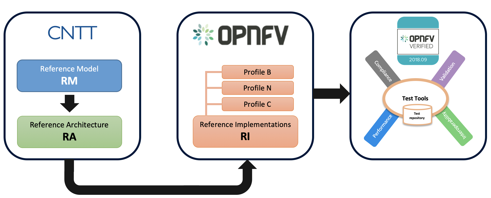

<b>Figure 8-1:</b> CNTT relation to LFN OVP

## 8.2 Principles and Guidelines

The objectives of the verification program are to deliver a validated implementation of reference architecture which satisfies infrastructure needs for VNF-developer teams, leveraging the OVP ecosystem as the vehicle for delivering validated NFVI.

These core principles will guide NFV verification deliverables:

### 8.2.1 Overarching Objectives and Goals

1. Deliver verified implementation of reference architecture which satisfies infrastructure needs for VNF-developer teams.
2. All accomplished with augmentation to the current OVP ecosystem.
3. Increase probability VNFs will on-board and function with minimal problems, or issues, during initial instantiation of VNF.
4. Test Harnesses will be portable, or compatible, across all RAs/Distributions which already conform to standard interfaces and services.

### 8.2.2 Verification Methodologies
<ol>
<li>Engineering package validations will be performed against targeted infrastructure/architecture.</li>
<li>Configuration settings/features/capabilities will be baseline</li>
<li>Entrance Criteria Guidelines will be satisfied prior to OPNFV verification (i.e. Supplier needs to submit/agree/conform)
<ol>
<li>Conform to CNTT ref model</li>
<li>Confirm to ref arch</li>
<li>Submit standard documentation</li>
<li>Adhere to security compliance</li>
</ol>
</li>
<li>Exit Criteria Guidelines will be satisfied prior to issuance of OPNFV compliance badges.
<ol>
<li>Certification for Tenants (OVP Ecosystem)</li>
<li>Operaitonal Considerations (Telco Perspective)</li>
<li>End User Considerations (Telco Perspective)</li>
</ol>
</li>
<li>Test runs using reference model VNFs will validate RA chosen by the VNF-supplier meets developer needs</li>
<li>Verification decisions will be based on data. Test harness is &ldquo;compatible&rdquo;, or &ldquo;conforms&rdquo; to testing against standard interfaces and services</li>
<li>VNF functionality easily tested w/ addition of Supplier Apparatus</li>
<li>Leverage test harnesses from existing open source projects where practical, and applicable.&nbsp;</li>
</ol>

### 8.2.3 Governance
1. Certification badges will be presented by the CVC 
2. CVC will maintain requirements for certification 

## 8.3 Terms and Resources

**Terms utilized throughout this chapter are intended to align with CVC definitions, and their use through CVC documentation, guidelines, and standards.**

NFVI+VNF testing will be performed for **Verification** and **Validations** purpose.  

- **Verification** will be used to indicate conformance to design requirement specifications.  Activities involved Reviews and Walk-Throughs to ensure the NFVI is delivered per implementation specifications.
- **Validations** is used to indicate testing performed to confirm the actual output of a product meets the expected, or desired outcome, or behaviour.
- **Certfications**, which are Out of Scope, include a measured performance of the adherence to, and demonstrated proficiency with, all aspects of software delivery including but no limited to planning, development (of which there are no code developed/delivered), and logistics for communications.

Source information for additional reading:
- [https://www.softwaretestingmaterial.com/verification-and-validation/](https://www.softwaretestingmaterial.com/verification-and-validation/ "What is Verification And Validation In Software Testing")

- [http://softwaretestingfundamentals.com/verification-vs-validation/ ](http://softwaretestingfundamentals.com/verification-vs-validation/  "Verification vs Validation")

- [https://users.ece.cmu.edu/~koopman/des_s99/verification/](https://users.ece.cmu.edu/~koopman/des_s99/verification/ "Verification/Validation/Certification")

### 8.3.1 Terms

Additional Terms utilized throughout the document:

<table>
  <tr><th>Term</th><th>Description</th></tr>
  <tr><td>AZ</td><td>AZ	Availability Zone</td></tr>
	<tr><td>Compatibility</td><td>the capacity for two systems to work together without having to be altered to do so, e.g. same data formats</td></tr>
	<tr><td>Compliance</td><td>a state of being in accordance with established guidelines or specifications</td></tr>
  <tr><td>CPE</td><td>Customer Premises Equipment</td></tr>
  <tr><td>CVC</td><td>Compliance and Verification Committee</td></tr>
  <tr><td>ETSI</td><td>European Telecommunications Standards Institute</td></tr>
  <tr><td>ETSI NFV-TST</td><td>ETSI - Network Functions Virtualisation - Test</td></tr>
  <tr><td>ETSI NFV-IFA</td><td>ETSI - Network Functions Virtualisation - Infrastructure</td></tr>
  <tr><td>GB</td><td>Gigabit</td></tr>
  <tr><td>Hareness (Test)</td><td>automated test framework (test engine, scrip repository) configured to test a program unit by running it under varying conditions and monitoring its behaviour and outputs</td></tr>
  <tr><td>HW</td><td>Hardware</td></tr>
<tr><td>IMS</td> <td>IP Multimedia Subsystem</td></tr>
<tr><td>I/O</td> <td>Input/Output</td></tr>
<tr><td>MB</td> <td>Megabit</td></tr>
<tr><td>NFV</td> <td>Network Function Virtualization</td></tr>
<tr><td>NFVI</td> <td>NFV Infrastructure</td></tr>
<tr><td>NUMA</td> <td>Non-Unified Memory Access</td></tr>
<tr><td>OPNFV</td> <td>Open Platform for NFV</td></tr>
 <tr><td>OVP</td><td>OPNFV Verification Program (OVP)</td></tr>
<tr><td>RAM</td><td>Random Access Memory</td></tr>
<tr><td>Scenario (Test)</td>	<td>any functionality that can be tested; synonymous with use case, or collection of test steps to complete a user workflow</td></tr>
<tr><td>SDN</td>	<td>Software Defined Networking</td></tr>
<tr><td>SD-WAN</td>	<td>Software Defined Wide Area Network</td></tr>
<tr><td>SLA</td>	<td>Service Level Agreement</td></tr>
<tr><td>SUT</td>	<td>System Under Test</td></tr>
<tr><td>SW</td>	<td>Software</td></tr>
<tr><td>vCPU</td>	<td>Virtual CPU (Central Processing Unit)</td></tr>
<tr><td>vNIC</td>	<td>Virtual NIC (Network Interface Card)</td></tr>
<tr><td>vRouter</td>	<td>Virtual Router</td></tr>
<tr><td>vSwitch</td>	<td>Virtual Switch</td></tr>
<tr><td>Validation</td>	<td>esting performed to confirm the actual output of a product meets the expected, or desired outcome, or behaviour</td></tr>
	<tr><td>Verification</td>	<td>conformance to design requirement specifications; Reviews and Walk-Throughs to ensure a product delivered meets implementation specifications</td></tr>
<tr><td>VIM</td>	<td>Virtual Infrastructure Manager</td></tr>
<tr><td>VNF</td>	<td>Virtualised Network Function</td></tr>
<tr><td>VNF-C</td>	<td>VNF Component (can be hosted on a VM, Container, etc)</td></tr>
<tr><td>VNFM</td>	<td>VNF Manager</td></tr>
</table>

- **Verification** will be used to indicate conformance to design requirement specifications.  Activities involved Reviews and Walk-Throughs to ensure the NFVI is delivered per implementation specifications.  
- **Validations** is used to indicate testing performed to confirm the actual output of a product meets the expected, or desired outcome, or behaviour.  

### 8.3.2 Resources
1. **OPNFV** https://www.opnfv.org/ - project and community that facilitates a common NFVI, continuous integration (CI) with upstream projects, stand-alone testing toolsets, and a compliance and verification program for industry-wide testing and integration to accelerate the transformation of enterprise and service provider networks. 
2. **CVC** https://wiki.lfnetworking.org/display/LN/Compliance+and+Verification+Committee - members-driven committee within LF Networking that recommends policies and oversight for compliance and certification program to the Governing Board of LF Networking (“Governing Board”).
3. **Conducting OVP Testing with Dovetail** https://docs.opnfv.org/en/stable-danube/submodules/dovetail/docs/testing/user/userguide/testing_guide.html
4. **Dovetail**
 1. Framework https://wiki.opnfv.org/display/dovetail/Dovetail+Test+Case+Requirements
 2. Test Plan: https://wiki.opnfv.org/display/dovetail/Dovetail+%28Danube%29+Documentation+for+Review?preview=/11698759/11698757/User%20Guide.pdf
 3. TCs:
  1. https://wiki.opnfv.org/display/dovetail/Dovetail+%28Danube%29+Documentation+for+Review
  2. Called by functest (repo): https://github.com/opnfv/dovetail/tree/master/etc/testcase
  3. Per OVP release in the release notes:
   1. https://docs.opnfv.org/en/stable-fraser/submodules/dovetail/docs/release/release-notes/index.html
   2. https://docs.opnfv.org/en/stable-danube/submodules/dovetail/docs/release/release-notes/index.html
5. **Overall documentation** is on docs.opnfv.org for the corresponding Fraser and Danube releases
 1. https://docs.opnfv.org/en/stable-fraser/testing/testing-user.html (Fraser)
 2. https://docs.opnfv.org/en/stable-fraser/testing/testing-dev.html (Fraser)
6. **OPNFV Verification Program** is an open source, community-led compliance and verification program to demonstrate the readiness and availability of commercial NFV products and services, including NFVI and VNFs, using OPNFV and ONAP components (https://www.lfnetworking.org/OVP/).
 1. OVP Whitepaper - https://www.lfnetworking.org/resources/2019/04/03/ovp:-opnfv-verification-program/

## 8.4 Lifecycle and Process Flow

**NOT MVP**

### 8.4.1 Project Mgmt

**NOT MVP**

How certifications are requested, processed, managed, what lab(s) is used, life cycle management

### 8.4.2 OPNFV Iterations & Communications

**NOT MVP**

OPNNV Iterations with the CNTT (mgmt and communication of)

### 8.4.3 Onboarding RA and Supplier VNF

**NOT MVP**

Onboarding (for OVP certification)

### 8.4.4 SLAs and Issue Resolution

**NOT MVP**

Expectations for acknowlegment and turn-round from onboarding, verifications, and issue resolution.

### 8.4.5 RA Verification

**NOT MVP**

Process flow for RA (Infra) Validation and Verfiication

## 8.5 Current OVP and CVC Process

### 8.5.1 Process (CVC)

<u><strong>CVC Compliance, Verification, and Certification governing framework consists of: </strong></u>&nbsp;

<ul>
<li><strong>Compliance testing</strong>: compares the system under test against the specifications / standards</li>
<li><strong>Validation testing:</strong> ensures the system under test is operating according to its intended / required purpose</li>
<li><strong>Performance testing</strong>: measures how well the system under test performs its specific purpose(s)</li>
</ul>

<u><strong>OVP certifications are accomplished as a two-part process: </strong></u>

<ol>
<li>OPNFV provides Test Tools and Test Cases to OVP.</li>
<li>OVP provides vendor NFVI products a &ldquo;badge&rdquo; claiming &ldquo;OPNFV-certified&rdquo; once OVP testing passes successfully (via Dovetail).</li>
</ol>

### 8.5.2 Process (OPNFV)

<strong>OPNFV Releases, and their repsective test verificaitons and validations requires 1) the implentation and adoption of an Installer to perform the needed installation and distirbution of infrastructure componetns and services, 2) identification and acceptance of a Feature Project introducing new, or enhanced, platform capabilities, and 3) an appropriate Test Project explicitly calling out the test use cases and scenarnios for verificaiton and validation.</strong>

<strong>More specifically:</strong>

<strong><u>Release Status</u></strong>

<ul>
<li>Installer oriented release. CNTT does not recommended any specific installer. An agnostic approach is taken that allows for an implementation to determine their own installer.</li>
<li>Multiple installers exist</li>
<li>Multiple scenarios exist, with one scenario represents a certain integration group and a certain configuration</li>
<li>All releases must pass CI（Continuous Integration) test</li>
<li>OVP includes test cases that at lease one OPNFV release scenario can pass</li>
</ul>

<u><strong>Feature Projects</strong></u>

<ul>
<li>Define a certain feature for the OPNFV release, e.g. high availability</li>
<li>Work with upstream projects to develop features</li>
<li>Work with testing projects to define and co-develop feature tests</li>
<li>Work with installer projects to develop certain scenarios including the feature</li>
</ul>

<strong>Test scenarios </strong>

<ul>
<li>Derived from Projects coming into OPNFV for release scoping, resulting in test cases used by OVP for verification and certification.&nbsp;</li>
<li>Only test cases that can let one of the scenarios pass can be included in OVP.</li>
<li>This is a procedure to make sure OVP test cases are written in a right way</li>
</ul>

&nbsp;

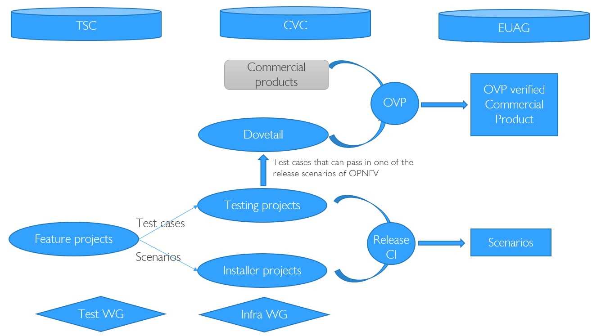

<b>Figure:</b> Figure: OPNFV (current) Projects and Releases Process

### 8.5.3 Test Framework and Supported Test Cases

<u><strong>Test frameworks and supported test cases for OVP Certifications include (OPNFV and ONAP):</strong></u>

<ol>
<li><u><strong>OPNFV</strong></u><u> &ndash; </u><u><strong>NFVI Testing and Certification</strong></u>
<ol>
<li><strong>CVC Category:&nbsp; Validation, Compliance</strong></li>
<li><strong>Purpose</strong>: <strong>NFVI platform is checked against the Open Stack requirements</strong></li>
<li>Test framework, test result database and Web UI
<ul>
<li><strong>Dovetail</strong> project</li>
</ul>
</li>
<li>Test tools, test cases and test execution
<ul>
<li>API testing (<strong>FuncTest</strong>)</li>
<li>Performance and HA (<strong>Yardstick</strong>)</li>
<li>Load testing (<strong>Bottleneck</strong>)</li>
</ul>
</li>
</ol>
</li>
</ol>
<ol start="2">
<li><u><strong>ONAP</strong></u><u> &ndash; </u><u><strong>VNF Testing and Certification</strong></u>
<ol>
<li><strong>CVC Category:&nbsp; Compliance, Performance</strong></li>
<li><strong>Purpose: VNF template is checked against the ONAP Requirements</strong>
<ul>
<li>VNF Validation/Packaging Compliance (HEAT and TOSCA/CSAR/VFD)</li>
<li>Web front-end integrated with OPNFV Dovetail Web UI</li>
<li>Future plan: testing of VNF lifecycle, VNF functions, VNF performance</li>
</ul>
</li>
</ol>
</li>
</ol>

NOTE:&nbsp;&nbsp;<strong>VNF Validation Testing </strong>- CVC and ONAP teams are working to develop the initial life-cycle tests for VNF devices.&nbsp; The first release will run on the "basic open stack" meeting ONAP requirements. Future versions would require this to be the reference NFVI defined by CNTT

## 8.6 CNTT/NFVI Compliance, Verification, and Certification Strategy

### 8.6.1 Methodology.

Perform VNF interoperability verifications against an implementation of CNTT reference architecture, leveraging existing OPNFV Intake Process. Upstream projects will define features/capabilities, test scenarios, and test cases to augment existing OVP test harnesses to be executed via the OVP Ecosystem.

3rd Party test platforms may also be leveraged, if desired.

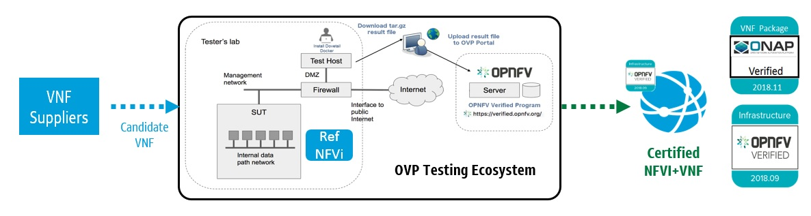

<b>Figure:</b> Figure: Certification Methodology

### 8.6.2 OVP/CVC Certification Strategy & Vehicle.

<strong>NFVI+VNF validations consist of a three part process for Compliance, Validation, and Performance.&nbsp; </strong>Adherenence to <strong>Security</strong> standards are equally important and addressed in Chapter 7.

The three part verificaiton process includes <strong>NFVI Manifest Validations</strong>, <strong>Emprical Baseline measurements against targeted VNF families</strong>, and <strong>Candidate VNF verifications</strong>.&nbsp; More specifically,

<ul>
<li><strong>NFVI Verification (</strong><em>Compliance</em><strong>):</strong> NFVI is the SUT, ensuring NFVI is compliant with specs of Ref Model and Ref Architecture accomplished with&nbsp;<strong>Manifest Validations</strong> (performed via Echo Tests)&nbsp;</li>
<li><strong>Empirical Validation with Reference VNF (</strong><em>Validation</em><strong>):</strong> NFVI is the SUT, ensuring NFVI runs with Golden VNFs and is instrumented to objectively validate resources through consumption and measurement</li>
<li><strong>Candidate VNF Certification (</strong><em>Validation &amp; Performance</em><strong>):</strong> VNF is the SUT, ensuring VNFs operate with Ref Model and Ref Arch leveraging VVP/CVP/VFNSDK Test Suites</li>
<li><strong>Security</strong>: Ensures NFVI+VNF is free from known security vulnerabilities, utilizing industry standard cyber security frameworks <em>(Refer to CNTT Chapter 7 Security for additional test/verification details)</em></li>
</ul>

Validations are performed against an <strong>Infrastructure Profile Catalog</strong>, <strong>VNF performance profile</strong>, and <strong>targeted VNF class</strong> or family for baseline measurements.

The <strong>Infrastucture Profile Catalog</strong>&nbsp;contains the following attributes:&nbsp;

<ul>
<li>Profile is a collection of (limited) options offered by the infrastructure to the VNF
<ul>
<li>Capabilities</li>
<li>Metrics</li>
<li>Compute flavours</li>
<li>Interface options</li>
<li>Storage extensions</li>
<li>Acceleration capabilities</li>
</ul>
</li>
<li>Profiles are offered to VNFs as an instance types with predefined compute flavours (T-shirt size)
<ul>
<li>A particular set of options is an instance type</li>
<li>Compute flavours: S, M, L</li>
</ul>
</li>
</ul>

<strong>VNF performance profiles</strong>, for which NFVI validations will support and be verified against, are defined as basic, network intensive, and compute intensive. Details for each of these profiles can be found in <a href=https://github.com/cntt-n/CNTT/blob/master/doc/ref_model/chapters/chapter02.md#2.3>chapter 2.3</a>.

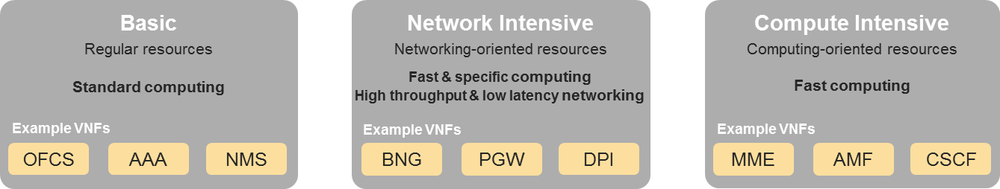

<b>Figure:</b> Figure: Basic(B), Network(N), Compute(C) VNF Categories

<strong>Targeted VNF Classes/Families </strong>for baseline measurements are described in <a href=https://github.com/cntt-n/CNTT/blob/master/doc/ref_model/chapters/chapter02.md#2.2>chapter 2.2</a>.

### 8.6.3 Best Practices.
<ul>
<li>Standardized test methodology / flow, Test Plan, and Test Case Suites</li>
<li>Integration with Dovetail and OVP flow (code, docs, cert criteria, etc.)</li>
<li>Leveraging ONAP Network and Service Models, with identified VNF-specific parameters</li>
<li>Standardized certification criteria</li>
<li>Define CNTT ref arch as scenarios, and have all test cases for the ref arch be involved in OVP (could also be addressed in OVP as CNTT test)</li>
<li>Add test cases from operators, which operators already tested in their environment</li>
</ul>

### 8.6.4 NFVI Profiles reference implementations.

For compliance, verification, and certification, of NFVI solutions provided for a given NFVI Profile, it is required to have a reference implementation of each profile so it can be used for compliance, validation, and certification.

Those reference implementations need to reflect on their corresponding profiles and deliver all metrics and capabilities promised. They need to use open source components. Figure below shows the various reference implementations required for each profile, they are:

- NFVI SW Reference implementation.
- NFVI HW Reference implementation.
- VNF reference implementation.

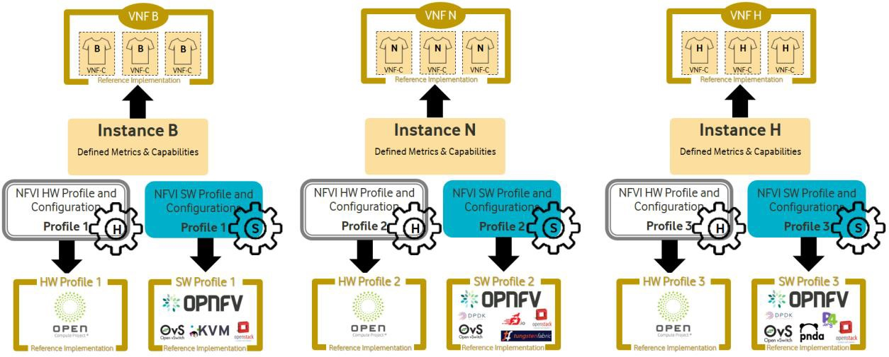

<b>Figure:</b> Figure: Reference NFVI Profiles Implementation

### 8.6.5 Vendor supplied NFVI solutions.

Infrastructure Abstraction and Profiling allows NFVI SW vendors to provide solutions that are suitable for a given profile (as demonstrated in Figure below). Having NFVI solutions tailored towards a given profile makes it easier to verify, certify and test that solution against that profile using the reference implementation of the profile mentioned previously.

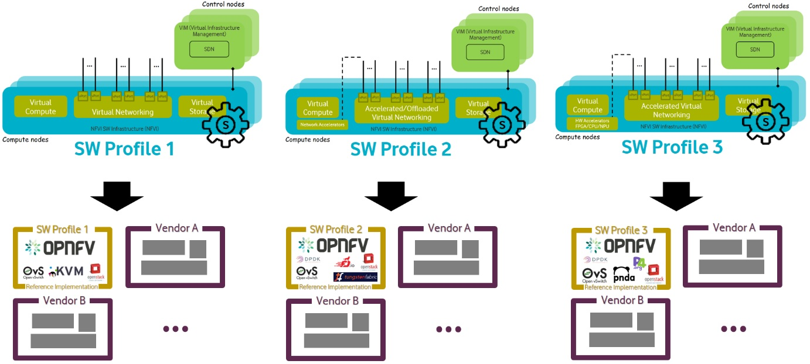

<b>Figure:</b> Figure: Vendor Supplied NFVI SW Solutions

Similarly, Infrastructure Abstraction and Profiling allows NFVI HW vendors to provide solutions that are suitable for a given profile (as demonstrated in Figure below). Having NFVI hardware solutions tailored towards a given profile makes it easier to verify, certify and test that hardware solution against that profile using the reference implementation of the profile mentioned previously.

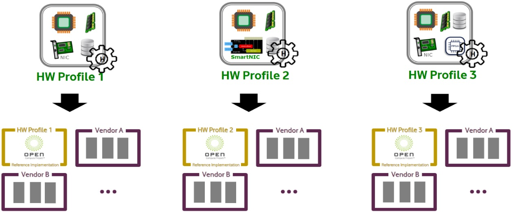

<b>Figure:</b> Figure: Vendor Supplied NFVI HW Solutions

### 8.6.6 NFVI Compliance, Verification, and Certification.

Infrastructure abstraction and profiling makes it easier for a given NFVI SW solutions to be validated, certified and tested against the profile it is intended for.

Having a deterministic NFVI metrics and capabilities expected for a given profile, allows NFVI SW solutions to be characterised, validated, and verified against those metrics and capabilities, and therefore report the results in a standard format. This will allow operators to understand in depth the details and the differentiation a given solution can provide against other options.

Figure below demonstrates how a given NFVI SW solution can be validated and certified against a given profile by using a reference HW implementation and a reference NFVI implementation.

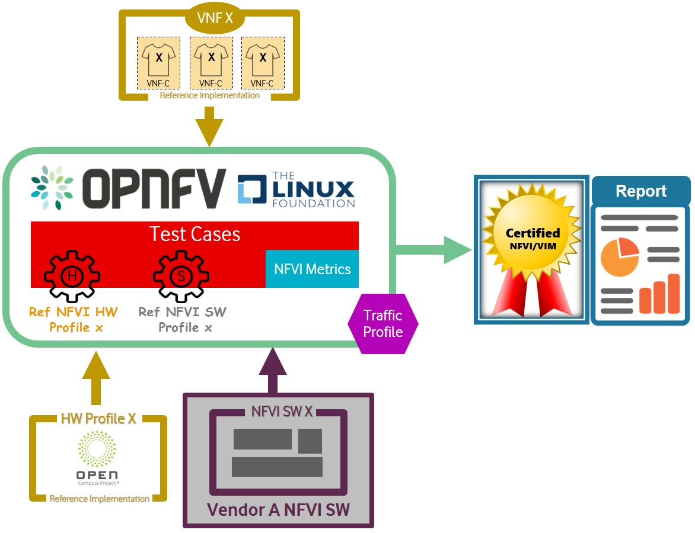

<b>Figure:</b> Figure: Certifying Vendor NFVI SW Solutions

Similarly, to characterise, validate, and certify NFVI HW solution against a given profile, both NFVI SW reference implementation and a VNF reference implementation are needed as demonstrated as in Figure below.

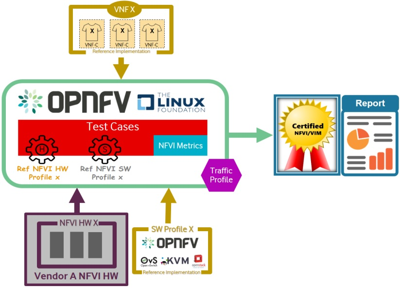

<b>Figure:</b> Figure: Certifying Vendor NFVI HW Solutions

Finally, NFVI vendors can characterise, validate, and certify an entire NFVI platform (both SW & HW) against a given profile by using a VNF reference implementation as shown in Figure below.

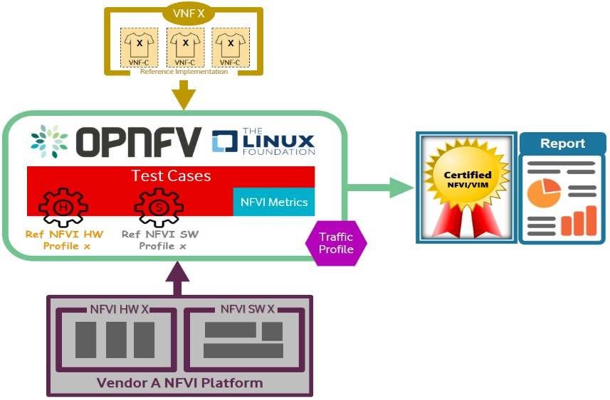

<b>Figure:</b> Figure: Certifying Vendor NFVI SW/HW Solutions

### 8.6.7 VNF Compliance, Validation, and Certification.

Standardising on Infrastructure profiles allows VNFs to be characterised, validated, and certified against a given profile by using reference NFVI implementations as demonstrated in Figure below. Where VNFs are using multiple profiles (different VNF-C written against different profiles), multiple Reference NFVI implementations should be used.

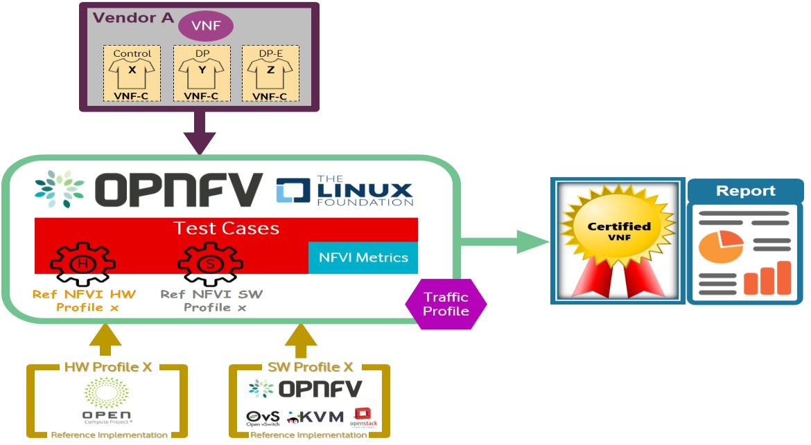

<b>Figure:</b> Figure: Certifying Vendor Supplied VNFs

## 8.7 Quality Assurance

### 8.7.1 Dependencies, Recommendations, Assumptions

**Assumptions**
NFVI+VNF testing will be considered **Testable** if the follow qualifiers are present in a test execution, and subsequent result:

- Ability to perform Conformance, or Verification of Artifacts to ensure designs (RM/RA/RI) are delivered per specification

- Ability to Control (or manipulate), manifestations of RM/RA/RI for the purposes to adjust the test environment, and respective cases, scenarios, and apparatus, to support actual test validations

- Ability to monitor, measure, and report, Validations performed against a target, controlled system under test

In addition, respective Entrance criteria is a prerequisite which needs to be satisfied for NFVI+VNF to be considered **Testable**.  Refer to [https://github.com/cntt-n/CNTT/blob/chapter08/doc/ref_model/chapters/chapter08.md#8.7.3](https://github.com/cntt-n/CNTT/blob/chapter08/doc/ref_model/chapters/chapter08.md#8.7.3 "Entrance & Exit Criteria") for detailed information.

**Dependencies**
NFVI+VNF verification will rely upon test harnesses, test tools, and test suites provided by upstream OPNFV projects, including dovetaill, yardstick, and Bottleneck. These upstream projects will be reviewed semi-annually to verify they are still healthy and active projects. Over time, the projects representing the certification process may change, but test parity is required if new test suites are added in place of older, stale projects.

- NFVI+VNF verifications will be performed against well defined instance types consisting of a HW and SW Profile, Configured Options, and Applied Extensions (See image.)

**Figure:** NFVI+VNF Instance Type
- Standard compute flavours to be tested are defined in [chapter 4.2.1](https://github.com/cntt-n/CNTT/blob/master/doc/ref_model/chapters/chapter04.md#4.2.1)
- Performance profiles come in the form of Basic, Network Intensive, and Compute intensive. Refer to [chapter 2.3](https://github.com/cntt-n/CNTT/blob/master/doc/ref_model/chapters/chapter02.md#2.3) for details on these profiles.

### 8.7.2 System Under Test (SUT) Pre-reqs
1. Test Specifications – per infra profile, specifications, and features/capabilities
2. Naming conventions
3. NFVi profiles and Flavours
4. Test User Guide
5. Scenarnio Descriptor File (SDF)

### 8.7.3 Entrance & Exit Criteria
**OPNFV Entrance Criteria includes _Demonstration of Reference Architecture Implementation and Delivery of the following_:**
1. **Design & Requirements**
   - Design, Configuration, Features, SLAs, and Capability documentation complete
   - Users stories / Adherence to CNTT Model principles and guidelines
   - Chosen Reference Architecture Matches a Reference Architecture from the product catalog
2. **Environment**
    -  Lab assets/resources and respective s/w rev levels are specified, with confirmation of compatibility across external systems
    -  Tenant needs identified
    -  All connectivity, network, image, VMs, delivered with successful pairwise tests
    -  Lab instrumented for proper monitoring
3. **Planning & Delivery**
    - Kickoff / Acceptance Criteria reviews performed
    - Delivery commitments, timelines, and cadence accepted
    - Confirm backward compat. across software/flavour rev levels
4. **Data / VNFs / Security**
    - Images, Heat Templates, Preload Sheets available
    - Images uploaded to tenant space
    - External system test data needs identified
    - Owners (NFVI, VNF, PTL, etc) documented
    - Security Compliance Satisfied (_Refer to_ CNTT Chapter 7 Security _for additional tests, scans, and vulnerabilities validations_)
5. **Test Case Contributions**
    - VNF Developer/Supplier validations to be performed documented and supplied
    - NFVi validations to be performed supplied (e.g. echo, manifest)
    - Test to ensure users are added and have correct privileges for the tenant
    - Test to ensure quota against submitted request for the respective tenant
    - Test to ensure custom flavours against submitted request for respective tenants

 
<strong>OPNFV Exit Criteria includes <em>D</em></strong><strong><em>emonstration of Compliance, Verification, Performance, and Validaiton, of Reference Architecture Implementation, and&nbsp;</em></strong><strong><em>Delivery of the following:</em></strong>

<ol>
<li><u><strong>CERTIFICATION TENANTS (via OVP Ecosystem)</strong></u>
<ol>
<li>All Test Cases have a status of &ldquo;Passed&rdquo;, &ldquo;Failed&rdquo;, &ldquo;N/A&rdquo; or &ldquo;Out-scoped&rdquo;.</li>
<li>All Severity 1 and Severity 2 issues are resolved.</li>
<li>All Issues have been Resolved or the Project/Component Team has voted unanimously for a Conditional Certification.</li>
<li>Known defects, or issues, are clearly documented and furnished to Telco providers with certification notes.</li>
<li>Certification Notification(s) issued.<u></u></li>
</ol>
</li>
<li><u><strong>OPERATIONAL CONSIDERATIONS (TELCO PERSPECTIVE)</strong></u>
<ol>
<li>Orchestration capabilities verified to be working as expected</li>
<li>Fabric setup/configuration validations successfully passed</li>
<li>Openstack API endpoint is reachable and working for that zone</li>
<li>Compute zones and cinder types verified</li>
<li>Standard images verified to exist (and usable)</li>
<li>Network object created (and working, as in IPs are bindable and usable)</li>
<li>Resolver overlay/DNS traffic/port 53 overlay on gateway is working properly</li>
<li>Designate is working, domain preferably created, and maybe test A record created/verified to be resolvable</li>
<li>Standard NTP servers are working and verified (using tenant's CIDR source IP)</li>
<li>NFVI/VNF is tested at steady state and high load</li>
<li>Continuously monitored to ensure SLAs are met and used as feedback to load/perf tests<u></u></li>
<li>Passing Interoperability Validations: a) <b>Compatibility Checks</b> (e.g. documented s/w, driver rev levels, etc, in use and confirmed compatible between Platform and VNF); b)
 <b>Integration Checks</b> (e.g. empirical validation confirming positive performance and stability between Platform and VNF; for example, packet loss within acceptable tolerances)
</ol>
</li>
<li><u><strong>END USER CONSIDERATIONS (TELCO PERSPECTIVE)</strong></u>
<ol>
<li>Component redundancy to ensure graceful updates without disruption of services</li>
<li>Thin provisioning storage should handle actual full quota usage cases</li>
<li>Load balancing should support elasticity</li>
<li>SRIOV Network configuration via SDN must be aware of all VMs on a host (and their network config)</li>
<li>Auto-healing databases (any component related db) when out of sync</li>
<li>Obvious, but, supports all required network functionality (all protocols, service chaining, VLAN trunking, QoS marking, probe/mirror, etc)</li>
<li>Supports NFV migration</li>
<li>Supports snapshots and backups of large volumes</li>
<li>Pre-check or audit failures during NFV deployment should allow follow-up mitigation, when possible, rather than killing deployment and rolling back</li>
</ol>
</li>
</ol>

### 8.7.4 Test Frameworks

#### 8.7.4.1 Functest

[Functest](https://functest.readthedocs.io/en/stable-iruya/) was initially
created to verify OPNFV Installers and Scenarios and then to publish fair,
trustable and public results regarding the status of the different opensource
technologies, especially for Neutron backends (e.g. Neutron agents,
OpenDaylight, OVN, etc.). It has been continuously updated to offer the best
testing coverage for any kind of OpenStack and Kubernetes deployments
including production environments. It also ensures that the platforms meet
Network Functions Virtualization requirements by running and testing VNFs
amongst all tests available.

Functest is driven by a true verification of the platform under test as opposed
to the interoperability programs such as
[RefStack](https://refstack.openstack.org/) or
[OPNFV Verification Program](https://www.opnfv.org/verification) which select
a small subset of Functional tests passing in many different
opensource software combinations:
- tests are skipped if an optional support is missing (e.g.
  [Barbican](https://docs.openstack.org/barbican/latest/) or networking
  features such as
  [BGPVPN interconnection](https://docs.openstack.org/networking-bgpvpn/latest/)
  or
  [Service Function Chaining](https://docs.openstack.org/networking-sfc/latest/))
- tests are parameterized (e.g. shared vs non-shared live migration)
- blacklist mechanisms are available if needed

It should be noted that
[the RefStack lists](https://refstack.openstack.org/#/guidelines) are included
as they are in Functest in the next 3 dedicated testcases:
- refstack_compute (OpenStack Powered Compute)
- refstack_object (OpenStack Powered Object Storage)
- refstack_platform (OpenStack Powered Platform)

Functest also integrates
[Kubernetes End-to-end tests](https://kubernetes.io/blog/2019/03/22/kubernetes-end-to-end-testing-for-everyone/) and allows verifying Kubernetes Conformance (see
[k8s-conformance](https://build.opnfv.org/ci/job/functest-kubernetes-opnfv-functest-kubernetes-smoke-iruya-k8s_conformance-run/206/console)).

Dovetail (OVP) mostly leverages on Functest but only runs a small part of
Functest (~15% of all functional tests, no benchmarking tests, no VNF
deployment and testing). It's worth mentioning that Functest is patched to
[disable API verification](https://github.com/opnfv/dovetail/tree/master/etc/patches/functest/disable-api-validation) which has differed from OpenStack rules for
years.

Then Functest conforms with the upstream rules (versions, code quality, etc.)
and especially their
[gates](https://docs.openstack.org/infra/system-config/devstack-gate.html)
(a.k.a. the automatic verification prior to any code review)
to preserve the quality between code and deployment.
In that case, Functest can be considered as a smooth and lightweight
integration of tests developed upstream (and the Functest team directly
contributes in these projects:
[Rally](https://github.com/openstack/rally-openstack),
[Tempest](https://github.com/openstack/tempest), etc.).
It's worth mentioning that, as opposed to the OpenStack Gates leveraging on
[DevStack](https://docs.openstack.org/devstack/latest/), it can check the same
already deployed SUT over and over even from a
[Raspberry PI](https://www.raspberrypi.org/). Here the testcases can be
executed in parallel vs the same deployment instead of being executed vs
different pools of virtual machines.

Here are the functional tests (>2000) running in OpenStack gates integrated in
Functest Smoke (see
[Functest daily jobs](https://build.opnfv.org/ci/view/functest/job/functest-iruya-daily/190/) for more details):

| Testcases                  | Gates              |
| :------------------------- | :----------------- |
| tempest_full               | General            |
| tempest_slow               | General            |
| tempest_scenario           | General            |
| neutron-tempest-plugin-api | Neutron            |
| patrole                    | Patrole            |
| barbican                   | Barbican           |
| networking-bgpvpn          | Networking BGP VPN |
| networking-sfc             | Networking SFC     |

To complete functional testing, Functest also integrates a few
[performance tools](https://docs.openstack.org/developer/performance-docs/methodologies/tools.html)
(2-3 hours) as proposed by OpenStack:

| Testcases  | Benchmarking                |
| :--------- | :-------------------------- |
| rally_full | Control Plane (API) testing |
| rally_jobs | Control Plane (API) testing |
| vmtp       | Data Plane testing          |
| shaker     | Data Plane testing          |

And VNFs automatically deployed and tested :

| Testcases    | Benchmarking                        |
| :----------- | :---------------------------------- |
| cloudify     | Cloudify deployment                 |
| cloudify_ims | Clearwater IMS deployed via Coudify |
| heat_ims     | Clearwater IMS deployed via Heat    |
| vyos_vrouter | VyOS deployed via Cloudify          |
| juju_epc     | OAI deployed via Juju               |

Functest should be considered as a whole as it meets multiple objectives about
the reference implementation:
- verify all APIs (services, advances, features, etc.) exposed by the reference
  implementation
- compare the reference implementation and local deployments from a functional
  standpoint and from OpenStack control plane and dataplane capabilities

It's worth mentioning that Functest already takes into account the first CNTT
[profiles](https://git.opnfv.org/functest/tree/functest/ci/config_patch.yaml#n2).
CNTT should simply add the next Functest inputs according the reference
implementation:
- [Functest inputs](https://github.com/opnfv/functest/blob/stable/iruya/functest/utils/env.py#L17)
- [tempest specific configuration](https://github.com/opnfv/functest/blob/stable/iruya/functest/opnfv_tests/openstack/tempest/custom_tests/tempest_conf.yaml)

Additional links:
- [Homepage](https://functest.readthedocs.io/en/stable-iruya/)
- [Run Alpine Functest containers (Iruya)](https://wiki.opnfv.org/pages/viewpage.action?pageId=35291769)
- [Deploy your own Functest CI/CD toolchains](https://wiki.opnfv.org/pages/viewpage.action?pageId=32015004)
- [Functest gates](https://build.opnfv.org/ci/view/functest/)

#### 8.7.4.2 Yardstick

#### 8.7.4.3 Bottlenecks

### 8.7.5 Test Categories
<ol>
<li>On-Boarding (ONAP MANO, NFVi Agnostic)</li>
<li>Instantiation, Deletion, Recent Change (ONAP MANO, NFVi Agnostic)</li>
<li>VNF Functional Testing</li>
<li>Security Testing</li>
<li>Charging / Revenue Assurance Verification</li>
<li>MicroServices Support</li>
<li>Closed Loop Testing</li>
<li>VNF Coexistence (ETSI NFV-TST001 &ldquo;Noisy Neighbor&rdquo;)</li>
<li>VNF Interactions with Extended NFVi Topology</li>
<li>VNF Interactions with Complex NFVi (Akraino)</li>
<li>Scalability Testing</li>
<li>HA Testing</li>
<li>Fault Recovery Testing</li>
<li>PM/KPI/Service Assurance Testing</li>
</ol>

### 8.7.6 Test Harness(es)
<ol>
<li>Standardized test methodology / flow</li>
<li>Working test bed reference design</li>
<li>Standardized Cloud-based facilities (storage, IAM, etc.)</li>
<li>Standard ONAP Network and Service Models, with identified VNF-specific parameters</li>
<li>Robot library to enable Data-Driven testing of On-Boarding, Instantiation, etc.</li>
<li>Sample VNF, CSAR and Robot Test Cases</li>
<li>Standardized base Test Plan and Test Case suite</li>
<li>Standardized certification criteria</li>
<li>Integration with Dovetail and OVP flow (code, docs, cert criteria, etc.)</li>
<li>Real, usable documentation</li>
<li>&ldquo;Just add Water&rdquo; deployment vehicle</li>
</ol>

### 8.7.7 Test Tools
1. Shaker:  https://pyshaker.readthedocs.io/en/latest/ (The distributed data-plane testing tool built for OpenStack)
2. Sonubuoy: https://sonobuoy.io/ It is a diagnostic tool that makes it easier to understand the state of a Kubernetes cluster by running a set of plugins (including Kubernetes conformance tests) in an accessible and non-destructive manner.

### 8.7.8 Scenario Descriptor File (SDF)
As defined by OPNFV, Scenarnio Descriptor File's (SDF) will be utilized to relay information from the Scenario Designer (or Test Manager), to Release Managers, CI Pipeline Owners, and Installer Agents, to define test scenario content, and specifications.

SDF's will contain, but not limited to, the following Metadata, Components, Deployment Options, Deployment Tools, and Hardware prerequistes:
<ul>
<li><strong>Metadata</strong>
<ul>
<li>Name</li>
<li>History</li>
<li>Purpose</li>
<li>Owner</li>
</ul>
</li>
<li><strong>Components</strong>
<ul>
<li>e.g. SDN controllers</li>
<li>Versions</li>
<li>Optional features,  e.g. NFV features</li>
</ul>
</li>
<li><strong>Deployment Options</strong>
<ul>
<li>Hardwaretypes</li>
<li>Virtual deploy</li>
<li>HA, NOHA</li>
</ul>
</li>
<li><strong>Deployment Tools</strong>
<ul>
<li>Supporting installers</li>
<li>Valid options per installer</li>
</ul>
</li>
<li><strong>Hardware Prerequisites</strong>
<ul>
<li>e.g. SRIOV, DPDK</li>
</ul>
</li>
</ul>

### 8.7.9 Test Categories | Cases

The following five test categories have been identified as minimal testing required to verify NFVI interoperability to satisfy the needs of VNF developer teams.

<b><u>Test Categories</u></b>
<ol>
<li>Baremetal - validations</li> - We will validate Control and compute nodes hardware.
<li>VNF Interoperability - validations</li> - After VNF on boarded we are validating end to end openstack resources like Tenant, Network (L2/L3), CPU Pining, security policies, Affinity anti-affinity roles and flavours etc.
<li>Compute Component - validations</li> - Validate/Document VMs status and connectivity result after performing each of listed steps. Best candidate for this testing would be identify compute node that holds VMs which has l2 and l3 connectivity.
<li>Control Plane Component- validations</li> - We are validating RabbitMQ, Ceph, Mariadb and Openstack components like nova, glance, heat, keystone API and resillency test.
<li>
Security - see <a title="Chapter 7 Security" href="https://github.com/cntt-n/CNTT/blob/chapter08/doc/ref_model/chapters/chapter07.md" target="_blank" rel="noopener">Chapter 7</a> for complete list
</li>
</ol> - Validating user RBAC Roles and User group policies.

Respective test cases can be found in the <a title="Annex for Chapter 8" href="https://github.com/cntt-n/CNTT/blob/master/doc/ref_model/chapters/chapter08-annex.md" target="_blank" rel="noopener">Annex for Chapter 8</a>.

### 8.7.10 Test Case Selection Requirements

This section lists requirements test cases must fulfill to be eligible for
inclusion in the NFVI and/or VNF compliance test suite.  These requirements act
as a checklist to gate the inclusion of test cases.

| Ref # | Category   | Description |
|----|--------------------------|---------------------------------------------------------------------------------------------------------------------------------------------------------------------------|
| `req.tests.01` | Implementation | Test cases and tools **must** be implemented in an open source project and publicly available. |
| `req.tests.02` | Implementation | Test cases and tools **should** be self-contained and not require downloading additional data from external systems at runtime. |
| `req.tests.03` | Implementation | Test cases and tools **must not** require dynamic interaction with external systems or resources, e.g., of OPNFV, LFN or others. |
| `req.tests.04` | Implementation | Test cases and tools **must** generate machine- and human-readable output, i.e. logs and result files. |
| `req.tests.05` | Implementation | The execution of all test case **must** be idem-potent, i.e., test cases handle setup and teardown of resources and revert state changes of the system under test performed by the test case. |
| `req.tests.06` | Implementation | Test cases and tools **must** run against a fully deployed and operational system under test, i.e., not isolated individual components. |
| `req.tests.07` | Implementation | Test cases and tools **must not** require un-merged patches to the relevant upstream projects. |
| `req.tests.08` | Implementation | Test tools **must** allow selective execution of individual test cases even if test cases are part of a larger test suite. |
| `req.tests.09` | Implementation | NFVI tests and test tools **must** run independently of the method of NFVI platform installation. |
| `req.tests.10` | Implementation | NFVI tests and test tools **must** run independently of platform components not specified in the corresponding reference archiecture, i.e., allowing different backend implementations such as storage backends or SDN controllers. |
| `req.tests.11` | Documentation  | Test cases and tools **must** be documented, comprising a reference to all targeted reference architectures, pre- and post-conditions, basic test flow execution, and pass/fail criteria. |
| `req.tests.12` | Documentation  | Documentation of test cases and tools **must** be publicly available. |
| `req.tests.13` | Maturity       | Test projects providing test cases **must** be mature and active to ensure availability and maintenance of test case implementations over an extended period of time. Criteria for maturity include code quality, test coverage, release history of the project, release cadence, and contributer base. |
| `req.tests.14` | Scope          | Test cases **must** pass on all reference implementations of the targeted reference architecture in the OPNFV CI/CD pipeline. |
| `req.tests.15` | Scope          | Test cases **must** be traceable to a requirement based on the reference model or a reference architecture. |

## 8.8 Test Results

**NOT MVP**

Test suites will be categorized as functional or performance based. Results reporting will be communicated as a boolean (pass/fail). The pass/fail determination for performance-based test cases will be made by comparing results against a baseline.
Example performance-based metrics include, but are not limited to: resource utilization, response times, latency, and sustained throughput per second (TPS).

### 8.8.1 Measurements

**NOT MVP**

Measurements and respective certification(s).
e.g. OVP Testing Ecosystem badge (with link to certification with posted results)

Test validations will be corroborated, and confirmed, with direct comparison between measured results and documented non-functional requirements (NFRs) for applications, hardware and software configuration settings, and host systems.  Throughput, latency, concurrent connections/threads, are all examples of non-functional requirements which specify criteria which can be used to judge the operation of a system, rather than specific behaviours of the application which are defined by functional requirements.

This section attempts to summarize a categorical list of metrics used for test validations.  **For a complete list of metrics, and requirements, please visit [Chapter 4 of the Reference Model](https://github.com/cntt-n/CNTT/blob/master/doc/ref_model/chapters/chapter04.md "Chapter 4 - Infrastructure Capabilities, Metrics, and Catalog").**

**STORAGE and IOPS**

_**IOPS**_ validations for Storage, and/or Storage Extensions, will be included as part of the final NFVI verification, and validation, process.  

From a definition perspective, IOPS is the standard unit of measurement for I/O (Input/Output) operations per second. This measurement is a performance-based measurement and is usually seen written as**(1)**:

- **Total IOPS**: Average number of I/O operations per second.
- **Read IOPS**: Average number of read I/O operations per second.
- **Write IOPS**: Average number of write I/O operations per second.

For example, if you have a disk that is capable of doing a 100 IOPS, it means that it is theoretically capable of issuing a 100 read and or write operations per second.  This is in theory.  In reality, additional time is needed to actually process the 100 reads/writes.  This additional time is referred to as "latency", which reduces the total IOPS that is calculated, and measured.  Latency needs needs to be measured, and included in the IOPS calculation.  Latency will tell us how long it takes to process a single I/O request, and is generally in the 2 millisecond (ms) range per IO operation for a physical disk, through 20+ ms, at which time users will notice an impact in their experience**(2)**.  

Additional factors to consider when measuring IOPS:

- Take into consideration the percentage of Input (write) vs. Output (reads) operations, as Writes can be more resource intensive.
- Determine if Reads were performed from Cache, as this this may (will) result in faster performance, and faster IOPS.
- Confirm the storage types (Physical, RAID), as storage arrays with linear, or sequential reading/writing may (will) be slower.
- Identify the block size used, as using large block sizes vs. small block sizes can (will) impact IOPS performance.
- Determine Hard Disk Speeds (HDD in RPMs) used, as the higher the RPMS, the potential for faster IOPS performance.
- Quantify the number of disk controllers used to process the number of requested IO requests.
- Determine the specific work-load requirements, as this will dictate speed, controllers, disk RPM, and latency tolerances.  

For additional insight, or deeper understanding and reading of IOPS, refer to the references below.

**References:**

1. _IOPS - I/O (Input/Output) operations per second_, by Vangie Beal.  Retrieved from https://www.webopedia.com/TERM/I/IOPS.html on 9/18/2019.
2. _The ultimate IOPS cheat sheet!_, by Bas van Kaam.  Retrieved from https://www.basvankaam.com/2014/07/29/the-ultimate-iops-cheat-sheet/ on 9/18/2019.
3. _An explanation of IOPS and latency_, by Dimitris Krekoukias.  Retrieved from http://recoverymonkey.org/2012/07/26/an-explanation-of-iops-and-latency/ on 9/18/2019.

### 8.8.2 Report Summary

**NOT MVP**

1. Pass/Fail
2. Measure Only (e.g. throughput analysis, baseline, transaction stats, etc)

## 8.9 Future Planning

**NOT MVP**

This section will be used to plan for future offerings.

### 8.9.1 Performance & Resiliency - Measurements, Testing

**NOT MVP**

#### 8.9.1.1 Performance Measurements

The following table contains a lists of performance measurements, and/or capabilities, to be captured where feasible during test validations.  More specifically, the table contains:

- Exposed performance metrics per VNFC, vNIC or vCPU.  Specifically exposed performance metrics use a single VNF (PVP) dataplane test setup in a single host.  (e.g. _\*e.nfvi.per.met\*_)

- Monitoring capabilities available by NFVI.  The availability of these capabilities will be determined by the instance type used by the workloads. (e.g. _\*i.nfvi.mon.cap\*_)

- Internal performance metrics per NFVI node.  Specifically internal performance metrics use a baseline (Phy2Phy) dataplane test setup in a single host. (e.g. _\*i.nfvi.per.met\*_)

> _**NOTE**:  Refer to RM Chapter 4, <a href="https://github.com/cntt-n/CNTT/blob/master/doc/ref_model/chapters/chapter04.md">Infrastructure Capabilities, Metrics, and Catalogue</a>, for a list performance measurements and capabilities internal to the infrastructure._

| Ref                | NFVI Measurement             | Unit                | Definition/Notes                                             |
| ------------------ | ------------------------- | ------------------- | ------------------------------------------------------------ |
| e.nfvi.per.met.001 | Network throughput        | frames/s            | Throughput (aligned with ETSI GS NFV-TST 009 [2]) |
| e.nfvi.per.met.002 | Network latency           | second              | 99th percentile of one-way frame transfer time at throughput offered load level (aligned with ETSI GS NFV-TST 009 [2]) |
| e.nfvi.per.met.003 | Network Delay Variation   | second              | 99th percentile of Frame Delay Variation (FDV) at throughput offered load level (aligned with ETSI GS NFV-TST 009 [2]) |
| e.nfvi.per.met.004 | Simultaneous active flows | number              | Max simultaneous active L4 flows per vNIC before a new flow is dropped |
| e.nfvi.per.met.005 | New flows rate            | flows/s             | Max new L4 flow rate per vNIC                                |
| e.nfvi.per.met.006 | Storage throughput        | bytes/s or IO/s     | Max throughput per virtual block storage unit assigned to VNFC |
| e.nfvi.per.met.007 | Processing capacity       | test-specific       | Processing capacity test-specific score per vCPU and with all vCPU running multiple parallel workloads|
| i.nfvi.mon.cap.001 | Host CPU usage |  | Per Compute node. It needs to Maps to ETSI NFV-TST 008[1] clause 6, processor usage metric (NFVI exposed to VIM) and ETSI NFV-IFA 027 Mean Virtual CPU usage and Peak Virtual CPU usage (VIM exposed to VNFM). |
| i.nfvi.mon.cap.002 | Virtual compute resource CPU usage |  | QoS enablement |
| i.nfvi.mon.cap.003 | Host CPU utilization |  | Per Compute node. It needs to map to ETSI NFV-IFA 027 Mean Virtual CPU usage and Peak Virtual CPU usage (VIM, exposed to VNFM). |
| i.nfvi.mon.cap.004 | Virtual compute resource CPU utilization |  | Range (min, max) per VNFC |
| i.nfvi.mon.cap.005 | Monitoring of external storage IOPS | Yes/No | Transcoding Acceleration |
| i.nfvi.mon.cap.006 | Monitoring of external storage throughput | Yes/No | Programmable Acceleration |
| i.nfvi.mon.cap.007 | Monitoring of external storage capacity | Yes/No |  |
| i.nfvi.per.met.001 | Network throughput | frames/s | Throughput (aligned with ETSI GS NFV-TST 009 [2]) |
| i.nfvi.per.met.002 | Simultaneous active flows | number | Max simultaneous active L4 flows per node before a new flow is dropped |
| i.nfvi.per.met.003 | New flows rate               | flows/s  | Max new L4 flow rate per node                                |
| i.nfvi.per.met.004 | Processing capacity | test-specific | Processing capacity test-specific score per core and with all cores running multiple parallel workloads|
| i.nfvi.per.met.005 | Energy consumption           | W                   | Maximum energy consumption of the node without hosting any VNFC (but fully ready for it) |
| i.nfvi.per.met.006 | Network energy efficiency    | W/bits/s            | Energy consumption for the node at throughput offered load level, normalized to the bit rate |
| i.nfvi.per.met.007 | Processing energy efficiency | W/core | Energy consumption for the node during processing capacity test-specific score with all cores running multiple parallel workloads (i.nfvi.per.met.004), normalized to cores usable by VNFs |

### 8.9.2 Reports Dashboard

**NOT MVP**

Placeholder to document where results will be posted (e.g. Dovetail dashboards.)

### 8.9.3 Automation Considerations

**NOT MVP**

Placholder to identify automation needs and tool chains.

## 8.10 Recommendations

**NOT MVP**

Placholder to capture best practices.
