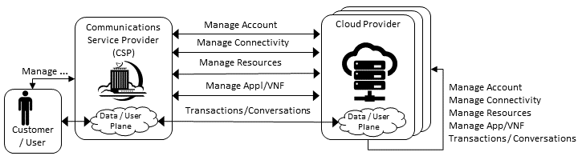
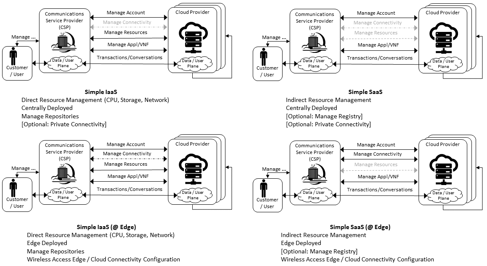
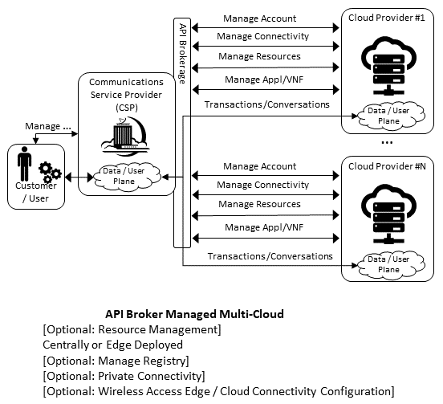
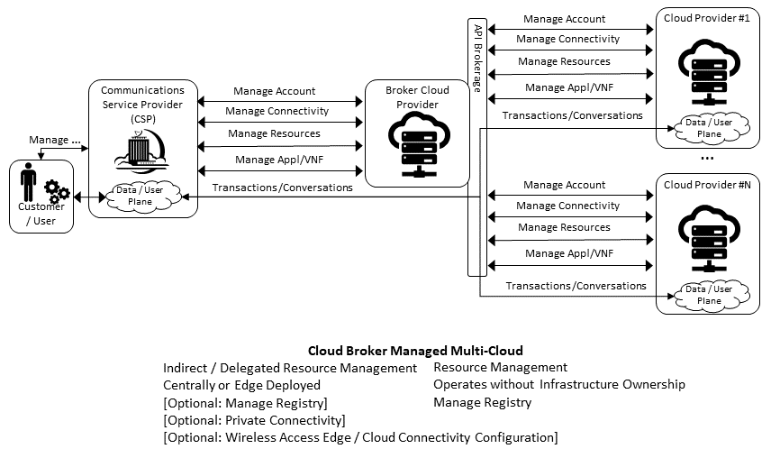

Hybrid Multi-Cloud: Data Centre to Edge
=======================================

Introduction
------------

The :doc:`ref_model/chapters/chapter03` focuses on cloud infrastructure abstractions. While these are generic abstractions they and the associated capabilities of the cloud infrastructure are specified for data centres, central office and colocation centres. The environmental conditions, facility and other constraints, and the variability of deployments on the edge are significantly different and, thus, require separate consideration.

It is unrealistic to expect that a private cloud can cost-effectively meet the needs of all workloads when the private cloud must also meet the needs for peak loads and disaster recovery. For this reason alone, enterprises will need to implement a hybrid cloud. In a hybrid cloud deployment, at least two or more distinct cloud infrastructures are interconnected. In a multi-cloud, the distinct cloud infrastructures of the hybrid cloud may be implemented using one or more technologies. The hybrid multi-cloud infrastructure has differences requiring different abstractions. These hybrid multi-clouds can be considered to be federated.

In the :doc:`ref_model/chapters/chapter03`, the cloud infrastructure is defined. The tenants are required to provide certain needed services (such as Load Balancer (LB), messaging). Thus, the VNF/CNFs incorporate different versions of the same services with the resultant issues related to an explosion of services, their integration and management complexities. To mitigate these issues, the Reference Model must specify the common services that every Telco cloud must support and thereby require workload developers to utilise these pre-specified services.

A generic Telco cloud is a hybrid multi-cloud or a federated cloud that has deployments in large data centres, central offices or colocation facilities, and the edge sites. This chapter discusses the characteristics of Telco Edge and hybrid multi-cloud.

Hybrid Multi-Cloud Architecture
-------------------------------

The GSMA whitepaper on "Operator Platform Concept Phase 1: Edge Cloud Computing" (January 2020) states, "Given the wide diversity of use cases that the operators will tasked to address, from healthcare to industrial IoT, it seems logical for operators to create a generic platform that can package the existing assets and capabilities (e.g., voice messaging, IP data services, billing, security, identity management, etc. ...) as well as the new ones that 5G makes available (e.g., Edge cloud, network slicing, etc.) in such a way as to create the necessary flexibility required by this new breed of enterprise customers."

Cloud computing has evolved and matured since 2010 when `NIST <http://csrc.nist.gov/publications/nistpubs/800-145/SP800-145.pdf>`__ published its definition of cloud computing, with its 5 essential characteristics, 3 service models and 4 deployment models.

The generic model for an enterprise cloud has to be "hybrid" with the special cases of purely private or public clouds as subsets of the generic hybrid cloud deployment model. In a hybrid cloud deployment, at least two or more distinct cloud infrastructures are inter-connected together.

Cloud deployments can be created using a variety of technologies (e.g., OpenStack, Kubernetes) and commercial technologies (e.g., VMware, AWS, Azure, etc.). A multi-cloud deployment can consist of the use of more than one technology.

A generic Telco cloud is a hybrid multi-cloud. A better designation would be a federation of clouds - a federated cloud:

-  a collection of cooperating, interoperable autonomous component clouds

-  the component clouds perform their local operations (internal requests) while also participating in the federation and responding to other component clouds (external requests)

   -  the component clouds are autonomous in terms of, for example, execution autonomy; please note that in a centralised control plane scenario (please see the section "Centralised Control Plane" in the "`Edge Computing: Next Steps in Architecture, Design and Testing <https://www.openstack.org/use-cases/edge-computing/edge-computing-next-steps-in-architecture-design-and-testing/>`__" whitepaper [26]) the edge clouds do not have total autonomy and are subject to constraints (e.g., workload LCM)
   -  execution autonomy is the ability of a component cloud to decide the order in which internal and external requests are performed

-  the component clouds are loosely coupled where no changes are required to participate in a federation

   -  also, a federation controller does not impose changes to the component cloud except for running some central component(s) of the federated system (for example, a broker agent – executes as a workload)

-  the component clouds are likely to differ in, for example, infrastructure resources and their cloud platform software

-  workloads may be distributed on single or multiple clouds, where the clouds may be collocated or geographically distributed

-  component clouds only surface NBIs (Please note that VMware deployed in a private and a public cloud can be treated as a single cloud instance)

Characteristics of a Federated Cloud
~~~~~~~~~~~~~~~~~~~~~~~~~~~~~~~~~~~~

In this section we will further explore the characteristics of the federated cloud architecture, and architecture building blocks that constitute the federated cloud. For example, :numref:`Example Hybrid Multi-Cloud Component Cloud` shows a Telco Cloud that consists of 4 sub-clouds: Private on premise, Cloud Vendor provided on premise, Private outsourced (Commercial Cloud Provider such as a Hyperscaler Cloud Provider (HCP), and Public outsourced (see diagram below). Such an implementation of a Telco Cloud allows for mix'n'match of price points, flexibility in market positioning and time to market, capacity with the objective of attaining near "unlimited" capacity, scaling within a sub-cloud or through bursting across sub-clouds, access to "local" capacity near user base, and access to specialised services.

.. :name: Example Hybrid Multi-Cloud Component Cloud
.. figure:: ../figures/RM-Ch08-HMC-Image-1.png
   :alt: Example Hybrid Multi-Cloud Component Cloud"

   Example Hybrid Multi-Cloud Component Cloud

Telco Cloud
~~~~~~~~~~~

The :numref:`Telco Cloud: Data Centre to Edge` presents a visualisation of a Telco operator cloud (or simply, Telco cloud) with clouds and cloud components distributed across Regional Data Centres, Metro locations (such as Central Office or a Colocation site) and at the Edge, that are interconnected using a partial mesh network. Please note that at the Regional centre level the interconnections are likely to be a "fuller" mesh while being a sparser mesh at the Edges.

.. :name: Telco Cloud: Data Centre to Edge
.. figure:: ../figures/RM-Ch08-Multi-Cloud-DC-Edge.png
   :alt: "Telco Cloud: Data Centre to Edge"

   Telco Cloud: Data Centre to Edge

The Telco Operator may own and/or have partnerships and network connections to utilize multiple Clouds for network services, IT workloads, and external subscribers. The types of the component clouds include:

-  On Premise Private

   -  Open source; Operator or Vendor deployed and managed \| OpenStack or Kubernetes based
   -  Vendor developed; Operator or Vendor deployed and managed \| Examples: Azure on Prem, VMware, Packet, Nokia, Ericsson, etc.

-  On Premise Public: Commercial Cloud service hosted at Operator location but for both Operator and Public use \| Example: AWS Wavelength

-  Outsourced Private: hosting outsourced; hosting can be at a Commercial Cloud Service \| Examples: Equinix, AWS, etc.

-  (Outsourced) Public: Commercial Cloud Service \| Examples: AWS, Azure, VMware, etc.

-  Multiple different Clouds can be co-located in the same physical location and may share some of the physical infrastructure (for example, racks)

In general, a Telco Cloud consists of multiple interconnected very large data centres that serve trans-continental areas (Regions). A Telco Cloud Region may connect to multiple regions of another Telco Cloud via large capacity networks. A Telco Cloud also consists of interconnected local/metro sites (multiple possible scenarios). A local site cloud may connect to multiple Regions within that Telco Cloud or another Telco Cloud. A Telco Cloud also consists of a large number of interconnected edge nodes where these edge nodes maybe impermanent. A Telco Cloud's Edge node may connect to multiple local sites within that Telco Cloud or another Telco Cloud; an Edge node may rarely connect to a Telco Cloud Region.

Table 8-1 captures the essential information about the types of deployments, and responsible parties for cloud artefacts.

======================== ================ ================== ============================ ======================= ===================================
Type                     System Developer System Maintenance System Operated & Managed by Location where Deployed Primary Resource Consumption Models
======================== ================ ================== ============================ ======================= ===================================
Private (Internal Users) Open Source      Self/Vendor        Self/Vendor                  On Premise              Reserved, Dedicated
Private                  Vendor \| HCP    Self/Vendor        Self/Vendor                  On Premise              Reserved, Dedicated
Public                   Vendor \| HCP    Self/Vendor        Self/Vendor                  On Premise              Reserved, On Demand
Private                  HCP              Vendor             Vendor                       Vendor Locations        Reserved, Dedicated
Public (All Users)       HCP              Vendor             Vendor                       Vendor Locations        On Demand, Reserved
======================== ================ ================== ============================ ======================= ===================================

**Table 8-1:** Cloud Types and the Parties Responsible for Artefacts

Telco Operator Platform Conceptual Architecture
~~~~~~~~~~~~~~~~~~~~~~~~~~~~~~~~~~~~~~~~~~~~~~~

:numref:`Conceptual Architecture of a Telco Operator Platform` shows a conceptual Telco Operator Platform Architecture. The Cloud Infrastructure Resources Layer exposes virtualised (including containerised) resources on the physical infrastructure resources and also consists of various virtualisation and management software (see details later in this chapter). The Cloud Platform Components Layer makes available both elementary and composite objects for use by application and service developers, and for use by Services during runtime. The Cloud Services Layer exposes the Services and Applications that are available to the Users; some of the Services and Applications may be sourced from or execute on other cloud platforms. Please note that while the architecture is shown as a set of layers, this is not an isolation mechanism and, thus, for example, Users may access the Cloud Infrastructure Resources directly without interacting with a Broker.

.. :name: Conceptual Architecture of a Telco Operator Platform
.. figure:: ../figures/RM-Ch08-Telco-Operator-Platform.png
   :alt: "Conceptual Architecture of a Telco Operator Platform"

   Conceptual Architecture of a Telco Operator Platform

The Cloud Services and the Cloud Resources Brokers provide value-added services in addition to the fundamental capabilities like service and resource discovery. These Brokers are critical for a multi-cloud environment to function and utilise cloud specific plugins to perform the necessary activities. These Brokers can, for example, provision and manage environments with resources and services for Machine Learning (ML) services, Augmented/Virtual Reality, or specific industries.

Multi-Cloud Interactions Model
~~~~~~~~~~~~~~~~~~~~~~~~~~~~~~

.. _introduction-1:

Introduction1
~~~~~~~~~~~~~

To realise a federated cloud requires the definition and agreement on a set of APIs. These APIs should allow each of the parties to interact cooperatively and need to cover the management layer: business management and service operations interactions; as well as the data plane, customer and user, transactions and conversational interfaces.

As outlined in :numref:`Conceptual Architecture of a Telco Operator Platform` above, the exposure point for the Management Interactions is the "Cloud Service Broker" and the "Cloud Resource Broker". The set of interactions that these interface points need to provide are defined by the :numref:`Multi-Cloud Interactions Model` below. This provides a taxonomy for the interactions between the Communications Service Provider and the Cloud Providers.

.. :name: Multi-Cloud Interactions Model

   Multi-Cloud Interactions Model

The model defines the following core roles:

-  Communications Service Provider (CSP) - is the party responsible for providing end user service to their customer
-  Customer / User - are the parties that use the service (User) and establishes the business agreement for the service provision (Customer). For retail services the customer and user are the same party, while for enterprise services the Enterprise is the Customer (responsible for the business agreement) and its representatives are the Users.
-  Cloud Providers - are the parties providing the cloud services. These services could be any XaaS service. It could be that a CSP has an agreement with a SaaS Cloud, which in turn uses an IaaS Cloud Provider to deliver their service.

The set of high level interactions cover:

-  Manage Account - covering Account, Users, Subscription, Billing
-  Manage Connectivity - Public or Private Network, VPN Configuration, CSP Edge / Cloud Connection Configuration, Connection Security Profile
-  Manage Resource - Resource Pool Management, VM / VNF Management (CPU, Memory, Storage, Network), Image Repository Management, Storage Management, VNF / CNF LCM, Monitor Resources
-  Manage App/VNF - Image / Container / Registry Management, Deploy/Configure/Scale/Start/Stop App/VNF, Monitor App/VNFs
-  Transactions / Conversations - Use Communications Services, Use Edge Applications Services, Use Cloud Services

Stereo-Typical Scenarios
~~~~~~~~~~~~~~~~~~~~~~~~

A set of stereo-typical interactions cases are illustrated for the cases of a Simple Infrastructure-as-a-Service (IaaS) and Software-as-a-Service (SaaS), where deployment is on a Cloud Provider's centralised sites and/or Edge sites. The scenarios help highlight needs for the Cloud Service Broker and Cloud Resources Broker (as per :numref:`Conceptual Architecture of a Telco Operator Platform`) and hence extent of orchestration required to manage the interactions.

.. :name: Simple Stereo-Typical Interactions

   Simple Stereo-Typical Interactions

The following patterns are visible:

-  For IaaS Cloud Integration:

   -  Cloud behaves like a set of virtual servers and, thus, requires virtual server life-cycle management and orchestration
   -  Depending on whether the cloud is accessed via public internet or private connection will change the extend of the Connectivity Management

-  For SaaS Cloud Integration:

   -  Cloud behaves like a running application/service and requires subscription management, and complex orchestration of the app/service and underlying resources is managed by SaaS provider with the User is relieved of having to provide direct control of resources

-  For CaaS Cloud Integration:

   -  Registry for pulling Containers could be from:

      -  Cloud in which case consumption model is closer to SaaS or
      -  from Private / Public Registry in which case integration model requires specific registry management elements

-  For Edge Cloud Integration:

   -  Adds need for Communications Service Provider and Cloud Provider physical, network underlay and overlay connectivity management

A disaggregated scenario for a CSP using SaaS who uses IaaS is illustrated in the following diagram:

.. :name: Disaggregated SaaS Stereo-Typical Interaction
.. figure:: ../figures/rm-chap8-multi-cloud-interactions-disaggregated-stereo-type-01.png
   :alt: "Disaggregated SaaS Stereo-Typical Interaction"

   Disaggregated SaaS Stereo-Typical Interaction

In disaggregated SaaS scenario the application provider is able to operate as an "infra-structureless" organisation. This could be achieved through SaaS organisation using public IaaS Cloud Providers which could include the CSP itself. A key consideration for CSP in both cloud provision and consumption in Multi-Cloud scenario is how to manage the integration across the Cloud Providers.

To make this manageable and avoid integration complexity, there are a number of models:

-  Industry Standard APIs that allow consistent consumption across Cloud Providers,
-  API Brokage which provide consistent set of Consumer facings APIs that manage adaption to prorietry APIs
-  Cloud Brokerage where the Brokerage function is provided "as a Service" and allow "single pane of glass" to be presented for management of the multi-cloud environment

The different means of integrating with and managing Cloud Providers is broadly covered under the umbrella topic of "Cloud Management Platforms". A survey of applicable standards to achieve this is provided in section 8.2.4.3 "Requirements, Reference Architecture & Industry Standards Intersect".

The API and Cloud Brokerage models are illustrated in the following diagrams:

.. :name: API Brokerage Multi-Cloud Stereo-Typical Interaction

   API Brokerage Multi-Cloud Stereo-Typical Interaction

.. :name: Cloud Brokerage Multi-Cloud Stereo-Typical Interaction

   Cloud Brokerage Multi-Cloud Stereo-Typical Interaction

.. _requirements-reference-architecture--industry-standards-intersect:

Requirements, Reference Architecture & Industry Standards Intersect
~~~~~~~~~~~~~~~~~~~~~~~~~~~~~~~~~~~~~~~~~~~~~~~~~~~~~~~~~~~~~~~~~~~

The Communcations Service Provider is both a provider and consumer of Cloud based services.
When the CSP is actings as:

-  consumer, in which case the typical consideration is total cost of ownership as the consumption is to usually to support internal business operations: BSS/OSS systems;
-  provider of cloud services, through operation of their own cloud or reselling of cloud services, in which case the typical consideration is margin (cost to offer services vs income received).

These two stances will drive differing approaches to how a CSP would look to manage how it interacts within a Multi-Cloud environment.

Aspects of Multi-Cloud Security
~~~~~~~~~~~~~~~~~~~~~~~~~~~~~~~

Cloud infrastructures, emerging as a key element in the telco operator ecosystem, are part of the attack surface landscape. This is particularly worrying with the 5G rollout becoming a critical business necessity. It is important to be vigilant of Cloud-focused threats and associated adversarial behaviours, methods, tools, and strategies that cyber threat actors use.

In the multi-cloud ecosystem comprised of different security postures and policies, network domains, products, and business partnerships, the responsibility for managing these different cloud environments necessary to support 5G use cases falls to different enterprises, creating new levels of complexities and a new range of security risks. In such an environment, there are additional security principles to be considered. These principles, see Table 8-1a below, are drawn from the collaboration with the GSMA Fraud and Security Group (FASG).

============================== =================================================================================================================================================================================================================
Multi-cloud Security Principle Description
============================== =================================================================================================================================================================================================================
Policy synchronization         Consistency in applying the right security policies across environments, services, interfaces, and configured resources
Visibility                     A common data model approach to share events and behaviours across all the key compute, storage, network, and applications resources, environments, virtualised platforms, containers and interfaces
Monitoring                     Centralisation, correlation, and visualisation of security information across the different cloud environments to provide an end-to-end view and enable timely response to attacks
Automation                     Automation of critical activities including cloud security posture management, continuous security assessments, compliance monitoring, detection of misconfigurations and identification and remediation of risks
Access Management              Wide range of users including administrators, testers, DevOps, and developers and customers should be organised into security groups with privileges appropriate to different resources and environments
Security Operations Model      Augmentation of security services provided by cloud service providers with the vetted third-party and/or open-source tools and services, all incorporated into the established overall security operations model
============================== =================================================================================================================================================================================================================

**Table 8-2. Multi-Cloud Principles**

For telco operators to run their network functions in a multi-cloud environment, and specifically, in public clouds, the industry will need a set of new standards and new security tools to manage and regulate the interactions between multi-cloud participating parties. To give an example of a step in this direction, refer to the ETSI specification `TS 103 457 <https://www.etsi.org/deliver/etsi_ts/103400_103499/103457/01.01.01_60/ts_103457v010101p.pdf>`__ “Interface to offload sensitive functions to a trusted domain”, which provides extra security requirements for public clouds so as to enable telco operators the option of running network functions in public clouds.

There is also another security aspect to consider, which is related to the autonomous nature of the participants in the multi-cloud. We can prescribe certain things and if not satisfied treat that party as "untrusted". This problem has been addressed to some extent in TS 103 457. This standard introduces a concept of an LTD (Less Trusted Domain) and an MTD (More Trusted Domain) and specifies the TCDI (Trusted Cross-Domain Interface) to standardise secure interactions between them. The standard defined the following elementary functions of TCDI:
Connection and session management
Data and value management
Transferring cryptography functionality:

-  Entropy request
-  Encryption keys request
-  Trusted timestamping
-  Secure archive
-  Secure storage
-  Search capabilities

As described in Sec. 1 (Scope) of the TS 103 457 document, it specifies "… a high-level service-oriented interface, as an application layer with a set of mandatory functions, to access secured services provided by, and executed in a More Trusted Domain. The transport layer is out of scope and left to the architecture implementation". The standard provides extra security features for sensitive functions down to individual Virtual Machines or Containers. As such, it is recommended that the relevant components of reference models, reference architecture, reference implementations and reference compliance take notice of this standard and ensure their compatibility, wherever possible.

Telco Edge Cloud
----------------

This section presents the characteristics and capabilities of different Edge cloud deployment locations, infrastructure, footprint, etc. Please note that in the literature many terms are used and, thus, this section includes a table that tries to map these different terms.

Telco Edge Cloud: Deployment Environment Characteristics
~~~~~~~~~~~~~~~~~~~~~~~~~~~~~~~~~~~~~~~~~~~~~~~~~~~~~~~~

Telco Edge Cloud (TEC) deployment locations can be environmentally friendly such as indoors (offices, buildings, etc.) or environmentally challenged such as outdoors (near network radios, curb side, etc.) or environmentally harsh environments (factories, noise, chemical, heat and electromagnetic exposure, etc). Some of the more salient characteristics are captured in Table 8-2.

========================== =========================================================== ============================================================================================================= ==================================================================================================== ============================ ====================================================================================================================================== ===============================================================================================================================================================
\                          Facility Type                                               Environmental Characteristics                                                                                 Capabilities                                                                                         Physical Security            Implications                                                                                                                           Deployment Locations
========================== =========================================================== ============================================================================================================= ==================================================================================================== ============================ ====================================================================================================================================== ===============================================================================================================================================================
Environmentally friendly   Indoors: typical commercial or residential structures       Protected, Safe for common infrastructure                                                                     Easy access to continuous electric power, High/Medium bandwidth Fixed and/or wireless network access Controlled Access            Commoditised infrastructure with no or minimal need for hardening/ruggedisation, Operational benefits for installation and maintenance Indoor venues: homes, shops, offices, stationary and secure cabinets, Data centers, central offices, co-location facilities, Vendor premises, Customer premises
Environmentally challenged Outdoors and/or exposed to environmentally harsh conditions maybe unprotected, Exposure to abnormal levels of noise, vibration, heat, chemical, electromagnetic pollution May only have battery power, Low/Medium bandwidth Fixed and/or mobile network access                 No or minimal access control Expensive ruggedisation, Operationally complex                                                                                         Example locations: curb side, near cellular radios,
========================== =========================================================== ============================================================================================================= ==================================================================================================== ============================ ====================================================================================================================================== ===============================================================================================================================================================

**Table 8-3. TEC Deployment Location Characteristics & Capabilities**

Telco Edge Cloud: Infrastructure Characteristics
~~~~~~~~~~~~~~~~~~~~~~~~~~~~~~~~~~~~~~~~~~~~~~~~

Commodity hardware is only suited for environmentally friendly environments. Commodity hardware have standardised designs and form factors. Cloud deployments in data centres typically use such commodity hardware with standardised configurations resulting in operational benefits for procurement, installation and ongoing operations.

In addition to the type of infrastructure hosted in data centre clouds, facilities with smaller sized infrastructure deployments, such as central offices or co-location facilities, may also host non-standard hardware designs including specialised components. The introduction of specialised hardware and custom configurations increases the cloud operations and management complexity.

At the edge, the infrastructure may further include ruggedised hardware for harsh environments and hardware with different form factors.

Telco Edge Cloud: Infrastructure Profiles
~~~~~~~~~~~~~~~~~~~~~~~~~~~~~~~~~~~~~~~~~

The :ref:`ref_model/chapters/chapter04:profiles and workload flavours` section specifies two infrastructure profiles:

The **Basic** cloud infrastructure profile is intended for use by both IT and Network Function workloads that have low to medium network throughput requirements.

The **High Performance** cloud infrastructure profile is intended for use by applications that have high network throughput requirements (up to 50Gbps).

The High Performance profile can specify extensions for hardware offloading; please see :ref:`ref_model/chapters/chapter03:hardware acceleration abstraction`. The Reference Model High Performance profile includes an initial set of :ref:`ref_model/chapters/chapter04:profile extensions`.

Based on the infrastructure deployed at the edge, Table 8-3 specifies the :doc:`ref_model/chapters/chapter05` that would need to be relaxed.

==================== =============================== ================================================================== ============================= ==================== ================== ====================
Reference            Feature                         Description                                                        As Specified in RM Chapter 05                      Exception for Edge
==================== =============================== ================================================================== ============================= ==================== ================== ====================
\                                                                                                                       **Basic Type**                **High Performance** **Basic Type**     **High Performance**
infra.stg.cfg.003    Storage with replication                                                                           N                             Y                    N                  Optional
infra.stg.cfg.004    Storage with encryption                                                                            Y                             Y                    N                  Optional
infra.hw.cpu.cfg.001 Minimum Number of CPU sockets   This determines the minimum number of CPU sockets within each host 2                             2                    1                  1
infra.hw.cpu.cfg.002 Minimum Number of cores per CPU This determines the number of cores needed per CPU.                20                            20                   1                  1
infra.hw.cpu.cfg.003 NUMA alignment                  NUMA alignment support and BIOS configured to enable NUMA          N                             Y                    N                  Y (*)
==================== =============================== ================================================================== ============================= ==================== ================== ====================

**Table 8-4. TEC Exceptions to Infrastructure Profile features and requirements**

(*) immaterial if the number of CPU sockets (infra.hw.cpu.cfg.001) is 1

Please note that none of the listed parameters form part of a typical OpenStack flavour except that the vCPU and memory requirements of a flavour cannot exceed the available hardware capacity.

Telco Edge Cloud: Platform Services Deployment
~~~~~~~~~~~~~~~~~~~~~~~~~~~~~~~~~~~~~~~~~~~~~~

This section characterises the hardware capabilities for different edge deployments and the Platform services that run on the infrastructure. Please note, that the Platform services are containerised to save resources, and benefit from intrinsic availability and auto-scaling capabilities.

======================= ================= ===== ========= ======= ========== ============= ========= ========== ================ ================= ================== =================== =======
\                       Platform Services                                                             Storage                                       Network Services
======================= ================= ===== ========= ======= ========== ============= ========= ========== ================ ================= ================== =================== =======
\                       Identity          Image Placement Compute Networking Message Queue DB Server  Ephemeral Persistent Block Persistent Object  Management        Underlay (Provider) Overlay
Control Nodes           ✅                ✅    ✅        ✅      ✅          ✅           ✅                   ✅                                  ✅                ✅                  ✅
Workload Nodes(Compute)                                   ✅      ✅                                  ✅        ✅               ✅                 ✅                ✅                  ✅
Storage Nodes                                                                                                   ✅               ✅                 ✅                ✅                  ✅
======================= ================= ===== ========= ======= ========== ============= ========= ========== ================ ================= ================== =================== =======

**Table 8-5. Characteristics of Infrastructure nodes**

Depending on the facility capabilities, deployments at the edge may be similar to one of the following:

-  Small footprint edge device
-  Single server: deploy multiple (one or more) workloads
-  Single server: single Controller and multiple (one or more) workloads
-  HA at edge (at least 2 edge servers): Multiple Controller and multiple workloads

Comparison of Deployment Topologies and Edge terms
~~~~~~~~~~~~~~~~~~~~~~~~~~~~~~~~~~~~~~~~~~~~~~~~~~

================================ ============================================================== ========================================================== ==================================== ============================================== ================== ================================================= ====================================== ============================================================================================ =========================================================================================================================================================================================== ======================================== ======================================================================= ============= ============================== ====
This Specification               Compute                                                        Storage                                                    Networking                           RTT                                            Security           Scalability                                       Elasticity                             Resiliency                                                                                   Preferred Workload Architecture                                                                                                                                                             Upgrades                                  OpenStack                                                               OPNFV Edge    Edge Glossary                 GSMA
================================ ============================================================== ========================================================== ==================================== ============================================== ================== ================================================= ====================================== ============================================================================================ =========================================================================================================================================================================================== ======================================== ======================================================================= ============= ============================== ====
Regional Data Centre (DC), Fixed 1000's, Standardised, >1 CPU, >20 cores/CPU                    10's EB, Standardised, HDD and NVMe, Permanence            >100 Gbps, Standardised              ~100 ms                                        Highly Secure      Horizontal and unlimited scaling                  Rapid spin up and down                 Infrastructure architected for resiliency, Redundancy for FT and HA                          Microservices based, Stateless, Hosted on Containers                                                                                                                                        Firmware: When required, Platform SW: CD  Central Data Centre
Metro Data Centres, Fixed        10's to 100's, Standardised, >1 CPU, >20 cores/CPU             100's PB, Standardised, NVMe on PCIe, Permanence           > 100 Gbps, Standardised             ~10 ms                                         Highly Secure      Horizontal but limited scaling                    Rapid spin up and down                 Infrastructure architected for some level of resiliency, Redundancy for limited FT and HA    Microservices based, Stateless, Hosted on Containers                                                                                                                                        Firmware: When required, Platform SW: CD  Edge Site                                                               Large Edge   Aggregation Edge
Edge, Fixed / Mobile             10's, Some Variability, >=1 CPU, >10 cores/CPU                 100 TB, Standardised, NVMe on PCIe, Permanence / Ephemeral 50 Gbps, Standardised                ~5 ms                                          Low Level of Trust Horizontal but highly constrained scaling, if any Rapid spin up (when possible) and down Applications designed for resiliency against infra failures, No or highly limited redundancy Microservices based, Stateless, Hosted on Containers                                                                                                                                        Firmware: When required, Platform SW: CD  Far Edge Site                                                           Medium Edge  Access Edge / Aggregation Edge
Mini-/Micro-Edge, Mobile / Fixed 1's, High Variability, Harsh Environments, 1 CPU, >2 cores/CPU 10's GB, NVMe, Ephemeral, Caching                          10 Gbps, Connectivity not Guaranteed <2 ms, Located in network proximity of EUD/IoT Untrusted          Limited Vertical Scaling (resizing)               Constrained                            Applications designed for resiliency against infra failures, No or highly limited redundancy Microservices based or monolithic, Stateless or Stateful, Hosted on Containers or VMs, Subject to QoS, adaptive to resource availability, viz. reduce resource consumption as they saturate Platform                                  Fog Computing (Mostly deprecated terminology), Extreme Edge, Far Edge   Small Edge   Access Edge
================================ ============================================================== ========================================================== ==================================== ============================================== ================== ================================================= ====================================== ============================================================================================ =========================================================================================================================================================================================== ======================================== ======================================================================= ============= ============================== ====

**Table 8-6:** Comparison of Deployment Topologies
