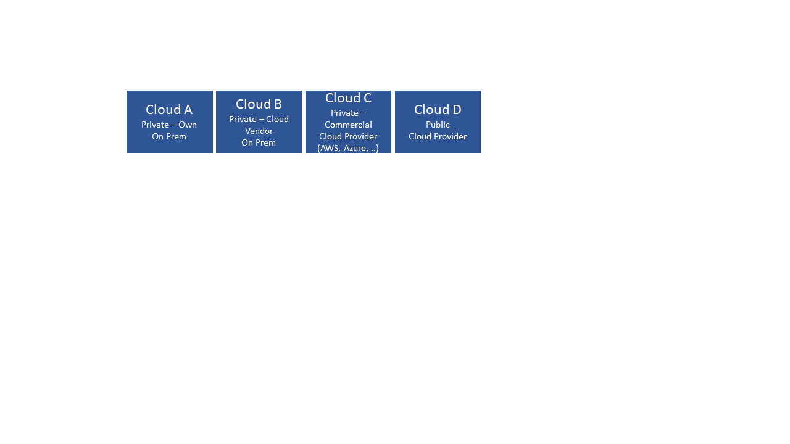
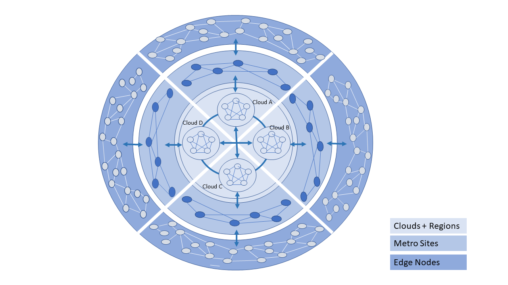
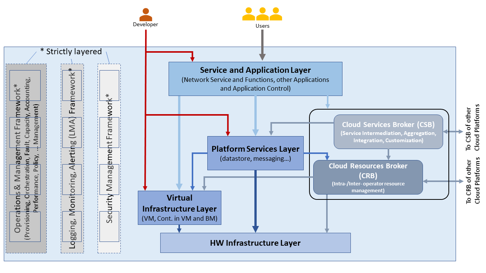
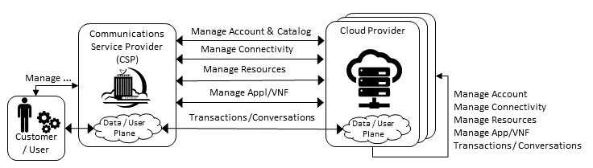
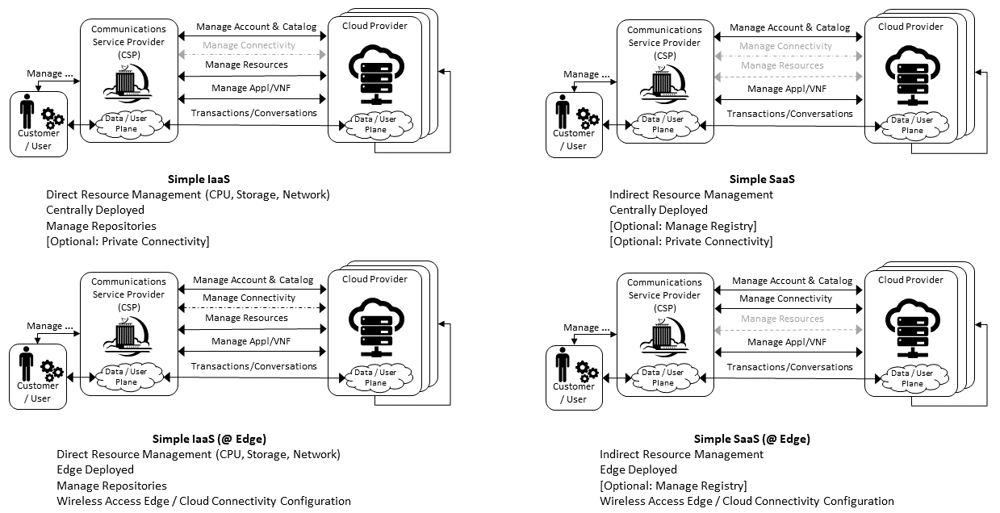
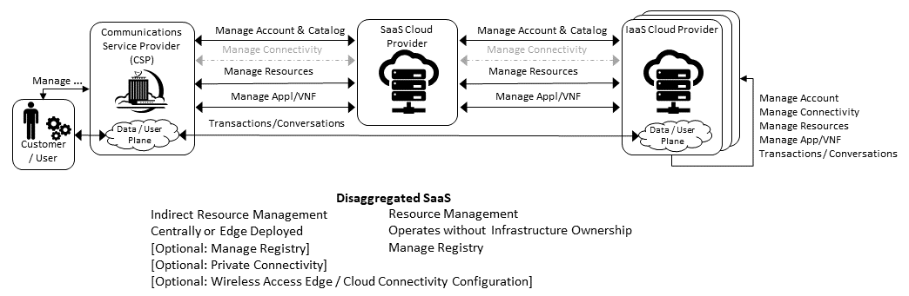
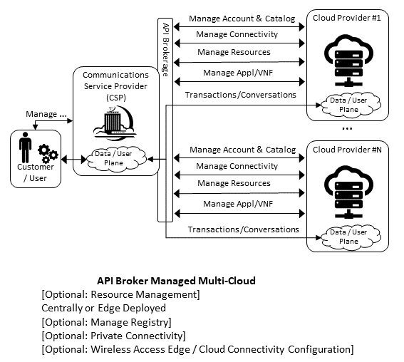
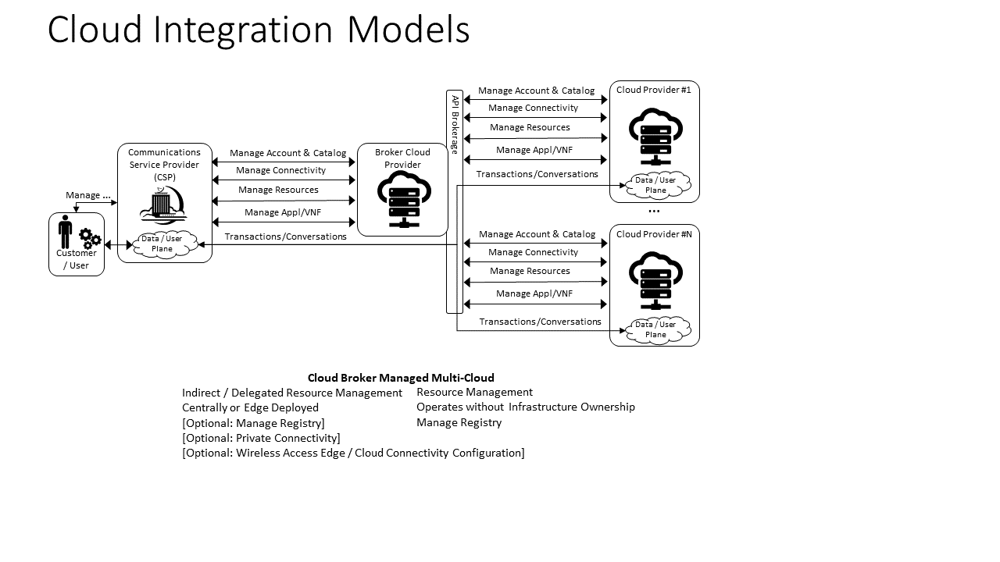

Hybrid Multi-Cloud: Data Centre to Edge
=======================================

Introduction
------------

The :ref:`chapters/chapter03:modelling` focuses on cloud infrastructure abstractions. While these are generic
abstractions they and the associated capabilities of the cloud infrastructure are specified for data centres, central
office and colocation centres. The environmental conditions, facility and other constraints, and the variability of
deployments on the edge are significantly different and, thus, require separate consideration.

It is unrealistic to expect that a private cloud can cost-effectively meet the needs of all workloads when the private
cloud must also meet the needs for peak loads and disaster recovery. For this reason alone, enterprises will need to
implement a hybrid cloud. In a hybrid cloud deployment, at least two or more distinct cloud infrastructures are
interconnected. In a multi-cloud, the distinct cloud infrastructures of the hybrid cloud may be implemented using one or
more technologies. The hybrid multi-cloud infrastructure has differences requiring different abstractions. These hybrid
multi-clouds can be considered to be federated.

In the :ref:`chapters/chapter03:modelling`, the cloud infrastructure is defined. The tenants are required to provide
certain needed services (such as Load Balancer (LB), messaging). Thus, the VNF/CNFs incorporate different versions of
the same services with the resultant issues related to an explosion of services, their integration and management
complexities. To mitigate these issues, the Reference Model must specify the common services that every Telco cloud must
support and thereby require workload developers to utilise these pre-specified services.

A generic Telco cloud is a hybrid multi-cloud or a federated cloud that has deployments in large data centres, central
offices or colocation facilities, and the edge sites. This chapter discusses the characteristics of Telco Edge and
hybrid multi-cloud.

Hybrid Multi-Cloud Architecture
-------------------------------

The GSMA whitepaper on "Operator Platform Concept Phase 1: Edge Cloud Computing" (January 2020) states, "Given the wide
diversity of use cases that the operators will tasked to address, from healthcare to industrial IoT, it seems logical
for operators to create a generic platform that can package the existing assets and capabilities (e.g., voice messaging,
IP data services, billing, security, identity management, etc. ...) as well as the new ones that 5G makes available
(e.g., Edge cloud, network slicing, etc.) in such a way as to create the necessary flexibility required by this new
breed of enterprise customers."

Cloud computing has evolved and matured since 2010 when
`NIST <http://csrc.nist.gov/publications/nistpubs/800-145/SP800-145.pdf>`__ published its definition of cloud computing,
with its 5 essential characteristics, 3 service models and 4 deployment models.

The generic model for an enterprise cloud has to be "hybrid" with the special cases of purely private or public clouds
as subsets of the generic hybrid cloud deployment model. In a hybrid cloud deployment, at least two or more distinct
cloud infrastructures are inter-connected together.

Cloud deployments can be created using a variety of technologies (e.g., OpenStack, Kubernetes) and commercial
technologies (e.g., VMware, AWS, Azure, etc.). A multi-cloud deployment can consist of the use of more than one
technology.

A generic Telco cloud is a hybrid multi-cloud. A better designation would be a federation of clouds - a federated cloud:

- a collection of cooperating, interoperable autonomous component clouds
- the component clouds perform their local operations (internal requests) while also participating in the federation and
  responding to other component clouds (external requests)

  - the component clouds are autonomous in terms of, for example, execution autonomy; please note that in a centralised
    control plane scenario (please see the section "Centralised Control Plane" in the
    "`Edge Computing: Next Steps in Architecture, Design and Testing <https://www.openstack.org/use-cases/edge-computing
    /edge-computing-next-steps-in-architecture-design-and-testing/>`__" whitepaper :cite:p:`openinfraedgearch`) the edge clouds do not have
    total autonomy and are subject to constraints (e.g., workload LCM)
  - execution autonomy is the ability of a component cloud to decide the order in which internal and external requests
    are performed
  - also, a federation controller does not impose changes to the component cloud except for running some central
    component(s) of the federated system (for example, a broker agent – executes as a workload)

- the component clouds are likely to differ in, for example, infrastructure resources and their cloud platform software
- workloads may be distributed on single or multiple clouds, where the clouds may be collocated or geographically
  distributed
- component clouds only surface NBIs (Please note that VMware deployed in a private and a public cloud can be treated as
  a single cloud instance)

Characteristics of a Federated Cloud
------------------------------------

In this section, we will further explore the characteristics of the federated cloud architecture, and architecture
building blocks that constitute the federated cloud. For example, :numref:`Example Hybrid Multi-Cloud Component Cloud`
shows a Telco Cloud that consists of 4 sub-clouds: Private on premise, Cloud Vendor provided on premise, Private
outsourced (Commercial Cloud Provider such as a Hyperscaler Cloud Provider (HCP), and Public outsourced (see
diagram below). Such an implementation of a Telco Cloud allows for mix'n'match of price points, flexibility in market
positioning and time to market, capacity with the objective of attaining near "unlimited" capacity, scaling within a
sub-cloud or through bursting across sub-clouds, access to "local" capacity near user base, and access to specialised
services.

   Example Hybrid Multi-Cloud Component Cloud

Telco Cloud
-----------

The :numref:`Telco Cloud: Data Centre to Edge` presents a visualisation of a Telco operator cloud (or simply, Telco
cloud) with clouds and cloud components distributed across Regional Data Centres, Metro locations (such as Central
Office or a Colocation site) and at the Edge, that are interconnected using a partial mesh network. Please note that at
the Regional centre level the interconnections are likely to be a "fuller" mesh while being a sparser mesh at the Edges.

   Telco Cloud: Data Centre to Edge

The Telco Operator may own and/or have partnerships and network connections to utilize multiple Clouds for network
services, IT workloads, and external subscribers. The types of the component clouds include:

- On Premise Private

  - Open source; Operator or Vendor deployed and managed \| OpenStack or Kubernetes based
  - Vendor developed; Operator or Vendor deployed and managed \| Examples: Azure on Prem, VMware, Packet, Nokia,
    Ericsson, etc.

- On Premise Public: Commercial Cloud service hosted at Operator location but for both Operator and Public use \|
  Example: AWS Wavelength
- Outsourced Private: hosting outsourced; hosting can be at a Commercial Cloud Service \| Examples: Equinix, AWS, etc.
- (Outsourced) Public: Commercial Cloud Service \| Examples: AWS, Azure, VMware, etc.
- Multiple different Clouds can be co-located in the same physical location and may share some of the physical
  infrastructure (for example, racks)
- Outsourced Private: hosting outsourced; hosting can be at a Commercial Cloud Service \| Examples: Equinix, AWS, etc.
- (Outsourced) Public: Commercial Cloud Service \| Examples: AWS, Azure, VMware, etc.
- Multiple different Clouds can be co-located in the same physical location and may share some of the physical
  infrastructure (for example, racks)

In general, a Telco Cloud consists of multiple interconnected very large data centres that serve trans-continental areas
(Regions). A Telco Cloud Region may connect to multiple regions of another Telco Cloud via large capacity networks.
A Telco Cloud also consists of interconnected local/metro sites (multiple possible scenarios). A local site cloud may
connect to multiple Regions within that Telco Cloud or another Telco Cloud. A Telco Cloud also consists of a large
number of interconnected edge nodes where these edge nodes maybe impermanent. A Telco Cloud's Edge node may connect to
multiple local sites within that Telco Cloud or another Telco Cloud; an Edge node may rarely connect to a Telco Cloud
Region.

Table 8-1 captures the essential information about the types of deployments, and responsible parties for cloud
artefacts.

+------------------+-------------------+--------------------+-----------------+------------------+---------------------+
| Type             | System Developer  | System Maintenance | System Operated | Location where   | Primary Resource    |
|                  |                   |                    | & Managed by    | Deployed         | Consumption Models  |
+==================+===================+====================+=================+==================+=====================+
| Private          | Open Source       | Self/Vendor        | Self/Vendor     | On Premise       | Reserved, Dedicated |
| (Internal Users) |                   |                    |                 |                  |                     |
+------------------+-------------------+--------------------+-----------------+------------------+---------------------+
| Private          | Vendor, HCP       | Self/Vendor        | Self/Vendor     | On Premise       | Reserved, Dedicated |
+------------------+-------------------+--------------------+-----------------+------------------+---------------------+
| Public           | Vendor, HCP       | Self/Vendor        | Self/Vendor     | On Premise       | Reserved, On Demand |
+------------------+-------------------+--------------------+-----------------+------------------+---------------------+
| Private          | HCP               | Vendor             | Vendor          | Vendor Locations | Reserved, Dedicated |
+------------------+-------------------+--------------------+-----------------+------------------+---------------------+
| Public           | HCP               | Vendor             | Vendor          | Vendor Locations | On Demand, Reserved |
| (All Users)      |                   |                    |                 |                  |                     |
+------------------+-------------------+--------------------+-----------------+------------------+---------------------+

**Table 8-1:** Cloud Types and the Parties Responsible for Artefacts

Telco Operator Platform Conceptual Architecture
~~~~~~~~~~~~~~~~~~~~~~~~~~~~~~~~~~~~~~~~~~~~~~~

:numref:`Conceptual Architecture of a Telco Operator Platform` shows a conceptual Telco Operator Platform Architecture.
The Cloud Infrastructure Resources Layer exposes virtualised (including containerised) resources on the physical
infrastructure resources and also consists of various virtualisation and management software (see details later in this
chapter). The Cloud Platform Components Layer makes available both elementary and composite objects for use by
application and service developers, and for use by Services during runtime. The Cloud Services Layer exposes the
Services and Applications that are available to the Users; some of the Services and Applications may be sourced from or
execute on other cloud platforms. Please note that while the architecture is shown as a set of layers, this is not an
isolation mechanism and, thus, for example, Users may access the Cloud Infrastructure Resources directly without
interacting with a Broker.

   Conceptual Architecture of a Telco Operator Platform

The Cloud Services and the Cloud Resources Brokers provide value-added services in addition to the fundamental
capabilities like service and resource discovery. These Brokers are critical for a multi-cloud environment to function
and utilise cloud specific plugins to perform the necessary activities. These Brokers can, for example, provision and
manage environments with resources and services for Machine Learning (ML) services, Augmented/Virtual Reality, or
specific industries.

Multi-Cloud Interactions Model
------------------------------

To realise a federated cloud requires the definition and agreement on a set of APIs. These APIs should allow each of the
parties to interact cooperatively and need to cover the management layer: business management and service operations
interactions; as well as the data plane, customer and user, transactions and conversational interfaces.

As outlined in :numref:`Conceptual Architecture of a Telco Operator Platform` above, the exposure point for the
Management Interactions is the "Cloud Service Broker" and the "Cloud Resource Broker". The set of interactions that
these interface points need to provide are defined by the :numref:`Multi-Cloud Interactions Model` below. This provides
a taxonomy for the interactions between the Communications Service Provider and the Cloud Providers.

   Multi-Cloud Interactions Model

The model defines the following core roles:

- Communications Service Provider (CSP) - is the party responsible for providing end user service to their customer
- Customer/User - are the parties that use the service (User) and establishes the business agreement for the service
  provision (Customer). For retail services the customer and user are the same party, while for enterprise services the
  Enterprise is the Customer (responsible for the business agreement) and its representatives are the Users.
- Cloud Providers - are the parties providing the cloud services. These services could be any XaaS service. It could be
  that a CSP has an agreement with a SaaS Cloud, which in turn uses an IaaS Cloud Provider to deliver their service.

The set of high level interactions cover:

- Manage Account & Catalog - covering Account, Users, Subscription, Billing & Catalog of Available Services (where
  Service Provider (not necessarily CSP only) is responsible for creation and publication of catalog contents)
- Manage Connectivity - Public or Private Network, VPN Configuration, CSP Edge/Cloud Connection Configuration,
  Connection Security Profile
- Manage Resource - Resource Pool Management, VM/VNF Management (CPU, Memory, Storage, Network), Image Repository
  Management, Storage Management, VNF/CNF LCM, Monitor Resources
- Manage App/VNF - Image/Container/Registry Management, Deploy/Configure/Scale/Start/Stop App/VNF, Monitor App/VNFs
- Transactions / Conversations - Use Communications Services, Use Edge Applications Services, Use Cloud Services

This model, its actors (roles), and the interactions discussed below, are focused on the provision and 
consumption of cloud services in different stereo-typical deployment scenarios: IaaS, SaaS, CaaS, and Edge. The model 
presented in Chapter 9 deals with the cloud build and maintenance processes in different scenarios. It also defines
the boundaries of the automation domains. These two views complement each other.

Stereo-Typical Scenarios
~~~~~~~~~~~~~~~~~~~~~~~~

A set of stereo-typical interactions cases are illustrated for the cases of a Simple Infrastructure-as-a-Service (IaaS)
and Software-as-a-Service (SaaS), where deployment is on a Cloud Provider's centralised sites and/or Edge sites. The
scenarios help highlight needs for the Cloud Service Broker and Cloud Resources Broker (as per
:numref:`Conceptual Architecture of a Telco Operator Platform`) and hence extent of orchestration required to manage the
interactions.

   Simple Stereo-Typical Interactions

The following patterns are visible:

- For IaaS Cloud Integration:

  - Cloud behaves like a set of virtual servers and, thus, requires virtual server life-cycle management and
    orchestration
  - Depending on whether the cloud is accessed via public internet or private connection will change the extend of the
    Connectivity Management

- For SaaS Cloud Integration:

  - Cloud behaves like a running application/service and requires subscription management, and complex orchestration of
    the app/service and underlying resources is managed by SaaS provider with the User is relieved of having to provide
    direct control of resources

- For CaaS Cloud Integration:

  - Registry for pulling Containers could be from:

    - Cloud in which case consumption model is closer to SaaS or
    - from Private / Public Registry in which case integration model requires specific registry management elements

- For Edge Cloud Integration:

  - Adds need for Communications Service Provider and Cloud Provider physical, network underlay and overlay connectivity
    management

A disaggregated scenario for a CSP using SaaS who uses IaaS is illustrated in the following diagram:

   Disaggregated SaaS Stereo-Typical Interaction

In disaggregated SaaS scenario the application provider is able to operate as an "infra-structureless" organisation.
This could be achieved through SaaS organisation using public IaaS Cloud Providers which could include the CSP itself. A
key consideration for CSP in both cloud provision and consumption in Multi-Cloud scenario is how to manage the
integration across the Cloud Providers.

To make this manageable and avoid integration complexity, there are a number of models:

- Industry Standard APIs that allow consistent consumption across Cloud Providers,
- API Brokerage which provide consistent set of Consumer facings APIs that manage adaption to proprietary APIs
- Cloud Brokerage where the Brokerage function is provided "as a Service" and allow "single pane of glass" to be
  presented for management of the multi-cloud environment

The different means of integrating with and managing Cloud Providers is broadly covered under the umbrella topic of
"Cloud Management Platforms". A survey of applicable standards to achieve this is provided in section 8.5.2.
"Requirements, Reference Architecture & Industry Standards Intersect".

The API and Cloud Brokerage models are illustrated in the following diagrams:

   API Brokerage Multi-Cloud Stereo-Typical Interaction

   Cloud Brokerage Multi-Cloud Stereo-Typical Interaction

.. _requirements-reference-architecture--industry-standards-intersect:

Requirements, Reference Architecture & Industry Standards Intersect
~~~~~~~~~~~~~~~~~~~~~~~~~~~~~~~~~~~~~~~~~~~~~~~~~~~~~~~~~~~~~~~~~~~

The Communications Service Provider (CSP) is both a provider and consumer of Cloud based services.
When the CSP is acting as:

- consumer, in which case the typical consideration is total cost of ownership as the consumption is to usually to
  support internal business operations: BSS/OSS systems;
- provider of cloud services, through operation of their own cloud or reselling of cloud services, in which case the
  typical consideration is margin (cost to offer services vs income received).

These two stances will drive differing approaches to how a CSP would look to manage how it interacts within a
Multi-Cloud environment.

As a consumer of cloud services to support internal Business operations and BSS/OSS, the focus is on meeting the needs
of the organisation's applications . Historically this came with the need to operate and support the organisation's
infrastructure needs. The result was a split of the CIO organisation into Delivery and Operations groups. At the same
time that the CIO application workloads are moving to SaaS and other Cloud Providers, the CTO Network Systems are
migrating from running on custom dedicated infrastructure to run on virtualised COTS infrastructure; examples include
IMS, 3GPP (4G & 5G) functions, IP Routers and Firewalls are being provided as VNFs and CNFs.  These network workloads
are now also being deployed on private CSP clouds as well as public clouds.

As outlined in section "8.4 Telco Cloud", the result is that the CSP "network" is now an interconnected set of
distributed Cloud Infrastructure supported by different Cloud Providers, including the CSP, and, hence, the term
"Hybrid Multi-Cloud", and the need for the CSP to be able to support and utilize this interconnected cloud is both
inevitable and essential.

As a consumer and provider of Cloud Services, the CSP will continue to need to build and manage its own Cloud
Infrastructure as well as provide:

- cloud orchestration solutions to orchestrate the utilisation of cloud services and capabilities from its own and
  other Cloud Providers;
- network orchestration solutions to manage the interconnectivity across its own and other Cloud Provider networks.

The interactions for this are outlined in the "Multi-Cloud Interactions Model", however, to realise this, the CSP will
need to adopt and sponsor a set of standards that are necessary to support these interactions. The identification of
existing applicable standards and gaps across the interactions needs to be completed. As a first step, the following
criteria for inclusion of a standard/technology is defined. These standards/technologies must:

- provide capabilities that are necessary to achieve hybrid multi-cloud vision and the multi-cloud interactions
- be already mature Open Standards that have either been adopted or nurtured by recognised bodies with the
  telecommunications industry (e.g. ITU, ETSI, TMForum, GSMA, 3GPP, ISO and national Standards Organiasations, (ANSI, NIST, etc)
- have reference implementations or an active open source project/s or consortia providing implementations (e.g.,
  CNCF (Cloud Native Computing Foundation). Open Infrastructure Foundation)
- allow the CSP to source delivery and support services based on these from multiple vendors
- allow the CSP to actively contribute to and request capabilities/coverage of the standard/technology
- not  be the sole proprietary property of a vendor/company
- not be focused on "Transactions/Conversations" or "User/Data Plane" standards (typically IETF, IEEE,
  MEF/Carrier Ethernet etc.)

Hybrid, Edge, and Multi-Cloud unified management Platform
~~~~~~~~~~~~~~~~~~~~~~~~~~~~~~~~~~~~~~~~~~~~~~~~~~~~~~~~~

As organisations spread their resources across on-premises, multiple clouds, and the Edge, the need for a single set
of tools and processes to manage and operate across these Hybrid, Edge, and Multi-clouds (HEM clouds) is obvious
as can be seen from the following simplistic scenarios.

Scenario: An operator has private clouds that it utilises for its workloads. Over time, the operator evolves their
environment:

- A: The operator has decided to utilise one or more public clouds for some of its workloads.
- B: The operator has decided to utilise an edge cloud for some of its clients.
- C: The operator has decided to create edge clouds for some of its clients.

Scenario B can be treated as being the same as Scenario A. Scenario C is akin to the private cloud except for location
and control over the facilities at that location. For its workloads, the operator will have to utilise the target clouds
tools or APIs to create the necessary accounts, billing arrangements, quotas, etc. Then create the needed resources,
such as VMs or Kubernetes clusters, etc. Following up with creating needed storage, networking, etc. before
onboarding the workload and operating it. This is complex even when the operator is dealing with say only one other
cloud, in addition to operating its own cloud. The operator is faced with a number of challenges including acquiring a
new set of skills, knowledge of APIs, tools, and the complexity of managing different policies, updates, etc. This
becomes impossible to manage when incorporating more than one other cloud. Hence the need for a Single Pane of Glass.

This Hybrid, Edge, and Multi-Cloud unified management Platform (HEMP) (a.k.a. Single-Pane-of-Glass) provides
capabilities to consistently:

- manage accounts, credentials, resources and services

  - across facilities (regions, data centres, edge locations)

- interoperate the different clouds
- implement common policies and governance standards
- manage a common security posture
- provide an integrated visualisation into the infrastructure and workloads.

through a common set of governance and operational practices.

GSMA's Operator Platform Group (OPG) specify a federated model and specify requirements for the Edge Platforms
(Operator Platform Telco Edge Requirements v2.0 :cite:p:`gsmaopg02`)
applicable to other cloud deployments. Anuket RM is implementation agnostic, viz., whether the implementation uses
agents, federations or some other mechanisms.

The following tables list some of the requirements for the Hybrid, Edge, and Multi cloud operator Platform (HEMP). These
requirements are in addition to the requirements in other chapters of this RM.

**HEMP General Requirements**

+-------------+-------------------------------------------------+------------------------------------------------------+
| Ref         | Requirement                                     | Definition/Note                                      |
+=============+=================================================+======================================================+
| hem.gen.001 | HEMP should use only published APIs in managing | For example, to accomplish the example in            |
|             | component clouds                                | `hem.gen.003` it will use the published APIs of the  |
|             |                                                 | target cloud.                                        |
+-------------+-------------------------------------------------+------------------------------------------------------+
| hem.gen.002 | HEMP should publish all of the APIs used by any | For example, the provided GUI portal shall only use  |
|             | of its components                               | HEMP published APIs                                  |
+-------------+-------------------------------------------------+------------------------------------------------------+
| hem.gen.003 | HEMP should provide for common terms for        | For example, "create Account" across the different   |
|             | interaction with its constituent clouds         | clouds                                               |
+-------------+-------------------------------------------------+------------------------------------------------------+
| hem.gen.004 | HEMP should generalise and define a common set  | Example resources: hosts (including BareMetal),      |
|             | of resources available to be managed in         | Virtual Machines (VM), vCPU, Memory, Storage,        |
|             | inconstituent clouds                            | Network, kubernetes clusters, kubernetes nodes,      |
|             |                                                 | Images (OS, and others), credentials. For private    |
|             |                                                 | cloud additional example resources: Racks, ToR/CE    |
|             |                                                 | switches, Platform images                            |
+-------------+-------------------------------------------------+------------------------------------------------------+
| hem.gen.005 | HEMP should provide a common interface for      |                                                      |
|             | managing component clouds                       |                                                      |
+-------------+-------------------------------------------------+------------------------------------------------------+
| hem.gen.006 | HEMP should expose resources from all cloud     | See example of resources in `hem.gen.004`            |
|             | operators and locations (regions, sites, etc.)	| Definition/Note                                      |
+-------------+-------------------------------------------------+------------------------------------------------------+
| hem.gen.007 | HEMP should allow reservation of resources if   |                                                      |
|             | the component cloud operator allows             |                                                      |
+-------------+-------------------------------------------------+------------------------------------------------------+
| hem.gen.008 | HEMP should support multi-tenancy               |                                                      |
+-------------+-------------------------------------------------+------------------------------------------------------+

**Table 8-2:** Hybrid, Edge, and Multi cloud operator Platform (HEMP) General Requirements

**HEMP Operations Requirements**

+-------------+--------------------------------------------------------+-----------------------------------------------+
| Ref         | Requirement                                            | Definition/Note                               |
+=============+========================================================+===============================================+
| hem.ops.001 | HEMP should generalise and define a common set of      |                                               |
|             | management operations available in constituent clouds; |                                               |
|             | required operations include: create, deploy, configure,|                                               |
|             | start, suspend, stop, resume, reboot, delete, scale,   |                                               |
|             | list. Some operations may only be available for a      |                                               |
|             | subset of resources.                                   |                                               |
+-------------+--------------------------------------------------------+-----------------------------------------------+
| hem.ops.002 | HEMP should centrally manage all resources (across all |                                               |
|             | constituent clouds)                                    |                                               |
+-------------+--------------------------------------------------------+-----------------------------------------------+
| hem.ops.003 | HEMP should centrally operate all constituent clouds   |                                               |
|             |                                                        |                                               |
+-------------+--------------------------------------------------------+-----------------------------------------------+
| hem.ops.004 | HEMP should provide mechanisms to integrate new clouds | This may require pre-development of necessary |
|             |                                                        | capabilities for the support of HEMP          |
|             |                                                        | abstractions, and impementation of            |
|             |                                                        | connectivity with the new cloud               |
+-------------+--------------------------------------------------------+-----------------------------------------------+
| hem.ops.005 | HEMP should provide mechanisms to drop a constituent   | For example, the provided GUI portal shall    |
|             | cloud                                                  | only use HEMP published APIs                  |
+-------------+--------------------------------------------------------+-----------------------------------------------+
| hem.ops.006 | HEMP should provide mechanisms and processes to onboard|                                               |
|             | existing assets (resources, connectivity, etc.)        |                                               |
+-------------+--------------------------------------------------------+-----------------------------------------------+
| hem.ops.007 | HEMP should provide mechanisms and processes for the   |                                               |
|             | automated configuration management of all environments |                                               |
|             | and resources                                          |                                               |
+-------------+--------------------------------------------------------+-----------------------------------------------+

**Table 8-3:**  Hybrid, Edge, and Multi cloud operator Platform (HEMP) Operability Requirements

**HEMP LCM Requirements**

+-------------+--------------------------------------------------------+-----------------------------------------------+
| Ref         | Requirement                                            | Definition/Note                               |
+=============+========================================================+===============================================+
| hem.lcm.001 | HEMP should monitor all environments and assets        |                                               |
+-------------+--------------------------------------------------------+-----------------------------------------------+
| hem.lcm.002 | HEMP should provide visibility into the health of all  |                                               |
|             | assets                                                 |                                               |
+-------------+--------------------------------------------------------+-----------------------------------------------+
| hem.lcm.003 | HEMP should provide capabilities for a centralised     |                                               |
|             | visibility and management of all alerts                |                                               |
+-------------+--------------------------------------------------------+-----------------------------------------------+
| hem.lcm.004 | HEMP should provide capabilities for a centralised     | This doesn't preclude local log analytics     |
|             | analysis of all logs                                   |                                               |
+-------------+--------------------------------------------------------+-----------------------------------------------+

Table : Hybrid, Edge, and Multi cloud operator Platform (HEMP) Life Cycle Management (LCM) Requirements

**HEMP Security Requirements**

+-------------+--------------------------------------------------------+-----------------------------------------------+
| Ref         | Requirement                                            | Definition/Note                               |
+=============+========================================================+===============================================+
| hem.sec.001 | HEMP should provide capabilities for the centralised   |                                               |
|             | management of all security policies                    |                                               |
+-------------+--------------------------------------------------------+-----------------------------------------------+
| hem.sec.002 | HEMP should provide capabilities for the centralised   |                                               |
|             | tracking of compliance of all security requirements    |                                               |
|             | (:ref:`chapters/chapter07:consolidated                 |                                               |
|             | security requirements`)                                |                                               |
+-------------+--------------------------------------------------------+-----------------------------------------------+
| hem.sec.003 | HEMP should provide capabilities for insights into     |                                               |
|             | changes that resulted for resource non-compliance      |                                               |
+-------------+--------------------------------------------------------+-----------------------------------------------+

**Table 8-4:**  Hybrid, Edge, and Multi cloud operator Platform (HEMP) Security Requirements

Aspects of Multi-Cloud Security
~~~~~~~~~~~~~~~~~~~~~~~~~~~~~~~

Cloud infrastructures, emerging as a key element in the telco operator ecosystem, are part of the attack surface
landscape. This is particularly worrying with the 5G rollout becoming a critical business necessity. It is important to
be vigilant of Cloud-focused threats and associated adversarial behaviours, methods, tools, and strategies that cyber
threat actors use. In the multi-cloud ecosystem comprised of different security postures and policies,
network domains, products, and business partnerships, the responsibility for managing these different
cloud environments necessary to support 5G use cases falls to different enterprises, creating
new levels of complexities and a new range of security risks.

For services deployed on hybrid multi-cloud environments, the security responsibility can be
delegated to cloud service providers, but the Telco operator is always accountable for its
customers data protection (at rest, in transit, and in use) and for the security posture of
the deployments. It implies that a consistent security posture is ensured across multiple
cloud service providers. The white paper "Evolving 5G security for the cloud", 5G Americas,
September 2022, addresses this issue. A Mobile Network Operator (MNO) deploying 5G networks
in hybrid multi-cloud environment is a cloud consumer and is accountable for the security
of all layers of the cloud stack. The white paper details the cloud shared security model
in the three cloud service models: IaaS, PaaS, and SaaS. The MNO must ensure the cloud
service agreement articulation of the security responsibilities. The white paper also
highlights on the importance of applying a zero trust mindset for cloud based deployment
for RAN and core functions to secure the networks.

In hybrid multi-cloud environment, there are additional security principles to be considered.
These principles, see the table below, are
drawn from the collaboration with the GSMA Fraud and Security Group (FASG) and the "5G security Guide",
FS.40 v2.0 document :cite:p:`gsmafs40`.

+--------------------------------+-------------------------------------------------------------------------------------+
| Multi-cloud Security Principle | Description                                                                         |
+================================+=====================================================================================+
| Policy synchronization         | Consistency in applying the right security policies across environments, services,  |
|                                | interfaces, and configured resources                                                |
+--------------------------------+-------------------------------------------------------------------------------------+
| Visibility                     | A common data model approach to share events and behaviours across all the key      |
|                                | compute, storage, network, and applications resources, environments, virtualised    |
|                                | platforms, containers and interfaces                                                |
+--------------------------------+-------------------------------------------------------------------------------------+
| Monitoring                     | Centralisation, correlation, and visualisation of security information across the   |
|                                | different cloud environments to provide an end-to-end view and enable timely        |
|                                | response to attacks                                                                 |
+--------------------------------+-------------------------------------------------------------------------------------+
| Automation                     | Automation of critical activities including cloud security posture management,      |
|                                | continuous security assessments, compliance monitoring, detection of                |
|                                | misconfigurations and identification and remediation of risks                       |
+--------------------------------+-------------------------------------------------------------------------------------+
| Access Management              | Wide range of users including administrators, testers, DevOps, and developers and   |
|                                | customers should be organised into security groups with privileges appropriate to   |
|                                | different resources and environments                                                |
+--------------------------------+-------------------------------------------------------------------------------------+
| Security Operations Model      | Augmentation of security services provided by cloud service providers with the      |
|                                | vetted third-party and/or open-source tools and services, all incorporated into the |
|                                | established overall security operations model                                       |
+--------------------------------+-------------------------------------------------------------------------------------+

**Table 8-5:**  Multi-Cloud Security Principles

For telco operators to run their network functions in a multi-cloud environment, and specifically, in public clouds, the
industry will need a set of new standards and new security tools to manage and regulate the interactions between
multi-cloud participating parties. To give an example of a step in this direction, refer to the ETSI specification
`TS 103 457 <https://www.etsi.org/deliver/etsi_ts/103400_103499/103457/01.01.01_60/ts_103457v010101p.pdf>`__ “Interface
to offload sensitive functions to a trusted domain”, which provides extra security requirements for public clouds so as
to enable telco operators the option of running network functions in public clouds.

There is also another security aspect to consider, which is related to the autonomous nature of the participants in the
multi-cloud. We can prescribe certain things and if not satisfied treat that party as "untrusted". This problem has been
addressed to some extent in TS 103 457. This standard introduces a concept of an LTD (Less Trusted Domain) and an MTD
(More Trusted Domain) and specifies the TCDI (Trusted Cross-Domain Interface) to standardise secure interactions between
them. The standard defined the following elementary functions of TCDI:
Connection and session management
Data and value management
Transferring cryptography functionality:

- Entropy request
- Encryption keys request
- Trusted timestamping
- Secure archive
- Secure storage
- Search capabilities

As described in Sec. 1 (Scope) of the TS 103 457 document :cite:p:`etsits103sp457`, it specifies "… a high-level service-oriented interface, as
an application layer with a set of mandatory functions, to access secured services provided by, and executed in a More
Trusted Domain. The transport layer is out of scope and left to the architecture implementation". The standard provides
extra security features for sensitive functions down to individual Virtual Machines or Containers. As such, it is
recommended that the relevant components of reference models, reference architecture, reference implementations and
reference compliance take notice of this standard and ensure their compatibility, wherever possible.

Telco Edge Cloud
----------------

This section presents the characteristics and capabilities of different Edge cloud deployment locations, infrastructure,
footprint, etc. Please note that in the literature many terms are used and, thus, this section includes a table that
tries to map these different terms.

Telco Edge Cloud: Deployment Environment Characteristics
~~~~~~~~~~~~~~~~~~~~~~~~~~~~~~~~~~~~~~~~~~~~~~~~~~~~~~~~

Telco Edge Cloud (TEC) deployment locations can be environmentally friendly such as indoors (offices, buildings, etc.)
or environmentally challenged such as outdoors (near network radios, curb side, etc.) or environmentally harsh
environments (factories, noise, chemical, heat and electromagnetic exposure, etc). Some of the more salient
characteristics are captured in Table 8-2.

+-----------------+-----------------+-----------------+----------------+------------+----------------+-----------------+
|                 | Facility        | Environmental   | Capabilities   | Physical   | Implications   | Deployment      |
|                 | Type            | Characteristics |                | Security   |                | Locations       |
+=================+=================+=================+================+============+================+=================+
| Environmentally | Indoors:        | Protected, Safe | Easy access to | Controlled | Commoditised   | Indoor venues:  |
| friendly        | typical         | for common      | continuous     | Access     | infrastructure | homes, shops,   |
|                 | commercial      | infrastructure  | electric       |            | with no or     | offices,        |
|                 | or              |                 | power,         |            | minimal need   | stationary and  |
|                 | residential     |                 | High/Medium    |            | for hardening  | secure          |
|                 | structures      |                 | bandwidth      |            | /              | cabinets, Data  |
|                 |                 |                 | Fixed and/or   |            | ruggedisation, | centers,        |
|                 |                 |                 | wireless       |            | Operational    | central         |
|                 |                 |                 | network access |            | benefits for   | offices,        |
|                 |                 |                 |                |            | installation   | co-location     |
|                 |                 |                 |                |            | and            | facilities,     |
|                 |                 |                 |                |            | maintenance    | Vendor          |
|                 |                 |                 |                |            |                | premises,       |
|                 |                 |                 |                |            |                | Customer        |
|                 |                 |                 |                |            |                | premises        |
+-----------------+-----------------+-----------------+----------------+------------+----------------+-----------------+
| Environmentally | Outdoors        | maybe           | May only have  | No or      | Expensive      | Example         |
| challenged      | and/or exposed  | unprotected,    | battery power, | minimal    | ruggedisation, | locations: curb |
|                 | to              | Exposure to     | Low/Medium     | access     | Operationally  | side, near      |
|                 | environmentally | abnormal levels | bandwidth      | control    | complex        | cellular        |
|                 | harsh           | of noise,       | Fixed and/or   |            |                | radios,         |
|                 | conditions      | vibration,      | mobile network |            |                |                 |
|                 |                 | heat, chemical, | access         |            |                |                 |
|                 |                 | electromagnetic |                |            |                |                 |
|                 |                 | pollution       |                |            |                |                 |
+-----------------+-----------------+-----------------+----------------+------------+----------------+-----------------+

**Table 8-6:** TEC Deployment Location Characteristics & Capabilities**

Telco Edge Cloud: Infrastructure Characteristics
~~~~~~~~~~~~~~~~~~~~~~~~~~~~~~~~~~~~~~~~~~~~~~~~

Commodity hardware is only suited for environmentally friendly environments. Commodity hardware have standardised
designs and form factors. Cloud deployments in data centres typically use such commodity hardware with standardised
configurations resulting in operational benefits for procurement, installation and ongoing operations.

In addition to the type of infrastructure hosted in data centre clouds, facilities with smaller sized infrastructure
deployments, such as central offices or co-location facilities, may also host non-standard hardware designs including
specialised components. The introduction of specialised hardware and custom configurations increases the cloud
operations and management complexity.

At the edge, the infrastructure may further include ruggedised hardware for harsh environments and hardware with
different form factors. With the evolution of IoT and ubiquitous connectivity (inclusive of personal devices) to 
consider extreme-edge devices as part of the ecosystem. This will require need to integrate with and offer programmability  
and processing capabilities for these devices. 

The end-to-end orchestration will need to support the extreme edge use cases.

Telco Edge Cloud: Infrastructure Profiles
~~~~~~~~~~~~~~~~~~~~~~~~~~~~~~~~~~~~~~~~~

The :ref:`chapters/chapter04:profiles and workload flavours` section specifies two infrastructure profiles:

The **Basic** cloud infrastructure profile is intended for use by both IT and Network Function workloads that have low
to medium network throughput requirements.

The **High Performance** cloud infrastructure profile is intended for use by applications that have high network
throughput requirements (up to 50Gbps).

The High Performance profile can specify extensions for hardware offloading; please see
:ref:`chapters/chapter03:hardware acceleration abstraction`. The Reference Model High Performance profile
includes an initial set of :ref:`chapters/chapter04:profile extensions`.

Based on the infrastructure deployed at the edge, Table 8-3 specifies the
:ref:`chapters/chapter05:feature set and requirements from infrastructure` that would
need to be relaxed.

+----------------------+--------------+----------------------+-----------------------------+---------------------------+
| Reference            | Feature      | Description          | As Specified in RM Chapter  | Exception for Edge        |
|                      |              |                      | 05                          |                           |
|                      |              |                      +--------------+--------------+-------------+-------------+
|                      |              |                      | Basic Type   | High         | Basic Type  | High        |
|                      |              |                      |              | Performance  |             | Performance |
+======================+==============+======================+==============+==============+=============+=============+
| infra.stg.cfg.003    | Storage with |                      | N            | Y            | N           | Optional    |
|                      | replication  |                      |              |              |             |             |
+----------------------+--------------+----------------------+--------------+--------------+-------------+-------------+
| infra.stg.cfg.004    | Storage with |                      | Y            | Y            | N           | Optional    |
|                      | encryption   |                      |              |              |             |             |
+----------------------+--------------+----------------------+--------------+--------------+-------------+-------------+
| infra.hw.cpu.cfg.001 | Minimum      | This determines the  | 2            | 2            | 1           | 1           |
|                      | Number of    | minimum number of    |              |              |             |             |
|                      | CPU sockets  | CPU sockets within   |              |              |             |             |
|                      |              | each host            |              |              |             |             |
+----------------------+--------------+----------------------+--------------+--------------+-------------+-------------+
| infra.hw.cpu.cfg.002 | Minimum      | This determines the  | 20           | 20           | 1           | 1           |
|                      | Number of    | number of cores      |              |              |             |             |
|                      | cores per    | needed per CPU.      |              |              |             |             |
|                      | CPU          |                      |              |              |             |             |
+----------------------+--------------+----------------------+--------------+--------------+-------------+-------------+
| infra.hw.cpu.cfg.003 | NUMA         | NUMA alignment       | N            | Y            | N           | Y (*)       |
|                      | alignment    | support and BIOS     |              |              |             |             |
|                      |              | configured to enable |              |              |             |             |
|                      |              | NUMA                 |              |              |             |             |
+----------------------+--------------+----------------------+--------------+--------------+-------------+-------------+

**Table 8-4. TEC Exceptions to Infrastructure Profile features and requirements**

(*) immaterial if the number of CPU sockets (infra.hw.cpu.cfg.001) is 1

Please note that none of the listed parameters form part of a typical OpenStack flavour except that the vCPU and memory
requirements of a flavour cannot exceed the available hardware capacity.

Telco Edge Cloud: Platform Services Deployment
~~~~~~~~~~~~~~~~~~~~~~~~~~~~~~~~~~~~~~~~~~~~~~

This section characterises the hardware capabilities for different edge deployments and the Platform services that run
on the infrastructure. Please note, that the Platform services are containerised to save resources, and benefit from
intrinsic availability and auto-scaling capabilities.

+-----------+--------------------------------------------------------+-------------------------+-----------------------+
|           | Platform Services                                      | Storage                 | Network Services      |
|           +-------+-------+-------+-------+-------+-------+--------+--------+--------+-------+-------+-------+-------+
|           | Iden- | Image | Plac- | Comp- | Netw- | Mess- | DB     | Ephem- | Persi- | Pers- | Mana- | Unde- | Over- |
|           | tity  |       | ement | ute   | orki- | age   | Server | eral   | stent  | iste- | geme- | rlay  | lay   |
|           |       |       |       |       | ng    | Queue |        |        | Block  | nt    | nt    | (Pro- |       |
|           |       |       |       |       |       |       |        |        |        | Obje- |       | vid-  |       |
|           |       |       |       |       |       |       |        |        |        | ct    |       | er)   |       |
+===========+=======+=======+=======+=======+=======+=======+========+========+========+=======+=======+=======+=======+
| Control   | ✅    | ✅    | ✅    | ✅    | ✅    | ✅    | ✅     |        | ✅     |       | ✅    | ✅    | ✅    |
| Nodes     |       |       |       |       |       |       |        |        |        |       |       |       |       |
+-----------+-------+-------+-------+-------+-------+-------+--------+--------+--------+-------+-------+-------+-------+
| Workload  |       |       |       | ✅    | ✅    |       |        | ✅     | ✅     | ✅    | ✅    | ✅    | ✅    |
| Nodes     |       |       |       |       |       |       |        |        |        |       |       |       |       |
| (Compute) |       |       |       |       |       |       |        |        |        |       |       |       |       |
+-----------+-------+-------+-------+-------+-------+-------+--------+--------+--------+-------+-------+-------+-------+
| Storage   |       |       |       |       |       |       |        |        | ✅     | ✅    | ✅    | ✅    | ✅    |
| Nodes     |       |       |       |       |       |       |        |        |        |       |       |       |       |
+-----------+-------+-------+-------+-------+-------+-------+--------+--------+--------+-------+-------+-------+-------+

**Table 8-5. Characteristics of Infrastructure nodes**

Depending on the facility capabilities, deployments at the edge may be similar to one of the following:

-  Small footprint edge device
-  Single server: deploy multiple (one or more) workloads
-  Single server: single Controller and multiple (one or more) workloads
-  HA at edge (at least 2 edge servers): Multiple Controller and multiple workloads

Comparison of Deployment Topologies and Edge terms
~~~~~~~~~~~~~~~~~~~~~~~~~~~~~~~~~~~~~~~~~~~~~~~~~~

+--------+--------+--------+--------+--------+--------+--------+--------+-------+-------+-------+-------+-------+------+
| This   | Comp-  | Stor-  | Netwo- | RTT    | Secur- | Scala- | Elast- | Resi- | Pref- | Upgr- | Open- | OPNFV | Edge |
| Speci- | ute    | age    | rking  |        | ity    | bility | icity  | lie-  | erred | ades  | Stack | Edge  | Glo- |
| ficat- |        |        |        |        |        |        |        | ncy   | Work- |       |       |       | ssa- |
| ion    |        |        |        |        |        |        |        |       | load  |       |       |       | ry   |
|        |        |        |        |        |        |        |        |       | Arch- |       |       |       |      |
|        |        |        |        |        |        |        |        |       | itec- |       |       |       |      |
|        |        |        |        |        |        |        |        |       | ture  |       |       |       |      |
+========+========+========+========+========+========+========+========+=======+=======+=======+=======+=======+======+
| Regio- | 1000'- | 10's   | >100   | ~100   | Highly | Horiz- | Rapid  | Infr- | Micr- | Firm- | Cent- |       |      |
| nal    | s,     | EB,    | Gbps,  | ms     | Secure | ontal  | spin   | astr- | oser- | ware: | ral   |       |      |
| Data   | Stand- | Stand- | Stand- |        |        | and    | up and | uctu- | vices | When  | Data  |       |      |
| Centre | ardis- | ardis- | ardis- |        |        | unlim- | down   | re    | bas-  | requ- | Cent- |       |      |
| (DC),  | ed,    | ed,    | ed     |        |        | ited   |        | arch- | ed,   | ired, | re    |       |      |
| Fixed  | >1 CPU | HDD    |        |        |        | scali- |        | itec- | Stat- | Plat- |       |       |      |
|        | >20 c- | and    |        |        |        | ng     |        | ted   | ele-  | form  |       |       |      |
|        | ores / | NVMe,  |        |        |        |        |        | for   | ss,   | SW:   |       |       |      |
|        | CPU    | Perma- |        |        |        |        |        | resi- | Hos-  | CD    |       |       |      |
|        |        | nence  |        |        |        |        |        | lien- | ted   |       |       |       |      |
|        |        |        |        |        |        |        |        | cy,   | on    |       |       |       |      |
|        |        |        |        |        |        |        |        | Redu- | Cont- |       |       |       |      |
|        |        |        |        |        |        |        |        | ndan- | aine- |       |       |       |      |
|        |        |        |        |        |        |        |        | cy    | rs    |       |       |       |      |
|        |        |        |        |        |        |        |        | for   |       |       |       |       |      |
|        |        |        |        |        |        |        |        | FT    |       |       |       |       |      |
|        |        |        |        |        |        |        |        | and   |       |       |       |       |      |
|        |        |        |        |        |        |        |        | HA    |       |       |       |       |      |
+--------+--------+--------+--------+--------+--------+--------+--------+-------+-------+-------+-------+-------+------+
| Metro  | 10's   | 100's  | > 100  | ~10 ms | Highly | Horiz- | Rapid  | Infr- | Micr- | Firm- | Edge  | Large | Agg- |
| Data   | to     | PB,    | Gbps,  |        | Secure | ontal  | spin   | astr- | oser- | ware: | Site  | Edge  | reg- |
| Centr- | 100's, | Stand- | Stand- |        |        | but    | up and | uctu- | vices | When  |       |       | ati- |
| es,    | Stand- | ardis- | ardis- |        |        | limit- | down   | re    | bas-  | requ- |       |       | on   |
| Fixed  | ardis- | ed,    | ed     |        |        | ed     |        | arch- | ed,   | ired, |       |       | Edge |
|        | ed,    | NVMe   |        |        |        | scal-  |        | itec- | Stat- | Plat- |       |       |      |
|        | >1 CPU | on     |        |        |        | ing    |        | ted   | ele-  | form  |       |       |      |
|        | >20 c- | PCIe,  |        |        |        |        |        | for   | ss,   | SW:   |       |       |      |
|        | ores   | Perma- |        |        |        |        |        | some  | Host- | CD    |       |       |      |
|        | / CPU  | nence  |        |        |        |        |        | level | ed on |       |       |       |      |
|        |        |        |        |        |        |        |        | of    | Cont- |       |       |       |      |
|        |        |        |        |        |        |        |        | resi- | aine- |       |       |       |      |
|        |        |        |        |        |        |        |        | lien- | rs    |       |       |       |      |
|        |        |        |        |        |        |        |        | cy,   |       |       |       |       |      |
|        |        |        |        |        |        |        |        | Redu- |       |       |       |       |      |
|        |        |        |        |        |        |        |        | ndan  |       |       |       |       |      |
|        |        |        |        |        |        |        |        | cy    |       |       |       |       |      |
|        |        |        |        |        |        |        |        | for   |       |       |       |       |      |
|        |        |        |        |        |        |        |        | limi- |       |       |       |       |      |
|        |        |        |        |        |        |        |        | ted   |       |       |       |       |      |
|        |        |        |        |        |        |        |        | FT    |       |       |       |       |      |
|        |        |        |        |        |        |        |        | and   |       |       |       |       |      |
|        |        |        |        |        |        |        |        | HA    |       |       |       |       |      |
+--------+--------+--------+--------+--------+--------+--------+--------+-------+-------+-------+-------+-------+------+
| Edge,  | 10's,  | 100    | 50 Gb- | ~5 ms  | Low    | Horiz- | Rapid  | Appl- | Micr- | Firm- | Far   | Medi- | Acc- |
| Fixed  | Some   | TB,    | ps,    |        | Level  | ontal  | spin   | icat- | oser- | ware: | Edge  | um    | ess  |
| /      | Varia- | Stand- | Stand- |        | of     | but    | up     | ions  | vices | When  | Site  | Edge  | Edge |
| Mobile | bili-  | ardis- | ardi-  |        | Trust  | highly | (when  | desi- | bas-  | requ- |       |       | /    |
|        | ty,    | ed,    | sed    |        |        | const- | possi- | gned  | ed,   | ired, |       |       | Agg- |
|        | >=1    | NVMe   |        |        |        | rained | ble)   | for   | Stat- | Plat- |       |       | rega-|
|        | CPU,   | on     |        |        |        | scal-  | and    | resi- | ele-  | form  |       |       | tion |
|        | >10    | PCIe,  |        |        |        | ing,   | down   | lien- | ss,   | SW:   |       |       | Edge |
|        | cores  | Perma- |        |        |        | if any |        | cy    | Host- | CD    |       |       |      |
|        | / CPU  | nence  |        |        |        |        |        | agai- | ed on |       |       |       |      |
|        |        | /      |        |        |        |        |        | nst   | Cont- |       |       |       |      |
|        |        | Ephem- |        |        |        |        |        | infra | aine- |       |       |       |      |
|        |        | eral   |        |        |        |        |        | fail- | rs    |       |       |       |      |
|        |        |        |        |        |        |        |        | ures, |       |       |       |       |      |
|        |        |        |        |        |        |        |        | No or |       |       |       |       |      |
|        |        |        |        |        |        |        |        | high- |       |       |       |       |      |
|        |        |        |        |        |        |        |        | ly    |       |       |       |       |      |
|        |        |        |        |        |        |        |        | limi- |       |       |       |       |      |
|        |        |        |        |        |        |        |        | ted   |       |       |       |       |      |
|        |        |        |        |        |        |        |        | redu- |       |       |       |       |      |
|        |        |        |        |        |        |        |        | ndan- |       |       |       |       |      |
|        |        |        |        |        |        |        |        | cy    |       |       |       |       |      |
+--------+--------+--------+--------+--------+--------+--------+--------+-------+-------+-------+-------+-------+------+
| Mini-  | 1's,   | 10's   | 10     | <2 ms, | Untru- | Limit- | Const- | Appl- | Micr- | Plat- | Fog   | Small | Acc- |
| /      | High   | GB,    | Gbps,  | Locat- | sted   | ed     | rained | icat- | oerv- | form  | Comp- | Edge  | ess  |
| Micro- | Varia- | NVMe,  | Conne- | ed in  |        | Verti- |        | ions  | ices  |       | uting |       | Edge |
| Edge,  | bili-  | Ephem- | ctivi- | netwo- |        | cal    |        | desi- | based |       | (Mos- |       |      |
| Mobile | ty,    | eral,  | ty not | rk     |        | Scali- |        | gned  | or    |       | tly   |       |      |
| /      | Harsh  | Cachi- | Guara- | proxi- |        | ng     |        | for   | mono- |       | depr- |       |      |
| Fixed  | Envir- | ng     | nteed  | mity   |        | (resi- |        | resi- | lit-  |       | ecat- |       |      |
|        | onmen- |        |        | of     |        | zing)  |        | lien- | hic,  |       | ed    |       |      |
|        | ts,    |        |        | EUD /  |        |        |        | cy    | Stat- |       | term- |       |      |
|        | 1 CPU, |        |        | IoT    |        |        |        | agai- | eless |       | inol- |       |      |
|        | >2     |        |        |        |        |        |        | nst   | or    |       | ogy), |       |      |
|        | cores  |        |        |        |        |        |        | infra | Stat- |       | Extr- |       |      |
|        | / CPU  |        |        |        |        |        |        | fail- | eful, |       | eme   |       |      |
|        |        |        |        |        |        |        |        | ures, | Host- |       | Edge, |       |      |
|        |        |        |        |        |        |        |        | No or | ed on |       | Far   |       |      |
|        |        |        |        |        |        |        |        | high- | Cont- |       | Edge  |       |      |
|        |        |        |        |        |        |        |        | ly    | aine- |       |       |       |      |
|        |        |        |        |        |        |        |        | limi- | rs or |       |       |       |      |
|        |        |        |        |        |        |        |        | ted   | VMs,  |       |       |       |      |
|        |        |        |        |        |        |        |        | redu- | Subj- |       |       |       |      |
|        |        |        |        |        |        |        |        | ndan- | ect   |       |       |       |      |
|        |        |        |        |        |        |        |        | cy    | to    |       |       |       |      |
|        |        |        |        |        |        |        |        |       | QoS,  |       |       |       |      |
|        |        |        |        |        |        |        |        |       | adap- |       |       |       |      |
|        |        |        |        |        |        |        |        |       | tive  |       |       |       |      |
|        |        |        |        |        |        |        |        |       | to    |       |       |       |      |
|        |        |        |        |        |        |        |        |       | reso- |       |       |       |      |
|        |        |        |        |        |        |        |        |       | urce  |       |       |       |      |
|        |        |        |        |        |        |        |        |       | avai- |       |       |       |      |
|        |        |        |        |        |        |        |        |       | labi- |       |       |       |      |
|        |        |        |        |        |        |        |        |       | lity, |       |       |       |      |
|        |        |        |        |        |        |        |        |       | viz.  |       |       |       |      |
|        |        |        |        |        |        |        |        |       | redu- |       |       |       |      |
|        |        |        |        |        |        |        |        |       | ce    |       |       |       |      |
|        |        |        |        |        |        |        |        |       | reso- |       |       |       |      |
|        |        |        |        |        |        |        |        |       | urce  |       |       |       |      |
|        |        |        |        |        |        |        |        |       | cons- |       |       |       |      |
|        |        |        |        |        |        |        |        |       | umpt- |       |       |       |      |
|        |        |        |        |        |        |        |        |       | ion   |       |       |       |      |
|        |        |        |        |        |        |        |        |       | as    |       |       |       |      |
|        |        |        |        |        |        |        |        |       | they  |       |       |       |      |
|        |        |        |        |        |        |        |        |       | satu- |       |       |       |      |
|        |        |        |        |        |        |        |        |       | rate  |       |       |       |      |
+--------+--------+--------+--------+--------+--------+--------+--------+-------+-------+-------+-------+-------+------+

**Table 8-6:** Comparison of Deployment Topologies
