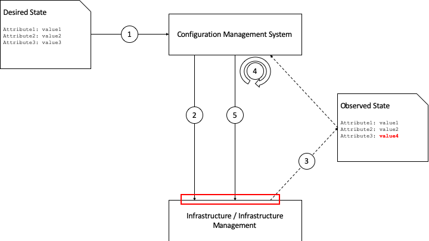
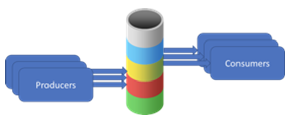
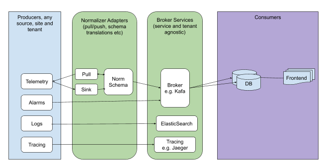

Infrastructure Operations and Lifecycle Management
==================================================

Introduction
------------

The purpose of this chapter is to define the capabilities required of the infrastructure to ensure it is effectively supported, maintained and otherwise lifecycle-managed by Operations teams. This includes requirements relating to the need to be able to maintain infrastructure services "in-service" without impacting the applications and workloads, whilst minimising human labour. It shall also capture any exceptions and related assumptions.

There are three main business operating frameworks that are commonly known and used across the Telecommunications industry related to the topics in this chapter:

-  FCAPS (ISO model for network management)
-  eTOM (TM Forum Business Process Framework (eTOM))
-  ITIL (ITIL 4.0 attempts to adapt IT Service Management practices to the cloud environment needs)

The chapters below roughly map to these frameworks as follows:

====================================== ================== ========== ==============================
Chapter Name                           FCAPS              eTOM       ITIL
====================================== ================== ========== ==============================
Configuration and Lifecycle Management Configuration      Fulfilment Configuration, Release, Change
Assurance                              Performance, Fault Assurance  Event, Incident
Capacity Management                    Configuration      Fulfilment Capacity Management
====================================== ================== ========== ==============================

**Table 9-1:** Operating Frameworks

   **Note:** The above mapping is provided for the general orientation purpose only. Detailed mapping of the required Cloud Infrastructure Lifecycle Management capabilities to any of these frameworks is beyond the scope of this document.

Configuration and Lifecycle Management
--------------------------------------

Configuration management is concerned with defining the configuration of infrastructure and its components, and tracking (observing) the running configuration of that infrastructure, and any changes that take place. Modern configuration management practices such as desired state configuration management also mean that any changes from the desired state that are observed (aka the delta) are rectified by an orchestration / fulfilment component of the configuration management system. This "closed loop" mitigates against configuration drift in the infrastructure and its components. Our recommendation is to keep these closed loops as small as possible to reduce complexity and risk of error. Figure 9-1 shows the configuration management "loop" and how this relates to lifecycle management.

**Figure 9-1**: Configuration and Lifecycle Management

The initial desired state might be for 10 hosts with a particular set of configuration attributes, including the version of the hypervisor and any management agents. The configuration management system will take that as input (1) and configure the infrastructure as required (2). It will then observe the current state periodically over time (3) and in the case of a difference between the desired state and the observed state it will calculate the delta (4) and re-configure the infrastructure (5). For each lifecycle stage (create, update, delete) this loop takes place - for example if an update to the hypervisor version is defined in the desired state, the configuration management system will calculate the delta (e.g. v1 --> v2) and re-configure the infrastructure as required.

However, the key requirements for the infrastructure and infrastructure management are those interfaces and reference points in the red box - where configuration is **set**, and where it is **observed**. Table 9-2 lists the main components and capabilities required in order to manage the configuration and lifecycle of those components.

+---------------------------------+---------------+---------------------------------+-----------------------------+
| Component                       | set / observe | Capability                      | Example                     |
+=================================+===============+=================================+=============================+
| Cloud Infrastructure Management | Set           | Target software / firmware      | Software: v1.2.1            |
| Software                        |               | version                         |                             |
|                                 |               +---------------------------------+-----------------------------+
|                                 |               | Desired configuration attribute | dhcp_lease_time: 86400      |
|                                 |               +---------------------------------+-----------------------------+
|                                 |               | Desired component quantities    | # hypervisor hosts: 10      |
|                                 +---------------+---------------------------------+-----------------------------+
|                                 | Observe       | Observed software / firmware    | Software: v1.2.1            |
|                                 |               | version                         |                             |
|                                 |               +---------------------------------+-----------------------------+
|                                 |               | Observed configuration attribute| dhcp_lease_time: 86400      |
|                                 |               +---------------------------------+-----------------------------+
|                                 |               | Observed component quantities   | # hypervisor hosts: 10      |
+---------------------------------+---------------+---------------------------------+-----------------------------+
| Cloud Infrastructure Software   | Set           | Target software version         | Hypervisor software: v3.4.1 |
|                                 |               +---------------------------------+-----------------------------+
|                                 |               | Desired configuration attribute | management_int: eth0        |
|                                 |               +---------------------------------+-----------------------------+
|                                 |               | Desired component quantities    | # NICs for data: 6          |
|                                 +---------------+---------------------------------+-----------------------------+
|                                 | Observe       | Observed software / firmware    | Hypervisor software: v3.4.1 |
|                                 |               | version                         |                             |
|                                 |               +---------------------------------+-----------------------------+
|                                 |               | Observed configuration attribute| management_int: eth0        |
|                                 |               +---------------------------------+-----------------------------+
|                                 |               | Observed component quantities   | # NICs for data: 6          |
+---------------------------------+---------------+---------------------------------+-----------------------------+
| Infrastructure Hardware         | Set           | Target software / firmware      | Storage controller firmware:|
|                                 |               | version                         | v10.3.4                     |
|                                 |               +---------------------------------+-----------------------------+
|                                 |               | Desired configuration attribute | Virtual disk 1: RAID1       |
|                                 |               |                                 | [HDD1,HDD2]                 |
|                                 +---------------+---------------------------------+-----------------------------+
|                                 | Observe       | Observed software / firmware    | Storage controller firmware:|
|                                 |               | version                         | v10.3.4                     |
|                                 |               +---------------------------------+-----------------------------+
|                                 |               | Observed configuration attribute| Virtual disk 1: RAID1       |
|                                 |               |                                 | [HDD1,HDD2]                 |
+---------------------------------+---------------+---------------------------------+-----------------------------+

**Table 9-2:** Configuration and Lifecycle Management Capabilities

This leads to the following table (Table 9-3) which defines the standard interfaces that should be made available by the infrastructure and Cloud Infrastructure Management components to allow for successful Configuration Management.

========================= ============================ ===============================
Component                 Interface Standard           Link
========================= ============================ ===============================
Infrastructure Management Defined in RA specifications RA-1, RA-2
Infrastructure Software   Defined in RA specifications RA-1, RA-2
Infrastructure Hardware   Redfish API                  DMTF RedFish specification [11]
========================= ============================ ===============================

**Table 9-3:** Interface Standards for Configuration Management

Assurance
---------

Assurance is concerned with:

-  The proactive and reactive maintenance activities that are required to ensure infrastructure services are available as per defined performance and availability levels.
-  Continuous monitoring of the status and performance of individual components and of the service as a whole.
-  Collection and analysis of performance data, which is used to identify potential issues including the ability to resolve the issue with no customer impact.

There are the following requirement types:

1. Data collection from all components, e.g.

   -  The ability to collect data relating to events (transactions, security events, physical interface up/down events, warning events, error events, etc.)
   -  The ability to collect data relating to component status (up/down, physical temperature, disk speed, etc.)
   -  The ability to collect data relating to component performance (used CPU resources, storage throughput, network bandwidth in/out, API transactions, transaction response times, etc.)

2. Capabilities of the Infrastructure Management Software to allow for in-service maintenance of the Infrastructure Software and Hardware under its management, e.g.

   -  The ability to mark a physical compute node as being in some sort of "maintenance mode" and for the Infrastructure Management Software to ensure all running workloads are moved off or rescheduled on to other available nodes (after checking that there is sufficient capacity) before marking the node as being ready for whatever maintenance activity needs to be performed
   -  The ability to co-ordinate, automate, and allow the declarative input of in-service software component upgrades - such as internal orchestration and scheduler components in the Infrastructure Management Software

Note that the above only refers to components - it is expected that any "service" level assurance doesn't add any further requirements onto the infrastructure, but rather takes the data extracted and builds service models based on the knowledge it has of the services being offered.

Capacity Management
-------------------

Capacity Management is a potentially wide ranging process that includes taking demand across lines of business, analysing data about the infrastructure that is running, and calculating when additional infrastructure might be required, or when infrastructure might need to be decommissioned.

As such the requirements for Capacity Management on the infrastructure are covered by the Assurance and Configuration and Lifecycle Management sections above. The Assurance section deals with the collection of data - there is no reason to consider that this would be done by a different mechanism for Capacity Management as it is for Assurance - and the Configuration and Lifecycle Management section deals with the changes being made to the infrastructure hardware, software, and management components (e.g. changing of number of hypervisor hosts from 10 to 12).

Automation
----------

Infrastructure LCM Automation
~~~~~~~~~~~~~~~~~~~~~~~~~~~~~

In a typical telecom operator environment, infrastructure Life Cycle Management is highly complex and error-prone. The environment, with its multiple vendors and products, is maintenance expensive (both time and costs) because of the need for complex planning, testing, and the out-of-business-hours execution required to perform disruptive maintenance (e.g., upgrades) and to mitigate outages to mission-critical applications. Processes and tooling for infrastructure management across hybrid environments create additional complexity due to the different levels of access to infrastructure: hands-on access to the on-premise infrastructure but only restricted access to consumable services offered by public clouds.

Life cycle operations, such as software or hardware upgrades (including complex and risky firmware updates), typically involve time-consuming manual research and substantive testing to ensure that an upgrade is available, required, or needed, and does not conflict with the current versions of other components.  In a complex and at-scale Hybrid Multi-Cloud environment, consisting of multiple on-premise and public clouds, such a manual process is ineffective and, in many cases, impossible to execute in a controlled manner.  Hence, the need for automation.

The goals of LCM are to provide a reliable administration of a system from its provisioning, through its operational stage, to its final retirement. Key functions of Infrastructure LCM:
 -  Hybrid, Multi-Cloud support, that is, LCM works across physical, virtual, and cloud environments, supporting on-premise, cloud, and distributed environments (like Edge)
 -  Complete system life cycle control (Build, Monitor, Maintain, Retire)
 -  Enablement for automation of most system maintenance tasks

Essential foundation blocks for Infrastructure LCM automation:
 -  Inventory
 -  Available Software Upgrades and Dependencies
 -  Orchestration Engine
 -  Representation Model 

Automated LCM uses Inventory to:
  -  store configuration data, alert data, and performance data dynamically discovered from the infrastructure (environmental data)
  -  discover current versions of software modules at each endpoint (discovery)
  -  track and account for all systems, assets, subscriptions (monitoring)
  -  provide inventory of all asset, logical and physical

Automated LCM uses Available Software Upgrades and Dependencies component to:
 -  store information about available software upgrades and dependency expectations
 -  determine the recommended version of a software item (such as firmware) and dependencies on other items in the node
 -  determine the recommended versions of foundation software running on the cluster

Automated LCM uses Orchestration Engine to:
 -  take the inputs from inventory, available versions, and dependencies
 -  run the non-disruptive upgrades
 -  dynamically remediate dependencies during the upgrade process to optimise outcome
 -  ensure that the system is consistent across its life cycle

Automated LCM uses Representation Model to:
 - abstract various automation technologies
 - promote evolution from automation understood as automation of human tasks to autonomous systems using intent-based, declarative automation, supported by evolving AI/ML technologies 

Hardware Configuration CI/CD
^^^^^^^^^^^^^^^^^^^^^^^^^^^^

To be covered in the next release.

Networking Automation
^^^^^^^^^^^^^^^^^^^^^

To be covered in the next release.

Software Development CI/CD
^^^^^^^^^^^^^^^^^^^^^^^^^^

To be covered in the next release.

Software Onboarding Automation and CI/CD Requirements
~~~~~~~~~~~~~~~~~~~~~~~~~~~~~~~~~~~~~~~~~~~~~~~~~~~~~

Software Onboarding Automation
^^^^^^^^^^^^^^^^^^^^^^^^^^^^^^

For software deployment, as far as Cloud Infrastructure services or workloads are concerned, automation is the core of DevOps concept. Automation allows to eliminate manual processes, reducing human errors and speeding software deployments. The prerequisite is to install CI/CD tools chain to:

-  Build, package, test application/software
-  Store environment's parameters and configurations
-  Automate the delivery and deployment

The CI/CD pipeline is used to deploy, test and update the Cloud Infrastructure services, and also to onboard workloads hosted on the infrastructure. Typically, this business process consists of the following key phases:

1. Tenant Engagement and Software Evaluation:

   -  In this phase the request from the tenant to host a workload on the Cloud Infrastructure platform is assessed and a decision made on whether to proceed with the hosting request.
   -  If the Cloud infrastructure software needs to be updated or installed, an evaluation is made of the impacts (including to tenants) and if it is OK to proceed
   -  This phase may also involve the tenant accessing a pre-staging environment to perform their own evaluation and/or pre-staging activities in preparation for later onboarding phases.

2. Software Packaging:

   -  The main outcome of this phase is to produce the software deployable image and the deployment manifests (such as TOSCA blueprints or HEAT templates or Helm charts) that will define the Cloud Infrastructure service attributes.
   -  The software packaging can be automated or performed by designated personnel, through self-service capabilities (for tenants) or by the Cloud Infrastructure Operations team.

3. Software Validation and Certification:

   -  In this phase the software is deployed and tested to validate it against the service design and other Operator specific acceptance criteria, as required.
   -  Software validation and certification should be automated using CI/CD toolsets / pipelines and Test as a Service (TaaS) capabilities.

4. Publish Software:

   -  Tenant Workloads: After the software is certified the final onboarding process phase is for it to be published to the Cloud Infrastructure production catalogue from where it can be instantiated on the Cloud Infrastructure platform by the tenant.
   -  Cloud Infrastructure software: After the software is certified, it is scheduled for deployment in concurrence with the user community.

All phases described above can be automated using technology specific toolsets and procedures. Hence, details of such automation are left for the technology specific Reference Architecture and Reference Implementation specifications.

Software CI/CD Requirements
^^^^^^^^^^^^^^^^^^^^^^^^^^^

The requirements including for CI/CD for ensuring software security scans, image integrity checks, OS version checks, etc. prior to deployment, are listed in the Table 9-4 (below). Please note that the tenant processes for application LCM (such as updates) are out of scope. For the purpose of these requirements, CI includes Continuous Delivery, and CD refers to Continuous Deployment.

============= ============================================================================================================================= ==========================================================================================================================================================================================================================================================================================================================================================================================================
Ref #         Description                                                                                                                   Comments/Notes
============= ============================================================================================================================= ==========================================================================================================================================================================================================================================================================================================================================================================================================
auto.cicd.001 The CI/CD pipeline must support deployment on any cloud and cloud infrastructures including different hardware accelerators.  CI/CD pipelines automate CI/CD best practices into repeatable workflows for integrating code and configurations into builds, testing builds including validation against design and operator specific criteria, and delivery of the product onto a runtime environment. Example of an open-source cloud native CI/CD framework is the Tekton project (`https://tekton.dev/ <https://tekton.dev/>`__)
auto.cicd.002 The CI/CD pipelines must use event-driven task automation                                                                    
auto.cicd.003 The CI/CD pipelines should avoid scheduling tasks                                                                            
auto.cicd.004 The CI/CD pipeline is triggered by a new or updated software release being loaded into a repository                           The software release cane be source code files, configuration files, images, manifests. Operators may support a single or multiple repositories and may, thus, specify which repository is to be used for these release. An example, of an open source repository is the CNCF Harbor (`https://goharbor.io/ <https://goharbor.io/>`__)
auto.cicd.005 The CI pipeline must scan source code and manifests to validate for compliance with design and coding best practices.        
auto.cicd.006 The CI pipeline must support build and packaging of images and deployment manifests from source code and configuration files.
auto.cicd.007 The CI pipeline must scan images and manifests to validate for compliance with security requirements.                         See section 7.9 (`https://github.com/cntt-n/CNTT/blob/master/doc/ref_model/chapters/chapter07.md#consolidated-security-requirements <https://github.com/cntt-n/CNTT/blob/master/doc/ref_model/chapters/chapter07.md#consolidated-security-requirements>`__). Examples of such security requirements include only ingesting images, source code, configuration files, etc. only form trusted sources.
auto.cicd.008 The CI pipeline must validate images and manifests                                                                            Example, different tests
auto.cicd.009 The CI pipeline must validate with all hardware offload permutations and without hardware offload                            
auto.cicd.010 The CI pipeline must promote validated images and manifests to be deployable.                                                 Example, promote from a development repository to a production repository
auto.cicd.011 The CD pipeline must verify and validate the tenant request                                                                   Example, RBAC, request is within quota limits, affinity/anti-affinity, …
auto.cicd.012 The CD pipeline after all validations must turn over control to orchestration of the software                                
auto.cicd.013 The CD pipeline must be able to deploy into Development, Test and Production environments                                    
auto.cicd.014 The CD pipeline must be able to automatically promote software from Development to Test and Production environments          
auto.cicd.015 The CI pipeline must run all relevant Reference Conformance test suites                                                      
auto.cicd.016 The CD pipeline must run all relevant Reference Conformance test suites                                                      
============= ============================================================================================================================= ==========================================================================================================================================================================================================================================================================================================================================================================================================

**Table 9-4:** Automation CI/CD

CI/CD Design Requirements
^^^^^^^^^^^^^^^^^^^^^^^^^

A couple of CI/CD pipeline properties and rules must be agreed between the
different actors to allow smoothly deploy and test the cloud infrastructures
and the hosted network functions whatever if the jobs operate open-source or
proprietary software. They all prevent that specific deployment or testing
operations force a particular CI/CD design or even worse ask to deploy a full
dedicated CI/CD toolchain for a particular network service.

At first glance, the deployment and test job must not basically ask for a
specific CI/CD tools such as `Jenkins <https://www.jenkins.io/>`__ or
`Gitlab CI/CD <https://docs.gitlab.com/ee/ci/>`__. But they are many other
ways where deployment and test jobs can constraint the end users from the
build servers to the artefact management. Any manual operation is discouraged
whatever it's about the deployment or the test resources.

The following requirements also aims at deploying smoothly and easily all CI/CD
toolchains via simple playbooks as targeted by the Reference Conformance
suites currently leveraging `XtestingCI <https://galaxy.ansible.com/collivier/xtesting>`__.

=============== ============================================================================================= ================================================================================================================
Ref #           Description                                                                                   Comments
=============== ============================================================================================= ================================================================================================================
design.cicd.001 The pipeline must allow chaining of independent CI/CD jobs                                    For example, all deployment and test operations from baremetal to Kubernetes, OpenStack, to the network services
design.cicd.002 The pipeline jobs should be modular                                                           This allows execution of jobs independently of others, for example, start with an existing OpenStack deployment
design.cicd.003 The pipeline must decouple the deployment and the test steps                                 
design.cicd.004 The pipeline should leverage the job artefacts specified by the operator provided CI/CD tools
design.cicd.005 The pipeline must execute all relevant Reference Conformance suites without modification     
design.cicd.006 Software vendors/providers must utilise operator provided CI/CD tools                        
design.cicd.007 All jobs must be packaged as containers                                                      
design.cicd.008 All jobs must leverage a common execution to allow templating all deployment and test steps  
design.cicd.009 The deployment jobs must publish all outputs as artefacts in a specified format               For example, OpenStack RC, kubeconfig, yaml, etc. Anuket shall specify formats in RC
design.cicd.010 The test jobs must pull all inputs as artefacts in a specified format                         For example, OpenStack RC, kubeconfig, yaml, etc. Anuket shall specify formats in RC
design.cicd.011 The test jobs must conform with the Reference Conformance test case integration requirements 
=============== ============================================================================================= ================================================================================================================

**Table 9-5:** CI/CD Design

Tenant Creation Automation
~~~~~~~~~~~~~~~~~~~~~~~~~~

Pre-tenant Creation Requirements
^^^^^^^^^^^^^^^^^^^^^^^^^^^^^^^^

Topics include:

1. Tenant Approval -- use, capacity, data centres, etc.

   -  Validate that the `Tenant's <../../../common/glossary.md#operational-and-administrative-terminology>`__ planned use meets the Operators Cloud Use policies
   -  Validate that the capacity available within the requests cloud site(s) can satisfy the Tenant requested quota for vCPU, RAM, Disk, Network Bandwidth
   -  Validate that the Cloud Infrastructure can meet Tenant's performance requirements (e.g. I/O, latency, jitter, etc.)
   -  Validate that the Cloud Infrastructure can meet Tenant's resilience requirements

2. For environments that support `Compute Flavours <./chapter04.md#4.2.1>`__:

   -  Verify that any requested private flavours have been created
   -  Verify that the metadata for these private flavours have been created
   -  Verify that the tenant has permissions to use the requested private flavours
   -  Validate that host aggregates are available for specified flavours (public and private)
   -  Verify that the metadata matches for the requested new flavours and host aggregates

3. Tenant Networks

   -  Verify that the networks requested by the tenant exist
   -  Verify that the security policies are correctly configured to only approved ingress and egress

4. Tenant Admin, Tenant Member and other Tenant Role approvals for user by role

   -  Add all Tenant Members and configure their assigned roles in the Enterprise Identity and Access management system (e.g., LDAP)
   -  Verify that these roles have been created for the Tenant

5. Tenant Images and manifests approvals

   -  Verify and Validate Tenant Images and manifests: virus scan, correct OS version and patch, etc. (Please note that Tenants may also add other images or replace existing images after their environments are created and will also be subjected to image security measures.)

6. Create, Verify and Validate Tenant

   -  Create Tenant
   -  Using a proto- or Tenant provided HEAT-template/Helm-chart for a NF and perform sanity test (e.g., using scripts test creation of VM/container, ping test, etc.)

Telemetry and Observability
---------------------------

Operating complex distributed systems, such as a Telco network, is a demanding and challenging task that is continuously being increased as the network complexity and the production excellence requirements grow. There are multiple reasons why it is so, but they originate in the nature of the system concept. To reach the ability of providing Telco services, a complex system is decomposed into multiple different functional blocks, called network functions. Internal communication between the diverse network functions of a distributed system is based on message exchange. To formalize this communication, clearly defined interfaces are introduced, and protocols designed. Even though the architecture of a Telco network is systematically formalized on the worldwide level, heterogeneity of services, functions, interfaces, and protocols cannot be avoided. By adding the multi-vendor approach in implementation of Telco networks, the outcome is indeed a system with remarkably high level of complexity which requires significant efforts for managing and operating it.

To ensure proper support and flawless work in the large ecosystem of end user services, a formalized approach directed towards high reliability and scalability of systems is required. The discipline which applies well known practices of software engineering to operations is called Site Reliability Engineering. It was conceived at Google, as a means to overcome limitations of the common DevOps approach.

Common supporting system (OSS – Operation Support System, BSS – Business Support System) requirements are redefined, driven by introduction of new technologies in computing infrastructure and modern data centres with abstraction of resources – known as virtualization and cloud computing. This brings many advantages – such as easy scaling, error recovery, reaching a high level of operational autonomy etc., but also many new challenges in the Telecom network management space. Those novel challenges are mostly directed towards the dynamical nature of the system, orientation towards microservices instead of a silo approach, and huge amounts of data which have to be processed in order to understand the internal status of the system. Hence the need of improved ways to monitor systems - observability.

Why Observability
~~~~~~~~~~~~~~~~~

Knowing the status of all services and functions at all levels in a cloud based service offering is essential to act fast, ideally pro-actively before users notice and, most importantly, before they call the help desk.

Common approach to understand the aforementioned Telco network status in conventional non-cloud environments is referred to as monitoring. Usually it would include metric information related to resources, such as CPU, memory, HDD, Network I/O, but also business related technical key performance indicators (KPIs) such as number of active users, number of registrations, etc. This monitoring data are represented as a time series, retrieved in regular intervals, usually with granulation of 5 to 30 minutes. In addition, asynchronous messages such as alarms and notifications are exposed by the monitored systems in order to provide information about foreseen situations. It is worth noting that metric data provide approximation of the health of the system, while the alarms and notifications try to bring more information about the problem. In general, they provide information about known unknowns - anticipated situations occurring at random time. However, this would very rarely be sufficient information for understanding the problem (RCA - root cause analysis), therefore it is necessary to retrieve more data related to the problem - logs and network signalization. Logs are application output information to get more granular information about the code execution. Network packet captures/traces are useful since telecommunication networks are distributed systems where components communicate utilizing various protocols, and the communication can be examined to get details of the problem.

As the transition towards cloud environments takes place simultaneously with the introduction of DevOps mindset, the conventional monitoring approach becomes suboptimal. Cloud environments allow greater flexibility as the microservice architecture is embraced to bring improvements in operability, therefore the automation can be utilized to a higher extent than ever before. Automation in telecom networks usually supposes actions based on decisions derived from system output data (system observation). In order to derive useful decisions, data with rich context are necessary. Obviously, the conventional monitoring approach has to be improved in order to retrieve sufficient data, not only from the wider context, but also without delays - as soon as data are produced or available. The new, enhanced approach was introduced as a concept of observability, borrowed from the control theory which states that it is possible to make conclusions about a system's internal state based on external outputs.

This requires the collection of alarms and telemetry data from the physical layer (wires), the cloud infrastructure up to the network, applications and services (virtualized network functions (VNF)) running on top of the cloud infrastructure, typically isolated by tenants.

Long term trending data are essential for capacity planning purposes and typically collected, aggregated and kept over the full lifespan. To keep the amount of data collected manageable, automatic data reduction algorithms are typically used, e.g. by merging data points from the smallest intervals to more granular intervals.

The telco cloud infrastructure typically consists of one or more regional data centres, central offices, and edge sites. These are managed from redundant central management sites, each hosted in their own data centres.

The network services and applications deployed on a Telco Cloud, and the Telco Cloud infrastructure are usually managed by separate teams, and, thus, the monitoring solution must be capable of keeping the access to the monitoring data isolated between tenants and Cloud Infrastructure operations. Some monitoring data from the Cloud Infrastructure layer must selectively be available to tenant monitoring applications in order to correlate, say, the Network Functions/Services data with the underlying cloud infrastructure data.

What to observe
^^^^^^^^^^^^^^^

Typically, when it comes to data collection, three questions arise:

1. What data to collect?
2. Where to send the data?
3. Which protocol/interface/format to use?

What data to collect
^^^^^^^^^^^^^^^^^^^^

Assessment on what data to collect should start by iterating over the physical and virtual infrastructure components:

-  Network Services across sites and tenants
-  Virtualized functions per site and tenant
-  Individual Virtual Machines and Containers
-  Virtualization infrastructure components
-  Physical servers (compute) and network elements
-  Tool servers with their applications (DNS, Identity Management, Zero Touch Provisioning, etc.)
-  Cabling

Data categories
^^^^^^^^^^^^^^^

There are four main observability categories: metrics, events, logs and traces:

1. **Metrics** or telemetry report counters and gauge levels and can either be pulled periodically e.g. via SNMP or REST, or pushed as streams using gRPC, NETCONF, which receivers registered for certain sensors, or by registering as a publisher to a message broker. These messages must be structured in order to get parsed successfully.
2. **Events** indicate state variance beyond some specified threshold, are categorized by severity, often with a description of what just
   happened. Most common transport protocol is SNMP with its trap and inform messages). These messages are generated by network elements (physical and logical). In addition, the messages can also be generated by monitoring applications with statically configured thresholds or dynamically by Machine Learning (ML) algorithms - generally, they are describing anomalies.
3. **Logs** are a record messages generated by software for most devices (compute and network) and virtual
   applications and transported over SYSLOG and tend to come in high volumes.
4. **Traces** are end-to-end signalling messages (events) created to fulfil execution of requests on
   the distributed system services. OTHER WORDS: Traces are all action points executed in
   order to provide response to the request set to the distributed system service. Even the call
   can be thought of as a request which starts by INVITE message of the SIP protocol.

Where to send the data
^^^^^^^^^^^^^^^^^^^^^^

If the observability data have to be sent from their sources (or producers) to specific destinations (or consumers), then this creates high degree of dependency between producers and consumers, and is extremely prone to errors, especially in case of configuration changes. Ideally, the data producers must not be impacted with any change in the data consumers and vice versa.
This is achieved by decoupling data producers from data consumers through the use of Brokers. The Producers always send their data to the same endpoint - the Broker. While the Consumers register with the Broker for data that is of interest to them and always receive their data from the Broker.

Which protocol, interface, and format to use
^^^^^^^^^^^^^^^^^^^^^^^^^^^^^^^^^^^^^^^^^^^^

While protocols and interfaces are dictated by the selection of the message broker (common data bus) system, data format is usually customizable according to the needs of users. The concept of Schema Registry mechanism, well known in the world of big data, is helpful here to make sure that message structures and formats are consistently used.

The Architecture
~~~~~~~~~~~~~~~~

In geographically dispersed large cloud deployments, a given telco cloud may have several cloud infrastructure components as well a large set of virtualized workloads (VNF/CNFs). It is important to monitor all of these workloads and infrastructure components. Furthermore, it is even more important to be able to correlate between the metrics provided by these entities to determine the performance and/or issues in such deployments.

The cloud deployment tends to shrink and expand based upon the customer demand. Therefore, an architecture is required that can scale on demand and does not force a strong tie between various entities. This means, the workloads and cloud infrastructure components that provide telemetry and performance metrics must not be burdened to discover each other. The capacity (e.g. speed, storage) of one component must not force overrun or underrun situations that would cause critical data to be lost or delayed to a point to render them useless.

Operators in charge of the cloud infrastructure (physical infra plus virtualization platform) require very detailed alarms and metrics to efficiently run their platform. While they need indicators about how well or poorly individual virtual machines and containers run, they don’t need a view inside these workloads. In fact, what and how workloads do should not be accessible to NFVI operators. The architecture must allow for different consumers to grant or deny access to available resources.

Multiple workloads or network services can be deployed onto one or more sites. These workloads require logical separation so that their metrics don’t mix by accident or simply based on security and privacy requirements. This is achieved by deploying these workloads within their own tenant space. All virtualization platforms offer such isolation down to virtual networks per tenant.

.. _push-vs-pull:

Push vs. Pull
^^^^^^^^^^^^^

Two widely deployed models for providing telemetry data are pull and push.

Pull Model
''''''''''

Typical characteristics of a pull model are:

-  The consumers are required to discover the producers of the data
-  Once the producers are identified, there should be a tight relationship (synchronization) between the producer and consumer. This makes the systems very complex in terms of configuration and management. For example, if a producer moves to a different location or reboots/restarts, the consumer must re-discover the producer and bind their relationship again.
-  Data are pulled explicitly by the consumer. The consumer must have appropriate bandwidth, compute power, and storage to deal with this data - example SNMP pull/walks
-  A problem with Pull is that both consumers and producers have to have means for load/performance regulation in cases where the set of consumers overload the pull request serving capabilities of the producer.

Push Model
''''''''''

Typical characteristics of a push model are:

-  Declarative definition of destination - The producers of data know explicitly where to stream/push their data
-  A “well known” data broker is utilized - all consumers and producers know about it through declarative definition. The data broker can be a bus such as RabitMQ, Apache Kafka, Apache Pulsar
-  No restrictions on the bandwidth or data storage constraints on producers or consumers. Producers produce the data and stream/push it to the broker and consumers pull the data from the broker. No explicit sync is required between producers and consumers.
-  LCM (Life Cycle Management) events, such as moves, reboot/restarts, of consumers or producers have no impact on others.
-  Producers and consumers can be added/removed at will. No impact on the system. This makes this model very flexible and scalable and better suited for large (or small) geographically dispersed telco clouds.
-  Example of push model are gRPC, SNMP traps, syslogs

Producers, Consumers, and Message broker
^^^^^^^^^^^^^^^^^^^^^^^^^^^^^^^^^^^^^^^^

In an ideal case, observability data will be sent directly to the message broker in agreed format, so that consumers can take and „understand“ the data without additional logic. Message brokers do not limit on the data types:

Enforcing correct message structures (carrying the data) is performed using Schema Registry concepts. Even though it is not necessary to use a Schema Registry, it is highly recommended.

**Figure 9-2**: Producers and Consumers

**Figure 9-3**: Broker Services

