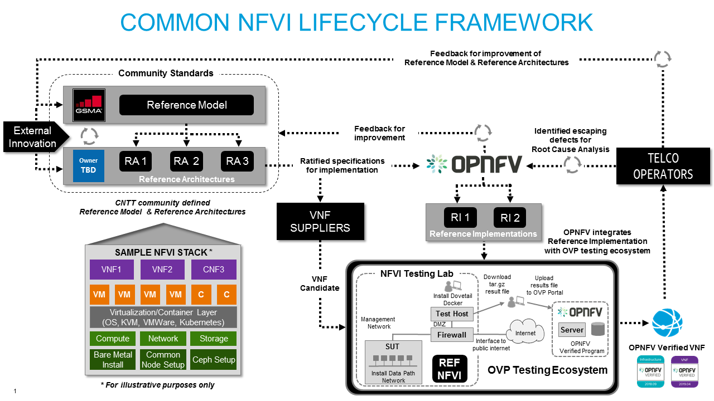

[<< Back](../../ref_model)
# 10 Challenges and Gaps

## Table of Contents
* [10.1 Introduction.](#10.1)
* [10.2 Challenges.](#10.2)
* [10.3 Gaps.](#10.3)

## 10.1 Introduction [Draft Language]

The development of this Reference Model is in its initialization stage and it will go through several iteration cycles before it is adding the full value intended. The reference model is also the first component in the establishment of a Common NFVI Lifecycle Framework--see also diagram below:

Key Components of The Common NFVI Lifecycle Framework

- Reference Model
- Reference Architecture
- Reference Implementation
- Verification & Validation
- Lifecycle Feedback Loops

As the first component, the reference model must also be structured and iterated so that it plays its part as the foundation on which the other five components of the ecosystem are built.

Going forward, this chapter shall be dedicated to identifying the challenges and gaps found in the course the development--to ensure the reference model is adding the strategic and tactical value intended over time. Should a challenge or gap not be identified and it is not already addressed in the model itself, the community may assume it will remain an unknown and, therefore, the community is welcomed to engage with and raise an issue with the appropriate working group(s) to close the gap. In this manner, the Reference Model can continuously improve.

For Reference - Common NFVI Lifecycle Framework Diagram (Figure 10-1)

## 10.2 Challenges [Initial Language]

Challenge 1
The initial challenge was launching the Reference Model as an MVP and then gathering and incorporating necessary feedback from the community on the initial assumptions, and then iterating foundational constructs of the model with that feedback. This release includes the results of a significant effort to incorporate the feedback. Of course, alignment efforts will always continue.

Challenge 2
The next challenge ahead is getting to a stable working version from which all stakeholders in the VNF value-chain can begin to extract the intended value of a Common NFVI. The next maturity level is reached when the Reference Model has stabilized enough for stakeholders to begin to intake the model into their own VNF development and deployment cycles.

[Diagram-TBD]

## 10.3 Gaps [Initial Language]

Gaps

This section includes a backlog table of all existing open issues in the development of the Reference Model, Reference Architecture, Reference Implementation of the Common NFV Lifecycle Framework. Each issue is captured in the CNTT document repository and is viewable there as a reference and a work in progress item.

Backlogs [https://github.com/cntt-n/CNTT/issues]
- Reference Model 
- Reference Architecture 
- Reference Implementation 

