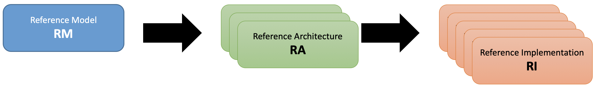

[<< Back](https://cntt-n.github.io/CNTT/)
# Common NFVI Telco Taskforce

## Table of Contents
* [1. Overview](#1.0)
* [2. Scope](#2.0)
* [3. Principles](#3.0)
* [4. Technology Direction](#4.0)
  * [4.1 IO Virtualisation](#4.1)
  * [4.2 SmartNICs](#4.2)
  * [4.3 Acceleration Cards](#4.3)
  * [4.4 FPGA](#4.4)
  * [4.5 GPUs/NPUs](#4.5)
  * [4.6 EPA/NFD](#4.6)
* [5. Available Specifications](#5.0)

## 1. Overview

Initially organized early in 2019, the Common Network Function Virtualisation Infrastructure Telecom Taskforce (CNTT) was initially created in response to rapid changes in how networking applications are being designed, built and managed, plus a growing recognition of a perceived functional gap between the previous standard infrastructure models and the architectures needed to support Network Function Virtualization (NFV) applications.  Organizationally the Common Telco Network Function Virtualisation Infrastructure (NFVI)  project, jointly hosted by GSMA and the Linux Foundation, operates as an open committee responsible for creating and documenting an industry aligned Common NFVI Framework.  The CNTT group was created with the intent that it would create the NFVI framework, and eventually morph into an on-going project under the auspices of the GSMA and the Linux Foundation umbrellas.  The final on-going operational form of the group will be determined as the project evolves. 

## 2. Scope

Within the framework of the Common Telecom NFVI vision, there are three levels of documents needed to document the components and allow the practical application of the systems. They are, as highlighted in **Figure 1**:  **Reference Model**, **Reference Architecture**, and **Reference Implementation**.

<b>Figure 1:</b> Scope of CNTT

## 2.1 Specification Types

- **Reference Model**: focuses on the __**NFVI Abstraction**__ and how NFVI services and resources are exposed to VNFs. It written at a high enough level that as new **Reference Architectures** and **Reference Implementations** are added, the model document should require few or no changes. Additionally, the Reference Model is intended to be neutral towards VMs or Containers.
- **Reference Architecture**: High level NFVI system components and their interactions that takes the Reference Model goals and maps them to something that has components in the real world.  It is expected that at least one, but not more than a few, Reference Architecture will conform to the Reference Model.  The intention whenever possible to use existing elements, rather than specify entirely new architectures in support of the high-level goals specified in the **Reference Model**.
- **Reference Implementation**: Builds on the requirements and specifications developed in the other two documents and adds details so that it can be implemented.  Each Reference Architecture is expected to be implemented by at least one Reference Implementation.

Below is a diagram of the different artifacts that will need to be created to support the implementation of the abstract concepts presented in the **Reference Model**, which are then applied to create the **Reference Architecture**, that will be deployed using the requirements spelled out in the **Reference Implementation**.

<b>Figure 2:</b> Description of the possible different levels of CNTT artefacts

## 3. Principles

Any specification work created within CNTT **must** obey to set of principles specified by CNTT:

[Reference Model Principles](../ref_model/chapters/chapter01.md#13-principles)
[Reference Architecture Principles](../ref_arch#principles)

## 4. Technology Direction

### 4.1 IO Virtualization

There are different ways of which IO devices (such as NICs) are presented to workloads for consumption by those workloads. Here is a list of current methods of existing IO Virtualisatin:

- Para-Virtualization method (software only).
- Direct assignment with VT-d.
- Device Sharing with SR-IOV & VT-d.
- Para-Virtualisation method (Hardware support).

**Figure 3** below shows some of the relevant IO Virtualization techniques.

<b>Figure 3:</b> Relevant IO Virtualisation Techniques

#### 4.1.1 Para-virtualization method (software only)

This is the preferred method of IO virtualisation as it provides flexibility and full abstraction of workloads from the underlying infrastructure. It usually relies on standard IO interfaces that are implemented in software.
For Networking, there are two common networking interfaces used: virtio-net for KVM/QEMU and VMXNET for VMware.

Using a standard interface for IO means that workload doesn't need to run any proprietary software drivers for specific hardware vendors and the implementation of that workload is completely agnostics of the hardware used.

**Figure 4** below shows the typical components of a para-virtualised interface: 
- frontEnd driver: The frontEnd driver is an off-the-shelf driver that runs on the workload.
- backEnd driver: runs on the Hypervisor and is responsible of bridging standard communications coming from applications to a hardware specific ones. 

This nature of this disaggregation is what gives the para-virtualised interfaces the flexibility that makes them favourable in a virtualised environment.

The downside of para-virtualisation interfaces is the involvement of the hypervisor which may introduce latency and jitter that can impact the performance.

<b>Figure 4:</b> Para-Virtualised interface components (software only).

#### 4.1.2 Direct assignment with VT-d

Direct assignment (or pass-through) is when an IO device is directly assigned to a workload by-passing the hypervisor. Direct assignment is supported in intel platforms (using VT-d technology) and by AMD platforms (using AMD-V technology) as shown in **Figure 5**.

Once an IO device is directly assigned to a workload, that workload will then have an exclusive access to that device and no other entities (including the hypervisor) can access it.

This method provides better performance than the para-virtualised one as no hypervisor is involved but provides less flexibility and less portability.

Having an IO device directly assigned to a workload means that the workload needs to run vendor specific drivers and libraries to be able to access that device which makes the workload less portable and dependent on a specific hardware type from a specific vendor which is not aligned with the overall strategy and goals of CNTT and hence this method of IO Virtualisation should not be used unless explicitly allowed as an exception as part of the transitional plan adopted by CNTT.

<b>Figure 5:</b> Direct Assignment with VT-d.

#### 4.1.3 Device Sharing with SR-IOV & VT-d

Unlike Direct assignment, this method allows a hardware device to be shared amongst many workloads where each workload has an exclusive access to one region of the device (known as VF). 

For this method to be possible, the IO device need to support Single Root Input Output Virtualisation (SR-IOV) which allows it to present itself as multiple devices (known as Physical Functions, PFs, and Virtual Functions, VFs as presented in **Figure 6**.

Each of those Virtual Functions can then be independently assigned exclusively to a workload (with the appropriate support by VT-d or AMD-V from the infrastructure).

Similar to the previous method, this method provides better performance than the para-virtualised one but still lack the flexibility and the portability sought and therefore should also not be used unless explicitly allowed as an exception as part of the transitional plan adopted by CNTT.

<b>Figure 6:</b> Device Sharing with SR-IOV & VT-D..

#### 4.1.4 Para-Virtualisation method (Hardware support)

This method basically is a mixture between the software only para-virtualisation method and the direct assignment (including the device sharing method) where the fronEnd driver which is running on the workload is a standard off the shelf driver whereas the backEnd driver is implemented straight in hardware (by-passing the hypervisor with support from VT-d/AMD-V and SR-IOV in case of device sharing) as shown in **Figure 7**.

Unlike the software only Para-virtualised interfaces, this method provides better performance as it by-passes the hypervisor and unlike Direct Assignment methods, this method doesn’t require proprietary drivers to run in the workload and hence this method make workloads portable.

However, this method doesn’t provide the same level of flexibility as the software only para-virtualisation method as migrating workloads from one host to another is more challenging due to the hardware presence and the state it holds for the workloads using it and therefore should also not be used unless explicitly allowed as an exception as part of the transitional plan adopted by CNTT.

<b>Figure 7:</b> Para-Virtualisation method (with hardware support).

### 4.2 SmartNICs

### 4.3 Acceleration Cards

### 4.4 FPGAs

### 4.5 GPUs/NPUs

### 4.6 EPA/NFD

## 5. Available Specifications
* [Reference Model](../ref_model)
* [Reference Architecture](../ref_arch)
* [Reference Implementation](../ref_impl)
* [Reference Certification](../ref_cert)
