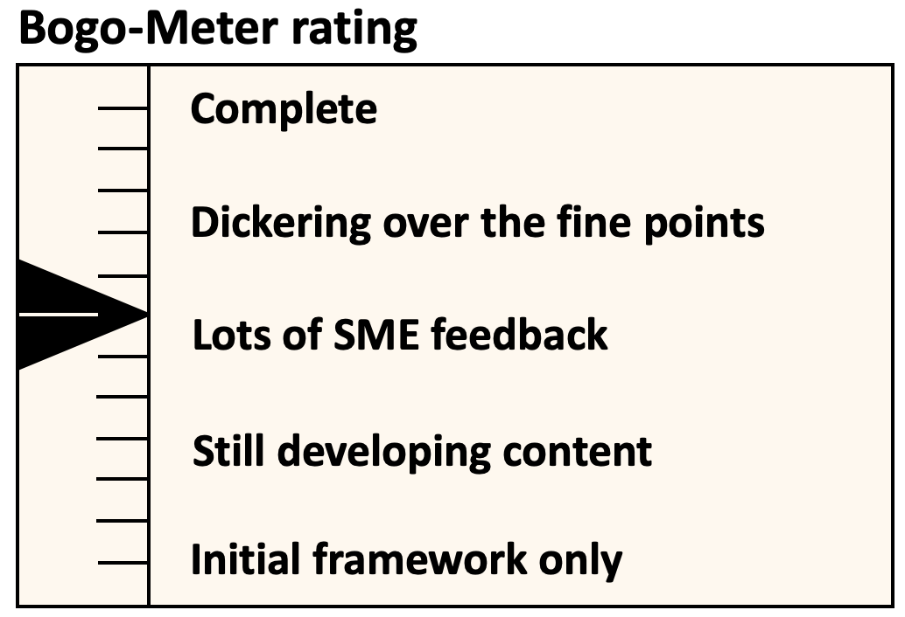

[<< Back](https://cntt-n.github.io/CNTT/)
# Common NFVI Telco Taskforce

## Table of Contents
* [1. Overview](#1.0)
    * [1.1 Glossary](#1.1)
    * [1.2 Problem Statement](#1.2)
    * [1.3 Project Goals and Purpose](#1.3)
    * [1.4 Common Cloud Infrastructure Benefits](#1.4)
* [2. Principles](#3.0)
* [3. Scope](#3.0)
  * [3.1 Specification Types](#3.1)
  * [3.2 Bogo-Meter](#3.2)
* [4. Approach](#4.0)
* [5. Use Cases](#5.0)
* [6. Roadmap and Releases](#6.0)
* [7. CNTT Technical Policies and Transition Plan](#7.0)
* [8. Relevant Technologies](#8.0)

## Available Specifications
* [Reference Model](../ref_model)
* [Reference Architecture](../ref_arch)
* [Reference Implementation](../ref_impl)
* [Reference Conformance](../ref_cert)
* [Vendor Implementations](../ven_impl)

# 1. Overview

Initially organized early in 2019, the Common Network Function Virtualisation Cloud Infrastructure Telecom Taskforce (CNTT) was created in response to rapid changes in how networking applications are being designed, built and managed, plus a growing recognition of a perceived functional gap between the previous standard infrastructure models and the architectures needed to support Network Function Virtualisation (NFV) applications.  Organizationally the Common Telco Network Function Cloud Infrastructure project, jointly hosted by GSMA and the Linux Foundation, operates as an open committee responsible for creating and documenting an industry aligned Common Cloud Infrastructure Framework.  The CNTT was created with the intent that it would create the cloud infrastructure framework, and eventually morph into an on-going project under the auspices of the GSMA and the Linux Foundation umbrellas.  The final on-going operational form of the Taskforce will be determined as the project evolves. 

## 1.1 Glossary
The definition and intent of the terminology used throughout the documents is defined in the [Glossary](./glossary.md).

## 1.2 Problem Statement
Based on informal conversations with many operators and developers, there is a realisation that there are significant technical, operational and business challenges to the development and deployment of VNF applications related to the lack of a common cloud infrastructure platform.  These include but are not limited to the following:

 - Higher development costs due to the need to develop Virtual Network Functions (VNF) on multiple custom platforms for each operator
 - Increased complexities due to the need to maintain multiple versions of applications to support each custom environment
 - Lack of Testing and validation commonalities, leading to inefficiencies and increased time to market. While the operators will still do internal testing, but using an industry driven verification program based on a common cloud infrastructure would provide a head start.
 - Slower adoption of cloud-native NFV applications and architectures.  A Common Telco Cloud may provide an easier path to methodologies that will drive faster cloud-native NFV application development.
 - Increased operational overhead due to the need for operators to integrate diverse and sometime conflicting VNF platform requirements.

One of major challenges holding back the more rapid and widespread adoption of VNF is that the traditional telecom ecosystem vendors, while building or designing their virtualised services (whether it be Voice over LTE (VoLTE), Evolved Packet Core (EPC), or popular customer facing enterprise services such as SD WAN (Software Defined Wide Area Network), are making their own infrastructure assumptions and requirements, often with custom design parameters. This leaves the operators being forced to build complex integrations of various vendor/function specific silos which are incompatible with each other and might possibly have different and conflicting operating models. In addition, this makes the onboarding and conformance processes of VNFs (coming from different vendors) hard to automate and standardise.  

To put this effort in perspective, over the past few years, the telecom industry has been going through a massive technology revolution by embracing software defined networking and cloud architecture principles, in pursuit of the goal of achieving more flexibility, agility and operational efficiency. At a high level, the main objective of NFV (Network Function Virtualisation) is the ability to use general purpose standard COTS (Commercial off the Shelf) compute, memory and storage hardware platforms to run multiple Virtualised Network Functions.  VNFs is the general term that covers any type of virtualised application whether it be in the form of a Virtual Machine (VM) or a containerised application.  Earlier common infrastructure models built on the previous assumption that networking applications are typically built on discrete hardware, do not offer the level of flexibility and agility needed for the support of newer networking technologies such as 5G, intelligent networks and Edge computing.  By running network applications as software rather than on purpose-built hardware, as it has been done since the early 1990’s, the operators aspire to realize operational efficiencies, and capital expense savings.  These Software Defined Network (SDN) applications are increasingly being used by telecom operators to support their internal and customer facing network infrastructures.  The need for a common model across the industry to facilitate more rapid adoption is clear.

## 1.3 Project Goals and Purpose
The goal of the task force is to develop a robust infrastructure model and a limited discrete set of architectures built on that model that can be tested and validated for use across the  entire member community. The community, which is made up of a cross section of global operators and supporting vendors alike, was created to support the development, deployment and management of NFV applications faster and more easily.  

All of this had led to a growing awareness of the need to develop more open models and validation mechanisms to bring the most value to telco operators as well as vendors, by agreeing on a standard set of infrastructure profiles to use for the underlying infrastructure to support VNF applications across the industry and telecom community at large. To achieve this goal, the cloud environment needs to be fully abstracted via APIs and other mechanisms to the VNFs so that both developers of the VNF applications and the operators managing the environments can benefit from the flexibility that the disaggregation of the underlying infrastructure offers.

The next step after the Reference Model has been identified and developed is to take the general model, which is purposely designed to be able to be applied to a number of technologies, and apply it to a discrete number of concrete and ultimately deployable Reference Architecture platforms. The intention is to chose the reference architectures carefully so that there will only be a small set of architectures that meets the specific requirements for supporting NFV and Telecom specific applications. Per the principles laid out in the Reference Model documentation, the Reference Architectures need to meet the following criteria as much as is practical:

  - Initially should be based on widely established technology and systems used in the Telecom Industry.  This will help ensure a faster adoption rate because the operators are already familiar with the technology and might even have systems in production. Another advantage to this approach is a project faster development cycle.
  - Subsequent architectures should be based on either additional established or promising emerging technologies that are chosen by the community members.  

## 1.4 Common Cloud Infrastructure Benefits
By providing a pre-defined environment with common capabilities, applications are able to be developed and deployed more rapidly.  In addition, the common infrastructure can be optimized for various workloads, such as IT (Information Technology), VNF, AI (Artificial Intelligence), and other future workload types as new technologies emerge. The benefits of this approach are:

- Configuration automation over customisation
  - By abstracting the infrastructure capabilities as much as possible, operators are able to use common infrastructure platforms across all VNF vendors.
  - Maintaining a consistent infrastructure allows for higher levels of automation due to a reduced need for customisation of the various components.
  - Overall, the intention is to reduce the total cost of ownership for operators and development costs for vendors

- Onboarding and conformance
  - By defining abstracted infrastructure capabilities, and the metrics by which they are measured, the onboarding and conformance process for both cloud infrastructure and VNFs can be standardized, reducing development time for the VNF developers and deployment and operational management costs for the operators standing up the cloud environments.
  - Supply chain, procurement and assurance teams can then use these metrics to more accurately assess the most efficient / best value vendor for a given environment and network services requirement.

- Better utilisation
  - Properly mapping VNFs to flavours to the underlying infrastructure, brings the potential for more efficient utilisation, than needing to create specific configurations for each type of application in the infrastructure.  

In conclusion, to serve the stated objective building a common cloud infrastructure that is able to take advantage of true cloud models for the more rapid development and deployment of SDN NFV applications, the CNTT is documentation of a reference model, a select set of architectures and a set of validation and testing suites, so that there is a more consistent model infrastructure for developers and vendors of SDN software and applications to build to.

# 2. Principles

Any specification work created within CNTT **must** conform to set of principles specified by CNTT:

* [Reference Model Principles](../ref_model/chapters/chapter01.md#13-principles)
* [Reference Architecture Principles](../ref_arch#principles)

# 3. Scope

Within the framework of the Common Telecom cloud infrastructure vision, there are four levels of documents needed to describe the components, realize the practical application of the systems and qualify the resulting cloud infrastructure. They are, as highlighted in **Figure 1**:  **Reference Model**, **Reference Architecture**, **Reference Implementation**, and **Reference Conformance**.

<b>Figure 1:</b> Scope of CNTT

## 3.1 Specification Types

- **Reference Model (RM)**: focuses on the __**Infrastructure Abstraction**__ and how services and resources are exposed to VNFs/CNFs. It needs to be written at a high enough level that as new **Reference Architectures** and **Reference Implementations** are added, the model document should require few or no changes. Additionally, the Reference Model is intended to be neutral towards VMs or Containers.
- **Reference Architecture (RA)**: Reference Architectures defines all infrastructure components and properties which have effect on the VNF/CNF run time, deployment time, and design time.  It is expected that at least one, but not more than a few Reference Architectures will be created, and they will conform to the Reference Model.  The intention is, whenever possible, to use existing elements, rather than specify entirely new architectures in support of the high-level goals specified in the **Reference Model**.
- **Reference Implementation(RI)**: Builds on the requirements and specifications developed in RM, RAs and adds details so that it can be implemented.  Each Reference Architecture is expected to be implemented by at least one Reference Implementation.
- **Reference Conformance(RC)**: Builds on the requirements and specifications developed in the other documents and adds details on how an implementation will be verified, tested and certified. Both infrastructure verification and conformance as well as VNFs/CNFs verifications and conformance will be covered.

Below is a diagram of the different artifacts that will need to be created to support the implementation of the abstract concepts presented in the **Reference Model**, which are then applied to create the **Reference Architecture**, that will be deployed using the requirements spelled out in the **Reference Implementation**.

<b>Figure 2:</b> Description of the possible different levels of CNTT artefacts

## 3.2 Bogo-Meter
At the beginning of each chapter there is a graphic that indicates the completeness and maturity each chapter's content at a glance.  

The ratings are as follows:
 - **Initial framework only**: Indicates that there is little or no useful content, just the bare outline.
 -	**Still developing content**:  Generally, indicates that while there is some content that might have some use, it is actively being worked on and needs considerable contributions from the community.
 -	**Lots of SME feedback**: Indicates that most of the content has been developed, but that there is still opportunity for contributors to shape the content.
 - **Dickering over the fine points**: The content is mostly completed, but the community needs to refine its shared thinking and build final consensus.
 - **Complete**: Content has been finalized for this release.  Few changes are anticipated in the future beyond fixing errors or slight refinements.

# 4. Approach
Different specification types within CNTT are related to each other and requires alignments between different parts. The Approach CNTT is taking to tackle those issues is described in [here](./approach.md).

# 5. Use Cases
CNTT Addresses wide range of use cases from Core all the way to the Edge of Network. Different Use Cases supported by CNTT Specifications is described in [here](./usecases.md).

<!--

## xxx Use Cases
Since the CNTT membership is primarily from the telecom and telecom supporting vendors communities, most of the use cases represent the interests of that community.  The following high-level use cases are used to inform and guide both the reference model and subsequent architectures and implementations.  Note that many of these use cases were taken from the work done by the [OpenStack Foundation Edge Computing Group](https://wiki.openstack.org/wiki/Edge_Computing_Group).

- **Mobile service provider 5G/4G virtual Radio Access Network (RAN) deployment and Edge Cloud B2B2X**: There are at least three use cases related to this (e.g. vRAN, VNF, Multi-access Edge Computing (MEC). While the use cases are different, the expectation is that they will run on the same infrastructure. So it makes sense to treat them together.
  1. vRAN: Here the focus on virtual Baseband Unit (BBU) which has stringent requirements on processing for timing controls with 'remote radio heads'
  1. NFV: Here the focus is on running the Core applications as virtual machines at the edge. This includes, vEPC elements, vRouters, Virtual Firewall (vFW), Virtual Load Balancer (vLB)
  1. MEC: Here the focus is on running 3rd party or operator applications at the edge. The MEC resource pools could be supporting a variety of other MEC applications (smart city, v2x, consumer AR).
- **Edge cloud service user**: For vRAN and NFV the user is the wireless network operator. For MEC it could be the operator, a 3rd party application provider or the wireless end-user.
- **Edge cloud infrastructure user**: The Edge Cloud infrastructure user would be the network operator.
- **Edge site(s)**: An operator's network could include thousands of sites. Each site could range from a handful of servers to dozens of racks.
- **Connectviity reliability**: Front Haul reliability is driven by Radio requirements and is high. Backhaul reliability is driven by operator service requirements (5 9s)
- **Edge Size**: medium to large
- **Deployment infrastructure considerations / scaling**:

   - Case 2: By splitting CU-DU (from BBU), vCU can run on the same edge computing platform that runs UPF(5G) ( or S/P-GW-U in 4G) and other VNFs including vFW and vLB. End users/devices traffic can be released at the clear demarcation point placing UPF in Edge DC. We can adopt a hybrid model and put VM-based UPF (and other VNFs) to carry the user's traffic to CNFs running in Kubernetes running on the same cloud infrastructure.
   - Case 1: 1- The vBBU deployment is driven by need for : easy life cycle management, vendor independence, automatic scaling (and energy savings). 2- The NFV deployments is driven by need for automatic scaling and vendor independence. 3- The MEC deployment is driven by opportunities for new revenue streams possibly from new sources.
   - Case 2: 1) Edge Cloud B2B2X model In the traditional Telco service provider model, the Telco provided services(the first B of B2B2X) directly to either individual or corporate consumers to increase revenue. In the Edge Cloud B2B2X model, Telco collaborates with diverse partners in other industries(the second B of B2B2X)to deliver added value to consumers/devices(X of B2B2X) through a wide range of the biz service providers. Here, the value that Telco Edge Cloud can provide biz service providers can take various forms, such as IoT & Edge Intelligence, Containerized micro service, AI framework, and other advanced ICT technologies, user interface technologies, and security tools.

More use cases to pull in:  https://docs.openstack.org/arch-design/use-cases.html

>_**Comment**: This section is still under development._

-->  

# 6. Roadmap and Releases

* [CNTT Releases](./release_notes)
* [CNTT Roadmap](./release_notes/release_process.md#roadmap)

# 7. CNTT Technical Policies and Transition Plan

There are multiple situations where a [policy](./policies.md), comprised of one or more compromises and/or transitions is required to address technology that does not presently conform to CNTT mandates or strategy, and hence requires explicit direction to prescribe how the situation will be treated in the present, as well as in the future. This informs application designers how RC will react when encountering such technologies during the qualification process, including flagging warnings and potentially errors which could prevent issuance of a conformance badge. 

# 8. Relevant Technologies

There are different technologies used and specified by CNTT specifications. This [section](./technologies.md) describes the relevant technologies for CNTT and clarifies CNTT position about them.
