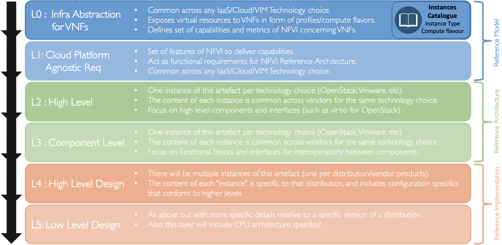

[<< Back](https://cntt-n.github.io/CNTT/)
# Common NFVI Telco Taskforce

## Table of Contents
* [1. Overview](#1.0)
* [2. Scope](#2.0)
* [3. Principles](#3.0)
* [4. Relevant Technologies](#4.0)
  * [4.1 IO Virtualisation](#4.1)
  * [4.2 SmartNICs](#4.2)
  * [4.3 Acceleration Cards](#4.3)
  * [4.4 FPGA](#4.4)
  * [4.5 GPUs/NPUs](#4.5)
  * [4.6 EPA/NFD](#4.6)
* [5. CNTT Policies for Managing Non-Conforming Technologies ](#5.0) 
  * [5.1 Feature Availability](#5.1)
  * [5.2 Hardware-Dependent Coding](#5.2)
  * [5.3 Current CNTT Policies](#5.3)

## Available Specifications
* [Reference Model](../ref_model)
* [Reference Architecture](../ref_arch)
* [Reference Implementation](../ref_impl)
* [Reference Certification](../ref_cert)

## CNTT Releases
* [CNTT Releases](../release_notes)

## 1. Overview

Initially organized early in 2019, the Common Network Function Virtualization Infrastructure Telecom Taskforce (CNTT) was created in response to rapid changes in how networking applications are being designed, built and managed, plus a growing recognition of a perceived functional gap between the previous standard infrastructure models and the architectures needed to support Network Function Virtualization (NFV) applications.  Organizationally the Common Telco Network Function Virtualization Infrastructure (NFVI)  project, jointly hosted by GSMA and the Linux Foundation, operates as an open committee responsible for creating and documenting an industry aligned Common NFVI Framework.  The CNTT was created with the intent that it would create the NFVI framework, and eventually morph into an on-going project under the auspices of the GSMA and the Linux Foundation umbrellas.  The final on-going operational form of the Taskforce will be determined as the project evolves. 

## 2. Scope

Within the framework of the Common Telecom NFVI vision, there are three levels of documents needed to describe components and allow the practical application of the systems. They are, as highlighted in **Figure 1**:  **Reference Model**, **Reference Architecture**, **Reference Implementation**, and **Reference Certification**.

<b>Figure 1:</b> Scope of CNTT

## 2.1 Specification Types

- **Reference Model (RM)**: focuses on the __**Infrastructure Abstraction**__ and how services and resources are exposed to VNFs/CNFs. It needs to be written at a high enough level that as new **Reference Architectures** and **Reference Implementations** are added, the model document should require few or no changes. Additionally, the Reference Model is intended to be neutral towards VMs or Containers.
- **Reference Architecture (RA)**: High level Infrastructure system components and their interactions that takes the Reference Model goals and maps them to something that has components in the real world.  It is expected that at least one, but not more than a few, Reference Architecture will conform to the Reference Model.  The intention is, whenever possible, to use existing elements, rather than specify entirely new architectures in support of the high-level goals specified in the **Reference Model**.
- **Reference Implementation(RI)**: Builds on the requirements and specifications developed in RM, RAs and adds details so that it can be implemented.  Each Reference Architecture is expected to be implemented by at least one Reference Implementation.
- **Reference Certification(RC)**: Builds on the requirements and specifications developed in the other documents and adds details on how an implementation will be verified, tested and certified. Both infrastructure verification and certification as well as VNFs/CNFs verifications and certifications will be covered.

Below is a diagram of the different artifacts that will need to be created to support the implementation of the abstract concepts presented in the **Reference Model**, which are then applied to create the **Reference Architecture**, that will be deployed using the requirements spelled out in the **Reference Implementation**.

<b>Figure 2:</b> Description of the possible different levels of CNTT artefacts

## 3. Principles

Any specification work created within CNTT **must** conform to set of principles specified by CNTT:

* [Reference Model Principles](../ref_model/chapters/chapter01.md#13-principles)
* [Reference Architecture Principles](../ref_arch#principles)

## 4. Relevant Technologies
This section describes the relevant technologies for CNTT and clarifies CNTT position about them. The list below is not exhaustive but it is representative of existing trends. Chapter 5 describe CNTT policies of managing the Non-Conferment ones. 

### 4.1 IO Virtualization

There are different ways of which IO devices (such as NICs) are presented to workloads for consumption by those workloads. Here is a list of current methods of existing IO Virtualization:

- Para-Virtualization method (software only).
- Direct Assignment via h/w assisted PCI-Passthrough (IOMMU).
- Device Sharing with SR-IOV & h/w assisted PCI-Passthrough (IOMMU).
- Para-Virtualization method with Hardware support.

**Figure 3** below shows some of the relevant IO Virtualization techniques.

<b>Figure 3:</b> Relevant IO Virtualization Techniques

#### 4.1.1 Para-virtualization method (software only)

This is the preferred method of IO virtualization as it provides flexibility and full abstraction of workloads from the underlying infrastructure. It usually relies on standard IO interfaces that are implemented in software.
For Networking, there are two common networking interfaces used: virtio-net for KVM/QEMU and VMXNET for VMware.

Using a standard interface for IO means that workload doesn't need to run any proprietary software drivers for specific hardware vendors and the implementation of that workload is completely agnostics of the hardware used.

**Figure 4** below shows the typical components of a para-virtualized interface: 
- frontEnd driver: The frontEnd driver is an off-the-shelf driver that runs on the workload.
- backEnd driver: runs on the Hypervisor and is responsible of bridging standard communications coming from applications to a hardware specific ones. 

This nature of this disaggregation is what gives the para-virtualized interfaces the flexibility that makes them favourable in a virtualized environment.

The downside of para-virtualization interfaces is the involvement of the hypervisor which may introduce latency and jitter that can impact the performance.

<b>Figure 4:</b> Para-Virtualized interface components (software only).

#### 4.1.2 Direct assignment with IOMMU.

Direct Assignment is supported in x86 architectures through an IOMMU (Input/Ouput Memory Management Unit), which provides the ability for a PCIe device to autonomously (i.e. without hypervisor intervention) perform DMA transfers directly into guest memory as shown in **Figure 5**.

Once an IO device is directly assigned to a workload, that workload will then have an exclusive access to that device and no other entities (including the hypervisor) can access it.

This method provides better performance than the para-virtualized one as no hypervisor is involved but provides less flexibility and less portability.

Having an IO device directly assigned to a workload means that the workload needs to run vendor specific drivers and libraries to be able to access that device which makes the workload less portable and dependent on a specific hardware type from a specific vendor which is not aligned with the overall strategy and goals of CNTT and hence this method of IO Virtualization must not be used unless explicitly allowed as an exception as part of the transitional plan adopted by CNTT.

<b>Figure 5:</b> Direct Assignment with Virtual Technology.

#### 4.1.3 Device Sharing with SR-IOV & IOMMU.

This method partitions a hardware device into multiple regions (known as VFs), and uses Direct Assignment to provide workloads exclusive access to one or more of those regions (VFs), thereby bypassing the hypervisor and simultaneously allowing multiple workloads to share the same device.

For this method to be possible, the IO device need to support Single Root Input Output Virtualization (SR-IOV) which allows it to present itself as multiple devices, known as Physical Functions, PFs, and Virtual Functions, VFs as presented in **Figure 6**.

Each of those Virtual Functions can then be independently assigned exclusively to a workload (with the appropriate hardware support of an IOMMU).

Similar to the previous method ("Direct Assignment"), this method provides better performance than para-virtualization, but lacks the flexibility and the portability sought and therefore must also not be used unless explicitly allowed as an exception as part of the transitional plan adopted by CNTT.

<b>Figure 6:</b> Device Sharing with SR-IOV & Direct Assignment.

#### 4.1.4 Para-Virtualization method (Hardware support)

This method basically is a mixture between the software only para-virtualization method and the direct assignment method (including the device sharing method) where the frontEnd driver which is running on the workload is a standard off the shelf driver and the backEnd driver is implemented straight in hardware logic (bypassing the hypervisor with hardware support from an IOMMU and SR-IOV) as shown in **Figure 7**.

Unlike the software only para-virtualized interfaces, this method provides better performance as it by-passes the hypervisor and unlike Direct Assignment methods, this method doesn’t require proprietary drivers to run in the workload and hence this method makes workloads portable.

However, this method doesn’t provide the same level of flexibility as the software only para-virtualization method as migrating workloads from one host to another is more challenging due to the hardware presence and the state it holds for the workloads using it and therefore should also not be used unless explicitly allowed as an exception as part of the transitional plan adopted by CNTT.

<b>Figure 7:</b> Para-Virtualization method (with hardware support).

### 4.2 SmartNICs

### 4.3 Acceleration Cards

### 4.4 FPGAs

### 4.5 GPUs/NPUs

### 4.6 EPA/NFD

## 5 CNTT Policies for Managing Non-Conforming Technologies

There are multiple situations where a policy, comprised of one or more compromises and/or transitions is required to address technology that does not presently conform to CNTT mandates or strategy, and hence requires explicit direction to prescribe how the situation will be treated in the present, as well as in the future. This informs application designers how RC will react when encountering such technologies during the qualification process, including flagging warnings and potentially errors which could prevent issuance of a certification badge. 

### 5.1 Feature Availability
One such case is where CNTT strategically deems a given capability as mandatory, but the feature is a roadmap item, under development or otherwise unavailable. To address this scenario, a policy can be created to recognize the current state of the technology, and identify a Time Point (TP) in VNF Evolution when the feature will become mandatory for RC purposes.

### 5.2 Hardware-Dependent Coding
Another such case is hardware-dependent coding. As described in the Principles sections of RM Chapter 1, features that require hardware-dependent code in a workload are prohibited in CNTT compliant implementations. This principle is henceforth referred to as the "Abstraction Principle". Note, this is not the case for Compute node host software (e.g., host OS). Within the Infra, hosts are expected to contain software customized for the specific hardware equipped. However, the intent is that these software drivers in conjunction with software at higher layers will abstract the capabilities they enable, thereby exposing them through an open, Cloud Native API. An example of exposing capabilities in this manner is implemented in the Virtio family of APIs. This requirement is in support of VNF abstraction and portability of VNFs across the Infra landscape.

CNTT realizes there are implications to these types of prohibitions and practical limitations on the ability to live by the Abstraction Principle. A textbook example of a capability that transgresses this principle, is SR-IOV. Other, less notable, yet very important examples include vGPUs and other acceleration hardware, such as FPGA. Less obvious, yet critically important examples are the programs comprising the actual VNFs. As workloads execute native microarchitecture opcodes, their instruction sets effectively constitute an ABI (Application Binary Interface), which is by definition dependent on the host's hardware. Additionally, these programs may or may not, attempt to execute vendor-specific extensions to standard instruction sets, such as x86 or ARM.

Solving the problems associated with implementing the Abstraction Principle is a work in progress. CNTT has not solved all of the associated problems, nor has the industry. As technology evolves and more designs implement Cloud Native concepts, these problems will be addressed. This document is specifically intended as a one-stop-shop to capture CNTT policies which manage these situations as they exist today and their associated exceptions and transitions, and help drive the technology around and supporting the maturation of the Abstraction Principle.

Several specific technology areas have been identified by CNTT as using an ABI impacted by the Abstraction Principle, as follows:
- SR-IOV
- GPU/NPU
- FPGA/Other Acceleration
- CPU Instruction Sets and Extensions

The preceding list is not exhaustive; technologies will be added as required.

### 5.3 Current CNTT Policies

The following sets of compromises and transition plans comprise the policy for each technology subject to this document.

Be aware the compromises and transition plans contained herein, are directly related to factors which are subject to change with the evolution of technology, with changes in industry direction, with changes in standards, etc. Hence, **the policies are subject to change without notice**, and the reader is advised to consult the latest online Github revision of this chapter. All locally stored, printed or other copies should be considered obsolete.

> **Note to Authors:** Status should be set to "Proposed" when initial content is entered. Once alignment is attained following vetting and discussion, status should be set to "Aligned". Immediately prior to merge, status should be set to "In Force". When amending previously approved language, status should be changed from "In Force" to "In Force (Pending Changes)", followed by "Aligned" and ultimately, "In Force".

**SR-IOV**

SR-IOV transgresses the CNTT Abstraction Principle, which prohibits hardware-dependent code be required in a workload. Refer to the Abstraction Principle in RM Chapter 1 for the related rationale and details. However, CNTT recognizes that today, SR-IOV provides a capability to increase throughput over network interfaces at an economical cost, that some applications as currently implemented, are highly dependent upon. As such, the CNTT approach to SR-IOV shall be:

1. At the present Time Point (TP), TP x, to enable VNFs currently dependent on SR-IOV to transition to Cloud Native technology, VNFs using SR-IOV will PASS OVP qualification, but generate a WARNING indicating the functionality will be deprecated, and to transition to a Cloud Native implementation
1. At TP x+y, VNFs using SR-IOV will PASS OVP qualification, but generate a WARNING indicating the functionality is deprecated and they must transition to a Cloud Native implementation
1. At TP x+y+z, VNFs using SR-IOV will **FAIL** OVP qualification, and generate an **ERROR** indicating the functionality is prohibited

NOTE: A Time Point (TP) metric representing chronologic advancement of the CNTT VNF model is being developed in parallel under the VNF Evolution Framework. Hence, TPs referenced herein are placeholders and intended to be relative, until the absolute TPs are defined, at which point the placeholders are to be replaced with their absolute equivalents.

Without arguing for or against SR-IOV, CNTT provides the following anecdotes which have been raised in discussions over SR-IOV:
- SR-IOV mitigates the need for duplicated servicing of interrupts from unbuffered (i.e. small buffer) NICs. However, it does not reduce the number of frame reception driven interrupts which much be serviced.
- SR-IOV increases the Fabric management complexity, as encapsulation must be applied by the ToR/Leaf interface and the encapsulation must be continually updated as VNF interfaces (i.e. vNICs) and/or networks are added/deleted from Tenant(s) served by that interface. Therefore, performance isn't the only factor; fabric touch points and Service Chaining must also be considered.
- Indications are that technologies such as DPDK, VPP, FD.io and others offer comparable throughput, today.(Citations Needed)
