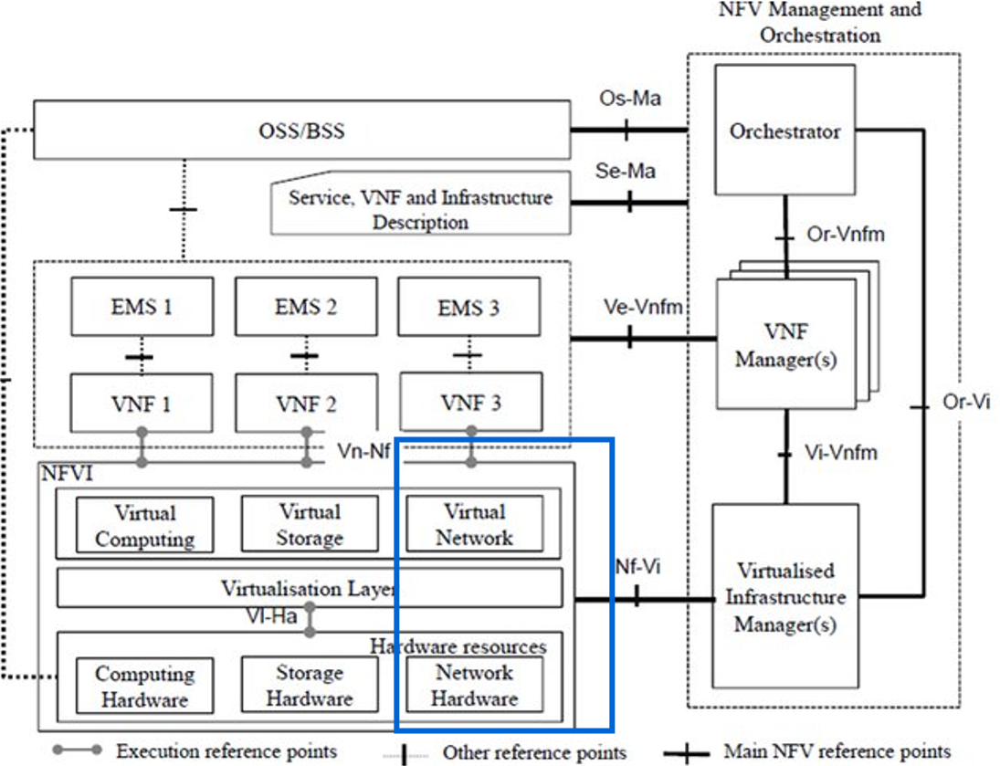
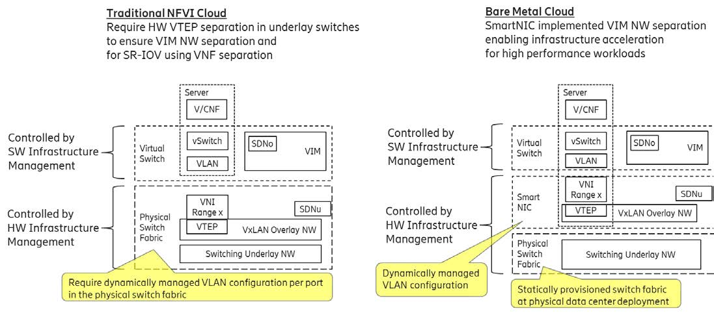
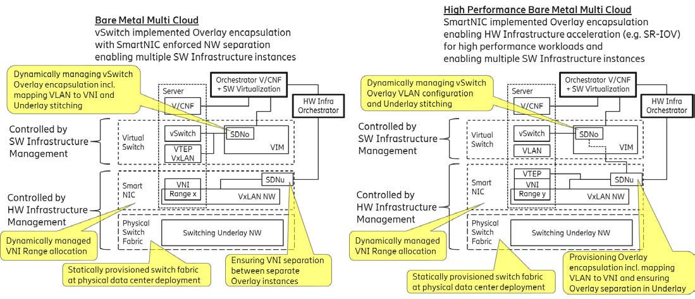
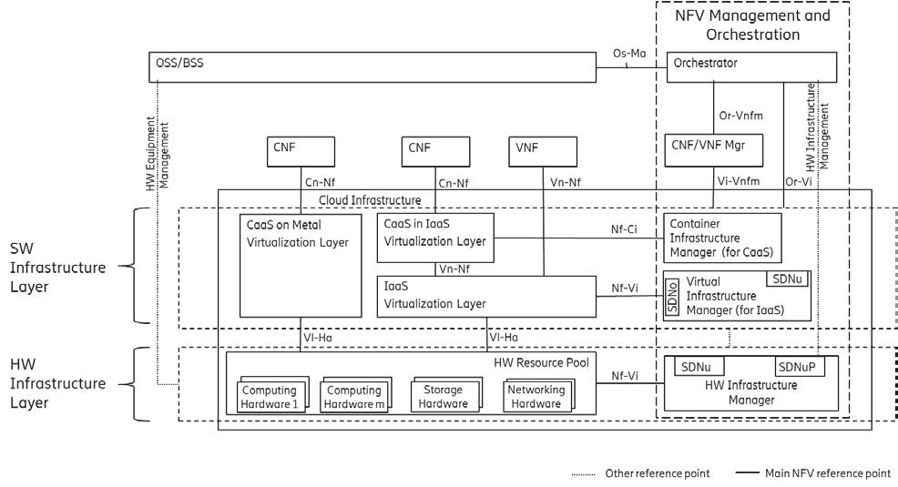
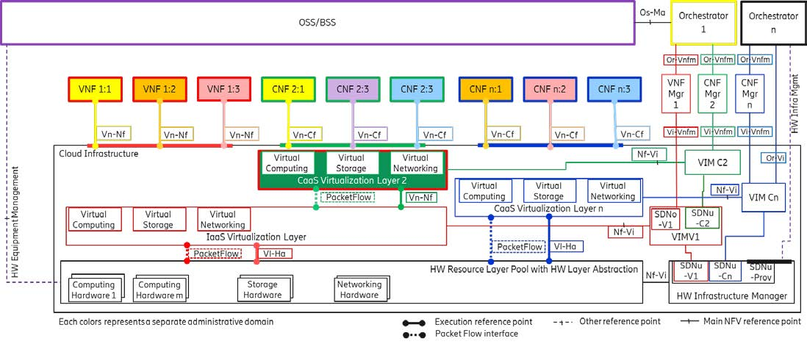

[<< Back](./README.md)
# CNTT Approach

## Table of Contents
* [5.1 Networking and Fabric Approach](#5.1)
  * [5.1.1 Networking Scope](#5.1.1)
  * [5.1.2 Networking Principles & Strategy](#5.1.2)
  * [5.1.3 Network Layering and Concepts](#5.1.3)

## 5.1 Networking and Fabric Approach

> _**Editor's Note:** The purpose in the subsections is to provide initial high-level content related to networking across CNTT, so as to provide general direction and help coordinate current independent networking development activities, as well as to satisfy the networking MVP deliverables for the Baldy release. The following content addresses the overall CNTT networking solution, and it is anticipated this content will be expanded and be relocated where appropriate._

The basic approach to producing the initial deliverables is to:
A) Summarize the overall CNTT Networking and Fabric Strategy
B) Document the initial list of Objectives and Requirements
C) Document enough initial logistical details for contributors to create coherent content

Readers be aware, in parallel with the CNTT Networking Strategy, the RI team is implementing networking for use today in labs and by RC. As RI has to deliver a working network at the same time the initial networking strategy and specifications are to be delivered, it is not expected nor mandated RI networking be conformant in the immediate future. However, the RI will need to be compatible, meaning, it delivers the network connectivity required by the RA and by RC, even if it does not implement the APIs, topology, encapsulation, etc., that will ultimately be specified herein.

The following subsections, Executive Summary, Strategy Objectives, Networking Requirements and Initial Approach, respectively, are intended to provide an overview of CNTT's vision for networking and intent, objectives, requirements and their supporting rationale, as well as initial development approach.

The networking within a cloud infrastructure, fabric or otherwise, is an area where there is significant variability across implementations. Leaf-Spine topology is well established, however, after topology there are countless decisions an Operator needs to make. Differences arise from many aspects, for example, is the solution layer-2 or layer-3; is the routing static or dynamic; what mechanism is used for encapsulation; what mechanism is used for isolation; does it support SR-IOV; does it support DPDK; does it employ SmartNICs; does it employ distributed control or a centralized control driving a programmable fabric; and the list continues. The multitude of permutations enable cloud infrastructure architects (Operators and Suppliers) to design (or procure) a fabric/networking solution that's optimized for their needs, whether their needs are minimal, very extensive or somewhere in between.

For CNTT, a strategy is needed that affords Operators the performance, flexibility, availability, maintainability and scalability their business requires, yet doesn't require OPNFV to design, manage and test prohibitive numbers of networking solutions.
 
**Some points for CNTT to consider when contemplating recommendations:**
   > * Despite large variances in implementation, the spectrum of networking capabilities ultimately delivered to Workloads is comparatively narrow
   > * Standard CNTT methodology (i.e. normalize interfaces, APIs, capabilities and behaviors at the reference points) applies well to networking, helping mitigate the need to be overly prescriptive about implementation  
   > * CNTT/OPNFV MUST provide a functional networking solution for the RI, and in support of RC  
   > * CNTT/OPNFV potentially does NOT have to provide a production networking solution for RI  
   > * CNTT/OPNFV is NOT planning to provide a production compute solution for RI

### 5.1.1 Networking Scope
According to the ETSI NFV Model, Networking alongside Compute and Storage, is an integral part of the Network Function Virtualisation Infrastructure (NFVI). The general function of Networking in the NFV context is to provide the connectivity between various virtualised and non-virtualised resources required for a delivery of a Network Service. Such a connectivity may manifest itself as a virtualised network between VMs or Containers (e.g. overlay networks managed by SDN Controllers, or programmable fabrics that provide such connectivity natively) or as an integration into the Infrastructure Hardware level for offloading some of the Network Functions into this level. 

Normalization of the integration reference points between different layers of the NFV architecture stack is one of the main concerns of the telco industry.  In the Networking context the primary focus is directed on the packet flow and control flow interfaces between Virtualization level (be it IaaS or CaaS type of virtualisation) and Networking Hardware resources, as well as on related integration into MANO level (Hardware/ Network Infrastructure Management/Control, Orchestration). 

It is an important feature of the proposed Networking Model to ensure the ability for supporting simultanous usage of different reference architectures by having multiple CaaS and IaaS layers on top of a shared Hardware Infrastructure layer. The details of this approach are provided in the section "Network Layering and Concepts" below.

#### 5.1.1.1 Identified Networking Gaps
To start the community discussion around potential gaps in the body of existing standards around the Cloud Infrastructure (NFV Infrastracture) networking, we looked into the ETSI NFV Architectural Framework. We have identified a number of areas that, in our view, need to be addressed (see below for the initial list). As usual, in our further efforts, teh community will need to decide where and how these items should be addressed.

1.	ETSI NFV does not have a separation between HW Infrastructure Management and SW Virtualization Management and by that the cardinality of having multiple CaaS and IaaS layers on top of a shared HW Infrastructure Layer cannot be expressed
1.	ETSI NFV lacks a description of the reference points in between the SW Virtualization Layers and the HW Infrastructure Layer denoted as Vl-Ha and by that cannot express Packet Flows, Control/Status Interfaces and Management Interfaces them in between
1.	ETSI NFV model does not explicitly call out an HW Abstraction layer on top of the HW resources and by that many SW Virtualization Layers act upon the physical HW components in a non-portable way that do not allow an HW Infrastructure to compose abstracted HW resources from pools of individual HW components
1.	ETSI NFV lack of spelled out HW Abstraction does not enable a clear way to abstract and describe the technical possibilities that HW layer networking separation, encapsulation, acceleration, etc. can be implemented either in a HW Infrastructure Managed SmartNIC on the Server units or in the shared underlay switching fabric i.e. on the physical Switching Units 
1.	ETSI NFV model does not include any reference to SDN (Software Define Network) controller(s) and relevant integration points into NFVI and MANO 
1.	ETSI NFV model does not have a way to enable programmable forwarding planes in the HW layer controlled from higher layers of virtualization managers, orchestrators or Network Functions

<b> Figure 5-1-1: ETSI model and Networking.</b>

Note: Other gaps may be identified and addressed during the later stages of work on the RM contents for Networking.

#### 5.1.1.2 Specific topics to be included in the Networking Scope
To address the gaps detailed above the specific topics listed below will be covered under Networking.The list below does not pretend to be complete. It will be a subject to modifications as a result of the community discussion.
1. Network connectivity for L3 tenants, GWs, SDS, etc
1. Spine-Leaf Architecture ( 3 Tier or 5 Tier CLOS architecture )
1. Automation of the located Fabric ( Programmable Fabric )
1. Variety of Underlay protocols that can be used as a transport layer within the Fabric
1. Variety of Overlay protocols
1. SDN integration with Cloud Infrastructure manager
1. SRIOV workload interworking
1. DPDK workload interworking
1. Service Function Chaining (SFC ) and how it can be achieved
1. New Networking technologies ( SmartNIC , FPGA ,..)
1. Inter K8s POD communication and CNI
1. Networking aspects of migration from IaaS to CaaS (from the VNF paradigm to the CNF paradigm)
1. Coexistence of IaaS and CaaS and protracted parallel operations
1. Version controlled catalog of APIs, and their respective spans of control, capabilities and purpose, to facilitate predictable integration with a wide selection of fabric implementations

### 5.1.2 Networking Principles & Strategy

This section introduce some principles that should be followed during developing  and defining  Networking scopes for Reference Model , Reference Architecture 01 -OpenStack- , Reference Architecture 02  - K8s – down to Reference implementation and certificate under CNTT

•	**Abstraction**: A standardized layer between Virtualization Layer domains and the Networking Hardware layer resource pool hiding the implementation details of the Networking Hardware.
Note: This Principle may be deployed in many different ways depending on target use case requirements, workload characteristics (different algorithms implementing pipeline steps) and available platforms. This includes network functions running on server nodes with our without programmable HW acceleration, or functions running on a programmable standalone network switch in the network.

•	**Agnosticity** : Build Network Fabric that can carry any type of workload in terms of :

      o	Workload type : Can be Control, User and Management plan

      o	Workload supported acceleration Technologies : SRIOV or DPDK based workload

•	**Automation**: Full Automation, starting from Fabric provisioning to automation of VNF/CNF onboarding

•	**Openness**: All CNTT networking is based on open API ( NBI and SBI )  and Open source SDN controllers integration 

•	**Programmability**: should be based on state of art programmable fabric.

•	**Scalability**: should be scalable to handle all traffic traverse North-South and East-West.

•	**Workload diversity**: should be capable to handle any VNF , CNF and BareMetal workload

•	**Telco grade**: should be a Telco grade Fabric and SDN to fulfil Telco requirements such as Service chaining , Network Slicing,...etc

•	**Edge**: Can be extended to covers the edge use cases

•	**Future prove**: should be support a new acceleration technologies like smart NIC 

### 5.1.3 Network Layering and Concepts

Cloud and Telco networking are layered, and it is very important to keep the layering dependences low to enable security, separation and portability in between multiple implementations.

These explanations for Layering and Concepts are likely too rich and verbose for a CNTT document entry, but it is important that we first understand and agree on these concepts before we start entering text that could be misunderstood.

### Underlay and Overlay Networking concepts

The ETSI NFV model divide networking in an Underlay and an Overlay Network layer. The purpose with this layering is to ensure separation of the SW Virtualization tenants Overlay Networks from each other, whilst allowing the traffic to flow on the shared Underlay Network in between all Ethernet connected HW units.

The Overlay Networking separation is often done through encapsulation e.g. through VxLAN on the Underlay Networks e.g. based on L2 (VLAN) or L3 (IP) networks.

In some instances, the SW Virtualization Tenants can bypass the Overlay Networking encapsulation to achieve better performance or network visibility/control. A common method to bypass the Overlay Networking encapsulation is the usage of SR-IOV that effectively hands up the NIC Physical and Virtual Functions on the NIC to the SW Virtualization Layer and Tenants. In these cases, the Underlay Networking must handle the separation e.g. through a Virtual Termination End Point (VTEP) that encapsulate the Overlay Network traffic.

### Software Defined Networking control concepts of the Underlay Networking

VTEP could be manually provisioned in the Underlay Networking or be automated and controlled through a Software Defined Networking interfaces to the Underlay Networking in the HW Infrastructure Layer. Due to the many different facets of Software Defined Networking we will here denote them SDN Underlay (SDNu).

When there are multiple simultaneous SW Virtualization Layers on the same HW Infrastructure, there is a need to ensure Underlay networking separation in the HW Infrastructure Layer. This separation can be done manually through provisioning of a statically configured separation of the Underlay networking in the HW Infrastructure Layer. A better and more agile usage of the HW Infrastructure is to have an authoritative SDN provisioning controller function (here denoted SDNuP) that can be controlled through an automation interface from a HW Infrastructure Orchestrator. The main tasks for the SDNuP are to discover and establish the Underlay resources and then ensure separation of the shared HW Infrastructure Underlay networking resources.

Multiple instances of Container as a Service (CaaS) Virtualization Layers running on an Infrastructure as a Service (IaaS) Virtualization Layer could make use of the IaaS layer to handle the required Underlay Networking separation. In these cases, the IaaS Virtualization Infrastructure Manager (VIM) could include a SDNu control interface enabling automation.

### Hardware and Software Infrastructure Layer concepts

For Cloud implementations of multiple well separated simultaneous SW Virtualization domains on a shared HW Infrastructure there must be a separation of the hardware resources e.g. servers and the Underlay Networking resources that interconnect the hardware resources e.g. through a switching fabric.

To allow multiple separated simultaneous SW Virtualization domains onto a shared switching fabric there is a need to split up the Underlay Networking resources into non overlapping addressing domains
on suitable protocols e.g. VxLAN with their VNI Ranges. This separation must be done through an
administrative domain that could not be compromised by any of the individual SW Virtualization domains either by malicious or unintentional Underlay Network mapping or configuration.

The ETSI NFV Infrastructure (that CNTT refer to as Cloud Infrastructure) can be considered to be composed of two distinct layers, referred to as HW Infrastructure Layer and SW Infrastructure Layer, which can be managed separately from different administrative domains. When there are multiple separated simultaneously deployed SW Virtualization domains, they must be enabled to be in individual non-dependent administrative domains.

Referenced ETSI NFV model in the Architectural Framework, [ETSI GS NFV 002 V1.2.1.](https://www.etsi.org/deliver/etsi_gs/NFV/001_099/002/01.02.01_60/gs_NFV002v010201p.pdf)

### Switch Fabric and SmartNIC concepts for Underlay Networking separation

The HW Infrastructure Layer can implement the Underlay Networking separation in any type of packet handling component. This may be deployed in many different ways depending on target use case requirements, workload characteristics and available platforms. Two of the most common ways is 1. within the physical Switch Fabric and 2. in a SmartNIC connected to the Server CPU being controlled over a management channel that is not reachable from the Server CPU and its host software. In either way the Underlay Networking separation is controlled by the HW Infrastructure Manager.

In both cases the Underlay Networking can be externally controlled over the SDNu interface, that must be instantiated with appropriate Underlay Networking separation for each of the SW Virtualization administrative domains.

> **Note:** The use of SmartNIC in this section is only pertaining to Underlay Networking separation of SW Virtualization instances in separate Overlay domains. This is the important consideration for the Reference Model that enable multiple instances from one or several Reference Architectures to be used on a shared Underlay Network. The use of SmartNIC components from any specific SW Virtualization instance e.g. for internal virtual switching control and acceleration must be regulated by each Reference Architecture without interfearing with the authoritative Underlay separation laid out in the Reference Model.

Two exemplifications of different common HW realizations of Underlay separation in the HW Infrastructure Layer can be seen in **Figure 1-4**.

<b>Figure 1-4:</b> Underlay Networking separation examples

### SDN Overlay and SDN Underlay concepts, layering and relationships

An SDN Overlay controller (here denoted SDNo) is responsible for managing the SW Virtualization Layer virtual switching that manages the Overlay Network switching and encapsulation, and mapping onto the Underlay Networks.

In cases where the V/CNF bypasses the SW Virtualization Layer virtual switching e.g. high performance applications using SR-IOV, there is a need for the HW Infrastructure Layer to perform the encapsulation and mapping onto the Underlay Networking. This is controlled by the SDN Underlay controller (SDNu) that is authoritative and ensures the Overlay Networking separation on the shared Underlay Networking resources.

SDNo controllers can request Underlay encapsulation and mapping to be done by signaling to an SDNu controller. There are however today no standardized way for this signaling and by that there is a missing reference point and API description in this architecture. Examples of useful concepts for this interfaces would be L2GW (OpenStack) and OVSDB.

For deployments with multiple SW Virtualization instances sharing the same Underlay Networking resources, it is the SDNu (or SDNuP) responsibility to ensure separation of the shared Underlay resources and to set up appropriate enforcements in the Underlay Networking forwarding plane since each SW Virtualization
instance or V/CNF that bypasses its local virtual switching instance cannot be trusted. Any fault or misconfiguration in such instances could potentially destroy all networking in the shared Underlay Networking.

> **Note:** The Reference Model describe a logical SDNu and SDNo separation to clarify the separation of administrative domains where applicable. In real deployment cases an Operator can select to deploy a single SDN controller instance that implements all needed administrative domain separations or have separate SDN controllers for each administrative domain. A common deployment scenario today is to use a single SDN controller handling both underlay and overlay networking which works on the implementation level when there is only one administrative domain that owns both the HW Infrastructure and the only IaaS SW Virtualization Infrastructure. It is however not up to the Reference Architectures to collapse the SDN controllers since they should not be aware if there are other implementations based on that same or other Reference Architectures running on the same HW Infrastructure.

Two use case examples with both SDNo and SDNu controllers depicting a normal virtual switch encapsulating SW Virtualization Infrastructure instance and another high performance oriented SW Virtualization Infrastructure instance (e.g. using SR-IOV) are described in **Figure 1-5**. The examples are showing how the encapsulation and mapping could be done in the virtual switch or in a SmartNIC on top of a statically provisioned underlay switching fabric, but another example could also have been depicted with the SDNu controlling the underlay switching fabric without usage of SmartNICs.

<b>Figure 1-5:</b> SDN Controller relationship examples

### Programmable Networking Fabric

The concept of a Programmable Networking Fabric pertains to the ability to have an effective forwarding pipeline (a.k.a. forwarding plane) that can be programmed and/or configured without any risk of disruption to the shared Underlay Networking that is involved with the reprogramming for the specific efficiency increase.

The forwarding plane is distributed by nature and must be possible to implement both in switch elements and on SmartNICs (managed outside the reach of host SW) that both can be managed from a logically centralized control plane residing in the HW Infrastructure Layer.

The logically centralized control plane is the foundation for the authoritative separation in between different SW Virtualization domains or Bare Metal Network Function applications that are regarded as untrusted both from the shared layers and each other.

Although the control plane is logically centralized, scaling and control latency concerns must allow the actual implementation of the control plane to be distributed when required.

All VNF, CNF and SW Virtualization acceleration as well as all specific support functionality that is programmable in the forwarding plane must be confined to the well separated sections or stages of any shared Underlay Networking. A practical example could be a SW Virtualization instance or VNF/CNF that controls a NIC/SmartNIC where the Underlay Networking (Switch Fabric) ensures the separation in the same way as it is done for SR-IOV cases today.

The nature of a shared Underlay Network that shall ensure separation and be robust is that all code in the forwarding plane and in the control plane must be under the scrutiny and life cycle management of the HW Infrastructure Layer.

This also imply that programmable forwarding functions in a Programmable Networking Fabric are shared resources and by that will have to get standardized interfaces over time to be useful for multi-vendor architectures such as ETSI NFV. Example of such future extensions of shared functionality implemented by a Programmable Networking Fabric could be L3 as a Service, Firewall as a Service and Load Balancing as a Service.

> **Note:** Appliance-like applications that fully own its infrastructure layers (share nothing) could manage and utilize a Programmable Networking Fabric in many ways, but that is not a Cloud implementation and falls outside the use cases for these specifications.

### Networking Reference Model

The Networking Reference Model depicted in **Figure 1-6** is based on the ETSI NFV model and has a strict separation of the HW Infrastructure and SW Infrastructure Layers in NFVI. It enables multiple well separated simultaneous SW Virtualization domains allowing a mix of CaaS on Metal, CaaS on IaaS and IaaS on a shared HW infrastructure.

<b>Figure 1-6:</b> Networking Reference Model based on the ETSI NFV

### Deployment example of a Networking Reference Model

A Networking Reference Model deployment example is depicted in **Figure 1-7** to demonstrate the mapping to ETSI NFV reference points with additions of packet flows through the infrastructure layers and some other needed reference points. The example illustrates individual responsibilities of a complex organization with multiple separated administrative domains here represented with separate colors.

The example is common scenario for operators that modernize their network functions during a rather long period of migration from VNFs to Cloud Native CNFs. Today the network functions are predominantly VNFs on IaaS environments and the operators are gradually moving a selection of these into CNF on CaaS that either sit on top of the existing IaaS or directly on Bare Metal. It is expected that there will be multiple CaaS instances in most networks since it is not foreseen any generic standard of a CaaS that will be capable to handle all types of CNFs and also have a decoupled Life Cycle Management from all individual CNFs from a multi-vendor community. 

<b>Figure 1-7:</b> Networking Reference Model deployment example

