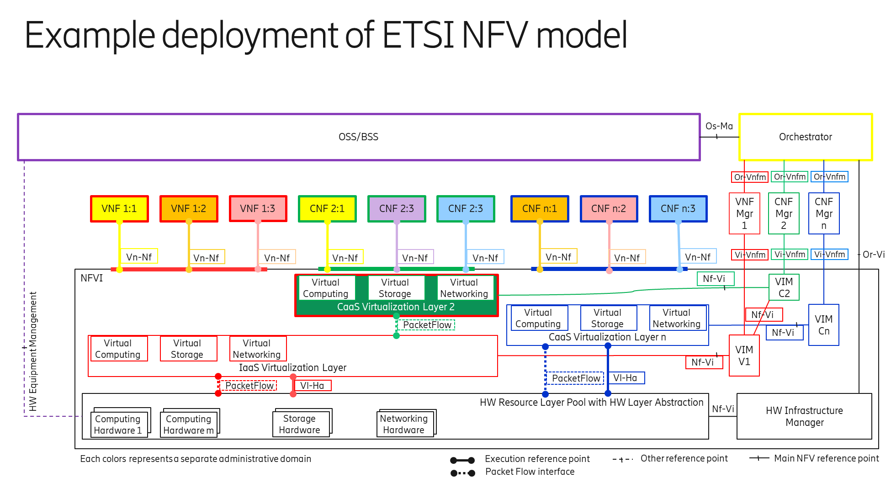
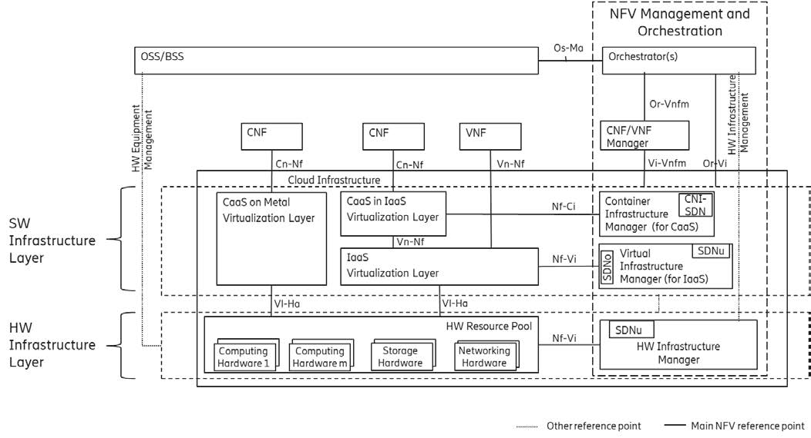
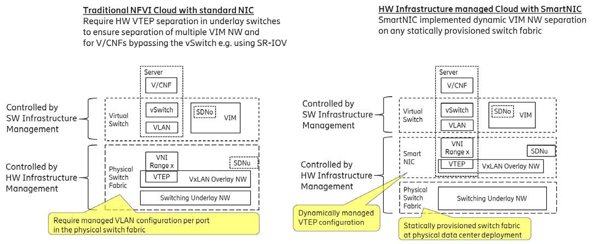
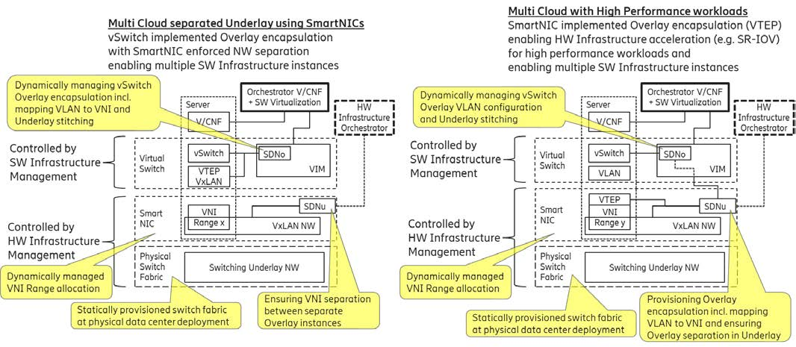
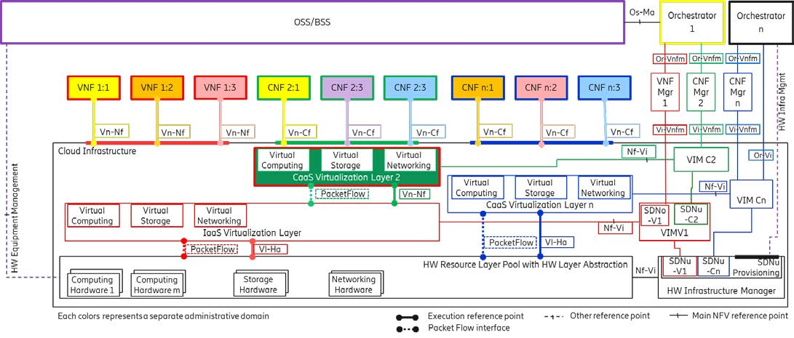

[<< Back](./README.md)
# CNTT Approach

## Table of Contents
* [5.1 Networking and Fabric Approach](#5.1)
  * [5.1.1 Executive Summary](#5.1.1)
  * [5.1.2 Strategic Objectives](#5.1.2)
  * [5.1.3 Networking Requirements](#5.1.3)
  * [5.1.4 Initial Steps](#5.1.4)

## 5.1 Networking and Fabric Approach

> _**Editor's Note:** The purpose in the subsections is to provide initial high-level content related to networking across CNTT, so as to provide general direction and help coordinate current independent networking development activities, as well as to satisfy the networking MVP deliverables for the Baldy release. The following content addresses the overall CNTT networking solution, and it is anticipated this content will be expanded and be relocated where appropriate._

The basic approach to producing the initial deliverables is to:
A) Summarize the overall CNTT Networking and Fabric Strategy
B) Document the initial list of Objectives and Requirements
C) Document enough initial logistical details for contributors to create coherent content

Readers be aware, in parallel with the CNTT Networking Strategy, the RI team is implementing networking for use today in labs and by RC. As RI has to deliver a working network at the same time the initial networking strategy and specifications are to be delivered, it is not expected nor mandated RI networking be conformant in the immediate future. However, the RI will need to be compatible, meaning, it delivers the network connectivity required by the RA and by RC, even if it does not implement the APIs, topology, encapsulation, etc., that will ultimately be specified herein.

The following subsections, Executive Summary, Strategy Objectives, Networking Requirements and Initial Approach, respectively, are intended to provide an overview of CNTT's vision for networking and intent, objectives, requirements and their supporting rationale, as well as initial development approach.

The networking within a cloud infrastructure, fabric or otherwise, is an area where there is significant variability across implementations. Leaf-Spine topology is well established, however, after topology there are countless decisions an Operator needs to make. Differences arise from many aspects, for example, is the solution layer-2 or layer-3; is the routing static or dynamic; what mechanism is used for encapsulation; what mechanism is used for isolation; does it support SR-IOV; does it support DPDK; does it employ SmartNICs; does it employ distributed control or a centralized control driving a programmable fabric; and the list continues. The multitude of permutations enable cloud infrastructure architects (Operators and Suppliers) to design (or procure) a fabric/networking solution that's optimized for their needs, whether their needs are minimal, very extensive or somewhere in between.

For CNTT, a strategy is needed that affords Operators the performance, flexibility, availability, maintainability and scalability their business requires, yet doesn't require OPNFV to design, manage and test prohibitive numbers of networking solutions.
 
**Some points for CNTT to consider when contemplating recommendations:**
   > * Despite large variances in implementation, the spectrum of networking capabilities ultimately delivered to Workloads is comparatively narrow
   > * Standard CNTT methodology (i.e. normalize interfaces, APIs, capabilities and behaviors at the reference points) applies well to networking, helping mitigate the need to be overly prescriptive about implementation  
   > * CNTT/OPNFV MUST provide a functional networking solution for the RI, and in support of RC  
   > * CNTT/OPNFV potentially does NOT have to provide a production networking solution for RI  
   > * CNTT/OPNFV is NOT planning to provide a production compute solution for RI

### 5.1.1 Executive Summary

> _Placeholder for the Executive Summary (targeting Baldy for first draft). **If you are interested in writing this content, please contact the RM lead.**_

### 5.1.2 Networking Strategy Objectives

This section catalogs CNTT's high-level objectives for the Network Fabric Strategy. 

> List needs to be prioritized; expect additional objectives to be added, as they arise. This represents the _What_, not the _How_.

1. The implementation of Networking inside the HW Layer should not be visible to the VNF/CNF and should preferably not even be visible to the IaaS/CaaS
1. Provide networks for L3 tenant, GWs, SDS, etc.
1. Cleanly decouple interface/reference points between CNTT constituencies
1. Provide interoperability at layer demarcation/reference points within the cloud infrastructure. Ex.:
   * any RA couples to RM
   * like RI couples to RA
   * like VIs (Vendor's Implementations) couple to RA
   * Operators can design or procure a compatible fabric
1. Concurrently supports containerized and virtualized coexistence for VNF->CNF cutovers, as well as protracted parallel operations
1. Provide a version controlled catalog of APIs, and their respective spans of control, capabilities and purpose, to facilitate predictable integration w/ a wide selection of fabric implementations
1. Provide ability for any number of Operator-specific fabrics to power CNTT cloud infrastructure
1. Enable RC's ability to realize mandated OVP qualification deliverables
1. Unambiguously document the responsibilities of each CNTT constituency
1. In cases where a VNF/CNF require HW layer resources it should be under the control of the Virtualization Layer
1. It is important that the HW Infrastructure Manager, each VIM and each VNF/CNF could be managed by separate organizations
1. Drive the industry towards convergence on ABIs supporting Cloud-Native implementations for SmartNICs

> _**Editor's Note:** Consider moving objectives to a table_

### 5.1.3 Networking Requirements

1. cloud infrastructure layer responsibilities will include:
   * HW Infrastructure Manager shall provide an abstracted model of the allocated HW resources into each specific Virtualization domain
     * Additionally, it is responsible for maintaining logical isolation between different instances of virtualization domain
     * Some of the HW resources including networking resources shall be possible to be withheld from Virtualization domains to allow for scaling, spare parts and HW Composition within the HW Infrastructure Layer itself
   * Virtualization layer shall provide the Cloud Tenants with an abstracted networking environment
     * It is therefore responsible for maintaining isolation between Cloud Tenants

An example of the layering described above is depicted in **Figure 1-3**, where the Virtualization layer manages the Overlay Networking (e.g., through VLAN allocation) and the HW Infrastructure manages the Underlay networking (e.g., through VxLAN VNI range allocations).

<b>Figure 1-3:</b> Network Layering

### 5.1.4 Initial Logistical Steps

> _**Editor's Note:** The purpose in this section is to communicate the responsibilities of the CNTT levels, as they pertain to the networking solution, and how they relate (i.e. what goes in each bucket). The initial content below needs to be expanded with examples of material representative of the scope for each bucket, and refined. It is expected this area be enhanced to help authors in various CNTT levels understand their purview, and ultimately be deleted._

As with most CNTT subsystems, responsibility for Objectives, Requirements, Guidelines, etc. is divided among the CNTT constituencies, as follows:
- **Tech:** High-level strategy and other informative writings
  - e.g. Executive summary, considerations, intent, vision, etc.
- **RM:** Generic modeling and abstraction
  - e.g. Guidelines and other information applicable to all RAs
  - Overall theory of operation
- **RA-x:** architecture, APIs and other service level details
- **RI-x:** networking information for the relevant lab or POD
  - Considerations related to differences between target architecture (RM 5.1) and current RI implementation
  - Factors specific to supporting RC
  - Known non-conformances
- **RC:** Details related to qualification
  - Implications of testbed network environment vs. production environments

### 5.1.5 Network Layering and Concepts

Cloud and Telco networking are layered, and it is very important to keep the layering dependencies low to enable security, separation and portability in between multiple implementations.

Before we start entering and develop a deep model we need to agree on some foundational concepts and layering that allow decoupling of implementations in between the layers. These initially needs to be rich and verbose for the networking approaches to cover the Reference Model and its Reference Architectures that controls the Reference Implementations and respective Reference Conformance test suites.

We will emphasize 4 concepts in this section

 - Underlay and Overlay Networking concepts
 - Hardware and Software Infrastructure Layer concepts
 - Software Defined Networking, SDNu and SDNo concepts
 - Programmable Networking Fabric concept

### Underlay and Overlay Networking concepts

The ETSI NFV model divide networking in an Underlay and an Overlay Network layer. The purpose with this layering is to ensure separation of the SW Virtualization tenants (Workload) Overlay Networks from each other, whilst allowing the traffic to flow on the shared Underlay Network in between all Ethernet connected HW units.

The Overlay Networking separation is often done through encapsulation of Tenants traffic using overlay protocols e.g. through VxLAN or EVPN on the Underlay Networks e.g. based on L2 (VLAN) or L3 (IP) networks.

In some instances, the SW Virtualization Tenants can bypass the Overlay Networking encapsulation to achieve better performance or network visibility/control. A common method to bypass the Overlay Networking encapsulation normally done by the SW Virtualization Layer, is the VNF/CNF usage of SR-IOV that effectively take over the Physical and Virtual Functions of the NIC directly into the VNF/CNF Tenant. In these cases, the Underlay Networking must handle the separation e.g. through a Virtual Termination End Point (VTEP) that encapsulate the Overlay Network traffic.

> **Note:** Bypassing the Overlay Networking layer is a violation of the basic CNTT decoupling principles, but in some cases unavoidable with existing technologies and standards. Until suitable technologies and standards are developed, CNTT have a set of agreed exemptions that forces the Underlay Networking to handle the bypassed Overlay Networking separation.

VTEP could be manually provisioned in the Underlay Networking or be automated and controlled through a Software Defined Networking controller interfaces into the underlying networking in the HW Infrastructure Layer. 

### Hardware and Software Infrastructure Layer concepts

For Cloud implementations of multiple well separated simultaneous SW Virtualization domains on a shared HW Infrastructure there must be a separation of the hardware resources e.g. servers and the Underlay Networking resources that interconnect the hardware resources e.g. through a switching fabric.

To allow multiple separated simultaneous SW Virtualization domains onto a shared switching fabric there is a need to split up the Underlay Networking resources into non overlapping addressing domains on suitable protocols e.g. VxLAN with their VNI Ranges. This separation must be done through an administrative domain that could not be compromised by any of the individual SW Virtualization domains either by malicious or unintentional Underlay Network mapping or configuration.

The ETSI NFV Infrastructure (that CNTT refer to as Cloud Infrastructure) can be considered to be composed of two distinct layers, referred to as HW Infrastructure Layer and SW Infrastructure Layer. When there are multiple separated simultaneously deployed SW Virtualization domains, the architecture and deployed implementations must enable each of them to be in individual non-dependent administrative domains. The HW Infrastructure must also be enabled to be a fully separated administrative domain from all of the SW Virtualization domains. 

These concepts are very similar to how the Hyperscaler Cloud Providers (HCP) offer Virtual Private Clouds for users of Bare Metal deployment on the HCP shared pool of servers, storage and network resources.

The separation of Hardware and Software Infrastructure Layers makes it important that CNTT Reference Architectures do not include direct management or dependencies of the physical hardware resources e.g. servers and switches inside the HW Infrastructure Layer. All automated interaction from the SW Infrastructure Layer implementations towards the HW and shared networking resources in the HW Infrastructure Layer should go through a common abstracted Reference Model  interface. 

Referenced ETSI NFV model in the Architectural Framework, [ETSI GS NFV 002 V1.2.1.](https://www.etsi.org/deliver/etsi_gs/NFV/001_099/002/01.02.01_60/gs_NFV002v010201p.pdf)

### Software Defined Networking, SDNu and SDNo concepts

A major point with a Cloud Infrastructures is to automate as much as possible and an important tool for Networking automation is Software Defined Networking (SDN) that comes in many different shapes and can act on multiple layers of the networking. In this section we will deal with the internal networking of a data center and not how data centers interconnect with each other or  get access to the world outside of a data center.

When there are multiple simultaneous SW Virtualization Layers on the same HW Infrastructure, there is a need to ensure Underlay networking separation in the HW Infrastructure Layer. This separation can be done manually through provisioning of a statically configured separation of the Underlay Networking in the HW Infrastructure Layer. A better and more agile usage of the HW Infrastructure is to offer each instance of the SW Virtualization Layer an SDN interface to the HW Infrastructure. Since these SDN instances only deals with a well separated portion (or slice) of the Underlay Networking we call this interface SDN-Underlay (SDNu).

The HW Layer is responsible to keep the Underlay Networking well separated in between the different SW Virtualization instances which can be done through manual provisioning methods or through a HW Layer orchestration interface. The separation responsibility is also valid in between each instance of the SDNu interface since each SW Virtualization instance shall not know about, be disturbed by or have any capability to reach the other instances.

An SDN-Overlay control interface (here denoted SDNo) is responsible for managing the SW Virtualization Layer virtual switching and/or routing that manages the Overlay Network switching/routing and encapsulation, and their mapping onto the Underlay Networks.

In cases where the VNF/CNF bypasses the SW Virtualization Layer virtual switching, as described above, the HW Infrastructure Layer must perform the encapsulation and mapping onto the Underlay Networking to ensure Underlay Networking separation. This should be a prioritized capability in the SDNu control interface since CNTT currently allow exemptions for bypassing the virtual switching (e.g. through SR-IOV). 

SDNo controllers can request Underlay Networking encapsulation and mapping to be done by signaling to an SDNu controller. There are however today no standardized way for this signaling and by that there is a missing reference point and API description in this architecture. 

Multiple instances of Container as a Service (CaaS) Virtualization Layers running on an Infrastructure as a Service (IaaS) Virtualization Layer could make use of the IaaS layer to handle the required Underlay Networking separation. In these cases, the IaaS Virtualization Infrastructure Manager (VIM) could include a SDNu control interface enabling automation.

> **Note:** The Reference Model describe a logical separation of SDNu and SDNo interfaces to clarify the separation of administrative domains where applicable. In real deployment cases an Operator can select to deploy a single SDN controller instance that implements all needed administrative domain separations or have separate SDN controllers for each administrative domain. A common deployment scenario today is to use a single SDN controller handling both Underlay and Overlay Networking which works on the implementation level when there is only one administrative domain that owns both the HW Infrastructure and the only  SW Virtualization Infrastructure. The nature of a shared Underlay Network that shall ensure separation and be robust is that all code in the forwarding plane and in the control plane must be under the scrutiny and life cycle management of the HW Infrastructure Layer.
One consequence of this is that the Reference Architectures can not model collapsed SDNo and SDNu controllers since they must stay unaware of other deployed implementations  running on the same HW Infrastructure.

So when Networking now gets introduced into the Reference Model, it is important that SDN also gets considered and that the two now existing Reference Architectures are harmonized with the new common Networking Reference Model. In absence of a Networking Reference Model, both Reference Architectures have mostly been specifying networking as if they where the only single SW Infrastructure on a dedicated HW resource pool.

### Programmable Networking Fabric concept

The concept of a Programmable Networking Fabric pertains to the ability to have an effective forwarding pipeline (a.k.a. forwarding plane) that can be programmed and/or configured without any risk of disruption to the shared Underlay Networking that is involved with the reprogramming for the specific efficiency increase.

The forwarding plane is distributed by nature and must be possible to implement both in switch elements and on SmartNICs (managed outside the reach of host SW) that both can be managed from a logically centralized control plane residing in the HW Infrastructure Layer.

The logically centralized control plane is the foundation for the authoritative separation in between different SW Virtualization domains or Bare Metal Network Function applications that are regarded as untrusted both from the shared layers and each other.

Although the control plane is logically centralized, scaling and control latency concerns must allow the actual implementation of the control plane to be distributed when required.

All VNF, CNF and SW Virtualization acceleration as well as all specific support functionality that is programmable in the forwarding plane must be confined to the well separated sections or stages of any shared Underlay Networking. A practical example could be a SW Virtualization instance or VNF/CNF that controls a NIC/SmartNIC where the Underlay Networking (Switch Fabric) ensures the separation in the same way as it is done for SR-IOV cases today.

The nature of a shared Underlay Network that shall ensure separation and be robust is that all code in the forwarding plane and in the control plane must be under the scrutiny and life cycle management of the HW Infrastructure Layer.

This also imply that programmable forwarding functions in a Programmable Networking Fabric are shared resources and by that will have to get standardized interfaces over time to be useful for multi-vendor architectures such as ETSI NFV. Example of such future extensions of shared functionality implemented by a Programmable Networking Fabric could be L3 as a Service, Firewall as a Service and Load Balancing as a Service.

> **Note:** Appliance-like applications that fully own its infrastructure layers (share nothing) could manage and utilize a Programmable Networking Fabric in many ways, but that is not a Cloud implementation and falls outside the use cases for these specifications.

### 5.1.6 Networking Reference Model

The Networking Reference Model depicted in **Figure 1-4** is based on the ETSI NFV model enhanced with Container Virtualization support and a strict separation of the HW Infrastructure and SW Infrastructure Layers in NFVI. It includes all above concepts and enables multiple well separated simultaneous SW Virtualization domains allowing a mix of CaaS on Metal, CaaS on IaaS and IaaS on a shared HW infrastructure. 

It is up to any deployment of  the Cloud Infrastructure to decide what Networking related objects to use, but all Reference Architectures have to be able to map into this model

<b>Figure 1-4:</b> Networking Reference Model based on the ETSI NFV

### Deployment examples based on the Networking Reference Model

#### Switch Fabric and SmartNIC examples for Underlay Networking separation

The HW Infrastructure Layer can implement the Underlay Networking separation in any type of packet handling component. This may be deployed in many different ways depending on target use case requirements, workload characteristics and available platforms. Two of the most common ways is 1. within the physical Switch Fabric and 2. in a SmartNIC connected to the Server CPU being controlled over a management channel that is not reachable from the Server CPU and its host software. In either way the Underlay Networking separation is controlled by the HW Infrastructure Manager.

In both cases the Underlay Networking can be externally controlled over the SDNu interface, that must be instantiated with appropriate Underlay Networking separation for each of the SW Virtualization administrative domains.

> **Note:** The use of SmartNIC in this section is only pertaining to Underlay Networking separation of SW Virtualization instances in separate Overlay domains in much the same way as AWS do with their Nitro SmartNIC. This is the important consideration for the Reference Model that enable multiple instances from one or several Reference Architectures to be used on a shared Underlay Network. The use of SmartNIC components from any specific SW Virtualization instance e.g. for internal virtual switching control and acceleration must be regulated by each Reference Architecture without interfering with the authoritative Underlay separation laid out in the Reference Model.

Two exemplifications of different common HW realizations of Underlay separation in the HW Infrastructure Layer can be seen in **Figure 1-5**.

<b>Figure 1-5:</b> Underlay Networking separation examples

#### SDN Overlay and SDN Underlay layering and relationship example

Two use case examples with both SDNo and SDNu controllers depicting a normal virtual switch encapsulating SW Virtualization Infrastructure instance and another high performance oriented SW Virtualization Infrastructure instance (e.g. using SR-IOV) are described in **Figure 1-6**. The examples are showing how the encapsulation and mapping could be done in the virtual switch or in a SmartNIC on top of a statically provisioned underlay switching fabric, but another example could also have been depicted with the SDNu controlling the underlay switching fabric without usage of SmartNICs.

<b>Figure 1-6:</b> SDN Controller relationship examples

#### IaaS and CaaS SW Virtualization example on a shared HW Infrastructure with SDN

A Networking Reference Model deployment example is depicted in **Figure 1-7** to demonstrate the mapping to ETSI NFV reference points with additions of packet flows through the infrastructure layers and some other needed reference points. The example illustrates individual responsibilities of a complex organization with multiple separated administrative domains here represented with separate colors.

The example is or will be a common scenario for operators that modernize their network functions during a rather long period of migration from VNFs to Cloud Native CNFs. Today the network functions are predominantly VNFs on IaaS environments and the operators are gradually moving a selection of these into CNF on CaaS that either sit on top of the existing IaaS or directly on Bare Metal. It is expected that there will be multiple CaaS instances in most networks since it is not foreseen any generic standard of a CaaS that will be capable to handle all types of CNFs and also have a decoupled Life Cycle Management from all individual CNFs from a multi-vendor community. 

<b>Figure 1-7:</b> Networking Reference Model deployment example

