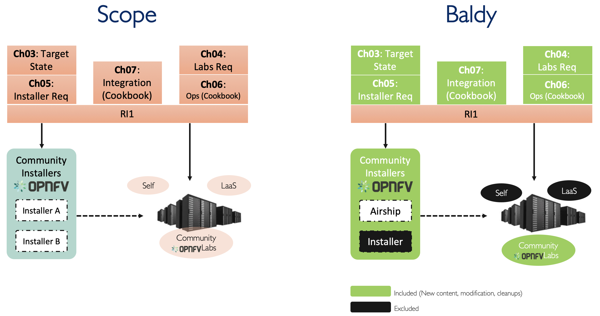
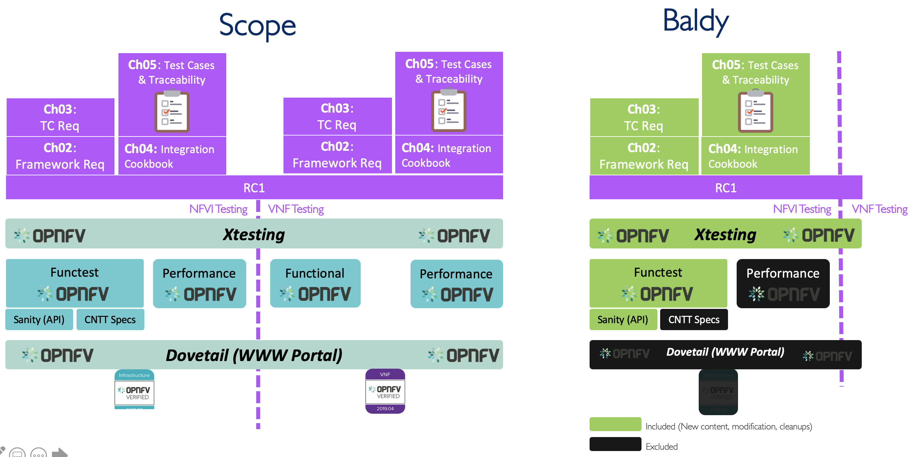

[<< Back](../)
# Baraque Release Notes

## Baraque Release Contents
* [Overview](#overview)
* [RM (v3.x)](#rm)
* [RA-1 (v3.0)](#ra1)
* [RI-1 (v2.0)](#ri1)
* [RC-1 (v1.0)](#rc1)
* [RA-2 (v2.0)](#ra2)
* [RI-2 (v1.0)](#ra2)

## Overview

| Reference # 	| Feature 	| Notes 	|
|-------------	|----------------- |-------	|
| `baraque.tech.1` 	| TBD 	|  |
| `baraque.tech.2` 	| TBD 	|  |
| `baraque.tech.3` 	| TBD   |  |
| `baraque.tech.4*` 	| TBD   |  |

*Baraque Release will include at least features up to and including `baraque.tech.4`.

## Reference Model (v3.x)

>WSL Note: Features below should be implemented in order.

| Reference # 	| Feature 	| Notes 	|
|-------------	|-----------------	|-------	|
| `baraque.rm.1` 	| TBD 	|  	|
| `baraque.rm.2` 	| TBD   |   |
| `baraque.rm.3` 	| TBD   | 	|
| `baraque.rm.4*` 	| TBD 	|  	|
| `baraque.rm.5` 	| TBD 	|   |
| `baraque.rm.6` 	| TBD 	|  	|
| `baraque.rm.7` 	| TBD 	|  	|
| `baraque.rm.8` 	| TBD 	|  	|

*Baraque Release will include at least features up to and including `baraque.rm.4`.

## Reference Architecture 1 (v3.0-alpha)

>WSL Note: Features below should be implemented in order.

| Reference # 	| Feature 	| Notes 	|
|-------------	|-----------------	|-------	|
| `baraque.ra1.1` 	| TBD 	| 	|
| `baraque.ra1.2` 	| TBD 	|  	|
| `baraque.ra1.3` 	| TBD 	|  	|
| `baraque.ra1.4` 	| TBD 	|  	|
| `baraque.ra1.5` 	| TBD 	|  	|
| `baraque.ra1.6*` | TBD 	|  	|
| `baraque.ra1.7` 	| TBD 	|  	|
| `baraque.ra1.8` 	| TBD 	|  	|
| `baraque.ra1.9` 	| TBD 	|  	|

*Baraque Release will include at least features up to and including `baraque.ra1.6`.

## Reference Implementation 1 (v2.0-alpha)

<!--

<b>Figure 1:</b> RI-1 Baldy Release plan
-->

>WSL Note: Features below should be implemented in order.

| Reference # 	| Feature 	| Notes 	|
|-------------	|-----------------	|-------	|
| `baraque.ri1.1` 	| TBD 	|  	|
| `baraque.ri1.2` 	| TBD 	|  	|
| `baraque.ri1.3` 	| TBD 	|  	|
| `baraque.ri1.4` 	| TBD 	|  	|
| `baraque.ri1.5` 	| TBD 	|  	|
| `baraque.ri1.6` 	| TBD 	|  	|
| `baraque.ri1.6` 	| TBD	|  	|
| `baraque.ri1.7` 	| TBD 	| **DEV**	|
| `baraque.ri1.8*`  | TBD   | **DEV** 	|

*Baraque Release will include at least features up to and including `habaraquellasan.ri1.8`.

## Reference Conformance 1 (v1.0-alpha)

<!--

<b>Figure 2:</b> RC-1 Baldy Release plan
-->

>WSL Note: Features below should be implemented in order.

| Reference # 	| Feature 	| Notes 	|
|-------------	|-----------------	|-------	|
| `baraque.rc1.1` 	| TBD 	|  	|
| `baraque.rc1.2` 	| TBD	|  	|
| `baraque.rc1.3` 	| TBD 	|  	|
| `baraque.rc1.4` 	| TBD 	|  	|
| `baraque.rc1.5` 	| TBD 	|  	|
| `baraque.rc1.6` 	| TBD  	|  	|
| `baraque.rc1.7` 	| TBD   | **DEV** 	|
| `baraque.rc1.8*` | TBD    | **DEV** 	|

*Baraque Release will include at least features up to and including `baraque.rc1.8`.

## Reference Architecture 2 (v2.0-alpha)

>WSL Note: Features below should be implemented in order. For Baldy, At least 

| Reference # 	| Feature 	| Notes 	|
|-------------	|-----------------	|-------	|
| `baraque.ra2.1` 	| TBD 	|  	|
| `baraque.ra2.2` 	| TBD	|  	|
| `baraque.ra2.3` 	| TBD 	|  	|
| `baraque.ra2.4*` | TBD 	|  	|
| `baraque.ra2.5` 	| TBD 	|  	|
| `baraque.ra2.6` 	| TBD 	|  	|
| `baraque.ra2.7` 	| TBD 	|  	|
| `baraque.ra2.8` 	| TBD 	|   |
| `baraque.ra2.9` 	| TBD 	|  	|
| `baraque.ra2.10` | TBD	|  	|

*Baraque Release will include at least features up to and including `baraque.ra2.4`.

## Reference Implementation 2 (v1.0-alpha)

<!--

<b>Figure 1:</b> RI-1 Baldy Release plan
-->

>WSL Note: Features below should be implemented in order.

| Reference # 	| Feature 	| Notes 	|
|-------------	|-----------------	|-------	|
| `baraque.ri2.1` 	| TBD 	|  	|
| `baraque.ri2.2` 	| TBD 	|  	|
| `baraque.ri2.3` 	| TBD 	|  	|
| `baraque.ri2.4` 	| TBD 	|  	|
| `baraque.ri2.5` 	| TBD 	|  	|
| `baraque.ri2.6` 	| TBD 	|  	|
| `baraque.ri2.6` 	| TBD	|  	|
| `baraque.ri2.7` 	| TBD 	|  **DEV**	|
| `baraque.ri2.8*` | TBD   | **DEV** 	|

*Baraque Release will include at least features up to and including `baraque.ri2.8`.