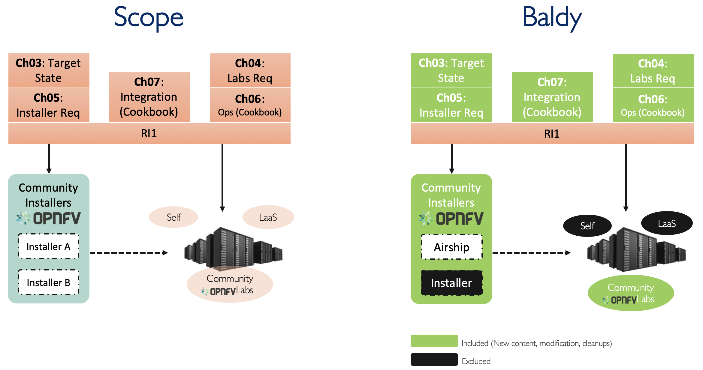
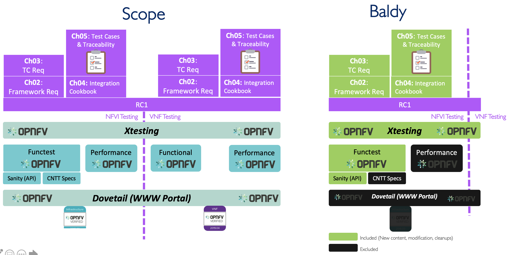

[<< Back](../)
# Baldy Release Notes

## Baldy Release Contents
* [Overview](#overview)
* [RM (v3.0)](#rm)
* [RA-1 (v2.0)](#ra1)
* [RI-1 (v1.0)](#ri1)
* [RC-1 (v1.0-pre-alpha)](#rc1)
* [RA-2 (v1.0)](#ra2)

## Overview

## Reference Model (v3.0)

| Reference # 	| Feature 	| Notes 	|
|-------------	|-----------------	|-------	|
| baldy.rm.1 	| General Cleanup 	| All Chapters 	|
| baldy.rm.2 	| Limiting infrastructure profiles to Basic and Network Intensive 	| Ch02, Ch04, and Ch05 	|
| baldy.rm.3 	|  	|  	|
| baldy.rm.4 	|  	|  	|
| baldy.rm.5 	|  	|  	|
| baldy.rm.6 	|  	|  	|

## Reference Architecture 1 (v2.0)

| Reference # 	| Feature 	| Notes 	|
|-------------	|-----------------	|-------	|
| baldy.ra1.1 	| General Cleanup 	|  	|
| baldy.ra1.2 	|  	|  	|
| baldy.ra1.3 	|  	|  	|
| baldy.ra1.4 	|  	|  	|
| baldy.ra1.5 	|  	|  	|
| baldy.ra1.6 	|  	|  	|

## Reference Implementation 1 (v1.0)

<b>Figure 1:</b> RI-1 Baldy Release plan

| Reference # 	| Feature 	| Notes 	|
|-------------	|-----------------	|-------	|
| baldy.ri1.1 	| General Cleanups 	| For all Chapters 	|
| baldy.ri1.2 	|  	|  	|
| baldy.ri1.3 	|  	|  	|
| baldy.ri1.4 	|  	|  	|
| baldy.ri1.5 	|  	|  	|
| baldy.ri1.6 	|  	|  	|

## Reference Conformance 1 (v1.0-Pre-alpha)

<b>Figure 2:</b> RC-1 Baldy Release plan

| Reference # 	| Feature 	| Notes 	|
|-------------	|-----------------	|-------	|
| baldy.rc1.1 	| General Cleanup 	|  	|
| baldy.rc1.2 	|  	|  	|
| baldy.rc1.3 	|  	|  	|
| baldy.rc1.4 	|  	|  	|
| baldy.rc1.5 	|  	|  	|
| baldy.rc1.6 	|  	|  	|

## Reference Architecture 2 (v1.0)

| Reference # 	| Feature 	| Notes 	|
|-------------	|-----------------	|-------	|
| baldy.ra2.1 	| General Cleanup 	|  	|
| baldy.ra2.2 	|  	|  	|
| baldy.ra2.3 	|  	|  	|
| baldy.ra2.4 	|  	|  	|
| baldy.ra2.5 	|  	|  	|
| baldy.ra2.6 	|  	|  	|

