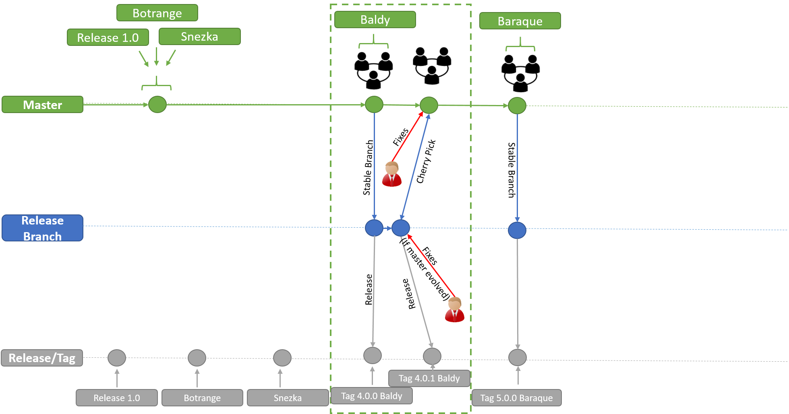
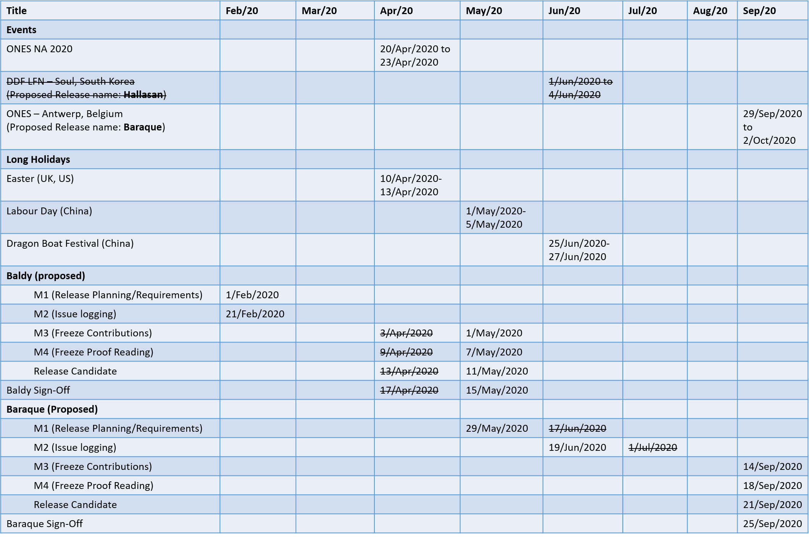

# Common NFVI Telco Taskforce Technical Release Process

## Table of Contents
* [Scope](#scope)
* [Release Model](#releasemodel)
* [Release Delivery Timeline](#timeline)
* [Events](#events)
* [Release Sign-off](#signoff)

## Scope

The scope of this document is to define the release management and its process for planning, scheduling and controlling the build, in addition to proof reading and release deployment. This document defines the release model by organising the git branches and managing the code and other artefacts efficiently in well-structured format.
It should be considered a living document until it is agreed and signed by all the parties.

## Release Model

As a guiding principle, all the development occurs in “Master” branch. All the contribution for the milestone (especially M3) goes into ”Master”. After M4 (Proof Reading), at one point in the release candidate (for now maintain Release Candidate 0) for Baldy and based on experience we shall increase or limit what get into the final release. To make this happen, branch out from “Master”, create a delivery branch (“Baldy”, “Baraque”, etc). Developers can continue their next release branch work in “Master”. At the end of each release, artifacts are “tagged” in GitHub according to the guideline and principles defined.

To deliver a fixes into the latest release, simply apply the fixes on the "master" branch and then cherry pick technique will be applied for a particular PR which would agree jointly and tag it (4.0.1-Baldy). In case, if the "master" has evolved significantly then apply the fixes on the latest release branch directly. As shown in the below diagram.

<b>Figure 1:</b> Specimen Release Model

During the development cycle when working with release branches, developers or architects should open up a “pull request” in GitHub so that team members can see what you are preparing to release.

## Release Delivery Timeline

The table below captured the list of events, long holidays only, release plan and sign off with corresponding dates. The release plan consists of all the milestones associated with the release candidate.

<b>Figure 2:</b> 2020 Release Roadmap

## Events

The list of events for the technical F2F planning captured from LGN events.  
•	ONES NA 2020 (Los Angeles, California) - April 20 & 21. Technical meetings April 22 & 23rd.  
•	LFN DDF (Seoul, South Korea) - June 1-4.  
•	ONES Europe 2020 (Antwerp, Belgium) - September 29 & 30. Technical meetings October 1 & 2.

## Release Sign-off

|   Name and Title of Approver   |   Decision       |    Reason for Rejection      |     Date     |
|--------------------------------|------------------|------------------------------|--------------|
|                                |                  |      &#9744; Approved   &#9744; Rejected  |              |
|                                |                  |      &#9744; Approved   &#9744; Rejected  |              |
|                                |                  |      &#9744; Approved   &#9744; Rejected  |              |

<b>Table 1:</b> Specimen Release Signoff

