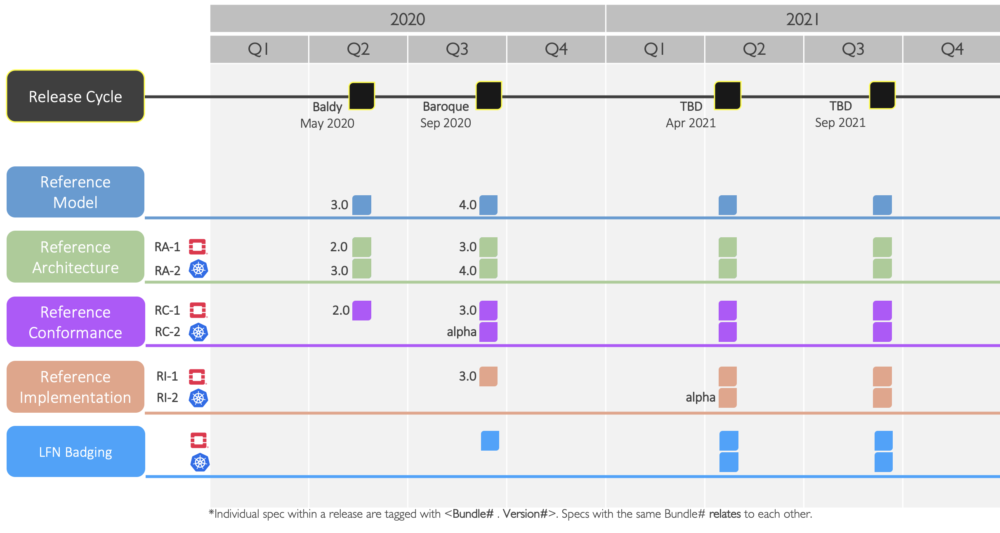

[<< Back](https://cntt-n.github.io/CNTT/)
# Common NFVI Telco Taskforce Roadmap

## Table of Contents
 * [Roadmap](#1)
   * [High Level Roadmap](#1.1)
   * [Detailed Roadmap](#1.2)
 * [Dependencies between various Workstreams ](#2)
 * [Dependencies with Industry Communities](#3)

## Roadmap

### High Level Roadmap

<b>Figure 1:</b> CNTT Technical Specification Roadmap

### Detailed Roadmap
Please refer to individual [release plan](./release_notes/) and features for detailed roadmap.

## Dependencies between various Workstreams

## Dependencies with Industry Communities
