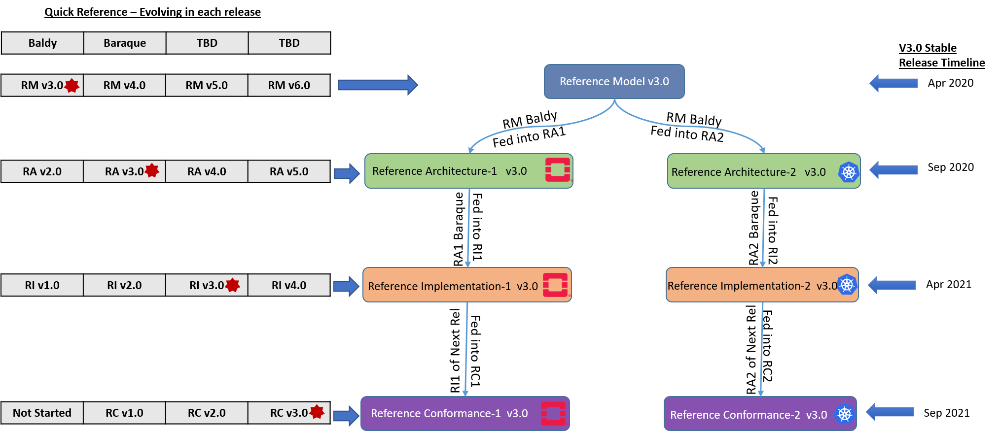

[<< Back](https://cntt-n.github.io/CNTT/)
# Common NFVI Telco Taskforce Roadmap

## Table of Contents
 * [Overview](#1)
 * [Roadmap](#2)
   * [High Level Roadmap](#2.1)
   * [Detailed Roadmap](#2.2)
   * [Detailed Milestones](#2.3)
 * [Dependencies between various Workstreams ](#3)
 * [Dependencies with Industry Communities](#4)

## Overview
* The activities of the CNTT community are articulated around [Projects](#project), [Milestones](#2.3) and [Releases](#release).
* CNTT is embracing simultaneous delivery model, meaning that all contributing projects have to follow the cadence and intermediate milestones.
* CNTT is single-release vehicle for all projects.
* The CNTT current release plan is available [here](./release_notes/release_process.md).

<b>Figure 1:</b> Milestones

**Definitions**

A project is:
  * Long term endeavour setup to deliver features across multiple releases as shown [here](./release_notes/)
  * Led by leads/co-leads, contributors and committers with expertise in the relevant areas
  * Scripted and documented in repositories
  

A Release is:
  * Short term endeavour setup to deliver a specific features/functionalities as shown [here](./release_notes/baldy.md).
  * An agreed common framework (template, criteria, best practice) for all projects
  * An unique release planning calendar with pre-defined milestones for each project
  * A vehicle to coordinate multiple projects and multiple type of projects (reference model and architecture, documentation, integration, packaging, deployment)
  

## Roadmap

### High Level Roadmap

<b>Figure 2:</b> CNTT Technical Specification Roadmap

### Detailed Roadmap
Please refer to individual [release plan](./release_notes/) and features for detailed roadmap.

### Detailed Milestones
| Review | Milestone | Description | Activities | Comments |
|--------|-----------|--------------|------------|---------|
| Kick-Off | M0 | The goal of the release Kick-Off is to open the innovation platform to participate in the CNTT release. Release Kick-Off review takes place for each release. | Identify a list of features and functionality will be documented and developed. | |
| Planning | M1 | The goal of the Release Planning review is to ensure the plan is complete, sufficient, and aligned with release milestones. All people resources are identified, documented and committed. | Identify what is in or out of scope. During the development phase, it helps reduce the discussion. Highlight the issues to TSC. | |
| Github Issue Logging Freeze | M2 | The goal of the Issue Logging Freeze is to mark the end of adding new issues in the Release. |  All the project leads authorise the issues are correctly labelled, mapped to the corresponding project and milestone, etc., | |
| Contribution Freeze | M3 | The goal of the Contribution Freeze is to mark the end of the features documented and provided the resolution for all impacting defects. After Contribution Freeze, there will be no new features/functionalities are allowed into the current release. Only the critical fixes are allowed. | All the project leads review the document and ensure all the planned features are documented and fixes are available before end of the contribution freeze. | |
| Proof Reading | M4 | The goal of the Proof Reading is to carefully review and validate the contents and check for errors in the document before it is released. This is the final and last stage of the milestone. | | |
| Release Candidate | RC0 | The goal of the Release Candidate is to ensure the documentations are properly aligned, fully reviewed in the new release branch. | Prioritise the required fixes and address them. If there are any critical fixes required then the fixes will be provided and it will be tagged with minor release. (Eg. Baldy 4.0.1). | |
| Release Sign-Off | | The goal of the Release Sign-Off review is to ensure all the projects are successfully passed all the review. All the committed deliverables are available and passed the quality criteria. | | |

<b>Table 1:</b> Detailed Milestones

## Dependencies between various Workstreams

The various workstreams in CNTT are 
- Reference Model (RM)
- Reference Architecture (RA)
- Reference Implementation (RI) 
- Reference Conformance (RC)

The workstream dependency relationship in simple terms, [Reference Conformance](../ref_cert) verifies and tests the [Reference Implementation](../ref_impl) which follows the requirements and architecture defined in the CNTT [Reference Architecture](../ref_arch) and Reference Architecture describes the high level system components and its interactions by adhering to the requirements and expectations set by the CNTT [Reference Model](../ref_model) which sets the standards for infrastructure abstraction, compliance and verification. 

For the standard release stabilisation, the pattern in each release follows RM must be the advanced version of RA. Similarly RA must be the advanced version of RI and simultaneously for RC.

There are two different tracks in CNTT
- Virtualized workloads, deployed on OpenStack
- Containerized workloads, deployed on Kubernetes
- OpenStack based
- Kubernetes based

Each track follows the industry driven standards in the Reference Model as depicted in the below diagram.

 
<b>Figure 3:</b> CNTT Stable 3.0 Portrait

## Dependencies with Industry Communities

The CNTT is collaboratively working with other standard bodies within the Open Source industry. Some of the projects are 
- OpenStack
- Kubernetes
- OPNFV
- ONAP
- CNCF
- ESTI NFV ISG

The OpenStack based work stream in CNTT community works closely with OPNFV by leveraging and evolving OPNFV continuous integration pipeline with automation installer and testing capabilities. The Reference Implementation (RI1) has dependencies with other industry communities like OPNFV as shown [here](../ref_impl/cntt-ri/chapters/chapter01.md#1.3) and OVP as shown [here](../ref_impl/cntt-ri/chapters/chapter01.md#1.3). For information on the relationship to other communities, please read [Reference Implementation Chapter 01](../ref_impl/cntt-ri/chapters/chapter01.md#1.3). 

<b>Figure 4:</b> Relation to other communities.

TODO: Placeholder for RI2 dependency diagram

The Kubernetes based work stream in CNTT community works closely with CNCF by leveraging and evolving Kubernetes-based CNF continuous integration pipeline with automation installer and testing capabilities. 
